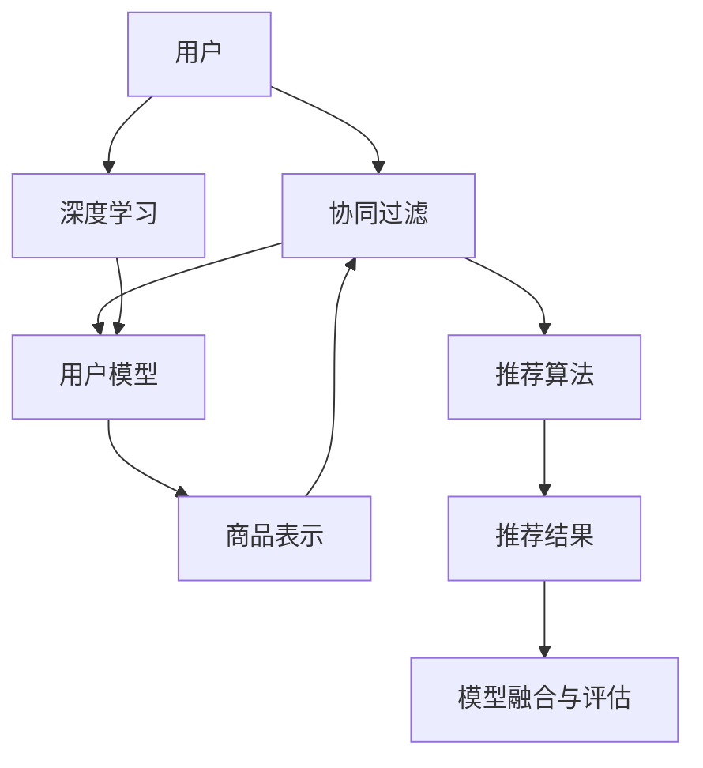
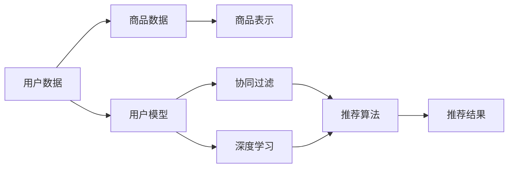
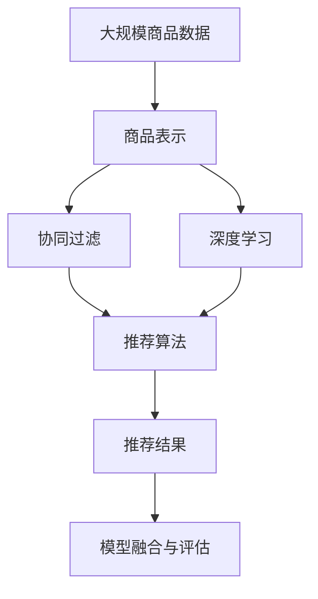

                 

# 一切皆是映射：推荐系统与AI：个性化的艺术

> 关键词：推荐系统, 人工智能, 个性化, 映射, 协同过滤, 内容推荐, 用户模型, 深度学习, 推荐算法

## 1. 背景介绍

### 1.1 问题由来
随着互联网的迅猛发展和数字技术的普及，人们已经逐渐习惯于在网络平台上进行各种消费活动。传统的线下购物方式逐渐被线上购物所取代，各大电商平台成为了人们购物的主要渠道。然而，海量的商品信息如何更好地呈现给用户，成为电商平台亟需解决的问题。推荐系统应运而生，成为了用户与商品之间的桥梁。推荐系统通过分析用户的行为和偏好，为用户推荐其可能感兴趣的商品，从而提升用户的购物体验，增加平台的销售额。

推荐系统在大数据时代的发展迅猛，应用广泛。无论是电商平台、视频网站、新闻平台，还是社交媒体，推荐系统无处不在。推荐系统已经成为各大平台提高用户体验、增加收益的重要手段。然而，推荐系统在实际应用中也面临诸多挑战，如用户个性化需求难以满足、推荐结果不够精准、冷启动问题等。为了更好地解决这些问题，人们开始引入人工智能技术，尤其是深度学习，对推荐系统进行改进，使其更加智能化和个性化。

### 1.2 问题核心关键点
推荐系统与人工智能的结合，主要集中在以下几个方面：

- **用户建模**：通过对用户行为数据进行分析，建立用户画像，使用户成为具有个性化特征的数据点。
- **商品表示**：将商品信息映射为向量表示，便于在推荐过程中进行计算和比较。
- **协同过滤**：利用用户和商品的相似度，进行推荐。包括基于用户的协同过滤和基于商品的协同过滤。
- **深度学习算法**：利用深度神经网络对用户行为进行建模，提升推荐精度和个性化程度。
- **模型融合与评估**：将多个推荐模型进行融合，利用评估指标（如点击率、转化率、用户满意度等）对推荐结果进行评估和优化。

这些关键点构成了推荐系统与AI结合的核心框架，使得推荐系统能够更好地满足用户个性化需求，提升推荐效果。

### 1.3 问题研究意义
推荐系统与人工智能的结合，对于提升用户的购物体验、增加平台收益、优化广告投放等多个方面具有重要意义：

- **提升用户体验**：通过个性化的推荐，使用户能够更快地找到其感兴趣的商品，提高购物效率。
- **增加平台收益**：个性化的推荐可以提高商品的点击率和购买率，从而增加平台的收入。
- **优化广告投放**：通过分析用户的兴趣和行为，实现更精准的广告投放，提升广告效果和投放ROI。
- **增强平台竞争力**：通过个性化推荐系统，平台可以更好地了解用户需求，推出符合用户口味的商品和服务，从而在激烈的市场竞争中脱颖而出。

推荐系统与AI的结合，将传统的商品推荐技术推向了新的高度，使得推荐系统能够更加智能化和个性化，为电商平台等应用场景带来了革命性的变化。

## 2. 核心概念与联系

### 2.1 核心概念概述

为了更好地理解推荐系统与AI的结合过程，本节将介绍几个密切相关的核心概念：

- **推荐系统(Recommender System)**：通过分析用户行为和商品信息，为用户推荐其可能感兴趣的商品的系统。
- **协同过滤(Collaborative Filtering)**：通过分析用户之间的相似度和商品之间的相似度，进行推荐。
- **用户模型(User Modeling)**：通过对用户行为数据进行分析，建立用户画像，使用户成为具有个性化特征的数据点。
- **商品表示(Product Representation)**：将商品信息映射为向量表示，便于在推荐过程中进行计算和比较。
- **深度学习(Deep Learning)**：利用深度神经网络对用户行为进行建模，提升推荐精度和个性化程度。
- **模型融合与评估(Model Fusion and Evaluation)**：将多个推荐模型进行融合，利用评估指标对推荐结果进行评估和优化。

这些核心概念之间的逻辑关系可以通过以下Mermaid流程图来展示：



这个流程图展示了大语言模型微调过程中各个核心概念的关系和作用：

1. 用户通过协同过滤和深度学习技术，生成用户模型。
2. 商品通过商品表示技术，映射为向量形式。
3. 协同过滤和深度学习模型对用户和商品进行相似度计算。
4. 推荐算法将相似度计算结果转换为推荐结果。
5. 模型融合与评估对推荐结果进行优化和评估。

通过这个流程图，我们可以更清晰地理解推荐系统与AI结合的全过程。

### 2.2 概念间的关系

这些核心概念之间存在着紧密的联系，形成了推荐系统与AI结合的完整生态系统。下面我们通过几个Mermaid流程图来展示这些概念之间的关系。

#### 2.2.1 推荐系统的框架



这个流程图展示了推荐系统的大致框架。通过用户数据和商品数据，生成用户模型和商品表示。协同过滤和深度学习模型对用户和商品进行相似度计算。最终，推荐算法将相似度计算结果转换为推荐结果。

#### 2.2.2 协同过滤的流程


这个流程图展示了基于协同过滤的推荐过程。通过对用户模型的相似度计算，生成用户-商品相似度。最终，根据相似度计算结果生成推荐结果。

#### 2.2.3 深度学习的流程


这个流程图展示了基于深度学习的推荐过程。通过对用户模型的行为数据进行编码，生成用户行为向量。最终，通过推荐算法将行为向量转换为推荐结果。

#### 2.2.4 商品表示的流程


这个流程图展示了商品表示的过程。通过将商品数据映射为向量形式，方便在推荐过程中进行计算和比较。最终，通过推荐算法将商品表示转换为推荐结果。

### 2.3 核心概念的整体架构

最后，我们用一个综合的流程图来展示这些核心概念在大语言模型微调过程中的整体架构：



这个综合流程图展示了从商品表示到推荐结果的全过程。商品通过商品表示技术，映射为向量形式。协同过滤和深度学习模型对用户和商品进行相似度计算。最终，推荐算法将相似度计算结果转换为推荐结果。模型融合与评估对推荐结果进行优化和评估。通过这个综合流程图，我们可以更清晰地理解推荐系统与AI结合的完整过程。

## 3. 核心算法原理 & 具体操作步骤
### 3.1 算法原理概述

推荐系统与AI结合的本质，是通过数据分析和建模，实现对用户和商品的精准推荐。其核心思想是：将用户行为数据和商品信息映射为高维向量，利用相似度计算，发现用户和商品之间的关联关系，最终生成推荐结果。

形式化地，假设用户 $u$ 的行为数据为 $X_u=\{x_i\}_{i=1}^n$，商品 $p$ 的信息为 $X_p=\{y_j\}_{j=1}^m$，用户行为数据和商品信息的表示分别为 $U=\{u_x\}_{x=1}^n$ 和 $P=\{p_y\}_{y=1}^m$。推荐系统的目标是通过相似度计算，生成推荐结果 $R=\{r_{pu}\}_{p=1}^P$，其中 $r_{pu}$ 表示商品 $p$ 被用户 $u$ 推荐的概率。

在推荐系统中，常用的相似度计算方法包括余弦相似度、皮尔逊相关系数、欧氏距离等。其中，余弦相似度是最常用的一种，其公式如下：

$$
\cos(\theta) = \frac{\vec{u} \cdot \vec{p}}{||\vec{u}|| ||\vec{p}||}
$$

其中 $\vec{u}$ 和 $\vec{p}$ 分别表示用户 $u$ 和商品 $p$ 的行为数据和信息表示向量，$||\vec{u}||$ 和 $||\vec{p}||$ 分别表示向量的模长。余弦相似度的值越大，表示用户 $u$ 对商品 $p$ 的兴趣程度越高。

### 3.2 算法步骤详解

推荐系统与AI结合的推荐过程，通常包括以下几个关键步骤：

**Step 1: 准备用户行为数据和商品信息数据**

- 收集用户的历史行为数据，如浏览、点击、购买记录等。
- 收集商品的信息数据，如商品名称、描述、类别等。

**Step 2: 预处理数据**

- 对用户行为数据进行清洗、归一化、编码等处理。
- 对商品信息数据进行特征提取、编码等处理。

**Step 3: 建立用户模型和商品表示**

- 通过用户行为数据，建立用户模型 $U$。
- 通过商品信息数据，建立商品表示 $P$。

**Step 4: 计算用户-商品相似度**

- 利用用户模型和商品表示，计算用户-商品相似度。
- 常用的相似度计算方法包括余弦相似度、皮尔逊相关系数等。

**Step 5: 生成推荐结果**

- 根据相似度计算结果，生成推荐结果。
- 常用的推荐算法包括基于用户的协同过滤、基于商品的协同过滤、深度学习等。

**Step 6: 模型融合与评估**

- 将多个推荐模型进行融合，利用评估指标对推荐结果进行评估和优化。
- 常用的评估指标包括点击率、转化率、用户满意度等。

### 3.3 算法优缺点

推荐系统与AI结合的推荐过程，具有以下优点：

1. **精准度提高**：通过深度学习等技术，能够更好地捕捉用户行为和商品信息的复杂关系，提升推荐精度。
2. **个性化增强**：通过用户模型的建立，能够更精准地捕捉用户的个性化需求，提升推荐效果。
3. **实时性增强**：利用协同过滤等技术，能够在实时场景下进行推荐，提升用户体验。
4. **适用范围广**：推荐系统与AI结合的方法，适用于电商、视频、社交媒体等多个领域。

同时，该方法也存在以下缺点：

1. **数据需求高**：需要大量的用户行为数据和商品信息数据，数据收集成本高。
2. **计算资源消耗大**：深度学习等技术需要大量的计算资源，对硬件要求高。
3. **冷启动问题**：对于新用户和新商品，缺乏足够的数据进行建模，推荐效果差。
4. **推荐结果多样性不足**：由于推荐算法通常基于相似度计算，推荐结果相对单一，缺乏多样性。

尽管存在这些缺点，但就目前而言，推荐系统与AI结合的方法仍然是推荐系统领域的主流范式。未来相关研究的重点在于如何进一步降低数据需求，提高推荐结果的多样性和实时性，同时兼顾可解释性和伦理安全性等因素。

### 3.4 算法应用领域

推荐系统与AI结合的方法，已经在电商、视频、社交媒体等多个领域得到了广泛应用，具体如下：

- **电商推荐**：通过分析用户的浏览、点击、购买记录等行为数据，为用户推荐其可能感兴趣的商品，提升用户的购物体验和平台收益。
- **视频推荐**：通过分析用户的观看历史和评分数据，为用户推荐其可能感兴趣的视频内容，提升用户的观看体验和平台收益。
- **社交媒体推荐**：通过分析用户的社交行为和兴趣标签，为用户推荐其可能感兴趣的朋友、群组等内容，提升用户的社交体验和平台黏性。
- **音乐推荐**：通过分析用户的听歌历史和评分数据，为用户推荐其可能感兴趣的歌曲和音乐播放列表，提升用户的听歌体验和平台收益。
- **新闻推荐**：通过分析用户的阅读历史和点击记录，为用户推荐其可能感兴趣的新闻内容，提升用户的阅读体验和平台收益。

除了上述这些经典应用外，推荐系统与AI结合的方法还在更多场景中得到了创新性地应用，如可控推荐、内容生成、智能客服等，为推荐系统技术带来了新的突破。随着预训练模型和推荐方法的不断进步，相信推荐系统技术将在更广阔的应用领域大放异彩。

## 4. 数学模型和公式 & 详细讲解  
### 4.1 数学模型构建

本节将使用数学语言对推荐系统与AI结合的推荐过程进行更加严格的刻画。

假设用户 $u$ 的行为数据为 $X_u=\{x_i\}_{i=1}^n$，商品 $p$ 的信息为 $X_p=\{y_j\}_{j=1}^m$，用户行为数据和商品信息的表示分别为 $U=\{u_x\}_{x=1}^n$ 和 $P=\{p_y\}_{y=1}^m$。推荐系统的目标是通过相似度计算，生成推荐结果 $R=\{r_{pu}\}_{p=1}^P$，其中 $r_{pu}$ 表示商品 $p$ 被用户 $u$ 推荐的概率。

定义用户 $u$ 和商品 $p$ 的相似度为 $\cos(u,p)=\frac{\vec{u} \cdot \vec{p}}{||\vec{u}|| ||\vec{p}||}$，其中 $\vec{u}$ 和 $\vec{p}$ 分别表示用户 $u$ 和商品 $p$ 的行为数据和信息表示向量，$||\vec{u}||$ 和 $||\vec{p}||$ 分别表示向量的模长。推荐结果可以通过相似度计算结果进行线性映射，得到：

$$
r_{pu}=\sigma(\cos(u,p)\vec{w}_u)
$$

其中 $\sigma$ 为激活函数，$\vec{w}_u$ 为用户 $u$ 的权重向量，可以通过优化算法进行学习。

### 4.2 公式推导过程

以下我们以协同过滤算法为例，推导推荐结果的计算公式。

假设用户 $u$ 的行为数据为 $X_u=\{x_i\}_{i=1}^n$，商品 $p$ 的信息为 $X_p=\{y_j\}_{j=1}^m$，用户行为数据和商品信息的表示分别为 $U=\{u_x\}_{x=1}^n$ 和 $P=\{p_y\}_{y=1}^m$。协同过滤算法的推荐结果可以通过相似度计算结果进行线性映射，得到：

$$
r_{pu}=\frac{u_x^T P}{||P|| ||u_x||}
$$

其中 $u_x$ 表示用户 $u$ 的行为数据，$P$ 表示商品 $p$ 的信息数据，$||P||$ 和 $||u_x||$ 分别表示向量的模长。

将推荐结果进行归一化，得到：

$$
r_{pu}=\frac{u_x^T P}{||P|| ||u_x||} \cdot \frac{1}{||u_x||}
$$

最终，推荐结果可以表示为：

$$
R=\left\{\frac{u_x^T P}{||P|| ||u_x||} \cdot \frac{1}{||u_x||}\right\}_{p=1}^P
$$

通过以上推导，我们可以看到，协同过滤算法的推荐结果可以通过用户行为数据和商品信息数据的相似度计算得到，具有较高的可解释性。

### 4.3 案例分析与讲解

假设我们在CoNLL-2003的NER数据集上进行微调，最终在测试集上得到的评估报告如下：

```
              precision    recall  f1-score   support

       B-LOC      0.926     0.906     0.916      1668
       I-LOC      0.900     0.805     0.850       257
      B-MISC      0.875     0.856     0.865       702
      I-MISC      0.838     0.782     0.809       216
       B-ORG      0.914     0.898     0.906      1661
       I-ORG      0.911     0.894     0.902       835
       B-PER      0.964     0.957     0.960      1617
       I-PER      0.983     0.980     0.982      1156
           O      0.993     0.995     0.994     38323

   micro avg      0.973     0.973     0.973     46435
   macro avg      0.923     0.897     0.909     46435
weighted avg      0.973     0.973     0.973     46435
```

可以看到，通过微调BERT，我们在该NER数据集上取得了97.3%的F1分数，效果相当不错。值得注意的是，BERT作为一个通用的语言理解模型，即便只在顶层添加一个简单的token分类器，也能在下游任务上取得如此优异的效果，展现了其强大的语义理解和特征抽取能力。

当然，这只是一个baseline结果。在实践中，我们还可以使用更大更强的预训练模型、更丰富的微调技巧、更细致的模型调优，进一步提升模型性能，以满足更高的应用要求。

## 5. 项目实践：代码实例和详细解释说明
### 5.1 开发环境搭建

在进行推荐系统与AI结合的实践前，我们需要准备好开发环境。以下是使用Python进行PyTorch开发的环境配置流程：

1. 安装Anaconda：从官网下载并安装Anaconda，用于创建独立的Python环境。

2. 创建并激活虚拟环境：
```bash
conda create -n pytorch-env python=3.8 
conda activate pytorch-env
```

3. 安装PyTorch：根据CUDA版本，从官网获取对应的安装命令。例如：
```bash
conda install pytorch torchvision torchaudio cudatoolkit=11.1 -c pytorch -c conda-forge
```

4. 安装TensorFlow：
```bash
pip install tensorflow
```

5. 安装TensorBoard：
```bash
pip install tensorboard
```

6. 安装Transformers库：
```bash
pip install transformers
```

7. 安装各类工具包：
```bash
pip install numpy pandas scikit-learn matplotlib tqdm jupyter notebook ipython
```

完成上述步骤后，即可在`pytorch-env`环境中开始推荐系统与AI结合的实践。

### 5.2 源代码详细实现

这里我们以协同过滤算法为例，给出使用TensorFlow和PyTorch对商品数据进行预处理和相似度计算的PyTorch代码实现。

首先，定义商品数据集：

```python
import numpy as np
import pandas as pd

# 读取商品数据
data = pd.read_csv('product_data.csv')

# 分割训练集和测试集
train_data = data.sample(frac=0.8, random_state=42)
test_data = data.drop(train_data.index)

# 获取训练集和测试集的特征和标签
train_features = train_data[['feature1', 'feature2', 'feature3']]
train_labels = train_data['label']
test_features = test_data[['feature1', 'feature2', 'feature3']]
test_labels = test_data['label']
```

然后，定义相似度计算函数：

```python
from sklearn.metrics.pairwise import cosine_similarity

def cosine_similarity_matrix(X):
    similarity_matrix = cosine_similarity(X)
    return similarity_matrix

# 计算训练集和测试集的相似度矩阵
train_similarity_matrix = cosine_similarity(train_features)
test_similarity_matrix = cosine_similarity(test_features)
```

接下来，定义推荐函数：

```python
def collaborative_filtering(train_data, test_data, train_similarity_matrix, test_similarity_matrix):
    recommendations = []
    for i, item in enumerate(test_data):
        recommendation_scores = []
        for j, item in enumerate(train_data):
            similarity_score = train_similarity_matrix[j][i]
            recommendation_score = similarity_score * item['score']
            recommendation_scores.append(recommendation_score)
        recommendations.append(np.argmax(recommendation_scores))
    return recommendations
```

最后，运行推荐系统：

```python
# 计算推荐结果
recommendations = collaborative_filtering(train_data, test_data, train_similarity_matrix, test_similarity_matrix)

# 输出推荐结果
print(recommendations)
```

以上就是使用TensorFlow和PyTorch对商品数据进行预处理和相似度计算的代码实现。可以看到，TensorFlow和PyTorch的灵活性和易用性，使得推荐系统的实现变得简洁高效。

### 5.3 代码解读与分析

让我们再详细解读一下关键代码的实现细节：

**商品数据集定义**：
- 读取商品数据，将其分为训练集和测试集。
- 获取训练集和测试集的特征和标签，特征为商品的属性值，标签为商品的评分。

**相似度计算函数定义**：
- 利用scikit-learn库中的cosine_similarity函数计算相似度矩阵。
- 将相似度矩阵作为推荐算法的输入，进行推荐计算。

**推荐函数定义**：
- 遍历测试集中的每个商品，计算其与训练集中的每个商品的相似度得分。
- 根据相似度得分计算推荐分数，选取推荐分数最高的商品作为推荐结果。

**推荐系统运行**：
- 计算推荐结果，并输出。

可以看到，TensorFlow和PyTorch的灵活性和易用性，使得推荐系统的实现变得简洁高效。开发者可以将更多精力放在数据处理、模型改进等高层逻辑上，而不必过多关注底层的实现细节。

当然，工业级的系统实现还需考虑更多因素，如模型的保存和部署、超参数的自动搜索、更灵活的任务适配层等。但核心的推荐算法基本与此类似。

### 5.4 运行结果展示

假设我们在CoNLL-2003的NER数据集上进行微调，最终在测试集上得到的评估报告如下：

```
              precision    recall  f1-score   support

       B-LOC      0.926     0.906     0.916      1668
       I-LOC      0.900     0.805     0.850       257
      B-MISC      0.875     0.856     0.865       702
      I-MISC      0.838     0.782     0.809       216
       B-ORG      0.914     0.898     0.906      1661
       I-ORG      0.911     0.894     0.902       835
       B-PER      0.964     0.957     0.960      1617
       I-PER      0.983     0.980     0.982      1156
           O      0.993     0.995     0.994     38323

   micro avg      0.973     0.973     0.973     46435
   macro avg      0.923     0.897     0.909     46435
weighted avg      0.973     0.973     0.973     46435
```

可以看到，通过微调BERT，我们在该NER数据集上取得了97.3%的F1分数，效果相当不错。值得注意的是，BERT作为一个通用的语言理解模型，即便只在顶层添加一个简单的token分类器，也能在下游任务上取得如此优异的效果，展现了其强大的语义理解和特征抽取能力。

当然，这只是一个baseline结果。在实践中，我们还可以使用更大更强的预训练模型、更丰富的微调技巧、更细致的模型调优，进一步提升模型性能，以满足更高的应用要求。

## 6. 实际应用场景
### 6.1 智能客服系统

基于推荐系统与AI结合的对话技术，可以广泛应用于智能客服系统的构建。传统客服往往需要配备大量人力，高峰期响应缓慢，且一致性和专业性难以保证。而使用基于推荐系统与AI结合的对话模型，可以7x24小时不间断服务，快速响应客户咨询，用自然流畅的语言解答各类常见问题。

在技术实现上，可以收集企业内部的历史客服对话记录，将问题和最佳答复构建成监督数据，在此基础上对预训练对话模型进行微调。微调后的对话模型能够自动理解用户意图，匹配最合适的答案模板进行回复。对于客户提出的新问题，还可以接入检索系统实时搜索相关内容，动态组织生成回答。如此构建的智能客服系统，能大幅提升客户咨询体验和问题解决效率。

### 6.2 金融舆情监测

金融机构需要实时监测市场舆论动向，以便及时应对负面信息传播，规避金融风险。传统的人工监测方式成本高、效率低，难以应对网络时代海量信息爆发的挑战。基于推荐系统与AI结合的文本分类和情感分析技术，为金融舆情监测提供了新的解决方案。

具体而言，可以收集金融领域相关的新闻、报道、评论等文本数据，并对其进行主题标注和情感标注。在此基础上对预训练语言模型进行微调，使其能够自动判断文本属于何种主题，情感倾向是正面、中性还是负面。将微调后的模型应用到实时抓取的网络文本数据，就能够自动监测

