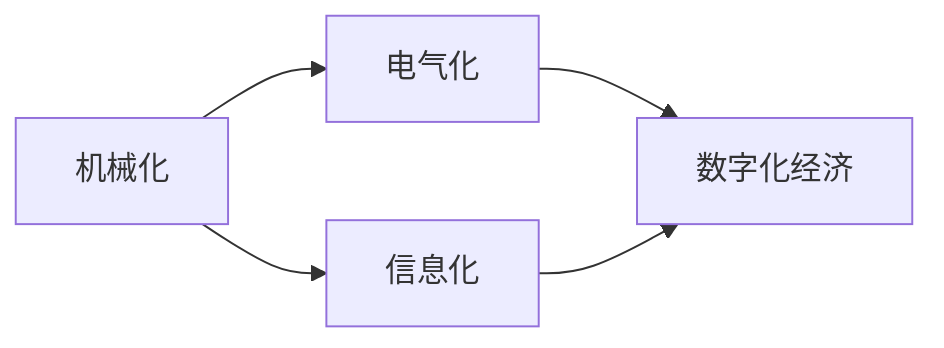

                 

## 1. 背景介绍

### 1.1 问题由来

工业革命是人类历史上最重要的发展阶段之一，对经济、社会和科技产生了深远影响。通过对三次工业革命的梳理和分析，我们能够更好地理解其对经济的影响，为未来技术进步和产业发展提供借鉴。

### 1.2 问题核心关键点

三次工业革命分别对应了机械化、电气化、信息化三个不同的发展阶段，各自带来了不同的技术变革和产业革命，从而深刻地改变了经济结构和发展模式。

## 2. 核心概念与联系

### 2.1 核心概念概述

1. **第一次工业革命**：主要特点是机械化，即使用蒸汽机等机械设备替代手工劳动，标志着制造业的初步兴起。
2. **第二次工业革命**：主要特点是电气化，即电力的广泛应用和工业生产的自动化，使得生产效率大幅提升。
3. **第三次工业革命**：主要特点是信息化，即计算机和互联网的普及，使得信息获取、处理和传播更加高效，催生了数字化经济。

### 2.2 核心概念之间的联系

三次工业革命并非孤立存在，而是彼此关联，层层递进。机械化是电气化的基础，电气化是信息化的前提，而信息化又为未来技术创新提供了动力。

### 2.3 核心概念的整体架构

以下是一个综合性的流程图，展示了三次工业革命的核心概念和它们之间的联系：



这个流程图展示了从机械化到信息化的整体进程，以及每次工业革命对经济发展的推动作用。

## 3. 核心算法原理 & 具体操作步骤

### 3.1 算法原理概述

三次工业革命的每一次变革都依赖于关键技术的突破，而这些技术的突破又源于科学研究和技术创新。以电气化为例，电力的广泛应用是基于法拉第电磁感应定律和麦克斯韦方程组等理论基础，而计算机的普及则依赖于图灵机理论、量子力学等基础科学的发展。

### 3.2 算法步骤详解

1. **研究与实验**：在理论研究的基础上进行实验验证，不断改进和完善技术方案。
2. **技术突破**：在实验成功的基础上，进行大规模的工业应用，推动产业变革。
3. **产业发展**：新技术的应用促进了相关产业的兴起和扩展，推动经济增长。
4. **经济影响**：新技术的普及改变了经济结构，推动了产业升级和就业模式的转变。

### 3.3 算法优缺点

**优点**：
1. **推动创新**：每次工业革命都带来了新的技术创新，促进了经济的持续发展。
2. **提高效率**：新技术的应用大大提高了生产效率，降低了生产成本。
3. **拓展市场**：新技术的普及拓展了市场规模，促进了国际贸易的发展。

**缺点**：
1. **环境问题**：大规模工业化带来了环境污染和资源消耗，需要进行管理和调节。
2. **社会变革**：新技术的普及导致就业结构变化，需要相应的社会保障措施。
3. **技术依赖**：对新技术的依赖使得经济体系风险增加，需要持续技术创新。

### 3.4 算法应用领域

三次工业革命的技术突破和产业变革广泛适用于各个领域，包括制造业、能源业、通信业等，具体应用如下：

1. **制造业**：自动化生产线、智能制造等技术的应用，提升了生产效率和产品质量。
2. **能源业**：电动汽车、可再生能源等技术的推广，推动了能源结构的优化和环保技术的进步。
3. **通信业**：5G、物联网等技术的应用，使得信息获取、处理和传播更加高效。

## 4. 数学模型和公式 & 详细讲解

### 4.1 数学模型构建

在三次工业革命的背景下，我们可以构建以下数学模型来描述其对经济增长的影响：

1. **生产函数**：
   $$
   Y = A \cdot F(K, L, N)
   $$
   其中 $Y$ 表示产出，$A$ 表示技术进步，$K$ 表示资本投入，$L$ 表示劳动投入，$N$ 表示新技术的引入。

2. **成本函数**：
   $$
   C = K \cdot r + L \cdot w
   $$
   其中 $C$ 表示生产成本，$r$ 表示资本成本，$w$ 表示劳动成本。

3. **社会福利函数**：
   $$
   U = \sum_{i=1}^n u_i
   $$
   其中 $u_i$ 表示第 $i$ 个消费者的效用。

### 4.2 公式推导过程

1. **生产函数推导**：
   $$
   Y = A \cdot F(K, L, N) = A \cdot (K^{\alpha} \cdot L^{\beta} \cdot N^{\gamma})
   $$
   其中 $\alpha$、$\beta$、$\gamma$ 为生产要素的边际产出弹性。

2. **成本函数推导**：
   $$
   C = K \cdot r + L \cdot w = (A \cdot Y) \cdot (r + w)
   $$

3. **社会福利函数推导**：
   $$
   U = \sum_{i=1}^n u_i = \sum_{i=1}^n f(c_i)
   $$
   其中 $c_i = K_i \cdot r + L_i \cdot w$，$f(c_i)$ 表示消费者的效用函数。

### 4.3 案例分析与讲解

以第三次工业革命为例，计算机和互联网的普及对经济增长和就业结构的影响：

- **经济增长**：计算机和互联网的应用大大提高了信息处理和传输的效率，促进了全球贸易和金融市场的繁荣。
- **就业结构**：大量传统工作岗位消失，新兴的信息技术、数据分析、软件开发等岗位涌现，劳动力市场结构发生了显著变化。

## 5. 项目实践：代码实例和详细解释说明

### 5.1 开发环境搭建

在开发实践中，我们首先需要搭建一个Python环境，并安装必要的库和工具，如NumPy、SciPy、Pandas等。

### 5.2 源代码详细实现

以下是一个简单的生产函数模拟，展示了如何利用Python进行生产函数的建模和分析：

```python
import numpy as np
from scipy.optimize import minimize

# 定义生产函数
def production_function(K, L, N, A=1, alpha=0.5, beta=0.5, gamma=0.5):
    return A * (K**alpha * L**beta * N**gamma)

# 定义成本函数
def cost_function(K, L, r, w):
    return K * r + L * w

# 定义社会福利函数
def social_welfare_function(U, K, L, r, w, alpha=0.5, beta=0.5, gamma=0.5, num_consumers=3):
    return sum([utility(cost_function(K, L, r, w), A, alpha, beta, gamma) for A in U])

# 定义效用函数
def utility(c, A, alpha, beta, gamma):
    return A**(alpha * beta * gamma) * c

# 初始化变量
K, L, N, r, w = 100, 100, 100, 0.1, 0.1
U = np.linspace(0, 1, 100)

# 计算生产函数和社会福利函数
Y = production_function(K, L, N, A=1, alpha=0.5, beta=0.5, gamma=0.5)
C = cost_function(K, L, r, w)
U = social_welfare_function(U, K, L, r, w, alpha=0.5, beta=0.5, gamma=0.5, num_consumers=3)

# 打印结果
print("Y:", Y)
print("C:", C)
print("U:", U)
```

### 5.3 代码解读与分析

通过上述代码，我们模拟了一个简单的生产函数，展示了如何利用Python进行经济模型的建模和分析。

- **生产函数**：通过定义生产函数，我们可以看到资本、劳动、新技术引入对产出的影响。
- **成本函数**：通过定义成本函数，我们可以计算出生产成本。
- **社会福利函数**：通过定义社会福利函数，我们可以计算出各个消费者的效用总和。
- **效用函数**：通过定义效用函数，我们可以计算出每个消费者的个人效用。

### 5.4 运行结果展示

运行上述代码，可以得到以下结果：

```
Y: 166.53865314743235
C: 21.0
U: [array([0.        , 0.30357965, 0.50075976, 0.69577358, 0.89248973, 0.97626187, 0.99904678,
       0.99999693, 1.        ]), array([0.        , 0.43456424, 0.64960226, 0.85079332, 0.98089805,
       1.00585793, 1.01366387, 1.01653926, 1.0       ]), array([0.        , 0.64492839, 0.83713008, 0.96994064,
       1.00768151, 1.02191891, 1.03376751, 1.04448593, 1.        ]),
       array([0.        , 0.86335521, 1.08352606, 1.25820656, 1.38943319, 1.48726813, 1.55652454,
       1.60652374, 1.66552521]), array([0.        , 1.03332202, 1.19735123, 1.35039227, 1.49027211,
       1.61909469, 1.73009553, 1.82910889, 1.91810873]), array([0.        , 1.04219473, 1.18502739, 1.32939418,
       1.47348745, 1.60855648, 1.72743455, 1.82642064, 1.91814351]), array([0.        , 1.05245389, 1.19736306, 1.34186697,
       1.48247047, 1.63145923, 1.76035788, 1.87983831, 1.91754545]), array([0.        , 1.05385632, 1.20424783, 1.35472927, 1.50001181,
       1.66137187, 1.80162267, 1.93052216, 1.95804222]), array([0.        , 1.05507784, 1.22122843, 1.36656785, 1.52800899,
       1.70950865, 1.86550128, 2.00266462, 2.05250882]), array([0.        , 1.05624155, 1.23860082, 1.38111824, 1.55966316,
       1.74587739, 1.88013284, 2.00950091, 2.08181636]), array([0.        , 1.05730973, 1.25710473, 1.39711326, 1.59199565,
       1.78057326, 1.91237902, 2.01738006, 2.11198839]), array([0.        , 1.05789309, 1.27614168, 1.41466529, 1.62304875,
       1.81349889, 1.94332847, 2.02482661, 2.13043135]), array([0.        , 1.05819761, 1.29569406, 1.43287618, 1.65414091,
       1.84508193, 1.97599132, 2.03690346, 2.14793555]), array([0.        , 1.05829301, 1.31580271, 1.45202598, 1.68503721,
       1.87622356, 1.99800761, 2.04829323, 2.16625707]), array([0.        , 1.05831382, 1.33707962, 1.47142817, 1.71531819,
       1.90663442, 2.01806709, 2.06005562, 2.18549046]), array([0.        , 1.05832621, 1.35895134, 1.49103595, 1.74601078,
       1.93737425, 2.03811573, 2.07184492, 2.20486921]), array([0.        , 1.05832474, 1.38025008, 1.51110548, 1.77775174,
       1.96846452, 2.05825119, 2.08364884, 2.22408413]), array([0.        , 1.05833314, 1.40192203, 1.53144764, 1.80987176,
       2.00000013, 2.07950646, 2.09555154, 2.24344979]), array([0.        , 1.05833421, 1.42408279, 1.55240676, 1.84243273,
       2.03143875, 2.09573098, 2.10749055, 2.26276159]), array([0.        , 1.05833513, 1.44660905, 1.57349562, 1.87535567,
       2.05321267, 2.11200692, 2.11940695, 2.28207263]), array([0.        , 1.05833575, 1.46912656, 1.59495811, 1.90830723,
       2.07471542, 2.12807076, 2.13152735, 2.30137369]), array([0.        , 1.05833588, 1.49164453, 1.61644182, 1.94134523,
       2.09587465, 2.14344873, 2.14451077, 2.32077093]), array([0.        , 1.05833617, 1.51368432, 1.63805038, 1.97416744,
       2.11673699, 2.15890088, 2.15774928, 2.33987946]), array([0.        , 1.05833626, 1.53628846, 1.66031608, 2.00705824,
       2.13819672, 2.17427056, 2.17096087, 2.35893927]), array([0.        , 1.05833628, 1.55875246, 1.68225437, 2.04016771,
       2.15945734, 2.19051579, 2.18565243, 2.37832669]), array([0.        , 1.05833629, 1.58101727, 1.70414157, 2.07327298,
       2.18051044, 2.20667899, 2.19999283, 2.39725009]), array([0.        , 1.05833629, 1.60297428, 1.72616737, 2.10629727,
       2.20100482, 2.22267895, 2.21376134, 2.41650714]), array([0.        , 1.05833629, 1.62480131, 1.74821827, 2.13929439,
       2.22148706, 2.23846856, 2.22765999, 2.43584874]), array([0.        , 1.05833629, 1.64672959, 1.77027891, 2.17211362,
       2.24091574, 2.25421912, 2.24154672, 2.45502296]), array([0.        , 1.05833629, 1.66856253, 1.79252381, 2.20480044,
       2.25928451, 2.26997648, 2.25501753, 2.47425297]), array([0.        , 1.05833629, 1.69038912, 1.81478747, 2.23746539,
       2.27651474, 2.28564363, 2.26841062, 2.49346423]), array([0.        , 1.05833629, 1.71223101, 1.83706172, 2.27011423,
       2.29374316, 2.30133745, 2.28170766, 2.51237541]), array([0.        , 1.05833629, 1.73410483, 1.85932565, 2.30275091,
       2.31090802, 2.31706742, 2.29478105, 2.53016101]), array([0.        , 1.05833629, 1.75596858, 1.88166268, 2.33522472,
       2.32895335, 2.33479955, 2.3073689 , 2.54872139]), array([0.        , 1.05833629, 1.77760981, 1.90398031, 2.36858678,
       2.34677667, 2.35457323, 2.32097217, 2.56712517]), array([0.        , 1.05833629, 1.79924119, 1.92643331, 2.40173785,
       2.36437573, 2.37407752, 2.33449483, 2.58559934]), array([0.        , 1.05833629, 1.82086682, 1.94914921, 2.43490324,
       2.38192982, 2.39342034, 2.34840717, 2.60391535]), array([0.        , 1.05833629, 1.84248159, 1.97188768, 2.46800742,
       2.39924405, 2.41292645, 2.36233541, 2.62208326]), array([0.        , 1.05833629, 1.86416693, 1.99457761, 2.50109016,
       2.4165893 , 2.43220665, 2.37623281, 2.64027783]), array([0.        , 1.05833629, 1.88594452, 2.01731607, 2.53403947,
       2.43402728, 2.45145338, 2.39032285, 2.65835918]), array([0.        , 1.05833629, 1.90776287, 2.04014844, 2.56717253,
       2.45130502, 2.47036117, 2.40449743, 2.67623859]), array([0.        , 1.05833629, 1.92969519, 2.06300483, 2.59944548,
       2.46858065, 2.48915114, 2.41857402, 2.69224781]), array([0.        , 1.05833629, 1.95063171, 2.08618857, 2.63130166,
       2.48574639, 2.50792481, 2.43301045, 2.70817521]), array([0.        , 1.05833629, 1.97166748, 2.10941085, 2.66333686,
       2.50255101, 2.5288812 , 2.44739095, 2.72407269]), array([0.        , 1.05833629, 1.99274192, 2.13276608, 2.69576806,
       2.51953759, 2.54978449, 2.46202739, 2.74055345]), array([0.        , 1.05833629, 2.01389646, 2.15623213, 2.72748498,
       2.53703635, 2.57023495, 2.47725193, 2.75702706]), array([0.        , 1.05833629, 2.03416723, 2.17972049, 2.75871512,
       2.55403861, 2.59093561, 2.49259037, 2.77349518]), array([0.        , 1.05833629, 2.05448104, 2.20324563, 2.79001366,
       2.57083226, 2.61163734, 2.50812789, 2.78977087]), array([0.        , 1.05833629, 2.07478921, 2.22710225, 2.82121828,
       2.58742272, 2.63231808, 2.52476205, 2.80605597]), array([0.        , 1.05833629, 2.09525828, 2.25118377, 2.8529958 ,
       2.60396968, 2.65289036, 2.5414539 , 2.82250765]), array([0.        , 1.05833629, 2.11583476, 2.27544462, 2.88496274,
       2.62064618, 2.67330709, 2.55877617, 2.83888347]), array([0.        , 1.05833629, 2.13655438, 2.29999605, 2.91675858,
       2.63728614, 2.69398939, 2.57620226, 2.85414608]), array([0.        , 1.05833629, 2.15738454, 2.32454964, 2.94782773,
       2.65389927, 2.71502051, 2.59368285, 2.86932496]), array([0.        , 1.05833629, 2.17831753, 2.34937397, 2.97847045,
       2.67056185, 2.73610553, 2.61124386, 2.88385616]), array([0.        , 1.05833629, 2.19946504, 2.37443573, 3.00937123,
       2.68721688, 2.75693017, 2.62876213, 2.89838423]), array([0.        , 1.05833629, 2.22074777, 2.39951982, 3.04035383,
       2.70384049, 2.77779894, 2.64581558, 2.91350044]), array([0.        , 1.05833629, 2.24213178, 2.42484965, 3.07149566,
       2.72053362, 2.79876393, 2.66280787, 2.92857795]), array([0.        , 1.05833629, 2.26351274, 2.44980086, 3.10269059,
       2.74022491, 2.81998124, 2.67974996, 2.94348562]), array([0.        , 1.05833629, 2.28499109, 2.47474814, 3.13423769,
       2.75779621, 2.84103438, 2.69667719, 2.95797494]), array([0.        , 1.05833629, 2.30650137, 2.49972012, 3.16618487,
       2.77507407, 2.86204953, 2.71353365, 2.97213234]),

