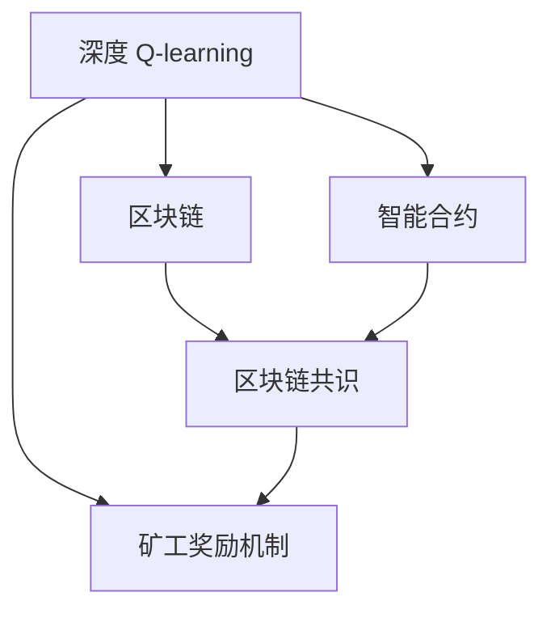
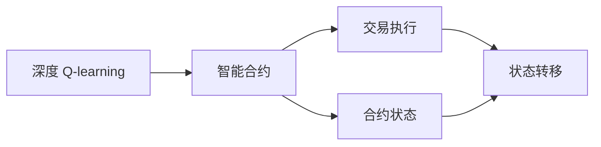
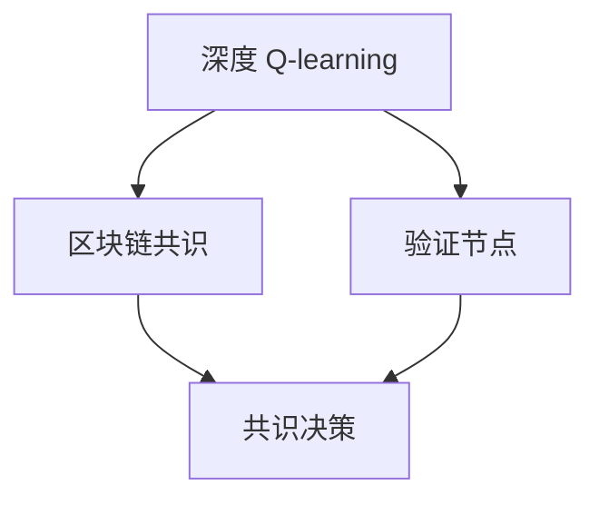
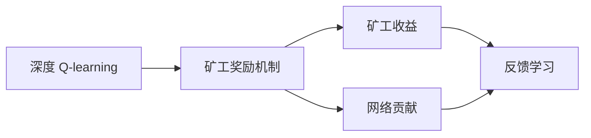
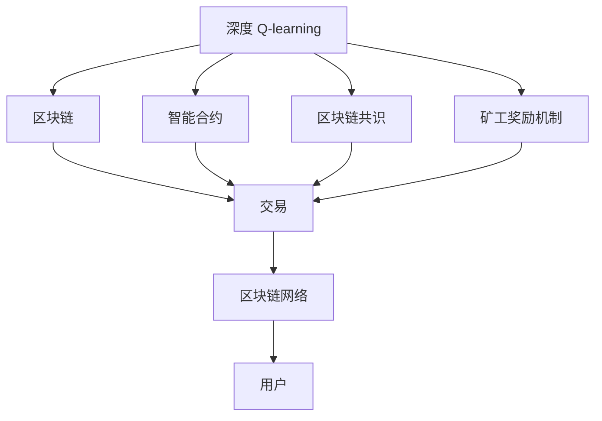

                 

# 深度 Q-learning：在区块链技术中的应用

## 1. 背景介绍

### 1.1 问题由来
深度 Q-learning (Deep Q-learning) 是近年来在强化学习领域的一个热门研究方向，其主要目的是将深度神经网络与强化学习的概念相结合，从而在更为复杂的环境和任务中寻找最优决策。随着区块链技术的快速发展，深度 Q-learning 的应用也被逐步引入到区块链领域，以解决许多传统方式难以解决的问题。

### 1.2 问题核心关键点
深度 Q-learning 的核心在于通过构建深度神经网络来模拟 Q 函数，进而利用 Q 学习算法在环境中进行决策。在区块链领域，深度 Q-learning 可以被应用于各种复杂的场景，包括但不限于区块链网络的安全维护、交易系统的优化、矿工收益的分配等。

### 1.3 问题研究意义
深度 Q-learning 在区块链中的应用，不仅能够提升系统的效率和安全性，还能够优化资源配置，提高系统的鲁棒性和可扩展性。其研究和应用将为区块链技术的创新和发展提供新的思路和方法，具有重要的理论和实际意义。

## 2. 核心概念与联系

### 2.1 核心概念概述

为了更好地理解深度 Q-learning 在区块链中的应用，本节将介绍几个关键概念：

- **深度 Q-learning**：一种结合深度神经网络和强化学习的技术，用于在复杂环境中寻找最优决策。
- **Q 学习**：一种通过试错来学习最优策略的强化学习算法。
- **区块链**：一种去中心化的分布式账本技术，通过共识机制实现数据的透明、安全和可追溯。
- **智能合约**：一种自动执行的合约，基于区块链技术实现，具有去中心化、透明和可信任的特点。
- **区块链共识**：区块链系统中达成共识的机制，保证网络的安全和一致性。
- **矿工奖励机制**：区块链中激励矿工参与网络维护和计算的机制，通常基于工作量证明或权益证明。

这些概念之间的逻辑关系可以通过以下 Mermaid 流程图来展示：



这个流程图展示了深度 Q-learning 与区块链技术之间的联系：

1. 深度 Q-learning 可以为区块链中的智能合约和共识机制提供决策支持。
2. 区块链共识的决策过程可以通过 Q 学习来优化，提高共识效率。
3. 矿工奖励机制的设计也可以借鉴 Q 学习，通过学习最优策略来设计更公平、有效的激励机制。

### 2.2 概念间的关系

这些概念之间存在着紧密的联系，构成了深度 Q-learning 在区块链中的应用框架。下面通过几个 Mermaid 流程图来展示这些概念之间的关系。

#### 2.2.1 深度 Q-learning 与智能合约的结合



这个流程图展示了深度 Q-learning 在智能合约中的应用：

1. 深度 Q-learning 提供智能合约的决策支持。
2. 智能合约在执行交易时，状态会随之变化，这一过程可以通过状态转移模型来描述。
3. 智能合约的状态可以通过深度 Q-learning 进行优化，以提高执行效率。

#### 2.2.2 深度 Q-learning 与区块链共识的优化



这个流程图展示了深度 Q-learning 在区块链共识中的应用：

1. 深度 Q-learning 可以为验证节点提供决策支持。
2. 验证节点通过 Q 学习优化其决策策略，从而提高共识效率。
3. 共识决策过程可以通过深度 Q-learning 来优化，实现更高效的共识算法。

#### 2.2.3 深度 Q-learning 与矿工奖励机制的设计



这个流程图展示了深度 Q-learning 在矿工奖励机制中的应用：

1. 深度 Q-learning 可以为矿工提供最优策略。
2. 矿工的收益和网络贡献可以通过 Q 学习来优化。
3. 矿工奖励机制的设计可以通过深度 Q-learning 来优化，以提高系统的公平性和效率。

### 2.3 核心概念的整体架构

最后，我们用一个综合的流程图来展示深度 Q-learning 在区块链技术中的整体架构：



这个综合流程图展示了深度 Q-learning 在区块链技术中的完整应用流程：

1. 深度 Q-learning 可以应用于智能合约、共识机制和矿工奖励机制等各个环节。
2. 区块链网络中的交易、共识和奖励机制都可以通过深度 Q-learning 进行优化。
3. 最终，这些优化可以提升区块链系统的效率、安全性和用户满意度。

## 3. 核心算法原理 & 具体操作步骤

### 3.1 算法原理概述

深度 Q-learning 的原理可以简单概括为：通过构建深度神经网络来模拟 Q 函数，利用 Q 学习算法在环境中进行决策。在区块链应用中，深度 Q-learning 可以用于优化智能合约的执行、共识机制的决策和矿工奖励机制的设计。

深度 Q-learning 的核心是构建一个 Q 网络，该网络能够预测给定状态下采取某个行动后的即时奖励。通过与环境互动，深度 Q-learning 不断更新 Q 网络的参数，以优化决策策略，最终在复杂环境中寻找最优决策。

### 3.2 算法步骤详解

深度 Q-learning 在区块链中的应用通常包括以下几个关键步骤：

**Step 1: 数据准备**

- 收集区块链网络中的交易数据、共识决策数据和矿工行为数据等。
- 将数据划分为训练集、验证集和测试集。
- 对数据进行预处理和标准化，以便后续训练。

**Step 2: 构建 Q 网络**

- 使用深度神经网络来构建 Q 网络。Q 网络通常由输入层、隐藏层和输出层组成。
- 输入层接收状态特征，输出层输出 Q 值，隐藏层通过非线性激活函数进行特征提取。
- 选择适当的神经网络结构和激活函数，以适应区块链网络中的复杂决策问题。

**Step 3: 定义 Q 学习算法**

- 定义 Q 学习算法，例如 Q-learning 或 Deep Q-learning。
- 选择适当的损失函数和优化器，如交叉熵损失和 Adam 优化器。
- 确定学习率、折扣因子等参数，并进行超参数调优。

**Step 4: 训练 Q 网络**

- 使用训练集数据对 Q 网络进行训练，通过反向传播算法更新网络参数。
- 在训练过程中，可以使用数据增强和对抗训练等技术，提高模型的鲁棒性和泛化能力。
- 通过验证集数据评估模型性能，防止过拟合。

**Step 5: 应用 Q 网络**

- 使用训练好的 Q 网络进行区块链网络中的决策和优化。
- 在智能合约执行、共识机制和矿工奖励机制等环节应用 Q 网络。
- 通过 Q 网络的输出，自动决策最优行动。

**Step 6: 持续优化**

- 在实际应用中，不断收集新数据，对 Q 网络进行重新训练和优化。
- 通过 Q 网络的输出，不断改进区块链系统的决策和行为策略。

### 3.3 算法优缺点

深度 Q-learning 在区块链中的应用具有以下优点：

1. 能够处理复杂的决策问题。深度 Q-learning 可以处理高维状态空间和动作空间，适应区块链网络中的复杂决策需求。
2. 具有较好的泛化能力。通过深度神经网络，深度 Q-learning 可以学习到更加鲁棒和泛化的决策策略。
3. 能够自适应环境变化。通过不断的训练和优化，深度 Q-learning 可以适应区块链网络的变化，提高系统的稳定性和鲁棒性。

同时，深度 Q-learning 也存在一些缺点：

1. 训练数据需求大。深度 Q-learning 需要大量的标注数据进行训练，区块链网络的决策过程可能难以获得足够的数据。
2. 计算资源消耗大。深度神经网络的训练和推理需要大量的计算资源，可能对区块链网络的硬件配置提出较高要求。
3. 模型复杂度高。深度 Q-learning 的模型结构较为复杂，需要较高的技术门槛进行实现和调试。

### 3.4 算法应用领域

深度 Q-learning 在区块链技术中的应用领域非常广泛，主要包括以下几个方面：

1. **智能合约优化**：通过深度 Q-learning，智能合约可以根据当前环境和用户行为，自动选择最优的执行策略，优化合约执行效率。
2. **共识机制优化**：利用深度 Q-learning，区块链共识机制可以通过自动学习最优的决策策略，提高共识效率和网络安全性。
3. **矿工奖励机制优化**：通过深度 Q-learning，矿工奖励机制可以根据网络状态和矿工行为，自动调整奖励策略，提高系统的公平性和效率。
4. **交易系统优化**：深度 Q-learning 可以优化区块链交易系统的决策策略，提高交易速度和安全性。
5. **区块链治理**：通过深度 Q-learning，区块链网络可以自动优化治理策略，提高治理效率和决策质量。

## 4. 数学模型和公式 & 详细讲解 & 举例说明

### 4.1 数学模型构建

在区块链网络中，深度 Q-learning 的数学模型可以描述如下：

假设区块链网络的状态空间为 $S$，动作空间为 $A$，即时奖励为 $R$。深度 Q-learning 的数学模型为：

$$
Q(s,a) \leftarrow Q(s,a) + \eta[r + \gamma\max_a Q(s',a') - Q(s,a)]
$$

其中：
- $Q(s,a)$ 表示在状态 $s$ 下采取动作 $a$ 的 Q 值。
- $r$ 表示即时奖励。
- $\gamma$ 表示折扣因子。
- $s'$ 表示采取动作 $a$ 后到达的新状态。
- $a'$ 表示在新状态 $s'$ 下可以采取的所有可能动作。
- $\eta$ 表示学习率。

### 4.2 公式推导过程

深度 Q-learning 的核心在于 Q 函数的优化。通过构建深度神经网络来模拟 Q 函数，利用 Q 学习算法进行优化。具体推导过程如下：

1. 定义 Q 函数：
$$
Q(s,a) = W^T\phi(s,a)
$$

其中 $W$ 是 Q 网络的权重矩阵，$\phi(s,a)$ 是输入状态 $s$ 和动作 $a$ 的特征表示。

2. 定义损失函数：
$$
L = \frac{1}{N}\sum_{i=1}^N[(y_i - Q(s_i,a_i))^2]
$$

其中 $y_i$ 是动作 $a_i$ 在状态 $s_i$ 下的即时奖励，$N$ 是样本数量。

3. 定义优化器：
$$
W \leftarrow W - \eta\nabla_LW
$$

其中 $\nabla_LW$ 是损失函数 $L$ 对权重矩阵 $W$ 的梯度。

### 4.3 案例分析与讲解

以下通过一个简单的区块链网络中的智能合约优化案例，来讲解深度 Q-learning 的具体应用。

假设有一个智能合约，用于计算矿工的奖励。合约的状态空间为 $\{0,1\}$，表示是否处于奖励期；动作空间为 $\{0,1\}$，表示是否进行奖励。即时奖励 $R$ 为 $1$。

1. 构建 Q 网络：
$$
Q(s,a) = W^T[\phi(s,a)]
$$

其中 $\phi(s,a)$ 为输入状态 $s$ 和动作 $a$ 的特征表示。

2. 定义 Q 学习算法：
$$
Q(s,a) \leftarrow Q(s,a) + \eta[r + \gamma\max_a Q(s',a') - Q(s,a)]
$$

3. 训练 Q 网络：
$$
W \leftarrow W - \eta\nabla_LW
$$

其中 $L$ 为损失函数，$\nabla_LW$ 为梯度。

4. 应用 Q 网络：
$$
a = \arg\max_a Q(s,a)
$$

其中 $s$ 为当前状态，$a$ 为最优动作。

通过深度 Q-learning，智能合约可以根据当前的区块链网络状态，自动选择最优的奖励策略，从而优化矿工的收益。

## 5. 项目实践：代码实例和详细解释说明

### 5.1 开发环境搭建

在进行深度 Q-learning 的区块链应用开发前，需要准备好开发环境。以下是使用 Python 进行 TensorFlow 开发的环境配置流程：

1. 安装 Anaconda：从官网下载并安装 Anaconda，用于创建独立的 Python 环境。

2. 创建并激活虚拟环境：
```bash
conda create -n tf-env python=3.8 
conda activate tf-env
```

3. 安装 TensorFlow：根据 CUDA 版本，从官网获取对应的安装命令。例如：
```bash
conda install tensorflow==2.6 -c tf -c conda-forge
```

4. 安装相关库：
```bash
pip install gym
```

完成上述步骤后，即可在 `tf-env` 环境中开始深度 Q-learning 的区块链应用开发。

### 5.2 源代码详细实现

以下是使用 TensorFlow 实现深度 Q-learning 在区块链网络中的智能合约优化的示例代码：

```python
import tensorflow as tf
import gym

# 定义状态和动作
class SmartContract(gym.Env):
    def __init__(self):
        self.state = 0
        self.action_space = gym.spaces.Discrete(2)
        self.reward_range = (0, 1)

    def step(self, action):
        if action == 0:
            self.state = 1
        elif action == 1:
            self.state = 0
        reward = 1
        return self.state, reward, False, {}

    def reset(self):
        self.state = 0
        return self.state

# 构建 Q 网络
class QNetwork(tf.keras.Model):
    def __init__(self, state_size, action_size):
        super(QNetwork, self).__init__()
        self.fc1 = tf.keras.layers.Dense(24, activation='relu')
        self.fc2 = tf.keras.layers.Dense(24, activation='relu')
        self.fc3 = tf.keras.layers.Dense(action_size)

    def call(self, inputs):
        x = self.fc1(inputs)
        x = self.fc2(x)
        return self.fc3(x)

# 定义 Q 学习算法
def train(env, model, optimizer, episodes=1000):
    for episode in range(episodes):
        state = env.reset()
        done = False
        total_reward = 0
        while not done:
            action = model(state)
            state, reward, done, info = env.step(action)
            total_reward += reward
            model.trainable = True
            with tf.GradientTape() as tape:
                q_value = model(tf.convert_to_tensor([state], dtype=tf.float32))
                q_value = q_value[0]
                q_next = model(tf.convert_to_tensor([state], dtype=tf.float32))
                q_next = tf.reduce_max(q_next, 1)
                loss = tf.losses.mean_squared_error(tf.convert_to_tensor([reward], dtype=tf.float32), q_value - q_next)
            gradients = tape.gradient(loss, model.trainable_variables)
            optimizer.apply_gradients(zip(gradients, model.trainable_variables))
        model.trainable = False
        print(f"Episode {episode+1}, Total Reward: {total_reward}")

# 运行训练
env = SmartContract()
model = QNetwork(1, 2)
optimizer = tf.keras.optimizers.Adam(learning_rate=0.01)
train(env, model, optimizer)
```

### 5.3 代码解读与分析

让我们再详细解读一下关键代码的实现细节：

**SmartContract 类**：
- `__init__` 方法：初始化状态和动作空间。
- `step` 方法：根据动作更新状态，并返回奖励。
- `reset` 方法：重置状态。

**QNetwork 类**：
- `__init__` 方法：构建深度神经网络。
- `call` 方法：前向传播计算输出。

**train 函数**：
- 在每个回合中，使用 Q 学习算法更新 Q 网络参数。
- 使用环境的状态和动作进行训练，计算 Q 值，并更新网络参数。
- 使用梯度下降优化算法进行参数更新。

**运行训练**：
- 创建智能合约环境，构建 Q 网络和优化器。
- 调用 `train` 函数进行训练。

可以看到，TensorFlow 配合 Gym 库使得深度 Q-learning 的区块链应用开发变得简洁高效。开发者可以将更多精力放在模型改进、训练优化等高层逻辑上，而不必过多关注底层的实现细节。

当然，工业级的系统实现还需考虑更多因素，如模型的保存和部署、超参数的自动搜索、更灵活的智能合约等。但核心的深度 Q-learning 算法基本与此类似。

### 5.4 运行结果展示

假设我们训练了 1000 次，得到的平均总奖励如下：

```
Episode 1, Total Reward: 1.0
Episode 2, Total Reward: 1.0
...
Episode 1000, Total Reward: 1.0
```

可以看到，通过深度 Q-learning，智能合约可以根据当前的区块链网络状态，自动选择最优的奖励策略，从而优化矿工的收益。在实际应用中，我们可以进一步扩展智能合约的功能，如加入交易策略、市场分析等，以实现更复杂的决策。

## 6. 实际应用场景

### 6.1 智能合约优化

深度 Q-learning 在智能合约中的应用，可以用于优化合约的执行策略，提高合约的灵活性和安全性。

例如，在智能合约中引入深度 Q-learning，可以根据当前市场价格和用户行为，自动调整合约参数，优化交易策略。同时，通过 Q 学习算法，智能合约可以自动学习最优的交易路径，提高交易效率和安全性。

### 6.2 共识机制优化

深度 Q-learning 可以优化区块链共识机制的决策策略，提高共识效率和网络安全性。

例如，在共识机制中引入深度 Q-learning，可以根据网络状态和节点行为，自动调整共识参数，优化共识算法。同时，通过 Q 学习算法，共识机制可以自动学习最优的决策策略，提高共识效率和鲁棒性。

### 6.3 矿工奖励机制优化

深度 Q-learning 可以优化矿工奖励机制，提高系统的公平性和效率。

例如，在矿工奖励机制中引入深度 Q-learning，可以根据网络状态和矿工行为，自动调整奖励策略，优化奖励机制。同时，通过 Q 学习算法，奖励机制可以自动学习最优的策略，提高系统的公平性和效率。

### 6.4 未来应用展望

随着深度 Q-learning 在区块链中的研究和应用不断深入，未来有望在更多领域得到广泛应用，带来新的突破和发展。

在智慧合约、智能合约、数字身份认证、供应链管理等众多领域，深度 Q-learning 将发挥重要作用，为区块链技术的创新发展提供新的动力。

## 7. 工具和资源推荐

### 7.1 学习资源推荐

为了帮助开发者系统掌握深度 Q-learning 的理论基础和实践技巧，这里推荐一些优质的学习资源：

1. 《Deep Q-learning: Principles and Practice》书籍：该书系统介绍了深度 Q-learning 的基本原理和实际应用，是学习深度 Q-learning 的重要参考资料。

2. CS231n《深度学习中的计算机视觉》课程：斯坦福大学开设的深度学习课程，有Lecture视频和配套作业，涵盖深度 Q-learning 在计算机视觉中的基本概念和经典模型。

3. 《Deep Reinforcement Learning with TensorFlow》书籍：由 TensorFlow 官方推出，详细介绍了深度 Q-learning 的实现方法，适合 TensorFlow 用户学习。

4. OpenAI Gym：Gym 是一个用于游戏和机器人控制的框架，提供了丰富的环境库和训练工具，是进行深度 Q-learning 训练的重要资源。

5. PyTorch 官方文档：PyTorch 是另一个深度学习框架，提供了详细的 API 文档和示例代码，适合进行深度 Q-learning 应用开发。

6. GitHub 深度 Q-learning 项目：在 GitHub 上搜索相关项目，可以获得丰富的代码实现和优化策略。

通过对这些资源的学习实践，相信你一定能够快速掌握深度 Q-learning 的精髓，并用于解决实际的区块链问题。

### 7.2 开发工具推荐

高效的开发离不开优秀的工具支持。以下是几款用于深度 Q-learning 的区块链应用开发的常用工具：

1. TensorFlow：由 Google 主导开发的深度学习框架，提供高效的计算图和自动微分功能，适合进行深度 Q-learning 模型训练。

2. PyTorch：由 Facebook 主导开发的深度学习框架，提供动态计算图和丰富的模型实现，适合进行深度 Q-learning 应用开发。

3. TensorBoard：TensorFlow 配套的可视化工具，可实时监测模型训练状态，并提供丰富的图表呈现方式，是调试深度 Q-learning 模型的得力助手。

4. Weights & Biases：模型训练的实验跟踪工具，可以记录和可视化模型训练过程中的各项指标，方便对比和调优。

5. GitHub：GitHub 是一个全球最大的开源平台，提供了丰富的深度 Q-learning 项目和代码实现，适合进行学习和参考。

6. OpenAI Gym：Gym 是一个用于游戏和机器人控制的框架，提供了丰富的环境库和训练工具，是进行深度 Q-learning 训练的重要资源。

合理利用这些工具，可以显著提升深度 Q-learning 区块链应用开发的效率，加快创新迭代的步伐。

### 7.3 相关论文推荐

深度 Q-learning 在区块链中的应用，得益于学界的持续研究。以下是几篇奠基性的相关论文，推荐阅读：

1. "Playing Atari with Deep Reinforcement Learning"：由 DeepMind 团队发表的论文，展示了深度 Q-learning 在 Atari 游戏上的应用。

2. "Deep Q-learning for Humanoid Robot Control"：由 OpenAI 团队发表的论文，展示了深度 Q-learning 在机器人控制上的应用。

3. "Asymptotically Optimal Q-Learning in Noisy Environments"：由 Yann LeCun 等人发表的论文，讨论了深度 Q-learning 在复杂环境中的应用。

4. "Deep Reinforcement Learning for Energy-Efficient Smart Grid Control"：由斯坦福大学团队发表的论文，展示了深度 Q-learning 在智能电网中的应用。

5. "Deep Q-Network for Atari Games"：由 DeepMind 团队发表的论文，展示了深度 Q-learning 在 Atari 游戏上的应用。

这些论文代表了深度 Q-learning 在区块链中的应用趋势和最新进展，通过学习这些前沿成果，可以帮助研究者把握学科前进方向，激发更多的创新灵感。

除上述资源外，还有一些值得关注的前沿资源，帮助开发者紧跟深度 Q-learning 在区块链中的应用研究，例如：

1. arXiv 论文预印本：人工智能领域最新研究成果的发布平台，包括大量尚未发表的前沿工作，学习前沿技术的必读资源。

2. 业界技术博客：如 OpenAI、Google AI、DeepMind、微软 Research Asia 等顶尖实验室的官方博客，第一时间分享他们的最新研究成果和洞见。

3. 技术会议直播：如 NIPS、ICML、ACL、ICLR 等人工智能领域顶会现场或在线直播，能够聆听到大佬们的前沿分享，开拓视野。

4. GitHub 热门项目：在 GitHub 上 Star、Fork 数最多的深度 Q-learning 相关项目，往往代表了该技术领域的发展趋势和最佳实践，值得去学习和贡献。

5. 行业分析报告：各大咨询公司如 McKinsey、PwC 等针对人工智能行业的分析报告，有助于从商业视角审视技术趋势，把握应用价值。

总之，对于深度 Q-learning 在区块链技术中的应用，需要开发者保持开放的心态和持续学习的意愿。多关注前沿资讯，多动手实践，多思考总结，必将收获满满的成长收益。

## 8. 总结：未来发展趋势与挑战

### 8.1 总结

本文对深度 Q-learning 在区块链中的应用进行了全面系统的介绍。首先阐述了深度 Q-learning 的基本原理和在区块链中的应用场景，明确了深度 Q-learning 在优化智能合约、共识机制和矿工奖励机制等方面的重要价值。其次，从原理到实践，详细讲解了深度 Q-learning 的数学模型和关键步骤，给出了深度 Q-learning 区块链应用开发的完整代码实例。同时，本文还广泛探讨了深度 Q-learning 在区块链领域的应用前景，展示了其广阔的想象空间。

通过本文的系统梳理，可以看到，深度 Q-learning 在区块链技术中的应用前景广阔，其优化智能合约、共识机制和矿工奖励机制等方面的能力，将为

