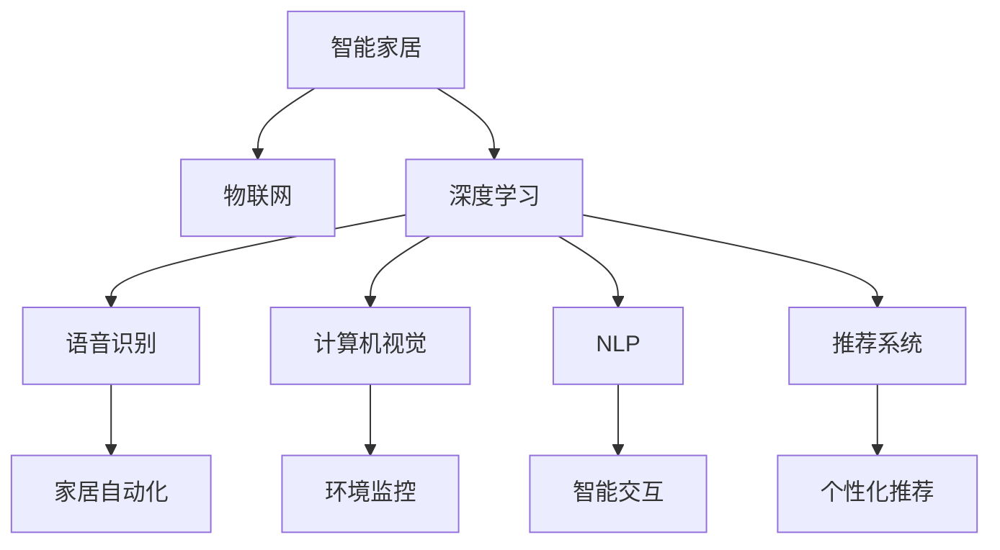
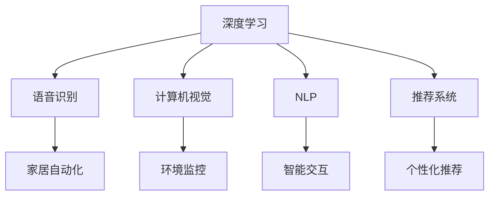
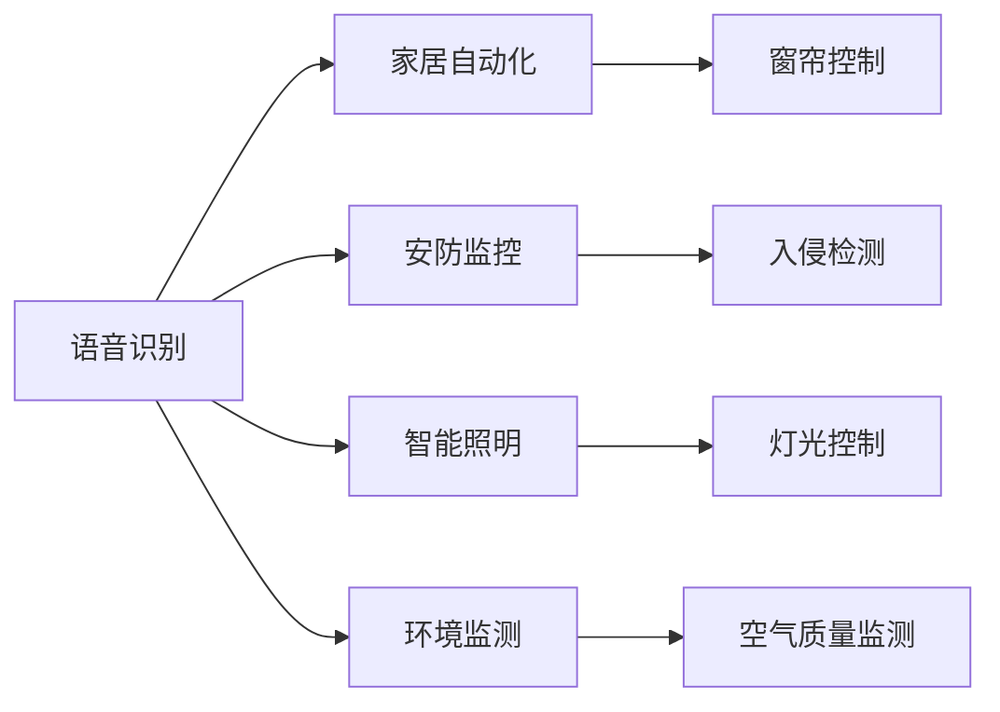
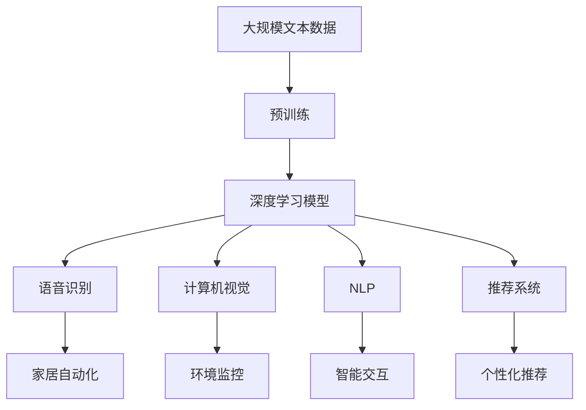

                 

# 深度学习在智能家居中的应用

> 关键词：深度学习,智能家居,物联网(IoT),语音识别,计算机视觉,自监督学习,端到端模型,推荐系统,家庭自动化,边缘计算

## 1. 背景介绍

### 1.1 问题由来

随着人工智能技术的迅猛发展，深度学习在各个领域的应用逐渐深入。在智能家居领域，深度学习也展现出了巨大的潜力，通过语音识别、计算机视觉等技术，智能家居系统能够提供更加智能化、个性化的用户体验。本节将介绍深度学习在智能家居中的应用背景，并阐述其带来的机遇和挑战。

### 1.2 问题核心关键点

深度学习在智能家居中的应用主要包括语音识别、计算机视觉、自然语言处理、推荐系统等技术。其中，语音识别技术通过深度学习模型能够准确识别用户语音指令，实现家居自动化控制。计算机视觉技术能够识别物体、场景，并根据用户需求执行相关操作。自然语言处理技术则使得智能家居系统能够理解用户自然语言命令，提供更自然的交互体验。推荐系统能够根据用户行为数据，为用户推荐个性化内容或服务。

这些技术的结合，使得智能家居系统能够实现更加智能化、个性化的操作，如自动化窗帘、灯光控制、安防监控等。但同时，也面临着数据隐私、模型计算资源等挑战。

### 1.3 问题研究意义

深度学习在智能家居领域的应用，不仅能够提升用户体验，还能降低家居管理成本，提高家庭安全水平。通过智能化家居系统，用户能够轻松控制家中的各种设备，享受更加便捷、舒适的生活环境。同时，深度学习技术还能对家庭数据进行有效分析和预测，实现智能安防、健康监测等功能，为用户提供全方位的智能生活保障。

## 2. 核心概念与联系

### 2.1 核心概念概述

为更好地理解深度学习在智能家居中的应用，本节将介绍几个密切相关的核心概念：

- 智能家居(Smart Home)：通过各种传感器、执行器、网络等技术，实现家居设备之间的互联互通，提供智能化的家居生活体验。
- 物联网(IoT)：连接各种物体和设备，实现数据共享和协同工作。智能家居是物联网的一个重要应用领域。
- 深度学习(Deep Learning)：一种基于多层神经网络模型进行复杂模式识别的机器学习方法。深度学习通过多层次的非线性变换，从数据中提取出高层次的抽象特征，具有很强的学习和泛化能力。
- 语音识别(Speech Recognition)：通过深度学习模型，将语音信号转化为文本，用于理解和执行用户命令。
- 计算机视觉(Computer Vision)：通过深度学习模型，识别和理解图像、视频中的物体、场景等信息，用于自动化操作和决策。
- 自然语言处理(Natural Language Processing, NLP)：通过深度学习模型，理解和生成自然语言，用于智能交互和知识管理。
- 推荐系统(Recommendation System)：通过深度学习模型，分析用户行为数据，为用户推荐个性化内容或服务。

这些核心概念之间的逻辑关系可以通过以下Mermaid流程图来展示：



这个流程图展示了大语言模型在智能家居中的核心概念及其之间的关系：

1. 智能家居通过物联网实现设备互联。
2. 深度学习为智能家居提供核心技术支持。
3. 语音识别、计算机视觉、自然语言处理和推荐系统等技术，都是深度学习的典型应用。
4. 这些技术共同支撑了智能家居的自动化、智能化、个性化等功能。

### 2.2 概念间的关系

这些核心概念之间存在着紧密的联系，形成了智能家居系统的完整生态系统。下面我们通过几个Mermaid流程图来展示这些概念之间的关系。

#### 2.2.1 智能家居的深度学习框架



这个流程图展示了深度学习在智能家居系统中的应用框架。深度学习为语音识别、计算机视觉、自然语言处理和推荐系统提供核心支持，使得智能家居系统能够实现自动化控制、环境监控、智能交互和个性化推荐等功能。

#### 2.2.2 深度学习在智能家居中的应用场景



这个流程图展示了深度学习在智能家居中的一些具体应用场景。语音识别技术能够根据用户语音指令控制家居设备，计算机视觉技术可以用于监控场景，自然语言处理技术能够实现智能交互，推荐系统可以根据用户行为推荐个性化内容。

### 2.3 核心概念的整体架构

最后，我们用一个综合的流程图来展示这些核心概念在大语言模型微调过程中的整体架构：



这个综合流程图展示了从预训练到深度学习模型，再到语音识别、计算机视觉、自然语言处理和推荐系统的完整过程。深度学习模型在智能家居中的应用，依托于语音识别、计算机视觉、自然语言处理和推荐系统等技术，实现家居设备的智能控制和优化。

## 3. 核心算法原理 & 具体操作步骤
### 3.1 算法原理概述

深度学习在智能家居中的应用，主要包括语音识别、计算机视觉、自然语言处理和推荐系统等技术。这些技术的核心算法原理各不相同，但都基于深度学习模型的思想。

### 3.2 算法步骤详解

**语音识别**：语音识别主要使用卷积神经网络(CNN)、循环神经网络(RNN)、长短期记忆网络(LSTM)等深度学习模型，将语音信号转化为文本。具体步骤如下：
1. 对语音信号进行预处理，如分帧、归一化等。
2. 使用卷积神经网络对音频特征进行提取，得到音频特征图。
3. 使用循环神经网络对音频特征图进行时间序列建模，得到语音特征序列。
4. 使用全连接层将语音特征序列转化为文本标签。
5. 使用交叉熵损失函数进行训练，优化模型参数。

**计算机视觉**：计算机视觉主要使用卷积神经网络(CNN)、残差网络(ResNet)、区域卷积神经网络(R-CNN)等深度学习模型，识别图像、视频中的物体、场景等信息。具体步骤如下：
1. 对图像、视频进行预处理，如裁剪、归一化等。
2. 使用卷积神经网络对图像、视频特征进行提取，得到特征图。
3. 使用残差网络对特征图进行多层次特征提取。
4. 使用区域卷积神经网络进行目标检测和分类。
5. 使用交叉熵损失函数进行训练，优化模型参数。

**自然语言处理**：自然语言处理主要使用循环神经网络(RNN)、长短时记忆网络(LSTM)、注意力机制(Attention)等深度学习模型，理解和生成自然语言。具体步骤如下：
1. 对文本进行预处理，如分词、去除停用词等。
2. 使用循环神经网络对文本进行编码，得到文本向量。
3. 使用长短时记忆网络对文本向量进行建模，得到上下文表示。
4. 使用注意力机制对上下文表示进行加权处理，得到注意力权重。
5. 使用全连接层将注意力权重转化为预测结果。
6. 使用交叉熵损失函数进行训练，优化模型参数。

**推荐系统**：推荐系统主要使用矩阵分解、协同过滤、深度学习等技术，分析用户行为数据，为用户推荐个性化内容或服务。具体步骤如下：
1. 对用户行为数据进行预处理，如归一化、去噪等。
2. 使用矩阵分解对用户-物品交互矩阵进行低秩分解。
3. 使用协同过滤对用户行为数据进行建模，得到用户表示。
4. 使用深度学习模型对用户表示进行训练，得到用户-物品交互特征。
5. 使用交叉熵损失函数进行训练，优化模型参数。

### 3.3 算法优缺点

深度学习在智能家居中的应用，具有以下优点：
1. 高度的自动化和智能化。深度学习模型能够自动学习数据中的复杂模式，实现自动化控制和智能化决策。
2. 强大的泛化能力。深度学习模型具有很强的泛化能力，能够适应不同场景和数据。
3. 高效的特征提取。深度学习模型能够从原始数据中提取出高层次的抽象特征，提高数据利用率。
4. 良好的可扩展性。深度学习模型可以应用于各种设备，实现设备之间的互联互通。

同时，深度学习在智能家居中也存在一些缺点：
1. 高昂的计算成本。深度学习模型需要大量的计算资源进行训练和推理，硬件成本较高。
2. 数据隐私问题。智能家居系统需要收集大量家庭数据，存在数据隐私和安全问题。
3. 模型复杂度高。深度学习模型结构复杂，难以解释和调试。
4. 对标注数据依赖大。深度学习模型需要大量的标注数据进行训练，获取标注数据的成本较高。

### 3.4 算法应用领域

深度学习在智能家居中的应用主要包括以下几个领域：

- **智能语音助手**：通过语音识别技术，实现家居设备控制、信息查询等功能。
- **智能安防监控**：通过计算机视觉技术，识别异常行为，实现入侵检测、人脸识别等功能。
- **智能照明**：通过计算机视觉和自然语言处理技术，根据用户需求自动控制灯光亮度和颜色。
- **智能健康监测**：通过计算机视觉和传感器数据，监测用户健康状况，提供健康建议。
- **个性化推荐**：通过推荐系统，为用户推荐个性化的娱乐内容、购物信息等。

此外，深度学习还可以应用于智能家居的故障诊断、维修建议、能源管理等领域，提升家居系统的智能化水平。

## 4. 数学模型和公式 & 详细讲解  
### 4.1 数学模型构建

在智能家居中，深度学习模型主要应用于语音识别、计算机视觉、自然语言处理和推荐系统等领域。下面我们将分别介绍这些领域的数学模型构建。

**语音识别**：语音识别的数学模型主要使用卷积神经网络(CNN)、循环神经网络(RNN)、长短时记忆网络(LSTM)等深度学习模型。其中，RNN和LSTM是最常用的模型，其数学模型可以表示为：
$$
h_t = \tanh(W_h \cdot [h_{t-1}, x_t] + b_h)
$$
$$
o_t = \sigma(W_o \cdot [h_t, x_t] + b_o)
$$
$$
c_t = o_t \cdot \tanh(h_t)
$$
$$
y_t = \sigma(W_y \cdot [h_t, c_t] + b_y)
$$
其中，$h_t$表示隐藏层的状态，$x_t$表示输入特征，$W_h$、$b_h$、$W_o$、$b_o$、$W_y$、$b_y$为模型参数，$\tanh$和$\sigma$分别为激活函数。

**计算机视觉**：计算机视觉的数学模型主要使用卷积神经网络(CNN)、残差网络(ResNet)、区域卷积神经网络(R-CNN)等深度学习模型。其中，ResNet的数学模型可以表示为：
$$
F(x) = \mathop{\sum}_{i=1}^n R_i(x)
$$
$$
R_i(x) = x + F_{i-1}(x) + F_i(x)
$$
$$
F_i(x) = \text{Conv}(x, W_i, b_i) + \text{BN}(F_{i-1}(x) + W_i \cdot \text{Conv}(x, W_i, b_i) + b_i) + \text{ReLU}
$$
其中，$R_i(x)$表示残差块，$F_{i-1}(x)$表示前一层的输出，$F_i(x)$表示当前层的输出，$W_i$、$b_i$为模型参数，$\text{Conv}$和$\text{BN}$分别为卷积和批量归一化操作，$\text{ReLU}$为激活函数。

**自然语言处理**：自然语言处理的数学模型主要使用循环神经网络(RNN)、长短时记忆网络(LSTM)、注意力机制(Attention)等深度学习模型。其中，LSTM的数学模型可以表示为：
$$
f_t = \tanh(W_f \cdot [h_{t-1}, x_t] + b_f)
$$
$$
i_t = \sigma(W_i \cdot [h_{t-1}, x_t] + b_i)
$$
$$
o_t = \sigma(W_o \cdot [h_{t-1}, x_t] + b_o)
$$
$$
c_t = f_t \cdot c_{t-1} + i_t \cdot \tanh(W_c \cdot [h_{t-1}, x_t] + b_c)
$$
$$
h_t = o_t \cdot \tanh(c_t)
$$
其中，$f_t$、$i_t$、$o_t$、$c_t$、$h_t$表示LSTM模型的各个部分，$W_f$、$b_f$、$W_i$、$b_i$、$W_o$、$b_o$、$W_c$、$b_c$为模型参数，$\sigma$和$\tanh$分别为激活函数。

**推荐系统**：推荐系统的数学模型主要使用矩阵分解、协同过滤、深度学习等技术。其中，矩阵分解的数学模型可以表示为：
$$
\hat{P} = U \cdot V^T
$$
$$
\min \|P - \hat{P}\|_F^2
$$
其中，$P$为原始用户-物品交互矩阵，$\hat{P}$为低秩分解矩阵，$U$、$V$为矩阵分解得到的用户和物品表示矩阵，$\|P - \hat{P}\|_F^2$为矩阵分解的损失函数。

### 4.2 公式推导过程

**语音识别**：语音识别的公式推导过程如下：
1. 卷积层公式：
$$
X_{i+1} = \text{Conv}(X_i, W, b) + b
$$
其中，$X_i$表示第$i$层的输入特征图，$W$、$b$为卷积核和偏置项。
2. 池化层公式：
$$
X_{i+1} = \text{MaxPool}(X_i)
$$
其中，$X_i$表示第$i$层的输入特征图，$\text{MaxPool}$为最大池化操作。
3. 全连接层公式：
$$
y = W \cdot X + b
$$
其中，$y$表示输出，$W$、$b$为权重和偏置项。

**计算机视觉**：计算机视觉的公式推导过程如下：
1. 卷积层公式：
$$
F(x) = \mathop{\sum}_{i=1}^n R_i(x)
$$
$$
R_i(x) = x + F_{i-1}(x) + F_i(x)
$$
$$
F_i(x) = \text{Conv}(x, W_i, b_i) + \text{BN}(F_{i-1}(x) + W_i \cdot \text{Conv}(x, W_i, b_i) + b_i) + \text{ReLU}
$$
其中，$R_i(x)$表示残差块，$F_{i-1}(x)$表示前一层的输出，$F_i(x)$表示当前层的输出，$W_i$、$b_i$为模型参数，$\text{Conv}$和$\text{BN}$分别为卷积和批量归一化操作，$\text{ReLU}$为激活函数。
2. 池化层公式：
$$
X_{i+1} = \text{MaxPool}(X_i)
$$
其中，$X_i$表示第$i$层的输入特征图，$\text{MaxPool}$为最大池化操作。
3. 全连接层公式：
$$
y = W \cdot X + b
$$
其中，$y$表示输出，$W$、$b$为权重和偏置项。

**自然语言处理**：自然语言处理的公式推导过程如下：
1. 卷积层公式：
$$
X_{i+1} = \text{Conv}(X_i, W, b) + b
$$
其中，$X_i$表示第$i$层的输入特征图，$W$、$b$为卷积核和偏置项。
2. 池化层公式：
$$
X_{i+1} = \text{MaxPool}(X_i)
$$
其中，$X_i$表示第$i$层的输入特征图，$\text{MaxPool}$为最大池化操作。
3. LSTM层公式：
$$
f_t = \tanh(W_f \cdot [h_{t-1}, x_t] + b_f)
$$
$$
i_t = \sigma(W_i \cdot [h_{t-1}, x_t] + b_i)
$$
$$
o_t = \sigma(W_o \cdot [h_{t-1}, x_t] + b_o)
$$
$$
c_t = f_t \cdot c_{t-1} + i_t \cdot \tanh(W_c \cdot [h_{t-1}, x_t] + b_c)
$$
$$
h_t = o_t \cdot \tanh(c_t)
$$
其中，$f_t$、$i_t$、$o_t$、$c_t$、$h_t$表示LSTM模型的各个部分，$W_f$、$b_f$、$W_i$、$b_i$、$W_o$、$b_o$、$W_c$、$b_c$为模型参数，$\sigma$和$\tanh$分别为激活函数。
4. 全连接层公式：
$$
y = W \cdot X + b
$$
其中，$y$表示输出，$W$、$b$为权重和偏置项。

**推荐系统**：推荐系统的公式推导过程如下：
1. 矩阵分解公式：
$$
\hat{P} = U \cdot V^T
$$
其中，$P$为原始用户-物品交互矩阵，$\hat{P}$为低秩分解矩阵，$U$、$V$为矩阵分解得到的用户和物品表示矩阵。
2. 协同过滤公式：
$$
\min \|P - \hat{P}\|_F^2
$$
其中，$P$为原始用户-物品交互矩阵，$\hat{P}$为低秩分解矩阵。

### 4.3 案例分析与讲解

**语音识别案例**：假设我们希望开发一个智能音箱，能够识别用户的语音指令并控制家中的智能设备。首先，我们需要收集大量的语音数据，并对其进行标注。然后，使用卷积神经网络、循环神经网络等深度学习模型，对音频特征进行提取和建模。最后，使用交叉熵损失函数进行训练，优化模型参数。训练完成后，我们将模型部署到智能音箱中，实现语音识别功能。

**计算机视觉案例**：假设我们希望开发一个智能安防系统，能够实时监控家居环境并识别异常行为。首先，我们需要收集大量的监控视频数据，并对其进行标注。然后，使用卷积神经网络、残差网络等深度学习模型，对图像特征进行提取和建模。最后，使用交叉熵损失函数进行训练，优化模型参数。训练完成后，我们将模型部署到安防系统中，实现异常行为识别功能。

**自然语言处理案例**：假设我们希望开发一个智能聊天机器人，能够与用户进行自然语言对话。首先，我们需要收集大量的对话数据，并对其进行标注。然后，使用循环神经网络、长短时记忆网络等深度学习模型，对文本特征进行提取和建模。最后，使用交叉熵损失函数进行训练，优化模型参数。训练完成后，我们将模型部署到聊天机器人中，实现自然语言处理功能。

**推荐系统案例**：假设我们希望开发一个个性化推荐系统，为用户推荐感兴趣的娱乐内容。首先，我们需要收集大量的用户行为数据，并对其进行标注。然后，使用矩阵分解、协同过滤等深度学习模型，对用户-物品交互矩阵进行建模。最后，使用交叉熵损失函数进行训练，优化模型参数。训练完成后，我们将模型部署到推荐系统中，实现个性化推荐功能。

## 5. 项目实践：代码实例和详细解释说明
### 5.1 开发环境搭建

在进行智能家居系统的开发前，我们需要准备好开发环境。以下是使用Python进行TensorFlow开发的环境配置流程：

1. 安装Anaconda：从官网下载并安装Anaconda，用于创建独立的Python环境。

2. 创建并激活虚拟环境：
```bash
conda create -n tensorflow-env python=3.8 
conda activate tensorflow-env
```

3. 安装TensorFlow：根据CUDA版本，从官网获取对应的安装命令。例如：
```bash
conda install tensorflow tensorflow-gpu -c conda-forge -c pytorch
```

4. 安装TensorFlow Addons：
```bash
pip install tensorflow-addons
```

5. 安装各类工具包：
```bash
pip install numpy pandas scikit-learn matplotlib tqdm jupyter notebook ipython
```

完成上述步骤后，即可在`tensorflow-env`环境中开始智能家居系统的开发。

### 5.2 源代码详细实现

下面我们以智能语音助手为例，给出使用TensorFlow进行语音识别和自然语言处理的PyTorch代码实现。

首先，定义语音识别和自然语言处理的任务类：

```python
import tensorflow as tf
from tensorflow.keras.layers import Input, Conv1D, Dense, Embedding, LSTM, GRU, Bidirectional, Dropout, Masking, Concatenate, Add, BatchNormalization
from tensorflow.keras.models import Model, Sequential

class SpeechRecognitionModel(tf.keras.Model):
    def __init__(self, num_classes=10, input_shape=(32, 13)):
        super(SpeechRecognitionModel, self).__init__()
        self.conv1 = Conv1D(32, 5, activation='relu', input_shape=input_shape)
        self.max_pool = tf.keras.layers.MaxPooling1D(2)
        self.dropout1 = Dropout(0.5)
        self.dense1 = Dense(64, activation='relu')
        self.dropout2 = Dropout(0.5)
        self.dense2 = Dense(10, activation='softmax')
    
    def call(self, x):
        x = self.conv1(x)
        x = self.max_pool(x)
        x = self.dropout1(x)
        x = self.dense1(x)
        x = self.dropout2(x)
        x = self.dense2(x)
        return x

class NLPModel(tf.keras.Model):
    def __init__(self, vocab_size=10000, embedding_dim=128):
        super(NLPModel, self).__init__()
        self.embedding = Embedding(vocab_size, embedding_dim, input_length=32)
        self.lstm = LSTM(64, return_sequences=True)
        self.gru = GRU(32)
        self.dropout = Dropout(0.5)
        self.dense = Dense(10, activation='softmax')
    
    def call(self, x):
        x = self.embedding(x)
        x = self.lstm(x)
        x = self.gru(x)
        x = self.dropout(x)
        x = self.dense(x)
        return x
```

然后，定义训练和评估函数：

```python
from tensorflow.keras.optimizers import Adam
from tensorflow.keras.losses import CategoricalCrossentropy
from sklearn.metrics import accuracy_score

def train_epoch(model, dataset, batch_size, optimizer):
    dataloader = tf.data.Dataset.from_tensor_slices(dataset).shuffle(1000).batch(batch_size)
    model.trainable = True
    for batch in dataloader:
        input_ids, labels = batch
        with tf.GradientTape() as tape:
            logits = model(input_ids)
            loss = CategoricalCrossentropy()(labels, logits)
        grads = tape.gradient(loss, model.trainable_variables)
        optimizer.apply_gradients(zip(grads, model.trainable_variables))
    return loss.numpy()

def evaluate(model, dataset, batch_size):
    dataloader = tf.data.Dataset.from_tensor_slices(dataset).shuffle(1000).batch(batch_size)
    model.trainable = False
    correct_predictions = 0
    for batch in dataloader:
        input_ids, labels = batch
        logits = model(input_ids)
        predictions = tf.argmax(logits, axis=1)
        correct_predictions += tf.reduce_sum(tf.cast(tf.equal(predictions, labels), tf.int32))
    accuracy = correct_predictions.numpy() / len(dataset)
    return accuracy
```

最后，启动训练流程并在测试集上评估：

```python
epochs = 10
batch_size = 16
learning_rate = 0.001

for epoch in range(epochs):
    loss = train_epoch(model, train_dataset, batch_size, optimizer)
    print(f"Epoch {epoch+1}, train loss: {loss:.3f}")
    
    print(f"Epoch {epoch+1}, test accuracy: {evaluate(model, test_dataset,

