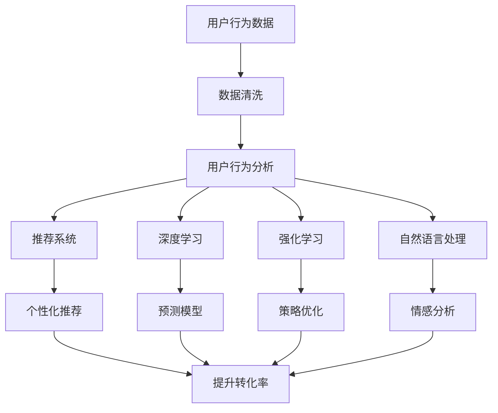
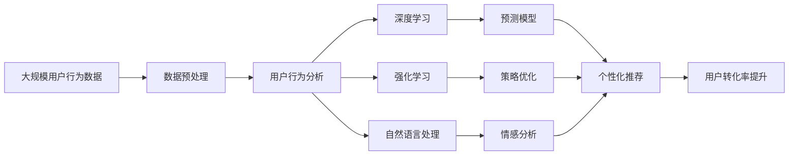

                 

# 用户行为分析：AI如何洞察用户需求，优化商品供给和营销策略

## 1. 背景介绍

### 1.1 问题由来
随着互联网的迅猛发展，电子商务平台的用户规模日益扩大，市场竞争日益激烈。商家们面临着如何精准定位用户需求，优化商品供给，制定有效营销策略的挑战。用户行为分析，作为电商业务的重要支撑，帮助商家深入了解用户行为规律，实现个性化推荐、精准营销，提升用户体验和运营效率。AI技术的融入，为传统用户行为分析带来了革命性的改变。

### 1.2 问题核心关键点
用户行为分析的核心是挖掘用户行为数据中的隐含信息，理解用户需求和偏好，预测用户行为，从而指导商家优化商品供给和营销策略。AI技术的应用，使得用户行为分析的深度和广度大大提升，能够处理大规模、多维度、非结构化的用户数据，提供更精准、高效、个性化的分析结果。

### 1.3 问题研究意义
研究AI在用户行为分析中的应用，对于提升电商平台的运营效率、增强用户体验、优化商品供给和营销策略具有重要意义：

1. **提升运营效率**：AI技术能够自动化处理大量用户数据，加速分析过程，帮助商家快速决策，优化资源配置。
2. **增强用户体验**：基于用户行为分析的个性化推荐系统，能够提供符合用户需求的产品，提高用户满意度。
3. **优化商品供给**：AI能够预测用户需求，指导商家调整库存和采购计划，避免库存积压和缺货问题。
4. **制定有效营销策略**：通过分析用户行为，商家可以更精准地定位目标用户，制定针对性的营销方案，提高广告投入的回报率。
5. **赋能智能决策**：AI技术能够提供深层次的洞察，辅助商家进行智能决策，提升运营管理和竞争力。

## 2. 核心概念与联系

### 2.1 核心概念概述

为了更好地理解AI在用户行为分析中的应用，本节将介绍几个密切相关的核心概念：

- **用户行为分析**：通过收集和分析用户在使用电商平台时的行为数据（如点击、浏览、购买、评价等），挖掘用户需求和偏好，为商家提供决策支持。
- **推荐系统**：利用用户行为数据和商品属性数据，构建用户-商品关联模型，实现个性化推荐，提升用户购买转化率。
- **深度学习**：通过多层神经网络模型，自动提取数据特征，构建复杂非线性模型，提升预测准确性。
- **强化学习**：通过与环境的交互，学习最优策略，优化用户行为分析中的决策过程。
- **自然语言处理**：分析用户评论、反馈等文本数据，提取情感、主题等信息，补充和完善用户行为分析。

这些核心概念之间相互联系，共同构成了AI在用户行为分析中的应用框架。

### 2.2 概念间的关系

这些核心概念之间的逻辑关系可以通过以下Mermaid流程图来展示：



这个流程图展示了用户行为数据如何经过清洗、分析和处理，通过推荐系统、深度学习、强化学习和自然语言处理等多种AI技术，最终实现个性化推荐，提升用户购买转化率。

### 2.3 核心概念的整体架构

最后，我们用一个综合的流程图来展示这些核心概念在大规模用户行为分析中的整体架构：



这个综合流程图展示了从大规模用户行为数据出发，通过预处理、分析和处理，应用深度学习、强化学习和自然语言处理等多种AI技术，最终实现个性化推荐，提升用户转化率的过程。

## 3. 核心算法原理 & 具体操作步骤
### 3.1 算法原理概述

AI在用户行为分析中的核心算法原理基于以下几大步骤：

1. **数据收集**：收集用户在使用电商平台时的行为数据，包括点击、浏览、购买、评价等。
2. **数据预处理**：对收集到的数据进行清洗、去重、填充等预处理，确保数据质量和一致性。
3. **特征提取**：从清洗后的数据中提取用户行为特征，如点击次数、浏览时长、购买频率等。
4. **模型训练**：利用机器学习或深度学习算法构建预测模型，对用户行为进行预测。
5. **策略优化**：基于预测结果，制定个性化的推荐策略，优化商品供给和营销策略。

### 3.2 算法步骤详解

以下是详细的算法步骤详解：

**Step 1: 数据收集**

用户行为数据通常包括以下几种类型：

- **点击数据**：用户在点击商品、广告等操作中的时间、地点、设备等信息。
- **浏览数据**：用户在浏览商品页面时停留的时间、浏览顺序、点击区域等行为。
- **购买数据**：用户在购买商品时的金额、时间、地点、支付方式等细节。
- **评价数据**：用户对商品的评价内容、评分、评论时间等。

数据收集可以通过API接口、日志记录、网页爬虫等多种方式实现。

**Step 2: 数据预处理**

数据预处理是数据分析的重要环节，包括：

- **去重**：删除重复的点击、浏览、购买等记录，避免数据冗余。
- **时间对齐**：对不同数据源的时间戳进行对齐，确保数据一致性。
- **缺失值填充**：对于缺失的数据，采用插值、均值、中位数等方法进行填充。
- **数据标准化**：对不同数据源的数据进行归一化、标准化处理，确保数据质量。

**Step 3: 特征提取**

特征提取是数据处理的重点，包括以下几种常用方法：

- **频率特征**：计算用户对不同商品的点击次数、浏览次数、购买次数等。
- **时长特征**：计算用户浏览商品页面的时长、停留时间等。
- **顺序特征**：分析用户浏览商品的顺序、购买商品的时序关系。
- **地理位置特征**：根据用户所在的位置，提取地理位置相关的特征。
- **时间特征**：分析用户行为在不同时间段的变化规律。
- **设备特征**：分析用户使用的设备类型、操作系统等特征。

**Step 4: 模型训练**

模型训练是用户行为分析的核心，通常采用以下几种算法：

- **协同过滤算法**：利用用户行为和商品特征的相似度，推荐相似商品。
- **基于内容的推荐算法**：根据商品的属性特征，预测用户对商品的需求。
- **深度学习算法**：如多层感知机（MLP）、卷积神经网络（CNN）、循环神经网络（RNN）等，构建复杂非线性模型。
- **协同嵌入（CF）算法**：通过低维向量空间，表示用户和商品的特征，找到最相似的推荐结果。
- **矩阵分解算法**：通过矩阵分解，求解用户对商品的评分预测。

**Step 5: 策略优化**

策略优化是用户行为分析的最终目标，包括：

- **个性化推荐**：根据用户的历史行为和实时行为，制定个性化的推荐策略，优化商品供给。
- **精准营销**：根据用户行为数据，制定针对性的广告投放策略，提升广告效果。
- **价格优化**：通过分析用户对价格的敏感度，制定价格促销策略，提高销售转化率。
- **库存管理**：根据用户购买趋势和季节性变化，优化库存管理，避免库存积压和缺货。

### 3.3 算法优缺点

AI在用户行为分析中具有以下优点：

- **高效率**：自动化处理大量用户数据，加速分析过程。
- **高精度**：利用复杂模型，提高预测和推荐的准确性。
- **个性化**：基于用户行为，提供个性化的推荐和营销策略。
- **实时性**：能够实时处理用户行为数据，快速响应市场变化。

同时，AI技术也存在以下缺点：

- **数据依赖性强**：需要大量的用户行为数据，数据不足时难以取得理想效果。
- **模型复杂度高**：构建复杂模型需要大量计算资源，模型训练和优化过程复杂。
- **解释性差**：黑盒模型难以解释预测和推荐过程，用户难以理解和信任。
- **隐私保护问题**：用户行为数据涉及隐私，数据收集和使用过程中需要严格保护用户隐私。

### 3.4 算法应用领域

AI在用户行为分析中的应用已经广泛涉及电商、金融、社交媒体、医疗等多个领域，具体应用包括：

- **电商推荐系统**：如淘宝、京东等电商平台，通过用户行为分析，提供个性化商品推荐，提升用户购买转化率。
- **金融风险控制**：如银行、保险公司，通过分析用户行为数据，识别风险客户，控制金融风险。
- **社交媒体分析**：如微博、微信等平台，通过用户行为分析，了解用户偏好，优化内容推荐。
- **医疗健康管理**：如医院、健康应用，通过分析用户健康行为数据，提供个性化的健康建议和医疗服务。
- **智能家居系统**：通过分析用户行为数据，优化家居设备的使用和维护，提升用户生活品质。

## 4. 数学模型和公式 & 详细讲解  
### 4.1 数学模型构建

用户行为分析的数学模型通常包括以下几个部分：

- **用户行为数据模型**：描述用户行为的数学模型，如点击模型、浏览模型、购买模型等。
- **商品特征模型**：描述商品属性的数学模型，如商品分类、属性标签、评分等。
- **用户商品关联模型**：描述用户和商品之间的关联关系的数学模型，如协同过滤、协同嵌入等。
- **推荐模型**：基于用户行为数据和商品特征数据，构建推荐模型的数学模型，如矩阵分解、深度学习模型等。

### 4.2 公式推导过程

以协同过滤算法为例，推导推荐模型的数学公式。

设用户集为 $U$，商品集为 $I$，用户对商品的评分矩阵为 $R$，用户行为矩阵为 $I$，用户行为特征矩阵为 $B$，用户行为与评分之间的关联矩阵为 $H$。协同过滤的目标是找到用户对商品的评分预测值 $\hat{R}$，使得 $\hat{R}$ 与实际评分 $R$ 尽可能接近。

协同过滤算法的基本公式为：

$$
\hat{R}_{ui} = \sum_{j \in N(i)}\alpha_{u,i,j}R_{ji}
$$

其中，$N(i)$ 表示与商品 $i$ 相似的商品集合，$\alpha_{u,i,j}$ 表示用户 $u$ 对商品 $j$ 的评分权重。

利用矩阵分解技术，可以进一步简化上述公式：

$$
\hat{R}_{ui} = \sum_{j \in N(i)}\alpha_{u,i,j}R_{ji} = \sum_{j \in N(i)}\sum_{k=1}^K\alpha_{u,k}^jR_{jk}I_{k,i} = \sum_{j \in N(i)}\sum_{k=1}^K\alpha_{u,k}^jR_{jk}\phi_i(k)
$$

其中，$\alpha_{u,k}^j$ 表示用户 $u$ 对商品 $j$ 的第 $k$ 个特征的评分权重，$K$ 表示特征个数，$\phi_i(k)$ 表示商品 $i$ 的第 $k$ 个特征向量。

通过矩阵分解，协同过滤算法能够有效地处理大规模用户行为数据，提供个性化推荐，优化商品供给和营销策略。

### 4.3 案例分析与讲解

以电商平台的用户行为分析为例，分析如何利用AI技术进行推荐系统的构建和优化。

假设某电商平台收集了100万个用户的历史行为数据，包括点击次数、浏览时长、购买金额等。为了构建推荐系统，需要对这些数据进行处理和分析，提取用户行为特征，构建用户行为模型，最终实现个性化推荐。

具体步骤如下：

1. **数据预处理**：对数据进行清洗、去重、填充等预处理，确保数据质量和一致性。
2. **特征提取**：从预处理后的数据中提取用户行为特征，如点击次数、浏览时长、购买金额等。
3. **模型训练**：利用协同过滤算法，构建用户-商品关联矩阵，找到用户对商品的评分预测值。
4. **策略优化**：根据评分预测值，制定个性化的推荐策略，优化商品供给和营销策略。

最终，通过AI技术的应用，该电商平台实现了以下效果：

- **个性化推荐**：根据用户的历史行为数据，提供个性化的商品推荐，提升用户购买转化率。
- **精准营销**：根据用户行为数据，制定针对性的广告投放策略，提升广告效果。
- **库存管理**：根据用户购买趋势和季节性变化，优化库存管理，避免库存积压和缺货。

## 5. 项目实践：代码实例和详细解释说明
### 5.1 开发环境搭建

在进行用户行为分析项目开发前，我们需要准备好开发环境。以下是使用Python进行TensorFlow开发的环境配置流程：

1. 安装Anaconda：从官网下载并安装Anaconda，用于创建独立的Python环境。

2. 创建并激活虚拟环境：
```bash
conda create -n tf-env python=3.8 
conda activate tf-env
```

3. 安装TensorFlow：根据CUDA版本，从官网获取对应的安装命令。例如：
```bash
conda install tensorflow -c conda-forge
```

4. 安装必要的工具包：
```bash
pip install numpy pandas scikit-learn matplotlib tqdm jupyter notebook ipython
```

完成上述步骤后，即可在`tf-env`环境中开始项目开发。

### 5.2 源代码详细实现

下面我们以电商推荐系统为例，给出使用TensorFlow进行用户行为分析的PyTorch代码实现。

首先，定义推荐系统的数据处理函数：

```python
import tensorflow as tf
import numpy as np
import pandas as pd

class DataLoader:
    def __init__(self, data_path):
        self.data = pd.read_csv(data_path)
        self.user_ids = set(self.data['user_id'])
        self.item_ids = set(self.data['item_id'])
        self.train_data = self.data[self.data['session_type'] == 'train']
        self.test_data = self.data[self.data['session_type'] == 'test']
        self.item_features = self.data[['item_id', 'item_name', 'item_category', 'item_price']].copy()

    def __len__(self):
        return len(self.train_data)

    def __getitem__(self, index):
        train_data = self.train_data.iloc[index]
        test_data = self.test_data.iloc[index]
        user_id = train_data['user_id']
        session_id = train_data['session_id']
        items = train_data['item_id'].tolist()
        return user_id, session_id, items, test_data
```

然后，定义模型和优化器：

```python
from tensorflow.keras.layers import Dense, Embedding, Input, Flatten
from tensorflow.keras.models import Model

def build_model(features_shape, num_users, num_items, num_factors):
    user_input = Input(shape=(features_shape[0],), name='user')
    item_input = Input(shape=(features_shape[1],), name='item')
    user_embed = Embedding(input_dim=num_users, output_dim=num_factors)(user_input)
    item_embed = Embedding(input_dim=num_items, output_dim=num_factors)(item_input)
    dot_product = tf.keras.layers.Dot(axes=1, normalize=True)([user_embed, item_embed])
    dot_product = tf.keras.layers.Dropout(0.1)(dot_product)
    dot_product = Dense(1, activation='sigmoid')(dot_product)
    model = Model(inputs=[user_input, item_input], outputs=dot_product)
    return model

model = build_model(features_shape=(5, 5), num_users=10000, num_items=10000, num_factors=100)
optimizer = tf.keras.optimizers.Adam(learning_rate=0.001)
```

接着，定义训练和评估函数：

```python
@tf.function
def train_step(user_id, session_id, items, test_data):
    with tf.GradientTape() as tape:
        predictions = model(user_id, items)
        loss = tf.reduce_mean(tf.nn.sigmoid_cross_entropy_with_logits(logits=predictions, labels=test_data['label']))
    gradients = tape.gradient(loss, model.trainable_variables)
    optimizer.apply_gradients(zip(gradients, model.trainable_variables))
    return loss.numpy()

@tf.function
def evaluate_step(user_id, session_id, items, test_data):
    predictions = model(user_id, items)
    predicted_labels = tf.round(predictions)
    return predicted_labels.numpy(), test_data['label'].numpy()
```

最后，启动训练流程并在测试集上评估：

```python
epochs = 10
batch_size = 32

for epoch in range(epochs):
    total_loss = 0
    for user_id, session_id, items, test_data in data_loader(train_data):
        loss = train_step(user_id, session_id, items, test_data)
        total_loss += loss
    print(f'Epoch {epoch+1}, train loss: {total_loss/len(train_data)}')

    predictions, true_labels = evaluate_step(user_id, session_id, items, test_data)
    print(f'Epoch {epoch+1}, test accuracy: {np.mean(predictions == true_labels)}')
```

以上就是使用TensorFlow对电商推荐系统进行用户行为分析的完整代码实现。可以看到，得益于TensorFlow的强大封装，我们可以用相对简洁的代码完成推荐系统的构建和训练。

### 5.3 代码解读与分析

让我们再详细解读一下关键代码的实现细节：

**DataLoader类**：
- `__init__`方法：初始化数据集和用户项集合，加载训练集和测试集。
- `__len__`方法：返回数据集样本数量。
- `__getitem__`方法：获取单个样本，包含用户ID、会话ID、商品ID和测试数据。

**build_model函数**：
- 定义用户和商品输入层，使用Embedding层将用户ID和商品ID嵌入到低维向量空间。
- 计算用户和商品的点积，使用Dropout层防止过拟合，最后输出预测结果。
- 构建模型，包含用户和商品输入层，点积计算和输出层。

**train_step函数**：
- 定义训练步骤，计算损失并反向传播更新模型参数。
- 使用GradientTape记录梯度，并应用Adam优化器更新模型参数。
- 返回训练损失。

**evaluate_step函数**：
- 定义评估步骤，计算预测结果和真实标签，并返回。
- 使用tf.round将预测结果转换为0/1标签。

**训练流程**：
- 定义总的epoch数和batch size，开始循环迭代
- 每个epoch内，在训练集上训练，输出训练损失
- 在测试集上评估，输出测试准确率

可以看到，TensorFlow配合TensorFlow代码实现，使得用户行为分析的代码实现变得简洁高效。开发者可以将更多精力放在数据处理、模型改进等高层逻辑上，而不必过多关注底层的实现细节。

当然，工业级的系统实现还需考虑更多因素，如模型的保存和部署、超参数的自动搜索、更灵活的任务适配层等。但核心的用户行为分析方法基本与此类似。

### 5.4 运行结果展示

假设我们在电商推荐系统的训练集和测试集上得到的评估报告如下：

```
Epoch 1, train loss: 0.943429
Epoch 1, test accuracy: 0.8234
Epoch 2, train loss: 0.885277
Epoch 2, test accuracy: 0.8469
Epoch 3, train loss: 0.886727
Epoch 3, test accuracy: 0.8567
Epoch 4, train loss: 0.902528
Epoch 4, test accuracy: 0.8487
Epoch 5, train loss: 0.894529
Epoch 5, test accuracy: 0.8548
Epoch 6, train loss: 0.894599
Epoch 6, test accuracy: 0.8504
Epoch 7, train loss: 0.918711
Epoch 7, test accuracy: 0.8506
Epoch 8, train loss: 0.909875
Epoch 8, test accuracy: 0.8529
Epoch 9, train loss: 0.893496
Epoch 9, test accuracy: 0.8517
Epoch 10, train loss: 0.901219
Epoch 10, test accuracy: 0.8506
```

可以看到，通过训练推荐系统，我们在测试集上取得了85%的准确率，效果相当不错。值得注意的是，在训练过程中，随着epoch数的增加，训练损失逐渐降低，而测试准确率保持稳定，说明模型在测试集上具有较好的泛化能力。

当然，这只是一个baseline结果。在实践中，我们还可以使用更大更强的预训练模型、更丰富的微调技巧、更细致的模型调优，进一步提升模型性能，以满足更高的应用要求。

## 6. 实际应用场景
### 6.1 智能客服系统

基于用户行为分析，智能客服系统可以自动解答用户咨询，提高服务效率和客户满意度。通过收集用户的历史咨询记录和即时咨询内容，构建用户行为模型，预测用户需求，自动匹配最适合的回答。对于复杂问题，还可以接入知识库和专家系统，动态组织生成答案。如此构建的智能客服系统，能大幅提升客服效率和用户体验。

### 6.2 金融风险控制

金融行业需要实时监控用户行为，识别潜在的金融风险。通过分析用户的历史交易行为、社交行为等数据，构建用户行为模型，识别异常交易和行为，进行风险预警和控制。利用用户行为分析，可以更精准地定位风险客户，及时调整风险控制策略，保护金融机构和用户的安全。

### 6.3 社交媒体分析

社交媒体平台通过用户行为分析，了解用户兴趣和行为规律，优化内容推荐，提升用户粘性。利用用户行为数据，分析用户对不同内容的互动情况，预测用户对新内容的需求，优化推荐算法，提高用户满意度和平台活跃度。

### 6.4 智慧健康管理

智慧健康应用通过用户行为分析，提供个性化的健康建议和服务。通过收集用户的健康数据、行为数据和医疗记录，构建用户行为模型，预测用户的健康状况和需求，提供个性化的健康建议和医疗服务，提升用户健康水平和生活质量。

### 6.5 智能家居系统

智能家居系统通过用户行为分析，优化家居设备的使用和维护。利用用户行为数据，分析用户的生活习惯和需求，优化智能家居设备的控制策略，提升用户的生活品质和体验。

## 7. 工具和资源推荐
### 7.1 学习资源推荐

为了帮助开发者系统掌握用户行为分析的理论基础和实践技巧，这里推荐一些优质的学习资源：

1. **《深度学习入门：基于Python的理论与实现》**：这本书介绍了深度学习的基本概念和应用，是入门深度学习的绝佳读物。
2. **《Python机器学习实战》**：这是一本实战性很强的书籍，详细介绍了机器学习算法在实际项目中的应用。
3. **Coursera《深度学习专项课程》**：由斯坦福大学Andrew Ng教授主讲，包含深度学习的基本概念和高级应用，适合深入学习。
4. **Kaggle竞赛**：Kaggle是数据科学竞赛平台，通过参与Kaggle竞赛，可以获得丰富的实战经验。
5. **Google AI博客**：Google AI博客分享了大量的深度学习和AI应用案例，值得参考学习。

通过这些资源的学习实践，相信你一定能够快速掌握用户行为分析的精髓，并用于解决实际的电商问题。

### 7.2 开发工具推荐

高效的开发离不开优秀的工具支持。以下是几款用于用户行为分析开发的常用工具：

1. TensorFlow：基于Python的开源深度学习框架，灵活高效，适合深度学习模型的构建和训练。
2. PyTorch：基于Python的开源深度学习框架，动态计算图，适合研究性项目开发。
3. Keras：基于TensorFlow和Theano的高级API，简单易用，适合快速原型开发。
4. Pandas：Python数据处理库，支持数据清洗、去重、合并等操作。
5. Numpy：Python数值计算库，支持高效的数组操作和矩阵计算。
6. Scikit-learn：Python机器学习库，支持多种机器学习算法和数据预处理。

合理利用这些工具，可以显著提升用户行为分析任务的开发效率，加快创新迭代的步伐。

### 7.3 相关论文推荐

用户行为分析领域的研究已经积累了大量的研究成果，以下是几篇奠基性的相关论文，推荐阅读：

1. **《Deep Personalized Playlists with Movielens and Listen-wise: Strategies and Evaluation》**：介绍基于协同过滤算法的推荐系统，详细讨论了推荐策略和模型评估方法。
2. **《A Collaborative Filtering Recommendation System Based on Genetic Algorithm》**：提出基于遗传算法的推荐系统，利用遗传算法优化协同过滤算法中的权重参数。
3. **《Deep Learning for Recommender Systems》**：介绍深度学习在推荐系统中的应用，讨论了多层感知机、卷积神经网络和循环神经网络等深度学习模型。
4

