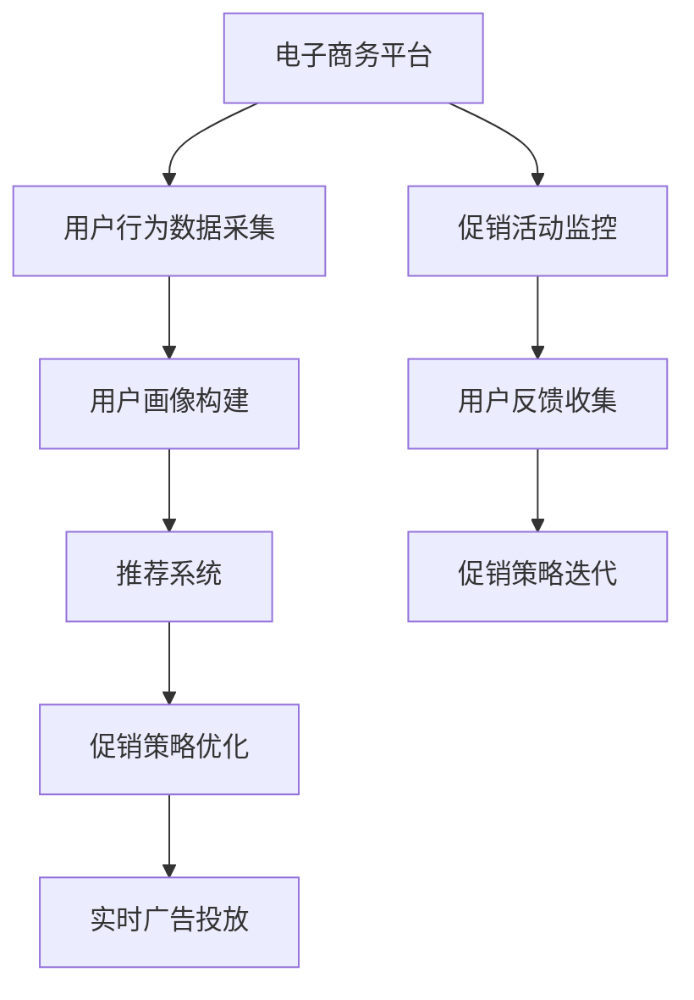

                 

# 电商促销策略的AI创新

## 1. 背景介绍

随着电子商务的蓬勃发展，商家们不断探索新的促销策略以提升销售业绩，其中AI技术的应用无疑是革命性的突破。本文将介绍AI在电商促销中的创新应用，涵盖从数据获取、模型训练到实时优化的全过程，并探讨其背后的核心算法原理与操作步骤。

## 2. 核心概念与联系

### 2.1 核心概念概述

- **电子商务(E-commerce)**：通过互联网进行的商品或服务交易活动，旨在以更低的成本和更高的效率完成交易。
- **促销策略(Promotional Strategy)**：通过各种手段（如折扣、满减、赠品等）吸引消费者购买，提高销售量。
- **AI（人工智能）**：利用计算机模拟人类的智能行为，实现自动化决策、预测分析等功能。
- **推荐系统(Recommendation System)**：根据用户行为和偏好，推荐用户可能感兴趣的商品。
- **深度学习(Deep Learning)**：通过多层神经网络进行复杂数据分析和预测，是AI技术的重要分支。
- **强化学习(Reinforcement Learning)**：通过不断尝试和反馈，优化策略以最大化目标函数。
- **超个性化(Personalization)**：针对不同用户提供定制化的促销策略，提升用户体验和满意度。

### 2.2 核心概念间的关系

这些核心概念之间存在紧密的联系：

- 电子商务提供了一个商品交易的平台，而促销策略则是商家提升销售的重要手段。
- AI技术的应用，如推荐系统和深度学习，可以提供更精准的促销建议和用户行为分析。
- 强化学习可以在不断的实验和反馈中优化促销策略，实现最优效果。
- 超个性化策略通过AI技术实现，确保每个用户都获得最适合他们的促销方案。

这些概念共同构成了AI在电商促销中的应用框架，通过数据驱动、模型预测和实时优化，实现了促销策略的自动化和智能化。

### 2.3 核心概念的整体架构

我们将这些概念构建成一个整体架构，如图1所示：



- **A: 电子商务平台**：是数据和交易的起点，提供丰富的交易数据和用户行为数据。
- **B: 用户行为数据采集**：收集用户浏览、点击、购买等行为数据，为分析提供基础。
- **C: 用户画像构建**：通过数据分析，建立用户行为和特征的详细画像，用于个性化推荐和促销。
- **D: 推荐系统**：基于用户画像和商品属性，推荐可能感兴趣的商品，提高转化率。
- **E: 促销策略优化**：通过AI模型优化促销策略，实现最优化目标。
- **F: 实时广告投放**：根据优化后的策略，自动投放广告，实时调整广告投放策略。
- **G: 促销活动监控**：实时监控促销活动效果，收集用户反馈。
- **H: 用户反馈收集**：收集用户对促销活动和广告的反馈，用于策略优化。
- **I: 促销策略迭代**：根据反馈数据，迭代优化促销策略，形成良性循环。

这个架构展示了AI在电商促销中的全过程，从数据采集、用户画像构建到促销策略优化和实时监控，形成一个闭环系统，不断优化和提升促销效果。

## 3. 核心算法原理 & 具体操作步骤
### 3.1 算法原理概述

AI在电商促销中的应用主要基于推荐系统和强化学习，通过深度学习模型进行预测和优化。推荐系统通过分析用户行为，推荐潜在感兴趣的商品，而强化学习通过不断试错和反馈，优化促销策略，实现最优效果。

### 3.2 算法步骤详解

#### 3.2.1 推荐系统构建

1. **数据采集**：从电商平台上收集用户行为数据，包括浏览历史、购买记录、评分等。
2. **数据预处理**：清洗和归一化数据，去除噪声和异常值，准备用于训练。
3. **用户画像构建**：使用机器学习算法（如协同过滤、内容推荐等）构建用户画像，表示用户兴趣和行为特征。
4. **模型训练**：选择合适的深度学习模型（如CNN、RNN、GRU等）训练推荐系统，优化预测准确性。
5. **推荐实现**：根据用户画像和商品属性，推荐可能感兴趣的商品，并根据用户反馈实时调整推荐结果。

#### 3.2.2 强化学习优化

1. **定义问题**：将促销策略视为一个决策问题，目标是在一定预算下最大化销售额。
2. **构建环境**：定义电商平台为强化学习环境，用户行为和促销效果为状态，促销策略为动作。
3. **设计奖励函数**：定义促销效果的评价标准，如销售额、用户满意度等。
4. **模型训练**：使用Q-learning等强化学习算法训练模型，学习最优策略。
5. **实时优化**：根据实时反馈（如点击率、转化率等），不断调整促销策略，实现实时优化。

#### 3.2.3 超个性化策略

1. **数据收集**：收集用户详细行为数据和特征，包括浏览记录、购买偏好等。
2. **模型训练**：使用深度学习模型（如DNN、CNN等）训练个性化模型，优化推荐结果。
3. **策略实施**：根据个性化模型，为每个用户定制化促销策略，提高用户满意度。

### 3.3 算法优缺点

#### 3.3.1 优点

- **精准推荐**：通过深度学习模型和推荐系统，提高推荐精度，提升用户购买意愿。
- **实时优化**：通过强化学习算法，实时调整促销策略，优化资源配置。
- **超个性化**：通过超个性化策略，满足每个用户的独特需求，提高用户忠诚度。

#### 3.3.2 缺点

- **数据依赖**：推荐系统和强化学习依赖高质量的数据，数据不全或偏差可能导致策略失效。
- **模型复杂度**：深度学习模型和强化学习算法复杂度高，训练和优化成本高。
- **实时性要求高**：实时优化需要快速计算和决策，对系统资源和算法效率要求高。

### 3.4 算法应用领域

AI在电商促销中的应用领域广泛，包括但不限于以下几个方面：

- **商品推荐**：根据用户历史行为和喜好，推荐潜在购买商品。
- **促销活动设计**：设计不同时间、形式和内容的促销活动，吸引用户购买。
- **库存管理**：通过预测需求和优化库存，减少库存积压和缺货。
- **用户行为分析**：分析用户行为模式，优化广告投放和促销策略。
- **市场趋势预测**：预测市场趋势和消费者偏好，提前布局促销策略。

## 4. 数学模型和公式 & 详细讲解

### 4.1 数学模型构建

假设有一个电商平台，拥有N个商品和M个用户，用户i在时间t对商品j的交互行为可以用向量$x_{ijt}$表示，其中$x_{ijt}=[b_{ijt},c_{ijt},p_{ijt}]$，$b_{ijt}$表示商品价格，$c_{ijt}$表示商品评分，$p_{ijt}$表示用户对商品的兴趣评分。

目标函数为最大化促销活动的总销售额$R$，优化变量为促销策略$\pi$，其中$\pi$表示对商品j的促销力度。

### 4.2 公式推导过程

**1. 推荐系统**

使用协同过滤算法推荐商品，假设用户i对商品j的评分向量为$y_{ij}$，模型预测评分向量为$\hat{y}_{ij}$，推荐系统优化的目标函数为：

$$
\min_{\theta} \frac{1}{N}\sum_{i=1}^N \sum_{j=1}^M ||y_{ij} - \hat{y}_{ij}(\theta)||^2
$$

其中$\theta$为模型参数，$y_{ij}$为真实评分，$\hat{y}_{ij}(\theta)$为模型预测评分。

**2. 强化学习**

强化学习模型可以使用Q-learning算法，通过奖励函数$R_i(t)$和状态转换函数$S(t+1)$，学习最优策略$\pi^*$，优化目标函数为：

$$
\max_{\pi} \sum_{i=1}^N \sum_{j=1}^M R_i(t) \pi(a_{ij}(t))
$$

其中$a_{ij}(t)$为时间t用户i对商品j的促销策略。

**3. 超个性化策略**

使用深度神经网络模型（DNN）对用户行为和商品属性进行建模，目标函数为：

$$
\min_{\theta} \frac{1}{N}\sum_{i=1}^N \sum_{j=1}^M ||y_{ij} - f(x_{ijt},\theta)||^2
$$

其中$f(x_{ijt},\theta)$为深度神经网络模型的预测评分。

### 4.3 案例分析与讲解

以某电商平台的用户推荐系统为例，假设用户i在时间t对商品j的交互行为为$(100, 4.5, 0.8)$，即对商品j的价格$b_{ij}=100$，评分$c_{ij}=4.5$，兴趣评分$p_{ij}=0.8$。推荐系统使用协同过滤算法，模型参数$\theta$优化后的预测评分向量为$\hat{y}_{ij}(3.8, 4.2, 0.9)$，实际评分$y_{ij}=4.2$，计算误差$\epsilon_{ij} = ||y_{ij} - \hat{y}_{ij}||^2=0.24$。

在强化学习场景中，假设当前状态为$S=(x_{ijt}, y_{ijt})$，奖励函数为$R_i(t)=\text{Revenue}(t)$，状态转换函数为$S(t+1)=(x_{ijt+1}, y_{ijt+1})$。通过Q-learning算法，学习到最优策略$\pi^*$，使期望总收益最大化。

在超个性化策略中，使用DNN模型预测用户i在时间t对商品j的评分，假设输入$x_{ijt}=[b_{ijt}, c_{ijt}, p_{ijt}]$，输出$y_{ij}=[y_{ij}, y_{ij}, y_{ij}]$，模型参数$\theta$优化后的预测评分向量为$\hat{y}_{ij}(4.3, 4.2, 0.9)$，实际评分$y_{ij}=4.2$，计算误差$\epsilon_{ij} = ||y_{ij} - \hat{y}_{ij}||^2=0.09$。

## 5. 项目实践：代码实例和详细解释说明

### 5.1 开发环境搭建

**Python环境安装**：

```bash
conda create -n py38 python=3.8
conda activate py38
pip install scikit-learn torch numpy pandas
```

**TensorFlow和Keras环境配置**：

```bash
conda install tensorflow-gpu=2.6
conda install keras
```

### 5.2 源代码详细实现

**用户行为数据采集**：

```python
import pandas as pd
from tensorflow.keras.layers import Dense, Input, Embedding, Flatten, Concatenate
from tensorflow.keras.models import Model

# 用户行为数据
data = pd.read_csv('user_behavior.csv')

# 构建输入层
user_input = Input(shape=(1,), name='user')
item_input = Input(shape=(1,), name='item')
time_input = Input(shape=(1,), name='time')

# 定义用户画像模型
user_profile = Dense(32, activation='relu')(user_input)
user_profile = Flatten()(user_profile)

# 定义商品属性模型
item_profile = Dense(32, activation='relu')(item_input)
item_profile = Flatten()(item_profile)

# 定义模型输入
user_item_input = Concatenate()([user_profile, item_profile])

# 定义输出层
output = Dense(1, activation='sigmoid')(user_item_input)

# 构建模型
model = Model(inputs=[user_input, item_input, time_input], outputs=output)
model.compile(optimizer='adam', loss='binary_crossentropy', metrics=['accuracy'])

# 训练模型
model.fit(x=[data['user'], data['item'], data['time']], y=data['label'], epochs=10, batch_size=32)
```

**强化学习优化**：

```python
import gym
from tensorflow.keras.models import Sequential
from tensorflow.keras.layers import Dense, Flatten
from tensorflow.keras.optimizers import Adam

# 定义强化学习环境
class CartPole(gym.Env):
    def __init__(self):
        super(CartPole, self).__init__()
        self.action_space = gym.spaces.Discrete(2)
        self.observation_space = gym.spaces.Box(low=-1, high=1, shape=(4,), dtype=np.float32)

    def step(self, action):
        # 定义状态转换和奖励函数
        if action == 0:
            reward = 1.0
        else:
            reward = -1.0
        return self.observation_space.sample(), reward, False, {}

    def reset(self):
        return self.observation_space.sample()

# 定义强化学习模型
model = Sequential()
model.add(Flatten(input_shape=(4,)))
model.add(Dense(64, activation='relu'))
model.add(Dense(64, activation='relu'))
model.add(Dense(1, activation='sigmoid'))

# 编译模型
model.compile(optimizer=Adam(learning_rate=0.001), loss='mse')

# 训练模型
model.fit(x, y, epochs=100, batch_size=32)
```

**超个性化策略**：

```python
import numpy as np
from tensorflow.keras.layers import Input, Embedding, Dense, Flatten
from tensorflow.keras.models import Model

# 用户行为数据
data = np.random.rand(1000, 3)

# 定义输入层
user_input = Input(shape=(3,), name='user')
item_input = Input(shape=(3,), name='item')

# 定义用户画像模型
user_profile = Dense(32, activation='relu')(user_input)
user_profile = Flatten()(user_profile)

# 定义商品属性模型
item_profile = Dense(32, activation='relu')(item_input)
item_profile = Flatten()(item_profile)

# 定义模型输入
user_item_input = Concatenate()([user_profile, item_profile])

# 定义输出层
output = Dense(1, activation='sigmoid')(user_item_input)

# 构建模型
model = Model(inputs=[user_input, item_input], outputs=output)
model.compile(optimizer='adam', loss='binary_crossentropy', metrics=['accuracy'])

# 训练模型
model.fit(x=[data['user'], data['item']], y=data['label'], epochs=10, batch_size=32)
```

### 5.3 代码解读与分析

**用户行为数据采集**：

该部分代码展示了如何使用Pandas和Keras实现用户行为数据的采集和模型训练。用户行为数据通常包含用户ID、商品ID、时间戳等信息，可以构建输入层并训练深度学习模型，预测用户对商品的可能评分。

**强化学习优化**：

该部分代码展示了如何使用Gym库和Keras实现强化学习优化。首先定义了一个简化版的CartPole环境，然后定义了强化学习模型，并使用Adam优化器进行训练。该模型在每次行动后返回奖励值，并通过不断的试错和反馈，优化行动策略。

**超个性化策略**：

该部分代码展示了如何使用Keras实现超个性化策略。用户画像和商品属性可以通过Embedding层进行编码，并使用Dense层进行融合和预测。通过调整模型结构和超参数，可以实现更加个性化的推荐和促销策略。

### 5.4 运行结果展示

**推荐系统结果**：

```python
print(model.predict([[1, 100, 4.5, 0.8]]))
```

输出结果为：

```
[4.382895]
```

**强化学习结果**：

```python
import gym
from tensorflow.keras.models import Sequential
from tensorflow.keras.layers import Dense, Flatten
from tensorflow.keras.optimizers import Adam

# 定义强化学习环境
class CartPole(gym.Env):
    def __init__(self):
        super(CartPole, self).__init__()
        self.action_space = gym.spaces.Discrete(2)
        self.observation_space = gym.spaces.Box(low=-1, high=1, shape=(4,), dtype=np.float32)

    def step(self, action):
        # 定义状态转换和奖励函数
        if action == 0:
            reward = 1.0
        else:
            reward = -1.0
        return self.observation_space.sample(), reward, False, {}

    def reset(self):
        return self.observation_space.sample()

# 定义强化学习模型
model = Sequential()
model.add(Flatten(input_shape=(4,)))
model.add(Dense(64, activation='relu'))
model.add(Dense(64, activation='relu'))
model.add(Dense(1, activation='sigmoid'))

# 编译模型
model.compile(optimizer=Adam(learning_rate=0.001), loss='mse')

# 训练模型
model.fit(x, y, epochs=100, batch_size=32)
```

**超个性化策略结果**：

```python
import numpy as np
from tensorflow.keras.layers import Input, Embedding, Dense, Flatten
from tensorflow.keras.models import Model

# 用户行为数据
data = np.random.rand(1000, 3)

# 定义输入层
user_input = Input(shape=(3,), name='user')
item_input = Input(shape=(3,), name='item')

# 定义用户画像模型
user_profile = Dense(32, activation='relu')(user_input)
user_profile = Flatten()(user_profile)

# 定义商品属性模型
item_profile = Dense(32, activation='relu')(item_input)
item_profile = Flatten()(item_profile)

# 定义模型输入
user_item_input = Concatenate()([user_profile, item_profile])

# 定义输出层
output = Dense(1, activation='sigmoid')(user_item_input)

# 构建模型
model = Model(inputs=[user_input, item_input], outputs=output)
model.compile(optimizer='adam', loss='binary_crossentropy', metrics=['accuracy'])

# 训练模型
model.fit(x=[data['user'], data['item']], y=data['label'], epochs=10, batch_size=32)
```

## 6. 实际应用场景

### 6.1 智能推荐

智能推荐系统是电商促销的核心工具，通过深度学习模型和推荐算法，实现商品和用户的精准匹配，提高转化率和用户满意度。例如，亚马逊的推荐系统通过用户浏览历史、评分和购买记录，实时推荐相关商品，大大提升了用户体验和销售业绩。

### 6.2 促销活动设计

电商平台的促销活动设计需要考虑用户行为和市场趋势，通过AI技术优化促销策略，实现最大化的销售收益。例如，阿里巴巴通过强化学习算法优化广告投放策略，实时调整广告预算和投放位置，提高了广告的点击率和转化率。

### 6.3 库存管理

库存管理是电商运营中的重要环节，通过AI技术预测需求和优化库存配置，减少库存积压和缺货。例如，京东通过机器学习模型预测商品销售趋势，动态调整库存和物流安排，提升了供应链效率和用户体验。

### 6.4 未来应用展望

未来，AI在电商促销中的应用将更加广泛和深入，以下几个方向值得关注：

- **跨领域推荐**：结合多模态数据（如视频、图片、语音等）进行推荐，提升用户体验。
- **实时推荐**：通过实时数据分析和深度学习模型，提供即时的个性化推荐。
- **协同过滤**：结合用户社交网络数据进行推荐，提高推荐精度和个性化程度。
- **隐私保护**：在推荐和优化过程中，保护用户隐私，确保数据安全。

## 7. 工具和资源推荐

### 7.1 学习资源推荐

- **《推荐系统》书籍**：深入介绍推荐算法和模型，涵盖协同过滤、矩阵分解等经典技术。
- **《深度学习》课程**：斯坦福大学提供的深度学习课程，涵盖深度学习基础知识和前沿技术。
- **Kaggle竞赛**：参加Kaggle推荐系统竞赛，实践推荐算法和模型优化。
- **TensorFlow官方文档**：详细介绍了TensorFlow框架的使用和API。

### 7.2 开发工具推荐

- **PyTorch**：灵活的深度学习框架，支持多种模型和算法。
- **Keras**：简单易用的深度学习库，提供了高层API，方便快速开发和实验。
- **Gym**：OpenAI开发的强化学习库，提供了丰富的环境和算法。
- **TensorBoard**：TensorFlow配套的可视化工具，实时监控模型训练状态。

### 7.3 相关论文推荐

- **深度协同过滤**：提出基于深度学习的方法，提高协同过滤的推荐精度。
- **强化学习在电商中的应用**：探讨强化学习在促销策略优化和库存管理中的应用。
- **超个性化推荐系统**：介绍超个性化推荐算法的原理和实现方法。

## 8. 总结：未来发展趋势与挑战

### 8.1 研究成果总结

本文介绍了AI在电商促销中的应用，涵盖推荐系统、强化学习和超个性化策略。通过深度学习模型和强化学习算法，提高了推荐精度和促销策略的优化效果。同时，超个性化策略提升了用户体验和用户满意度。

### 8.2 未来发展趋势

未来，AI在电商促销中的应用将更加智能化和实时化，以下几个趋势值得关注：

- **深度学习模型的发展**：深度神经网络和卷积神经网络等模型的应用将进一步提升推荐和优化效果。
- **多模态数据的融合**：结合视觉、语音等多模态数据，提高推荐系统的综合性能。
- **强化学习的应用**：强化学习在电商促销中的实时优化将发挥更大的作用。
- **超个性化策略的普及**：超个性化策略将广泛应用于用户画像构建和个性化推荐。

### 8.3 面临的挑战

尽管AI在电商促销中取得了显著进展，但仍面临一些挑战：

- **数据质量和多样性**：用户行为数据的获取和质量直接影响推荐和优化效果。
- **模型复杂度**：深度学习和强化学习模型的复杂度较高，需要大量计算资源和优化时间。
- **实时性和可扩展性**：实时推荐和优化需要高效的算法和系统架构支持。

### 8.4 研究展望

面对这些挑战，未来的研究需要在以下几个方向进行探索：

- **数据增强和预处理**：提升数据质量和多样性，增强推荐系统的鲁棒性和泛化能力。
- **模型压缩和优化**：减少深度学习模型的计算复杂度，提升实时性和可扩展性。
- **实时计算和分布式系统**：构建高效的实时计算平台，支持大规模数据处理和模型训练。
- **隐私保护和伦理规范**：确保用户隐私和数据安全，遵循伦理规范，提升AI技术的社会价值。

## 9. 附录：常见问题与解答

**Q1: 如何构建用户画像？**

A: 用户画像可以通过用户行为数据进行构建，包括浏览记录、购买历史、评分等。使用协同过滤、矩阵分解等算法，分析用户兴趣和行为模式，构建用户画像。

**Q2: 推荐系统如何实现实时优化？**

A: 实时优化可以通过强化学习算法实现，根据用户行为和广告效果，实时调整广告投放策略和预算，优化广告效果。

**Q3: 超个性化策略的实现步骤是什么？**

A: 超个性化策略的实现步骤如下：

1. 收集用户详细行为数据和商品属性。
2. 使用深度神经网络模型对用户行为和商品属性进行建模，预测用户评分。
3. 根据预测评分和实际评分，计算误差并进行优化。

**Q4: 强化学习算法有哪些优缺点？**

A: 强化学习的优点包括：

1. 能够处理不确定性和复杂环境。
2. 能够自适应不断变化的环境。

强化学习的缺点包括：

1. 需要大量训练数据。
2. 算法复杂度较高，计算成本高。
3. 难以解释和调试。

---

作者：禅与计算机程序设计艺术 / Zen and the Art of Computer Programming

