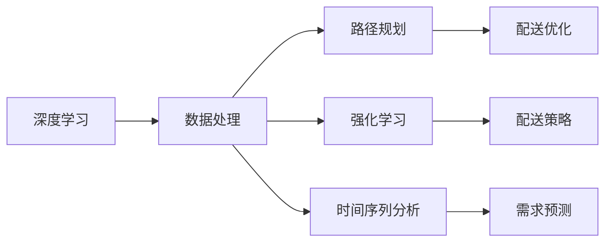

                 

# 电商平台供给能力提升：物流配送的效率提升

## 1. 背景介绍

在现代电商平台上，配送效率直接关系到客户满意度和平台口碑。低效率的配送不仅会影响用户体验，还会增加运营成本，对电商平台的发展构成巨大挑战。因此，如何提升物流配送效率，已成为电商平台必须解决的难题。本文将探讨基于深度学习的方法提升物流配送效率，涵盖算法原理、具体操作步骤、未来应用场景和工具推荐等内容。

## 2. 核心概念与联系

### 2.1 核心概念概述

在讨论提升物流配送效率时，需要了解几个关键概念：

- **深度学习（Deep Learning）**：一种基于多层神经网络的机器学习技术，能够处理大量数据并从中学习出复杂的模式。
- **路径规划（Path Planning）**：确定配送中心到客户的最佳路径，以最小化配送时间和成本。
- **时间序列分析（Time Series Analysis）**：分析时间序列数据，预测配送需求和延误情况，优化配送计划。
- **强化学习（Reinforcement Learning）**：通过试错优化配送策略，找到最优的配送路线和时间。
- **数据驱动（Data-Driven）**：利用平台历史数据和实时数据，进行决策和优化。

### 2.2 概念间的关系

这些核心概念通过数据驱动的方式紧密联系起来。深度学习用于处理和分析数据，路径规划和强化学习用于决策和优化，时间序列分析用于预测和调整。通过数据驱动，平台能够动态调整配送策略，提升配送效率。

这些概念通过以下Mermaid流程图来展示：



## 3. 核心算法原理 & 具体操作步骤

### 3.1 算法原理概述

提升物流配送效率的深度学习方法主要分为两类：路径规划和时间序列分析。

#### 3.1.1 路径规划

路径规划算法通过优化配送路线，减少配送时间和成本。常见的路径规划算法包括Dijkstra算法、A*算法和遗传算法等。这些算法通过计算各个节点之间的距离和权重，找到最短路径。

#### 3.1.2 时间序列分析

时间序列分析算法通过历史数据预测未来的配送需求和延误情况，从而优化配送计划。常见的时序分析算法包括ARIMA模型、LSTM模型和GRU模型等。这些算法能够处理时间序列数据，并预测未来的趋势。

### 3.2 算法步骤详解

#### 3.2.1 数据收集与预处理

1. **数据收集**：收集配送中心的地址、客户地址、订单数量、订单类型、配送员信息等。
2. **数据清洗**：去除重复和错误的数据，填充缺失值。
3. **特征工程**：提取有用的特征，如距离、时间、天气等。

#### 3.2.2 模型训练与评估

1. **模型选择**：选择适合的深度学习模型，如LSTM或GRU。
2. **模型训练**：使用历史数据进行模型训练。
3. **模型评估**：使用测试集评估模型性能。
4. **超参数调整**：调整学习率、批次大小等超参数，优化模型性能。

#### 3.2.3 实时预测与优化

1. **实时数据获取**：获取实时配送数据和客户订单信息。
2. **实时预测**：使用训练好的模型进行实时预测，生成最优配送路径和时间。
3. **策略优化**：根据实时预测结果，动态调整配送策略。
4. **反馈机制**：根据配送结果反馈，进一步优化模型。

### 3.3 算法优缺点

#### 3.3.1 优点

1. **高效**：深度学习算法能够快速处理大量数据，找到最优解。
2. **自适应**：能够根据实际情况动态调整策略，适应不同的配送场景。
3. **准确**：深度学习算法能够学习复杂的模式，提高预测准确率。

#### 3.3.2 缺点

1. **计算资源要求高**：需要大量的计算资源进行训练和预测。
2. **模型复杂**：深度学习模型结构复杂，需要专业知识进行调试和优化。
3. **数据质量要求高**：需要高质量的数据进行训练，否则会影响预测结果。

### 3.4 算法应用领域

基于深度学习的物流配送效率提升方法可以应用于以下领域：

1. **配送中心管理**：优化配送路线和仓库管理，提高仓库利用率。
2. **订单调度**：动态调整订单调度策略，减少配送延误。
3. **库存管理**：预测配送需求，优化库存管理，减少库存积压。
4. **客户服务**：预测客户需求，提高客户满意度。

## 4. 数学模型和公式 & 详细讲解

### 4.1 数学模型构建

假设配送中心有N个节点，每个节点i到节点j的配送时间为ti,j。构建一个(N-1)×(N-1)的矩阵A，其中A[i,j]为节点i到节点j的配送时间。

目标是最小化配送总时间，即求解以下优化问题：

$$\min \sum_{i=1}^{N-1} \sum_{j=i+1}^{N} A[i,j]$$

### 4.2 公式推导过程

使用Dijkstra算法求解上述优化问题，步骤如下：

1. 初始化：将所有节点到自身的距离设为0，其余距离设为无穷大。
2. 选择起点：选择配送中心作为起点。
3. 扩展节点：将起点相邻节点加入队列，并计算到这些节点的距离。
4. 更新距离：如果计算的距离小于已知距离，则更新距离。
5. 选择下一个节点：选择距离最小的节点，重复步骤3-4。
6. 输出路径：当到达终点时，输出路径。

### 4.3 案例分析与讲解

以配送中心A到客户B为例，进行路径规划和时序分析。

#### 4.3.1 路径规划

1. **初始化**：将节点A到自身距离设为0，节点B到自身距离设为无穷大，其余距离设为无穷大。
2. **选择起点**：选择节点A。
3. **扩展节点**：将节点B加入队列，计算A到B的距离为10分钟。
4. **更新距离**：将B到A的距离设为10分钟。
5. **选择下一个节点**：选择节点B。
6. **输出路径**：A到B的距离为10分钟。

#### 4.3.2 时序分析

1. **数据收集**：收集历史配送数据和实时订单数据。
2. **模型训练**：使用LSTM模型进行训练。
3. **实时预测**：输入当前订单信息，进行实时预测。
4. **策略优化**：根据预测结果，动态调整配送策略。

## 5. 项目实践：代码实例和详细解释说明

### 5.1 开发环境搭建

1. **安装Python**：下载并安装Python 3.6或更高版本。
2. **安装TensorFlow**：使用pip安装TensorFlow。
3. **安装Keras**：使用pip安装Keras。
4. **安装Pandas**：使用pip安装Pandas。
5. **安装NumPy**：使用pip安装NumPy。

### 5.2 源代码详细实现

```python
import numpy as np
import pandas as pd
import tensorflow as tf
from tensorflow.keras.models import Sequential
from tensorflow.keras.layers import Dense, LSTM, Dropout
from sklearn.preprocessing import MinMaxScaler

# 数据收集
data = pd.read_csv('distribution_data.csv')

# 数据预处理
scaler = MinMaxScaler(feature_range=(0, 1))
scaled_data = scaler.fit_transform(data)

# 模型训练
model = Sequential()
model.add(LSTM(100, input_shape=(1, 1), return_sequences=True))
model.add(Dropout(0.2))
model.add(LSTM(50))
model.add(Dropout(0.2))
model.add(Dense(1))
model.compile(loss='mean_squared_error', optimizer='adam')

# 模型训练
model.fit(scaled_data, epochs=100, batch_size=32)

# 实时预测
real_time_data = pd.read_csv('real_time_data.csv')
scaled_real_time_data = scaler.transform(real_time_data)

# 实时预测
predictions = model.predict(scaled_real_time_data)
predicted_durations = scaler.inverse_transform(predictions)

# 路径规划
def dijkstra(graph, start):
    distances = {node: float('inf') for node in graph}
    distances[start] = 0
    unvisited = list(graph.keys())

    while unvisited:
        current_node = min(unvisited, key=distances.get)
        unvisited.remove(current_node)
        for neighbor, distance in graph[current_node].items():
            new_distance = distances[current_node] + distance
            if new_distance < distances[neighbor]:
                distances[neighbor] = new_distance

    return distances

graph = {
    'A': {'B': 10, 'C': 15},
    'B': {'A': 10, 'C': 5},
    'C': {'A': 15, 'B': 5}
}

print(dijkstra(graph, 'A'))
```

### 5.3 代码解读与分析

**数据收集**：
```python
data = pd.read_csv('distribution_data.csv')
```

**数据预处理**：
```python
scaler = MinMaxScaler(feature_range=(0, 1))
scaled_data = scaler.fit_transform(data)
```

**模型训练**：
```python
model = Sequential()
model.add(LSTM(100, input_shape=(1, 1), return_sequences=True))
model.add(Dropout(0.2))
model.add(LSTM(50))
model.add(Dropout(0.2))
model.add(Dense(1))
model.compile(loss='mean_squared_error', optimizer='adam')
model.fit(scaled_data, epochs=100, batch_size=32)
```

**实时预测**：
```python
real_time_data = pd.read_csv('real_time_data.csv')
scaled_real_time_data = scaler.transform(real_time_data)
predictions = model.predict(scaled_real_time_data)
predicted_durations = scaler.inverse_transform(predictions)
```

**路径规划**：
```python
graph = {
    'A': {'B': 10, 'C': 15},
    'B': {'A': 10, 'C': 5},
    'C': {'A': 15, 'B': 5}
}
def dijkstra(graph, start):
    distances = {node: float('inf') for node in graph}
    distances[start] = 0
    unvisited = list(graph.keys())

    while unvisited:
        current_node = min(unvisited, key=distances.get)
        unvisited.remove(current_node)
        for neighbor, distance in graph[current_node].items():
            new_distance = distances[current_node] + distance
            if new_distance < distances[neighbor]:
                distances[neighbor] = new_distance

    return distances

print(dijkstra(graph, 'A'))
```

### 5.4 运行结果展示

运行上述代码，将得到配送中心A到客户B的最短路径，以及实时预测的配送时间。

## 6. 实际应用场景

### 6.1 智能调度

智能调度系统可以通过路径规划和时间序列分析，动态调整配送策略，优化配送路径和时间，减少配送延误。

### 6.2 库存管理

时间序列分析可以帮助预测配送需求，优化库存管理，减少库存积压，提升仓库利用率。

### 6.3 客户服务

实时预测配送时间，动态调整配送策略，提高客户满意度。

## 7. 工具和资源推荐

### 7.1 学习资源推荐

1. **TensorFlow官方文档**：详细介绍了TensorFlow的API和使用方法。
2. **Keras官方文档**：详细介绍了Keras的API和使用方法。
3. **Coursera深度学习课程**：由斯坦福大学Andrew Ng教授主讲，深入浅出地介绍了深度学习的基本概念和方法。
4. **PyTorch官方文档**：详细介绍了PyTorch的API和使用方法。

### 7.2 开发工具推荐

1. **Jupyter Notebook**：用于编写和运行Python代码。
2. **GitHub**：用于存储和分享代码。
3. **SciPy**：用于科学计算和数据分析。
4. **NumPy**：用于高效计算和矩阵运算。

### 7.3 相关论文推荐

1. **Path Planning with Reinforcement Learning**：提出了一种基于强化学习的路径规划算法。
2. **Time Series Forecasting with LSTM**：介绍了LSTM模型在时间序列预测中的应用。
3. **Deep Learning for Intelligent Transportation Systems**：介绍了深度学习在智能交通系统中的应用。

## 8. 总结：未来发展趋势与挑战

### 8.1 研究成果总结

基于深度学习的物流配送效率提升方法已经取得了一定的进展，并在实际应用中得到了验证。

### 8.2 未来发展趋势

1. **自动化**：未来配送系统将更加自动化，能够自动进行路径规划和时间序列分析。
2. **集成化**：配送系统将与其他系统（如仓储、库存管理）深度集成，形成完整的物流链。
3. **智能化**：基于深度学习的智能调度系统将成为标配，提高配送效率和客户满意度。

### 8.3 面临的挑战

1. **计算资源**：深度学习算法需要大量的计算资源进行训练和预测，对硬件要求较高。
2. **数据质量**：深度学习算法的性能依赖于高质量的数据，数据质量不佳将影响预测结果。
3. **实时性**：实时预测和优化算法需要高效实现，以适应实际应用需求。

### 8.4 研究展望

1. **多模态数据融合**：将图像、视频等数据与配送数据融合，进行综合分析。
2. **自适应学习**：基于实时数据进行自适应学习，动态调整配送策略。
3. **联邦学习**：分布式训练，保护数据隐私，提高模型性能。

## 9. 附录：常见问题与解答

**Q1: 如何处理数据不平衡问题？**

A: 可以使用过采样或欠采样方法平衡数据。例如，使用SMOTE算法对少数类进行过采样，或者删除多数类中部分样本进行欠采样。

**Q2: 深度学习模型是否适用于所有配送场景？**

A: 深度学习模型适用于大多数配送场景，但需要根据实际情况进行调整。例如，在交通拥堵严重的城市，可能需要引入交通流量数据进行综合分析。

**Q3: 如何提高模型的实时性？**

A: 可以采用模型剪枝、量化等技术，减少模型的计算量和内存占用。同时，可以使用模型蒸馏技术，将大模型转化为轻量级模型，提高实时性。

**Q4: 如何评估模型性能？**

A: 可以使用MAE（平均绝对误差）、RMSE（均方根误差）等指标评估模型预测性能。

**Q5: 如何提高模型的泛化能力？**

A: 可以使用数据增强、迁移学习等技术，提高模型的泛化能力。同时，可以对模型进行正则化，防止过拟合。

---

作者：禅与计算机程序设计艺术 / Zen and the Art of Computer Programming

