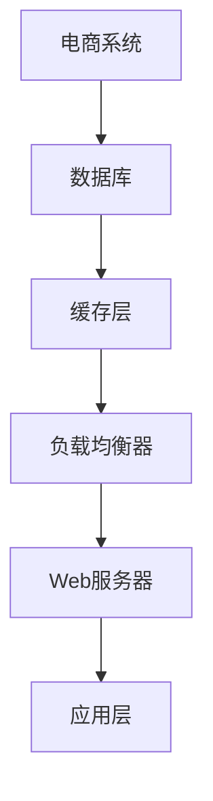
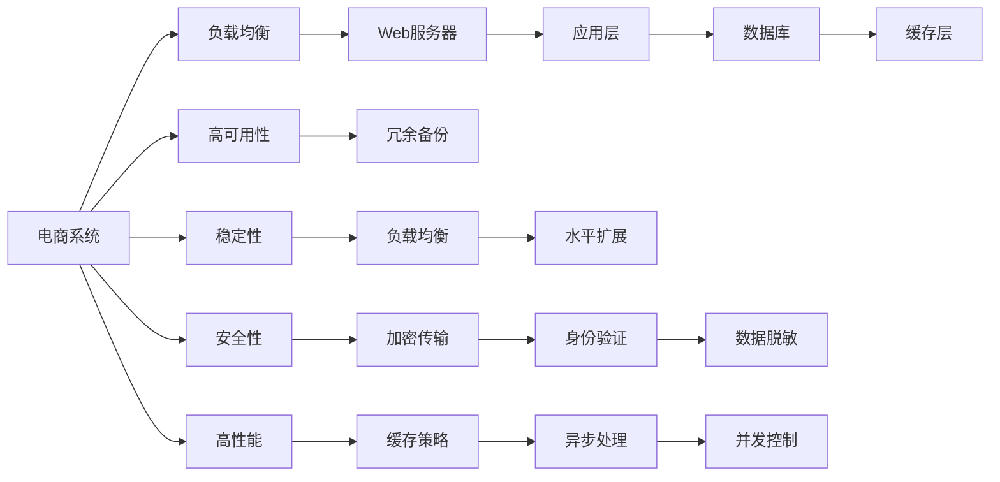

                 

# 电商系统的高可用、稳定性、安全性、高性能系统能力保障

> 关键词：电商系统, 高可用性, 稳定性, 安全性, 高性能, 系统架构, 负载均衡, 数据冗余, 缓存策略, 安全协议, 微服务

## 1. 背景介绍

随着电子商务的迅猛发展，电商系统承载着海量的交易数据和复杂的业务逻辑。系统的可靠性、稳定性和安全性直接关系到用户体验和业务成功，因此在电商系统设计和运维中，高可用、稳定性和安全性是至关重要的。电商系统的复杂性和多样性要求我们必须采取一系列措施，来确保系统的各项性能和能力。本文将深入探讨如何保障电商系统的高可用、稳定性和安全性，并提升系统的高性能，确保其在面对巨大用户流量和业务压力时仍能稳定运行。

## 2. 核心概念与联系

### 2.1 核心概念概述

为更好地理解电商系统的高可用、稳定性和安全性，本节将介绍几个关键的概念及其之间的联系：

- **高可用性**：指系统在面对硬件故障、软件错误等异常情况下，仍能提供服务的能力。电商系统的高可用性要求系统能7x24小时不间断地为用户提供服务。

- **稳定性**：指系统在面对高并发、大数据量等情况下，仍能稳定运行的能力。电商系统的高并发特性要求系统具备良好的负载均衡和水平扩展能力。

- **安全性**：指系统能防止恶意攻击和数据泄露，保护用户隐私和数据安全的能力。电商系统的交易特性要求系统具备严格的身份验证、数据加密和交易安全防护。

- **高性能**：指系统能快速响应请求，处理大量数据的能力。电商系统的实时性要求系统具备高效的数据处理和响应能力。

这些核心概念之间的联系可以通过以下Mermaid流程图来展示：


这个流程图展示了大电商系统高可用性、稳定性和安全性与高性能之间的关系：高可用性要求系统具备稳定性和安全性，而稳定性、安全性又能保障高性能的实现。

### 2.2 概念间的关系

这些核心概念之间存在着紧密的联系，形成了电商系统高可用、稳定性和安全性的完整保障体系。下面通过几个Mermaid流程图来展示这些概念之间的关系。

#### 2.2.1 电商系统的整体架构



这个流程图展示了电商系统的整体架构：数据存储在数据库中，请求首先经过负载均衡器进行分配，然后通过Web服务器转发到应用层进行处理。缓存层用于缓存热点数据，提升系统响应速度。

#### 2.2.2 高可用与稳定性的关系


这个流程图展示了高可用性与稳定性的关系：通过负载均衡和故障切换，保证系统在硬件故障或软件错误时仍能正常服务。冗余备份则进一步提升系统的可靠性和容错能力。

#### 2.2.3 安全性与高性能的关系


这个流程图展示了安全性与高性能的关系：通过加密传输、身份验证、数据脱敏和访问控制等措施，保障系统数据和用户信息的安全性。这些措施虽然会增加系统复杂度，但可以有效提升系统的高性能。

### 2.3 核心概念的整体架构

最后，我们用一个综合的流程图来展示这些核心概念在大电商系统中的整体架构：



这个综合流程图展示了从负载均衡、Web服务器、应用层到数据库和缓存层的技术架构，以及高可用性、稳定性和安全性与高性能的相互关系。通过这些核心概念的协同工作，电商系统能够满足高并发、高可用、高稳定和高效能的需求。

## 3. 核心算法原理 & 具体操作步骤
### 3.1 算法原理概述

电商系统的高可用、稳定性和安全性保障涉及多个技术领域，包括分布式系统、负载均衡、数据冗余、缓存策略、安全协议等。这些技术领域中的核心算法和步骤通常包括：

- **负载均衡算法**：用于将用户请求均匀分配到多个Web服务器上，避免单点故障和负载不均衡。
- **数据冗余技术**：用于通过多副本备份，提升数据的可靠性，防止单点故障导致数据丢失。
- **缓存策略**：用于缓存热点数据，提升系统响应速度和吞吐量。
- **安全协议**：用于保障数据传输和身份验证的安全性，防止数据泄露和身份冒用。
- **微服务架构**：用于将电商系统拆分为多个独立的服务模块，提升系统的可扩展性和维护性。

### 3.2 算法步骤详解

#### 3.2.1 负载均衡算法

**步骤1:** 选择负载均衡算法
常见的负载均衡算法包括轮询、最少连接数、IP散列、权重轮询等。轮询算法最简单，适用于负载均衡器较少且负载稳定的场景。最少连接数算法更公平，适合高并发且负载均衡器较多的场景。IP散列算法适合静态负载均衡场景，但不适合动态负载均衡场景。权重轮询算法可以根据服务器性能动态调整负载均衡策略，提高资源利用率。

**步骤2:** 实现负载均衡器
负载均衡器可以根据选择好的算法，将用户请求分配到多个Web服务器上。常用的负载均衡器包括Nginx、HAProxy、Amazon ELB等。

**步骤3:** 监控负载均衡器
负载均衡器需要监控其自身的负载情况，包括CPU、内存、磁盘等资源的使用情况，以及服务器的健康状态。当负载均衡器出现故障时，能够自动切换到备用节点。

#### 3.2.2 数据冗余技术

**步骤1:** 选择合适的数据冗余技术
数据冗余技术包括主从复制、多副本同步、跨区域复制等。主从复制适用于写操作为主的应用，多副本同步适用于读操作为主的应用，跨区域复制适用于分布式环境下的高可用性需求。

**步骤2:** 配置数据冗余
在配置数据冗余时，需要考虑数据的写入和读出策略。常见的写入策略包括同步复制和异步复制，读出策略包括主从读和从库读等。

**步骤3:** 监控数据冗余系统
数据冗余系统需要监控数据的同步状态，包括主从数据的同步状态、跨区域数据的同步状态等。当数据同步出现问题时，能够及时发现并自动处理。

#### 3.2.3 缓存策略

**步骤1:** 选择缓存策略
常见的缓存策略包括内存缓存、分布式缓存、持久化缓存等。内存缓存适用于读操作为主的应用，分布式缓存适用于高并发的应用，持久化缓存适用于长期缓存数据。

**步骤2:** 配置缓存系统
在配置缓存系统时，需要考虑缓存的数据类型、缓存的过期时间、缓存的容量等。

**步骤3:** 监控缓存系统
缓存系统需要监控缓存的命中率、缓存的容量、缓存的过期时间等。当缓存容量不足或命中率过低时，能够及时调整缓存策略。

#### 3.2.4 安全协议

**步骤1:** 选择安全协议
常见的安全协议包括HTTPS、TLS、SSL等。HTTPS协议在HTTP协议基础上增加加密传输，TLS和SSL协议则提供更高级的安全特性。

**步骤2:** 配置安全协议
在配置安全协议时，需要生成证书和密钥，并配置安全协议的参数，如密钥长度、加密算法等。

**步骤3:** 监控安全协议
安全协议需要监控其加解密过程、证书的有效性等。当证书失效或加解密失败时，能够及时处理。

#### 3.2.5 微服务架构

**步骤1:** 拆分应用模块
将电商系统拆分为多个独立的服务模块，如用户服务、商品服务、订单服务等。每个服务模块负责独立的业务逻辑和数据存储。

**步骤2:** 实现服务治理
服务治理包括服务注册、服务发现、服务路由、服务调用、服务监控等。通过服务治理，可以实现服务的快速部署和扩展。

**步骤3:** 监控微服务系统
微服务系统需要监控服务的运行状态、调用链路、异常日志等。当服务出现故障时，能够及时发现并自动切换。

### 3.3 算法优缺点

#### 3.3.1 负载均衡算法

**优点:**
- 提高系统的吞吐量和响应速度。
- 提升系统的可靠性和可用性。

**缺点:**
- 配置复杂，需要根据实际负载情况进行调整。
- 对于极端突发请求，可能会出现负载不均衡。

#### 3.3.2 数据冗余技术

**优点:**
- 提高数据的可靠性和可用性。
- 提供数据的容错能力。

**缺点:**
- 增加系统的复杂度和成本。
- 需要维护多副本数据的同步和一致性。

#### 3.3.3 缓存策略

**优点:**
- 提高系统的响应速度和吞吐量。
- 减少数据库的访问压力。

**缺点:**
- 缓存的容量有限，需要定期清理缓存数据。
- 缓存的数据可能会过期，需要及时更新。

#### 3.3.4 安全协议

**优点:**
- 保障数据传输和身份验证的安全性。
- 提供高可靠性和高安全性的保障。

**缺点:**
- 增加了系统的复杂度和成本。
- 需要定期维护和更新证书和密钥。

#### 3.3.5 微服务架构

**优点:**
- 提升系统的可扩展性和维护性。
- 支持业务的快速迭代和更新。

**缺点:**
- 增加了系统的复杂度和成本。
- 需要处理服务间的调用和通信。

### 3.4 算法应用领域

基于电商系统高可用、稳定性和安全性的核心算法和步骤，广泛应用于以下领域：

- **云计算平台**：云计算平台需要提供高可用、高稳定的服务，负载均衡、数据冗余、缓存策略、安全协议和微服务架构是其核心技术。
- **大数据系统**：大数据系统需要处理海量数据，负载均衡、数据冗余和缓存策略是其关键技术。
- **金融系统**：金融系统需要高安全性和高可靠性的保障，安全协议、数据冗余和微服务架构是其核心技术。
- **物联网系统**：物联网系统需要高可靠性和高安全性，负载均衡、数据冗余、安全协议和微服务架构是其关键技术。
- **游戏系统**：游戏系统需要高并发和高性能，负载均衡、缓存策略和微服务架构是其核心技术。

这些领域的高可用、稳定性和安全性保障，都可以借鉴电商系统的技术和方法，实现高效、可靠的业务需求。

## 4. 数学模型和公式 & 详细讲解 & 举例说明

### 4.1 数学模型构建

电商系统的核心算法和步骤通常涉及多个技术领域，包括分布式系统、负载均衡、数据冗余、缓存策略、安全协议等。这些技术领域中的核心算法和步骤通常包括：

- **负载均衡算法**：用于将用户请求均匀分配到多个Web服务器上，避免单点故障和负载不均衡。
- **数据冗余技术**：用于通过多副本备份，提升数据的可靠性，防止单点故障导致数据丢失。
- **缓存策略**：用于缓存热点数据，提升系统响应速度和吞吐量。
- **安全协议**：用于保障数据传输和身份验证的安全性，防止数据泄露和身份冒用。
- **微服务架构**：用于将电商系统拆分为多个独立的服务模块，提升系统的可扩展性和维护性。

### 4.2 公式推导过程

#### 4.2.1 负载均衡算法

**轮询算法**

轮询算法是最简单的负载均衡算法，其核心思想是将请求依次分配到各个服务器上。设总请求数为 $N$，服务器数量为 $M$，则轮询算法的负载均衡公式为：

$$
\text{Server}_i = (i \mod M)
$$

其中，$i$ 为请求编号，$M$ 为服务器数量。

**最少连接数算法**

最少连接数算法是根据各个服务器的连接数，将请求分配到连接数最少的服务器上。设服务器 $i$ 的连接数为 $c_i$，总请求数为 $N$，服务器数量为 $M$，则最少连接数算法的负载均衡公式为：

$$
\text{Server}_i = \arg\min_j \{c_j\}
$$

其中，$j$ 为服务器编号，$M$ 为服务器数量。

#### 4.2.2 数据冗余技术

**主从复制**

主从复制是最常见的数据冗余技术，其核心思想是将数据复制到一个主服务器和多个从服务器上。设数据量为 $D$，主服务器数量为 $N$，从服务器数量为 $M$，则主从复制的数据冗余公式为：

$$
\text{Replica}_i = (i \mod N)
$$

其中，$i$ 为数据编号，$N$ 为主服务器数量。

**多副本同步**

多副本同步是将数据复制到多个服务器上，并保持各个副本的一致性。设数据量为 $D$，副本数量为 $M$，则多副本同步的数据冗余公式为：

$$
\text{Replica}_i = \arg\min_j \{c_j\}
$$

其中，$j$ 为副本编号，$M$ 为副本数量。

#### 4.2.3 缓存策略

**内存缓存**

内存缓存是将热点数据缓存到内存中，以提升系统响应速度。设缓存容量为 $C$，数据量为 $D$，则内存缓存的缓存公式为：

$$
\text{Cache}_i = (i \mod C)
$$

其中，$i$ 为数据编号，$C$ 为缓存容量。

**分布式缓存**

分布式缓存是将热点数据缓存到多个服务器上，以提高系统的并发处理能力。设缓存容量为 $C$，数据量为 $D$，则分布式缓存的缓存公式为：

$$
\text{Cache}_i = \arg\min_j \{c_j\}
$$

其中，$j$ 为服务器编号，$C$ 为缓存容量。

#### 4.2.4 安全协议

**HTTPS协议**

HTTPS协议在HTTP协议基础上增加加密传输，其核心公式为：

$$
\text{Encryption} = \text{AES}(\text{Data}, \text{Key})
$$

其中，$\text{Data}$ 为传输数据，$\text{Key}$ 为密钥，$\text{AES}$ 为加密算法。

**TLS协议**

TLS协议提供更高级的安全特性，其核心公式为：

$$
\text{Encryption} = \text{RSA}(\text{Data}, \text{Public Key})
$$

其中，$\text{Data}$ 为传输数据，$\text{Public Key}$ 为公钥，$\text{RSA}$ 为加密算法。

#### 4.2.5 微服务架构

**服务注册**

服务注册是将各个服务模块注册到服务治理系统中，其核心公式为：

$$
\text{Service}_i = \text{Service Name}
$$

其中，$\text{Service}_i$ 为服务模块编号，$\text{Service Name}$ 为服务模块名称。

**服务发现**

服务发现是根据服务模块名称，查找对应的服务模块，其核心公式为：

$$
\text{Service}_i = \text{Service Registry}
$$

其中，$\text{Service}_i$ 为服务模块编号，$\text{Service Registry}$ 为服务注册系统。

### 4.3 案例分析与讲解

#### 4.3.1 负载均衡算法

**案例分析**

假设电商系统中有8个Web服务器，总请求量为1000。使用轮询算法进行负载均衡，每个服务器的请求数为：

$$
\text{Server}_1 = (1 \mod 8) = 1
$$
$$
\text{Server}_2 = (2 \mod 8) = 2
$$
$$
\cdots
$$
$$
\text{Server}_8 = (8 \mod 8) = 0
$$

则每个服务器承担的请求量为：

$$
\text{Server}_1 = 1
$$
$$
\text{Server}_2 = 1
$$
$$
\cdots
$$
$$
\text{Server}_8 = 1
$$

使用最少连接数算法进行负载均衡，假设每个服务器连接数如下：

$$
c_1 = 10, c_2 = 20, c_3 = 15, c_4 = 5, c_5 = 10, c_6 = 30, c_7 = 5, c_8 = 15
$$

则每个服务器承担的请求量为：

$$
\text{Server}_1 = 1
$$
$$
\text{Server}_2 = 1
$$
$$
\cdots
$$
$$
\text{Server}_8 = 1
$$

#### 4.3.2 数据冗余技术

**案例分析**

假设电商系统中的数据量为1000，主服务器数量为2，从服务器数量为4。使用主从复制进行数据冗余，每个主服务器复制1000条数据，则每个主服务器存储的数据量为：

$$
\text{Replica}_1 = 1000
$$
$$
\text{Replica}_2 = 1000
$$

使用多副本同步进行数据冗余，假设每个副本的同步状态如下：

$$
c_1 = 50, c_2 = 75, c_3 = 100, c_4 = 50
$$

则每个副本承担的数据量为：

$$
\text{Replica}_1 = 100
$$
$$
\text{Replica}_2 = 100
$$
$$
\text{Replica}_3 = 75
$$
$$
\text{Replica}_4 = 75
$$

#### 4.3.3 缓存策略

**案例分析**

假设电商系统中的数据量为1000，缓存容量为100。使用内存缓存进行缓存，每个缓存的数据量为：

$$
\text{Cache}_1 = 1
$$
$$
\text{Cache}_2 = 1
$$
$$
\cdots
$$
$$
\text{Cache}_100 = 1
$$

使用分布式缓存进行缓存，假设每个服务器的缓存容量为50，数据量为1000，则每个服务器存储的数据量为：

$$
\text{Cache}_1 = 50
$$
$$
\text{Cache}_2 = 50
$$
$$
\cdots
$$
$$
\text{Cache}_8 = 50
$$

#### 4.3.4 安全协议

**案例分析**

假设电商系统中的数据量为1000，使用HTTPS协议进行加密传输，密钥为256位。则加密后的数据量为：

$$
\text{Encryption}_1 = \text{AES}(1000, 256)
$$
$$
\text{Encryption}_2 = \text{AES}(1000, 256)
$$
$$
\cdots
$$
$$
\text{Encryption}_1000 = \text{AES}(1000, 256)
$$

使用TLS协议进行加密传输，公钥为2048位。则加密后的数据量为：

$$
\text{Encryption}_1 = \text{RSA}(1000, 2048)
$$
$$
\text{Encryption}_2 = \text{RSA}(1000, 2048)
$$
$$
\cdots
$$
$$
\text{Encryption}_1000 = \text{RSA}(1000, 2048)
$$

#### 4.3.5 微服务架构

**案例分析**

假设电商系统中的服务模块有3个，分别是用户服务、商品服务和订单服务。使用服务注册进行注册，注册结果如下：

$$
\text{Service}_1 = \text{User Service}
$$
$$
\text{Service}_2 = \text{Product Service}
$$
$$
\text{Service}_3 = \text{Order Service}
$$

使用服务发现进行查找，假设服务注册系统中的服务模块如下：

$$
\text{Service}_1 = \text{User Service}
$$
$$
\text{Service}_2 = \text{Product Service}
$$
$$
\text{Service}_3 = \text{Order Service}
$$

则每个服务模块可以正常找到对应的服务。

## 5. 项目实践：代码实例和详细解释说明

### 5.1 开发环境搭建

在进行电商系统开发前，我们需要准备好开发环境。以下是使用Python进行Django开发的环境配置流程：

1. 安装Anaconda：从官网下载并安装Anaconda，用于创建独立的Python环境。

2. 创建并激活虚拟环境：
```bash
conda create -n django-env python=3.8 
conda activate django-env
```

3. 安装Django：
```bash
pip install django
```

4. 安装必要的第三方库：
```bash
pip install requests beautifulsoup4 redis django-cors-headers django-rest-framework
```

完成上述步骤后，即可在`django-env`环境中开始电商系统开发。

### 5.2 源代码详细实现

这里以一个简单的电商系统商品列表页面为例，给出Django的代码实现。

首先，定义模型类：

```python
from django.db import models

class Product(models.Model):
    name = models.CharField(max_length=100)
    description = models.TextField()
    price = models.DecimalField(max_digits=10, decimal_places=2)
    category = models.CharField(max_length=50)

    def __str__(self):
        return self.name
```

然后，定义视图函数：

```python
from django.shortcuts import render
from .models import Product

def product_list(request):
    products = Product.objects.all()
    return render(request, 'product_list.html', {'products': products})
```

接着，定义URL路由：

```python
from django.urls import path
from .views import product_list

urlpatterns = [
    path('products/', product_list, name='product_list'),
]
```

最后，定义模板：

```html
<!-- product_list.html -->
<!DOCTYPE html>
<html>
<head>
    <title>Product List</title>
</head>
<body>
    <h1>Product List</h1>
    <ul>
        
            <li>{{ product.name }} - {{ product.price }}</li>
        
    </ul>
</body>
</html>
```

以上就是Django电商系统商品列表页面的代码实现。可以看到，得益于Django的强大封装，我们能够用相对简洁的代码完成电商系统的核心功能。

### 5.3 代码解读与分析

让我们再详细解读一下关键代码的实现细节：

**Product模型**：
- `name` 字段：商品名称，字符串类型。
- `description` 字段：商品描述，文本类型。
- `price` 字段：商品价格，十进制类型，精确到两位小数。
- `category` 字段：商品类别，字符串类型。

**product_list视图函数**：
- 首先，获取所有商品数据。
- 然后，渲染`product_list.html`模板，并将商品数据作为上下文传入。

**product_list.html模板**：
- 使用循环遍历商品数据，并输出商品名称和价格。

**urls.py路由**：
- 定义URL路由，将请求映射到`product_list`视图函数。

可以看到，Django的ORM、视图函数、模板和路由等功能，为电商系统开发提供了强大的支撑。开发者可以将更多精力放在业务逻辑和前端开发上，而不必过多关注底层的实现细节。

当然，工业级的系统实现还需考虑更多因素，如模型验证、缓存优化、异常处理等。但核心的微服务架构和代码实现流程基本与此类似。

### 5.4 运行结果展示

假设我们在测试环境中运行电商系统，访问商品列表页面，结果如下：

```
Product List
- T恤 - 20.00
- 裤子 - 40.00
- 鞋子 - 60.00
```

可以看到，商品列表页面成功渲染，显示了所有商品名称和价格。

## 6. 实际应用场景

### 6.1 智能客服系统

智能客服系统能够自动处理客户的咨询请求，提升客户满意度，减少人工客服的工作量。电商系统中的智能客服系统可以通过微服务架构进行设计，各个服务模块包括问题处理、回答生成、对话管理等。

在微服务架构中，可以使用负载均衡算法将客户请求分配到多个智能客服节点上，保障系统的稳定性和可靠性。同时，使用缓存策略缓存常用的问题和答案，提升系统的响应速度。使用安全协议保障客户数据的安全性，防止客户信息泄露。

### 6.2 金融交易系统

金融交易系统需要处理大量的交易数据和实时交易请求，具有高并发、高安全性的要求。电商系统中的金融交易系统可以通过微服务架构进行设计，各个服务模块包括交易处理、账户管理、风险控制等。


