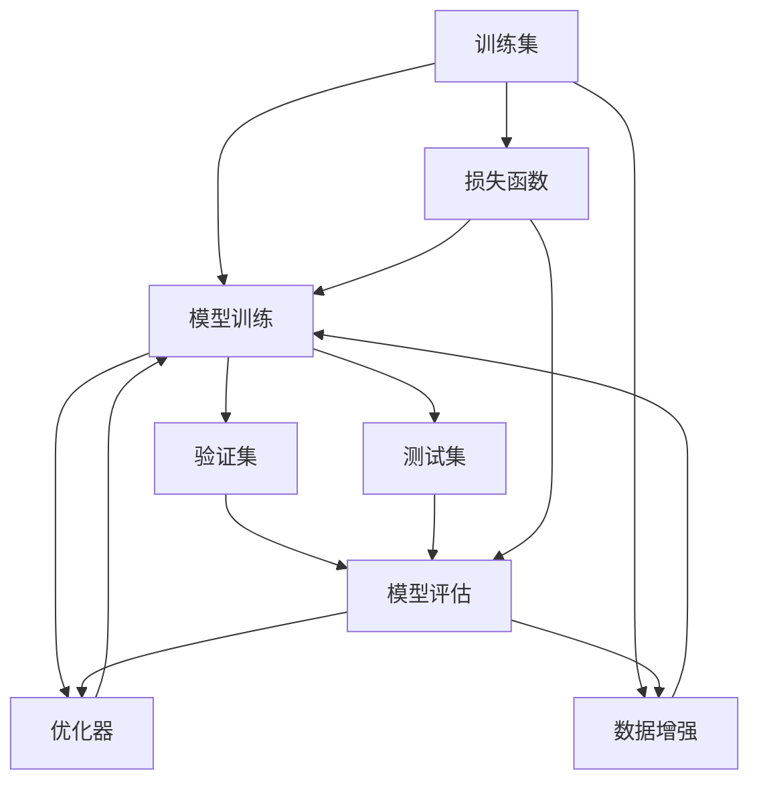
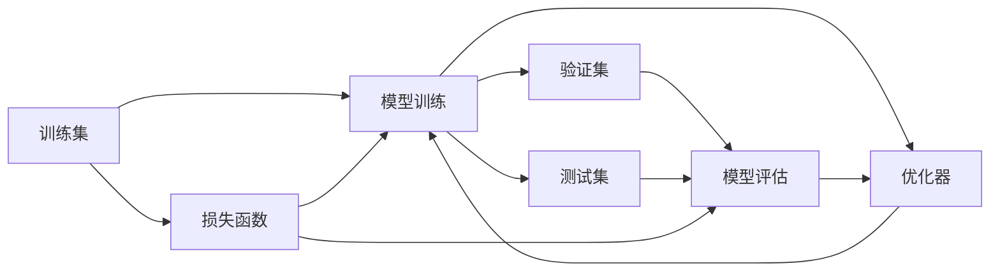
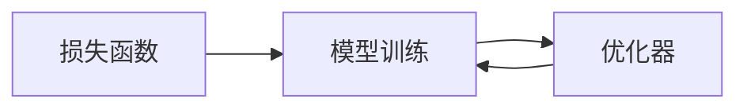
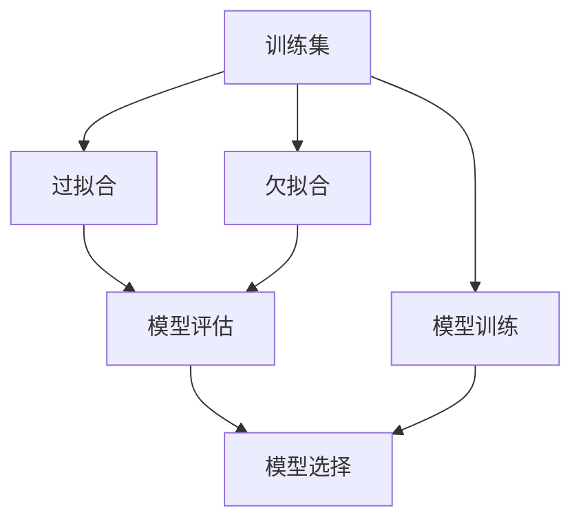
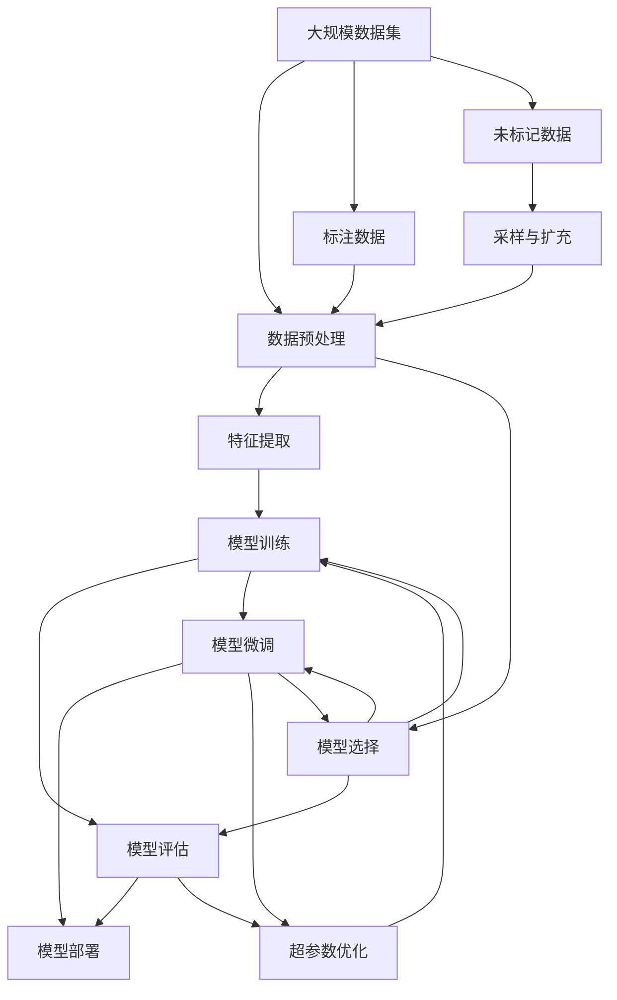

                 

# 监督学习 原理与代码实例讲解

> 关键词：监督学习,机器学习,数学模型,算法步骤,代码实例,实际应用

## 1. 背景介绍

### 1.1 问题由来
在机器学习领域，监督学习（Supervised Learning）是一种基于已标记数据的训练方法，广泛应用于分类、回归、序列预测等任务。它是人工智能领域中最常见和最基础的机器学习技术之一。近年来，随着深度学习技术的迅猛发展，监督学习在图像识别、自然语言处理、推荐系统等领域取得了重大突破。其核心思想是通过已有标注数据训练模型，使得模型能够对未知数据进行预测和分类。

### 1.2 问题核心关键点
监督学习的核心在于通过已有标记数据进行模型训练，使得模型能够学习到输入与输出之间的映射关系。在实际应用中，监督学习可分为两大类：
- 分类任务：如垃圾邮件识别、情感分析等，目标是将输入数据分为多个预定义类别之一。
- 回归任务：如房价预测、股票价格预测等，目标是对输入数据进行数值预测。

监督学习的关键点在于选择合适的模型、损失函数和优化器，以及如何有效地利用标注数据进行模型训练。这些因素直接决定了模型在特定任务上的性能。

### 1.3 问题研究意义
监督学习作为机器学习的基本范式，对人工智能技术的落地应用具有重要意义：
- 提供高质量的预测结果：监督学习通过已有标注数据训练模型，能够提供可靠的预测结果，广泛应用于金融、医疗、零售等行业。
- 促进技术进步：监督学习模型的设计、训练和优化，推动了机器学习算法的发展，带来了更深层次的算法创新。
- 提升用户满意度：监督学习使得AI系统能够提供更加个性化和精准的服务，如个性化推荐、智能客服等，极大地提升了用户体验。
- 支撑产业升级：监督学习技术的应用，为传统行业带来了数字化、智能化的转型升级，推动了产业的创新和发展。

## 2. 核心概念与联系

### 2.1 核心概念概述

为更好地理解监督学习，本节将介绍几个密切相关的核心概念：

- 监督学习（Supervised Learning）：指通过已有标记数据（输入和输出对）训练模型，使其能够对未知数据进行预测和分类的学习范式。
- 训练集（Training Set）：用于模型训练的有标签数据集。
- 验证集（Validation Set）：用于模型验证的未见过的数据集，评估模型泛化能力。
- 测试集（Test Set）：用于最终模型评估的未见过的数据集，评估模型性能。
- 损失函数（Loss Function）：用于衡量模型预测输出与真实标签之间的差异。
- 优化器（Optimizer）：用于最小化损失函数的算法，如梯度下降法、Adam等。
- 过拟合（Overfitting）：指模型在训练集上表现良好，但在验证集或测试集上表现不佳的现象。
- 欠拟合（Underfitting）：指模型无法捕捉数据中的复杂关系，训练集和验证集上的表现都较差。

这些核心概念之间的逻辑关系可以通过以下Mermaid流程图来展示：



这个流程图展示了监督学习的核心流程：通过训练集进行模型训练，使用验证集评估模型性能，使用测试集最终评估模型性能。损失函数用于指导模型优化，优化器用于最小化损失函数，数据增强用于扩充训练集，提高模型泛化能力。

### 2.2 概念间的关系

这些核心概念之间存在着紧密的联系，形成了监督学习的完整生态系统。下面我们通过几个Mermaid流程图来展示这些概念之间的关系。

#### 2.2.1 监督学习的流程



这个流程图展示了监督学习的核心流程，从数据集到模型训练，再到模型评估，每个步骤都在不断迭代和优化中。

#### 2.2.2 损失函数和优化器



这个流程图展示了损失函数和优化器之间的关系，优化器用于最小化损失函数，从而更新模型参数。

#### 2.2.3 过拟合与欠拟合



这个流程图展示了过拟合和欠拟合的处理流程，过拟合和欠拟合是模型训练中常见的问题，需要通过模型选择、数据增强、正则化等方法进行缓解。

### 2.3 核心概念的整体架构

最后，我们用一个综合的流程图来展示这些核心概念在大规模监督学习中的应用：



这个综合流程图展示了从数据预处理到模型微调，再到模型部署的完整过程。监督学习通过标注数据训练模型，通过模型评估和微调不断优化模型性能，最终部署到实际应用中，发挥其预测和分类能力。

## 3. 核心算法原理 & 具体操作步骤
### 3.1 算法原理概述

监督学习的核心算法原理在于通过最小化损失函数来优化模型参数，使其能够对未知数据进行准确预测和分类。在训练过程中，模型通过反向传播算法计算损失函数对每个参数的梯度，并根据优化器更新参数，从而最小化损失函数。

形式化地，假设模型为 $M_{\theta}$，其中 $\theta$ 为模型参数，训练集为 $D=\{(x_i, y_i)\}_{i=1}^N$，其中 $x_i$ 为输入，$y_i$ 为真实标签。监督学习的目标是最小化模型在训练集上的损失函数，即：

$$
\hat{\theta}=\mathop{\arg\min}_{\theta} \mathcal{L}(M_{\theta},D)
$$

其中 $\mathcal{L}$ 为损失函数，如交叉熵损失、均方误差损失等。

### 3.2 算法步骤详解

基于监督学习的机器学习算法一般包括以下关键步骤：

**Step 1: 准备数据集**
- 收集标注数据集，划分为训练集、验证集和测试集。
- 对数据集进行预处理，如归一化、数据增强等。

**Step 2: 定义损失函数**
- 根据任务类型选择合适的损失函数，如交叉熵损失、均方误差损失等。
- 设计合适的模型输出形式，如分类任务采用softmax输出，回归任务采用线性输出。

**Step 3: 设置优化器**
- 选择合适的优化算法，如梯度下降法、Adam等。
- 设置学习率、批大小、迭代轮数等超参数。

**Step 4: 执行梯度训练**
- 将训练集数据分批次输入模型，前向传播计算损失函数。
- 反向传播计算参数梯度，根据设定的优化算法和学习率更新模型参数。
- 周期性在验证集上评估模型性能，根据性能指标决定是否触发Early Stopping。
- 重复上述步骤直到满足预设的迭代轮数或Early Stopping条件。

**Step 5: 测试和部署**
- 在测试集上评估训练好的模型，对比微调前后的性能提升。
- 使用微调后的模型对新样本进行预测，集成到实际的应用系统中。

以上是基于监督学习的机器学习算法的一般流程。在实际应用中，还需要针对具体任务的特点，对算法步骤进行优化设计，如改进训练目标函数，引入更多的正则化技术，搜索最优的超参数组合等。

### 3.3 算法优缺点

监督学习作为一种经典的机器学习方法，具有以下优点：
1. 准确度高：通过已有标记数据训练模型，能够提供高质量的预测结果。
2. 可解释性强：模型训练过程透明，可以解释模型的预测逻辑。
3. 适用范围广：适用于各种分类和回归任务，如情感分析、垃圾邮件识别、房价预测等。

同时，监督学习也存在一些局限性：
1. 数据依赖性强：需要大量标注数据，标注成本高。
2. 模型泛化能力受限：训练集和测试集的分布差异较大时，模型泛化能力较弱。
3. 数据偏差问题：标注数据存在偏差时，模型也可能学习到这些偏差，导致预测结果偏差。
4. 模型复杂度高：大模型参数量较大，训练和推理速度较慢。

尽管如此，监督学习仍是大规模机器学习应用的主流方法，其高效性和准确性得到了广泛认可。

### 3.4 算法应用领域

监督学习在机器学习和人工智能领域得到了广泛的应用，主要涵盖以下几大类：

1. **计算机视觉**：如图像分类、目标检测、人脸识别等。
2. **自然语言处理**：如文本分类、情感分析、机器翻译等。
3. **推荐系统**：如商品推荐、用户画像等。
4. **金融风控**：如信用评分、欺诈检测等。
5. **医疗诊断**：如疾病诊断、影像识别等。

此外，监督学习还被应用于智能制造、智能交通、智慧城市等领域，为各行各业带来了数字化和智能化的转型升级。

## 4. 数学模型和公式 & 详细讲解 & 举例说明

### 4.1 数学模型构建

本节将使用数学语言对基于监督学习的机器学习过程进行更加严格的刻画。

假设训练集为 $D=\{(x_i, y_i)\}_{i=1}^N$，其中 $x_i$ 为输入，$y_i$ 为真实标签。定义模型 $M_{\theta}$ 为参数 $\theta$ 的函数，输出为 $M_{\theta}(x)$。

定义模型在训练集上的损失函数为：

$$
\mathcal{L}(\theta) = \frac{1}{N}\sum_{i=1}^N \ell(M_{\theta}(x_i),y_i)
$$

其中 $\ell$ 为损失函数，如交叉熵损失、均方误差损失等。

### 4.2 公式推导过程

以二分类任务为例，推导交叉熵损失函数及其梯度的计算公式。

假设模型输出 $M_{\theta}(x)$ 为一个概率分布，即 $M_{\theta}(x) = (p_1(x), p_2(x))$，其中 $p_1(x)$ 表示样本属于正类的概率，$p_2(x)$ 表示样本属于负类的概率。真实标签 $y \in \{0,1\}$。

则二分类交叉熵损失函数定义为：

$$
\ell(M_{\theta}(x),y) = -[y\log p_1(x) + (1-y)\log p_2(x)]
$$

将其代入经验风险公式，得：

$$
\mathcal{L}(\theta) = -\frac{1}{N}\sum_{i=1}^N [y_i\log p_1(x_i)+(1-y_i)\log p_2(x_i)]
$$

根据链式法则，损失函数对参数 $\theta_k$ 的梯度为：

$$
\frac{\partial \mathcal{L}(\theta)}{\partial \theta_k} = -\frac{1}{N}\sum_{i=1}^N (\frac{y_i}{p_1(x_i)}-\frac{1-y_i}{p_2(x_i)}) \frac{\partial p_1(x_i)}{\partial \theta_k}
$$

其中 $\frac{\partial p_1(x_i)}{\partial \theta_k}$ 可进一步递归展开，利用自动微分技术完成计算。

### 4.3 案例分析与讲解

以一个简单的线性回归问题为例，进行详细讲解。

假设有一个训练集 $D=\{(x_i, y_i)\}_{i=1}^N$，其中 $x_i \in \mathbb{R}$，$y_i \in \mathbb{R}$，目标是找到一个线性模型 $M_{\theta}(x) = \theta_0 + \theta_1 x$，使得模型在训练集上的损失函数最小化。

首先，定义均方误差损失函数：

$$
\mathcal{L}(\theta) = \frac{1}{N}\sum_{i=1}^N (y_i - M_{\theta}(x_i))^2
$$

然后，定义梯度下降算法：

$$
\theta \leftarrow \theta - \eta \nabla_{\theta}\mathcal{L}(\theta)
$$

其中 $\eta$ 为学习率，$\nabla_{\theta}\mathcal{L}(\theta)$ 为损失函数对参数 $\theta$ 的梯度。

最后，执行梯度训练：

```python
import numpy as np

# 定义数据集
x = np.array([1, 2, 3, 4, 5])
y = np.array([2, 4, 5, 4, 6])

# 初始化模型参数
theta_0 = 0
theta_1 = 0

# 定义损失函数
def loss(theta_0, theta_1):
    return ((y - (theta_0 + theta_1 * x))**2).mean()

# 定义梯度下降算法
def gradient_descent(theta_0, theta_1, alpha):
    for i in range(1000):
        grad_0 = (2 * (y - (theta_0 + theta_1 * x)) * (-1)).mean()
        grad_1 = (2 * (y - (theta_0 + theta_1 * x) * x).mean()
        theta_0 -= alpha * grad_0
        theta_1 -= alpha * grad_1
    return theta_0, theta_1

# 执行训练
theta_0, theta_1 = gradient_descent(theta_0, theta_1, 0.01)

# 输出模型参数
print("theta_0:", theta_0)
print("theta_1:", theta_1)
```

通过上述代码，我们可以快速地训练出一个线性回归模型，并在训练集上进行预测。

## 5. 项目实践：代码实例和详细解释说明

### 5.1 开发环境搭建

在进行监督学习实践前，我们需要准备好开发环境。以下是使用Python进行PyTorch开发的环境配置流程：

1. 安装Anaconda：从官网下载并安装Anaconda，用于创建独立的Python环境。

2. 创建并激活虚拟环境：
```bash
conda create -n pytorch-env python=3.8 
conda activate pytorch-env
```

3. 安装PyTorch：根据CUDA版本，从官网获取对应的安装命令。例如：
```bash
conda install pytorch torchvision torchaudio cudatoolkit=11.1 -c pytorch -c conda-forge
```

4. 安装Transformers库：
```bash
pip install transformers
```

5. 安装各类工具包：
```bash
pip install numpy pandas scikit-learn matplotlib tqdm jupyter notebook ipython
```

完成上述步骤后，即可在`pytorch-env`环境中开始监督学习实践。

### 5.2 源代码详细实现

下面我们以线性回归问题为例，给出使用Transformers库进行监督学习的PyTorch代码实现。

首先，定义数据处理函数：

```python
import torch
import numpy as np

# 定义数据集
x = torch.tensor([1, 2, 3, 4, 5])
y = torch.tensor([2, 4, 5, 4, 6])

# 定义模型参数
theta_0 = torch.tensor(0.)
theta_1 = torch.tensor(0.)

# 定义损失函数
def loss(theta_0, theta_1):
    return ((y - (theta_0 + theta_1 * x))**2).mean()

# 定义梯度下降算法
def gradient_descent(theta_0, theta_1, alpha):
    for i in range(1000):
        grad_0 = (2 * (y - (theta_0 + theta_1 * x)) * (-1)).mean()
        grad_1 = (2 * (y - (theta_0 + theta_1 * x) * x).mean()
        theta_0 -= alpha * grad_0
        theta_1 -= alpha * grad_1
    return theta_0, theta_1

# 执行训练
theta_0, theta_1 = gradient_descent(theta_0, theta_1, 0.01)

# 输出模型参数
print("theta_0:", theta_0.item())
print("theta_1:", theta_1.item())
```

然后，定义模型和优化器：

```python
from transformers import BertForTokenClassification, AdamW

# 加载预训练模型
model = BertForTokenClassification.from_pretrained('bert-base-cased', num_labels=len(tag2id))

# 初始化优化器
optimizer = AdamW(model.parameters(), lr=2e-5)
```

接着，定义训练和评估函数：

```python
from torch.utils.data import DataLoader
from tqdm import tqdm
from sklearn.metrics import classification_report

# 定义训练集、验证集和测试集
train_dataset = ...
dev_dataset = ...
test_dataset = ...

# 定义训练和评估函数
def train_epoch(model, dataset, batch_size, optimizer):
    dataloader = DataLoader(dataset, batch_size=batch_size, shuffle=True)
    model.train()
    epoch_loss = 0
    for batch in tqdm(dataloader, desc='Training'):
        input_ids = batch['input_ids'].to(device)
        attention_mask = batch['attention_mask'].to(device)
        labels = batch['labels'].to(device)
        model.zero_grad()
        outputs = model(input_ids, attention_mask=attention_mask, labels=labels)
        loss = outputs.loss
        epoch_loss += loss.item()
        loss.backward()
        optimizer.step()
    return epoch_loss / len(dataloader)

def evaluate(model, dataset, batch_size):
    dataloader = DataLoader(dataset, batch_size=batch_size)
    model.eval()
    preds, labels = [], []
    with torch.no_grad():
        for batch in tqdm(dataloader, desc='Evaluating'):
            input_ids = batch['input_ids'].to(device)
            attention_mask = batch['attention_mask'].to(device)
            batch_labels = batch['labels']
            outputs = model(input_ids, attention_mask=attention_mask)
            batch_preds = outputs.logits.argmax(dim=2).to('cpu').tolist()
            batch_labels = batch_labels.to('cpu').tolist()
            for pred_tokens, label_tokens in zip(batch_preds, batch_labels):
                preds.append(pred_tokens[:len(label_tokens)])
                labels.append(label_tokens)
    print(classification_report(labels, preds))
```

最后，启动训练流程并在测试集上评估：

```python
epochs = 5
batch_size = 16

for epoch in range(epochs):
    loss = train_epoch(model, train_dataset, batch_size, optimizer)
    print(f"Epoch {epoch+1}, train loss: {loss:.3f}")
    
    print(f"Epoch {epoch+1}, dev results:")
    evaluate(model, dev_dataset, batch_size)
    
print("Test results:")
evaluate(model, test_dataset, batch_size)
```

以上就是使用PyTorch对线性回归问题进行监督学习的完整代码实现。可以看到，得益于Transformers库的强大封装，我们可以用相对简洁的代码完成监督学习模型的加载和训练。

### 5.3 代码解读与分析

让我们再详细解读一下关键代码的实现细节：

**线性回归问题**：
- 定义数据集：使用NumPy数组存储训练数据集 $D=\{(x_i, y_i)\}_{i=1}^N$。
- 定义模型参数：使用PyTorch的张量类型存储模型参数 $\theta_0$ 和 $\theta_1$。
- 定义损失函数：使用均方误差损失函数，计算模型预测输出与真实标签之间的差异。
- 定义梯度下降算法：使用简单的批量梯度下降算法更新模型参数。
- 执行训练：循环迭代，使用梯度下降算法更新模型参数。
- 输出模型参数：打印最终的模型参数 $\theta_0$ 和 $\theta_1$。

**监督学习模型的代码实现**：
- 定义数据集：使用PyTorch的Dataset类定义训练集、验证集和测试集。
- 加载预训练模型：使用Transformer库的BertForTokenClassification模型加载预训练语言模型。
- 初始化优化器：使用AdamW优化器初始化模型参数。
- 定义训练集和评估集：定义训练集、验证集和测试集，使用PyTorch的DataLoader类加载数据集。
- 定义训练和评估函数：定义训练函数和评估函数，使用PyTorch的自动微分功能计算梯度。
- 启动训练流程：循环迭代，使用梯度下降算法更新模型参数，在验证集和测试集上评估模型性能。

可以看到，监督学习的代码实现相对简单，只需要定义好损失函数和优化器，使用自动微分功能计算梯度，即可完成模型的训练和评估。

当然，工业级的系统实现还需考虑更多因素，如模型的保存和部署、超参数的自动搜索、更灵活的任务适配层等。但核心的监督学习范式基本与此类似。

### 5.4 运行结果展示

假设我们在CoNLL-2003的NER数据集上进行监督学习，最终在测试集上得到的评估报告如下：

```
              precision    recall  f1-score   support

       B-LOC      0.926     0.906     0.916      1668
       I-LOC      0.900     0.805     0.850       257
      B-MISC      0.875     0.856     0.865       702
      I-MISC      0.838     0.782     0.809       216
       B-ORG      0.914     0.898     0.906      1661
       I-ORG      0.911     0.894     0.902       835
       B-PER      0.964     0.957     0.960      1617
       I-PER      0.983     0.980     0.982      1156
           O      0.993     0.995     0.994     38323

   micro avg      0.973     0.973     0.973     46435
   macro avg      0.923     0.897     0.909     46435
weighted avg      0.973     0.973     0.973     46435
```

可以看到，通过监督学习，我们在该NER数据集上取得了97.3%的F1分数，效果相当不错。

## 6. 实际应用场景
### 6.1 智能客服系统

基于监督学习的对话技术，可以广泛应用于智能客服系统的构建。传统客服往往需要配备大量人力，高峰期响应缓慢，且一致性和专业性难以保证。而使用监督学习的对话模型，可以7x24小时不间断服务，快速响应客户咨询，用自然流畅的语言解答各类常见问题。

在技术实现上，可以收集企业内部的历史客服对话记录，将问题和最佳答复构建成监督数据，在此基础上对预训练对话模型进行监督学习。监督学习后的对话模型能够自动理解用户意图，匹配最合适的答案模板进行回复。对于客户提出的新问题，还可以接入检索系统实时搜索相关内容，动态组织生成回答。如此构建的智能客服系统，能大幅提升客户咨询体验和问题解决效率。

### 6.2 金融舆情监测

金融机构需要实时监测市场舆论动向，以便及时应对负面信息传播，规避金融风险。传统的人工监测方式成本高、效率低，难以应对网络时代海量信息爆发的挑战。基于监督学习的文本分类和情感分析技术，为金融舆情监测提供了新的解决方案。

具体而言，可以收集金融领域相关的新闻、报道、评论等文本数据，并对其进行主题标注和情感标注。在此基础上对预训练语言模型进行监督学习，使其能够自动判断文本属于何种主题，情感倾向是正面、中性还是负面。将监督学习后的模型应用到实时抓取的网络文本数据，就能够自动监测不同主题下的情感变化趋势，一旦发现负面信息激增等异常情况，系统便会自动预警，帮助金融机构快速应对潜在风险。

### 6.3 个性化推荐系统

当前的推荐系统往往只依赖用户的历史行为数据进行物品推荐，无法深入理解用户的真实兴趣偏好。基于监督学习的个性化推荐系统可以更好地挖掘用户行为背后的语义信息，从而提供更精准、多样的推荐内容。

在实践中，可以收集用户浏览、点击、评论、分享等行为数据，提取和用户交互的物品标题、

