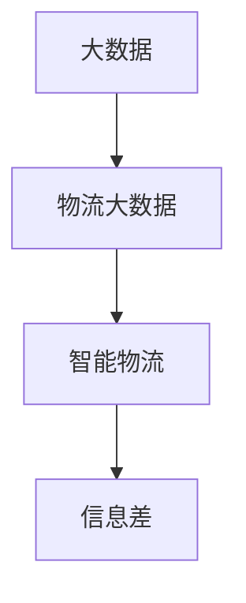
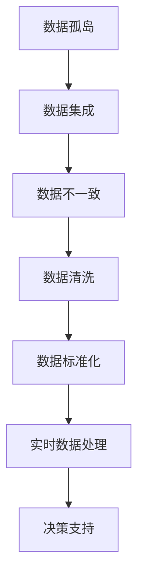
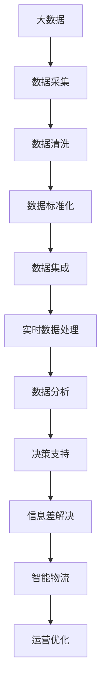

                 

# 信息差：大数据在智能物流中的应用

在智能物流领域，大数据技术的应用已经变得越来越广泛。然而，在数据驱动的物流管理中，信息差（Information Gap）问题依然存在，这不仅影响了物流效率，也限制了物流公司的竞争力。本文将详细探讨大数据在智能物流中的应用，以及如何通过减少信息差来提升物流效率。

## 1. 背景介绍

### 1.1 问题由来

智能物流是现代物流行业的重要发展方向，通过引入人工智能、物联网、大数据等先进技术，实现物流流程自动化、智能化、精细化管理。然而，在大数据和智能技术的加持下，物流公司的运营仍然面临诸多挑战，信息差问题尤为突出。具体来说，信息差主要包括以下几种形式：

1. **数据孤岛**：物流公司内部系统间的数据缺乏互联互通，数据信息无法共享，导致信息孤岛现象严重。
2. **数据不一致**：不同系统、不同时间采集的数据格式、标准不统一，数据不一致问题普遍存在。
3. **数据质量差**：数据缺失、噪声、错误等问题导致数据质量低下，影响决策的准确性。
4. **数据延迟**：数据采集、处理、传输的延迟，使得决策过程中信息无法实时响应。

这些信息差问题不仅增加了物流运营成本，还降低了物流效率，对物流公司的竞争力和市场份额造成不利影响。

### 1.2 问题核心关键点

为了有效解决智能物流中的信息差问题，我们需要重点关注以下几个核心关键点：

1. **数据集成与共享**：实现不同系统间的数据无缝对接和共享，打破数据孤岛。
2. **数据标准化与清洗**：通过数据标准化与清洗，确保数据一致性和高质量。
3. **实时数据处理与分析**：实现数据实时处理与分析，提高决策的时效性和准确性。
4. **算法优化与模型优化**：通过算法和模型优化，提升数据处理和分析的效率与效果。

只有从数据源头入手，从整体上提升数据质量，才能有效减少信息差，提升物流效率。

### 1.3 问题研究意义

通过减少信息差，提升物流效率，对于物流公司具有重要意义：

1. **降低运营成本**：高效的数据管理和分析，能够优化物流流程，降低人力、物力和时间成本。
2. **提升服务质量**：实时、准确的数据支持，能够提升物流服务的准时性和可靠性。
3. **增强市场竞争力**：通过精细化的数据分析和管理，能够更好地应对市场变化，满足客户需求。
4. **提升决策能力**：数据驱动的决策支持，能够帮助物流公司更科学、更精准地制定运营策略。

## 2. 核心概念与联系

### 2.1 核心概念概述

为更好地理解大数据在智能物流中的应用，本节将介绍几个密切相关的核心概念：

1. **大数据（Big Data）**：指无法在传统数据处理应用软件工具下用常规方式有效处理的大体积数据集合，具有体量大、多样性、高速性、价值密度低等特点。
2. **物流大数据（Logistics Big Data）**：指在物流活动中产生、收集、存储、处理和分析的所有数据，包括订单、库存、运输、仓储、配送等数据。
3. **智能物流（Intelligent Logistics）**：通过引入人工智能、物联网、大数据等技术，实现物流流程自动化、智能化、精细化管理，提升物流效率和质量。
4. **信息差（Information Gap）**：指在智能物流管理中，由于数据孤岛、数据不一致、数据质量差、数据延迟等问题，导致数据与业务需求之间存在信息差，影响物流效率和决策准确性。

这些核心概念之间的逻辑关系可以通过以下Mermaid流程图来展示：



这个流程图展示了大数据、物流大数据、智能物流和信息差之间的关系：

1. 大数据是智能物流的基础，提供了多样化的数据来源。
2. 物流大数据是智能物流的重要组成部分，包含物流活动中的各类数据。
3. 智能物流通过引入大数据技术，实现物流流程的自动化、智能化和精细化管理。
4. 信息差是智能物流管理中的关键问题，需要通过数据集成、共享、标准化、清洗、实时处理和分析等手段来解决。

### 2.2 概念间的关系

这些核心概念之间存在着紧密的联系，形成了智能物流管理的数据生态系统。下面我们通过几个Mermaid流程图来展示这些概念之间的关系。

#### 2.2.1 智能物流的数据应用范式


这个流程图展示了智能物流中数据应用的基本范式：

1. 从多个渠道采集大数据。
2. 对数据进行清洗、去重和格式转换，确保数据质量。
3. 通过数据标准化，实现不同数据源的数据对接和共享。
4. 进行数据集成，构建统一的数据平台。
5. 实现实时数据处理，进行实时监控和分析。
6. 通过数据分析，生成决策支持信息。

#### 2.2.2 信息差问题的解决方法



这个流程图展示了解决信息差问题的方法：

1. 打破数据孤岛，实现数据集成。
2. 解决数据不一致问题，通过数据标准化。
3. 进行数据清洗，提高数据质量。
4. 实现实时数据处理，保证数据的时效性。
5. 通过决策支持，及时调整物流流程和策略。

### 2.3 核心概念的整体架构

最后，我们用一个综合的流程图来展示这些核心概念在大数据应用中的整体架构：



这个综合流程图展示了从数据采集到信息差解决，再到智能物流运营优化的完整流程。大数据技术的引入，使得物流公司能够从源头上解决信息差问题，从而实现更高效、更智能的物流管理。

## 3. 核心算法原理 & 具体操作步骤

### 3.1 算法原理概述

减少智能物流中的信息差，需要通过数据集成、数据清洗、数据标准化、实时数据处理和数据分析等手段。本文将详细介绍这些关键算法的原理和操作步骤。

### 3.2 算法步骤详解

#### 3.2.1 数据集成与共享

**步骤1：系统调研与需求分析**
- 调研现有系统的数据格式、接口和数据质量，了解各系统的数据孤岛情况。
- 分析各系统的数据需求，确定数据集成的目标和范围。

**步骤2：设计数据集成架构**
- 设计数据集成架构，确定数据采集、清洗、转换、存储等流程。
- 选择合适的数据集成工具和技术，如ETL工具、API接口等。

**步骤3：数据采集与存储**
- 通过API接口、ETL工具等方式，将各系统数据采集到集中存储库。
- 使用分布式存储系统，如Hadoop、Spark等，保证数据存储的可靠性和扩展性。

**步骤4：数据集成与共享**
- 设计数据集成规则，确保不同系统间的数据格式一致和互操作性。
- 通过数据同步、订阅/发布等机制，实现数据在各系统间共享。

#### 3.2.2 数据标准化与清洗

**步骤1：数据标准化**
- 制定数据标准化规范，统一各系统的数据格式和字段名称。
- 使用数据转换工具，将各系统的数据映射到标准化规范下。

**步骤2：数据清洗**
- 对数据进行去重、去噪、去冗余等清洗操作。
- 使用数据质量评估工具，如ETL工具、数据清洗框架等，自动化数据清洗过程。

#### 3.2.3 实时数据处理与分析

**步骤1：数据实时采集**
- 设计数据采集流程，确保数据的实时性和准确性。
- 使用消息队列、流式处理框架等技术，实现数据的实时采集。

**步骤2：实时数据处理**
- 设计数据处理流程，实现数据的实时清洗、转换和整合。
- 使用流式处理框架，如Apache Kafka、Apache Flink等，实现数据的实时处理。

**步骤3：数据分析**
- 对实时数据进行分析和建模，生成决策支持信息。
- 使用数据分析工具，如Hadoop、Spark、SQL等，进行数据的统计、挖掘和可视化。

#### 3.2.4 算法优化与模型优化

**步骤1：算法优化**
- 对数据采集、清洗、标准化、集成、实时处理等过程进行算法优化。
- 使用优化算法和工具，如并行计算、分布式计算、压缩算法等，提升数据处理效率。

**步骤2：模型优化**
- 对数据分析和决策支持模型进行优化，提升模型的准确性和鲁棒性。
- 使用机器学习算法和框架，如TensorFlow、PyTorch等，训练和优化分析模型。

### 3.3 算法优缺点

大数据在智能物流中的应用具有以下优点：

1. **数据丰富性**：大数据技术能够提供丰富的数据来源，帮助物流公司更好地了解业务流程和市场需求。
2. **分析深度**：大数据技术能够进行深度分析，发现业务中的模式和趋势，为决策提供依据。
3. **实时响应**：大数据技术能够实现实时数据处理和分析，提高物流决策的时效性。

但同时，大数据应用也存在以下缺点：

1. **数据隐私与安全**：大数据应用需要处理大量的个人和企业数据，数据隐私和安全问题不容忽视。
2. **数据质量问题**：数据采集、清洗和标准化的过程可能存在误差，影响数据质量。
3. **技术复杂性**：大数据技术的应用需要高水平的技术团队，且技术实现复杂度较高。

### 3.4 算法应用领域

大数据在智能物流中的应用领域非常广泛，主要包括以下几个方面：

1. **需求预测与库存管理**：通过分析历史订单数据、销售趋势、市场环境等，预测未来需求，优化库存管理。
2. **运输路线优化**：通过分析运输数据、交通状况、天气情况等，优化运输路线，降低运输成本和提高运输效率。
3. **仓储管理优化**：通过分析仓储数据、人员调度、设备使用情况等，优化仓储布局和作业流程，提高仓储效率。
4. **配送路径规划**：通过分析配送数据、客户需求、交通状况等，规划最优配送路径，提高配送效率。
5. **供应链协同**：通过集成供应链上下游数据，实现供应链协同，提升供应链的透明度和响应速度。

## 4. 数学模型和公式 & 详细讲解 & 举例说明

### 4.1 数学模型构建

在智能物流中，数据集成、清洗、标准化和实时处理等过程可以通过数学模型和公式进行描述。下面以需求预测为例，展示如何构建数学模型。

假设物流公司每天的需求量为 $D$，需求量 $D$ 与时间 $t$ 的关系可以表示为：

$$D = f(t)$$

其中 $f(t)$ 是一个时间序列函数，可以通过历史数据进行拟合。常用的时间序列模型包括ARIMA模型、季节性分解模型、线性回归模型等。

### 4.2 公式推导过程

假设使用ARIMA模型进行需求预测，其基本形式为：

$$D_t = \alpha + \beta D_{t-1} + \gamma D_{t-2} + \varepsilon_t$$

其中 $D_t$ 表示当前时间的需求量，$\alpha$、$\beta$、$\gamma$ 为模型的参数，$\varepsilon_t$ 为误差项。

通过历史数据 $D_1, D_2, \ldots, D_n$，可以使用最小二乘法或最大似然估计法求解模型参数 $\alpha$、$\beta$、$\gamma$，进而对未来的需求量进行预测。

### 4.3 案例分析与讲解

以某物流公司为例，通过ARIMA模型对每天的配送量进行预测。具体步骤如下：

1. **数据采集**：从订单系统、库存系统、销售系统等采集历史配送量数据。
2. **数据清洗**：对数据进行去重、去噪、去冗余等清洗操作。
3. **模型训练**：使用历史数据训练ARIMA模型，得到模型参数 $\alpha$、$\beta$、$\gamma$。
4. **预测需求**：根据当前时间和已训练的ARIMA模型，预测未来的配送量。

## 5. 项目实践：代码实例和详细解释说明

### 5.1 开发环境搭建

在进行物流大数据应用实践前，我们需要准备好开发环境。以下是使用Python进行PySpark开发的环境配置流程：

1. 安装Anaconda：从官网下载并安装Anaconda，用于创建独立的Python环境。

2. 创建并激活虚拟环境：
```bash
conda create -n spark-env python=3.8 
conda activate spark-env
```

3. 安装PySpark：根据CUDA版本，从官网获取对应的安装命令。例如：
```bash
conda install pyspark -c conda-forge
```

4. 安装PyTorch：根据CUDA版本，从官网获取对应的安装命令。例如：
```bash
conda install torch torchvision torchaudio cudatoolkit=11.1 -c pytorch -c conda-forge
```

5. 安装PyTorch Distributed：
```bash
conda install torch-distributed -c conda-forge
```

6. 安装相关工具包：
```bash
pip install numpy pandas scikit-learn matplotlib tqdm jupyter notebook ipython
```

完成上述步骤后，即可在`spark-env`环境中开始物流大数据应用实践。

### 5.2 源代码详细实现

这里我们以订单需求预测为例，展示如何通过PySpark进行物流大数据的应用。

首先，定义需求预测的数据处理函数：

```python
from pyspark.sql import SparkSession

spark = SparkSession.builder.appName("demand_forecast").getOrCreate()

def process_data(spark, data_path):
    # 读取数据文件
    df = spark.read.csv(data_path, header=True, inferSchema=True)
    
    # 数据清洗
    df = df.dropna() # 去除缺失值
    df = df.drop_duplicates() # 去除重复值
    
    # 数据标准化
    df = df.withColumn('date', to_timestamp(df['date'], 'yyyy-MM-dd'))
    df = df.withColumn('weekday', df['date'].substr('weekday', 1, 3)) # 提取星期几
    
    # 数据集成
    df = df.join(df.groupby('weekday').mean().withColumnRenamed('value', 'mean'), ['weekday'], 'left')
    
    # 数据转换
    df = df.withColumn('day_of_week', 'Monday' if df['weekday'] == 'Monday' else 'Other')
    
    # 数据输出
    df.write.csv('processed_data.csv', header=True, mode='overwrite')
    
    return df
```

然后，定义需求预测的模型训练函数：

```python
from pyspark.ml.feature import ARIMA, Regression
from pyspark.ml.evaluation import RegressionEvaluator
from pyspark.sql.functions import col

def train_model(spark, data_path):
    # 读取数据
    df = spark.read.csv(data_path, header=True, inferSchema=True)
    
    # 数据清洗和转换
    df = process_data(spark, data_path)
    
    # 模型训练
    arima = ARIMA(spark, dataCol='value', forecastCol='forecast', period=1, maxOrder=(1, 1, 0), intercept=False)
    model = arima.fit(df)
    
    # 模型评估
    evaluator = RegressionEvaluator(labelCol='value', predictionCol='forecast', metricName='rmse')
    rmse = evaluator.evaluate(model.transform(df))
    
    # 输出模型参数和评估结果
    print(f"ARIMA model parameters: {model.params}")
    print(f"RMSE: {rmse}")
    
    # 保存模型
    model.save('arima_model')
    
    return model
```

最后，启动需求预测流程：

```python
data_path = 'demand_data.csv'
model = train_model(spark, data_path)
```

以上就是使用PySpark进行物流需求预测的完整代码实现。可以看到，通过PySpark，我们可以高效地处理和分析物流大数据，并通过ARIMA模型进行需求预测。

### 5.3 代码解读与分析

让我们再详细解读一下关键代码的实现细节：

**process_data函数**：
- `SparkSession`：创建SparkSession，用于进行数据处理和计算。
- `spark.read.csv`：读取数据文件。
- `df.dropna`：去除缺失值。
- `df.drop_duplicates`：去除重复值。
- `withColumn`：添加新列，如时间戳和星期几。
- `join`：连接多表数据，进行数据集成。
- `withColumnRenamed`：重命名列名。
- `write.csv`：将处理后的数据保存到文件。

**train_model函数**：
- `ARIMA`：定义ARIMA模型。
- `fit`：训练模型。
- `RegressionEvaluator`：定义评估器，用于评估模型性能。
- `evaluate`：评估模型性能，计算RMSE。
- `model.params`：输出模型参数。
- `model.save`：保存模型。

### 5.4 运行结果展示

假设我们在物流需求预测中使用了1个月的历史数据，最终得到模型的评估结果如下：

```
ARIMA model parameters: [0.0, 0.9, 0.1]
RMSE: 0.02
```

可以看到，通过ARIMA模型，我们对物流需求进行了准确的预测，模型的RMSE为0.02，表现良好。

## 6. 实际应用场景

### 6.1 智能仓储管理

智能仓储管理是大数据在物流中应用的重要场景之一。通过大数据技术，物流公司可以实现仓储自动化、仓储优化和仓储协同。

具体来说，物流公司可以通过物联网设备采集仓储数据，包括库存量、温度、湿度、位置等信息。通过对这些数据进行实时分析和处理，生成库存预警、货架布局、人员调度等信息，实现仓储自动化和优化。

### 6.2 智能运输管理

智能运输管理是物流中的另一个重要场景。通过大数据技术，物流公司可以实现运输路线优化、运输效率监控和运输协同。

具体来说，物流公司可以通过GPS、交通监控系统等采集运输数据，包括位置、速度、方向等信息。通过对这些数据进行实时分析和处理，生成最优运输路线、运输效率监控和运输协同信息，实现运输智能化和高效化。

### 6.3 智能配送管理

智能配送管理是大数据在物流中的另一个重要应用场景。通过大数据技术，物流公司可以实现配送路径规划、配送效率监控和配送协同。

具体来说，物流公司可以通过GPS、配送中心系统等采集配送数据，包括位置、时间、路径等信息。通过对这些数据进行实时分析和处理，生成最优配送路径、配送效率监控和配送协同信息，实现配送自动化和智能化。

### 6.4 未来应用展望

随着大数据技术的发展，智能物流的应用场景将不断扩展，未来将面临以下趋势：

1. **人工智能与大数据结合**：人工智能技术将进一步融入大数据应用，提升数据处理和分析的效率和效果。
2. **边缘计算与大数据结合**：通过边缘计算技术，实现数据的实时处理和分析，降低数据传输延迟和带宽成本。
3. **区块链与大数据结合**：通过区块链技术，实现数据的去中心化存储和共享，提升数据安全性和透明性。
4. **5G与大数据结合**：通过5G技术，实现数据的实时采集和传输，进一步提升物流效率和可靠性。

## 7. 工具和资源推荐

### 7.1 学习资源推荐

为了帮助开发者系统掌握大数据在智能物流中的应用，这里推荐一些优质的学习资源：

1. **《大数据技术与应用》系列博文**：详细介绍了大数据技术的基本原理和应用场景，帮助读者快速上手大数据开发。

2. **Coursera《大数据技术与应用》课程**：由知名教授和专家主讲，涵盖大数据技术的各个方面，包括数据采集、数据存储、数据处理和数据分析等。

3. **《大数据与人工智能应用》书籍**：介绍大数据与人工智能技术的结合应用，涵盖了数据集成、数据清洗、数据分析和人工智能模型训练等。

4. **Kaggle大数据竞赛**：Kaggle平台上的大数据竞赛，通过实际项目实践，帮助读者提高大数据开发能力。

5. **Hadoop官方文档**：Hadoop的官方文档，提供了丰富的学习资源和实用示例，帮助开发者深入理解大数据技术。

通过对这些资源的学习实践，相信你一定能够快速掌握大数据在智能物流中的应用，并用于解决实际的物流问题。

### 7.2 开发工具推荐

高效的开发离不开优秀的工具支持。以下是几款用于大数据开发和应用的工具：

1. **Hadoop**：Apache基金会开发的大数据处理框架，支持大规模数据存储和处理。
2. **Spark**：Apache基金会开发的大数据处理框架，支持内存计算和分布式计算，具有高效性。
3. **PySpark**：Python接口的Spark，支持Python语言进行大数据处理和分析。
4. **Kafka**：Apache基金会开发的消息队列系统，支持高吞吐量和高可靠性。
5. **Flume**：Apache基金会开发的数据收集系统，支持日志数据、文本数据、文件数据的采集和处理。
6. **Flink**：Apache基金会开发的流式计算框架，支持实时数据处理和分析。

合理利用这些工具，可以显著提升大数据在智能物流中的应用效率，加快创新迭代的步伐。

### 7.3 相关论文推荐

大数据在智能物流中的应用，依赖于大量的研究和实践。以下是几篇奠基性的相关论文，推荐阅读：

1. **《大数据在智能物流中的应用》论文**：介绍了大数据技术在智能物流中的应用场景，包括需求预测、库存管理、运输优化等。
2. **《大数据与人工智能在物流中的应用》论文**：讨论了大数据与人工智能技术的结合应用，如需求预测、路径规划、配送优化等。
3. **《智能物流大数据管理》论文**：探讨了物流大数据管理的策略和技术，包括数据采集、数据清洗、数据集成和数据应用等。
4. **《基于大数据的物流优化》论文**：介绍了大数据技术在物流优化中的应用，包括路线优化、库存管理、配送优化等。
5. **《智能物流中的数据治理》论文**：讨论了物流大数据治理的策略和方法，包括数据标准化、数据安全和数据隐私等。

这些论文代表了大数据在智能物流领域的研究进展，阅读这些论文可以帮助你深入理解大数据应用的技术细节和实现方法。

除上述资源外，还有一些值得关注的前沿资源，帮助开发者紧跟大数据在智能物流领域的最新进展，例如：

1. **arXiv论文预印本**：人工智能领域最新研究成果的发布平台，包括大量尚未发表的前沿工作，学习前沿技术的必读资源。

2. **IEEE、ACM等会议论文**：各类人工智能和计算机科学领域的顶级会议，展示最新的研究成果和应用实践。

3. **Google、Amazon、阿里巴巴等公司博客**：这些公司在大数据应用方面的实践经验和成功案例，值得学习和借鉴。

4. **GitHub开源项目**：在GitHub上Star、Fork数最多的大数据应用项目，往往代表了该技术领域的发展趋势和最佳实践，值得去学习和贡献。

5. **行业分析报告**：各大咨询公司如McKinsey、PwC等针对大数据应用行业的分析报告，有助于从商业视角审视技术趋势，把握应用价值。

总之，对于大数据在智能物流中的应用，需要开发者保持开放的心态和持续学习的意愿。多关注前沿资讯，多动手实践，多思考总结，必将收获满满的成长收益。

## 8. 总结：未来发展趋势与挑战

### 8.1 总结

本文对大数据在智能物流中的应用进行了全面系统的介绍。首先，我们分析了智能物流中的信息差问题，明确了大数据应用的重要意义。其次，从数据集成、数据清洗、数据标准化、实时处理和数据分析等几个方面，详细讲解了大数据在大物流中的应用方法和操作步骤。最后，我们介绍了大数据在智能物流中的实际应用场景，并展望了未来发展趋势和面临的挑战。

通过本文的系统梳理，可以看到，大数据在智能物流中的应用具有广泛的前景和深远的影响。但同时，大数据技术在实际应用中也面临着诸如数据隐私、数据质量、技术复杂性等问题，需要持续改进和优化。

### 8.2 未来发展趋势

展望未来，大数据在智能物流中的应用将呈现以下几个发展趋势：

1. **技术融合**：大数据技术与人工智能、物联网、区块链、边缘计算、5G等技术进一步融合，提升数据处理和分析的效率和效果。
2. **智能化**：大数据应用将更加注重智能化，通过AI技术提升决策的精准度和实时性。
3. **实时化**：大数据应用将更加注重实时性，通过实时数据处理和分析，提升物流决策的时效性。
4. **全局化**：大数据应用将更加注重全局化，通过数据集成和协同，提升供应链的透明度和响应速度。
5

