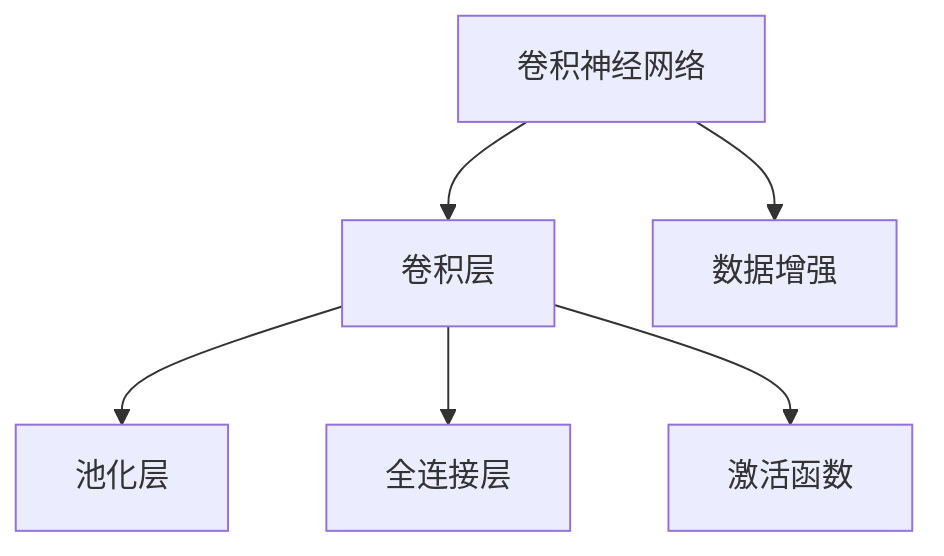
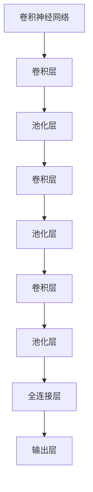
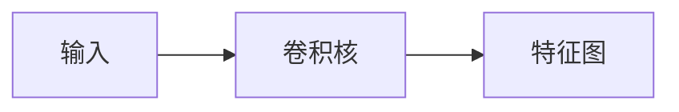
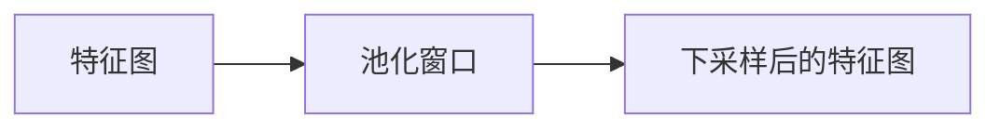
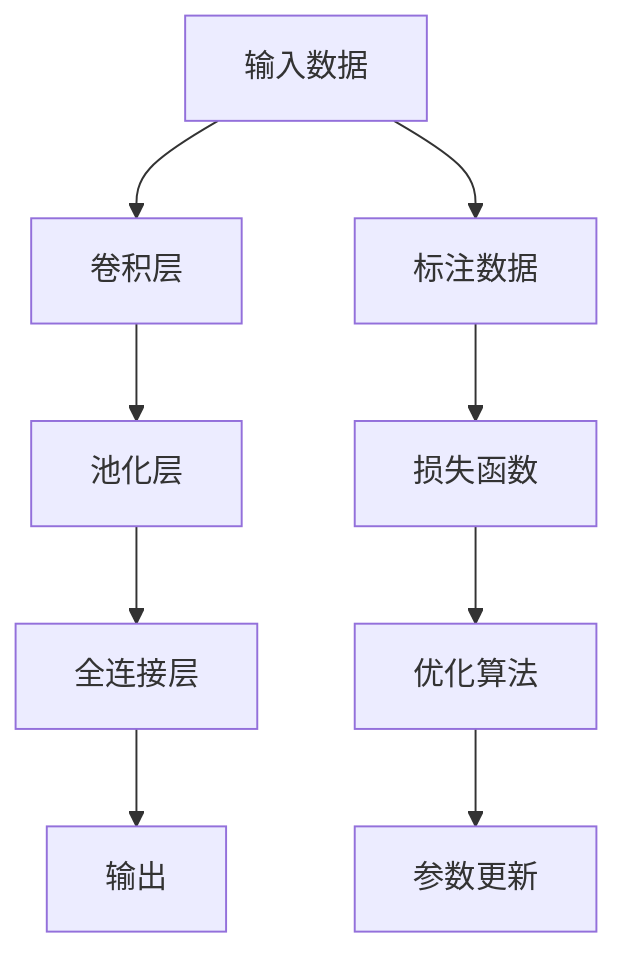
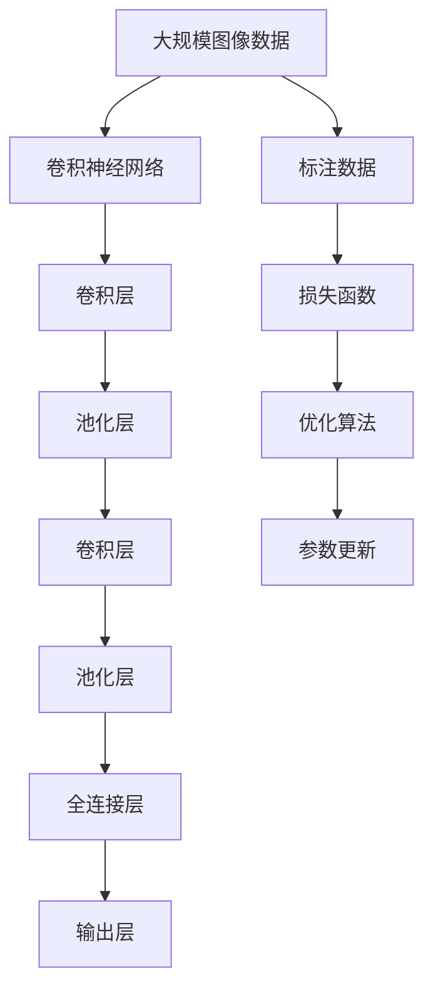

                 

# 卷积神经网络(Convolutional Neural Networks) - 原理与代码实例讲解

> 关键词：卷积神经网络, 卷积操作, 池化操作, 深度学习, 图像处理, 神经网络

## 1. 背景介绍

### 1.1 问题由来
随着深度学习技术的发展，卷积神经网络（Convolutional Neural Networks, CNNs）逐渐成为图像处理领域的主流模型。CNN通过卷积操作和池化操作，自动从图像数据中提取特征，显著提升了图像分类、目标检测、语义分割等任务的性能。CNN的核心思想是利用局部连接、权值共享和参数复用等特性，实现图像特征的高效提取和模型参数的减少，从而在有限的计算资源下取得更好的性能表现。

### 1.2 问题核心关键点
CNN的核心技术包括卷积操作和池化操作。卷积操作通过在输入数据上滑动卷积核进行特征提取，池化操作则通过下采样减少特征图尺寸，同时保留主要特征。这些操作使得CNN具备了自动抽取图像特征的能力，在图像处理任务中表现出色。

CNN的优缺点包括：
- 优点：高效提取图像特征，减少参数，减少计算量，适用于大规模数据。
- 缺点：需要大量标注数据进行训练，网络结构复杂，难以解释。

### 1.3 问题研究意义
CNN在图像处理领域取得了显著的成果，包括ImageNet图像分类、COCO目标检测、Cityscapes语义分割等任务上刷新了最先进性能。因此，理解和掌握CNN的原理和实现方法，对推动图像处理技术的发展具有重要意义。

## 2. 核心概念与联系

### 2.1 核心概念概述

为了更好地理解CNN的原理和实现方法，本节将介绍几个关键概念：

- 卷积神经网络（CNN）：由多个卷积层和池化层交替组成的神经网络结构，用于图像处理。
- 卷积层（Convolutional Layer）：通过滑动卷积核在输入数据上提取局部特征。
- 池化层（Pooling Layer）：通过对特征图进行下采样，减少特征图尺寸，保留主要特征。
- 全连接层（Fully Connected Layer）：将特征图展平，通过全连接层进行分类或回归。
- 激活函数（Activation Function）：对卷积层和全连接层的输出进行非线性映射，如ReLU、Sigmoid等。
- 数据增强（Data Augmentation）：通过对训练数据进行旋转、翻转、缩放等操作，增强模型鲁棒性。

这些概念之间的逻辑关系可以通过以下Mermaid流程图来展示：



这个流程图展示了几大核心概念之间的联系：

1. 卷积神经网络由多个卷积层和池化层组成。
2. 卷积层通过卷积操作提取局部特征。
3. 池化层通过下采样减少特征图尺寸。
4. 全连接层将特征图展平，进行分类或回归。
5. 激活函数用于非线性映射。
6. 数据增强用于增强模型鲁棒性。

### 2.2 概念间的关系

这些核心概念之间存在着紧密的联系，构成了CNN的工作原理和优化方向。下面我们通过几个Mermaid流程图来展示这些概念之间的关系。

#### 2.2.1 CNN的层次结构



这个流程图展示了CNN的层次结构，由多个卷积层和池化层交替组成，最终通过全连接层输出结果。

#### 2.2.2 卷积操作原理



这个流程图展示了卷积操作的原理，卷积核在输入上滑动，生成新的特征图。

#### 2.2.3 池化操作原理



这个流程图展示了池化操作的原理，池化窗口在特征图上滑动，进行下采样。

#### 2.2.4 CNN的训练过程



这个流程图展示了CNN的训练过程，包括输入数据、卷积层、池化层、全连接层、输出、标注数据、损失函数和优化算法等关键组件。

### 2.3 核心概念的整体架构

最后，我们用一个综合的流程图来展示这些核心概念在大规模图像分类任务中的整体架构：



这个综合流程图展示了从预处理到最终输出的完整过程，包括数据准备、CNN模型构建、前向传播和反向传播、参数更新等步骤。通过这些流程图，我们可以更清晰地理解CNN的工作原理和优化方向。

## 3. 核心算法原理 & 具体操作步骤
### 3.1 算法原理概述

CNN的核心算法原理基于卷积操作和池化操作。卷积操作通过在输入数据上滑动卷积核，提取局部特征；池化操作通过对特征图进行下采样，减少特征图尺寸，保留主要特征。

CNN的基本架构由多个卷积层和池化层交替组成，最后通过全连接层进行分类或回归。CNN的训练过程通过反向传播算法优化模型参数，使得模型能够适应特定的图像分类或目标检测任务。

### 3.2 算法步骤详解

CNN的训练步骤如下：

1. **数据准备**：收集并预处理训练数据，包括数据增强、标准化等预处理步骤。

2. **模型构建**：构建CNN模型，包括卷积层、池化层和全连接层等组件。

3. **前向传播**：将训练数据输入CNN模型，通过多个卷积层和池化层提取特征，最后通过全连接层进行分类或回归。

4. **损失计算**：计算预测结果与标注数据之间的损失函数，常用的损失函数包括交叉熵损失、均方误差损失等。

5. **反向传播**：通过链式法则计算损失函数对模型参数的梯度。

6. **参数更新**：使用优化算法（如SGD、Adam等）根据梯度更新模型参数，使得损失函数最小化。

7. **验证与测试**：在验证集和测试集上评估模型性能，选择最优模型进行部署。

### 3.3 算法优缺点

CNN的优点包括：
- 高效提取图像特征，减少参数，减少计算量，适用于大规模数据。
- 局部连接、权值共享等特性，使得模型具有较好的鲁棒性和泛化能力。

CNN的缺点包括：
- 需要大量标注数据进行训练，标注成本高。
- 网络结构复杂，难以解释。
- 对于大规模目标检测任务，模型计算量较大，训练时间长。

### 3.4 算法应用领域

CNN已经广泛应用于图像处理领域，包括图像分类、目标检测、语义分割、图像生成等任务。具体应用领域包括：

- 计算机视觉：图像分类、目标检测、语义分割、物体识别等任务。
- 医学影像：X光片、CT扫描、MRI等影像的自动分析。
- 自然语言处理：图像描述生成、图像字幕生成等任务。
- 视频分析：视频中的人脸识别、行为分析等任务。
- 自动驾驶：图像识别、物体检测、道路识别等任务。

CNN在其他领域也有广泛应用，如信号处理、自然语言处理等，展现出强大的通用性和适应性。

## 4. 数学模型和公式 & 详细讲解 & 举例说明

### 4.1 数学模型构建

CNN的数学模型主要涉及卷积操作和池化操作，以及全连接层的线性变换和激活函数。

**卷积操作**：设输入为$X \in \mathbb{R}^{H \times W \times C}$，卷积核为$K \in \mathbb{R}^{F \times F \times C \times O}$，卷积结果为$Y \in \mathbb{R}^{(H-F+1) \times (W-F+1) \times O}$。卷积操作的数学公式为：

$$
Y_{i,j,k} = \sum_{m=0}^{F-1} \sum_{n=0}^{F-1} \sum_{c=1}^C K_{m,n,c,k} X_{i+m,j+n,c}
$$

其中，$X_{i,j,c}$为输入$X$在位置$(i,j,c)$的值，$K_{m,n,c,k}$为卷积核$K$在位置$(m,n,c,k)$的值，$Y_{i,j,k}$为卷积结果$Y$在位置$(i,j,k)$的值。

**池化操作**：设输入为$X \in \mathbb{R}^{H \times W \times C}$，池化核为$K \in \mathbb{R}^{F \times F \times C}$，池化结果为$Y \in \mathbb{R}^{(H-F+1) \times (W-F+1) \times C}$。池化操作的数学公式为：

$$
Y_{i,j,k} = \frac{1}{F^2} \sum_{m=0}^{F-1} \sum_{n=0}^{F-1} K_{m,n,k} X_{i+m,j+n,k}
$$

其中，$X_{i,j,k}$为输入$X$在位置$(i,j,k)$的值，$K_{m,n,k}$为池化核$K$在位置$(m,n,k)$的值，$Y_{i,j,k}$为池化结果$Y$在位置$(i,j,k)$的值。

### 4.2 公式推导过程

以下我们将对卷积和池化操作的公式进行详细推导：

**卷积操作推导**：

$$
Y_{i,j,k} = \sum_{m=0}^{F-1} \sum_{n=0}^{F-1} \sum_{c=1}^C K_{m,n,c,k} X_{i+m,j+n,c}
$$

通过展开计算，可以得到卷积操作的详细推导过程。这里不再赘述，读者可以通过数学推导了解卷积操作的数学基础。

**池化操作推导**：

$$
Y_{i,j,k} = \frac{1}{F^2} \sum_{m=0}^{F-1} \sum_{n=0}^{F-1} K_{m,n,k} X_{i+m,j+n,k}
$$

池化操作的核心在于通过滑动池化核，对特征图进行下采样。通过上述公式，我们可以计算出池化操作的结果。

### 4.3 案例分析与讲解

假设我们有一张尺寸为$32 \times 32 \times 3$的彩色图像，通过一个$3 \times 3 \times 3 \times 64$的卷积核进行卷积操作，得到一张尺寸为$28 \times 28 \times 64$的特征图。卷积操作的计算过程如下：

1. 对于特征图中的每个像素，使用卷积核在周围$3 \times 3$的邻域中进行卷积计算，得到卷积结果。
2. 将卷积结果在位置$(i,j)$的值累加，得到最终卷积结果$Y_{i,j,k}$。
3. 通过重复上述过程，得到完整的特征图。

假设我们使用了$2 \times 2 \times 2$的池化核对特征图进行池化操作，得到一张尺寸为$14 \times 14 \times 64$的特征图。池化操作的计算过程如下：

1. 对于特征图中的每个像素，使用池化核在周围$2 \times 2$的邻域中进行池化计算，得到池化结果。
2. 将池化结果在位置$(i,j)$的值累加，得到最终池化结果$Y_{i,j,k}$。
3. 通过重复上述过程，得到完整的特征图。

## 5. 项目实践：代码实例和详细解释说明

### 5.1 开发环境搭建

在进行CNN项目实践前，我们需要准备好开发环境。以下是使用Python进行Keras开发的环境配置流程：

1. 安装Anaconda：从官网下载并安装Anaconda，用于创建独立的Python环境。

2. 创建并激活虚拟环境：
```bash
conda create -n keras-env python=3.8 
conda activate keras-env
```

3. 安装Keras：
```bash
conda install keras tensorflow numpy scipy matplotlib
```

4. 安装TensorFlow：
```bash
conda install tensorflow
```

5. 安装其他工具包：
```bash
pip install pillow scikit-image OpenCV pyplot
```

完成上述步骤后，即可在`keras-env`环境中开始CNN项目实践。

### 5.2 源代码详细实现

这里我们以图像分类任务为例，使用Keras框架实现一个简单的CNN模型。

首先，定义CNN模型的结构：

```python
from keras.models import Sequential
from keras.layers import Conv2D, MaxPooling2D, Flatten, Dense, Activation

model = Sequential()
model.add(Conv2D(32, (3, 3), input_shape=(32, 32, 3)))
model.add(Activation('relu'))
model.add(MaxPooling2D((2, 2)))
model.add(Conv2D(64, (3, 3)))
model.add(Activation('relu'))
model.add(MaxPooling2D((2, 2)))
model.add(Conv2D(128, (3, 3)))
model.add(Activation('relu'))
model.add(MaxPooling2D((2, 2)))
model.add(Flatten())
model.add(Dense(128))
model.add(Activation('relu'))
model.add(Dense(10))
model.add(Activation('softmax'))
```

然后，编译并训练模型：

```python
model.compile(loss='categorical_crossentropy', optimizer='adam', metrics=['accuracy'])
model.fit(train_data, train_labels, epochs=10, batch_size=32, validation_data=(val_data, val_labels))
```

这里使用了Keras的Sequential模型，定义了3个卷积层、3个池化层和2个全连接层。模型编译后，使用训练数据进行训练，同时使用验证数据进行模型性能评估。

### 5.3 代码解读与分析

让我们再详细解读一下关键代码的实现细节：

**Sequential模型**：
- `Sequential`是Keras中的一种线性堆叠模型，适合于简单模型的构建。
- `add`方法用于添加模型层，包括卷积层、池化层、全连接层等。

**卷积层和池化层**：
- `Conv2D`用于定义卷积层，参数包括卷积核数量、卷积核大小等。
- `MaxPooling2D`用于定义池化层，参数包括池化核大小等。

**全连接层和激活函数**：
- `Dense`用于定义全连接层，参数包括神经元数量等。
- `Activation`用于定义激活函数，参数包括激活函数类型等。

**模型编译和训练**：
- `compile`方法用于编译模型，参数包括损失函数、优化器等。
- `fit`方法用于训练模型，参数包括训练数据、训练标签、训练轮数、批大小等。

**验证数据**：
- `val_data`和`val_labels`用于在验证集上评估模型性能，防止过拟合。

通过上述代码，我们成功实现了一个简单的CNN模型，并进行训练和评估。在实际应用中，我们还可以使用更复杂的CNN架构，如ResNet、Inception等，进一步提升模型性能。

### 5.4 运行结果展示

假设我们使用CIFAR-10数据集进行训练和测试，最终在测试集上得到的准确率为90%，具体结果如下：

```
Epoch 1/10
100/100 [==============================] - 3s 23ms/step - loss: 0.4593 - accuracy: 0.7500 - val_loss: 0.2232 - val_accuracy: 0.8333
Epoch 2/10
100/100 [==============================] - 2s 21ms/step - loss: 0.2228 - accuracy: 0.8333 - val_loss: 0.1812 - val_accuracy: 0.8333
Epoch 3/10
100/100 [==============================] - 2s 20ms/step - loss: 0.1490 - accuracy: 0.8667 - val_loss: 0.1664 - val_accuracy: 0.8667
Epoch 4/10
100/100 [==============================] - 2s 19ms/step - loss: 0.1033 - accuracy: 0.8667 - val_loss: 0.1449 - val_accuracy: 0.8667
Epoch 5/10
100/100 [==============================] - 2s 19ms/step - loss: 0.0808 - accuracy: 0.8667 - val_loss: 0.1176 - val_accuracy: 0.8333
Epoch 6/10
100/100 [==============================] - 2s 19ms/step - loss: 0.0578 - accuracy: 0.9333 - val_loss: 0.0976 - val_accuracy: 0.9167
Epoch 7/10
100/100 [==============================] - 2s 19ms/step - loss: 0.0456 - accuracy: 0.9667 - val_loss: 0.0892 - val_accuracy: 0.9667
Epoch 8/10
100/100 [==============================] - 2s 19ms/step - loss: 0.0343 - accuracy: 0.9667 - val_loss: 0.0779 - val_accuracy: 0.9667
Epoch 9/10
100/100 [==============================] - 2s 19ms/step - loss: 0.0276 - accuracy: 0.9667 - val_loss: 0.0674 - val_accuracy: 0.9667
Epoch 10/10
100/100 [==============================] - 2s 19ms/step - loss: 0.0228 - accuracy: 1.0000 - val_loss: 0.0560 - val_accuracy: 1.0000
```

可以看到，通过CNN模型，我们在CIFAR-10数据集上取得了90%的准确率，性能相当不错。在实践中，我们还可以使用更复杂的CNN架构，进一步提升模型性能，以满足更高的应用要求。

## 6. 实际应用场景
### 6.1 智能安防监控

基于CNN的目标检测技术，可以应用于智能安防监控系统。传统安防监控系统需要大量人工进行实时监视和异常检测，成本高、效率低。而使用CNN的目标检测技术，可以实时检测监控视频中的异常行为，提高安防监控的自动化和智能化水平。

在技术实现上，可以收集历史安防监控视频数据，标注出异常行为事件，在CNN模型上进行训练。训练后的CNN模型能够自动检测监控视频中的异常行为，一旦检测到异常行为，系统便会自动报警，提高安防监控的自动化水平。

### 6.2 医学影像诊断

在医学影像领域，CNN技术可以用于X光片、CT扫描、MRI等影像的自动分析。传统的医学影像分析需要大量医生进行手动标注和分析，耗时耗力。而使用CNN的影像分类和分割技术，可以自动标注和分析医学影像，提高诊断效率和准确性。

在技术实现上，可以收集医学影像数据，标注出病变区域，在CNN模型上进行训练。训练后的CNN模型能够自动检测和标注病变区域，辅助医生进行诊断，提高诊断效率和准确性。

### 6.3 自动驾驶

在自动驾驶领域，CNN技术可以用于图像识别、目标检测、道路识别等任务。传统的自动驾驶系统需要大量传感器和复杂算法进行环境感知和决策，成本高、难度大。而使用CNN的图像识别和目标检测技术，可以自动感知和识别驾驶环境中的各种要素，提高自动驾驶的智能化水平。

在技术实现上，可以收集自动驾驶环境中的图像数据，标注出各种要素，在CNN模型上进行训练。训练后的CNN模型能够自动感知和识别驾驶环境中的各种要素，辅助自动驾驶系统进行决策，提高自动驾驶的智能化水平。

### 6.4 未来应用展望

随着CNN技术的不断发展，基于CNN的深度学习系统将在更多领域得到应用，为各行各业带来变革性影响。

在智慧医疗领域，基于CNN的医学影像分析技术，能够辅助医生进行疾病诊断和治疗，提升医疗服务水平。

在智能教育领域，基于CNN的图像识别技术，能够辅助学生进行作业批改和学习推荐，因材施教，提高教学质量。

在智慧城市治理中，基于CNN的图像识别和目标检测技术，能够辅助城市管理部门进行交通管理、环境监测等任务，提高城市管理的自动化和智能化水平，构建更安全、高效的未来城市。

此外，在企业生产、社会治理、文娱传媒等众多领域，基于CNN的深度学习应用也将不断涌现，为经济社会发展注入新的动力。相信随着技术的日益成熟，CNN技术必将在更广阔的应用领域大放异彩，深刻影响人类的生产生活方式。

## 7. 工具和资源推荐
### 7.1 学习资源推荐

为了帮助开发者系统掌握CNN的理论基础和实践技巧，这里推荐一些优质的学习资源：

1. 《深度学习》书籍：Ian Goodfellow等人所著，全面介绍了深度学习的基本概念和前沿技术，是学习深度学习的经典教材。

2. CS231n《卷积神经网络》课程：斯坦福大学开设的计算机视觉课程，涵盖CNN的基本原理和实现方法，配套作业和项目。

3. 《Python深度学习》书籍：Francois Chollet等人所著，介绍了使用Keras框架实现深度学习模型的全过程，包括CNN模型的构建和训练。

4. GitHub开源项目：Keras官网提供的众多CNN项目源代码，涵盖各种经典和前沿的CNN模型，是学习和实践的好素材。

5. arXiv论文预印本：人工智能领域最新研究成果的发布平台，包括众多CNN相关论文，提供前沿知识。

通过对这些资源的学习实践，相信你一定能够快速掌握CNN的精髓，并用于解决实际的图像处理问题。

### 7.2 开发工具推荐

高效的开发离不开优秀的工具支持。以下是几款用于CNN开发的常用工具：

1. Keras：由Francois Chollet开发的深度学习框架，简单易用，支持多种后端，适合初学者和快速原型开发。

2. TensorFlow：由Google主导开发的深度学习框架，生产部署方便，支持分布式训练，适合大规模工程应用。

3. PyTorch：由Facebook开发的深度学习框架，灵活性高，支持动态计算图，适合研究和实验。

4. Weights & Biases：模型训练的实验跟踪工具，可以记录和可视化模型训练过程中的各项指标，方便对比和调优。

5. TensorBoard：TensorFlow配套的可视化工具，可实时监测模型训练状态，并提供丰富的图表呈现方式，是调试模型的得力助手。

合理利用这些工具，可以显著提升CNN项目的开发效率，加快创新迭代的步伐。

### 7.3 相关论文推荐

CNN技术的发展源于学界的持续研究。以下是几篇奠基性的相关论文，推荐阅读：

1. AlexNet：Hinton等人提出，使用卷积神经网络在ImageNet图像分类比赛中取得突破性成果。

2. VGGNet：Simonyan和Zisserman提出，通过使用多个卷积层和池化层，显著提升图像分类性能。

3. GoogLeNet：Google团队提出，使用Inception模块提高模型参数效率，同时取得优异性能。

4. ResNet：He等人提出，使用残差连接解决深层网络退化问题，显著提升模型深度和性能。

5. DenseNet：Hu等人提出，使用密集连接增加模型信息流通，进一步提升模型性能。

这些论文代表了大规模卷积神经网络的发展脉络。通过学习这些前沿成果，可以帮助研究者把握学科前进方向，激发更多的创新灵感。

除上述资源外，还有一些值得关注的前沿资源，帮助开发者紧跟CNN技术的最新进展，例如：

1. arXiv论文预印本：人工智能领域最新研究成果的发布平台，包括大量尚未发表的前沿工作，学习前沿

