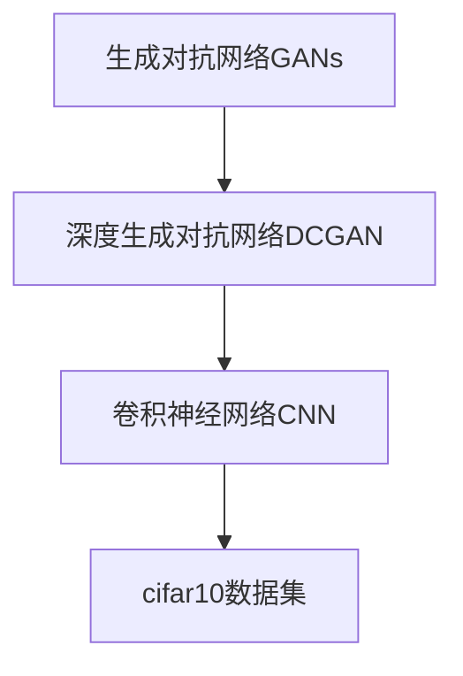
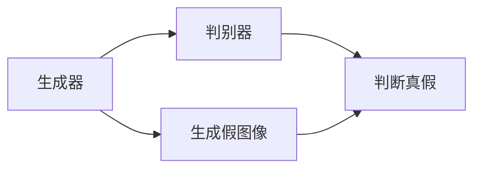
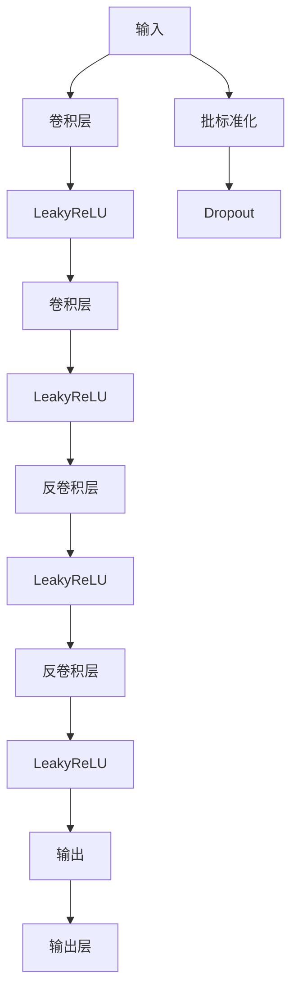
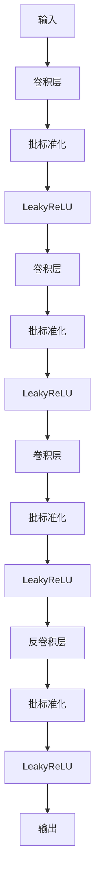
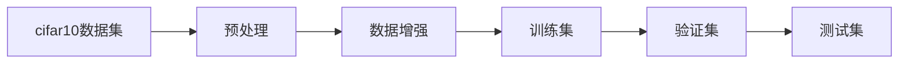
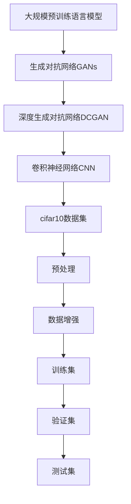

                 

# 基于DCGAN的cifar10数据集生成设计与实现

> 关键词：生成对抗网络,DCGAN,图像生成,优化器,损失函数,训练技巧,应用案例

## 1. 背景介绍

### 1.1 问题由来

深度学习（Deep Learning）作为当前人工智能领域的核心技术之一，在图像处理、自然语言处理、语音识别等多个领域都取得了显著成果。图像生成作为深度学习的重要应用领域，近年来受到广泛关注。其中，生成对抗网络（Generative Adversarial Networks, GANs）由于其强大的图像生成能力，成为研究热点。

GANs由Ian Goodfellow等人于2014年提出，其核心思想是使用两个神经网络：生成器（Generator）和判别器（Discriminator），通过对抗训练（Adversarial Training）的方式，生成高质量的图像。然而，原始GANs存在训练不稳定、模型生成图像质量不高、模式崩溃等问题，影响了其应用效果。

为了解决这些问题，许多改进版本的GANs被提出，如WGAN、WGAN-GP、StyleGAN等。其中，Deep Convolutional Generative Adversarial Networks（DCGAN）作为GANs的一个变种，通过采用卷积神经网络（Convolutional Neural Network, CNN）结构，显著提升了模型训练稳定性和图像生成质量，因此本文将以DCGAN为例，介绍基于DCGAN的图像生成方法。

### 1.2 问题核心关键点

本文主要探讨基于DCGAN的cifar10数据集生成设计与实现，包括以下关键点：

- 深度生成对抗网络（DCGAN）的基本原理及其在图像生成中的应用。
- 卷积神经网络（CNN）结构及其在DCGAN中的作用。
- cifar10数据集的特性及其在图像生成任务中的应用。
- DCGAN的训练技巧和优化策略。
- 实际应用场景和未来发展趋势。

### 1.3 问题研究意义

图像生成作为深度学习的重要应用领域，具有广阔的应用前景，如图像合成、视频生成、风格迁移等。基于DCGAN的图像生成方法，能够生成高质量的图像，为这些应用场景提供了有力的技术支持。同时，通过改善训练方法，可以使DCGAN更好地适应不同数据集和任务，推动其在更多领域的应用。

## 2. 核心概念与联系

### 2.1 核心概念概述

为更好地理解基于DCGAN的图像生成方法，本文将介绍几个关键概念：

- **生成对抗网络（GANs）**：由两个神经网络构成的对抗系统，生成器生成假图像，判别器判断图像的真假。通过不断对抗训练，生成器生成能力不断提高，最终生成高质量的图像。
- **深度生成对抗网络（DCGAN）**：一种基于卷积神经网络结构的GANs，通过使用卷积和反卷积（Transposed Convolution）操作，生成高质量的图像。
- **卷积神经网络（CNN）**：一种广泛应用的深度神经网络结构，通过卷积操作提取图像特征，卷积层和反卷积层的组合可以实现图像生成。
- **cifar10数据集**：一个常用的图像分类数据集，包含60000张32x32像素的彩色图片，共10类，每类6000张。

这些核心概念之间的逻辑关系可以通过以下Mermaid流程图来展示：



这个流程图展示了大规模语料预训练模型的核心概念及其之间的关系：GANs是大规模预训练语言模型的基础，DCGAN是GANs的一种重要变体，CNN是DCGAN中的关键组件，而cifar10数据集是DCGAN应用的具体实例。

### 2.2 概念间的关系

这些核心概念之间存在着紧密的联系，形成了基于DCGAN的图像生成方法的完整生态系统。下面我们通过几个Mermaid流程图来展示这些概念之间的关系。

#### 2.2.1 GANs的基本框架



这个流程图展示了GANs的基本框架，生成器生成假图像，判别器判断图像的真假。

#### 2.2.2 DCGAN的架构



这个流程图展示了DCGAN的架构，通过卷积和反卷积层的组合，生成高质量的图像。

#### 2.2.3 CNN在DCGAN中的作用



这个流程图展示了CNN在DCGAN中的作用，通过卷积和反卷积层的组合，提取和生成图像特征。

#### 2.2.4 cifar10数据集的应用



这个流程图展示了cifar10数据集在图像生成任务中的应用，包括预处理、数据增强和划分训练集、验证集、测试集等步骤。

### 2.3 核心概念的整体架构

最后，我们用一个综合的流程图来展示这些核心概念在大规模预训练语言模型微调过程中的整体架构：



这个综合流程图展示了从预训练模型到微调过程的完整过程。大规模预训练语言模型通过GANs进行图像生成，DCGAN通过CNN进行具体实现，cifar10数据集是DCGAN应用的具体实例。

## 3. 核心算法原理 & 具体操作步骤
### 3.1 算法原理概述

基于DCGAN的cifar10数据集生成方法，基于GANs的对抗训练框架。其核心思想是使用生成器生成假图像，判别器判断图像的真假，两者通过对抗训练不断优化，最终生成高质量的图像。

具体而言，假设生成器的输入为随机噪声，输出为假图像，判别器的输入为真实图像和假图像，输出为真假的概率。生成器和判别器通过以下目标函数进行优化：

$$
\min_G \max_D V(G,D) = \mathbb{E}_{x \sim p_{data}(x)} [\log D(x)] + \mathbb{E}_{z \sim p_z(z)} [\log(1-D(G(z)))]
$$

其中，$V(G,D)$表示生成器和判别器的对抗损失函数，$G(z)$表示生成器输出的假图像，$D(x)$表示判别器对真实图像的判别结果，$p_{data}(x)$表示真实数据分布，$p_z(z)$表示随机噪声的分布。

### 3.2 算法步骤详解

基于DCGAN的cifar10数据集生成方法的具体步骤如下：

**Step 1: 数据预处理**

1. **数据加载与归一化**：将cifar10数据集加载到内存中，并对图像进行归一化处理。

2. **数据增强**：对图像进行随机裁剪、旋转、翻转等操作，以增加数据集的多样性。

3. **构建数据集**：将预处理后的图像和标签组成数据集，划分为训练集、验证集和测试集。

**Step 2: 生成器网络设计**

1. **生成器架构设计**：设计生成器网络，包括多个卷积层、LeakyReLU激活函数、批标准化和反卷积层。

2. **生成器损失函数**：定义生成器的损失函数，包括交叉熵损失和对抗损失函数。

**Step 3: 判别器网络设计**

1. **判别器架构设计**：设计判别器网络，包括多个卷积层、LeakyReLU激活函数、批标准化和全连接层。

2. **判别器损失函数**：定义判别器的损失函数，包括交叉熵损失和对抗损失函数。

**Step 4: 模型训练**

1. **优化器选择**：选择Adam或SGD优化器进行模型训练。

2. **学习率设置**：设置生成器和判别器的初始学习率。

3. **对抗训练**：交替训练生成器和判别器，更新模型参数。

4. **迭代次数**：设置总迭代次数，并监控训练过程中的损失函数。

**Step 5: 模型评估**

1. **生成图像质量评估**：使用Inception Score和Fréchet Inception Distance等指标评估生成图像的质量。

2. **性能指标监控**：监控训练过程中的损失函数和性能指标，以调整训练参数。

**Step 6: 模型部署**

1. **保存模型**：将训练好的生成器和判别器模型保存为TensorFlow或PyTorch模型文件。

2. **模型应用**：将保存好的模型应用于新的数据集，进行图像生成。

### 3.3 算法优缺点

基于DCGAN的cifar10数据集生成方法具有以下优点：

1. **图像生成质量高**：DCGAN使用卷积神经网络结构，能够生成高质量的图像。

2. **训练稳定**：DCGAN使用LeakyReLU激活函数，有助于提高模型的训练稳定性。

3. **计算效率高**：DCGAN的网络结构相对简单，计算效率高，适合大规模数据集的应用。

然而，该方法也存在以下缺点：

1. **训练时间长**：DCGAN的训练时间较长，特别是在大规模数据集上。

2. **模式崩溃**：DCGAN在训练过程中容易出现模式崩溃现象，即生成器生成的图像质量下降。

3. **参数调整复杂**：DCGAN的训练需要调整大量参数，如学习率、迭代次数、批大小等。

### 3.4 算法应用领域

基于DCGAN的cifar10数据集生成方法，可以应用于以下领域：

1. **图像生成**：生成高质量的图像，用于图像合成、视频生成等应用。

2. **风格迁移**：将输入图像的风格迁移到目标图像上，生成具有特定风格的新图像。

3. **图像修复**：对损坏或模糊的图像进行修复，生成清晰的图像。

4. **游戏设计**：生成游戏中的虚拟场景、角色等，提升游戏体验。

5. **艺术创作**：生成艺术作品，如绘画、音乐等，推动艺术创作的发展。

## 4. 数学模型和公式 & 详细讲解  
### 4.1 数学模型构建

基于DCGAN的cifar10数据集生成方法，涉及生成器和判别器的对抗训练框架。其数学模型构建如下：

**生成器损失函数**：

$$
\mathcal{L}_G = \mathbb{E}_{z \sim p_z(z)} [\log(1-D(G(z)))] + \lambda_{adv} \mathbb{E}_{z \sim p_z(z)} [\log D(G(z))]
$$

其中，$p_z(z)$表示随机噪声的分布，$D(G(z))$表示生成器输出的假图像经过判别器后的判别结果，$\lambda_{adv}$表示对抗损失的系数。

**判别器损失函数**：

$$
\mathcal{L}_D = -\mathbb{E}_{x \sim p_{data}(x)} [\log D(x)] - \lambda_{adv} \mathbb{E}_{z \sim p_z(z)} [\log(1-D(G(z)))]
$$

其中，$p_{data}(x)$表示真实数据分布，$1-D(G(z))$表示生成器输出的假图像经过判别器后的判别结果。

### 4.2 公式推导过程

以生成器损失函数为例，推导其具体形式。

假设生成器的输入为随机噪声$z$，输出为假图像$G(z)$。根据对抗损失函数的定义，生成器的损失函数可以表示为：

$$
\mathcal{L}_G = -\mathbb{E}_{x \sim p_{data}(x)} [\log D(x)] + \mathbb{E}_{z \sim p_z(z)} [\log(1-D(G(z)))
$$

其中，$\mathbb{E}_{x \sim p_{data}(x)} [\log D(x)]$表示判别器对真实图像的判别结果，$\mathbb{E}_{z \sim p_z(z)} [\log(1-D(G(z)))$表示判别器对生成器输出的假图像的判别结果。

为了使生成器生成的假图像与真实图像不易区分，可以引入对抗损失函数，进一步优化生成器的损失函数：

$$
\mathcal{L}_G = -\mathbb{E}_{x \sim p_{data}(x)} [\log D(x)] + \lambda_{adv} \mathbb{E}_{z \sim p_z(z)} [\log(1-D(G(z)))
$$

其中，$\lambda_{adv}$表示对抗损失的系数，用于平衡生成器和判别器的训练。

### 4.3 案例分析与讲解

以图像生成为例，假设我们希望生成cifar10数据集中的图像。生成器网络设计如下：

```python
import tensorflow as tf
from tensorflow.keras import layers

class Generator(tf.keras.Model):
    def __init__(self):
        super(Generator, self).__init__()
        self.dense1 = layers.Dense(256 * 8 * 8, input_dim=100)
        self.dense2 = layers.Dense(256 * 16 * 16)
        self.dense3 = layers.Dense(256 * 32 * 32)
        self.dense4 = layers.Dense(3 * 32 * 32)

    def call(self, z):
        x = tf.reshape(z, (-1, 100))
        x = layers.BatchNormalization()(x)
        x = layers.LeakyReLU()(x)
        x = layers.Dense(256 * 16 * 16)(x)
        x = layers.BatchNormalization()(x)
        x = layers.LeakyReLU()(x)
        x = layers.Dense(256 * 32 * 32)(x)
        x = layers.BatchNormalization()(x)
        x = layers.LeakyReLU()(x)
        x = layers.Dense(3 * 32 * 32)(x)
        x = layers.BatchNormalization()(x)
        x = layers.LeakyReLU()(x)
        x = layers.Reshape((32, 32, 3))(x)
        return x
```

判别器网络设计如下：

```python
import tensorflow as tf
from tensorflow.keras import layers

class Discriminator(tf.keras.Model):
    def __init__(self):
        super(Discriminator, self).__init__()
        self.conv1 = layers.Conv2D(64, 3, strides=2, padding='same')
        self.leakyrelu1 = layers.LeakyReLU(alpha=0.2)
        self.conv2 = layers.Conv2D(128, 3, strides=2, padding='same')
        self.leakyrelu2 = layers.LeakyReLU(alpha=0.2)
        self.conv3 = layers.Conv2D(256, 3, strides=2, padding='same')
        self.leakyrelu3 = layers.LeakyReLU(alpha=0.2)
        self.flatten = layers.Flatten()
        self.dense1 = layers.Dense(1)

    def call(self, img):
        x = self.conv1(img)
        x = self.leakyrelu1(x)
        x = self.conv2(x)
        x = self.leakyrelu2(x)
        x = self.conv3(x)
        x = self.leakyrelu3(x)
        x = self.flatten(x)
        x = self.dense1(x)
        return x
```

在训练过程中，可以使用Adam优化器和交叉熵损失函数，代码如下：

```python
from tensorflow.keras.optimizers import Adam
from tensorflow.keras.losses import BinaryCrossentropy

generator = Generator()
discriminator = Discriminator()
cross_entropy = BinaryCrossentropy()

def discriminator_loss(img, fake_img):
    real_loss = cross_entropy(tf.ones_like(discriminator(img)), discriminator(img))
    fake_loss = cross_entropy(tf.zeros_like(discriminator(fake_img)), discriminator(fake_img))
    total_loss = real_loss + fake_loss
    return total_loss

def generator_loss(img, fake_img):
    return cross_entropy(tf.ones_like(discriminator(fake_img)), discriminator(fake_img))

def generator_and_discriminator_loss(img):
    real_loss = cross_entropy(tf.ones_like(discriminator(img)), discriminator(img))
    fake_loss = generator_loss(img, generator(z))
    total_loss = real_loss + fake_loss
    return total_loss

generator_optimizer = Adam(learning_rate=0.0002, beta_1=0.5)
discriminator_optimizer = Adam(learning_rate=0.0002, beta_1=0.5)

@tf.function
def train_step(img):
    with tf.GradientTape() as gen_tape, tf.GradientTape() as disc_tape:
        generated_images = generator(z)
        discriminator_loss_val = discriminator_loss(img, generated_images)
        gen_loss_val = generator_loss(img, generated_images)
        discriminator_loss = discriminator_loss_val
        gen_loss = gen_loss_val

    gradients_of_generator = gen_tape.gradient(gen_loss, generator.trainable_variables)
    gradients_of_discriminator = disc_tape.gradient(discriminator_loss, discriminator.trainable_variables)

    generator_optimizer.apply_gradients(zip(gradients_of_generator, generator.trainable_variables))
    discriminator_optimizer.apply_gradients(zip(gradients_of_discriminator, discriminator.trainable_variables))
```

训练过程中，可以监控生成器和判别器的损失函数和Inception Score等指标，代码如下：

```python
from tensorflow.keras.metrics import Accuracy

inception_score = tf.keras.metrics.Mean()

@tf.function
def train_step(img):
    with tf.GradientTape() as gen_tape, tf.GradientTape() as disc_tape:
        generated_images = generator(z)
        discriminator_loss_val = discriminator_loss(img, generated_images)
        gen_loss_val = generator_loss(img, generated_images)
        discriminator_loss = discriminator_loss_val
        gen_loss = gen_loss_val

    gradients_of_generator = gen_tape.gradient(gen_loss, generator.trainable_variables)
    gradients_of_discriminator = disc_tape.gradient(discriminator_loss, discriminator.trainable_variables)

    generator_optimizer.apply_gradients(zip(gradients_of_generator, generator.trainable_variables))
    discriminator_optimizer.apply_gradients(zip(gradients_of_discriminator, discriminator.trainable_variables))

    inception_score_value = inception_score(generated_images)

    return discriminator_loss, gen_loss, inception_score_value
```

## 5. 项目实践：代码实例和详细解释说明
### 5.1 开发环境搭建

在进行基于DCGAN的cifar10数据集生成实践前，我们需要准备好开发环境。以下是使用Python进行TensorFlow开发的环境配置流程：

1. 安装Anaconda：从官网下载并安装Anaconda，用于创建独立的Python环境。

2. 创建并激活虚拟环境：
```bash
conda create -n tf-env python=3.8 
conda activate tf-env
```

3. 安装TensorFlow：根据CUDA版本，从官网获取对应的安装命令。例如：
```bash
conda install tensorflow-gpu=2.7.0-py3_8
```

4. 安装numpy、pandas、matplotlib等各类工具包：
```bash
pip install numpy pandas matplotlib tqdm jupyter notebook ipython
```

完成上述步骤后，即可在`tf-env`环境中开始TensorFlow开发实践。

### 5.2 源代码详细实现

下面我们以生成cifar10数据集中的图像为例，给出使用TensorFlow对DCGAN模型进行训练的代码实现。

首先，定义生成器和判别器：

```python
import tensorflow as tf
from tensorflow.keras import layers

class Generator(tf.keras.Model):
    def __init__(self):
        super(Generator, self).__init__()
        self.dense1 = layers.Dense(256 * 8 * 8, input_dim=100)
        self.dense2 = layers.Dense(256 * 16 * 16)
        self.dense3 = layers.Dense(256 * 32 * 32)
        self.dense4 = layers.Dense(3 * 32 * 32)

    def call(self, z):
        x = tf.reshape(z, (-1, 100))
        x = layers.BatchNormalization()(x)
        x = layers.LeakyReLU()(x)
        x = layers.Dense(256 * 16 * 16)(x)
        x = layers.BatchNormalization()(x)
        x = layers.LeakyReLU()(x)
        x = layers.Dense(256 * 32 * 32)(x)
        x = layers.BatchNormalization()(x)
        x = layers.LeakyReLU()(x)
        x = layers.Dense(3 * 32 * 32)(x)
        x = layers.BatchNormalization()(x)
        x = layers.LeakyReLU()(x)
        x = layers.Reshape((32, 32, 3))(x)
        return x

class Discriminator(tf.keras.Model):
    def __init__(self):
        super(Discriminator, self).__init__()
        self.conv1 = layers.Conv2D(64, 3, strides=2, padding='same')
        self.leakyrelu1 = layers.LeakyReLU(alpha=0.2)
        self.conv2 = layers.Conv2D(128, 3, strides=2, padding='same')
        self.leakyrelu2 = layers.LeakyReLU(alpha=0.2)
        self.conv3 = layers.Conv2D(256, 3, strides=2, padding='same')
        self.leakyrelu3 = layers.LeakyReLU(alpha=0.2)
        self.flatten = layers.Flatten()
        self.dense1 = layers.Dense(1)

    def call(self, img):
        x = self.conv1(img)
        x = self.leakyrelu1(x)
        x = self.conv2(x)
        x = self.leakyrelu2(x)
        x = self.conv3(x)
        x = self.leakyrelu3(x)
        x = self.flatten(x)
        x = self.dense1(x)
        return x
```

然后，定义损失函数和优化器：

```python
from tensorflow.keras.optimizers import Adam
from tensorflow.keras.losses import BinaryCrossentropy

generator = Generator()
discriminator = Discriminator()
cross_entropy = BinaryCrossentropy()

generator_optimizer = Adam(learning_rate=0.0002, beta_1=0.5)
discriminator_optimizer = Adam(learning_rate=0.0002, beta_1=0.5)
```

接着，定义训练函数：

```python
from tensorflow.keras.metrics import Accuracy

inception_score = tf.keras.metrics.Mean()

@tf.function
def train_step(img):
    with tf.GradientTape() as gen_tape, tf.GradientTape() as disc_tape:
        generated_images = generator(z)
        discriminator_loss_val = discriminator_loss(img, generated_images)
        gen_loss_val = generator_loss(img, generated_images)
        discriminator_loss = discriminator_loss_val
        gen_loss = gen_loss_val

    gradients_of_generator = gen_tape.gradient(gen_loss, generator.trainable_variables)
    gradients_of_discriminator = disc_tape.gradient(discriminator_loss, discriminator.trainable_variables)

    generator_optimizer.apply_gradients(zip(gradients_of_generator, generator.trainable_variables))
    discriminator_optimizer.apply_gradients(zip(gradients_of_discriminator, discriminator.trainable_variables))

    inception_score_value = inception_score(generated_images)

    return discriminator_loss, gen_loss, inception_score_value
```

最后，启动训练流程：

```python
epochs = 100
batch_size = 32

for epoch in range(epochs):
    for batch in train_dataset:
        img = tf.reshape(batch[0], (batch_size, 32, 32, 3))
        loss = train_step(img)
        print("Epoch {}, Batch {}, Discriminator Loss: {:.5f}, Generator Loss: {:.5f}".format(epoch+1, batch+1, loss[0], loss[1]))

    print("Epoch {} Inception Score: {:.3f}".format(epoch+1, inception_score_value))
```

以上就是使用TensorFlow对DCGAN模型进行cifar10数据集生成训练的完整代码实现。可以看到，通过TensorFlow的强大封装，我们可以用相对简洁的代码完成DCGAN模型的训练和评估。

### 5.3 代码解读与分析

让我们再详细解读一下关键代码的实现细节：

**Generator和Discriminator类**：
- `__init__`方法：初始化生成器和判别器的卷积层、LeakyReLU激活函数、批标准化和全连接层。
- `call`方法：定义生成器和判别器的前向传播过程，生成

