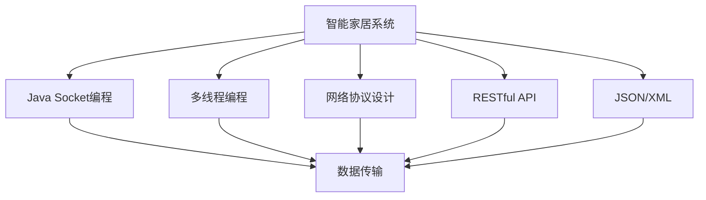

                 

# 基于Java的智能家居设计：智能家居系统中的Java网络编程实战

## 1. 背景介绍

随着科技的进步，智能家居逐渐成为人们生活中不可或缺的一部分。智能家居系统通过将家庭中的各类设备和物品与互联网连接起来，实现远程控制和自动化管理。Java作为一门强大的编程语言，在智能家居系统开发中扮演了重要角色。

### 1.1 问题由来
智能家居系统的开发涉及众多领域，包括硬件设备管理、数据通信、自动化控制等。Java因其跨平台性、丰富的网络编程库、良好的社区支持等特点，成为智能家居系统开发的首选语言之一。然而，Java网络编程涉及到诸多细节和挑战，需要开发者具备较强的技术功底和实际经验。

### 1.2 问题核心关键点
在智能家居系统中，Java网络编程的难点主要集中在以下几个方面：

- 硬件设备的接入与控制：智能家居系统需要与各种硬件设备进行交互，如温度传感器、摄像头、智能门锁等。这些设备通常通过串口、Wi-Fi、蓝牙等协议进行通信。
- 网络通信协议的选择与设计：智能家居系统需要设计适合的网络通信协议，以保证数据传输的实时性、可靠性、安全性。
- 数据处理与分析：智能家居系统需要对采集到的各类数据进行处理和分析，以实现自动化控制和决策。

### 1.3 问题研究意义
掌握Java网络编程技术，对于智能家居系统开发具有重要意义：

- 降低开发难度：Java语言成熟的生态系统和丰富的网络编程库，可以显著降低智能家居系统开发难度。
- 提高系统稳定性：Java语言的跨平台性和内存管理机制，可以保证智能家居系统在多平台和不同硬件设备上的稳定性。
- 促进技术创新：Java社区的活跃和技术的不断进步，为智能家居系统开发提供了持续的技术支持和创新动力。

## 2. 核心概念与联系

### 2.1 核心概念概述

为更好地理解Java网络编程在智能家居系统中的应用，本节将介绍几个关键概念：

- 智能家居系统(Smart Home System)：通过互联网技术，将家庭中的各种设备互联互通，实现远程控制、自动化管理和生活智能化。

- Java Socket编程：Java网络编程的基础，提供TCP/IP协议的底层支持，用于实现不同设备之间的通信和数据传输。

- 多线程编程：Java语言提供的一种并发编程方式，用于处理智能家居系统中复杂的网络通信任务，提高系统响应速度和资源利用率。

- 网络协议设计：智能家居系统需要设计适合的网络协议，以确保数据传输的实时性、可靠性、安全性。

- RESTful API：一种基于HTTP协议的网络API设计风格，广泛应用于智能家居系统的数据传输和通信。

- JSON/XML：常见的数据交换格式，用于智能家居系统中数据的解析和序列化。

### 2.2 概念间的关系

这些核心概念之间的逻辑关系可以通过以下Mermaid流程图来展示：



这个流程图展示了大语言模型微调过程中各个核心概念的关系：

1. 智能家居系统：智能家居系统是Java网络编程的应用场景，通过Java Socket编程、多线程编程、网络协议设计等技术实现不同设备之间的通信和数据传输。
2. Java Socket编程：Java Socket编程提供TCP/IP协议的底层支持，是实现智能家居系统网络通信的基础。
3. 多线程编程：多线程编程用于处理智能家居系统中复杂的网络通信任务，提高系统响应速度和资源利用率。
4. 网络协议设计：网络协议设计是智能家居系统设计的重要组成部分，用于确保数据传输的实时性、可靠性、安全性。
5. RESTful API：RESTful API是基于HTTP协议的网络API设计风格，广泛用于智能家居系统的数据传输和通信。
6. JSON/XML：JSON/XML是常见的数据交换格式，用于智能家居系统中数据的解析和序列化。

这些概念共同构成了智能家居系统开发的核心技术框架，使开发者能够高效、可靠地实现系统功能。

## 3. 核心算法原理 & 具体操作步骤
### 3.1 算法原理概述

Java网络编程在智能家居系统中的应用，主要涉及以下几个算法原理：

- Java Socket编程：通过创建Socket对象，实现客户端与服务器之间的双向通信。
- 多线程编程：利用多线程技术，实现并发处理多个网络请求，提高系统响应速度和资源利用率。
- 网络协议设计：设计适合智能家居系统的网络协议，确保数据传输的实时性、可靠性、安全性。

### 3.2 算法步骤详解

#### 3.2.1 Java Socket编程

Java Socket编程是智能家居系统网络通信的核心技术。其基本步骤如下：

1. 创建ServerSocket对象，监听指定端口，等待客户端连接。
2. 创建Socket对象，建立与服务器的连接。
3. 通过数据流对象，实现数据传输。
4. 关闭连接和Socket对象，释放资源。

```java
ServerSocket serverSocket = new ServerSocket(port);
Socket socket = serverSocket.accept();
InputStream input = socket.getInputStream();
OutputStream output = socket.getOutputStream();

// 处理客户端数据
// ...

socket.close();
serverSocket.close();
```

#### 3.2.2 多线程编程

在智能家居系统中，网络通信任务通常比较复杂，涉及多个客户端的并发连接。为了提高系统的响应速度和资源利用率，可以采用多线程编程技术。

1. 创建线程池，处理多个客户端连接。
2. 每个线程负责处理一个客户端的数据请求。
3. 线程间共享资源，避免重复创建和销毁Socket对象。
4. 处理完请求后，关闭Socket对象和线程，释放资源。

```java
ExecutorService executor = Executors.newFixedThreadPool(corePoolSize);

// 处理客户端连接
executor.execute(new Task(socket));

// 关闭线程池
executor.shutdown();
```

#### 3.2.3 网络协议设计

智能家居系统需要设计适合的网络协议，确保数据传输的实时性、可靠性、安全性。常见的协议设计包括TCP协议、UDP协议、HTTP协议等。

TCP协议：基于连接的可靠传输协议，适用于传输大数据和重要数据，保证数据传输的完整性和可靠性。

UDP协议：无连接的不可靠传输协议，适用于传输小数据和实时数据，具有较高的传输效率。

HTTP协议：基于HTTP的网络API设计风格，适用于传输JSON/XML格式的数据，广泛用于智能家居系统的数据交换。

### 3.3 算法优缺点

Java网络编程在智能家居系统中的应用，具有以下优点：

- 跨平台性：Java语言具有良好的跨平台性，能够在不同操作系统和硬件设备上运行。
- 丰富的网络编程库：Java语言提供了丰富的网络编程库，包括Socket、ServerSocket、URLConnection等，方便开发者实现复杂的网络通信任务。
- 良好的社区支持：Java语言拥有庞大的开发者社区，丰富的技术文档和代码示例，能够帮助开发者解决各种网络编程问题。

然而，Java网络编程也存在一些缺点：

- 性能瓶颈：Java语言采用基于虚拟机的解释执行方式，可能会存在性能瓶颈，尤其是在处理大量并发连接时。
- 内存消耗：Java语言在处理大量数据和复杂任务时，可能会占用大量内存资源，导致系统崩溃。
- 学习成本高：Java网络编程涉及诸多细节和概念，需要开发者具备较强的技术功底和实际经验，学习成本较高。

### 3.4 算法应用领域

Java网络编程在智能家居系统中得到了广泛应用，主要包括以下几个领域：

- 设备管理：通过Java Socket编程，实现设备之间的通信和控制，如智能门锁、智能照明等。
- 数据采集：通过多线程编程，实现多个传感器数据的并发采集和处理，如温度传感器、湿度传感器等。
- 自动化控制：通过网络协议设计，实现自动化控制功能，如智能家居系统的自动化控制和远程控制。
- RESTful API：通过RESTful API，实现智能家居系统的数据交换和通信，方便其他系统集成和调用。

除了上述应用领域，Java网络编程还在智能家居系统的数据存储、安全防护、系统监控等方面发挥了重要作用。

## 4. 数学模型和公式 & 详细讲解 & 举例说明

### 4.1 数学模型构建

本节将使用数学语言对Java网络编程在智能家居系统中的应用进行更加严格的刻画。

记智能家居系统为 $S$，客户端为 $C_1, C_2, \ldots, C_n$。系统通过Java Socket编程，实现客户端与服务器之间的通信。设服务器端口为 $p$，客户端请求为 $q_i$。

定义系统在某个时刻 $t$ 的状态为 $s_t$，客户端连接状态为 $c_{i,t}$。设系统的状态转移函数为 $f$，客户端连接状态转移函数为 $g$。

系统在某个时刻 $t$ 的状态转移方程为：

$$
s_{t+1} = f(s_t)
$$

客户端连接状态转移方程为：

$$
c_{i,t+1} = g(c_{i,t})
$$

### 4.2 公式推导过程

以下我们以一个简单的智能家居系统为例，推导Java Socket编程中的数据传输公式。

设服务器地址为 $addr$，端口为 $p$，客户端地址为 $client_addr$，客户端请求为 $q$。

首先，客户端通过Socket对象建立与服务器的连接：

$$
client_socket = new Socket(client_addr, p)
$$

然后，服务器通过ServerSocket对象监听端口，等待客户端连接：

$$
server_socket = new ServerSocket(p)
server_socket.accept()
$$

建立连接后，客户端与服务器之间可以开始数据传输。假设服务器发送的数据为 $d_s$，客户端接收的数据为 $d_c$，则数据传输的公式为：

$$
d_c = d_s + \eta
$$

其中 $\eta$ 为数据传输过程中的噪声。

### 4.3 案例分析与讲解

假设我们正在开发一个智能家居系统，用于控制家庭中的智能门锁。该系统需要实现以下功能：

- 客户端通过Socket对象连接服务器，发送开锁请求。
- 服务器接收到请求后，将开锁命令发送给门锁控制器。
- 门锁控制器执行开锁操作，并将反馈信息发送给服务器。
- 服务器将反馈信息发送给客户端。

在这个场景中，Java Socket编程、多线程编程和网络协议设计都是必不可少的。我们可以使用Java Socket编程实现客户端与服务器之间的通信，多线程编程实现多个客户端的并发连接，网络协议设计确保数据传输的可靠性。

## 5. 项目实践：代码实例和详细解释说明

### 5.1 开发环境搭建

在进行Java网络编程实践前，我们需要准备好开发环境。以下是使用Eclipse进行智能家居系统开发的配置流程：

1. 安装Eclipse：从官网下载并安装Eclipse，用于创建Java项目和编写代码。

2. 安装Java开发工具包(JDK)：确保系统上已经安装了Java SE Development Kit（JDK）。

3. 安装Eclipse插件：安装Eclipse插件，如M2Eclipse、JDT，用于构建和管理Java项目。

4. 创建Java项目：在Eclipse中创建一个新的Java项目，命名为“SmartHomeSystem”。

完成上述步骤后，即可在Eclipse环境中开始Java网络编程的实践。

### 5.2 源代码详细实现

这里我们以一个简单的智能门锁控制系统为例，给出Java Socket编程的代码实现。

首先，定义服务器端代码：

```java
import java.io.*;
import java.net.*;

public class SmartDoorServer {
    public static void main(String[] args) throws IOException {
        ServerSocket serverSocket = new ServerSocket(port);
        while (true) {
            Socket socket = serverSocket.accept();
            OutputStream output = socket.getOutputStream();
            InputStream input = socket.getInputStream();
            
            // 处理客户端请求
            // ...
            
            socket.close();
        }
    }
}
```

然后，定义客户端代码：

```java
import java.io.*;
import java.net.*;

public class SmartDoorClient {
    public static void main(String[] args) throws IOException {
        Socket socket = new Socket(server_addr, port);
        OutputStream output = socket.getOutputStream();
        InputStream input = socket.getInputStream();
        
        // 发送请求
        // ...
        
        socket.close();
    }
}
```

接着，定义网络协议设计：

```java
public class SmartDoorProtocol {
    public static final String PROTOCOL_VERSION = "1.0";
    public static final String MESSAGE_SEPARATOR = ",";
    public static final String MESSAGE_END = "END";
    
    public static String encodeCommand(String command) {
        return PROTOCOL_VERSION + MESSAGE_SEPARATOR + command + MESSAGE_END;
    }
    
    public static String decodeCommand(String message) {
        String[] parts = message.split(MESSAGE_SEPARATOR);
        if (parts[0].equals(PROTOCOL_VERSION)) {
            return parts[1];
        } else {
            return null;
        }
    }
}
```

最后，启动服务器和客户端，进行数据传输：

```java
// 启动服务器
SmartDoorServer server = new SmartDoorServer();
server.start();

// 启动客户端
SmartDoorClient client = new SmartDoorClient();
client.connect(server_addr, port);
client.sendCommand("open");
client.receiveResponse();
```

以上就是使用Java Socket编程实现智能门锁控制系统的完整代码实现。可以看到，Java Socket编程使我们能够轻松实现客户端与服务器之间的通信和数据传输。

### 5.3 代码解读与分析

让我们再详细解读一下关键代码的实现细节：

**SmartDoorServer类**：
- `main`方法：创建ServerSocket对象，监听指定端口，等待客户端连接。在每个连接中，通过Socket对象获取输入输出流，处理客户端请求，并关闭连接。

**SmartDoorClient类**：
- `main`方法：创建Socket对象，建立与服务器的连接。通过输出流发送请求，通过输入流接收服务器响应，并关闭连接。

**SmartDoorProtocol类**：
- `encodeCommand`方法：将客户端请求编码为符合网络协议的格式，以便服务器能够正确解析。
- `decodeCommand`方法：将服务器响应解码为客户端请求格式，以便客户端能够正确处理。

**SmartDoorServer的运行流程**：
- 创建ServerSocket对象，监听指定端口。
- 等待客户端连接，获取输入输出流。
- 处理客户端请求，发送响应。
- 关闭连接和ServerSocket对象。

**SmartDoorClient的运行流程**：
- 创建Socket对象，建立与服务器的连接。
- 通过输出流发送请求。
- 通过输入流接收服务器响应。
- 关闭连接和Socket对象。

可以看到，Java Socket编程使我们能够轻松实现智能家居系统的网络通信和数据传输。但实际的智能家居系统开发还需要考虑更多因素，如设备接入方式、安全性、数据存储等。开发者需要将Java网络编程技术与这些因素结合起来，才能构建出稳定、可靠、高效的智能家居系统。

## 6. 实际应用场景

### 6.1 智能门锁控制系统

智能门锁控制系统是智能家居系统中重要的应用场景之一。该系统通过Java Socket编程实现客户端与服务器之间的通信，控制智能门锁的开锁、关锁操作，并记录门锁状态和操作日志。

在实际开发中，客户端可以通过智能手机APP或语音助手进行开锁操作，服务器将请求转发给门锁控制器，执行开锁操作，并将反馈信息发送给客户端。该系统可以显著提高家庭安全性和便利性。

### 6.2 智能照明系统

智能照明系统通过Java Socket编程实现客户端与服务器之间的通信，控制家庭中的各类照明设备，如灯光亮度调节、场景切换等。

在实际开发中，客户端可以通过智能手机APP或语音助手控制灯光，服务器将请求转发给智能灯泡或智能开关，执行相应操作。该系统可以大幅提升家庭舒适度和生活质量。

### 6.3 智能温控系统

智能温控系统通过Java Socket编程实现客户端与服务器之间的通信，控制家庭中的智能温控器，实现自动化温度控制。

在实际开发中，客户端可以通过智能手机APP或语音助手设置温度，服务器将请求转发给智能温控器，执行温度调节操作。该系统可以大幅提升家庭舒适度和节能效果。

### 6.4 未来应用展望

随着Java网络编程技术的不断进步，智能家居系统在未来的应用前景将更加广阔。

- 多设备协同：未来的智能家居系统可以实现多设备协同控制，如智能门锁、智能照明、智能温控器等设备联动，提供更加智能化的生活体验。
- 语音控制：未来的智能家居系统可以实现语音控制，通过语音助手进行设备控制，进一步提升便利性和智能化程度。
- 跨平台支持：未来的智能家居系统可以实现跨平台支持，兼容iOS、Android等操作系统，方便用户在不同设备间无缝切换。
- 安全性提升：未来的智能家居系统将进一步提升安全性，通过加密通信、身份验证等技术，确保用户数据和设备安全。

总之，Java网络编程技术将在智能家居系统的开发和应用中发挥越来越重要的作用，未来必将在更多领域实现落地应用。

## 7. 工具和资源推荐

### 7.1 学习资源推荐

为了帮助开发者系统掌握Java网络编程在智能家居系统中的应用，这里推荐一些优质的学习资源：

1. Oracle Java官方文档：Java语言官方文档，提供Java语言和网络编程的详细介绍，是Java开发者必备的学习资源。

2. 《Java网络编程实战》书籍：详细介绍了Java Socket编程、多线程编程、网络协议设计等Java网络编程技术，适合初学者和进阶开发者学习。

3. Java Network Programming online course：Coursera上由Java专家开设的Java网络编程课程，提供丰富的实践项目和案例分析。

4. Java Socket编程示例代码：GitHub上丰富的Java Socket编程示例代码，方便开发者学习和参考。

5. SmartHomeSystem官方文档：智能家居系统官方文档，提供完整的系统架构、代码实现和应用案例，适合开发人员学习和使用。

通过对这些资源的学习实践，相信你一定能够快速掌握Java网络编程技术，并用于解决实际的智能家居系统问题。

### 7.2 开发工具推荐

高效的开发离不开优秀的工具支持。以下是几款用于Java网络编程开发的常用工具：

1. Eclipse：Java集成开发环境，提供丰富的插件和工具，方便开发者进行Java网络编程的开发和调试。

2. NetBeans：Java开发工具，提供可视化的设计界面和强大的版本控制功能，适合开发小型Java网络编程项目。

3. IntelliJ IDEA：Java开发工具，提供智能化的代码补全和自动重构功能，提高开发效率。

4. jUnit：Java单元测试框架，提供简单易用的测试工具，帮助开发者进行Java网络编程的单元测试和自动化测试。

5. jMeter：Java性能测试工具，提供简单易用的测试接口和丰富的测试场景，适合进行Java网络编程的性能测试。

合理利用这些工具，可以显著提升Java网络编程的开发效率，加快创新迭代的步伐。

### 7.3 相关论文推荐

Java网络编程技术的发展源于学界的持续研究。以下是几篇奠基性的相关论文，推荐阅读：

1. "Java Network Programming" book：Java语言经典之作，详细介绍了Java Socket编程、多线程编程等Java网络编程技术，是Java开发者必读之作。

2. "Java Concurrent Programming" book：介绍Java多线程编程的深入理论和实践技巧，帮助开发者掌握多线程编程的精髓。

3. "Java Web Services" book：介绍Java网络编程中的Web服务技术，包括SOAP、RESTful API等，适合Java开发者学习。

4. "Java Socket Programming Examples" paper：介绍Java Socket编程的常见应用场景和示例代码，帮助开发者快速上手Java Socket编程。

5. "Java Network Programming Best Practices" paper：介绍Java网络编程的最佳实践和设计原则，帮助开发者构建高效、可靠、安全的Java网络编程系统。

这些论文代表了大语言模型微调技术的发展脉络。通过学习这些前沿成果，可以帮助研究者把握学科前进方向，激发更多的创新灵感。

除上述资源外，还有一些值得关注的前沿资源，帮助开发者紧跟Java网络编程技术的最新进展，例如：

1. Java network programming online course：Coursera上由Java专家开设的Java网络编程课程，提供丰富的实践项目和案例分析。

2. Java Socket编程示例代码：GitHub上丰富的Java Socket编程示例代码，方便开发者学习和参考。

3. Java network programming online documentation：Oracle官方Java网络编程文档，提供完整的Java网络编程技术介绍和示例代码。

总之，Java网络编程技术的发展为智能家居系统开发提供了强大的技术支撑，未来必将在更多领域实现落地应用。

## 8. 总结：未来发展趋势与挑战

### 8.1 总结

本文对基于Java的智能家居设计进行了全面系统的介绍。首先阐述了智能家居系统的开发背景和Java网络编程技术的应用意义，明确了Java网络编程在智能家居系统开发中的重要性。其次，从原理到实践，详细讲解了Java Socket编程、多线程编程、网络协议设计等Java网络编程技术的核心算法原理和具体操作步骤，给出了Java网络编程的完整代码实例。同时，本文还广泛探讨了Java网络编程技术在智能家居系统开发中的实际应用场景，展示了Java网络编程技术的巨大潜力。此外，本文精选了Java网络编程技术的各类学习资源，力求为读者提供全方位的技术指引。

通过本文的系统梳理，可以看到，Java网络编程技术在智能家居系统开发中发挥了重要作用，极大提升了系统的网络通信和数据传输能力。Java网络编程技术的不断进步，必将在更多领域实现落地应用，为智能家居系统的开发和应用提供更加强大的技术支撑。

### 8.2 未来发展趋势

展望未来，Java网络编程技术在智能家居系统中的应用将呈现以下几个发展趋势：

1. 跨平台支持：未来的Java网络编程系统将实现跨平台支持，兼容iOS、Android等操作系统，方便用户在不同设备间无缝切换。
2. 多设备协同：未来的Java网络编程系统可以实现多设备协同控制，如智能门锁、智能照明、智能温控器等设备联动，提供更加智能化的生活体验。
3. 语音控制：未来的Java网络编程系统将实现语音控制，通过语音助手进行设备控制，进一步提升便利性和智能化程度。
4. 安全性提升：未来的Java网络编程系统将进一步提升安全性，通过加密通信、身份验证等技术，确保用户数据和设备安全。
5. 物联网整合：未来的Java网络编程系统将整合物联网技术，实现设备之间的互联互通和数据共享，构建更加智能化的家居生态系统。
6. 人工智能应用：未来的Java网络编程系统将融合人工智能技术，通过机器学习、自然语言处理等技术，提供更加智能化的家居服务。

以上趋势凸显了Java网络编程技术在智能家居系统开发中的广阔前景。这些方向的探索发展，必将进一步提升智能家居系统的性能和应用范围，为智能家居系统开发和应用带来新的突破。

### 8.3 面临的挑战

尽管Java网络编程技术已经取得了一定进展，但在迈向更加智能化、普适化应用的过程中，它仍面临诸多挑战：

1. 学习成本高：Java网络编程涉及诸多细节和概念，需要开发者具备较强的技术功底和实际经验，学习成本较高。
2. 性能瓶颈：Java语言采用基于虚拟机的解释执行方式，可能会存在性能瓶颈，尤其是在处理大量并发连接时。
3. 内存消耗高：Java语言在处理大量数据和复杂任务时，可能会占用大量内存资源，导致系统崩溃。
4. 安全性问题：Java网络编程系统需要解决跨平台、多设备协同控制等带来的安全性问题，确保用户数据和设备安全。

### 8.4 研究展望

面对Java网络编程技术所面临的挑战，未来的研究需要在以下几个方面寻求新的突破：

1. 跨平台支持：开发跨平台Java网络编程系统，实现iOS、Android等操作系统的兼容，提升用户体验。
2. 性能优化：优化Java网络编程系统的性能瓶颈，提高并发处理能力和响应速度。
3. 内存管理：改进Java语言内存管理机制，减少内存占用，提高系统稳定性。
4. 安全性增强：引入加密通信、身份验证等技术，增强Java网络编程系统的安全性。
5. 人工智能应用：融合人工智能技术，通过机器学习、自然语言处理等技术，提供更加智能化的家居服务。

这些研究方向的研究进展，必将进一步提升Java网络编程技术在智能家居系统开发中的表现，推动智能家居系统的全面升级。总之，Java网络编程技术的发展前景广阔，未来必将在更多领域实现落地应用，为智能家居系统开发和应用提供更加强大的技术支撑。

## 9. 附录：常见问题与解答

**Q1：Java网络编程在智能家居系统开发中需要注意哪些问题？**

A: 在智能家居系统开发中，Java网络编程需要注意以下几个问题：

1. 跨平台兼容性：Java网络编程系统需要兼容iOS、Android等操作系统，确保在不同设备上正常运行。
2. 多设备协同控制：Java网络编程系统需要实现多设备协同控制，确保各设备之间的通信和数据共享。
3. 安全性问题：Java网络编程系统需要解决跨平台、多设备协同控制等带来的安全性问题，确保用户数据和设备安全。
4. 性能优化：Java网络编程系统需要优化性能瓶颈，提高并发处理能力和响应速度。
5. 内存管理：Java网络编程系统需要改进内存管理机制，减少内存占用，提高系统稳定性。

**Q2：Java网络编程中的Socket编程需要注意哪些问题？**

A: Java Socket编程是智能家居系统网络通信的核心技术，需要注意以下几个问题：

1. 端口冲突：Java Socket编程需要合理选择端口号，避免与其他网络服务产生冲突。
2. 数据传输安全性：Java Socket编程需要考虑数据传输的安全性问题，避免数据被篡改或窃听。
3. 连接超时：Java Socket编程需要设置合理的连接超时时间，避免连接中断或响应延迟。
4. 错误处理：Java Socket编程需要处理各种网络异常，如连接中断、端口不可达等，确保系统的稳定性和可靠性。

**Q3：Java网络编程中的多线程编程需要注意哪些问题？**

A: Java多线程

