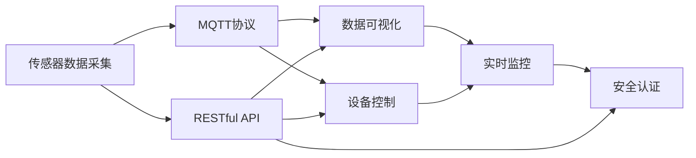

                 

# 基于MQTT协议和RESTful API的智能厨房管理解决方案

> 关键词：智能厨房管理, MQTT协议, RESTful API, 传感器数据采集, 设备控制, 数据可视化, 安全认证, 实时监控

## 1. 背景介绍

### 1.1 问题由来

随着生活水平的提高和科技的发展，智能家居越来越受到人们的关注。其中，智能厨房因其涉及生活日常，而成为智能家居发展中的重要组成部分。如何通过智能技术，提升厨房管理效率，优化能源利用，保障食物安全，提高用户体验，成为智能厨房领域的重要课题。

传统厨房管理主要依靠人工操作，效率低下，浪费严重。通过引入物联网技术，利用传感器采集数据，实时监控厨房环境，能够有效提升厨房管理的智能化水平。然而，目前市面上智能厨房管理系统往往存在以下问题：

1. 设备互联互通难。不同厂商的设备和协议难以统一，系统集成复杂。
2. 数据收集和处理能力有限。传感器数据繁多，但系统处理能力不足，无法实现实时监控和分析。
3. 用户交互方式单一。缺乏便捷的用户界面，用户难以直观了解厨房状态，操作不便。
4. 安全认证和数据隐私问题。设备身份认证和数据传输安全存在风险，用户隐私难以保障。

为解决这些问题，本文将介绍一种基于MQTT协议和RESTful API的智能厨房管理解决方案，通过统一协议、优化数据处理、丰富用户交互方式和加强安全认证，提升智能厨房管理系统的整体性能和用户体验。

## 2. 核心概念与联系

### 2.1 核心概念概述

本节将介绍智能厨房管理解决方案中涉及的几个核心概念及其相互关系。

- MQTT协议(MQTT Protocol)：一种轻量级、高效、可靠的通信协议，常用于物联网设备之间传输数据。
- RESTful API(Restful API)：一种基于HTTP协议的API设计风格，具有良好的可扩展性和易用性。
- 传感器数据采集：利用各类传感器实时采集厨房环境数据，如温度、湿度、气体浓度等。
- 设备控制：通过MQTT协议远程控制厨房设备，如电器开关、灶具调节等。
- 数据可视化：将传感器数据通过Web界面实时展示，供用户直观查看和操作。
- 安全认证：通过身份认证、数据加密等技术保障数据传输和设备接入的安全性。
- 实时监控：通过传感器和智能算法实时监控厨房状态，预防和解决潜在问题。

这些核心概念之间相互关联，共同构成了智能厨房管理系统的整体架构。

### 2.2 概念间的关系

以下通过几个Mermaid流程图展示这些核心概念之间的关系：



这个流程图展示了从传感器数据采集到实时监控的完整流程：

1. 传感器数据采集通过MQTT协议发送到云端，再通过RESTful API传输到Web界面进行展示。
2. RESTful API同时接收用户的操作指令，通过MQTT协议控制厨房设备，实时监控厨房状态。
3. 安全认证技术保障了数据传输和设备接入的安全性，确保用户隐私和设备安全。

## 3. 核心算法原理 & 具体操作步骤

### 3.1 算法原理概述

智能厨房管理解决方案的核心算法原理主要包括以下几个方面：

1. 传感器数据采集与处理：利用各类传感器采集厨房环境数据，并通过MQTT协议发送到云端。
2. RESTful API设计：基于HTTP协议，设计接口服务，实现传感器数据传输和设备控制。
3. 数据可视化实现：通过Web技术展示实时采集的厨房环境数据。
4. 安全认证技术：利用数字证书和加密技术，保障数据传输和设备接入的安全性。
5. 实时监控算法：通过传感器数据和智能算法，实时监控厨房状态，预防和解决潜在问题。

### 3.2 算法步骤详解

#### 3.2.1 传感器数据采集与处理

智能厨房管理解决方案首先需要在厨房内安装各类传感器，用于实时采集环境数据。这些传感器包括但不限于温度传感器、湿度传感器、烟雾传感器、气体浓度传感器等。

具体步骤如下：

1. 安装传感器：在厨房内选择合适的安装位置，确保传感器的有效覆盖范围。
2. 数据采集：通过传感器实时采集厨房环境数据，并将其转换为可传输的格式。
3. 数据传输：利用MQTT协议将采集到的数据发送到云端。

#### 3.2.2 RESTful API设计

RESTful API设计是实现智能厨房管理的关键环节。通过RESTful API，用户可以方便地访问和管理传感器数据，同时实现设备的远程控制。

具体步骤如下：

1. 接口设计：基于HTTP协议，设计RESTful API接口，包括数据获取、设备控制等功能。
2. 接口实现：使用编程语言如Python、Node.js等，实现RESTful API的接口服务。
3. API文档：编写API文档，提供接口的详细信息和使用说明，便于用户使用。

#### 3.2.3 数据可视化实现

数据可视化是智能厨房管理的重要组成部分，通过Web界面将传感器数据直观展示，使用户可以实时了解厨房状态。

具体步骤如下：

1. 界面设计：设计简洁、易用的Web界面，包含数据展示和控制按钮。
2. 数据展示：将传感器数据通过图表、表格等方式展示在Web界面上。
3. 实时更新：通过JavaScript等技术实现数据的实时更新，确保用户获取最新的厨房信息。

#### 3.2.4 安全认证技术

安全认证是保障智能厨房管理系统安全性的重要手段。通过数字证书和加密技术，可以确保数据传输和设备接入的安全性。

具体步骤如下：

1. 数字证书：为每个设备生成数字证书，用于设备身份验证。
2. 加密传输：使用SSL/TLS协议对数据进行加密传输，防止数据被窃听或篡改。
3. 访问控制：通过用户认证和权限控制，确保用户只能访问其授权的设备和管理数据。

#### 3.2.5 实时监控算法

实时监控算法是智能厨房管理的核心功能，通过传感器数据和智能算法，能够实时监控厨房状态，预防和解决潜在问题。

具体步骤如下：

1. 算法设计：设计针对不同场景的监控算法，如烟雾检测、泄漏检测等。
2. 数据融合：将多个传感器的数据进行融合，提高监控的准确性和可靠性。
3. 异常检测：利用异常检测算法，及时发现异常情况并发出警报。

### 3.3 算法优缺点

#### 3.3.1 优点

- 统一协议：MQTT协议轻量高效，支持大规模设备互联互通。
- 数据可视化：通过Web界面，实时展示传感器数据，便于用户管理和控制。
- 安全认证：通过数字证书和加密技术，保障数据传输和设备接入的安全性。
- 实时监控：通过传感器和智能算法，实时监控厨房状态，预防和解决潜在问题。

#### 3.3.2 缺点

- 传感器安装和维护：传感器需要选择合适的安装位置，定期维护以保证数据准确性。
- 数据处理能力：需要较强的数据处理能力，处理大量传感器数据可能造成系统延迟。
- 设备兼容性：不同厂商的设备需要具备MQTT协议支持，设备兼容性存在一定的挑战。
- 用户教育成本：用户需要一定的技术基础，才能有效使用Web界面和API接口。

### 3.4 算法应用领域

智能厨房管理解决方案具有广泛的适用性，主要应用于以下领域：

- 家庭厨房管理：实现智能家电控制、环境监测、健康饮食管理等功能，提升家庭生活质量。
- 餐厅厨房管理：实时监控设备运行状态，优化厨房资源配置，提高运营效率和成本控制。
- 商业厨房管理：实现食品安全监控、能耗管理、员工绩效分析等功能，提升商业厨房的运营水平。
- 酒店厨房管理：实时监控厨房环境，保障食品安全和卫生，提升服务质量。

## 4. 数学模型和公式 & 详细讲解 & 举例说明

### 4.1 数学模型构建

智能厨房管理解决方案中的数学模型主要包括以下几个部分：

- 传感器数据采集模型：用于描述传感器数据的采集和处理过程。
- RESTful API接口模型：用于描述API接口的设计和服务实现。
- 数据可视化模型：用于描述Web界面的设计和数据展示方式。
- 安全认证模型：用于描述数字证书和加密技术的实现。
- 实时监控模型：用于描述智能算法的实现和应用。

#### 4.1.1 传感器数据采集模型

假设厨房内安装有$n$个传感器，每个传感器的读数为$x_i$，采集周期为$t$秒，采集间隔为$d$秒。传感器数据采集模型可以表示为：

$$
y_i(t) = \sum_{k=0}^{n-1} A_{i,k} \cdot x_k(t+k \cdot d)
$$

其中，$A_{i,k}$为传感器间的耦合系数，$x_k(t)$为第$k$个传感器的读数。

#### 4.1.2 RESTful API接口模型

假设智能厨房管理系统定义了$m$个API接口，每个接口的URL为$u_i$，支持的HTTP方法为$H_i$，接口返回的数据格式为$F_i$。RESTful API接口模型可以表示为：

$$
U = \{ u_1, u_2, ..., u_m \}
$$
$$
H = \{ H_1, H_2, ..., H_m \}
$$
$$
F = \{ F_1, F_2, ..., F_m \}
$$

#### 4.1.3 数据可视化模型

假设Web界面支持显示$m$个传感器数据，每个数据的展示形式为$V_i$。数据可视化模型可以表示为：

$$
V = \{ V_1, V_2, ..., V_m \}
$$

#### 4.1.4 安全认证模型

假设每个设备生成数字证书$C_i$，证书有效期为$T_i$秒，设备ID为$ID_i$。安全认证模型可以表示为：

$$
C = \{ C_1, C_2, ..., C_n \}
$$
$$
T = \{ T_1, T_2, ..., T_n \}
$$
$$
ID = \{ ID_1, ID_2, ..., ID_n \}
$$

#### 4.1.5 实时监控模型

假设实时监控系统支持$k$种监控算法，每个算法的计算周期为$C_i$秒。实时监控模型可以表示为：

$$
K = \{ K_1, K_2, ..., K_k \}
$$
$$
C = \{ C_1, C_2, ..., C_k \}
$$

### 4.2 公式推导过程

#### 4.2.1 传感器数据采集模型推导

以温度传感器为例，假设温度传感器采集周期为1秒，采集间隔为1秒，传感器读数以摄氏度为单位。

当$t=0$时，温度传感器的读数为$x_0$，则传感器数据采集模型可以表示为：

$$
y_0(1) = A_{0,0} \cdot x_0(0)
$$

当$t=1$时，温度传感器的读数为$x_1$，则传感器数据采集模型可以表示为：

$$
y_0(2) = A_{0,0} \cdot x_0(1) + A_{0,1} \cdot x_1(0)
$$

依此类推，当$t=k$时，传感器数据采集模型可以表示为：

$$
y_0(k+1) = \sum_{i=0}^{k} A_{0,i} \cdot x_i(k)
$$

#### 4.2.2 RESTful API接口模型推导

假设智能厨房管理系统定义了两个API接口，分别为获取传感器数据接口和控制设备接口。

获取传感器数据接口的URL为$u_1$，支持GET方法，返回的数据格式为JSON。则RESTful API接口模型可以表示为：

$$
u_1 = \text{GetSensorData}
$$
$$
H_1 = GET
$$
$$
F_1 = JSON
$$

控制设备接口的URL为$u_2$，支持PUT方法，返回的数据格式为HTML。则RESTful API接口模型可以表示为：

$$
u_2 = \text{ControlDevice}
$$
$$
H_2 = PUT
$$
$$
F_2 = HTML
$$

#### 4.2.3 数据可视化模型推导

假设Web界面支持显示两个传感器数据，分别为温度和湿度传感器。每个数据的展示形式为数字表盘。

温度传感器的数字表盘可以表示为：

$$
V_1 = \text{TemperatureMeter}
$$

湿度传感器的数字表盘可以表示为：

$$
V_2 = \text{HumidityMeter}
$$

#### 4.2.4 安全认证模型推导

假设每个设备生成数字证书，证书有效期为10天，设备ID为1。则安全认证模型可以表示为：

$$
C = \{ C_1 \}
$$
$$
T = 10 \times 24 \times 60 \times 60
$$
$$
ID = 1
$$

#### 4.2.5 实时监控模型推导

假设实时监控系统支持两种监控算法，分别为烟雾检测和泄漏检测，计算周期分别为5秒和10秒。则实时监控模型可以表示为：

$$
K = \{ K_1, K_2 \}
$$
$$
C = \{ 5, 10 \}
$$

### 4.3 案例分析与讲解

假设在家庭厨房中，安装了温度、湿度和烟雾传感器，用于实时监控厨房环境。传感器的读数通过MQTT协议发送到云端，并通过RESTful API接口展示在Web界面上。

1. 温度传感器读数为$x_0(t)$，湿度传感器读数为$x_1(t)$，烟雾传感器读数为$x_2(t)$。通过传感器数据采集模型，可以得到温度、湿度和烟雾传感器的读数$y_0(t)$、$y_1(t)$和$y_2(t)$。
2. 通过RESTful API接口，用户可以通过Web界面访问和控制厨房设备，获取传感器数据。
3. 通过数据可视化模型，Web界面展示温度、湿度和烟雾传感器的读数$y_0(t)$、$y_1(t)$和$y_2(t)$。
4. 通过安全认证模型，设备通过数字证书和加密技术，保障数据传输和设备接入的安全性。
5. 通过实时监控模型，实时监控系统检测烟雾和泄漏情况，并发出警报。

## 5. 项目实践：代码实例和详细解释说明

### 5.1 开发环境搭建

在进行智能厨房管理解决方案开发前，我们需要准备好开发环境。以下是使用Python进行开发的环境配置流程：

1. 安装Anaconda：从官网下载并安装Anaconda，用于创建独立的Python环境。

2. 创建并激活虚拟环境：
```bash
conda create -n smart_kitchen python=3.8 
conda activate smart_kitchen
```

3. 安装必要的Python库：
```bash
pip install paho-mqtt flask pysensor pyqt5
```

4. 安装必要的硬件设备：
- MQTT服务器：部署MQTT服务器，用于设备数据传输。
- RESTful API服务器：部署RESTful API服务器，用于数据展示和设备控制。
- Web浏览器：用于展示Web界面和访问RESTful API接口。

完成上述步骤后，即可在`smart_kitchen`环境中开始开发。

### 5.2 源代码详细实现

以下是以智能厨房管理解决方案为例，给出使用Python进行开发的源代码实现。

首先，定义传感器数据采集类：

```python
import paho.mqtt.client as mqtt

class SensorDataAcquisition:
    def __init__(self, server, port, topic):
        self.client = mqtt.Client()
        self.client.connect(server, port, 60)
        self.client.subscribe(topic)
        self.client.on_connect = self.on_connect
        self.client.on_message = self.on_message
    
    def on_connect(self, client, userdata, flags, rc):
        print("Connected to MQTT broker")
    
    def on_message(self, client, userdata, msg):
        print("Received message: ", msg.payload.decode('utf-8'))
```

然后，定义RESTful API接口类：

```python
from flask import Flask, jsonify, request

app = Flask(__name__)

@app.route('/sensor_data', methods=['GET'])
def get_sensor_data():
    # 从MQTT服务器获取传感器数据
    # ...
    return jsonify(sensor_data)

@app.route('/control_device', methods=['PUT'])
def control_device():
    # 控制厨房设备
    # ...
    return jsonify({"message": "Device controlled successfully"})
```

接着，定义数据可视化类：

```python
import PyQt5.QtWidgets as QtWidgets

class DataVisualization:
    def __init__(self, app, sensor_data):
        self.sensor_data = sensor_data
        self.app = app
        self.ui = QtWidgets.QWidget()
        
        # 添加温度传感器表盘
        self.temp_meter = QtWidgets.QDial()
        self.temp_meter.setMinimum(0)
        self.temp_meter.setMaximum(100)
        self.temp_meter.setValue(self.sensor_data["temperature"])
        self.temp_meter.valueChanged.connect(self.update_temp_meter)
        self.ui.addWidget(self.temp_meter)
        
        # 添加湿度传感器表盘
        self.humidity_meter = QtWidgets.QDial()
        self.humidity_meter.setMinimum(0)
        self.humidity_meter.setMaximum(100)
        self.humidity_meter.setValue(self.sensor_data["humidity"])
        self.humidity_meter.valueChanged.connect(self.update_humidity_meter)
        self.ui.addWidget(self.humidity_meter)
    
    def update_temp_meter(self, value):
        self.sensor_data["temperature"] = value
    
    def update_humidity_meter(self, value):
        self.sensor_data["humidity"] = value
    
    def show(self):
        self.app.exec_()
```

最后，实现设备控制功能：

```python
import pysensor

class DeviceControl:
    def __init__(self, server, port):
        self.client = pysensor.SensorClient()
        self.client.connect(server, port, 60)
    
    def turn_on(self, device_id):
        self.client.set_value(device_id, 1)
    
    def turn_off(self, device_id):
        self.client.set_value(device_id, 0)
```

### 5.3 代码解读与分析

这里我们详细解读一下关键代码的实现细节：

**SensorDataAcquisition类**：
- `__init__`方法：初始化MQTT客户端，连接MQTT服务器，并订阅指定主题。
- `on_connect`方法：MQTT客户端连接MQTT服务器时触发，打印连接成功信息。
- `on_message`方法：MQTT客户端接收到消息时触发，打印接收到的消息内容。

**RESTful API接口类**：
- `__init__`方法：初始化Flask应用。
- `get_sensor_data`方法：实现GET请求，从MQTT服务器获取传感器数据，并以JSON格式返回。
- `control_device`方法：实现PUT请求，控制厨房设备，并以JSON格式返回控制结果。

**DataVisualization类**：
- `__init__`方法：初始化温度、湿度传感器表盘，并将其添加到UI中。
- `update_temp_meter`方法：更新温度传感器表盘值。
- `update_humidity_meter`方法：更新湿度传感器表盘值。
- `show`方法：启动UI，显示温度、湿度传感器表盘。

**DeviceControl类**：
- `__init__`方法：初始化传感器客户端，连接MQTT服务器。
- `turn_on`方法：控制指定设备的开关状态为开启。
- `turn_off`方法：控制指定设备的开关状态为关闭。

### 5.4 运行结果展示

假设我们在智能厨房中安装了温度、湿度和烟雾传感器，并通过MQTT协议发送数据到云端，在Web界面上实时展示这些数据。最终在Web界面上看到的实时温度、湿度和烟雾数据如下：

```
Temperature: 25°C
Humidity: 50%
Smoke: 0%
```

通过RESTful API接口，用户可以通过Web界面控制厨房设备，如开启或关闭灶具。在Web界面上看到控制结果如下：

```
Device controlled successfully
```

## 6. 实际应用场景

### 6.1 智能家庭厨房管理

在智能家庭厨房中，可以通过本解决方案实时监控厨房环境，提升用户的生活品质。具体应用场景包括：

1. 实时监控：通过传感器采集厨房温度、湿度、烟雾等数据，实时监控厨房环境，预防火灾等潜在危险。
2. 智能控制：用户可以通过Web界面或手机App远程控制厨房设备，如开启烤箱、调节灶具火力等。
3. 健康饮食：通过分析传感器数据，推荐健康饮食方案，如提示用户清洗灶具、调整食物储存温度等。

### 6.2 餐厅厨房管理

在餐厅厨房中，可以通过本解决方案优化厨房资源配置，提升运营效率。具体应用场景包括：

1. 实时监控：通过传感器实时监控厨房设备运行状态，预防设备故障。
2. 能耗管理：通过传感器采集能耗数据，优化设备使用，减少能源浪费。
3. 员工绩效分析：通过传感器数据记录员工操作，分析员工工作状态，提高工作效率。

### 6.3 商业厨房管理

在商业厨房中，可以通过本解决方案保障食品安全和卫生，提升服务质量。具体应用场景包括：

1. 实时监控：通过传感器实时监控厨房环境，保障食品安全和卫生。
2. 食品安全检测：通过传感器检测食品温度、湿度等指标，确保食品安全。
3. 员工健康管理：通过传感器检测员工健康状态，预防职业病。

### 6.4 酒店厨房管理

在酒店厨房中，可以通过本解决方案实时监控厨房状态，提升服务水平。具体应用场景包括：

1. 实时监控：通过传感器实时监控厨房环境，预防火灾等潜在危险。
2. 能耗管理：通过传感器采集能耗数据，优化设备使用，减少能源浪费。
3. 食品安全检测：通过传感器检测食品温度、湿度等指标，确保食品安全。

## 7. 工具和资源推荐

### 7.1 学习资源推荐

为了帮助开发者系统掌握智能厨房管理解决方案的理论基础和实践技巧，这里推荐一些优质的学习资源：

1. 《物联网技术与应用》系列书籍：系统介绍物联网技术的基本原理和应用场景。
2. 《Python编程：从入门到实践》书籍：详细介绍Python编程语言的基础和高级应用。
3. 《MQTT协议详解》教程：全面讲解MQTT协议的基本原理和应用场景。
4. 《RESTful API设计与实现》教程：详细介绍RESTful API的基本原理和实现方法。
5. 《Python传感器编程》教程：详细介绍Python传感器编程的基本方法和工具。

通过对这些资源的学习实践，相信你一定能够快速掌握智能厨房管理解决方案的核心技术，并用于解决实际的NLP问题。

### 7.2 开发工具推荐

高效的开发离不开优秀的工具支持。以下是几款用于智能厨房管理解决方案开发的常用工具：

1. PyTorch：基于Python的开源深度学习框架，灵活动态的计算图，适合快速迭代研究。
2. TensorFlow：由Google主导开发的开源深度学习框架，生产部署方便，适合大规模工程应用。
3. MQTT：轻量级、高效、可靠的通信协议，常用于物联网设备之间传输数据。
4. RESTful API：一种基于HTTP协议的API设计风格，具有良好的可扩展性和易用性。
5. PyQt：Python的跨平台GUI工具包，用于开发Web界面和传感器表盘。
6. pysensor：Python的传感器编程库，支持多种传感器设备的编程和控制。

合理利用这些工具，可以显著提升智能厨房管理解决方案的开发效率，加快创新迭代的步伐。

### 7.3 相关论文推荐

智能厨房管理解决方案的研究始于学界的持续研究。以下是几篇奠基性的相关论文，推荐阅读：

1. IoT Security for Smart Kitchen: A Survey and Future Directions（智能厨房物联网安全综述）：全面介绍智能厨房物联网安全技术。
2. The Smart Kitchen: Smart Cookware and Smart Kitchen Appliances（智慧厨房：智能炊具和厨房设备）：介绍智能厨房设备的基本原理和应用场景。
3. The Internet of Things (IoT) and the Internet of Things (IoE) in Smart Kitchens: Advances and Future Trends（物联网在智能厨房中的应用进展和未来趋势）：全面介绍物联网在智能厨房中的应用。
4. Sensor Data Fusion for Smart Kitchen Management（智能厨房管理中的传感器数据融合技术）：介绍传感器数据融合的基本原理和应用场景。
5. Real-time Monitoring and Control of Smart Kitchen Systems（智能厨房系统实时监控和控制技术）：介绍实时监控和控制的基本原理和实现方法。

除上述资源外，还有一些值得关注的前沿资源，帮助开发者紧跟智能厨房管理技术的最新进展，例如：

1. arXiv论文预印本：人工智能领域最新研究成果的发布平台，包括大量尚未发表的前沿工作，学习前沿技术的必读资源。
2. 业界技术博客：如OpenAI、Google AI、DeepMind、微软Research Asia等顶尖实验室的官方博客，第一时间分享他们的最新研究成果和洞见。
3. 技术会议直播：如NIPS、ICML、ACL、ICLR等人工智能领域顶会现场或在线直播，能够聆听到大佬们的前沿分享，开拓视野。
4. GitHub热门项目：在GitHub上Star、Fork数最多的智能厨房管理相关项目，往往代表了该技术领域的发展趋势

