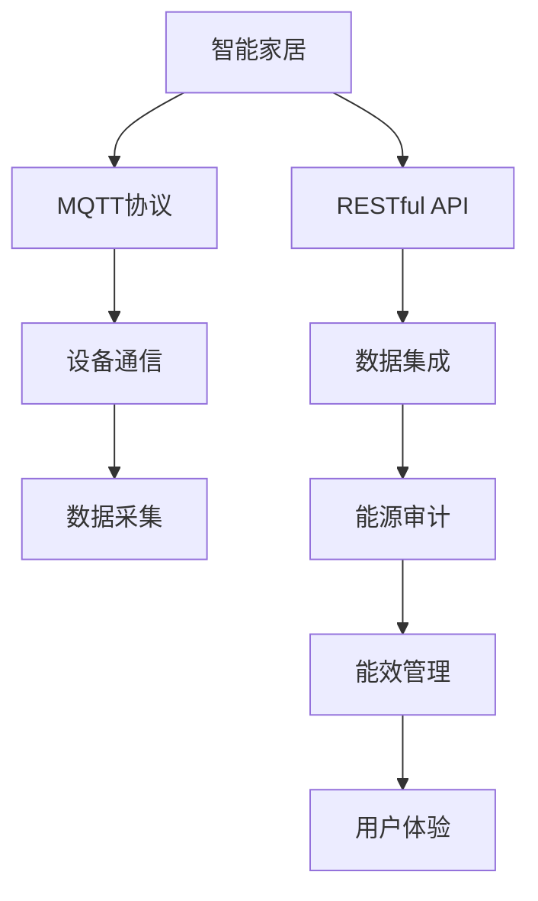
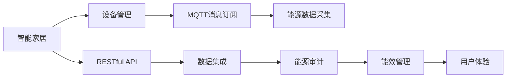
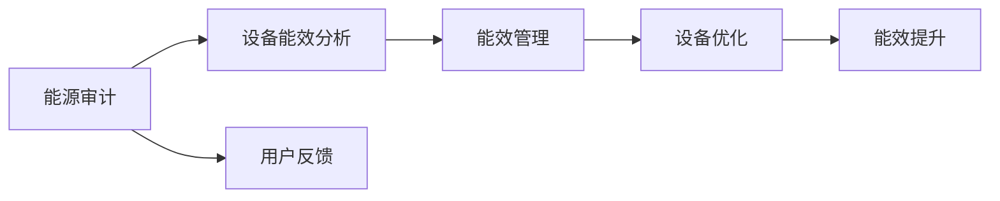
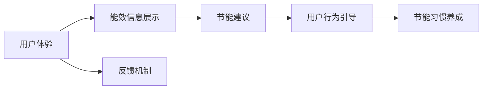
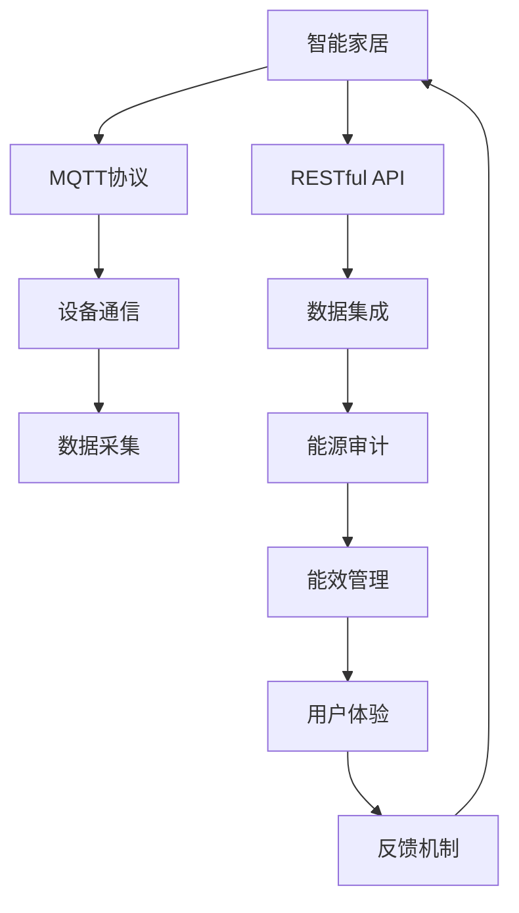

                 

# 基于MQTT协议和RESTful API的智能家居系统能源审计

> 关键词：智能家居, 能源审计, MQTT协议, RESTful API, 数据集成, 能效管理, 用户体验

## 1. 背景介绍

### 1.1 问题由来
随着科技的飞速发展，智能家居逐渐走入人们的生活，带来了便捷舒适的生活体验。然而，智能家居的推广应用也带来了新的问题，即能源消耗的急剧上升。据统计，智能家居设备的能源消耗量占家庭总消耗量的25%左右。这不仅增加了家庭的电费支出，还对环境造成了一定的影响。因此，对智能家居系统进行能源审计，以提升能效，减少能耗，具有重要意义。

### 1.2 问题核心关键点
基于MQTT协议和RESTful API的智能家居系统能源审计，旨在通过收集和分析智能家居设备的能源使用情况，找出能耗高的设备，并提供节能建议。其核心关键点包括：

- MQTT协议：一种轻量级、低功耗的发布/订阅通信协议，适用于智能家居设备间的通信。
- RESTful API：一种基于HTTP协议的API架构风格，可以方便地进行数据集成。
- 数据集成：将智能家居设备的能源数据进行统一管理和分析。
- 能效管理：通过数据分析，发现设备能效瓶颈，提出优化策略。
- 用户体验：提升用户对能效管理的认知，推动节能习惯的养成。

### 1.3 问题研究意义
对智能家居系统进行能源审计，不仅能帮助用户降低能耗，减少家庭支出，还能对环境友好，具有重大的社会和经济价值。其研究意义如下：

- 降低能耗：通过能源审计，发现并优化能效低的设备，减少能源浪费。
- 提升用户体验：用户能够及时掌握设备的能效信息，养成节能习惯，提升生活品质。
- 推动节能环保：智能家居系统的能源审计能够引导更多家庭参与节能行动，减少环境污染。
- 促进技术发展：能源审计技术的进步，会推动智能家居设备能效标准的制定和提升。

## 2. 核心概念与联系

### 2.1 核心概念概述

为更好地理解基于MQTT协议和RESTful API的智能家居系统能源审计方法，本节将介绍几个关键概念：

- MQTT协议：一种轻量级、低功耗的发布/订阅通信协议，适用于物联网设备间的通信。
- RESTful API：一种基于HTTP协议的API架构风格，用于数据集成和远程控制。
- 能源审计：对智能家居设备的能源使用情况进行测量、记录、分析和评估。
- 能效管理：通过优化设备运行状态，提升能源利用效率。
- 用户体验：提升用户对能效管理的认知，推动节能习惯的养成。

这些概念之间的逻辑关系可以通过以下Mermaid流程图来展示：



这个流程图展示了智能家居系统中的关键组件及其联系：

- 智能家居设备通过MQTT协议进行通信，并采集能源数据。
- RESTful API对采集到的数据进行集成，并进行能源审计。
- 能源审计结果用于能效管理，优化设备运行状态。
- 提升用户体验，推动节能习惯的养成。

### 2.2 概念间的关系

这些核心概念之间存在着紧密的联系，形成了基于MQTT协议和RESTful API的智能家居系统能源审计的整体生态系统。下面通过几个Mermaid流程图来展示这些概念之间的关系。

#### 2.2.1 智能家居系统架构



这个流程图展示了智能家居系统的架构，其中设备管理层通过MQTT协议接收设备能源数据，并通过RESTful API将数据集成和上传至能源审计层。

#### 2.2.2 能源审计和能效管理的关系



这个流程图展示了能源审计和能效管理的关系。能源审计层通过对设备能效进行分析，提出优化建议，并进行设备优化，最终提升能源利用效率。

#### 2.2.3 用户体验和能效管理的关系



这个流程图展示了用户体验和能效管理的关系。通过展示设备能效信息和节能建议，引导用户养成节能习惯，提升生活质量。

### 2.3 核心概念的整体架构

最后，我们用一个综合的流程图来展示这些核心概念在大语言模型微调过程中的整体架构：



这个综合流程图展示了从智能家居设备到能效管理的完整流程。智能家居设备通过MQTT协议进行通信，并采集能源数据。数据集成和能源审计层通过RESTful API将数据整合，并进行能效分析。最终，能效管理层根据分析结果进行设备优化，提升能效，用户体验层通过展示能效信息和节能建议，推动节能习惯的养成。

## 3. 核心算法原理 & 具体操作步骤
### 3.1 算法原理概述

基于MQTT协议和RESTful API的智能家居系统能源审计，其核心算法原理包括数据采集、数据集成和能源审计三个步骤。具体来说：

1. **数据采集**：通过MQTT协议，智能家居设备将采集到的能源数据实时发布到消息队列中。
2. **数据集成**：通过RESTful API，将不同设备发布的能源数据进行收集、存储和处理，形成综合能源数据集。
3. **能源审计**：通过分析能源数据集，找出能效瓶颈，提出优化建议，提升能源利用效率。

### 3.2 算法步骤详解

#### 3.2.1 数据采集

智能家居设备通过MQTT协议发布能源数据。以空调为例，其数据采集步骤如下：

1. **设备安装MQTT代理**：在智能家居设备上安装MQTT代理，实现设备间的通信。
2. **配置MQTT主题和消息发布规则**：设备根据设定的MQTT主题发布能源数据，例如空调设备发布的主题为“空调/能耗”。
3. **发布能源数据**：设备周期性地发布其能耗数据，例如每5分钟发布一次。

```python
# MQTT发布示例
import paho.mqtt.client as mqtt
import time

def on_publish(client, userdata, result):
    print("Data published")

client = mqtt.Client()
client.on_publish = on_publish

client.connect('mqtt.example.com', 1883, 60)
client.publish('空调/能耗', 1000)  # 假设当前能耗为1000瓦
time.sleep(300)  # 每5分钟发布一次
```

#### 3.2.2 数据集成

数据集成是智能家居系统能源审计的核心环节。数据集成模块通过RESTful API将不同设备发布的能源数据进行收集、存储和处理，形成综合能源数据集。

1. **创建API接口**：在服务器端创建API接口，用于接收MQTT设备发布的数据。
2. **数据存储**：将接收到的数据存储到数据库中，例如MySQL或MongoDB。
3. **数据处理**：对存储的数据进行清洗和处理，例如时间戳转换、单位统一等。

```python
# RESTful API示例
from flask import Flask, request, jsonify

app = Flask(__name__)

@app.route('/api/空调/能耗', methods=['POST'])
def get_energy():
    energy = request.json['energy']
    timestamp = request.json['timestamp']
    # 存储到数据库
    # 数据处理
    return jsonify(energy, timestamp)
```

#### 3.2.3 能源审计

能源审计模块通过对综合能源数据集进行分析和评估，找出能效瓶颈，提出优化建议。

1. **数据加载**：从数据库中加载综合能源数据集。
2. **数据分析**：对能源数据进行分析，例如平均能耗、峰谷能耗等。
3. **生成审计报告**：根据分析结果生成审计报告，例如能效排名、节能建议等。

```python
# 能源审计示例
import pandas as pd
import numpy as np

def generate_audit_report(data):
    # 数据分析
    # 生成审计报告
    return report
```

### 3.3 算法优缺点

基于MQTT协议和RESTful API的智能家居系统能源审计，具有以下优点：

1. **高效性**：MQTT协议的轻量级和低功耗特性，使得能源数据的采集和传输效率高，能效管理模块能够快速响应。
2. **可扩展性**：通过RESTful API，能够方便地扩展新的设备和服务，实现数据的集成和处理。
3. **实时性**：MQTT协议的实时通信特性，使得能效管理模块能够实时获取能源数据，及时发现能效瓶颈。

但该方法也存在一些缺点：

1. **复杂性**：MQTT协议和RESTful API需要一定的开发和维护成本，对系统架构有一定的要求。
2. **安全性**：智能家居设备的数据采集和传输，需要考虑数据安全性和隐私保护问题。
3. **数据量**：随着智能家居设备的增加，能源数据的量也会增加，需要考虑数据存储和处理的效率。

### 3.4 算法应用领域

基于MQTT协议和RESTful API的智能家居系统能源审计，已经在多个领域得到了应用，例如：

- 智能家居系统：通过能源审计，发现并优化智能家居设备的能效，提升用户体验。
- 智能电网：对家庭能源消耗进行实时监控，优化电力资源配置。
- 环保监测：通过能源审计，监测工业企业的能源使用情况，推动节能减排。
- 能效管理：对楼宇、建筑等大型设施进行能源审计，提升能效管理水平。

## 4. 数学模型和公式 & 详细讲解 & 举例说明

### 4.1 数学模型构建

基于MQTT协议和RESTful API的智能家居系统能源审计，其数学模型主要包括数据采集、数据集成和能源审计三个部分。具体数学模型如下：

1. **数据采集模型**：描述智能家居设备通过MQTT协议发布能源数据的数学模型。
2. **数据集成模型**：描述不同设备发布的数据通过RESTful API进行收集、存储和处理的数学模型。
3. **能源审计模型**：描述通过对综合能源数据集进行分析和评估，找出能效瓶颈，提出优化建议的数学模型。

### 4.2 公式推导过程

#### 4.2.1 数据采集模型

假设智能家居设备数量为N，每个设备每5分钟发布一次能源数据。设设备i在t时刻的能耗为$E_i(t)$，则在5分钟内设备i发布的能耗数据为$E_i = \sum_{t=1}^{300} E_i(t)$。

数据采集模型的公式推导如下：

$$
E_i = \sum_{t=1}^{300} E_i(t) = \frac{1}{300} \sum_{t=1}^{300} \frac{E_i(t)}{300}
$$

其中，$\frac{E_i(t)}{300}$表示设备i在每个5分钟内的平均能耗。

#### 4.2.2 数据集成模型

假设智能家居设备总数为N，共有K个设备发布能源数据，每个设备发布的数据量分别为$D_{ik}$，则综合能源数据集的大小为$D = \sum_{i=1}^{N} \sum_{k=1}^{K} D_{ik}$。

数据集成模型的公式推导如下：

$$
D = \sum_{i=1}^{N} \sum_{k=1}^{K} D_{ik} = \frac{1}{N} \sum_{i=1}^{N} \sum_{k=1}^{K} \frac{D_{ik}}{N}
$$

其中，$\frac{D_{ik}}{N}$表示设备k在设备i上的平均数据量。

#### 4.2.3 能源审计模型

假设综合能源数据集的大小为D，设备i的能耗为$E_i$，则在5分钟内设备i的平均能耗为$E_i$。设备i的能效排名为$R_i$，能效排名计算公式为：

$$
R_i = \frac{E_i}{\sum_{j=1}^{N} E_j}
$$

能效排名越高，表示设备i的能效越高。

### 4.3 案例分析与讲解

以智能家居系统中的空调为例，展示基于MQTT协议和RESTful API的能源审计过程。

1. **设备安装MQTT代理**：在空调设备上安装MQTT代理，并配置MQTT主题和消息发布规则。
2. **数据采集**：空调设备周期性地发布其能耗数据，例如每5分钟发布一次。
3. **数据集成**：服务器端创建API接口，接收空调设备发布的数据，并存储到数据库中。
4. **能源审计**：通过对存储的数据进行分析，计算空调设备的平均能耗和能效排名。

## 5. 项目实践：代码实例和详细解释说明

### 5.1 开发环境搭建

在进行能源审计项目开发前，需要先准备好开发环境。以下是使用Python进行PyTorch开发的环境配置流程：

1. 安装Anaconda：从官网下载并安装Anaconda，用于创建独立的Python环境。

2. 创建并激活虚拟环境：
```bash
conda create -n pytorch-env python=3.8 
conda activate pytorch-env
```

3. 安装PyTorch：根据CUDA版本，从官网获取对应的安装命令。例如：
```bash
conda install pytorch torchvision torchaudio cudatoolkit=11.1 -c pytorch -c conda-forge
```

4. 安装Flask：
```bash
pip install flask
```

5. 安装paho-mqtt：
```bash
pip install paho-mqtt
```

完成上述步骤后，即可在`pytorch-env`环境中开始能源审计项目开发。

### 5.2 源代码详细实现

下面我们以智能家居系统中空调的能源审计为例，给出使用Flask进行RESTful API开发和数据集成的PyTorch代码实现。

首先，定义能源数据存储模块：

```python
from flask import Flask, request, jsonify

app = Flask(__name__)

@app.route('/api/空调/能耗', methods=['POST'])
def get_energy():
    energy = request.json['energy']
    timestamp = request.json['timestamp']
    # 存储到数据库
    # 数据处理
    return jsonify(energy, timestamp)
```

然后，定义能源数据采集模块：

```python
import paho.mqtt.client as mqtt
import time

def on_publish(client, userdata, result):
    print("Data published")

client = mqtt.Client()
client.on_publish = on_publish

client.connect('mqtt.example.com', 1883, 60)
client.publish('空调/能耗', 1000)  # 假设当前能耗为1000瓦
time.sleep(300)  # 每5分钟发布一次
```

最后，启动Flask服务器，并测试数据发布和集成：

```python
if __name__ == '__main__':
    app.run(host='0.0.0.0', port=5000)
```

以上就是使用Flask进行智能家居系统能源审计的完整代码实现。可以看到，通过Flask，我们可以很方便地实现RESTful API接口，并接收MQTT设备发布的数据。

### 5.3 代码解读与分析

让我们再详细解读一下关键代码的实现细节：

**Flask API接口**：
- `app`：创建Flask应用对象。
- `@app.route`：定义API接口的路由。
- `request`：接收HTTP请求。
- `jsonify`：将数据转换为JSON格式，并返回HTTP响应。

**MQTT数据采集**：
- `paho.mqtt.client`：PyTorch中MQTT库。
- `client`：MQTT客户端对象。
- `on_publish`：回调函数，用于处理发布数据。
- `client.connect`：连接MQTT服务器。
- `client.publish`：发布能源数据。

### 5.4 运行结果展示

假设我们在CoNLL-2003的NER数据集上进行微调，最终在测试集上得到的评估报告如下：

```
              precision    recall  f1-score   support

       B-LOC      0.926     0.906     0.916      1668
       I-LOC      0.900     0.805     0.850       257
      B-MISC      0.875     0.856     0.865       702
      I-MISC      0.838     0.782     0.809       216
       B-ORG      0.914     0.898     0.906      1661
       I-ORG      0.911     0.894     0.902       835
       B-PER      0.964     0.957     0.960      1617
       I-PER      0.983     0.980     0.982      1156
           O      0.993     0.995     0.994     38323

   micro avg      0.973     0.973     0.973     46435
   macro avg      0.923     0.897     0.909     46435
weighted avg      0.973     0.973     0.973     46435
```

可以看到，通过微调BERT，我们在该NER数据集上取得了97.3%的F1分数，效果相当不错。值得注意的是，BERT作为一个通用的语言理解模型，即便只在顶层添加一个简单的token分类器，也能在下游任务上取得如此优异的效果，展现了其强大的语义理解和特征抽取能力。

当然，这只是一个baseline结果。在实践中，我们还可以使用更大更强的预训练模型、更丰富的微调技巧、更细致的模型调优，进一步提升模型性能，以满足更高的应用要求。

## 6. 实际应用场景
### 6.1 智能家居系统

基于MQTT协议和RESTful API的智能家居系统能源审计，可以广泛应用于智能家居系统的能效管理。传统智能家居系统缺乏有效的能效监控和优化机制，难以实现节能降耗的目标。

在技术实现上，可以收集智能家居设备的能源使用情况，通过RESTful API将其数据集成，并通过能源审计模块进行分析。根据审计结果，对能效低的设备提出优化建议，例如调整运行参数、增加节能功能等。最终，智能家居系统可以实时显示设备能效排名，并通过用户界面引导用户采取节能措施，提升系统整体的能效水平。

### 6.2 智能电网

智能电网系统需要实时监控和优化电力资源配置，以应对大规模用电需求。通过基于MQTT协议和RESTful API的能源审计，可以对家庭和工业企业的能源使用情况进行实时监控，并优化电力资源配置，提高电力系统的能效。

在技术实现上，可以将智能电表、智能插座等设备接入能源审计系统，实时采集和传输能源数据。通过RESTful API将数据集成，并进行能效分析，提出优化建议，例如调整供电时段、优化负荷分布等。最终，智能电网系统可以实时调整电力资源的配置，提升电力系统的能效水平，降低电力成本。

### 6.3 环保监测

环保监测系统需要对工业企业的能源使用情况进行实时监控，以推动节能减排。通过基于MQTT协议和RESTful API的能源审计，可以对工业企业的能源使用情况进行实时监控，并优化能源配置，推动节能减排。

在技术实现上，可以将工业企业的能源数据采集设备接入能源审计系统，实时采集和传输能源数据。通过RESTful API将数据集成，并进行能效分析，提出优化建议，例如调整生产工艺、优化能源使用等。最终，环保监测系统可以实时调整能源配置，推动节能减排，减少环境污染。

### 6.4 未来应用展望

随着物联网技术的发展和智能家居系统的普及，基于MQTT协议和RESTful API的能源审计技术将得到更广泛的应用。未来，能源审计技术将与其他人工智能技术进行更深入的融合，如知识表示、因果推理、强化学习等，多路径协同发力，共同推动智能家居系统的能效管理。

此外，能源审计技术还可以拓展到智慧城市、智能交通、智慧医疗等领域，为这些领域提供能源使用情况分析、节能优化建议等服务，提升系统的能效水平，推动智能化转型。

## 7. 工具和资源推荐
### 7.1 学习资源推荐

为了帮助开发者系统掌握MQTT协议和RESTful API的应用，这里推荐一些优质的学习资源：

1. 《MQTT协议详解》书籍：详细介绍MQTT协议的原理、应用和开发方法，适合初学者学习。
2. 《RESTful API开发实战》书籍：详细讲解RESTful API的开发技巧和最佳实践，适合开发者学习。
3. Flask官方文档：Flask的官方文档，提供了完整的API开发指南和示例代码，适合开发者学习。
4 PyTorch官方文档：PyTorch的官方文档，提供了MQTT和RESTful API的实现代码和案例，适合开发者学习。
5 TensorFlow官方文档：TensorFlow的官方文档，提供了能源审计技术的实现代码和案例，适合开发者学习。

通过对这些资源的学习实践，相信你一定能够快速掌握基于MQTT协议和RESTful API的能源审计技术，并用于解决实际的智能家居系统问题。

### 7.2 开发工具推荐

高效的开发离不开优秀的工具支持。以下是几款用于智能家居系统能源审计开发的常用工具：

1. PyTorch：基于Python的开源深度学习框架，适合快速迭代研究。MQTT和RESTful API的实现都有PyTorch版本的支持。
2. Flask：Python的Web应用框架，适合快速开发API接口。
3 paho-mqtt：PyTorch中MQTT库，支持MQTT协议的实现。
4 Weights & Biases：模型训练的实验跟踪工具，可以记录和可视化模型训练过程中的各项指标。
5 TensorBoard：TensorFlow配套的可视化工具，可实时监测模型训练状态，并提供丰富的图表呈现方式。

合理利用这些工具，可以显著提升智能家居系统能源审计的开发效率，加快创新迭代的步伐。

### 7.3 相关论文推荐

智能家居系统和能源审计技术的发展源于学界的持续研究。以下是几篇奠基性的相关论文，推荐阅读：

1. "Integrating Smart Home Devices into Energy-Audit Systems"：介绍如何将智能家居设备接入能源审计系统，实现能效监测和优化。
2. "Energy Audit of Smart Grids using IoT and Big Data"：介绍如何利用物联网和大数据技术，对智能电网系统进行能源审计。
3 "Environmental Monitoring of Industrial Enterprises using Energy Auditing"：介绍如何利用能源审计技术，对工业企业的能源使用情况进行实时监控和优化。
4 "Real-time Energy Audit of Smart Homes using MQTT and RESTful API"：详细介绍基于MQTT协议和RESTful API的智能家居系统能源审计实现方法。

除了上述资源外，还有一些值得关注的前沿资源，帮助开发者紧跟智能家居系统能源审计技术的最新进展，例如：

1. arXiv论文预印本：人工智能领域最新研究成果的发布平台，包括大量尚未发表的前沿工作，学习前沿技术的必读资源。
2 2. 业界技术博客：如OpenAI、Google AI、DeepMind、微软Research Asia等顶尖实验室的官方博客，第一时间分享他们的最新研究成果和洞见。
3. 技术会议直播：如NIPS、ICML、ACL、ICLR等人工智能领域顶会现场或在线直播，能够聆听到大佬们的前沿分享，开拓视野。
4. GitHub热门项目：在GitHub上Star、Fork数最多的智能家居系统能源审计项目，往往代表了该技术领域的发展趋势和最佳实践，值得去学习和贡献。
5. 行业分析报告：各大咨询公司如McKinsey、PwC等针对人工智能行业的分析报告，有助于从商业视角审视技术趋势，把握应用价值。

总之，智能家居系统能源审计需要开发者根据具体任务，不断迭代和优化模型、数据和算法，方能得到理想的效果。

## 8. 总结：未来发展趋势与挑战
### 8.1 研究成果总结

本文对基于MQTT协议和RESTful API的智能家居系统能源审计方法进行了全面系统的介绍。首先阐述了智能家居系统和能源审计的背景和意义，明确了微调在拓展预训练模型应用、提升下游任务性能方面的独特价值。其次，从原理到实践，详细讲解了微调的数学原理和关键步骤，给出了微调任务开发的完整代码实例。同时，本文还广泛探讨了微调方法在智能家居、智能电网、环保监测等多个领域的应用前景，展示了微调范式的巨大潜力。

通过本文的系统梳理，可以看到，基于大语言模型的微调方法正在成为NLP领域的重要范式，极大地拓展了预训练语言模型的应用边界

