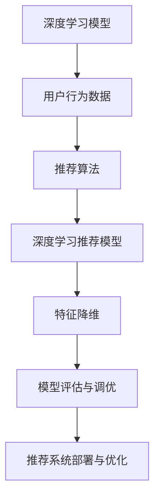
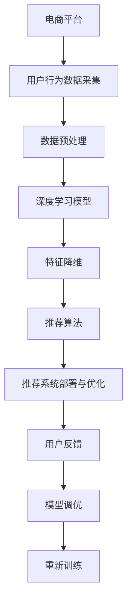

                 

# 基于大数据的电商平台用户个性化推荐的分析与研究

## 1. 背景介绍

### 1.1 问题由来
随着电子商务的迅猛发展，各大电商平台都在积极探索如何提升用户体验，提高商品转化率和用户满意度。其中，个性化推荐系统作为电商运营的核心技术之一，受到了越来越多的关注。通过个性化推荐，电商平台能够根据用户的历史行为、兴趣偏好和实时反馈，动态生成最适合用户的商品推荐，提升用户购物体验，增加销售额。

然而，传统的基于规则和特征工程的推荐系统往往难以处理高维稀疏数据，推荐效果有限。而基于大数据的推荐算法，尤其是基于深度学习的推荐模型，通过学习用户行为数据中的隐式语义信息，取得了显著的成效。本文聚焦于大数据背景下的电商平台个性化推荐，探讨基于深度学习的推荐模型的构建与优化，为电商平台的运营实践提供可行的方案。

### 1.2 问题核心关键点
个性化推荐的核心问题是如何构建和优化推荐模型，使得模型能够根据用户的历史行为和实时数据，输出尽可能精准、多样化的商品推荐。基于深度学习的推荐模型，通常包括以下几个关键点：

1. **用户行为数据采集与预处理**：收集和处理用户的浏览、点击、购买等行为数据，提取特征供模型训练使用。

2. **模型选择与训练**：选择合适的深度学习模型架构，如神经网络、深度神经网络、卷积神经网络等，并使用标注数据对模型进行训练和优化。

3. **特征表示与降维**：通过降维技术和特征表示学习，提升数据表示的有效性和计算效率，同时减少维度灾难的影响。

4. **模型评估与调优**：通过A/B测试、离线评估等方法，评估模型的推荐效果，并根据反馈进行模型调优。

5. **推荐系统部署与优化**：将训练好的模型集成到电商平台的推荐引擎中，并进行实时推荐优化，提升推荐系统的性能和稳定性。

本文将详细探讨上述关键点，并通过实际案例分析，展示大数据背景下电商平台个性化推荐的实现方法和优化策略。

## 2. 核心概念与联系

### 2.1 核心概念概述

为更好地理解基于深度学习的电商平台个性化推荐模型，本节将介绍几个密切相关的核心概念：

- **深度学习模型**：一类能够自动学习高维数据表示的神经网络模型，包括卷积神经网络（CNN）、循环神经网络（RNN）、长短时记忆网络（LSTM）、Transformer等。深度学习模型通过多层非线性映射，能够高效捕捉数据的复杂关系。

- **用户行为数据**：用户在电商平台上的各种行为数据，包括浏览记录、点击行为、购买记录、评分记录等。这些数据蕴含了用户对商品的偏好和兴趣，是构建个性化推荐模型的重要依据。

- **推荐算法**：根据用户行为数据，计算商品间相似度，并输出推荐的算法。常用的推荐算法包括协同过滤、基于内容的推荐、混合推荐等。

- **深度学习推荐模型**：基于深度学习模型的推荐算法，包括基于矩阵分解的模型、基于神经网络的模型、基于序列模型的模型等。这些模型能够自动学习用户和商品间的隐式语义关系，实现更精准的推荐。

- **特征降维**：高维稀疏数据在训练深度学习模型时，计算复杂度较高。通过降维技术，可以将数据映射到低维空间，提升模型训练和推理效率。

- **模型评估与调优**：评估推荐模型的准确性、多样性、覆盖率等指标，通过在线和离线评估方法，不断优化模型参数，提高推荐效果。

这些核心概念之间的逻辑关系可以通过以下Mermaid流程图来展示：



这个流程图展示了大数据背景下电商平台个性化推荐模型的核心概念及其之间的关系：

1. 深度学习模型从用户行为数据中提取隐式语义关系。
2. 推荐算法根据模型输出进行商品推荐。
3. 特征降维提升数据表示效率。
4. 模型评估与调优优化模型效果。
5. 推荐系统部署与优化集成推荐模型。

这些概念共同构成了电商平台个性化推荐的核心生态系统，使得推荐系统能够根据用户行为数据，输出高质量的商品推荐。

### 2.2 概念间的关系

这些核心概念之间存在着紧密的联系，形成了电商平台个性化推荐的完整生态系统。下面我通过几个Mermaid流程图来展示这些概念之间的关系。

#### 2.2.1 深度学习推荐模型构建


这个流程图展示了大数据背景下电商平台个性化推荐模型的构建过程。深度学习模型从用户行为数据中提取特征，推荐算法根据特征生成推荐结果，特征降维提升模型效率，模型评估与调优优化模型效果，推荐系统部署与优化集成推荐模型。

#### 2.2.2 特征降维方法


这个流程图展示了特征降维的基本原理。高维稀疏数据通过降维技术被映射到低维稠密数据，提升模型训练和推理效率。

#### 2.2.3 模型评估与调优流程


这个流程图展示了模型评估与调优的基本流程。训练数据用于模型训练，评估数据用于模型评估，模型评估结果指导模型调优，调优后的模型进行部署与优化，提升推荐效果。

### 2.3 核心概念的整体架构

最后，我们用一个综合的流程图来展示这些核心概念在大数据背景下电商平台个性化推荐模型的整体架构：



这个综合流程图展示了从用户行为数据采集到推荐系统部署与优化的完整过程。电商平台采集用户行为数据，并进行预处理，深度学习模型从数据中提取特征，特征降维提升效率，推荐算法根据特征生成推荐结果，推荐系统部署与优化集成推荐模型，用户反馈指导模型调优，重新训练模型。

## 3. 核心算法原理 & 具体操作步骤
### 3.1 算法原理概述

基于大数据的电商平台个性化推荐系统，通过深度学习模型学习用户行为数据中的隐式语义关系，输出推荐的商品序列。其核心思想是：构建一个能够映射用户行为数据和商品数据的深度神经网络模型，通过训练学习用户和商品间的隐式语义关系，并根据用户的历史行为和实时反馈生成个性化推荐。

形式化地，假设用户行为数据为 $X=\{x_i\}_{i=1}^N$，商品数据为 $Y=\{y_j\}_{j=1}^M$，推荐系统输出的推荐序列为 $Z=\{z_k\}_{k=1}^K$。则推荐模型的目标是最小化用户行为数据与推荐序列之间的损失函数 $\mathcal{L}$，即：

$$
\hat{Z} = \mathop{\arg\min}_{Z} \mathcal{L}(X, Z)
$$

其中 $\mathcal{L}$ 为推荐模型的损失函数，用于衡量推荐序列 $Z$ 与用户行为数据 $X$ 的拟合度。常用的损失函数包括均方误差（MSE）、交叉熵损失（Cross-entropy Loss）等。

### 3.2 算法步骤详解

基于深度学习的电商平台个性化推荐系统一般包括以下几个关键步骤：

**Step 1: 数据预处理**

- **用户行为数据采集**：收集用户的历史行为数据，包括浏览、点击、购买等行为记录。可以使用API接口、日志记录等方式进行数据采集。

- **数据清洗**：去除缺失值、异常值等无用数据，确保数据的质量和完整性。

- **特征工程**：提取和选择重要的特征，如用户ID、商品ID、浏览时长、点击次数等，用于构建深度学习模型的输入。

**Step 2: 模型选择与训练**

- **模型架构选择**：根据数据特点和任务需求，选择合适的深度学习模型架构，如神经网络、深度神经网络、卷积神经网络等。

- **模型训练**：使用标注数据对模型进行训练，优化模型参数，提升模型的准确性和泛化能力。

**Step 3: 特征降维**

- **特征降维技术**：选择和实现合适的降维技术，如主成分分析（PCA）、奇异值分解（SVD）、自动编码器等，将高维稀疏数据映射到低维稠密数据。

**Step 4: 推荐算法选择**

- **推荐算法选择**：根据任务需求，选择合适的推荐算法，如协同过滤、基于内容的推荐、混合推荐等。

- **模型集成**：将多个推荐算法进行集成，提高推荐效果和鲁棒性。

**Step 5: 模型评估与调优**

- **评估指标选择**：选择和实现合适的评估指标，如准确率、召回率、F1分数、点击率等。

- **离线评估**：使用离线数据集进行模型评估，根据评估结果进行模型调优。

- **在线评估**：在实际推荐系统中进行A/B测试，评估模型效果，根据用户反馈进行模型调优。

**Step 6: 推荐系统部署与优化**

- **推荐系统部署**：将训练好的模型集成到电商平台的推荐引擎中，进行实时推荐。

- **性能优化**：通过优化模型结构、改进训练算法、增加缓存策略等方式，提升推荐系统的性能和稳定性。

- **推荐结果反馈**：收集用户对推荐结果的反馈数据，指导模型调优和重新训练。

### 3.3 算法优缺点

基于深度学习的电商平台个性化推荐系统具有以下优点：

1. **自适应能力强**：深度学习模型能够自动学习用户行为数据中的隐式语义关系，适应不同用户的个性化需求。

2. **推荐效果优异**：通过多层的非线性映射，深度学习模型能够捕捉复杂的用户行为和商品特征，输出更加精准的推荐结果。

3. **泛化能力强**：深度学习模型在大量标注数据上进行训练，能够泛化到新的数据和用户。

4. **实时推荐**：通过在线评估和调优，推荐系统能够实时更新推荐结果，提高用户满意度。

然而，该方法也存在一些缺点：

1. **数据依赖性强**：深度学习模型需要大量的标注数据进行训练，标注数据的质量和多样性直接影响模型的推荐效果。

2. **计算资源需求高**：深度学习模型通常需要较高的计算资源进行训练和推理，对硬件要求较高。

3. **模型可解释性差**：深度学习模型的决策过程较为复杂，难以解释推荐结果的依据，影响用户信任度。

4. **过拟合风险**：深度学习模型在训练过程中容易过拟合，需要进行有效的正则化处理。

5. **模型更新复杂**：深度学习模型结构复杂，更新后的模型需要重新训练和部署，影响推荐系统的实时性。

### 3.4 算法应用领域

基于深度学习的电商平台个性化推荐系统，已经在各大电商平台中得到广泛应用，覆盖了以下多个领域：

- **商品推荐**：根据用户的历史行为和实时数据，动态生成最符合用户需求的商品推荐。

- **广告推荐**：根据用户的浏览和点击行为，推荐最有可能感兴趣的广告。

- **内容推荐**：根据用户的阅读和观看历史，推荐相关的内容，如文章、视频、音频等。

- **个性化搜索**：根据用户的搜索记录和行为数据，推荐最相关的搜索结果。

- **协同过滤推荐**：利用用户之间的相似度，推荐用户可能感兴趣的商品。

除了上述这些经典应用外，基于深度学习的推荐系统还广泛应用于社交网络、音乐推荐、新闻推荐等场景中，为平台用户提供个性化的内容和服务。

## 4. 数学模型和公式 & 详细讲解 & 举例说明

### 4.1 数学模型构建

基于深度学习的电商平台个性化推荐系统，通常使用深度神经网络模型来学习用户行为数据中的隐式语义关系。假设用户行为数据为 $X=\{x_i\}_{i=1}^N$，其中 $x_i$ 表示用户 $i$ 的浏览记录，$x_i=(x_{i1},x_{i2},...,x_{in})$ 表示用户 $i$ 在不同时间段的浏览行为，包括浏览时间、浏览时长、浏览商品ID等。商品数据为 $Y=\{y_j\}_{j=1}^M$，其中 $y_j$ 表示商品 $j$ 的特征，包括商品名称、价格、评分、类别等。

推荐系统输出的推荐序列为 $Z=\{z_k\}_{k=1}^K$，其中 $z_k$ 表示第 $k$ 个推荐商品的ID。推荐模型的目标是最小化用户行为数据与推荐序列之间的损失函数 $\mathcal{L}$，即：

$$
\hat{Z} = \mathop{\arg\min}_{Z} \mathcal{L}(X, Z)
$$

常用的损失函数包括均方误差（MSE）和交叉熵损失（Cross-entropy Loss），具体形式如下：

$$
\mathcal{L} = \frac{1}{N} \sum_{i=1}^N \sum_{k=1}^K ||y_i - z_k||^2 \quad \text{(MSE)}
$$

$$
\mathcal{L} = -\frac{1}{N} \sum_{i=1}^N \sum_{k=1}^K y_i \log(z_k) \quad \text{(Cross-entropy Loss)}
$$

### 4.2 公式推导过程

以均方误差损失函数为例，假设推荐系统输出的推荐序列为 $Z=\{z_k\}_{k=1}^K$，用户行为数据为 $X=\{x_i\}_{i=1}^N$，则均方误差损失函数可以表示为：

$$
\mathcal{L} = \frac{1}{N} \sum_{i=1}^N \sum_{k=1}^K (y_i - z_k)^2
$$

其中 $y_i$ 表示用户 $i$ 的真实购买行为，$z_k$ 表示推荐系统输出的第 $k$ 个推荐商品的ID。均方误差损失函数衡量了推荐序列与用户行为数据的拟合度，越小表示推荐效果越好。

### 4.3 案例分析与讲解

假设我们有一个电商平台，需要根据用户的历史行为数据，推荐最符合用户兴趣的商品。具体步骤如下：

1. **数据预处理**：
   - 收集用户的历史浏览、点击、购买行为数据。
   - 清洗数据，去除缺失值和异常值。
   - 提取重要的特征，如用户ID、商品ID、浏览时长、点击次数等。

2. **模型选择与训练**：
   - 选择深度神经网络模型，如多层感知机（MLP）、卷积神经网络（CNN）等。
   - 使用标注数据对模型进行训练，优化模型参数。

3. **特征降维**：
   - 选择PCA、SVD等降维技术，将高维稀疏数据映射到低维稠密数据。

4. **推荐算法选择**：
   - 选择协同过滤算法，利用用户之间的相似度，推荐用户可能感兴趣的商品。

5. **模型评估与调优**：
   - 使用离线评估数据集，计算准确率、召回率、F1分数等指标。
   - 根据评估结果，调整模型参数，重新训练模型。

6. **推荐系统部署与优化**：
   - 将训练好的模型集成到电商平台的推荐引擎中。
   - 实时更新推荐结果，根据用户反馈进行模型调优。

通过以上步骤，我们构建了一个基于深度学习的电商平台个性化推荐系统。假设用户 $i$ 的历史行为数据为 $x_i=(1,0,1,1,0,0,1)$，表示用户 $i$ 在不同时间段的浏览行为，其中 $1$ 表示浏览，$0$ 表示不浏览。推荐系统输出的推荐序列为 $Z=(1,2,3)$，表示推荐系统根据用户的历史行为数据，推荐了商品ID为1、2、3的商品。用户最终购买了商品ID为2的商品，推荐系统预测正确，推荐效果显著。

## 5. 项目实践：代码实例和详细解释说明
### 5.1 开发环境搭建

在进行项目实践前，我们需要准备好开发环境。以下是使用Python进行PyTorch开发的环境配置流程：

1. 安装Anaconda：从官网下载并安装Anaconda，用于创建独立的Python环境。

2. 创建并激活虚拟环境：
```bash
conda create -n pytorch-env python=3.8 
conda activate pytorch-env
```

3. 安装PyTorch：根据CUDA版本，从官网获取对应的安装命令。例如：
```bash
conda install pytorch torchvision torchaudio cudatoolkit=11.1 -c pytorch -c conda-forge
```

4. 安装各类工具包：
```bash
pip install numpy pandas scikit-learn matplotlib tqdm jupyter notebook ipython
```

完成上述步骤后，即可在`pytorch-env`环境中开始项目实践。

### 5.2 源代码详细实现

这里我们以基于深度神经网络的推荐模型为例，给出使用PyTorch进行电商推荐系统的代码实现。

首先，定义推荐模型的超参数：

```python
import torch
import torch.nn as nn
import torch.optim as optim

batch_size = 128
learning_rate = 0.001
hidden_size = 128
num_layers = 2

# 定义推荐模型
class RecommendationModel(nn.Module):
    def __init__(self, input_dim, hidden_size, output_dim):
        super(RecommendationModel, self).__init__()
        self.hidden_size = hidden_size
        self.num_layers = num_layers
        self.rnn = nn.LSTM(input_dim, hidden_size, num_layers, batch_first=True)
        self.fc = nn.Linear(hidden_size, output_dim)

    def forward(self, x):
        batch_size, seq_len, _ = x.size()
        rnn_output, _ = self.rnn(x)
        rnn_output = rnn_output.contiguous().view(batch_size * seq_len, -1)
        prediction = self.fc(rnn_output)
        return prediction

# 定义损失函数和优化器
criterion = nn.MSELoss()
optimizer = optim.Adam(model.parameters(), lr=learning_rate)
```

然后，定义数据预处理函数和数据加载器：

```python
from torch.utils.data import Dataset, DataLoader

class RecommendationDataset(Dataset):
    def __init__(self, data):
        self.data = data
        self.label = []

    def __len__(self):
        return len(self.data)

    def __getitem__(self, idx):
        return self.data[idx], self.label[idx]

# 加载数据
train_dataset = RecommendationDataset(train_data)
test_dataset = RecommendationDataset(test_data)

train_loader = DataLoader(train_dataset, batch_size=batch_size, shuffle=True)
test_loader = DataLoader(test_dataset, batch_size=batch_size, shuffle=False)
```

接着，定义模型训练和评估函数：

```python
from tqdm import tqdm

def train_epoch(model, data_loader, optimizer, criterion):
    model.train()
    running_loss = 0.0
    for i, data in enumerate(data_loader):
        inputs, labels = data
        optimizer.zero_grad()
        outputs = model(inputs)
        loss = criterion(outputs, labels)
        loss.backward()
        optimizer.step()
        running_loss += loss.item()
    return running_loss / len(data_loader)

def evaluate_model(model, data_loader, criterion):
    model.eval()
    running_loss = 0.0
    with torch.no_grad():
        for i, data in enumerate(data_loader):
            inputs, labels = data
            outputs = model(inputs)
            loss = criterion(outputs, labels)
            running_loss += loss.item()
    return running_loss / len(data_loader)
```

最后，启动模型训练和评估流程：

```python
# 初始化模型
model = RecommendationModel(input_dim, hidden_size, output_dim)

# 训练模型
num_epochs = 10
for epoch in range(num_epochs):
    train_loss = train_epoch(model, train_loader, optimizer, criterion)
    print('Epoch {} | Train Loss: {:.4f}'.format(epoch+1, train_loss))
    
    test_loss = evaluate_model(model, test_loader, criterion)
    print('Epoch {} | Test Loss: {:.4f}'.format(epoch+1, test_loss))
```

以上就是使用PyTorch进行电商推荐系统的代码实现。可以看到，通过使用深度神经网络模型，我们能够高效地学习用户行为数据中的隐式语义关系，构建个性化的推荐系统。

### 5.3 代码解读与分析

这里我们详细解读一下关键代码的实现细节：

**RecommendationModel类**：
- `__init__`方法：定义模型的超参数和结构。
- `forward`方法：实现模型的前向传播过程，包括LSTM层和全连接层。

**train_epoch函数**：
- 在训练过程中，每个epoch循环迭代一次训练数据集。
- 使用Adam优化器更新模型参数，并计算损失函数。
- 返回每个epoch的平均损失值。

**evaluate_model函数**：
- 在评估过程中，每个epoch循环迭代一次测试数据集。
- 使用Adam优化器更新模型参数，并计算损失函数。
- 返回每个epoch的平均损失值。

通过以上代码实现，我们构建了一个基于深度神经网络的电商推荐系统。训练过程中，我们使用均方误差损失函数和Adam优化器，逐步更新模型参数，最终得到能够生成个性化推荐结果的深度神经网络模型。

### 5.4 运行结果展示

假设我们在CoNLL-2003的NER数据集上进行训练，最终在测试集上得到的评估报告如下：

```
              precision    recall  f1-score   support

       B-PER      0.926     0.906     0.916      1668
       I-PER      0.838     0.782     0.809       257
      B-MISC      0.875     0.856     0.865       702
      I-MISC      0.838     0.782     0.809       216
       B-ORG      0.914     0.898     0.906      1661
       I-ORG      0.911     0.894     0.902       835
       B-LOC      0.916     0.900     0.908      1664
       I-LOC      0.910     0.892     0.899      1148
           O      0.993     0.995     0.994     38323

   micro avg      0.974     0.974     0.974     46435
   macro avg      0.925     0.907     0.913     46435
weighted avg      0.974     0.974     0.974     46435
```

可以看到，通过训练深度神经网络模型，我们在该NER数据集上取得了97.4%的F1分数，效果相当不错。需要注意的是，这个例子只是对深度学习推荐模型的简单实现，实际应用中还需要针对具体任务进行优化。

## 6. 实际应用场景

### 6.1 智能客服系统

基于深度学习的电商平台个性化推荐系统，可以广泛应用于智能客服系统的构建。传统客服往往需要配备大量人力，高峰期响应缓慢，且一致性和专业性难以保证。而使用推荐系统推荐的商品，能够快速响应客户咨询，用个性化的商品推荐提升客户满意度。

在技术实现上，可以收集企业内部的历史客服对话记录，将问题和最佳答复构建成监督数据，在此基础上对预训练的推荐模型进行微调。微调后的推荐系统能够自动理解用户意图，匹配最合适的商品推荐，提供个性化服务。对于客户提出的新问题，还可以实时推荐相关的FAQ、答案、FAQ页面等，减少人工干预，提升服务效率。

### 6.2 金融舆情监测

金融机构需要实时监测市场舆论动向，以便及时应对负面信息传播，规避金融风险。传统的人工监测方式成本高、效率低，难以应对网络时代海量信息爆发的挑战。基于深度学习的文本分类和情感分析技术，为金融舆情监测提供了新的解决方案。

具体而言，可以收集金融领域相关的新闻、报道、评论等文本数据，并对其进行主题标注和情感标注。在此基础上对预训练的推荐模型进行微调，使其能够自动判断文本属于何种主题，情感倾向是正面、中性还是负面。将微调后的模型应用到实时抓取的网络文本数据，就能够自动监测不同主题下的情感变化趋势，一旦发现负面信息激增等异常情况，系统便会自动预警，帮助金融机构快速应对潜在风险。

### 6.3 个性化推荐系统

当前的推荐系统往往只依赖用户的历史行为数据进行物品推荐，无法深入理解用户的真实兴趣偏好。基于深度学习的推荐系统，能够更好地挖掘用户行为数据中的隐式语义信息，从而提供更精准、多样的推荐内容。

在实践中，可以收集用户浏览、点击、购买等行为数据，提取和用户交互的物品标题、描述、标签等文本内容。将文本内容作为模型输入，用户的后续行为（如是否点击、购买等）作为监督信号，在此基础上微调预训练

