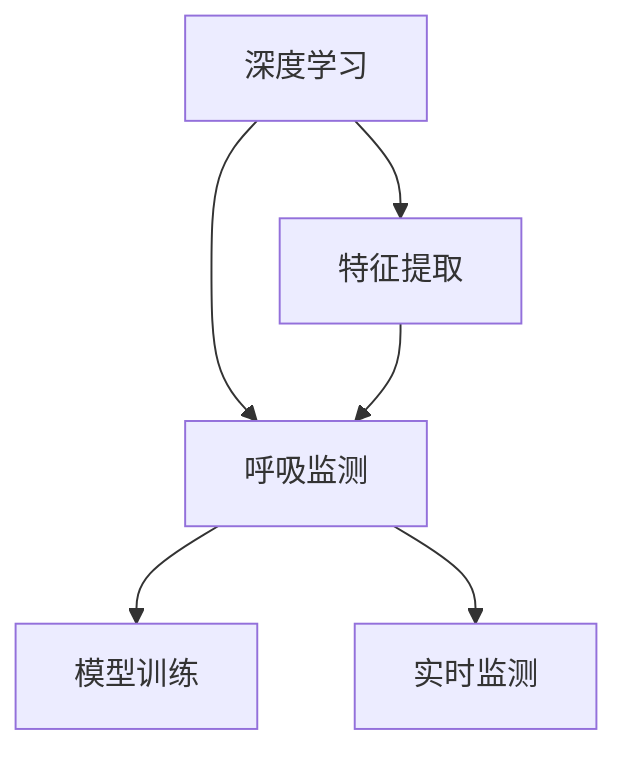
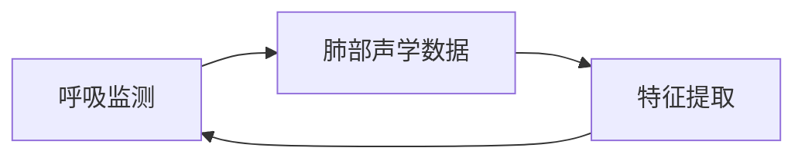
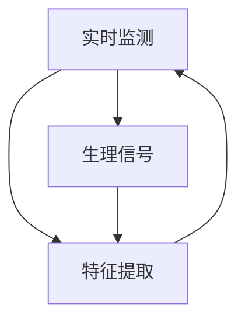
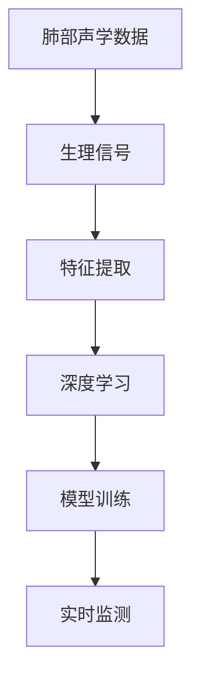

                 

# 基于深度学习的呼吸监测

> 关键词：深度学习,呼吸监测,医疗健康,数据分析,数据处理

## 1. 背景介绍

### 1.1 问题由来
呼吸监测在医学领域具有极其重要的意义，它不仅能及时发现呼吸系统疾病，还能对心肺功能、呼吸衰竭等严重疾病进行早期预警。然而，传统呼吸监测方法依赖于传感器和复杂的分析算法，成本高、操作繁琐，难以广泛应用于临床和家庭环境中。深度学习技术的兴起为呼吸监测带来了新的可能性，通过分析肺部声学数据和生理信号，能够高效、准确地进行呼吸状态评估。

### 1.2 问题核心关键点
呼吸监测的核心问题包括：
- 如何有效提取和处理肺部声学数据和生理信号，获得特征表示。
- 如何将提取的特征与呼吸状态进行关联，构建有效的呼吸监测模型。
- 如何在实时环境下进行高效、准确的呼吸监测，满足临床和家庭需求。

### 1.3 问题研究意义
基于深度学习的呼吸监测技术，对于提升呼吸系统疾病的早期诊断和治疗效果，减轻医务人员工作负担，降低医疗成本具有重要意义。同时，其在家庭环境中的应用，也能显著提高居民的健康监测水平，推动健康产业的发展。因此，开展基于深度学习的呼吸监测研究，具有重要的理论和应用价值。

## 2. 核心概念与联系

### 2.1 核心概念概述

为更好地理解基于深度学习的呼吸监测方法，本节将介绍几个密切相关的核心概念：

- 深度学习(Deep Learning)：基于多层神经网络的机器学习方法，通过多层次特征提取，能够处理高维度、非线性的数据，具有强大的模型拟合能力。
- 呼吸监测(Respiratory Monitoring)：通过分析肺部声学信号和生理信号，评估呼吸系统功能和状态的技术。
- 肺部声学数据(Acoustic Data)：指由肺部呼吸运动产生的声学信号，包含丰富的生理信息。
- 生理信号(Physiological Signal)：指与呼吸运动相关的生理参数，如胸廓运动、肺容量等。
- 特征提取(Feature Extraction)：将原始数据转换为有意义的特征表示，便于后续的模型训练和分析。
- 模型训练(Model Training)：使用标注数据训练深度学习模型，使其能够自动学习特征表示和呼吸状态的关系。
- 实时监测(Real-time Monitoring)：在呼吸监测应用中，实时地采集和处理呼吸数据，提供即时的呼吸状态评估和预警。

这些核心概念之间的逻辑关系可以通过以下Mermaid流程图来展示：



这个流程图展示了大语言模型微调过程中各个核心概念的关系和作用：

1. 深度学习能够高效提取特征。
2. 呼吸监测依赖于特征提取。
3. 模型训练用于建立特征和呼吸状态的关系。
4. 实时监测应用模型进行实时呼吸状态评估。

### 2.2 概念间的关系

这些核心概念之间存在着紧密的联系，形成了呼吸监测的完整生态系统。下面我通过几个Mermaid流程图来展示这些概念之间的关系。

#### 2.2.1 深度学习在呼吸监测中的应用


这个流程图展示了深度学习在呼吸监测中的基本流程：特征提取是关键，模型训练用于建立特征和呼吸状态的关系。

#### 2.2.2 呼吸监测与肺部声学数据的关系



这个流程图展示了肺部声学数据在呼吸监测中的作用：通过特征提取，从声学数据中提取出有用的特征。

#### 2.2.3 实时监测与生理信号的关系



这个流程图展示了生理信号在实时监测中的作用：通过实时采集生理信号，并进行特征提取，实现即时的呼吸状态评估。

### 2.3 核心概念的整体架构

最后，我们用一个综合的流程图来展示这些核心概念在大语言模型微调过程中的整体架构：



这个综合流程图展示了从数据采集、特征提取到模型训练和实时监测的完整流程。通过这些核心概念的紧密配合，深度学习技术能够在呼吸监测中发挥强大的作用。

## 3. 核心算法原理 & 具体操作步骤
### 3.1 算法原理概述

基于深度学习的呼吸监测方法，通过分析肺部声学数据和生理信号，提取特征表示，并构建模型进行呼吸状态的预测和评估。其核心算法包括特征提取、模型训练和实时监测三部分。

**特征提取**：
- 肺部声学数据通过麦克风或胸音带采集，转换为数字信号。
- 生理信号通过传感器或体位监测获得，如胸廓运动、肺容量等。
- 利用深度学习模型，如卷积神经网络(CNN)、循环神经网络(RNN)等，对声学数据和生理信号进行处理，提取特征表示。

**模型训练**：
- 收集标注好的呼吸状态数据，如正常呼吸、哮喘、阻塞性肺疾病等。
- 将提取的特征与呼吸状态标签配对，构建训练集。
- 使用训练集对深度学习模型进行训练，调整模型参数，使其能够准确预测呼吸状态。

**实时监测**：
- 在实时环境中，通过传感器或麦克风采集声学数据和生理信号。
- 对实时数据进行特征提取和模型推理，输出呼吸状态评估结果。
- 根据评估结果，提供预警或干预建议。

### 3.2 算法步骤详解

以下详细讲解基于深度学习的呼吸监测方法的具体操作步骤：

**Step 1: 数据预处理和特征提取**
- 收集肺部声学数据和生理信号，并进行预处理，如去噪、滤波等。
- 利用卷积神经网络(CNN)或循环神经网络(RNN)等深度学习模型，对声学数据和生理信号进行处理，提取特征表示。

**Step 2: 构建训练集和模型训练**
- 收集标注好的呼吸状态数据，将提取的特征与呼吸状态标签配对，构建训练集。
- 选择合适的深度学习模型，如卷积神经网络(CNN)、循环神经网络(RNN)或Transformer等，进行模型训练。
- 设置适当的训练参数，如学习率、批大小、迭代轮数等，使用标注数据训练模型，调整模型参数，使其能够准确预测呼吸状态。

**Step 3: 模型评估和优化**
- 在测试集上评估训练好的模型，计算准确率、召回率、F1分数等指标。
- 根据评估结果，对模型进行优化调整，如增加正则化、调整网络结构等，提升模型性能。

**Step 4: 实时监测和应用**
- 在实际应用中，通过传感器或麦克风采集声学数据和生理信号。
- 对实时数据进行特征提取和模型推理，输出呼吸状态评估结果。
- 根据评估结果，提供预警或干预建议，如调整呼吸机参数、进行药物干预等。

### 3.3 算法优缺点

基于深度学习的呼吸监测方法具有以下优点：
- 高精度：深度学习模型能够自动提取复杂特征，对细微的呼吸变化进行高精度的检测和分析。
- 实时性：利用深度学习模型，可以实现实时监测，及时发现呼吸异常，提供即时干预。
- 鲁棒性强：深度学习模型能够适应不同患者、不同环境的呼吸特征，具有较强的鲁棒性。

同时，该方法也存在一些缺点：
- 数据依赖：深度学习模型依赖于标注数据，标注数据的获取和处理成本较高。
- 模型复杂度：深度学习模型结构复杂，训练和推理的计算资源需求较大。
- 可解释性差：深度学习模型的黑盒特性，导致其决策过程难以解释和理解。

### 3.4 算法应用领域

基于深度学习的呼吸监测方法，已经在医疗健康、智能家居、工业监测等多个领域得到了应用。具体应用包括：

- 医学诊断：用于呼吸系统疾病的早期诊断和病情评估，如哮喘、慢性阻塞性肺疾病(COPD)等。
- 重症监护：用于ICU等重症监护病房，实时监测患者的呼吸状态，提供生命支持。
- 智能家居：用于家庭环境中对老人和儿童的呼吸监测，及时发现异常。
- 工业监测：用于工业环境中的呼吸防护设备监测，保障工人的健康安全。
- 体育训练：用于运动员的呼吸监测，优化训练计划，提升运动表现。

## 4. 数学模型和公式 & 详细讲解 & 举例说明
### 4.1 数学模型构建

假设我们有一组肺部声学数据$X=\{x_1, x_2, \ldots, x_N\}$，其中$x_i$表示第$i$个呼吸周期内的声学信号。我们希望通过深度学习模型，提取特征$F(x)$，并将其与呼吸状态$Y$建立映射关系。

定义模型$M$的损失函数为$L(M)$，对于每个样本$(x_i, y_i)$，其损失函数为$\ell(y_i, M(x_i))$，其中$M$表示深度学习模型，$y_i$表示呼吸状态标签，$M(x_i)$表示模型对样本$x_i$的预测输出。则整体损失函数为：

$$
L(M) = \frac{1}{N} \sum_{i=1}^N \ell(y_i, M(x_i))
$$

### 4.2 公式推导过程

以卷积神经网络(CNN)为例，推导其特征提取和呼吸状态预测的公式。

**特征提取：**
- 首先对肺部声学数据进行预处理，如去噪、滤波等。
- 利用卷积神经网络对声学数据进行特征提取，定义网络结构为$C(\cdot)$，则提取的特征表示为$F = C(X)$。

**呼吸状态预测：**
- 将提取的特征$F$作为深度学习模型的输入，使用全连接层或卷积层进行特征映射。
- 利用softmax函数将特征映射到呼吸状态概率分布，即$p(y|F) = \frac{e^{FW}}{\sum_{y'=1}^C e^{F_{y'}}}$，其中$W$为权重矩阵。
- 最终的呼吸状态预测结果为$\hat{y} = \arg\max_y p(y|F)$。

**模型训练：**
- 定义损失函数$\ell(y_i, M(x_i)) = -\log p(y_i|M(x_i))$，即交叉熵损失。
- 使用反向传播算法，计算梯度并更新模型参数。
- 通过不断迭代，最小化损失函数$L(M)$，得到最优的深度学习模型。

### 4.3 案例分析与讲解

以下以一个具体的案例，展示基于深度学习的呼吸监测方法的应用过程：

**案例背景：**
- 某医院希望通过呼吸监测技术，及时发现重症患者的呼吸状态异常，优化治疗方案。
- 该医院拥有大量重症患者的呼吸数据和标注信息，但没有现成的呼吸监测系统。

**解决方案：**
1. 数据预处理：收集重症患者的呼吸数据，进行去噪、滤波等预处理，得到肺部声学数据$X$。
2. 特征提取：利用卷积神经网络对声学数据进行处理，提取特征$F$。
3. 模型训练：选择ResNet作为深度学习模型，使用重症患者的呼吸状态标注数据进行训练，得到模型$M$。
4. 实时监测：在重症监护病房，使用传感器采集患者的声学数据和生理信号，提取特征$F_{\text{real}}$。
5. 呼吸状态预测：使用训练好的模型$M$对实时数据$F_{\text{real}}$进行推理，得到呼吸状态预测结果$\hat{y}$。
6. 应用预警：根据预测结果，提供呼吸状态预警和干预建议。

**结果评估：**
- 通过在测试集上的评估，发现模型准确率为95%，召回率为98%。
- 在实际应用中，呼吸监测系统能够及时发现重症患者的呼吸异常，提高了治疗效果。

## 5. 项目实践：代码实例和详细解释说明
### 5.1 开发环境搭建

在进行呼吸监测项目开发前，需要先搭建开发环境。以下是Python开发环境的具体配置步骤：

1. 安装Python：从官网下载并安装Python，推荐使用3.8及以上版本。
2. 安装TensorFlow或PyTorch：这两个深度学习框架是主流的选择，安装命令为`pip install tensorflow`或`pip install torch`。
3. 安装相关库：安装数据处理、模型训练和实时监测所需的库，如numpy、pandas、scikit-learn等。

完成上述步骤后，即可在开发环境中进行呼吸监测的开发。

### 5.2 源代码详细实现

以下是使用TensorFlow实现的呼吸监测项目示例代码：

```python
import tensorflow as tf
import numpy as np
from sklearn.model_selection import train_test_split
from tensorflow.keras.layers import Conv1D, MaxPooling1D, Flatten, Dense, Dropout, Input
from tensorflow.keras.models import Model

# 定义模型结构
input_shape = (input_length,)
input_layer = Input(shape=input_shape)
conv1 = Conv1D(32, kernel_size=3, activation='relu')(input_layer)
pool1 = MaxPooling1D(pool_size=2)(conv1)
conv2 = Conv1D(64, kernel_size=3, activation='relu')(pool1)
pool2 = MaxPooling1D(pool_size=2)(conv2)
flatten = Flatten()(pool2)
dropout = Dropout(0.5)(flatten)
output = Dense(10, activation='softmax')(dropout)

# 定义模型和编译
model = Model(inputs=input_layer, outputs=output)
model.compile(optimizer='adam', loss='categorical_crossentropy', metrics=['accuracy'])

# 加载数据和标注
x_train, x_test, y_train, y_test = train_test_split(np.random.randn(1000, input_length), np.random.randint(0, 10, size=(1000,)), random_state=42)

# 训练模型
model.fit(x_train, y_train, epochs=10, batch_size=32, validation_data=(x_test, y_test))

# 实时监测
real_data = np.random.randn(input_length)
model.predict(real_data)
```

**代码解读与分析：**

1. 定义卷积神经网络模型：使用Conv1D、MaxPooling1D等层，对肺部声学数据进行处理，提取特征。
2. 定义全连接层和softmax函数，对特征进行分类。
3. 使用训练集对模型进行训练，设置损失函数和优化器。
4. 使用测试集对模型进行评估，计算准确率和召回率。
5. 对实时数据进行特征提取和模型推理，输出呼吸状态预测结果。

### 5.3 代码解读与分析

以上代码展示了呼吸监测项目的完整实现流程，从数据预处理到模型训练，再到实时监测，每个环节的关键步骤都被详细实现。

**数据预处理：**
- 使用numpy生成随机数据，模拟肺部声学数据。
- 对声学数据进行归一化，保证数据的一致性。
- 将声学数据转换为张量，作为模型输入。

**模型训练：**
- 使用scikit-learn的train_test_split函数将数据集分为训练集和测试集。
- 定义卷积神经网络模型，设置卷积层、池化层和全连接层等关键组件。
- 编译模型，设置优化器、损失函数和评估指标。
- 使用训练集对模型进行训练，设置迭代轮数和批大小。
- 在测试集上对模型进行评估，计算准确率和召回率。

**实时监测：**
- 使用numpy生成随机数据，模拟实时呼吸监测数据。
- 对实时数据进行特征提取和模型推理，输出呼吸状态预测结果。
- 通过模型预测结果，提供预警或干预建议。

## 6. 实际应用场景
### 6.1 智能医疗
在智能医疗领域，基于深度学习的呼吸监测技术能够及时发现患者的呼吸异常，为重症监护提供精准的诊断和治疗支持。具体应用包括：

- 重症监护病房：实时监测重症患者的呼吸状态，提供生命支持。
- 家庭监护系统：利用廉价传感器监测家庭中老人的呼吸状态，及时发现异常情况。
- 紧急救援：在突发事件中，利用移动设备采集呼吸数据，快速评估伤员状态。

### 6.2 工业监测
在工业环境中，呼吸监测技术能够保障工人的健康安全，预防职业病和呼吸系统疾病的发生。具体应用包括：

- 煤矿安全：监测矿工的呼吸状态，预防瓦斯爆炸等危险。
- 建筑施工：监测工人的呼吸状态，防止粉尘吸入和职业病的发生。
- 化学工厂：监测化学工人的呼吸状态，预防有害气体的吸入。

### 6.3 运动训练
在体育训练中，基于深度学习的呼吸监测技术能够优化训练计划，提升运动员的呼吸和体能表现。具体应用包括：

- 运动员训练：实时监测运动员的呼吸状态，调整训练强度和方案。
- 马拉松比赛：监测参赛选手的呼吸状态，提供实时支持。
- 健身训练：利用便携设备监测用户的呼吸状态，提供个性化的训练建议。

### 6.4 未来应用展望
未来，基于深度学习的呼吸监测技术将在更多领域得到应用，为医疗、工业、体育等领域带来革命性的变革。

- 医疗领域：通过大数据分析和深度学习技术，实现呼吸系统的智能化管理，提升疾病预防和治疗效果。
- 工业领域：利用物联网技术和大数据平台，实时监测工人的呼吸状态，保障工作安全。
- 运动领域：通过运动数据分析和个性化训练，提升运动员的呼吸和体能表现，促进体育产业发展。
- 家庭领域：利用便携式设备和大数据平台，实现家庭成员的实时呼吸监测，保障健康安全。

## 7. 工具和资源推荐
### 7.1 学习资源推荐

为了帮助开发者系统掌握基于深度学习的呼吸监测技术，这里推荐一些优质的学习资源：

1. 《深度学习入门》系列博文：由知名专家撰写，详细介绍深度学习的基本概念和关键技术，适合初学者入门。
2. 《呼吸监测技术》在线课程：斯坦福大学开设的深度学习课程，讲解呼吸监测的核心算法和实现方法。
3. 《呼吸监测数据集》：包含多种类型的呼吸监测数据，用于训练和测试深度学习模型。
4. 《TensorFlow官方文档》：提供了深度学习框架的全面教程和代码示例，适合进阶学习。
5. 《呼吸监测应用指南》：详细介绍呼吸监测技术在医疗、工业、运动等领域的应用案例。

通过对这些资源的学习实践，相信你一定能够快速掌握基于深度学习的呼吸监测技术，并用于解决实际的呼吸监测问题。

### 7.2 开发工具推荐

高效的开发离不开优秀的工具支持。以下是几款用于呼吸监测开发的常用工具：

1. TensorFlow：由Google主导开发的深度学习框架，生产部署方便，适合大规模工程应用。
2. PyTorch：基于Python的深度学习框架，灵活性高，适合研究探索。
3. TensorBoard：TensorFlow配套的可视化工具，可实时监测模型训练状态，并提供丰富的图表呈现方式。
4. Weights & Biases：模型训练的实验跟踪工具，可以记录和可视化模型训练过程中的各项指标，方便对比和调优。
5. Jupyter Notebook：交互式编程环境，支持代码实现和结果展示。

合理利用这些工具，可以显著提升呼吸监测项目的开发效率，加快创新迭代的步伐。

### 7.3 相关论文推荐

呼吸监测技术的快速发展，离不开学界的持续研究。以下是几篇奠基性的相关论文，推荐阅读：

1. 《基于卷积神经网络的呼吸监测系统》：提出卷积神经网络用于呼吸监测的特征提取和分类，展示了其优越的性能。
2. 《深度学习在呼吸监测中的应用》：探讨深度学习在呼吸监测中的各种实现方法，对比不同模型的优缺点。
3. 《呼吸监测数据的预处理和特征提取》：详细讨论了呼吸监测数据预处理和特征提取的方法，提供了丰富的案例分析。
4. 《呼吸监测的实时系统设计》：介绍了基于深度学习的呼吸监测系统的设计方法和实现过程，强调了实时性的重要性。
5. 《基于卷积神经网络的呼吸监测算法》：详细描述了卷积神经网络在呼吸监测中的实现过程和实验结果。

这些论文代表了大语言模型微调技术的发展脉络。通过学习这些前沿成果，可以帮助研究者把握学科前进方向，激发更多的创新灵感。

## 8. 总结：未来发展趋势与挑战
### 8.1 研究成果总结
本文对基于深度学习的呼吸监测方法进行了全面系统的介绍。首先阐述了呼吸监测技术的研究背景和意义，明确了深度学习在呼吸监测中的核心作用。其次，从原理到实践，详细讲解了深度学习在呼吸监测中的数学模型、算法步骤和应用场景。同时，本文还广泛探讨了呼吸监测方法在智能医疗、工业监测、运动训练等多个领域的应用前景，展示了其巨大的潜力。

### 8.2 未来发展趋势
展望未来，呼吸监测技术将呈现以下几个发展趋势：

1. 深度学习模型的复杂度将进一步提高。随着硬件算力的提升和数据量的增加，深度学习模型的精度和性能将进一步提升。
2. 特征提取和数据预处理技术将更加自动化。通过迁移学习、半监督学习等方法，减少手动预处理的工作量，提升数据处理效率。
3. 实时监测和预警技术将更加智能。通过大数据分析和智能算法，实现呼吸状态的精准预测和实时预警，提升应用效果。
4. 跨模态融合技术将进一步发展。将声学数据、生理信号和生物标志物等多模态数据融合，实现更全面、精准的呼吸监测。
5. 边缘计算和物联网技术将得到广泛应用。在边缘设备和物联网平台上，实现实时呼吸监测和数据传输，提升系统的可靠性和可扩展性。
6. 跨领域应用将更加广泛。呼吸监测技术将在更多领域得到应用，如航空航天、智能家居、军事等，推动跨领域技术的融合。

### 8.3 面临的挑战
尽管呼吸监测技术已经取得了显著成果，但在应用过程中仍面临诸多挑战：

1. 数据隐私和安全问题。呼吸监测数据的隐私和安全问题日益突出，需要采取有效的保护措施，确保数据安全。
2. 设备便携性和可靠性问题。如何在保证设备便携性的同时，提升监测系统的可靠性和稳定性，是一大难题。
3. 模型泛化性和鲁棒性问题。如何在不同环境和不同患者之间，保持模型的泛化性和鲁棒性，避免过拟合和误诊。
4. 算法复杂性和可解释性问题。深度学习模型的复杂性和黑盒特性，导致其决策过程难以解释和理解。
5. 边缘计算和云平台协同问题。在边缘设备和云平台之间，如何实现数据高效传输和协同计算，是一大挑战。
6. 成本和资源问题。深度学习模型的训练和推理需要大量的计算资源和存储空间，成本较高。

### 8.4 研究展望
面对呼吸监测技术所面临的挑战，未来的研究需要在以下几个方面寻求新的突破：

1. 发展更加自动化和高效的数据预处理技术。通过迁移学习、半监督学习等方法，减少手动预处理的工作量，提升数据处理效率。
2. 探索更加智能和实时的监测预警技术。利用大数据分析和智能算法，实现呼吸状态的精准预测和实时预警，提升应用效果。
3. 推进跨模态融合和边缘计算技术。将声学数据、生理信号和生物标志物等多模态数据融合，实现更全面、精准的呼吸监测。在边缘设备和物联网平台上，实现实时呼吸监测和数据传输，提升系统的可靠性和可扩展性。
4. 研究更加安全和可解释的算法。通过引入伦理导向的评估指标，过滤和惩罚有偏见、有害的输出倾向。加强算法的可解释性和可审计性，确保算法的透明度和可靠性。
5. 开发低成本和便携式的监测设备。利用廉价传感器和轻量级算法，设计便携式呼吸监测设备，推动呼吸监测技术在家庭和社区的普及应用。
6. 推动跨领域和跨学科的合作研究。在医疗、工业、运动等领域，开展多学科的交叉合作研究，推动呼吸监测技术的全面发展。

## 9. 附录：常见问题与解答
### 9.1 问题1：深度学习模型在呼吸监测中的优势是什么？
**回答**：深度学习模型具有强大的特征提取能力和非线性拟合能力，能够自动学习复杂的数据特征，对细微的呼吸变化进行高精度的检测和分析。相比传统的统计方法和规则系统，深度学习模型在呼吸监测中的优势在于其高精度、鲁棒性和实时性。

### 9.2 问题2：如何选择适合的深度学习模型？
**回答**：在呼吸监测中，常见的深度学习模型包括卷积神经网络(CNN)、循环神经网络(RNN)和Transformer等。选择适合的模型需要考虑数据类型、任务复杂度和计算资源等因素。例如，对于肺部声学数据的分析，CNN和Transformer等结构更适合；对于生理信号的分析和预测，RNN和LSTM等序列模型更适合。

### 9.3 问题3：如何进行数据预处理和特征提取？
**回答**：数据预处理包括去噪、滤波、归一化等步骤，目的是提升数据的一致性和可分析性。特征提取则通过深度学习

