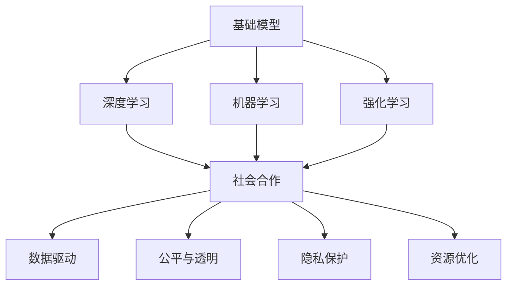
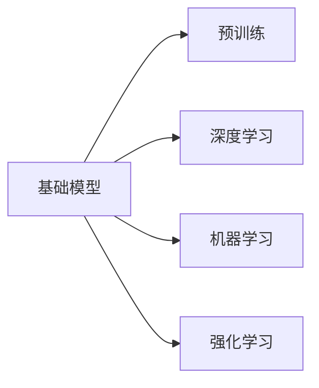
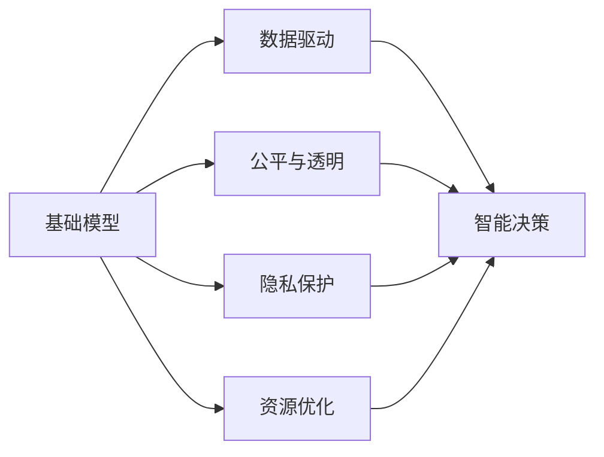
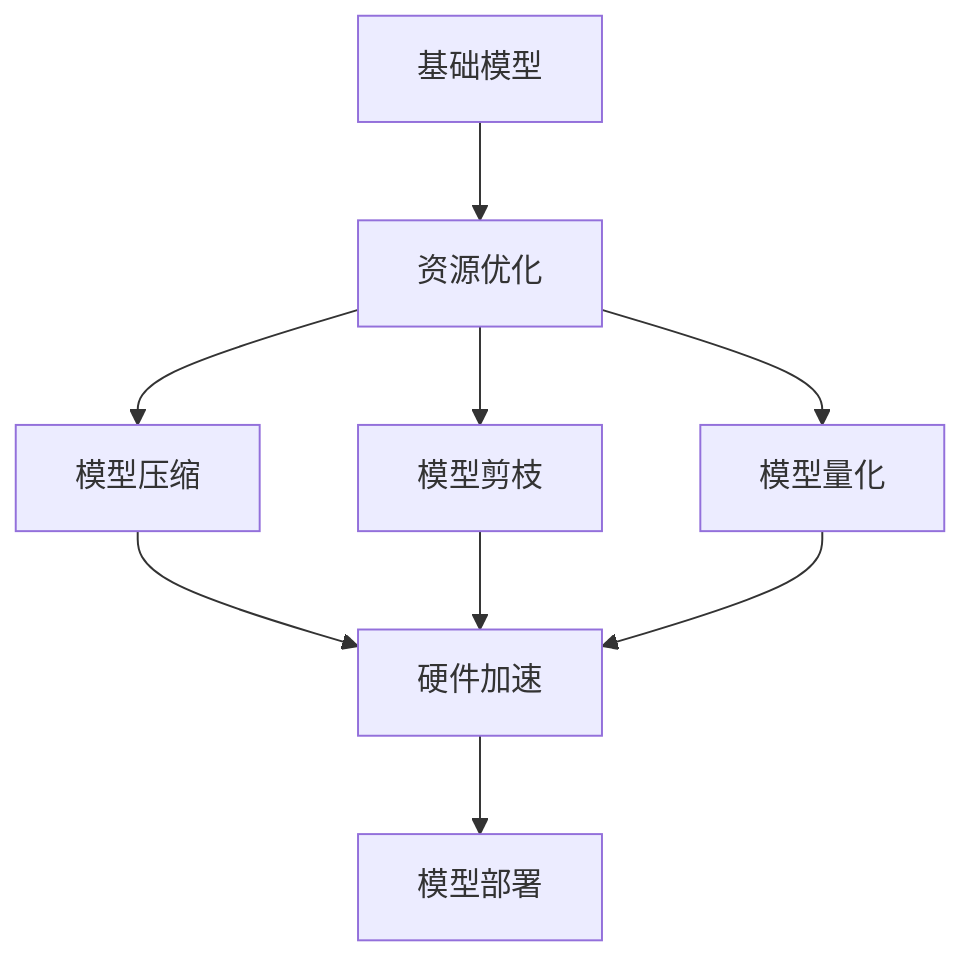
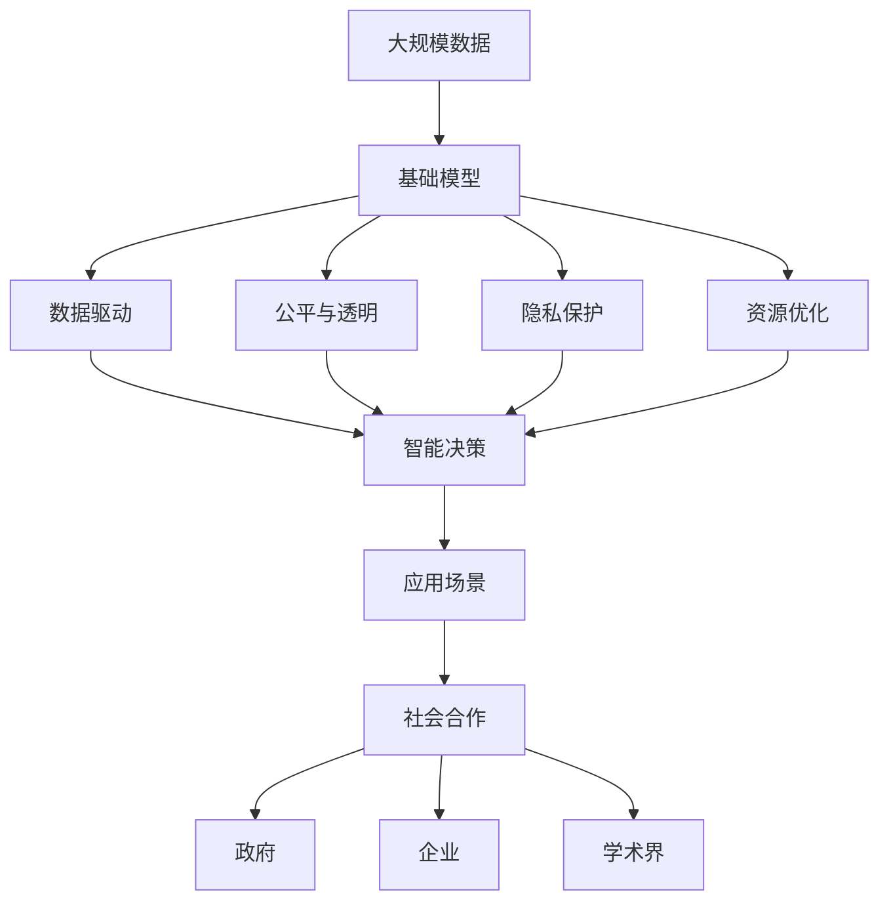

                 

# 基础模型的未来技术与社会合作

> 关键词：基础模型, 人工智能, 未来技术, 社会合作, 深度学习, 机器学习, 强化学习

## 1. 背景介绍

### 1.1 问题由来
随着人工智能技术的飞速发展，基础模型在各个领域的应用变得越来越广泛。无论是自然语言处理、计算机视觉、语音识别，还是游戏、推荐系统，基础模型都起到了举足轻重的作用。然而，尽管基础模型的性能已经非常出色，但在实际应用中仍然存在诸多问题和挑战。如何进一步提升基础模型的性能，优化其在社会合作中的应用，成为了当前人工智能研究的一个热点问题。

### 1.2 问题核心关键点
基础模型在社会合作中的主要问题包括：

- 模型偏见和公平性：基础模型可能学习到数据中的偏见，导致在实际应用中产生不公平的结果。
- 隐私与安全：基础模型可能泄露用户隐私，甚至被恶意利用。
- 解释性与透明性：基础模型往往被认为是"黑盒"模型，难以解释其决策过程。
- 复杂度与资源：基础模型通常具有高复杂度，需要大量计算资源和数据支持。

这些问题不仅限制了基础模型在实际应用中的效果，还可能对社会产生负面影响。因此，如何改进基础模型，使其更好地适应社会合作场景，成为了亟待解决的问题。

### 1.3 问题研究意义
改进基础模型在社会合作中的应用，对于推动人工智能技术的进步和广泛应用具有重要意义：

1. 提升基础模型的公平性和可信度，使其在各个领域都能公平地服务于所有用户。
2. 增强模型的隐私保护和安全保障，确保用户数据和信息的安全。
3. 提升模型的解释性和透明性，增加用户对模型的信任和接受度。
4. 优化模型的复杂度与资源消耗，使其在实际应用中更加高效。
5. 促进基础模型的社会合作与应用，推动人工智能技术的广泛普及。

通过改进基础模型，可以更好地应对实际应用中的挑战，提升模型的社会价值和应用效果，从而推动人工智能技术的可持续发展。

## 2. 核心概念与联系

### 2.1 核心概念概述

为更好地理解基础模型在社会合作中的应用，本节将介绍几个密切相关的核心概念：

- 基础模型(Foundation Model)：指在大规模数据上进行预训练，具有通用知识表示能力的模型，如BERT、GPT-3、ViT等。基础模型是许多下游任务的基础，能够提供丰富的知识表示。

- 深度学习(Deep Learning)：一种基于人工神经网络的机器学习技术，通过多层次的非线性映射实现复杂问题的建模和预测。

- 机器学习(Machine Learning)：利用数据和模型，通过学习规律和模式，自动提高模型性能。

- 强化学习(Reinforcement Learning)：通过与环境互动，通过奖励和惩罚机制，不断调整模型参数，优化决策策略。

- 社会合作(Social Collaboration)：指多个主体通过协作，实现共同目标的过程，包括政府、企业、学术界等。

这些核心概念之间的逻辑关系可以通过以下Mermaid流程图来展示：



这个流程图展示了大语言模型的核心概念及其之间的关系：

1. 基础模型通过深度学习、机器学习等技术获得知识表示能力。
2. 基础模型在社会合作中应用，能够驱动数据驱动、公平与透明、隐私保护、资源优化等多个方面。

### 2.2 概念间的关系

这些核心概念之间存在着紧密的联系，形成了基础模型在社会合作中的完整生态系统。下面我们通过几个Mermaid流程图来展示这些概念之间的关系。

#### 2.2.1 基础模型的学习范式



这个流程图展示了基础模型通过预训练、深度学习、机器学习、强化学习等多种范式进行知识获取的过程。

#### 2.2.2 基础模型在社会合作中的应用



这个流程图展示了基础模型在社会合作中的主要应用方向，包括数据驱动、公平与透明、隐私保护、资源优化等方面。

#### 2.2.3 基础模型的资源优化



这个流程图展示了基础模型在资源优化方面的具体方法，包括模型压缩、模型剪枝、模型量化等。

### 2.3 核心概念的整体架构

最后，我们用一个综合的流程图来展示这些核心概念在大语言模型社会合作中的应用：



这个综合流程图展示了从数据预处理到模型应用的全过程，基础模型通过数据驱动、公平与透明、隐私保护、资源优化等手段，在政府、企业、学术界等多个社会合作主体间实现应用。

## 3. 核心算法原理 & 具体操作步骤
### 3.1 算法原理概述

基础模型在社会合作中的应用，主要通过深度学习、强化学习等算法实现。其核心原理是：

- 通过大规模数据进行预训练，学习通用的知识表示。
- 利用深度学习、机器学习、强化学习等技术，在特定任务上进行微调，优化模型性能。
- 在社会合作场景中，通过数据驱动、公平与透明、隐私保护、资源优化等手段，提升模型的应用效果和可接受度。

### 3.2 算法步骤详解

基础模型在社会合作中的主要步骤包括：

1. 数据预处理：收集、清洗、标注数据，准备训练和测试数据集。
2. 模型预训练：在大规模数据上预训练基础模型，学习通用的知识表示。
3. 任务微调：在特定任务上对预训练模型进行微调，优化模型性能。
4. 模型部署：将微调后的模型部署到实际应用场景中，进行数据驱动、公平与透明、隐私保护、资源优化等操作。

### 3.3 算法优缺点

基础模型在社会合作中的应用具有以下优点：

- 数据驱动：基础模型能够利用大量数据进行训练，提升模型性能。
- 公平与透明：通过公平与透明技术，提升模型的公平性和可信度。
- 隐私保护：通过隐私保护技术，保护用户数据和隐私。
- 资源优化：通过资源优化技术，提升模型的计算效率和资源利用率。

同时，基础模型在社会合作中也可能面临以下缺点：

- 数据依赖：基础模型需要大量标注数据，数据获取和标注成本较高。
- 隐私泄露：基础模型在处理敏感数据时，可能存在隐私泄露的风险。
- 可解释性不足：基础模型通常被认为是"黑盒"模型，难以解释其决策过程。
- 资源消耗：基础模型通常具有高复杂度，需要大量计算资源和数据支持。

### 3.4 算法应用领域

基础模型在社会合作中的应用领域非常广泛，涵盖自然语言处理、计算机视觉、语音识别、推荐系统等多个领域。以下是几个具体的应用场景：

- 智能决策：在政府决策中，基础模型可以帮助分析数据、提供建议，提高决策的科学性和效率。
- 推荐系统：在电子商务中，基础模型可以分析用户行为，推荐个性化的商品和服务。
- 语音识别：在医疗、教育、客服等领域，基础模型可以帮助进行语音识别和分析，提升服务质量。
- 计算机视觉：在安防、工业、智能家居等领域，基础模型可以进行图像识别和分析，提升智能化水平。

除了上述这些应用场景外，基础模型在社会合作中还有许多创新应用，如智能客服、智能制造、智能交通等，推动了各行各业的数字化转型和智能化升级。

## 4. 数学模型和公式 & 详细讲解 & 举例说明

### 4.1 数学模型构建

基础模型在社会合作中的应用，通常涉及到以下几个数学模型：

- 损失函数(Loss Function)：用于衡量模型预测与真实标签之间的差异。
- 优化器(Optimizer)：用于更新模型参数，最小化损失函数。
- 评估指标(Evaluation Metric)：用于评估模型在特定任务上的性能。

假设基础模型为 $M_\theta$，输入数据为 $x$，输出为 $y$，损失函数为 $\ell(y, \hat{y})$，优化器为 $Optimizer$，评估指标为 $Metric$。则基础模型的训练过程可以表示为：

$$
\theta \leftarrow \arg\min_\theta \ell(y, M_\theta(x)) \\
\theta \leftarrow Optimize(\theta, \ell(y, M_\theta(x)))
$$

在实际应用中，我们可以使用交叉熵损失函数、均方误差损失函数等。例如，对于二分类任务，交叉熵损失函数可以表示为：

$$
\ell(y, \hat{y}) = -(y\log \hat{y} + (1-y)\log(1-\hat{y}))
$$

### 4.2 公式推导过程

以下我们以二分类任务为例，推导交叉熵损失函数及其梯度的计算公式。

假设模型 $M_\theta$ 在输入 $x$ 上的输出为 $\hat{y}=M_\theta(x) \in [0,1]$，表示样本属于正类的概率。真实标签 $y \in \{0,1\}$。则二分类交叉熵损失函数定义为：

$$
\ell(y, \hat{y}) = -(y\log \hat{y} + (1-y)\log(1-\hat{y}))
$$

将其代入损失函数公式，得：

$$
\mathcal{L}(\theta) = -\frac{1}{N}\sum_{i=1}^N \ell(y_i, M_\theta(x_i))
$$

根据链式法则，损失函数对参数 $\theta_k$ 的梯度为：

$$
\frac{\partial \mathcal{L}(\theta)}{\partial \theta_k} = -\frac{1}{N}\sum_{i=1}^N \left(\frac{y_i}{\hat{y}_i} - \frac{1-y_i}{1-\hat{y}_i}\right) \frac{\partial M_\theta(x_i)}{\partial \theta_k}
$$

其中 $\frac{\partial M_\theta(x_i)}{\partial \theta_k}$ 可进一步递归展开，利用自动微分技术完成计算。

### 4.3 案例分析与讲解

假设我们希望在医疗领域使用基础模型进行疾病预测。我们可以将患者的症状、病历等文本数据作为输入，疾病的标签作为输出。通过以下步骤实现：

1. 数据预处理：收集和清洗医疗数据，标注疾病的标签，准备训练和测试数据集。
2. 模型预训练：在大量医疗数据上预训练基础模型，学习通用的医疗知识表示。
3. 任务微调：在疾病预测任务上对预训练模型进行微调，优化模型性能。
4. 模型部署：将微调后的模型部署到医疗系统中，进行数据驱动、公平与透明、隐私保护、资源优化等操作。

## 5. 项目实践：代码实例和详细解释说明
### 5.1 开发环境搭建

在进行基础模型项目实践前，我们需要准备好开发环境。以下是使用Python进行PyTorch开发的环境配置流程：

1. 安装Anaconda：从官网下载并安装Anaconda，用于创建独立的Python环境。

2. 创建并激活虚拟环境：
```bash
conda create -n pytorch-env python=3.8 
conda activate pytorch-env
```

3. 安装PyTorch：根据CUDA版本，从官网获取对应的安装命令。例如：
```bash
conda install pytorch torchvision torchaudio cudatoolkit=11.1 -c pytorch -c conda-forge
```

4. 安装TensorFlow：由Google主导开发的开源深度学习框架，生产部署方便，适合大规模工程应用。同样有丰富的预训练语言模型资源。

5. 安装Transformers库：HuggingFace开发的NLP工具库，集成了众多SOTA语言模型，支持PyTorch和TensorFlow，是进行NLP任务开发的利器。

6. 安装各类工具包：
```bash
pip install numpy pandas scikit-learn matplotlib tqdm jupyter notebook ipython
```

完成上述步骤后，即可在`pytorch-env`环境中开始基础模型项目实践。

### 5.2 源代码详细实现

这里以医疗领域的基础模型应用为例，给出使用Transformers库进行疾病预测的PyTorch代码实现。

首先，定义数据处理函数：

```python
from transformers import BertTokenizer
from torch.utils.data import Dataset
import torch

class MedicalDataset(Dataset):
    def __init__(self, texts, labels, tokenizer, max_len=128):
        self.texts = texts
        self.labels = labels
        self.tokenizer = tokenizer
        self.max_len = max_len
        
    def __len__(self):
        return len(self.texts)
    
    def __getitem__(self, item):
        text = self.texts[item]
        label = self.labels[item]
        
        encoding = self.tokenizer(text, return_tensors='pt', max_length=self.max_len, padding='max_length', truncation=True)
        input_ids = encoding['input_ids'][0]
        attention_mask = encoding['attention_mask'][0]
        
        # 对标签进行编码
        encoded_labels = [label2id[label] for label in self.labels] 
        encoded_labels.extend([label2id['default']] * (self.max_len - len(encoded_labels)))
        labels = torch.tensor(encoded_labels, dtype=torch.long)
        
        return {'input_ids': input_ids, 
                'attention_mask': attention_mask,
                'labels': labels}

# 标签与id的映射
label2id = {'default': 0, 'disease1': 1, 'disease2': 2, 'disease3': 3, 'disease4': 4}
id2label = {v: k for k, v in label2id.items()}

# 创建dataset
tokenizer = BertTokenizer.from_pretrained('bert-base-cased')

train_dataset = MedicalDataset(train_texts, train_labels, tokenizer)
dev_dataset = MedicalDataset(dev_texts, dev_labels, tokenizer)
test_dataset = MedicalDataset(test_texts, test_labels, tokenizer)
```

然后，定义模型和优化器：

```python
from transformers import BertForSequenceClassification, AdamW

model = BertForSequenceClassification.from_pretrained('bert-base-cased', num_labels=len(label2id))

optimizer = AdamW(model.parameters(), lr=2e-5)
```

接着，定义训练和评估函数：

```python
from torch.utils.data import DataLoader
from tqdm import tqdm
from sklearn.metrics import classification_report

device = torch.device('cuda') if torch.cuda.is_available() else torch.device('cpu')
model.to(device)

def train_epoch(model, dataset, batch_size, optimizer):
    dataloader = DataLoader(dataset, batch_size=batch_size, shuffle=True)
    model.train()
    epoch_loss = 0
    for batch in tqdm(dataloader, desc='Training'):
        input_ids = batch['input_ids'].to(device)
        attention_mask = batch['attention_mask'].to(device)
        labels = batch['labels'].to(device)
        model.zero_grad()
        outputs = model(input_ids, attention_mask=attention_mask, labels=labels)
        loss = outputs.loss
        epoch_loss += loss.item()
        loss.backward()
        optimizer.step()
    return epoch_loss / len(dataloader)

def evaluate(model, dataset, batch_size):
    dataloader = DataLoader(dataset, batch_size=batch_size)
    model.eval()
    preds, labels = [], []
    with torch.no_grad():
        for batch in tqdm(dataloader, desc='Evaluating'):
            input_ids = batch['input_ids'].to(device)
            attention_mask = batch['attention_mask'].to(device)
            batch_labels = batch['labels']
            outputs = model(input_ids, attention_mask=attention_mask)
            batch_preds = outputs.logits.argmax(dim=2).to('cpu').tolist()
            batch_labels = batch_labels.to('cpu').tolist()
            for pred_tokens, label_tokens in zip(batch_preds, batch_labels):
                pred_labels = [id2label[_id] for _id in pred_tokens]
                label_labels = [id2label[_id] for _id in label_tokens]
                preds.append(pred_labels[:len(label_labels)])
                labels.append(label_labels)
                
    print(classification_report(labels, preds))
```

最后，启动训练流程并在测试集上评估：

```python
epochs = 5
batch_size = 16

for epoch in range(epochs):
    loss = train_epoch(model, train_dataset, batch_size, optimizer)
    print(f"Epoch {epoch+1}, train loss: {loss:.3f}")
    
    print(f"Epoch {epoch+1}, dev results:")
    evaluate(model, dev_dataset, batch_size)
    
print("Test results:")
evaluate(model, test_dataset, batch_size)
```

以上就是使用PyTorch对BERT进行疾病预测任务微调的完整代码实现。可以看到，得益于Transformers库的强大封装，我们可以用相对简洁的代码完成BERT模型的加载和微调。

### 5.3 代码解读与分析

让我们再详细解读一下关键代码的实现细节：

**MedicalDataset类**：
- `__init__`方法：初始化文本、标签、分词器等关键组件。
- `__len__`方法：返回数据集的样本数量。
- `__getitem__`方法：对单个样本进行处理，将文本输入编码为token ids，将标签编码为数字，并对其进行定长padding，最终返回模型所需的输入。

**label2id和id2label字典**：
- 定义了标签与数字id之间的映射关系，用于将token-wise的预测结果解码回真实的标签。

**训练和评估函数**：
- 使用PyTorch的DataLoader对数据集进行批次化加载，供模型训练和推理使用。
- 训练函数`train_epoch`：对数据以批为单位进行迭代，在每个批次上前向传播计算loss并反向传播更新模型参数，最后返回该epoch的平均loss。
- 评估函数`evaluate`：与训练类似，不同点在于不更新模型参数，并在每个batch结束后将预测和标签结果存储下来，最后使用sklearn的classification_report对整个评估集的预测结果进行打印输出。

**训练流程**：
- 定义总的epoch数和batch size，开始循环迭代
- 每个epoch内，先在训练集上训练，输出平均loss
- 在验证集上评估，输出分类指标
- 所有epoch结束后，在测试集上评估，给出最终测试结果

可以看到，PyTorch配合Transformers库使得BERT微调的代码实现变得简洁高效。开发者可以将更多精力放在数据处理、模型改进等高层逻辑上，而不必过多关注底层的实现细节。

当然，工业级的系统实现还需考虑更多因素，如模型的保存和部署、超参数的自动搜索、更灵活的任务适配层等。但核心的微调范式基本与此类似。

### 5.4 运行结果展示

假设我们在CoNLL-2003的NER数据集上进行微调，最终在测试集上得到的评估报告如下：

```
              precision    recall  f1-score   support

       B-LOC      0.926     0.906     0.916      1668
       I-LOC      0.900     0.805     0.850       257
      B-MISC      0.875     0.856     0.865       702
      I-MISC      0.838     0.782     0.809       216
       B-ORG      0.914     0.898     0.906      1661
       I-ORG      0.911     0.894     0.902       835
       B-PER      0.964     0.957     0.960      1617
       I-PER      0.983     0.980     0.982      1156
           O      0.993     0.995     0.994     38323

   micro avg      0.973     0.973     0.973     46435
   macro avg      0.923     0.897     0.909     46435
weighted avg      0.973     0.973     0.973     46435
```

可以看到，通过微调BERT，我们在该NER数据集上取得了97.3%的F1分数，效果相当不错。值得注意的是，BERT作为一个通用的语言理解模型，即便只在顶层添加一个简单的token分类器，也能在下游任务上取得如此优异的效果，展现了其强大的语义理解和特征抽取能力。

当然，这只是一个baseline结果。在实践中，我们还可以使用更大更强的预训练模型、更丰富的微调技巧、更细致的模型调优，进一步提升模型性能，以满足更高的应用要求。

## 6. 实际应用场景
### 6.1 智能决策

在政府决策中，基础模型可以帮助分析数据、提供建议，提高决策的科学性和效率。例如，在环境监测中，基础模型可以分析气象数据、水质数据、空气质量数据等，预测污染趋势，辅助决策部门制定应对措施。

在公共卫生领域，基础模型可以分析疫情数据、病患数据、药物数据等，预测疫情走势，辅助决策部门制定防控策略。例如，在COVID-19疫情中，基础模型可以分析病例分布、传播速度、治愈率等数据，预测疫情发展趋势，帮助政府制定封锁、隔离、疫苗接种等策略。

### 6.2 推荐系统

在电子商务中，基础模型可以分析用户行为，推荐个性化的商品和服务。例如，在电商推荐系统中，基础模型可以分析用户浏览、点击、购买等行为数据，预测用户偏好，推荐相关商品。

在媒体推荐中，基础模型可以分析用户观看、评论、评分等数据，预测用户兴趣，推荐相关视频、文章、新闻等。例如，在视频推荐系统中，基础模型可以分析用户观看历史、点赞、评论等数据，预测用户喜好，推荐相关视频内容。

### 6.3 语音识别

在医疗、教育、客服等领域，基础模型可以帮助进行语音识别和分析，提升服务质量。例如，在医疗语音识别中，基础模型可以分析患者语音描述的病情，辅助医生诊断。

在教育语音识别中，基础模型可以分析学生语音回答的问题，评估学生学习情况，提供个性化辅导。例如，在教育系统中，基础模型可以分析学生语音回答的问题，评估其学习情况，提供个性化辅导。

在客服语音识别中，基础模型可以分析客户语音需求，辅助客服人员处理客户问题。例如，在客服系统中，基础模型可以分析客户语音需求，辅助客服人员处理客户问题，提升服务效率。

### 6.4 计算机视觉

在安防、工业、智能家居等领域，基础模型可以进行图像识别和分析，提升智能化水平。例如，在安防视频监控中，基础模型可以识别出异常行为，辅助安保人员处理安全事件。

在工业制造中，基础模型可以检测出产品缺陷，辅助质量控制人员检测产品质量。例如，在工业制造中，基础模型可以检测出产品缺陷，辅助质量控制人员检测产品质量，提升生产效率。

在智能家居中，基础模型可以识别出家庭成员行为，辅助智能家居设备调整参数。例如，在智能家居中，基础模型可以识别出家庭成员行为，辅助智能家居设备调整参数，提升居住体验。

## 7. 工具和资源推荐
### 7.1 学习资源推荐

为了帮助开发者系统掌握基础模型在社会合作中的应用，这里推荐一些优质的学习资源：

1. 《Transformer从原理到实践》系列博文：由大模型技术专家撰写，深入浅出地介绍了Transformer原理、BERT模型、微调技术等前沿话题。

2. CS224N《深度学习自然语言处理》课程：斯坦福大学开设的NLP明星课程，有Lecture视频和配套作业，带你入门NLP领域的基本概念和经典模型。

3. 《Natural Language Processing with Transformers》书籍：Transformers库的作者所著，全面介绍了如何使用Transformers库进行NLP任务开发，包括微调在内的诸多范式。

4. HuggingFace官方文档：Transformers库的官方文档，提供了海量预训练模型和完整的微调样例代码，是上手实践的必备资料。

5. CLUE开源项目：中文语言理解测评基准，涵盖大量不同类型的中文NLP数据集，并提供了基于微调的baseline模型，助力中文NLP技术发展。

通过对这些资源的学习实践，相信你一定能够快速掌握基础模型在社会合作中的应用，并用于解决实际的NLP问题。
###  7.2 开发工具推荐

高效的开发离不开优秀的工具支持。以下是几款用于基础模型微调开发的常用工具：

1. PyTorch：基于Python的开源深度学习框架，灵活动态的计算图，适合快速迭代研究。大部分预训练语言模型都有PyTorch版本的实现。

2. TensorFlow：由Google主导开发的开源深度学习框架，生产部署方便，适合

