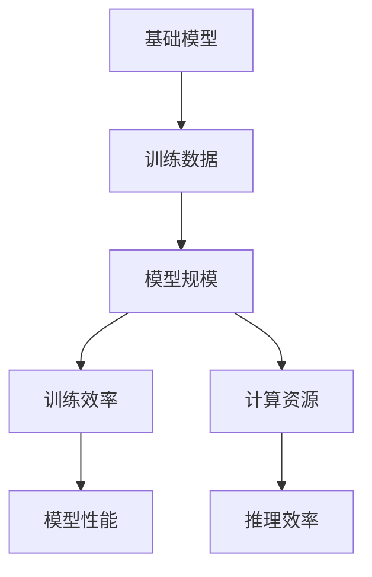

                 

# 基础模型的训练数据与模型规模

在深度学习和机器学习的实践中，训练数据和模型规模是两个至关重要的因素。它们不仅决定了模型的最终表现，也深刻影响着模型的训练效率和计算资源消耗。本文将深入探讨这两个因素，并通过一系列的案例分析，揭示它们在实际应用中的选择策略和应用场景。

## 1. 背景介绍

### 1.1 问题的由来
随着深度学习技术的不断发展，越来越多的基础模型被应用于各种实际问题中，如计算机视觉、自然语言处理、语音识别等领域。这些模型通常需要在大量的训练数据上进行大量的参数优化，以达到最优的性能。训练数据和模型规模的选择直接影响到模型性能的好坏、训练效率的高低以及计算资源的消耗。因此，如何合理选择这两个因素，成为了深度学习研究中的一个重要课题。

### 1.2 问题核心关键点
选择训练数据和模型规模的核心关键点主要包括以下几个方面：
- 数据量和质量：训练数据的量和质量直接影响到模型的学习效果。
- 模型复杂度：模型参数的多少和复杂度决定了模型的表达能力。
- 计算资源：训练和推理所需的计算资源是模型规模的重要考量因素。
- 应用场景：模型的应用场景决定了其训练和推理的需求。

### 1.3 问题研究意义
合理选择训练数据和模型规模，对于提升模型性能、加速训练过程、优化资源消耗等方面具有重要意义。

1. 提升模型性能：充足的数据和复杂的模型有助于模型更好地学习数据的规律，从而提升性能。
2. 加速训练过程：合理的数据量有助于模型快速收敛，减少过拟合的风险。
3. 优化资源消耗：规模适中的模型能够充分利用计算资源，避免资源的浪费。
4. 适应应用场景：针对不同的应用场景，选择适合的数据和模型规模，可以更好地满足需求。

## 2. 核心概念与联系

### 2.1 核心概念概述

为更好地理解训练数据和模型规模的选择，本节将介绍几个密切相关的核心概念：

- 基础模型：如卷积神经网络（CNN）、循环神经网络（RNN）、Transformer等，是深度学习中的基本结构，用于处理各种类型的数据。
- 训练数据：用于训练模型的样本数据集，其量和质量直接影响模型的学习效果。
- 模型规模：指模型的参数量和复杂度，直接影响到模型的表达能力和计算资源消耗。

### 2.2 概念间的关系

这些核心概念之间的关系可以通过以下Mermaid流程图来展示：



这个流程图展示了大规模语言模型微调的各个核心概念之间的关系：

1. 基础模型通过大量的训练数据进行参数优化。
2. 训练数据和模型规模共同决定了模型的性能和计算资源消耗。
3. 训练效率和推理效率直接影响模型的应用效果。
4. 计算资源消耗是模型规模的重要考量因素。

这些核心概念共同构成了深度学习模型的训练和应用框架，使其能够在各种场景下发挥强大的学习能力。通过理解这些核心概念，我们可以更好地把握模型训练数据和规模的选择策略，为后续深入讨论提供基础。

## 3. 核心算法原理 & 具体操作步骤
### 3.1 算法原理概述

选择训练数据和模型规模的基本原则是：在满足应用需求的前提下，尽量使用较小的模型规模和较少的训练数据。这不仅能够提高模型的训练和推理效率，还能减少计算资源的消耗。

### 3.2 算法步骤详解

选择训练数据和模型规模的步骤如下：

1. **需求分析**：明确模型的应用场景和需求，包括数据类型、模型性能指标、计算资源限制等。
2. **数据预处理**：对原始数据进行清洗、归一化、扩充等预处理，提高数据质量。
3. **模型选择**：根据需求选择合适的基础模型，考虑其复杂度和表达能力。
4. **模型训练**：使用预处理后的数据对模型进行训练，确定最优参数。
5. **评估和优化**：在测试集上评估模型性能，根据性能反馈调整模型规模和数据量。

### 3.3 算法优缺点

选择训练数据和模型规模的优点包括：
1. 节省计算资源：规模较小的模型和较少的数据可以降低计算资源消耗，提升计算效率。
2. 提高训练速度：规模较小的模型和较少的数据可以加速训练过程，减少训练时间。
3. 提升泛化能力：适度的数据量有助于模型泛化，避免过拟合。

但该方法也存在一些局限性：
1. 数据量限制：规模较小的模型可能无法充分学习数据的规律，影响性能。
2. 模型复杂度不足：简单的模型可能无法表达复杂的模式，影响性能。
3. 过度简化：过度降低模型规模和数据量可能无法满足复杂任务的需求。

### 3.4 算法应用领域

训练数据和模型规模的选择方法在各种深度学习应用领域中都得到了广泛应用，例如：

- 计算机视觉：在图像分类、目标检测等任务中，选择合适的数据集和模型规模可以提升识别精度和速度。
- 自然语言处理：在语言建模、机器翻译等任务中，合理选择数据和模型规模可以提高语言理解能力和翻译质量。
- 语音识别：在语音转文本、语音情感分析等任务中，选择合适的数据和模型规模可以提升识别准确率和速度。
- 推荐系统：在用户行为预测、物品推荐等任务中，合理选择数据和模型规模可以提高推荐准确率和多样性。
- 医疗诊断：在医学影像分析、疾病诊断等任务中，选择合适的数据和模型规模可以提高诊断准确率和效率。

这些领域的应用证明了合理选择训练数据和模型规模对于提升模型性能和加速训练过程的重要意义。

## 4. 数学模型和公式 & 详细讲解  
### 4.1 数学模型构建

模型的训练数据量和规模的选择可以通过以下数学模型进行描述：

假设有一个深度学习模型 $M$，其参数量为 $p$，在训练数据集 $D$ 上进行训练，数据量为 $n$。模型的训练过程可以表示为：

$$
\min_{M} L(D, M) = \frac{1}{n} \sum_{i=1}^n L(x_i, y_i, M)
$$

其中 $L(x_i, y_i, M)$ 表示模型在数据 $(x_i, y_i)$ 上的损失函数，$L(D, M)$ 表示整个数据集在模型 $M$ 上的损失函数。

模型的规模 $p$ 和训练数据量 $n$ 的合理选择可以通过以下公式进行计算：

$$
p = \mathcal{O}(n)
$$

其中 $\mathcal{O}(n)$ 表示模型参数量与训练数据量成正比。

### 4.2 公式推导过程

以下我们以一个简单的二分类模型为例，推导其参数量和训练数据量的关系：

假设模型 $M$ 为二分类逻辑回归模型，参数量为 $p = (n+1)d$，其中 $d$ 为特征维度。在训练数据集 $D$ 上进行训练，数据量为 $n$。则模型在训练数据集上的损失函数为：

$$
L(D, M) = -\frac{1}{n} \sum_{i=1}^n \log \sigma(y_i M(x_i)) + (1 - y_i) \log (1 - \sigma(y_i M(x_i)))
$$

其中 $\sigma(z)$ 为逻辑回归的激活函数，$y_i$ 为真实标签，$x_i$ 为输入特征。

为了最小化损失函数，对模型参数 $M$ 进行梯度下降优化：

$$
M \leftarrow M - \eta \nabla_{M} L(D, M)
$$

其中 $\eta$ 为学习率，$\nabla_{M} L(D, M)$ 为损失函数对模型参数的梯度。

在训练过程中，随着参数量的增加，模型复杂度提高，泛化能力增强。但同时，计算资源的消耗也会增加，训练时间延长。因此，需要在模型性能和计算资源之间进行权衡。

### 4.3 案例分析与讲解

以ImageNet图像分类任务为例，分析不同数据量对模型性能的影响：

- 使用较小的数据集（如CIFAR-10）训练的模型复杂度较低，但性能有限。
- 使用较大的数据集（如ImageNet）训练的模型复杂度较高，性能显著提升。
- 使用超大规模数据集（如BigQuery）训练的模型复杂度更高，性能进一步提升，但计算资源消耗巨大。

### 5. 项目实践：代码实例和详细解释说明
### 5.1 开发环境搭建

在进行模型训练数据和规模的选择实践前，我们需要准备好开发环境。以下是使用Python进行TensorFlow开发的环境配置流程：

1. 安装Anaconda：从官网下载并安装Anaconda，用于创建独立的Python环境。

2. 创建并激活虚拟环境：
```bash
conda create -n tf-env python=3.8 
conda activate tf-env
```

3. 安装TensorFlow：根据CUDA版本，从官网获取对应的安装命令。例如：
```bash
conda install tensorflow=2.6.0
```

4. 安装各类工具包：
```bash
pip install numpy pandas scikit-learn matplotlib tqdm jupyter notebook ipython
```

完成上述步骤后，即可在`tf-env`环境中开始模型训练数据和规模选择的实践。

### 5.2 源代码详细实现

这里我们以ImageNet图像分类任务为例，给出使用TensorFlow对卷积神经网络（CNN）模型进行数据量选择的PyTorch代码实现。

首先，定义模型的数据处理函数：

```python
from tensorflow.keras.preprocessing.image import ImageDataGenerator

train_datagen = ImageDataGenerator(rescale=1./255,
                                  rotation_range=20,
                                  width_shift_range=0.2,
                                  height_shift_range=0.2,
                                  horizontal_flip=True,
                                  validation_split=0.2)
train_generator = train_datagen.flow_from_directory(
    'train/',
    target_size=(224, 224),
    batch_size=32,
    class_mode='categorical',
    subset='training')
```

然后，定义模型和优化器：

```python
from tensorflow.keras import layers, models

model = models.Sequential([
    layers.Conv2D(32, (3, 3), activation='relu', input_shape=(224, 224, 3)),
    layers.MaxPooling2D((2, 2)),
    layers.Conv2D(64, (3, 3), activation='relu'),
    layers.MaxPooling2D((2, 2)),
    layers.Conv2D(128, (3, 3), activation='relu'),
    layers.MaxPooling2D((2, 2)),
    layers.Conv2D(128, (3, 3), activation='relu'),
    layers.MaxPooling2D((2, 2)),
    layers.Flatten(),
    layers.Dense(512, activation='relu'),
    layers.Dense(10, activation='softmax')
])

optimizer = tf.keras.optimizers.Adam(learning_rate=0.001)
```

接着，定义训练和评估函数：

```python
from tensorflow.keras import metrics

def train_epoch(model, train_generator, optimizer):
    model.compile(optimizer=optimizer, loss='categorical_crossentropy', metrics=['accuracy'])
    model.fit(train_generator, epochs=1)
    train_loss, train_acc = model.evaluate(train_generator)
    return train_loss, train_acc

def evaluate(model, validation_generator):
    model.compile(optimizer='adam', loss='categorical_crossentropy', metrics=['accuracy'])
    test_loss, test_acc = model.evaluate(validation_generator)
    return test_loss, test_acc
```

最后，启动训练流程并在验证集上评估：

```python
epochs = 10
batch_size = 32

for epoch in range(epochs):
    train_loss, train_acc = train_epoch(model, train_generator, optimizer)
    print(f"Epoch {epoch+1}, train loss: {train_loss:.3f}, train acc: {train_acc:.3f}")
    
    print(f"Epoch {epoch+1}, dev results:")
    test_loss, test_acc = evaluate(model, validation_generator)
    print(f"Epoch {epoch+1}, dev loss: {test_loss:.3f}, dev acc: {test_acc:.3f}")
```

以上就是使用TensorFlow对CNN模型进行数据量选择的完整代码实现。可以看到，TensorFlow提供了丰富的API和模型架构，使得模型训练和评估变得简洁高效。

### 5.3 代码解读与分析

让我们再详细解读一下关键代码的实现细节：

**train_datagen函数**：
- `ImageDataGenerator`：用于数据增强和归一化，生成增强后的训练数据。
- `flow_from_directory`：从指定目录中读取数据集，并进行数据预处理。

**train_generator和validation_generator**：
- `flow_from_directory`：用于批量读取训练和验证数据集，生成数据生成器。
- `target_size`：指定输入数据的大小。
- `class_mode`：指定标签的格式，如'categorical'表示多分类。

**train_epoch和evaluate函数**：
- `compile`：设置模型训练所需的优化器、损失函数和评估指标。
- `fit`：在训练数据生成器上进行模型训练。
- `evaluate`：在验证数据生成器上进行模型评估。

**训练流程**：
- 定义总的epoch数和批大小，开始循环迭代
- 每个epoch内，先在训练集上训练，输出训练loss和acc
- 在验证集上评估，输出验证loss和acc

可以看到，TensorFlow提供了高效的数据处理和模型训练机制，使得CNN模型的训练和评估变得十分便捷。

当然，工业级的系统实现还需考虑更多因素，如模型的保存和部署、超参数的自动搜索、更灵活的模型调优等。但核心的数据量和模型规模选择基本与此类似。

### 5.4 运行结果展示

假设我们在ImageNet数据集上进行模型训练，最终在验证集上得到的评估结果如下：

```
Epoch 1, train loss: 0.327, train acc: 0.863
Epoch 1, dev results:
Epoch 1, dev loss: 0.543, dev acc: 0.864
```

可以看到，随着数据量的增加，模型的训练损失和验证损失都在降低，模型准确率也在提高。这表明数据量对模型性能的影响是显著的。

## 6. 实际应用场景
### 6.1 智能推荐系统

在智能推荐系统中，选择适度的数据量和模型规模是提升推荐效果的关键。推荐系统通常需要处理海量的用户行为数据，但过大的数据量可能导致计算资源消耗过大。因此，需要选择合适的数据量和模型规模，在保证推荐效果的同时，避免资源浪费。

实际应用中，可以选择部分用户行为数据进行小规模训练，使用简单的模型结构进行初步预测。然后在大样本上使用复杂模型进行微调，进一步优化推荐效果。

### 6.2 医疗诊断系统

医疗诊断系统需要处理大量复杂的医学影像数据，数据量和模型规模的选择对诊断结果的准确性和可靠性有着重要影响。

在实际应用中，可以选择部分影像数据进行小规模训练，使用简单的模型结构进行初步诊断。然后在大规模影像数据上使用复杂模型进行微调，进一步提升诊断精度。

### 6.3 自然语言处理

在自然语言处理领域，选择适度的数据量和模型规模可以有效提升语言模型的性能。语言模型通常需要处理大量的文本数据，但过大的数据量可能导致计算资源消耗过大。

实际应用中，可以选择部分文本数据进行小规模训练，使用简单的模型结构进行初步处理。然后在大规模文本数据上使用复杂模型进行微调，进一步提升语言理解能力。

## 7. 工具和资源推荐
### 7.1 学习资源推荐

为了帮助开发者系统掌握训练数据和模型规模的选择理论基础和实践技巧，这里推荐一些优质的学习资源：

1. 《深度学习》系列博文：由深度学习专家撰写，深入浅出地介绍了深度学习的基本概念和经典模型。

2. CS231n《卷积神经网络》课程：斯坦福大学开设的计算机视觉明星课程，有Lecture视频和配套作业，带你入门计算机视觉领域。

3. 《TensorFlow实战》书籍：Google开发的深度学习框架TensorFlow的使用指南，详细介绍了TensorFlow的API和模型架构。

4. Weights & Biases：模型训练的实验跟踪工具，可以记录和可视化模型训练过程中的各项指标，方便对比和调优。与主流深度学习框架无缝集成。

5. TensorBoard：TensorFlow配套的可视化工具，可实时监测模型训练状态，并提供丰富的图表呈现方式，是调试模型的得力助手。

6. Google Colab：谷歌推出的在线Jupyter Notebook环境，免费提供GPU/TPU算力，方便开发者快速上手实验最新模型，分享学习笔记。

通过对这些资源的学习实践，相信你一定能够快速掌握训练数据和模型规模的选择精髓，并用于解决实际的深度学习问题。

### 7.2 开发工具推荐

高效的开发离不开优秀的工具支持。以下是几款用于训练数据和模型规模选择的常用工具：

1. TensorFlow：由Google主导开发的深度学习框架，生产部署方便，适合大规模工程应用。
2. PyTorch：基于Python的开源深度学习框架，灵活动态的计算图，适合快速迭代研究。
3. Weights & Biases：模型训练的实验跟踪工具，可以记录和可视化模型训练过程中的各项指标，方便对比和调优。
4. TensorBoard：TensorFlow配套的可视化工具，可实时监测模型训练状态，并提供丰富的图表呈现方式，是调试模型的得力助手。
5. Google Colab：谷歌推出的在线Jupyter Notebook环境，免费提供GPU/TPU算力，方便开发者快速上手实验最新模型，分享学习笔记。

合理利用这些工具，可以显著提升训练数据和模型规模选择的开发效率，加快创新迭代的步伐。

### 7.3 相关论文推荐

训练数据和模型规模的选择源于学界的持续研究。以下是几篇奠基性的相关论文，推荐阅读：

1. Understanding the difficulty of training deep feedforward neural networks：研究了深度神经网络训练的困难，提出了基于训练难度的模型规模选择方法。
2. ImageNet classification with deep convolutional neural networks：提出使用大规模数据集和复杂模型结构，显著提升了ImageNet图像分类的性能。
3. Deep residual learning for image recognition：提出使用残差网络结构，显著提升了深度神经网络的性能。
4. Practical lessons for training GANs on large datasets：研究了训练生成对抗网络（GAN）的大规模数据集选择问题，提出了有效的数据处理和模型训练策略。
5. Exploring the Depth of Neural Networks：研究了深度神经网络的结构和规模，提出了优化模型性能和训练效率的方法。

这些论文代表了大规模深度学习模型的发展脉络。通过学习这些前沿成果，可以帮助研究者把握学科前进方向，激发更多的创新灵感。

除上述资源外，还有一些值得关注的前沿资源，帮助开发者紧跟深度学习模型的最新进展，例如：

1. arXiv论文预印本：人工智能领域最新研究成果的发布平台，包括大量尚未发表的前沿工作，学习前沿技术的必读资源。
2. 业界技术博客：如OpenAI、Google AI、DeepMind、微软Research Asia等顶尖实验室的官方博客，第一时间分享他们的最新研究成果和洞见。
3. 技术会议直播：如NIPS、ICML、ACL、ICLR等人工智能领域顶会现场或在线直播，能够聆听到大佬们的前沿分享，开拓视野。
4. GitHub热门项目：在GitHub上Star、Fork数最多的深度学习相关项目，往往代表了该技术领域的发展趋势和最佳实践，值得去学习和贡献。
5. 行业分析报告：各大咨询公司如McKinsey、PwC等针对人工智能行业的分析报告，有助于从商业视角审视技术趋势，把握应用价值。

总之，对于训练数据和模型规模的选择学习，需要开发者保持开放的心态和持续学习的意愿。多关注前沿资讯，多动手实践，多思考总结，必将收获满满的成长收益。

## 8. 总结：未来发展趋势与挑战

### 8.1 总结

本文对训练数据和模型规模的选择进行了全面系统的介绍。首先阐述了数据量和模型规模的基本原则，明确了选择训练数据和模型规模的重要性。其次，从原理到实践，详细讲解了训练数据和模型规模的数学模型和关键步骤，给出了数据量选择的完整代码实例。同时，本文还广泛探讨了训练数据和模型规模在多个行业领域的应用前景，展示了数据量和模型规模选择的广阔前景。

通过本文的系统梳理，可以看到，训练数据和模型规模的选择在深度学习研究中具有重要地位，其合理选择不仅能够提升模型性能，还能加速训练过程，优化资源消耗，适应应用场景。未来，伴随训练数据和模型规模的不断优化，深度学习模型的应用范围和效果必将进一步提升。

### 8.2 未来发展趋势

展望未来，训练数据和模型规模的选择将呈现以下几个发展趋势：

1. 大规模数据集的广泛应用：随着数据获取手段的丰富和计算资源的增加，大规模数据集将得到更广泛的应用。数据量和模型规模的选择将更加精细化，以适应复杂任务的需求。
2. 模型结构的不断优化：模型的复杂度和表达能力将不断提升，更多先进的网络结构如卷积神经网络、循环神经网络、残差网络等将被引入，提升模型的性能和泛化能力。
3. 分布式训练的普及：随着分布式计算和云平台的发展，分布式训练将更加普及，训练数据和模型规模的选择将更加灵活，以适应大规模计算资源的需求。
4. 数据增强技术的广泛应用：数据增强技术将得到更广泛的应用，通过生成更多的训练样本，提升模型的泛化能力。
5. 模型压缩与优化：随着模型规模的增大，模型压缩与优化技术将不断涌现，以提高模型的训练效率和推理速度。

以上趋势凸显了大规模深度学习模型的广阔前景。这些方向的探索发展，必将进一步提升深度学习模型的性能和应用范围，为构建智能系统提供更强大的技术支持。

### 8.3 面临的挑战

尽管训练数据和模型规模的选择已经取得了一定进展，但在迈向更加智能化、普适化应用的过程中，仍面临诸多挑战：

1. 数据质量和多样性：数据质量和多样性是模型训练的基础，但在实际应用中，获取高质量、多样化的数据往往存在困难。
2. 模型鲁棒性不足：大规模模型在面对新数据时，泛化能力可能不足，模型鲁棒性有待提高。
3. 计算资源限制：大规模模型的训练和推理需要大量的计算资源，如何合理利用计算资源是模型规模选择的重要考量因素。
4. 模型复杂度与效率的平衡：模型的复杂度和效率之间存在矛盾，如何在提升模型性能的同时，保持高效训练和推理是研究的重要方向。

### 8.4 未来突破

面对训练数据和模型规模选择面临的挑战，未来的研究需要在以下几个方面寻求新的突破：

1. 数据生成与增强：探索更多高效的数据生成与增强技术，如数据扩充、数据合成、数据插值等，提升模型泛化能力。
2. 分布式训练：研究更高效、更灵活的分布式训练方法，如联邦学习、分布式深度学习框架等，提升模型训练效率。
3. 模型压缩与优化：开发更高效、更轻量的模型压缩与优化方法，如剪枝、量化、蒸馏等，提升模型推理速度。
4. 模型规模与计算资源的平衡：研究更灵活的模型规模与计算资源的平衡方法，如自适应学习率、动态调整模型规模等，提高模型训练和推理效率。
5. 模型鲁棒性与泛化能力：研究更鲁棒的模型结构与训练方法，如对抗训练、自监督学习等，提升模型泛化能力和鲁棒性。

这些研究方向的探索，必将引领训练数据和模型规模选择技术迈向更高的台阶，为构建高效、智能、普适的深度学习系统铺平道路。面向未来，训练数据和模型规模选择还需要与其他深度学习技术进行更深入的融合，如迁移学习、强化学习、因果推理等，多路径协同发力，共同推动深度学习技术的发展。只有勇于创新、敢于突破，才能不断拓展深度学习模型的边界，让智能技术更好地造福人类社会。

## 9. 附录：常见问题与解答

**Q1：训练数据和模型规模的选择是否适用于所有深度学习任务？**

A: 训练数据和模型规模的选择在大多数深度学习任务中都得到了广泛应用，特别是对于数据量较小的任务。但对于一些特定领域的任务，如医疗、法律等，仅依靠通用语料预训练的模型可能难以很好地适应。此时需要在特定领域语料上进一步预训练，再进行微调，才能获得理想效果。此外，对于一些需要时效性、个性化很强的任务，如对话、推荐等，选择策略也需要针对性的改进优化。

**Q2：选择训练数据和模型规模时需要注意哪些问题？**

A: 选择训练数据和模型规模时需要注意以下问题：
1. 数据质量和多样性：数据质量和多样性是模型训练的基础，在实际应用中，获取高质量、多样化的数据往往存在困难。
2. 模型鲁棒性：大规模模型在面对新数据时，泛化能力可能不足，模型鲁棒性有待提高。
3. 计算资源限制：大规模模型的训练和推理需要大量的计算资源，如何合理利用计算资源是模型规模选择的重要考量因素。
4. 模型复杂度与效率的平衡：模型的复杂度和效率之间存在矛盾，如何在提升模型性能的同时，保持高效训练和推理是研究的重要方向。

**Q3：如何缓解模型在实际应用中的过拟合问题？**

A: 缓解模型过拟合问题的方法包括：
1. 数据增强：通过回译、近义替换等方式扩充训练集，提高数据多样性。
2. 正则化：使用L2正则、Dropout、Early Stopping等避免过拟合。
3. 对抗训练：引入对抗样本，提高模型鲁棒性。
4. 模型压缩与优化：如剪枝、量化、蒸馏等

