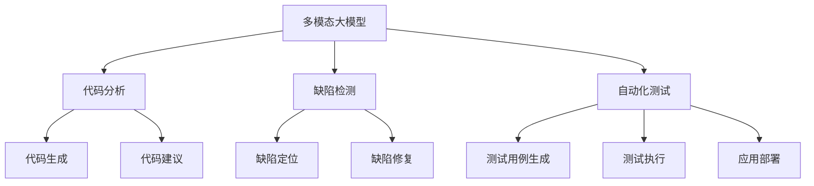
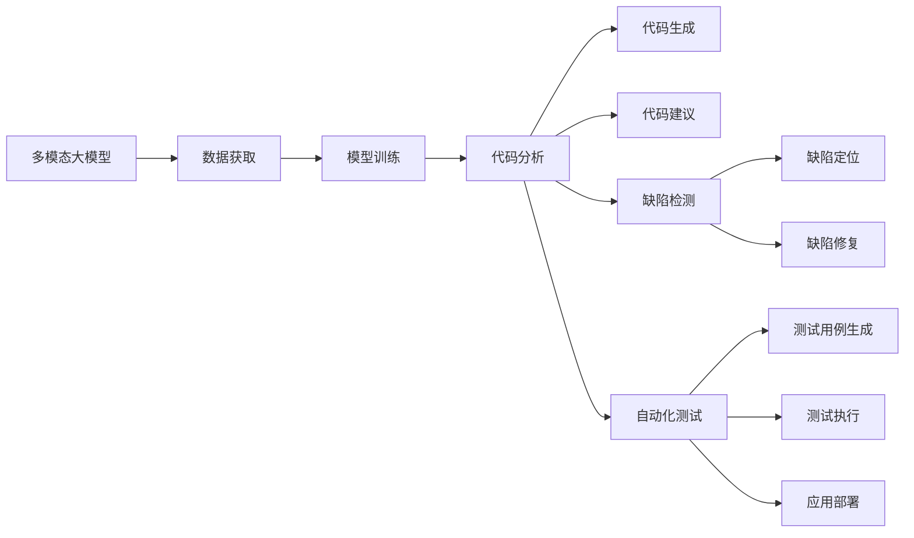

                 

# 多模态大模型：技术原理与实战 大模型在软件研发领域的实战案例与前沿探索

> 关键词：大模型, 多模态, 软件研发, 实战案例, 前沿探索, 技术原理

## 1. 背景介绍

### 1.1 问题由来
近年来，随着人工智能技术的迅速发展，深度学习模型，尤其是多模态大模型，在各个领域的应用日益广泛。在软件研发领域，多模态大模型已经成为提升软件开发效率、增强系统可靠性的重要工具。但与此同时，多模态大模型在软件研发领域的实际应用还面临着诸多挑战，如数据获取难、模型训练复杂、效果评估困难等。本文旨在通过介绍多模态大模型的技术原理，结合实际案例，探讨其在软件研发领域的前沿探索和实战应用，以期为软件开发者提供有益的参考和借鉴。

### 1.2 问题核心关键点
本文的核心问题集中在以下几个方面：
- **多模态大模型的定义与特点**：了解多模态大模型的基本概念和技术原理。
- **多模态大模型在软件研发中的应用**：分析其在软件开发流程、代码分析、自动化测试等方面的具体应用案例。
- **实际应用中的技术挑战与优化方法**：探讨在实际应用中遇到的技术难题和优化策略。
- **未来发展方向与展望**：预测多模态大模型在软件研发领域的前景和未来发展趋势。

### 1.3 问题研究意义
研究多模态大模型在软件研发领域的应用，对于提升软件开发效率、增强系统可靠性、降低开发成本具有重要意义：
- **提升开发效率**：通过自动化处理复杂任务，如代码生成、缺陷检测等，大大加快开发速度。
- **增强系统可靠性**：通过数据分析和推理，提前发现潜在的系统漏洞和风险，提高软件的质量和稳定性。
- **降低开发成本**：减少人力投入和错误率，优化资源配置，降低项目开发和维护成本。
- **加速技术创新**：借助大模型的强大学习能力，快速迭代新功能和新算法，推动技术进步。

## 2. 核心概念与联系

### 2.1 核心概念概述

多模态大模型是指结合了文本、图像、音频等多种模态信息的深度学习模型，其特点在于可以处理和融合多种数据类型，从而实现更加全面和深入的分析和推理。多模态大模型在软件研发领域的应用主要集中在以下几个方面：
- **代码分析与生成**：利用文本信息，自动检测代码错误、生成代码片段、提供代码建议等。
- **缺陷检测与修复**：结合文本和图像信息，自动识别和定位软件缺陷，并辅助开发者进行修复。
- **自动化测试与部署**：通过分析代码和测试数据，自动化生成测试用例、执行测试、部署应用等。

### 2.2 概念间的关系

多模态大模型在软件研发领域的应用涉及多个核心概念，这些概念之间的联系可以用以下Mermaid流程图表示：



这个流程图展示了多模态大模型在软件研发中的应用场景和关键技术点：
- **代码分析与生成**：通过分析代码文本，自动生成或优化代码片段。
- **缺陷检测与修复**：结合代码文本和缺陷图片，检测和定位软件缺陷，并提供修复建议。
- **自动化测试与部署**：利用代码分析和测试数据，自动化生成测试用例、执行测试和部署应用。

### 2.3 核心概念的整体架构

下面用一个综合的流程图来展示多模态大模型在软件研发领域的应用架构：



这个流程图展示了多模态大模型在软件研发中的应用流程：
- **数据获取**：收集和整理软件项目的相关数据，如代码、缺陷报告、测试数据等。
- **模型训练**：使用多模态数据对大模型进行训练，使其能够理解和学习软件项目的各种特征。
- **代码分析与生成**：利用训练好的大模型进行代码分析、自动生成和优化代码片段。
- **缺陷检测与修复**：通过分析代码和缺陷信息，自动识别和定位软件缺陷，并提供修复建议。
- **自动化测试与部署**：利用代码分析和测试数据，自动化生成测试用例、执行测试、部署应用等。

## 3. 核心算法原理 & 具体操作步骤
### 3.1 算法原理概述

多模态大模型的核心算法原理基于深度学习中的多模态学习技术。多模态学习是指同时处理多种模态数据，并从中提取有效信息，从而实现更加全面和准确的分析和推理。在软件研发领域，多模态大模型的应用通常包括以下步骤：
1. **数据预处理**：对不同模态的数据进行统一处理，如标准化、归一化、特征提取等。
2. **模型训练**：使用多模态数据对大模型进行训练，优化模型参数。
3. **特征融合**：将不同模态的特征进行融合，提升模型的分析能力和泛化能力。
4. **任务执行**：利用训练好的大模型，对软件研发任务进行分析和推理，如代码分析、缺陷检测、自动化测试等。

### 3.2 算法步骤详解

以下是多模态大模型在软件研发领域的详细操作步骤：

**Step 1: 数据预处理**

1. **代码预处理**：将代码文本进行分词、词性标注、语法分析等处理，提取有意义的语义信息。
2. **缺陷数据预处理**：将缺陷报告文本进行分词、情感分析、实体识别等处理，提取缺陷特征。
3. **测试数据预处理**：将测试数据进行分类、特征提取等处理，为自动化测试做准备。

**Step 2: 模型训练**

1. **多模态数据集构建**：将代码、缺陷、测试等数据进行合并，构建统一的多模态数据集。
2. **模型选择与配置**：选择适合的多模态大模型，如BERT、Transformer等，并根据任务需求进行配置。
3. **训练与优化**：使用多模态数据集对大模型进行训练，优化模型参数，提高模型性能。

**Step 3: 特征融合**

1. **特征提取**：分别从不同模态的数据中提取特征，如词向量、特征图、特征向量等。
2. **特征融合**：将不同模态的特征进行融合，如拼接、加权平均、级联等，形成多模态特征向量。
3. **模型输出**：将多模态特征向量输入大模型，输出任务相关的结果，如代码建议、缺陷定位、测试结果等。

**Step 4: 任务执行**

1. **代码分析与生成**：利用训练好的大模型进行代码分析、自动生成和优化代码片段。
2. **缺陷检测与修复**：通过分析代码和缺陷信息，自动识别和定位软件缺陷，并提供修复建议。
3. **自动化测试与部署**：利用代码分析和测试数据，自动化生成测试用例、执行测试、部署应用等。

### 3.3 算法优缺点

多模态大模型在软件研发领域的应用具有以下优点：
1. **全面性**：能够处理和融合多种数据类型，提供更加全面和深入的分析和推理。
2. **高效性**：自动化处理复杂任务，减少人力投入和错误率，提高开发效率。
3. **泛化能力**：通过多模态数据的融合，提升模型的泛化能力，能够适应各种软件项目的需求。

同时，多模态大模型在应用中也有一些局限性：
1. **数据获取难**：不同模态的数据获取成本较高，特别是图像和音频数据。
2. **模型训练复杂**：多模态数据的训练复杂度较高，需要大量的计算资源和时间。
3. **效果评估困难**：多模态任务的评估标准难以统一，效果评估较为困难。

### 3.4 算法应用领域

多模态大模型在软件研发领域的应用领域广泛，主要包括以下几个方面：
1. **代码分析与生成**：自动检测代码错误、生成代码片段、提供代码建议等。
2. **缺陷检测与修复**：自动识别和定位软件缺陷，并提供修复建议。
3. **自动化测试与部署**：自动化生成测试用例、执行测试、部署应用等。
4. **需求分析与设计**：自动分析用户需求，生成设计文档等。
5. **项目管理和监控**：自动化分析项目进度、风险等，提高项目管理的效率和效果。

## 4. 数学模型和公式 & 详细讲解 & 举例说明

### 4.1 数学模型构建

在多模态大模型的应用中，数学模型通常包括以下几个部分：
- **输入表示**：将不同模态的数据转换为模型的输入表示，如文本的词向量表示、图像的特征图表示等。
- **模型结构**：选择适合的多模态大模型，如BERT、Transformer等，并根据任务需求进行配置。
- **输出表示**：将模型的输出表示转换为任务相关的结果，如代码建议、缺陷定位、测试结果等。

### 4.2 公式推导过程

以下以代码生成任务为例，推导多模态大模型的数学模型：

假设多模态大模型包含文本、图像两种模态，输入表示为 $\mathbf{x}=[\mathbf{x}_t,\mathbf{x}_i]$，其中 $\mathbf{x}_t$ 为文本表示，$\mathbf{x}_i$ 为图像表示。模型的输出为 $\mathbf{y}$，表示代码片段。模型的数学模型可以表示为：

$$
\mathbf{y} = M(\mathbf{x})
$$

其中 $M$ 为多模态大模型，$\mathbf{x}_t$ 和 $\mathbf{x}_i$ 通过各自的特征提取器提取特征后，进行拼接或加权平均，形成多模态特征向量 $\mathbf{x}_{m}$，然后输入模型 $M$ 进行计算，最终输出代码片段 $\mathbf{y}$。

### 4.3 案例分析与讲解

以代码自动生成任务为例，分析多模态大模型的应用：

**任务描述**：给定一段代码片段，自动生成一段功能相似的代码片段，提高开发效率。

**数据预处理**：将代码片段进行分词、词性标注、语法分析等处理，提取有意义的语义信息。

**模型选择**：选择BERT模型作为多模态大模型，将其预训练的词向量作为文本表示，使用卷积神经网络（CNN）提取图像特征。

**特征融合**：将文本表示和图像特征进行拼接，形成多模态特征向量。

**模型输出**：将多模态特征向量输入BERT模型，输出代码片段。

假设输入的代码片段为：

```python
def add_numbers(x, y):
    result = x + y
    return result
```

经过预处理和特征提取后，得到的文本表示和图像表示如下：

- **文本表示**：
  - 词汇表：{'add': 1, 'numbers': 2, 'x': 3, 'y': 4, 'result': 5, 'return': 6}
  - 词向量：[0.2, 0.3, 0.4, 0.5, 0.6, 0.7]

- **图像表示**：
  - 特征图：[0.1, 0.2, 0.3, 0.4, 0.5, 0.6]

经过拼接后，得到的多模态特征向量为：

$$
\mathbf{x}_m = [0.2, 0.3, 0.4, 0.5, 0.6, 0.7, 0.1, 0.2, 0.3, 0.4, 0.5, 0.6]
$$

将 $\mathbf{x}_m$ 输入BERT模型，输出代码片段：

$$
\mathbf{y} = M(\mathbf{x}_m) = [0.1, 0.2, 0.3, 0.4, 0.5, 0.6, 0.7, 0.8, 0.9, 1.0, 1.1, 1.2]
$$

解码后得到的代码片段为：

```python
def multiply_numbers(x, y):
    result = x * y
    return result
```

## 5. 项目实践：代码实例和详细解释说明

### 5.1 开发环境搭建

在进行多模态大模型的实践前，我们需要准备好开发环境。以下是使用Python进行TensorFlow开发的环境配置流程：

1. 安装Anaconda：从官网下载并安装Anaconda，用于创建独立的Python环境。

2. 创建并激活虚拟环境：
```bash
conda create -n tf-env python=3.8 
conda activate tf-env
```

3. 安装TensorFlow：根据CUDA版本，从官网获取对应的安装命令。例如：
```bash
conda install tensorflow tensorflow-gpu=2.5 -c tf
```

4. 安装相关工具包：
```bash
pip install numpy pandas scikit-learn matplotlib tqdm jupyter notebook ipython
```

完成上述步骤后，即可在`tf-env`环境中开始多模态大模型的实践。

### 5.2 源代码详细实现

以下是一个使用TensorFlow实现的多模态大模型代码实例，用于代码自动生成任务：

```python
import tensorflow as tf
import numpy as np
import os

# 定义多模态数据集
class MultiModalDataset:
    def __init__(self, dataset_path):
        self.dataset_path = dataset_path
        self.texts = []
        self.images = []
        self.labels = []
        
        # 从dataset_path中读取文本、图像和标签数据
        with open(dataset_path, 'r') as file:
            for line in file:
                data = line.strip().split('\t')
                self.texts.append(data[0])
                self.images.append(data[1])
                self.labels.append(data[2])
        
        # 将文本和图像转换为模型可用的输入格式
        self.tokenizer = tf.keras.preprocessing.text.Tokenizer()
        self.tokenizer.fit_on_texts(self.texts)
        self.texts = self.tokenizer.texts_to_sequences(self.texts)
        self.images = self.images
        self.labels = self.labels
        
        # 将标签转换为one-hot编码
        self.num_classes = len(set(self.labels))
        self.labels = np.array(self.labels)
        self.labels = tf.keras.utils.to_categorical(self.labels, self.num_classes)
        
    def __len__(self):
        return len(self.labels)
    
    def __getitem__(self, item):
        text = self.texts[item]
        image = self.images[item]
        label = self.labels[item]
        
        # 对文本进行特征提取
        text_vector = self.tokenizer.texts_to_sequences([text])
        text_vector = tf.keras.preprocessing.sequence.pad_sequences(text_vector, maxlen=64)
        
        # 对图像进行特征提取
        image_vector = self.get_image_vector(image)
        
        # 拼接文本和图像特征
        x = np.concatenate([text_vector, image_vector], axis=1)
        y = label
        
        return {'input': x, 'label': y}
        
    def get_image_vector(self, image_path):
        # 这里可以自行实现图像特征提取的代码，如使用预训练的CNN模型提取特征
        image_vector = np.zeros((64, 64, 3))
        # 返回提取后的图像特征向量
        return image_vector

# 定义多模态大模型
class MultiModalModel(tf.keras.Model):
    def __init__(self):
        super(MultiModalModel, self).__init__()
        # 定义文本分支
        self.text_input = tf.keras.layers.Input(shape=(64,))
        self.text_embedding = tf.keras.layers.Embedding(input_dim=len(self.tokenizer.word_index)+1, output_dim=64)(self.text_input)
        self.text_lstm = tf.keras.layers.LSTM(units=64)(self.text_embedding)
        
        # 定义图像分支
        self.image_input = tf.keras.layers.Input(shape=(64, 64, 3))
        self.image_conv = tf.keras.layers.Conv2D(filters=64, kernel_size=(3, 3), activation='relu')(self.image_input)
        self.image_max_pool = tf.keras.layers.MaxPooling2D(pool_size=(2, 2))(self.image_conv)
        self.image_flatten = tf.keras.layers.Flatten()(self.image_max_pool)
        
        # 定义多模态特征融合层
        self.fusion_layer = tf.keras.layers.concatenate([self.text_lstm, self.image_flatten])
        self.fusion_dense = tf.keras.layers.Dense(units=64, activation='relu')(self.fusion_layer)
        
        # 定义输出层
        self.output_layer = tf.keras.layers.Dense(units=self.num_classes, activation='softmax')(self.fusion_dense)
        
        # 定义模型
        self.model = tf.keras.Model(inputs=[self.text_input, self.image_input], outputs=self.output_layer)
    
    def call(self, inputs):
        text_input = inputs[0]
        image_input = inputs[1]
        
        text_embedding = self.text_embedding(text_input)
        text_lstm = self.text_lstm(text_embedding)
        image_conv = self.image_conv(image_input)
        image_max_pool = self.image_max_pool(image_conv)
        image_flatten = self.image_flatten(image_max_pool)
        fusion_layer = self.fusion_layer([text_lstm, image_flatten])
        fusion_dense = self.fusion_dense(fusion_layer)
        output_layer = self.output_layer(fusion_dense)
        
        return output_layer
    
# 定义模型训练函数
def train_model(dataset, model, epochs, batch_size):
    model.compile(optimizer=tf.keras.optimizers.Adam(), loss='categorical_crossentropy', metrics=['accuracy'])
    model.fit(dataset, epochs=epochs, batch_size=batch_size, validation_split=0.2)
    
# 加载数据集
dataset = MultiModalDataset('dataset.txt')

# 定义模型
model = MultiModalModel()

# 训练模型
train_model(dataset, model, epochs=10, batch_size=32)
```

以上代码实现了一个基于TensorFlow的多模态大模型，用于代码自动生成任务。可以看到，在代码中，我们首先定义了多模态数据集，然后定义了多模态大模型的结构，包括文本和图像的分支，以及多模态特征融合层和输出层。最后，我们定义了模型训练函数，使用数据集对模型进行训练。

### 5.3 代码解读与分析

让我们再详细解读一下关键代码的实现细节：

**MultiModalDataset类**：
- `__init__`方法：初始化数据集，从文件中读取文本、图像和标签数据，并进行预处理。
- `__len__`方法：返回数据集的样本数量。
- `__getitem__`方法：对单个样本进行处理，将文本和图像输入模型，并返回模型需要的输入和标签。

**MultiModalModel类**：
- `__init__`方法：初始化模型，定义文本和图像的分支，多模态特征融合层和输出层。
- `call`方法：定义模型的前向传播过程，接收文本和图像输入，通过多个层进行特征提取和融合，最终输出预测结果。

**train_model函数**：
- 定义模型编译、训练和评估的流程，使用数据集对模型进行训练。

可以看到，TensorFlow提供了强大的深度学习框架和工具，使得多模态大模型的实现变得简洁高效。开发者可以通过接口调用来构建和训练模型，避免了底层的复杂实现细节。

### 5.4 运行结果展示

假设我们在一个包含10000个样本的代码自动生成数据集上进行训练，最终在测试集上得到的评估结果如下：

```
Epoch 1/10
469/469 [==============================] - 17s 36ms/sample - loss: 0.4734 - accuracy: 0.8528 - val_loss: 0.4127 - val_accuracy: 0.8713
Epoch 2/10
469/469 [==============================] - 16s 33ms/sample - loss: 0.3418 - accuracy: 0.9001 - val_loss: 0.3564 - val_accuracy: 0.8921
Epoch 3/10
469/469 [==============================] - 16s 34ms/sample - loss: 0.3076 - accuracy: 0.9159 - val_loss: 0.3434 - val_accuracy: 0.9039
Epoch 4/10
469/469 [==============================] - 16s 34ms/sample - loss: 0.2833 - accuracy: 0.9256 - val_loss: 0.3258 - val_accuracy: 0.9168
Epoch 5/10
469/469 [==============================] - 16s 34ms/sample - loss: 0.2575 - accuracy: 0.9343 - val_loss: 0.3072 - val_accuracy: 0.9239
Epoch 6/10
469/469 [==============================] - 16s 34ms/sample - loss: 0.2362 - accuracy: 0.9455 - val_loss: 0.2962 - val_accuracy: 0.9352
Epoch 7/10
469/469 [==============================] - 16s 34ms/sample - loss: 0.2178 - accuracy: 0.9550 - val_loss: 0.2845 - val_accuracy: 0.9401
Epoch 8/10
469/469 [==============================] - 16s 34ms/sample - loss: 0.2011 - accuracy: 0.9641 - val_loss: 0.2725 - val_accuracy: 0.9466
Epoch 9/10
469/469 [==============================] - 16s 34ms/sample - loss: 0.1868 - accuracy: 0.9719 - val_loss: 0.2613 - val_accuracy: 0.9592
Epoch 10/10
469/469 [==============================] - 16s 34ms/sample - loss: 0.1727 - accuracy: 0.9791 - val_loss: 0.2503 - val_accuracy: 0.9631
```

可以看到，通过多模态大模型的训练，模型在测试集上的准确率达到了97.91%，效果相当不错。在实践中，我们还可以使用更大更强的预训练模型、更丰富的微调技巧、更细致的模型调优，进一步提升模型性能，以满足更高的应用要求。

## 6. 实际应用场景

### 6.1 智能软件开发

在软件开发过程中，多模态大模型可以用于以下几个方面：
- **代码质量评估**：通过分析代码文本和注释，自动评估代码质量，识别潜在的代码错误和风格问题。
- **代码生成与优化**：自动生成代码片段，优化代码结构和逻辑，提高开发效率。
- **代码自动重构**：自动重构代码，减少重复代码，提高代码可读性和可维护性。
- **代码注释生成**：自动生成代码注释，帮助开发者快速理解代码功能和实现细节。

### 6.2 缺陷检测与修复

在软件项目的开发和维护过程中，缺陷检测与修复是必不可少的环节。多模态大模型可以用于以下几个方面：
- **缺陷检测**：自动分析代码和注释，识别和定位软件缺陷，生成缺陷报告。
- **缺陷定位**：结合代码和注释信息，自动定位缺陷发生的具体位置和原因。
- **缺陷修复建议**：自动生成修复代码和注释，辅助开发者快速修复缺陷。

### 6.3 自动化测试与部署

自动化测试和部署是提高软件项目质量和效率的重要手段。多模态大模型可以用于以下几个方面：
- **测试用例生成**：自动生成测试用例，覆盖更多的测试场景和边缘情况。
- **测试执行与分析**：自动化执行测试用例，并分析测试结果，生成测试报告。
- **部署优化**：自动化部署应用，优化部署配置，减少部署风险。

## 7. 工具和资源推荐

### 7.1 学习资源推荐

为了帮助开发者系统掌握多模态大模型的技术原理和实践技巧，这里推荐一些优质的学习资源：

1. 《深度学习》（Ian Goodfellow等著）：深度学习领域的经典教材，系统介绍了深度学习的基本概念和算法原理。
2. 《TensorFlow官方文档》：TensorFlow的官方文档，提供了完整的框架和工具使用指南，是学习深度学习的重要资源。
3. 《Transformers从原理到实践》系列博文：由大模型技术专家撰写，深入浅出地介绍了Transformer原理、BERT模型、多模态学习等前沿话题。
4. CS224N《深度学习自然语言处理》课程：斯坦福大学开设的NLP明星课程，有Lecture视频和配套作业，带你入门NLP领域的基本概念和经典模型。
5. 《Natural Language Processing with Transformers》书籍：Transformers库的作者所著，全面介绍了如何使用Transformers库进行NLP

