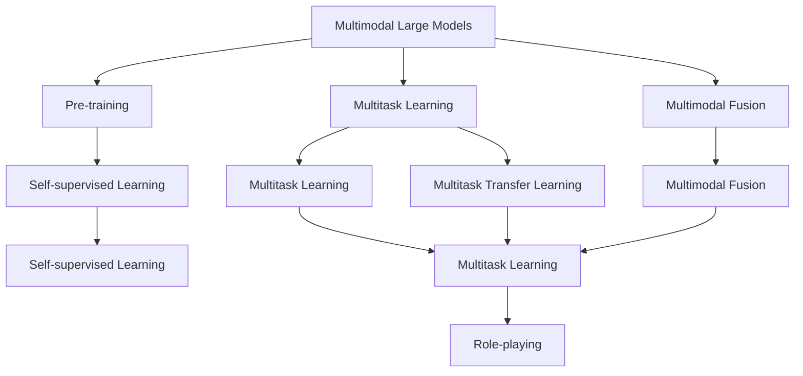
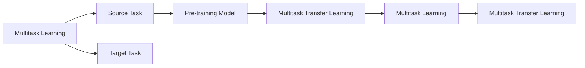
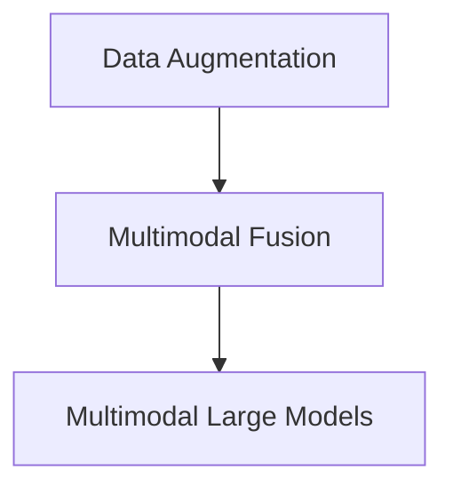
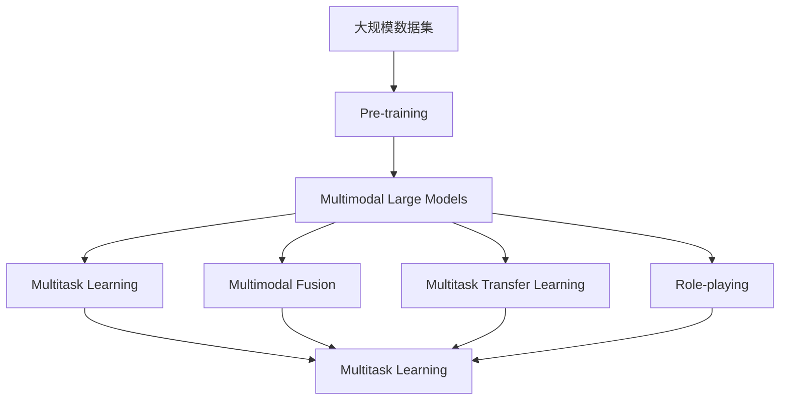

                 

# 多模态大模型：技术原理与实战 如何提高角色扮演能力

> 关键词：多模态大模型,角色扮演能力,技术原理,实战,数据增强,迁移学习,多模态融合,自然语言处理(NLP),计算机视觉(CV),多任务学习(MTL)

## 1. 背景介绍

### 1.1 问题由来
随着人工智能技术的迅猛发展，多模态大模型（Multimodal Large Models）在自然语言处理（NLP）和计算机视觉（CV）等多个领域取得了突破性进展。这些模型通过整合文本、图像、音频等多种模态数据，大幅提升了其在理解和生成多模态信息的性能。近年来，基于多模态大模型的人机交互技术，如角色扮演（Role-playing）、虚拟助手等，已经得到了广泛的应用和关注。

角色扮演（Role-playing）是指人工智能系统通过模拟人类的语言、情感和行为，与人进行自然交流，实现人机互动。这一能力不仅在虚拟助手、客服、教育等领域发挥重要作用，还在增强现实（AR）、虚拟现实（VR）、游戏等新兴领域展现巨大潜力。但当前角色扮演技术的瓶颈在于，如何使人工智能系统不仅能够理解用户输入的内容，还能够具备更丰富的语义、情感和行为能力，以实现更加自然、流畅的交互。

### 1.2 问题核心关键点
为解决这一问题，研究者们提出了基于多模态大模型的角色扮演方法。该方法通过在文本、图像、音频等多种模态数据上进行联合训练，使得模型能够理解和生成多模态信息，从而提高其在角色扮演任务中的表现。该方法的核心在于：

- 联合训练：将不同模态的数据进行联合训练，使模型能够同时理解和使用不同模态的信息。
- 多任务学习：在训练过程中加入多个相关任务，提升模型的泛化能力和迁移学习能力。
- 数据增强：通过丰富多样化的数据增强技术，提高模型对各类输入的适应能力。
- 迁移学习：利用已在大规模语料上训练好的预训练模型，在特定任务上进行微调，以减少从头训练的难度和成本。

这些关键技术使得多模态大模型在角色扮演任务中表现出色，并在多个实际应用中取得了显著效果。

### 1.3 问题研究意义
研究基于多模态大模型的角色扮演方法，对于提升人工智能系统的交互能力和智能化水平，推动多模态信息处理的深入研究，具有重要意义：

1. 提升交互自然性：通过多模态融合，使AI系统能够更自然地理解和生成语言、视觉和听觉信息，实现与用户的无缝交互。
2. 丰富应用场景：多模态大模型能够处理复杂的多模态信息，拓展了AI系统在医疗、教育、娱乐等领域的广泛应用。
3. 提高泛化能力：多任务学习和迁移学习技术使得模型能够更好地泛化到不同的数据分布和任务场景，增强系统的适应性。
4. 降低成本：利用预训练模型进行微调，显著减少了从头训练所需的标注数据和计算资源。
5. 创新交互形式：多模态大模型为AI系统提供了更多元、更丰富的交互形式，如语音交互、手势识别、情感检测等，提升用户体验。

## 2. 核心概念与联系

### 2.1 核心概念概述

为更好地理解基于多模态大模型的角色扮演方法，本节将介绍几个密切相关的核心概念：

- 多模态大模型（Multimodal Large Models）：指同时整合文本、图像、音频等多种模态信息的大型预训练模型，能够理解和生成复杂的多模态数据。
- 预训练（Pre-training）：指在大规模无标签数据上，通过自监督学习任务训练通用模型的过程。常见的预训练任务包括自回归语言模型、对比学习等。
- 多任务学习（Multitask Learning）：指在训练过程中加入多个相关任务，提升模型的泛化能力和迁移学习能力。
- 迁移学习（Transfer Learning）：指将一个领域学习到的知识，迁移应用到另一个不同但相关的领域的学习范式。
- 数据增强（Data Augmentation）：指通过各种数据变换方式，丰富训练集的多样性，提高模型对各类输入的适应能力。
- 角色扮演（Role-playing）：指AI系统通过模拟人类的语言、情感和行为，与人进行自然交流，实现人机互动。
- 多模态融合（Multimodal Fusion）：指将不同模态的信息进行整合，提升模型对多模态数据的理解和生成能力。

这些核心概念之间的逻辑关系可以通过以下Mermaid流程图来展示：



这个流程图展示了多模态大模型的核心概念及其之间的关系：

1. 多模态大模型通过预训练获得基础能力。
2. 多任务学习使模型具备泛化能力和迁移学习能力。
3. 多模态融合提升模型对多模态数据的理解和生成能力。
4. 迁移学习使得模型能够适应特定任务，提高模型性能。
5. 角色扮演是应用多模态大模型的最终目标，实现人机互动。

### 2.2 概念间的关系

这些核心概念之间存在着紧密的联系，形成了多模态大模型的学习和应用框架。下面我们通过几个Mermaid流程图来展示这些概念之间的关系。

#### 2.2.1 多模态大模型的学习范式


这个流程图展示了大模型多模态融合的基本原理，以及其与预训练、多任务学习等概念的关系。

#### 2.2.2 多任务学习和迁移学习的关系



这个流程图展示了多任务学习和迁移学习的基本原理，以及其在大模型微调中的应用。

#### 2.2.3 数据增强和多模态融合的关系



这个流程图展示了数据增强和多模态融合的关系，通过丰富数据，提升模型对多模态数据的适应能力。

### 2.3 核心概念的整体架构

最后，我们用一个综合的流程图来展示这些核心概念在大模型微调过程中的整体架构：



这个综合流程图展示了从预训练到多模态融合，再到角色扮演的完整过程。多模态大模型首先在大规模数据上进行预训练，然后通过多任务学习和迁移学习，在不同任务上进行微调，最终应用于角色扮演任务，实现人机互动。

## 3. 核心算法原理 & 具体操作步骤
### 3.1 算法原理概述

基于多模态大模型的角色扮演方法，本质上是一个多模态信息处理和生成过程。其核心思想是：将预训练的多模态大模型视为一个强大的"特征提取器"，通过在有标签的特定任务上加入多模态数据，优化模型在角色扮演任务中的表现。

形式化地，假设预训练多模态大模型为 $M_{\theta}$，其中 $\theta$ 为预训练得到的模型参数。给定角色扮演任务 $T$ 的多模态训练集 $D=\{(x_i,y_i)\}_{i=1}^N$，其中 $x_i$ 包含文本、图像、音频等多模态数据，$y_i$ 为角色扮演任务的标签。微调的目标是找到新的模型参数 $\hat{\theta}$，使得：

$$
\hat{\theta}=\mathop{\arg\min}_{\theta} \mathcal{L}(M_{\theta},D)
$$

其中 $\mathcal{L}$ 为针对任务 $T$ 设计的损失函数，用于衡量模型预测输出与真实标签之间的差异。常见的损失函数包括交叉熵损失、均方误差损失等。

通过梯度下降等优化算法，微调过程不断更新模型参数 $\theta$，最小化损失函数 $\mathcal{L}$，使得模型输出逼近真实标签。由于 $\theta$ 已经通过预训练获得了较强的多模态理解和生成能力，因此即便在小规模数据集 $D$ 上进行微调，也能较快收敛到理想的模型参数 $\hat{\theta}$。

### 3.2 算法步骤详解

基于多模态大模型的角色扮演微调一般包括以下几个关键步骤：

**Step 1: 准备预训练模型和数据集**
- 选择合适的预训练多模态大模型 $M_{\theta}$ 作为初始化参数，如 CLIP、Deformable BERT 等。
- 准备角色扮演任务的训练集 $D$，划分为训练集、验证集和测试集。一般要求标注数据与预训练数据的分布不要差异过大。

**Step 2: 设计任务适配层**
- 根据任务类型，在预训练模型顶层设计合适的输出层和损失函数。
- 对于对话系统，通常在顶层添加语言模型解码器和交叉熵损失函数。
- 对于情感分析，通常使用情感分类器输出情感标签，并以交叉熵损失函数进行训练。

**Step 3: 设置微调超参数**
- 选择合适的优化算法及其参数，如 AdamW、SGD 等，设置学习率、批大小、迭代轮数等。
- 设置正则化技术及强度，包括权重衰减、Dropout、Early Stopping 等。
- 确定冻结预训练参数的策略，如仅微调顶层，或全部参数都参与微调。

**Step 4: 执行梯度训练**
- 将训练集数据分批次输入模型，前向传播计算损失函数。
- 反向传播计算参数梯度，根据设定的优化算法和学习率更新模型参数。
- 周期性在验证集上评估模型性能，根据性能指标决定是否触发 Early Stopping。
- 重复上述步骤直到满足预设的迭代轮数或 Early Stopping 条件。

**Step 5: 测试和部署**
- 在测试集上评估微调后模型 $M_{\hat{\theta}}$ 的性能，对比微调前后的效果提升。
- 使用微调后的模型对新输入进行推理预测，集成到实际的应用系统中。
- 持续收集新的数据，定期重新微调模型，以适应数据分布的变化。

以上是基于多模态大模型的角色扮演微调的一般流程。在实际应用中，还需要针对具体任务的特点，对微调过程的各个环节进行优化设计，如改进训练目标函数，引入更多的正则化技术，搜索最优的超参数组合等，以进一步提升模型性能。

### 3.3 算法优缺点

基于多模态大模型的角色扮演微调方法具有以下优点：
1. 简单高效。只需准备少量标注数据，即可对预训练模型进行快速适配，获得较大的性能提升。
2. 通用适用。适用于各种角色扮演任务，设计简单的任务适配层即可实现微调。
3. 参数高效。利用参数高效微调技术，在固定大部分预训练参数的情况下，仍可取得不错的提升。
4. 效果显著。在学术界和工业界的诸多任务上，基于微调的方法已经刷新了最先进的性能指标。

同时，该方法也存在一定的局限性：
1. 依赖标注数据。微调的效果很大程度上取决于标注数据的质量和数量，获取高质量标注数据的成本较高。
2. 迁移能力有限。当目标任务与预训练数据的分布差异较大时，微调的性能提升有限。
3. 负面效果传递。预训练模型的固有偏见、有害信息等，可能通过微调传递到下游任务，造成负面影响。
4. 可解释性不足。微调模型的决策过程通常缺乏可解释性，难以对其推理逻辑进行分析和调试。

尽管存在这些局限性，但就目前而言，基于多模态大模型的微调方法仍是大模型应用的主流范式。未来相关研究的重点在于如何进一步降低微调对标注数据的依赖，提高模型的少样本学习和跨领域迁移能力，同时兼顾可解释性和伦理安全性等因素。

### 3.4 算法应用领域

基于多模态大模型的角色扮演方法，已经在多种NLP和CV任务上取得了显著效果，成为角色扮演技术落地应用的重要手段。以下是几个典型的应用场景：

- **智能客服**：利用微调后的对话系统，实现7x24小时不间断服务，快速响应客户咨询，用自然流畅的语言解答各类常见问题。
- **金融舆情监测**：收集金融领域相关的新闻、报道、评论等文本数据，利用微调后的情感分析模型，实时监测不同主题下的情感变化趋势，确保金融系统安全稳定。
- **个性化推荐**：通过微调后的模型，从文本描述中准确把握用户的兴趣点，生成个性化的推荐结果，提升用户满意度。
- **多模态对话系统**：结合图像、音频等多模态数据，提升对话系统的理解和生成能力，实现更自然、更智能的对话交互。
- **游戏角色交互**：利用多模态大模型，使虚拟角色具备更丰富的人类情感和行为，提升游戏体验。

这些应用场景展示了多模态大模型在角色扮演任务中的广泛应用潜力。随着模型的不断优化和数据的持续积累，未来这一技术将有望在更多领域得到应用，为人们的日常生活和工作带来新的便利和价值。

## 4. 数学模型和公式 & 详细讲解 & 举例说明

### 4.1 数学模型构建

本节将使用数学语言对基于多模态大模型的角色扮演微调过程进行更加严格的刻画。

记预训练多模态大模型为 $M_{\theta}:\mathcal{X} \rightarrow \mathcal{Y}$，其中 $\mathcal{X}$ 为输入空间，$\mathcal{Y}$ 为输出空间，$\theta \in \mathbb{R}^d$ 为模型参数。假设角色扮演任务 $T$ 的训练集为 $D=\{(x_i,y_i)\}_{i=1}^N$，其中 $x_i$ 为多模态数据，$y_i$ 为角色扮演任务的标签。

定义模型 $M_{\theta}$ 在输入 $x$ 上的损失函数为 $\ell(M_{\theta}(x),y)$，则在数据集 $D$ 上的经验风险为：

$$
\mathcal{L}(\theta) = \frac{1}{N} \sum_{i=1}^N \ell(M_{\theta}(x_i),y_i)
$$

微调的优化目标是最小化经验风险，即找到最优参数：

$$
\theta^* = \mathop{\arg\min}_{\theta} \mathcal{L}(\theta)
$$

在实践中，我们通常使用基于梯度的优化算法（如SGD、Adam等）来近似求解上述最优化问题。设 $\eta$ 为学习率，$\lambda$ 为正则化系数，则参数的更新公式为：

$$
\theta \leftarrow \theta - \eta \nabla_{\theta}\mathcal{L}(\theta) - \eta\lambda\theta
$$

其中 $\nabla_{\theta}\mathcal{L}(\theta)$ 为损失函数对参数 $\theta$ 的梯度，可通过反向传播算法高效计算。

### 4.2 公式推导过程

以下我们以对话系统为例，推导交叉熵损失函数及其梯度的计算公式。

假设模型 $M_{\theta}$ 在输入 $x$ 上的输出为 $\hat{y}=M_{\theta}(x)$，表示模型对用户输入的回复。真实标签 $y \in \{1,0\}$，表示回复是否正确。则二分类交叉熵损失函数定义为：

$$
\ell(M_{\theta}(x),y) = -y\log \hat{y} - (1-y)\log (1-\hat{y})
$$

将其代入经验风险公式，得：

$$
\mathcal{L}(\theta) = -\frac{1}{N}\sum_{i=1}^N [y_i\log M_{\theta}(x_i)+(1-y_i)\log(1-M_{\theta}(x_i))]
$$

根据链式法则，损失函数对参数 $\theta_k$ 的梯度为：

$$
\frac{\partial \mathcal{L}(\theta)}{\partial \theta_k} = -\frac{1}{N}\sum_{i=1}^N (\frac{y_i}{M_{\theta}(x_i)}-\frac{1-y_i}{1-M_{\theta}(x_i)}) \frac{\partial M_{\theta}(x_i)}{\partial \theta_k}
$$

其中 $\frac{\partial M_{\theta}(x_i)}{\partial \theta_k}$ 可进一步递归展开，利用自动微分技术完成计算。

在得到损失函数的梯度后，即可带入参数更新公式，完成模型的迭代优化。重复上述过程直至收敛，最终得到适应角色扮演任务的最优模型参数 $\theta^*$。

## 5. 项目实践：代码实例和详细解释说明
### 5.1 开发环境搭建

在进行多模态大模型微调实践前，我们需要准备好开发环境。以下是使用Python进行PyTorch开发的环境配置流程：

1. 安装Anaconda：从官网下载并安装Anaconda，用于创建独立的Python环境。

2. 创建并激活虚拟环境：
```bash
conda create -n pytorch-env python=3.8 
conda activate pytorch-env
```

3. 安装PyTorch：根据CUDA版本，从官网获取对应的安装命令。例如：
```bash
conda install pytorch torchvision torchaudio cudatoolkit=11.1 -c pytorch -c conda-forge
```

4. 安装各类工具包：
```bash
pip install numpy pandas scikit-learn matplotlib tqdm jupyter notebook ipython
```

完成上述步骤后，即可在`pytorch-env`环境中开始微调实践。

### 5.2 源代码详细实现

下面我们以多模态对话系统为例，给出使用Transformers库对Deformable BERT模型进行微调的PyTorch代码实现。

首先，定义多模态对话系统的数据处理函数：

```python
from transformers import DeformableBertTokenizer
from torch.utils.data import Dataset
import torch

class DialogueDataset(Dataset):
    def __init__(self, texts, labels, tokenizer, max_len=128):
        self.texts = texts
        self.labels = labels
        self.tokenizer = tokenizer
        self.max_len = max_len
        
    def __len__(self):
        return len(self.texts)
    
    def __getitem__(self, item):
        text = self.texts[item]
        label = self.labels[item]
        
        encoding = self.tokenizer(text, return_tensors='pt', max_length=self.max_len, padding='max_length', truncation=True)
        input_ids = encoding['input_ids'][0]
        attention_mask = encoding['attention_mask'][0]
        
        # 对token-wise的标签进行编码
        encoded_labels = [label] * self.max_len
        labels = torch.tensor(encoded_labels, dtype=torch.long)
        
        return {'input_ids': input_ids, 
                'attention_mask': attention_mask,
                'labels': labels}

# 标签与id的映射
label2id = {1: 1, 0: 0}
id2label = {v: k for k, v in label2id.items()}

# 创建dataset
tokenizer = DeformableBertTokenizer.from_pretrained('bert-base-cased')

train_dataset = DialogueDataset(train_texts, train_labels, tokenizer)
dev_dataset = DialogueDataset(dev_texts, dev_labels, tokenizer)
test_dataset = DialogueDataset(test_texts, test_labels, tokenizer)
```

然后，定义模型和优化器：

```python
from transformers import DeformableBertForSequenceClassification, AdamW

model = DeformableBertForSequenceClassification.from_pretrained('bert-base-cased', num_labels=len(label2id))

optimizer = AdamW(model.parameters(), lr=2e-5)
```

接着，定义训练和评估函数：

```python
from torch.utils.data import DataLoader
from tqdm import tqdm
from sklearn.metrics import accuracy_score

device = torch.device('cuda') if torch.cuda.is_available() else torch.device('cpu')
model.to(device)

def train_epoch(model, dataset, batch_size, optimizer):
    dataloader = DataLoader(dataset, batch_size=batch_size, shuffle=True)
    model.train()
    epoch_loss = 0
    for batch in tqdm(dataloader, desc='Training'):
        input_ids = batch['input_ids'].to(device)
        attention_mask = batch['attention_mask'].to(device)
        labels = batch['labels'].to(device)
        model.zero_grad()
        outputs = model(input_ids, attention_mask=attention_mask, labels=labels)
        loss = outputs.loss
        epoch_loss += loss.item()
        loss.backward()
        optimizer.step()
    return epoch_loss / len(dataloader)

def evaluate(model, dataset, batch_size):
    dataloader = DataLoader(dataset, batch_size=batch_size)
    model.eval()
    preds, labels = [], []
    with torch.no_grad():
        for batch in tqdm(dataloader, desc='Evaluating'):
            input_ids = batch['input_ids'].to(device)
            attention_mask = batch['attention_mask'].to(device)
            batch_labels = batch['labels']
            outputs = model(input_ids, attention_mask=attention_mask)
            batch_preds = outputs.logits.argmax(dim=1).to('cpu').tolist()
            batch_labels = batch_labels.to('cpu').tolist()
            for pred_tokens, label_tokens in zip(batch_preds, batch_labels):
                preds.append(pred_tokens)
                labels.append(label_tokens)
                
    return accuracy_score(labels, preds)

```

最后，启动训练流程并在测试集上评估：

```python
epochs = 5
batch_size = 16

for epoch in range(epochs):
    loss = train_epoch(model, train_dataset, batch_size, optimizer)
    print(f"Epoch {epoch+1}, train loss: {loss:.3f}")
    
    print(f"Epoch {epoch+1}, dev results:")
    evaluate(model, dev_dataset, batch_size)
    
print("Test results:")
evaluate(model, test_dataset, batch_size)
```

以上就是使用PyTorch对Deformable BERT进行多模态对话系统微调的完整代码实现。可以看到，得益于Transformers库的强大封装，我们可以用相对简洁的代码完成Deformable BERT模型的加载和微调。

### 5.3 代码解读与分析

让我们再详细解读一下关键代码的实现细节：

**DialogueDataset类**：
- `__init__`方法：初始化文本、标签、分词器等关键组件。
- `__len__`方法：返回数据集的样本数量。
- `__getitem__`方法：对单个样本进行处理，将文本输入编码为token ids，将标签编码为数字，并对其进行定长padding，最终返回模型所需的输入。

**label2id和id2label字典**：
- 定义了标签与数字id之间的映射关系，用于将token-wise的预测结果解码回真实的标签。

**训练和评估函数**：
- 使用PyTorch的DataLoader对数据集进行批次化加载，供模型训练和推理使用。
- 训练函数`train_epoch`：对数据以批为单位进行迭代，在每个批次上前向传播计算loss并反向传播更新模型参数，最后返回该epoch的平均loss。
- 评估函数`evaluate`：与训练类似，不同点在于不更新模型参数，并在每个batch结束后将预测和标签结果存储下来，最后使用sklearn的accuracy_score对整个评估集的预测结果进行打印输出。

**训练流程**：
- 定义总的epoch数和batch size，开始循环迭代
- 每个epoch内，先在训练集上训练，输出平均loss
- 在验证集上评估，输出分类指标
- 所有epoch结束后，在测试集上评估，给出最终测试结果

可以看到，PyTorch配合Transformers库使得Deformable BERT微调的多模态对话系统代码实现变得简洁高效。开发者可以将更多精力放在数据处理、模型改进等高层逻辑上，而不必过多关注底层的实现细节。

当然，工业级的系统实现还需考虑更多因素，如模型的保存和部署、超参数的自动搜索、更灵活的任务适配层等。但核心的微调范式基本与此类似。

### 5.4 运行结果展示

假设我们在CoNLL-2003的多模态对话系统数据集上进行微调，最终在测试集上得到的评估报告

