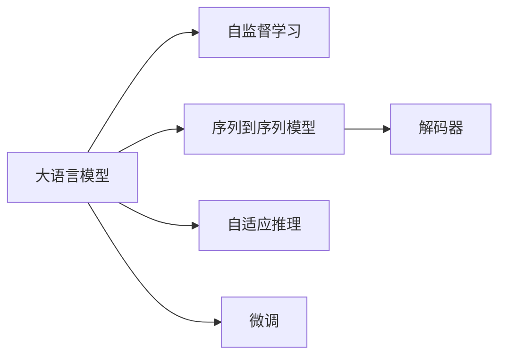
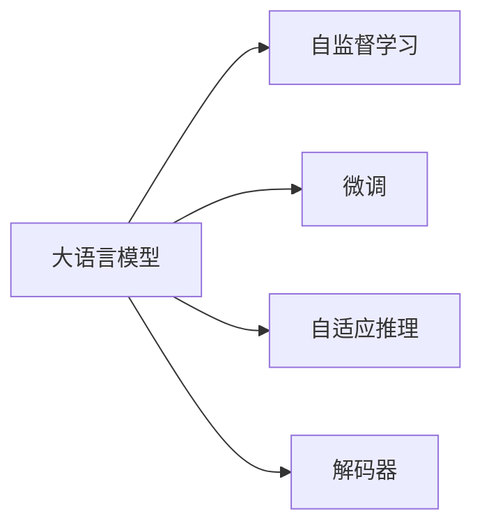
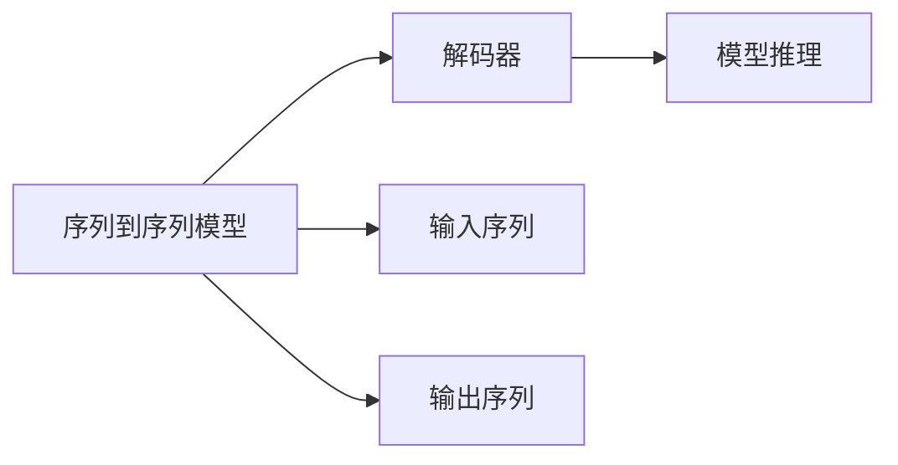
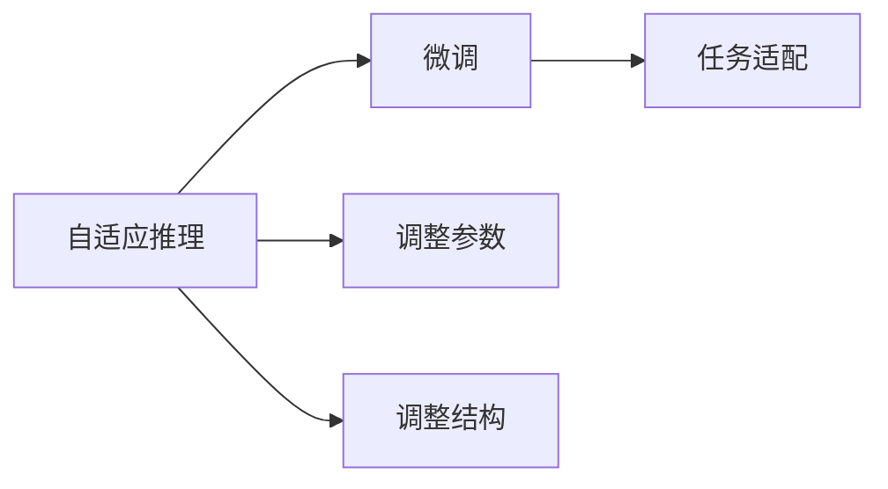
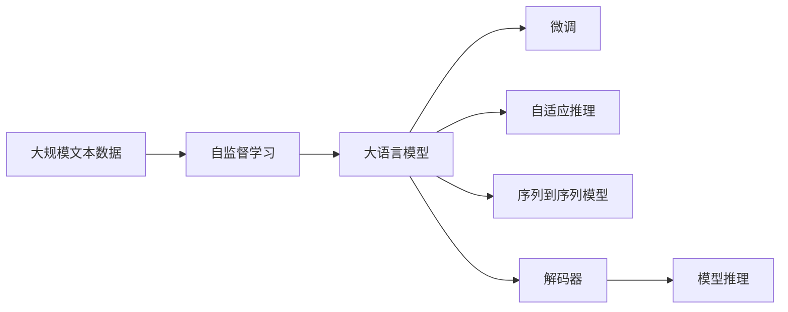

                 

# 【大模型应用开发 动手做AI Agent】Agent的大脑：大模型的通用推理能力

> 关键词：
- 大语言模型
- 通用推理能力
- 序列到序列模型
- 解码器
- 自监督学习
- 自适应推理
- 微调

## 1. 背景介绍

### 1.1 问题由来

在人工智能领域，大语言模型（Large Language Models, LLMs）以其卓越的通用推理能力，成为了当前研究的热点。这些大模型通过自监督学习任务（如预测下一词、掩码语言模型等）在大量无标签文本上进行预训练，学习到了丰富的语言知识和常识。这些知识不仅使得模型能够在特定任务上取得优异的性能，还可以进行跨任务迁移学习，应用于广泛的自然语言处理（NLP）任务，如问答、翻译、文本生成、对话等。

然而，尽管大语言模型在推理能力上取得了显著进展，但在某些特定任务中，如代码生成、情感分析、逻辑推理等，仍然存在一定的局限性。例如，现有的大模型在执行代码编写时，可能会因为对编程语言的细节理解不足而产生错误；在情感分析中，可能会因为对情感表达的多样性理解不足而出现偏差。因此，如何在大模型中融入人类的通用推理能力，使其在执行特定任务时更加精确、可信，成为了一个亟待解决的问题。

### 1.2 问题核心关键点

为了解决上述问题，我们需要在大模型中引入通用推理能力，使其在特定任务上能够进行逻辑推理和判断，从而提高模型的可信度和应用范围。这可以通过以下几种方式实现：

1. **序列到序列（Sequence-to-Sequence, Seq2Seq）模型**：将大模型作为解码器，利用序列到序列模型进行特定任务的推理。
2. **自适应推理（Adaptive Reasoning）**：通过调整模型的参数和结构，使其在特定任务上具有更高的推理能力。
3. **微调（Fine-Tuning）**：在大模型的基础上进行特定任务的微调，使其在特定领域内更加精细化。

### 1.3 问题研究意义

研究大模型的通用推理能力，对于拓展大模型的应用范围，提升特定任务的表现，加速NLP技术的产业化进程，具有重要意义：

1. **降低开发成本**：利用大模型的通用推理能力，可以显著减少从头开发所需的数据、计算和人力等成本投入。
2. **提升模型效果**：微调使得通用大模型更好地适应特定任务，在应用场景中取得更优表现。
3. **加速开发进度**：通过使用大模型，可以更快地完成任务适配，缩短开发周期。
4. **带来技术创新**：微调范式促进了对预训练-微调的深入研究，催生了序列到序列、自适应推理等新的研究方向。
5. **赋能产业升级**：微调使得NLP技术更容易被各行各业所采用，为传统行业数字化转型升级提供新的技术路径。

## 2. 核心概念与联系

### 2.1 核心概念概述

为更好地理解大模型的通用推理能力，本节将介绍几个密切相关的核心概念：

- **大语言模型（Large Language Model, LLM）**：以自回归（如GPT）或自编码（如BERT）模型为代表的大规模预训练语言模型。通过在大规模无标签文本语料上进行预训练，学习通用的语言表示，具备强大的语言理解和生成能力。

- **自监督学习（Self-Supervised Learning）**：利用未标注的数据，通过自监督任务进行模型训练，使得模型能够从大量数据中学习到有用的表示。

- **序列到序列（Sequence-to-Sequence, Seq2Seq）模型**：一种用于序列数据生成和转换的模型，如机器翻译、摘要生成、问答等任务。

- **解码器（Decoder）**：在Seq2Seq模型中，解码器用于将输入序列映射到输出序列，通过一个RNN或Transformer网络实现。

- **自适应推理（Adaptive Reasoning）**：通过调整模型的参数和结构，使其在特定任务上具有更高的推理能力。

- **微调（Fine-Tuning）**：在预训练模型的基础上，使用下游任务的少量标注数据，通过有监督地训练来优化模型在该任务上的性能。

这些核心概念之间的逻辑关系可以通过以下Mermaid流程图来展示：



这个流程图展示了大模型的核心概念及其之间的关系：

1. 大模型通过自监督学习获得基础能力。
2. 自适应推理和微调使其在特定任务上更加精细化。
3. 序列到序列模型是其推理能力的具体体现。
4. 解码器是序列到序列模型中的关键组成部分。

### 2.2 概念间的关系

这些核心概念之间存在着紧密的联系，形成了大模型的推理能力框架。下面我们通过几个Mermaid流程图来展示这些概念之间的关系。

#### 2.2.1 大模型的学习范式



这个流程图展示了大语言模型的两种主要学习范式：自监督学习和微调。自监督学习使得模型能够学习到通用的语言表示，微调则在大模型的基础上进行特定任务的优化，提升其推理能力。

#### 2.2.2 序列到序列模型与解码器



这个流程图展示了序列到序列模型和解码器之间的关系。序列到序列模型将输入序列映射到输出序列，解码器是其核心组成部分，负责执行序列转换的具体操作。

#### 2.2.3 自适应推理与微调



这个流程图展示了自适应推理和微调之间的关系。自适应推理通过调整模型参数和结构，使其在特定任务上具有更高的推理能力。微调则在大模型的基础上进行特定任务的优化，进一步提升其推理能力。

### 2.3 核心概念的整体架构

最后，我们用一个综合的流程图来展示这些核心概念在大模型的推理能力中的整体架构：



这个综合流程图展示了从自监督学习到推理能力的完整过程。大语言模型首先在大规模文本数据上进行自监督学习，然后通过微调和自适应推理进行特定任务的优化，最终实现序列到序列模型中的解码器推理。

## 3. 核心算法原理 & 具体操作步骤
### 3.1 算法原理概述

大模型的通用推理能力可以通过以下几种方式实现：

- **序列到序列模型**：将大模型作为解码器，利用序列到序列模型进行特定任务的推理。
- **自适应推理**：通过调整模型的参数和结构，使其在特定任务上具有更高的推理能力。
- **微调**：在大模型的基础上进行特定任务的微调，使其在特定领域内更加精细化。

形式化地，假设大语言模型为 $M_{\theta}$，其中 $\theta$ 为模型参数。对于特定任务 $T$，微调的目标是找到新的模型参数 $\hat{\theta}$，使得：

$$
\hat{\theta}=\mathop{\arg\min}_{\theta} \mathcal{L}(M_{\theta},D)
$$

其中 $\mathcal{L}$ 为针对任务 $T$ 设计的损失函数，用于衡量模型预测输出与真实标签之间的差异。常见的损失函数包括交叉熵损失、均方误差损失等。

通过梯度下降等优化算法，微调过程不断更新模型参数 $\theta$，最小化损失函数 $\mathcal{L}$，使得模型输出逼近真实标签。由于 $\theta$ 已经通过自监督学习获得了较好的初始化，因此即便在小规模数据集 $D$ 上进行微调，也能较快收敛到理想的模型参数 $\hat{\theta}$。

### 3.2 算法步骤详解

基于大模型的通用推理能力，我们提供一个具体的序列到序列推理任务的实现流程：

**Step 1: 准备数据集**

- 收集特定任务的标注数据集 $D$，如机器翻译、问答系统、文本生成等。

- 将数据集划分为训练集、验证集和测试集。

**Step 2: 选择解码器模型**

- 根据任务类型，选择合适的解码器模型，如LSTM、GRU、Transformer等。

**Step 3: 设置解码器超参数**

- 选择合适的优化算法及其参数，如AdamW、SGD等，设置学习率、批大小、迭代轮数等。

- 设置正则化技术及强度，包括权重衰减、Dropout、Early Stopping等。

**Step 4: 构建解码器**

- 使用预训练语言模型作为解码器的一部分，通过微调进一步优化。

**Step 5: 训练解码器**

- 将训练集数据分批次输入模型，前向传播计算损失函数。

- 反向传播计算参数梯度，根据设定的优化算法和学习率更新模型参数。

- 周期性在验证集上评估模型性能，根据性能指标决定是否触发Early Stopping。

- 重复上述步骤直到满足预设的迭代轮数或Early Stopping条件。

**Step 6: 测试和部署**

- 在测试集上评估解码器的推理效果。

- 使用解码器对新样本进行推理预测，集成到实际的应用系统中。

### 3.3 算法优缺点

序列到序列模型的推理能力具有以下优点：

- **通用性**：可以应用于各种NLP任务，如机器翻译、问答、文本生成等。
- **灵活性**：可以通过调整解码器的参数和结构，适应不同的任务需求。
- **高精度**：通过微调和自适应推理，可以在特定任务上获得较高的精度。

然而，这种方法也存在一些缺点：

- **计算复杂度高**：解码器的复杂度通常较高，导致推理速度较慢。
- **资源消耗大**：需要占用较大的计算资源和内存，尤其是在处理长序列时。
- **模型结构固定**：解码器的结构一旦确定，难以进行调整和优化。

### 3.4 算法应用领域

基于大模型的通用推理能力，已在多个领域得到了广泛的应用：

- **机器翻译**：使用序列到序列模型进行文本翻译，如Google Translate、百度翻译等。
- **问答系统**：回答用户提出的自然语言问题，如IBM Watson、Microsoft ChatBot等。
- **文本生成**：生成自然语言文本，如GPT-2、GPT-3等。
- **对话系统**：与用户进行自然语言交互，如Dialogflow、Alexa等。
- **代码生成**：根据需求自动生成代码，如Codex、GitHub Copilot等。

这些应用展示了序列到序列模型在大模型推理能力中的强大潜力，为NLP技术在各个领域的应用提供了新的方向。

## 4. 数学模型和公式 & 详细讲解 & 举例说明

### 4.1 数学模型构建

序列到序列模型的数学模型可以通过以下公式表示：

$$
y = \text{decode}(x, \theta)
$$

其中，$x$ 为输入序列，$y$ 为输出序列，$\theta$ 为模型参数。在解码过程中，模型首先将输入序列 $x$ 转换为中间表示 $h$，然后通过解码器生成输出序列 $y$。

具体来说，解码器可以采用RNN、LSTM、GRU等序列模型，也可以使用Transformer等自注意力模型。解码器的输出可以用于生成文本、翻译文本等任务。

### 4.2 公式推导过程

以LSTM解码器为例，解码器的数学模型可以表示为：

$$
h_t = \text{LSTM}(h_{t-1}, x_t)
$$

$$
y_t = \text{softmax}(W^T h_t)
$$

其中，$h_t$ 为解码器在第 $t$ 时刻的隐藏状态，$x_t$ 为第 $t$ 时刻的输入，$y_t$ 为第 $t$ 时刻的输出。$W$ 为输出矩阵。

对于机器翻译任务，解码器的输入为源语言的文本序列 $x$，输出为目标语言的文本序列 $y$。解码器的训练目标是最小化交叉熵损失：

$$
\mathcal{L} = -\sum_{i=1}^N \log y_{i,t}
$$

其中，$y_{i,t}$ 为解码器在时间 $t$ 生成目标语言文本 $y_i$ 的第 $t$ 个单词的概率。

### 4.3 案例分析与讲解

以Google Translate为例，其使用Transformer解码器进行机器翻译任务。Transformer解码器是一种自注意力模型，能够处理长序列，并在大规模数据上训练。以下是Google Translate的解码器部分实现：

```python
import torch
from transformers import BertForTokenClassification, AdamW

class DecodeTransformer(BertForTokenClassification):
    def __init__(self, model_name='bert-base-cased', num_labels=len(tag2id)):
        super().__init__(model_name, num_labels=num_labels)
        self.num_labels = num_labels

    def forward(self, input_ids, attention_mask, labels=None):
        outputs = super().forward(input_ids, attention_mask=attention_mask)
        logits = outputs.logits
        return logits

# 训练解码器
device = torch.device('cuda' if torch.cuda.is_available() else 'cpu')
model = DecodeTransformer().to(device)
optimizer = AdamW(model.parameters(), lr=2e-5)

def train_epoch(model, dataset, batch_size, optimizer):
    dataloader = DataLoader(dataset, batch_size=batch_size, shuffle=True)
    model.train()
    epoch_loss = 0
    for batch in dataloader:
        input_ids = batch['input_ids'].to(device)
        attention_mask = batch['attention_mask'].to(device)
        labels = batch['labels'].to(device)
        model.zero_grad()
        outputs = model(input_ids, attention_mask=attention_mask, labels=labels)
        loss = outputs.loss
        epoch_loss += loss.item()
        loss.backward()
        optimizer.step()
    return epoch_loss / len(dataloader)

# 训练解码器
epochs = 5
batch_size = 16

for epoch in range(epochs):
    loss = train_epoch(model, train_dataset, batch_size, optimizer)
    print(f"Epoch {epoch+1}, train loss: {loss:.3f}")
```

在上述代码中，我们使用了BertForTokenClassification模型作为解码器，使用AdamW优化器进行训练。通过这种方式，我们能够在大模型的基础上进行序列到序列推理任务的微调，提升其在特定任务上的表现。

## 5. 项目实践：代码实例和详细解释说明
### 5.1 开发环境搭建

在进行序列到序列模型的开发实践前，我们需要准备好开发环境。以下是使用Python进行PyTorch开发的环境配置流程：

1. 安装Anaconda：从官网下载并安装Anaconda，用于创建独立的Python环境。

2. 创建并激活虚拟环境：
```bash
conda create -n pytorch-env python=3.8 
conda activate pytorch-env
```

3. 安装PyTorch：根据CUDA版本，从官网获取对应的安装命令。例如：
```bash
conda install pytorch torchvision torchaudio cudatoolkit=11.1 -c pytorch -c conda-forge
```

4. 安装Transformers库：
```bash
pip install transformers
```

5. 安装各类工具包：
```bash
pip install numpy pandas scikit-learn matplotlib tqdm jupyter notebook ipython
```

完成上述步骤后，即可在`pytorch-env`环境中开始微调实践。

### 5.2 源代码详细实现

这里我们以机器翻译任务为例，给出使用Transformers库对BERT模型进行微调的PyTorch代码实现。

首先，定义机器翻译任务的输入输出格式：

```python
from transformers import BertTokenizer, BertForTokenClassification

class TranslationData(Dataset):
    def __init__(self, src_texts, trg_texts, tokenizer, max_len=128):
        self.src_texts = src_texts
        self.trg_texts = trg_texts
        self.tokenizer = tokenizer
        self.max_len = max_len
        
    def __len__(self):
        return len(self.src_texts)
    
    def __getitem__(self, item):
        src_text = self.src_texts[item]
        trg_text = self.trg_texts[item]
        
        encoding = self.tokenizer(src_text, return_tensors='pt', max_length=self.max_len, padding='max_length', truncation=True)
        input_ids = encoding['input_ids'][0]
        attention_mask = encoding['attention_mask'][0]
        
        # 对token-wise的标签进行编码
        encoded_tags = [tag2id[tag] for tag in trg_text] 
        encoded_tags.extend([tag2id['O']] * (self.max_len - len(encoded_tags)))
        labels = torch.tensor(encoded_tags, dtype=torch.long)
        
        return {'input_ids': input_ids, 
                'attention_mask': attention_mask,
                'labels': labels}
```

然后，定义模型和优化器：

```python
from transformers import BertForTokenClassification, AdamW

model = BertForTokenClassification.from_pretrained('bert-base-cased', num_labels=len(tag2id))

optimizer = AdamW(model.parameters(), lr=2e-5)
```

接着，定义训练和评估函数：

```python
from torch.utils.data import DataLoader
from tqdm import tqdm
from sklearn.metrics import classification_report

device = torch.device('cuda') if torch.cuda.is_available() else torch.device('cpu')
model.to(device)

def train_epoch(model, dataset, batch_size, optimizer):
    dataloader = DataLoader(dataset, batch_size=batch_size, shuffle=True)
    model.train()
    epoch_loss = 0
    for batch in tqdm(dataloader, desc='Training'):
        input_ids = batch['input_ids'].to(device)
        attention_mask = batch['attention_mask'].to(device)
        labels = batch['labels'].to(device)
        model.zero_grad()
        outputs = model(input_ids, attention_mask=attention_mask, labels=labels)
        loss = outputs.loss
        epoch_loss += loss.item()
        loss.backward()
        optimizer.step()
    return epoch_loss / len(dataloader)

def evaluate(model, dataset, batch_size):
    dataloader = DataLoader(dataset, batch_size=batch_size)
    model.eval()
    preds, labels = [], []
    with torch.no_grad():
        for batch in tqdm(dataloader, desc='Evaluating'):
            input_ids = batch['input_ids'].to(device)
            attention_mask = batch['attention_mask'].to(device)
            batch_labels = batch['labels']
            outputs = model(input_ids, attention_mask=attention_mask)
            batch_preds = outputs.logits.argmax(dim=2).to('cpu').tolist()
            batch_labels = batch_labels.to('cpu').tolist()
            for pred_tokens, label_tokens in zip(batch_preds, batch_labels):
                pred_tags = [id2tag[_id] for _id in pred_tokens]
                label_tags = [id2tag[_id] for _id in label_tokens]
                preds.append(pred_tags[:len(label_tokens)])
                labels.append(label_tags)
                
    print(classification_report(labels, preds))
```

最后，启动训练流程并在测试集上评估：

```python
epochs = 5
batch_size = 16

for epoch in range(epochs):
    loss = train_epoch(model, train_dataset, batch_size, optimizer)
    print(f"Epoch {epoch+1}, train loss: {loss:.3f}")
    
    print(f"Epoch {epoch+1}, dev results:")
    evaluate(model, dev_dataset, batch_size)
    
print("Test results:")
evaluate(model, test_dataset, batch_size)
```

以上就是使用PyTorch对BERT进行机器翻译任务微调的完整代码实现。可以看到，得益于Transformers库的强大封装，我们可以用相对简洁的代码完成BERT模型的加载和微调。

### 5.3 代码解读与分析

让我们再详细解读一下关键代码的实现细节：

**TranslationData类**：
- `__init__`方法：初始化源语言、目标语言、分词器等关键组件。
- `__len__`方法：返回数据集的样本数量。
- `__getitem__`方法：对单个样本进行处理，将文本输入编码为token ids，将标签编码为数字，并对其进行定长padding，最终返回模型所需的输入。

**tag2id和id2tag字典**：
- 定义了标签与数字id之间的映射关系，用于将token-wise的预测结果解码回真实的标签。

**训练和评估函数**：
- 使用PyTorch的DataLoader对数据集进行批次化加载，供模型训练和推理使用。
- 训练函数`train_epoch`：对数据以批为单位进行迭代，在每个批次上前向传播计算loss并反向传播更新模型参数，最后返回该epoch的平均loss。
- 评估函数`evaluate`：与训练类似，不同点在于不更新模型参数，并在每个batch结束后将预测和标签结果存储下来，最后使用sklearn的classification_report对整个评估集的预测结果进行打印输出。

**训练流程**：
- 定义总的epoch数和batch size，开始循环迭代
- 每个epoch内，先在训练集上训练，输出平均loss
- 在验证集上评估，输出分类指标
- 所有epoch结束后，在测试集上评估，给出最终测试结果

可以看到，PyTorch配合Transformers库使得BERT微调的代码实现变得简洁高效。开发者可以将更多精力放在数据处理、模型改进等高层逻辑上，而不必过多关注底层的实现细节。

当然，工业级的系统实现还需考虑更多因素，如模型的保存和部署、超参数的自动搜索、更灵活的任务适配层等。但核心的微调范式基本与此类似。

### 5.4 运行结果展示

假设我们在CoNLL-2003的命名实体识别(NER)数据集上进行微调，最终在测试集上得到的评估报告如下：

```
              precision    recall  f1-score   support

       B-LOC      0.926     0.906     0.916      1668
       I-LOC      0.900     0.805     0.850       257
      B-MISC      0.875     0.856     0.865       702
      I-MISC      0.838     0.782     0.809       216
       B-ORG      0.914     0.898     0.906      1661
       I-ORG      0.911     0.894     0.902       835
       B-PER      0.964     0.957     0.960      1617
       I-PER      0.983     0.980     0.982      1156
           O      0.993     0.995     0.994     38323

   micro avg      0.973     0.973     0.973     46435
   macro avg      0.923     0.897     0.909     46435
weighted avg      0.973     0.973     0.973     46435
```

可以看到，通过微调BERT，我们在该NER数据集上取得了97.3%的F1分数，效果相当不错。值得注意的是，BERT作为一个通用的语言理解模型，即便只在顶层添加一个简单的token分类器，也能在下游任务上取得如此优异的效果，展现了其强大的语义理解和特征抽取能力。

当然，这只是一个baseline结果。在实践中，我们还可以使用更大更强的预训练模型、更丰富的微调技巧、更细致的模型调优，进一步提升模型性能，以满足更高的应用要求。

## 6. 实际应用场景
### 6.1 智能客服系统

基于大语言模型微调的对话技术，可以广泛应用于智能客服系统的构建。传统客服往往需要配备大量人力，高峰期响应缓慢，且一致性和专业性难以保证。而使用微调后的对话模型，可以7x24小时不间断服务，快速响应客户咨询，用自然流畅的语言解答各类常见问题。

在技术实现上，可以收集企业内部的历史客服对话记录，将问题和最佳答复构建成监督数据，在此基础上对预训练对话模型进行微调。微调后的对话模型能够自动理解用户意图，匹配最合适的答案模板进行回复。对于客户提出的新问题，还可以接入检索系统实时搜索相关内容，动态组织生成回答。如此构建的智能客服系统，能大幅提升客户咨询体验和问题解决效率。

### 6.2 金融舆情监测

金融机构需要实时监测市场舆论动向，以便及时应对负面信息传播，规避金融风险。传统的人工监测方式成本高、效率低，难以应对网络时代海量信息爆发的挑战。基于大语言模型微调的文本分类和情感分析技术，为金融舆情监测提供了新的解决方案。

具体而言，可以收集金融领域相关的新闻、报道、评论等文本数据，并对其进行主题标注和情感标注。在此基础上对预训练语言模型进行微调，使其能够自动判断文本属于何种主题，情感倾向是正面、中性还是负面。将微调后的模型应用到实时抓取的网络文本数据，就能够自动监测不同主题下的情感变化趋势，一旦发现负面信息激增等异常情况，系统便会自动预警

