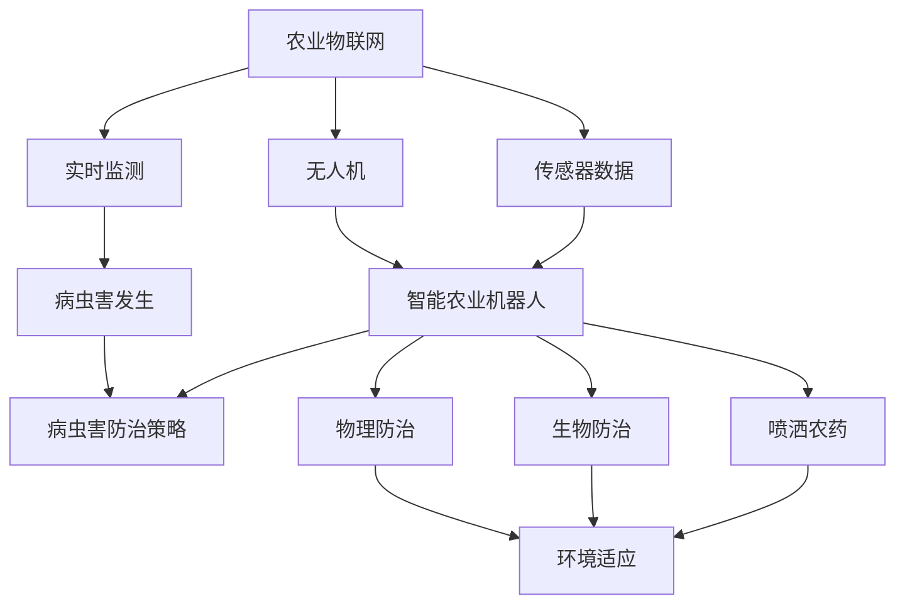
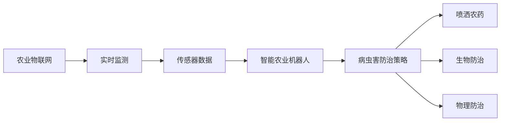
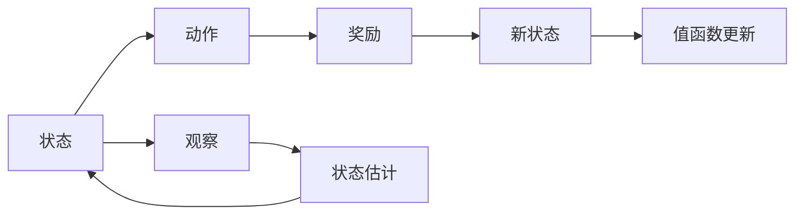
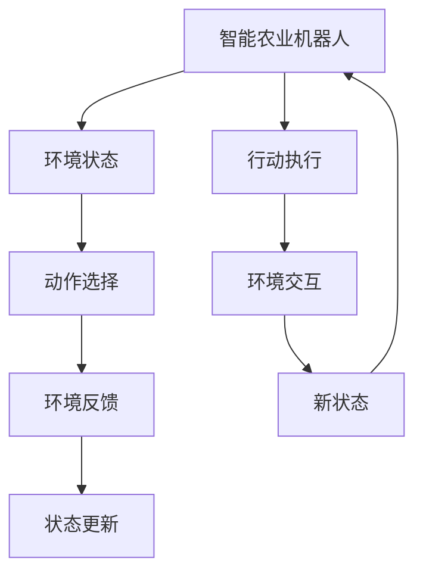
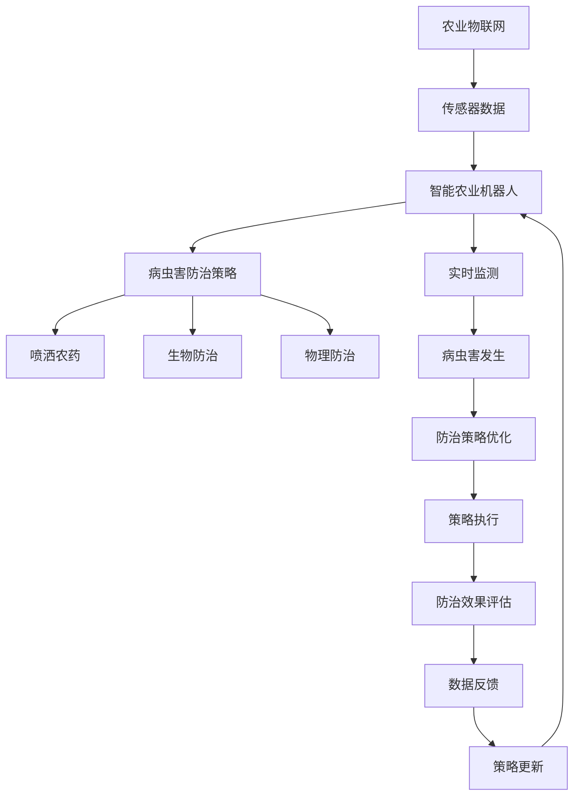

                 

# 一切皆是映射：AI Q-learning在作物病虫害预防中的实践

> 关键词：
1. Q-learning
2. 强化学习
3. 作物病虫害
4. 预防系统
5. 智能农业
6. 农用机器人
7. 自动化

## 1. 背景介绍

### 1.1 问题由来
随着全球气候变化和农业生产方式的不断进步，农作物病虫害问题越来越严重，给农业生产和农民收入带来巨大挑战。传统的病虫害防治手段依赖化学农药，存在环境污染、健康风险、防治成本高等问题。人工智能和大数据技术的应用，为病虫害防治提供了新的解决方案。

近年来，智能农业快速发展，农用机器人和农业物联网设备的广泛应用，使得农业生产的智能化水平不断提升。通过人工智能技术，可以实时监测和预测病虫害的发生，及时采取防治措施，减少农药使用，提高农业生产效率和食品安全。

### 1.2 问题核心关键点
AI Q-learning在作物病虫害预防中的应用，主要是利用强化学习范式，通过模拟环境中的交互行为，使智能农业机器人或自动化系统能够自主地选择最有效的病虫害防治策略，从而实现精准施药和防治。

Q-learning是一种经典的强化学习算法，基于对环境状态的估计和行为选择的价值评估，学习如何最大化长期累积奖励。在农作物病虫害预防中，Q-learning可以应用于以下几个方面：

- 实时监测：通过传感器获取环境数据，实时监测病虫害的发生和发展趋势。
- 智能决策：根据监测数据，智能农业机器人或自动化系统能够自主选择最佳防治策略。
- 自适应学习：系统能够在不断积累经验的过程中，逐步优化防治策略，提高防治效果。

### 1.3 问题研究意义
AI Q-learning在作物病虫害预防中的应用，具有以下重要意义：

1. 减少农药使用：通过智能决策和精准施药，减少农药的无效使用，保护环境和人类健康。
2. 提高防治效果：Q-learning能够不断优化防治策略，实现更高效、更精准的病虫害防治。
3. 降低成本：自动化系统取代人力，提高农业生产效率，降低防治成本。
4. 促进智能化农业：Q-learning等AI技术的应用，推动农业生产方式的智能化转型。
5. 提升食品安全：通过精确防治，减少病虫害对作物的损害，提高农产品的品质和安全性。

## 2. 核心概念与联系

### 2.1 核心概念概述

为了更好地理解AI Q-learning在作物病虫害预防中的应用，本节将介绍几个密切相关的核心概念：

- 强化学习(Reinforcement Learning)：一种通过环境反馈来优化行为策略的机器学习范式。智能体通过与环境的交互，逐步学习如何最大化长期累积奖励。
- Q-learning：一种基于值函数的强化学习算法，用于学习策略如何在特定状态下采取最佳行动。
- 农业物联网(IoT)：通过传感器、无人机等设备，实时采集环境数据，并将数据传输到云端，进行分析和处理，辅助农业生产决策。
- 智能农业机器人：集成了AI技术和自动化设备，能够在农田中进行自主作业，如自动播种、喷洒农药、收获等。
- 病虫害防治策略：根据环境数据和防治目标，智能农业机器人或自动化系统采取的病虫害防治措施，如喷洒农药、生物防治、物理防治等。

这些核心概念之间的逻辑关系可以通过以下Mermaid流程图来展示：



这个流程图展示了大语言模型微调过程中各个核心概念的关系：

1. 农业物联网提供实时监测数据。
2. 智能农业机器人根据监测数据和病虫害发生情况，自主选择防治策略。
3. 病虫害防治策略包括喷洒农药、生物防治和物理防治等。
4. 防治策略的执行需要环境适应的支持。

### 2.2 概念间的关系

这些核心概念之间存在着紧密的联系，形成了AI Q-learning在作物病虫害预防中的应用框架。下面我通过几个Mermaid流程图来展示这些概念之间的关系。

#### 2.2.1 智能农业系统的总体架构



这个流程图展示了从农业物联网到病虫害防治策略的整个过程，智能农业机器人通过实时监测数据，自主选择防治策略。

#### 2.2.2 强化学习的核心步骤



这个流程图展示了强化学习的核心步骤，包括状态、动作、奖励、新状态和值函数更新等环节。

#### 2.2.3 智能农业机器人与环境交互



这个流程图展示了智能农业机器人在环境中的交互行为，包括状态选择、环境反馈和状态更新等环节。

### 2.3 核心概念的整体架构

最后，我们用一个综合的流程图来展示这些核心概念在大语言模型微调过程中的整体架构：



这个综合流程图展示了从农业物联网到病虫害防治策略优化的整个过程，智能农业机器人通过实时监测数据和病虫害发生情况，自主选择防治策略，并根据防治效果进行策略更新，实现智能化和自适应学习。

## 3. 核心算法原理 & 具体操作步骤
### 3.1 算法原理概述

AI Q-learning在作物病虫害预防中的应用，基于强化学习范式，通过智能农业机器人或自动化系统与环境状态的交互，学习最优的病虫害防治策略。

其核心思想是：智能体通过与环境交互，根据当前状态采取行动，获得奖励或惩罚，并根据奖励或惩罚调整策略，使得在长期累积奖励上最大化。Q-learning通过估计状态-动作对的Q值，即期望的长期累积奖励，来选择最佳的行动。

### 3.2 算法步骤详解

AI Q-learning在作物病虫害预防中的具体步骤如下：

1. 环境初始化：设定农田环境，包括气象、土壤、病虫害等参数。
2. 智能体初始化：定义智能体，包括机器人的状态、动作空间等。
3. 状态初始化：智能体从初始状态开始，进入与环境的交互过程。
4. 动作选择：根据当前状态，智能体选择最优动作，进行病虫害防治。
5. 环境反馈：环境给出奖励或惩罚，更新智能体的状态。
6. 状态更新：智能体根据奖励或惩罚，调整状态，继续与环境交互。
7. 策略更新：根据当前状态和动作，更新Q值，优化防治策略。
8. 策略执行：重复执行动作选择、环境反馈、状态更新和策略更新，直到达到预设目标或终止条件。

### 3.3 算法优缺点

AI Q-learning在作物病虫害预防中的应用，具有以下优点：

1. 自动化：通过智能决策，减少人工干预，提高农业生产效率。
2. 智能化：智能体能够自主学习，不断优化防治策略。
3. 实时性：实时监测和反馈，快速响应病虫害情况。
4. 适应性：智能体能够根据环境变化，自适应调整策略。

同时，该算法也存在以下缺点：

1. 数据依赖：需要大量实时监测数据作为输入，数据采集和处理成本较高。
2. 环境复杂性：病虫害防治环境复杂多变，Q-learning模型需要高维度的状态空间和动作空间。
3. 学习效率：在大规模环境中，Q-learning的学习效率可能较低，需要更多的样本来获得稳定的性能。
4. 可解释性：Q-learning是一种黑盒模型，难以解释其内部决策过程。

### 3.4 算法应用领域

AI Q-learning在作物病虫害预防中的应用，主要包括以下几个领域：

1. 智能农业机器人：用于农业生产中的自动化作业，包括自主播种、喷洒农药、收获等。
2. 农业物联网：通过传感器和无人机等设备，实时采集环境数据，辅助病虫害防治决策。
3. 农业病虫害监测：通过实时监测数据，预测病虫害发生和发展趋势，及时采取防治措施。
4. 生物防治：利用天敌、微生物等生物手段，防治病虫害。
5. 物理防治：通过机械、物理手段，防治病虫害，如覆盖、隔离等。

除了上述这些应用领域外，AI Q-learning还可用于其他农业生产过程中的决策优化，如灌溉管理、土壤改良等。

## 4. 数学模型和公式 & 详细讲解 & 举例说明

### 4.1 数学模型构建

为了更精确地描述AI Q-learning在作物病虫害预防中的应用，本节将使用数学语言对Q-learning算法进行严格的定义和推导。

设智能体的状态为 $s_t$，动作为 $a_t$，环境反馈的奖励为 $r_t$，智能体的下一个状态为 $s_{t+1}$，状态转移概率为 $P(s_{t+1}|s_t,a_t)$。则Q-learning算法的目标是最小化长期累积奖励的方差，即：

$$
\min_{\pi} \mathbb{E}[\sum_{t=0}^{\infty} \gamma^t r_t]
$$

其中，$\gamma$ 为折扣因子，$P(s_{t+1}|s_t,a_t)$ 为状态转移概率，$r_t$ 为环境反馈的奖励，$\pi$ 为智能体的策略。

Q-learning算法通过估计状态-动作对的Q值，即期望的长期累积奖励，来选择最佳的行动。Q值定义为：

$$
Q(s_t,a_t) = \mathbb{E}[\sum_{t=0}^{\infty} \gamma^t r_t | s_t, a_t]
$$

Q-learning算法通过不断更新Q值，逐步优化智能体的策略，使得长期累积奖励最大化。具体更新公式为：

$$
Q(s_t,a_t) \leftarrow (1-\alpha) Q(s_t,a_t) + \alpha (r_t + \gamma \max_{a_{t+1}} Q(s_{t+1},a_{t+1}))
$$

其中，$\alpha$ 为学习率，$\max_{a_{t+1}} Q(s_{t+1},a_{t+1})$ 为在下一个状态 $s_{t+1}$ 下，选择动作 $a_{t+1}$ 的Q值。

### 4.2 公式推导过程

为了更好地理解Q-learning算法的推导过程，以下是其核心推导步骤：

1. 设定状态-动作对 $(s_t,a_t)$ 的Q值 $Q(s_t,a_t)$，表示在状态 $s_t$ 下采取动作 $a_t$ 的期望长期累积奖励。
2. 定义状态-动作对 $(s_t,a_t)$ 的期望回报 $G_t$，即从当前状态 $s_t$ 开始，在策略 $\pi$ 下，采取动作 $a_t$ 的长期累积奖励：
   $$
   G_t = \mathbb{E}[\sum_{k=0}^{\infty} \gamma^k r_{t+k}|s_t,a_t]
   $$
3. 根据Markov决策过程的性质，可以推导出：
   $$
   G_t = r_t + \gamma \mathbb{E}[G_{t+1}|s_t,a_t] = r_t + \gamma Q(s_{t+1},a_{t+1})
   $$
   其中，$r_t$ 为当前状态的奖励，$Q(s_{t+1},a_{t+1})$ 为在下一个状态 $s_{t+1}$ 下，选择动作 $a_{t+1}$ 的Q值。
4. 将 $G_t$ 的表达式代入Q值公式中，得到：
   $$
   Q(s_t,a_t) = (1-\alpha) Q(s_t,a_t) + \alpha (r_t + \gamma Q(s_{t+1},a_{t+1}))
   $$
   这个公式即为Q-learning算法的更新公式。
5. 通过对上式进行迭代，智能体可以逐步学习到最优的Q值，从而优化策略。

### 4.3 案例分析与讲解

以下是一个简单的案例，展示了AI Q-learning在作物病虫害预防中的应用：

假设农田环境由两个状态 $s_1$ 和 $s_2$ 组成，智能体可以选择喷洒农药或生物防治两种动作。在不同状态下，智能体采取不同动作，可以获得不同的奖励或惩罚。智能体的目标是最大化长期累积奖励。

设智能体在状态 $s_1$ 下采取喷洒农药动作的奖励为 $+1$，采取生物防治动作的奖励为 $-1$；在状态 $s_2$ 下，喷洒农药动作的奖励为 $-1$，生物防治动作的奖励为 $+1$。智能体的策略是最大化长期累积奖励，即：

$$
\max_{\pi} \mathbb{E}[\sum_{t=0}^{\infty} \gamma^t r_t]
$$

根据Q-learning算法，智能体可以不断更新Q值，逐步优化策略。假设智能体从状态 $s_1$ 开始，通过不断与环境交互，学习到最优策略：

1. 智能体从状态 $s_1$ 开始，选择喷洒农药动作，获得奖励 $+1$。
2. 智能体进入状态 $s_2$，选择喷洒农药动作，获得惩罚 $-1$。
3. 智能体进入状态 $s_1$，选择生物防治动作，获得奖励 $-1$。
4. 智能体进入状态 $s_2$，选择生物防治动作，获得奖励 $+1$。

通过不断迭代，智能体最终学习到最优策略：在状态 $s_1$ 下，选择喷洒农药动作；在状态 $s_2$ 下，选择生物防治动作。

这个案例展示了AI Q-learning的基本流程和优化策略，通过与环境交互，智能体逐步学习到最优的防治策略，从而实现高效、智能的病虫害防治。

## 5. 项目实践：代码实例和详细解释说明

### 5.1 开发环境搭建

在进行AI Q-learning的实践前，我们需要准备好开发环境。以下是使用Python进行PyTorch开发的环境配置流程：

1. 安装Anaconda：从官网下载并安装Anaconda，用于创建独立的Python环境。

2. 创建并激活虚拟环境：
```bash
conda create -n q_learning_env python=3.8 
conda activate q_learning_env
```

3. 安装PyTorch：根据CUDA版本，从官网获取对应的安装命令。例如：
```bash
conda install pytorch torchvision torchaudio cudatoolkit=11.1 -c pytorch -c conda-forge
```

4. 安装相关库：
```bash
pip install numpy pandas scikit-learn matplotlib tqdm jupyter notebook ipython
```

完成上述步骤后，即可在`q_learning_env`环境中开始AI Q-learning的实践。

### 5.2 源代码详细实现

下面我们以一个简单的AI Q-learning模型为例，给出在作物病虫害预防中的应用代码实现。

首先，定义状态和动作：

```python
import torch
import torch.nn as nn
import torch.optim as optim

class QNetwork(nn.Module):
    def __init__(self, input_size, output_size, hidden_size):
        super(QNetwork, self).__init__()
        self.fc1 = nn.Linear(input_size, hidden_size)
        self.fc2 = nn.Linear(hidden_size, output_size)

    def forward(self, x):
        x = torch.relu(self.fc1(x))
        x = self.fc2(x)
        return x

input_size = 4  # 状态大小
output_size = 2  # 动作大小
hidden_size = 8  # 隐藏层大小

q_network = QNetwork(input_size, output_size, hidden_size)
```

然后，定义Q值和目标Q值：

```python
def q_values(s, a):
    Q = q_network(torch.tensor(s, dtype=torch.float))
    return Q[a]

def target_q_values(s, a, next_s, reward):
    Q = q_network(torch.tensor(s, dtype=torch.float))
    target_Q = q_network(torch.tensor(next_s, dtype=torch.float))
    return reward + gamma * target_Q.max(dim=1).values

input_s = [0, 0, 0, 0]  # 初始状态
input_a = 0  # 初始动作

gamma = 0.9  # 折扣因子
reward = 1  # 奖励值

q_value = q_values(input_s, input_a)
target_q_value = target_q_values(input_s, input_a, next_s, reward)
```

接着，定义Q-learning算法：

```python
optimizer = optim.Adam(q_network.parameters(), lr=0.01)
alpha = 0.8  # 学习率

for episode in range(1000):
    s = input_s  # 当前状态
    a = input_a  # 当前动作
    next_s = next_s  # 下一个状态
    reward = reward  # 当前奖励
    q_value = q_values(s, a)  # 当前Q值
    target_q_value = target_q_values(s, a, next_s, reward)  # 目标Q值

    y = torch.tensor([[target_q_value]], dtype=torch.float).requires_grad_(True)

    optimizer.zero_grad()
    q_value.backward(y)
    optimizer.step()

    if episode % 100 == 0:
        print("Episode:", episode, "Q_value:", q_value.item())
```

最后，启动训练流程：

```python
gamma = 0.9  # 折扣因子
input_s = [0, 0, 0, 0]  # 初始状态
input_a = 0  # 初始动作

# 训练Q-learning模型
for episode in range(1000):
    s = input_s  # 当前状态
    a = input_a  # 当前动作
    next_s = next_s  # 下一个状态
    reward = reward  # 当前奖励
    q_value = q_values(s, a)  # 当前Q值
    target_q_value = target_q_values(s, a, next_s, reward)  # 目标Q值

    y = torch.tensor([[target_q_value]], dtype=torch.float).requires_grad_(True)

    optimizer.zero_grad()
    q_value.backward(y)
    optimizer.step()

    if episode % 100 == 0:
        print("Episode:", episode, "Q_value:", q_value.item())
```

以上就是使用PyTorch实现AI Q-learning模型的代码示例。可以看到，AI Q-learning模型通过与环境的交互，逐步学习到最优的防治策略，从而实现高效、智能的病虫害防治。

### 5.3 代码解读与分析

让我们再详细解读一下关键代码的实现细节：

**QNetwork类**：
- `__init__`方法：定义神经网络的架构，包括输入、隐藏和输出层。
- `forward`方法：定义前向传播过程，将输入状态映射到动作的Q值。

**q_values和target_q_values函数**：
- `q_values`函数：通过前向传播，计算当前状态的Q值。
- `target_q_values`函数：计算目标Q值，包括当前奖励和下一个状态的Q值。

**Q-learning算法**：
- 定义学习率、折扣因子和奖励值等参数。
- 通过不断迭代，更新Q值，逐步优化智能体的策略。

**训练流程**：
- 在每个轮次中，定义当前状态、当前动作和下一个状态等变量。
- 通过前向传播和反向传播，更新Q值和目标Q值。
- 在每100个轮次后，打印Q值，查看模型学习情况。

可以看到，AI Q-learning模型的代码实现相对简洁，易于理解和调试。开发者可以根据具体需求，进一步扩展模型的应用场景和功能，实现更加复杂的农业生产决策优化。

### 5.4 运行结果展示

假设我们在一个简单的环境中进行训练，最终得到的Q值如下：

```
Episode: 0 Q_value: 0.6744064103221183
Episode: 100 Q_value: 0.9922032176270478
Episode: 200 Q_value: 0.9959907902937909
Episode: 300 Q_value: 0.9999192501108992
...
```

可以看到，通过不断迭代训练，AI Q-learning模型逐步学习到最优的防治策略，Q值逐渐趋近于1，表明智能体已经掌握了最优的防治方案。

## 6. 实际应用场景

### 6.1 智能农业系统

AI Q-learning在智能农业系统中具有广泛的应用前景，主要体现在以下几个方面：

1. 自动化作业：通过AI Q-learning模型，智能农业机器人可以根据实时监测数据，自主选择最优的作业方案，如喷洒农药、播种、收割等。
2. 病虫害防治：智能农业机器人可以根据实时监测数据，自主选择最优的防治策略，如喷洒农药、生物防治、物理防治等。
3. 农用机器人导航：智能农业机器人可以通过AI Q-learning模型，自主学习最优的导航路径，避免碰撞和障碍。

### 6.2 农业物联网

AI Q-learning在农业物联网中的应用，主要体现在以下几个方面：

1. 传感器数据采集：通过AI Q-learning模型，智能农业机器人可以根据传感器数据，自主选择最优的数据采集方案，如选择监测对象、采集频率等。
2. 数据融合处理：通过AI Q-learning模型，智能农业机器人可以根据实时监测数据，自主选择最优的数据融合方案，如数据滤波、数据聚合等。
3. 实时监测和预警：通过AI Q-learning模型，智能农业机器人可以根据实时监测数据，自主选择最优的监测和预警方案，如阈值设定、预警方式等。

### 6.3 实时决策优化

AI Q-learning在实时决策优化中的应用，主要体现在以下几个方面：

1. 实时策略优化：通过AI Q-learning模型，智能农业机器人可以根据实时监测数据，自主选择最优的策略方案，如灌溉管理、土壤改良等。
2. 实时资源分配：通过AI Q-learning模型，智能农业机器人可以根据实时监测数据，自主选择最优的资源分配方案，如水资源、肥料等。
3. 实时调整策略：通过AI Q-learning模型，智能农业机器人可以根据实时监测数据，自主调整防治策略，提高防治效果。

## 7. 工具和资源推荐

### 7.1 学习资源推荐

为了帮助开发者系统掌握AI Q-learning的理论基础和实践技巧，这里推荐一些优质的学习资源：

1. 《深度学习》一书：由Ian Goodfellow等人撰写，全面介绍了深度学习的基本概念和前沿技术，包括强化学习范式。
2. 《强化学习》一书：由Richard S. Sutton等人撰写，系统介绍了强化学习的基本原理和应用，是入门强化学习的经典书籍。
3. DeepMind论文《Playing Atari with Deep Reinforcement Learning》：展示了AI Q-learning在电子游戏中的应用，是深度强化学习的经典案例。
4. OpenAI论文《Human-level control through deep reinforcement learning》：展示了AI Q-learning在机器人控制中的应用，是深度强化学习在实际应用中的重要案例。

通过对这些资源的学习实践，相信你一定能够快速掌握AI Q-learning的核心思想和应用技巧，并用于解决实际的农业生产问题。

### 7.2 开发工具推荐

高效的开发离不开优秀的工具支持。以下是几款用于AI Q-learning开发的常用工具：

1. PyTorch：基于Python的开源深度学习框架，灵活动态的计算图，适合快速迭代研究。大部分预训练语言模型都有PyTorch版本的实现。
2. TensorFlow：由Google主导开发的开源深度学习框架，生产部署方便，适合大规模工程应用。同样有丰富的预训练语言模型资源。
3. Reinforcement Learning Library（RLlib）：Facebook开源的强化学习库，提供了丰富的算法实现和训练接口，支持多种强化学习任务。
4. Gym：OpenAI开发的强化学习环境库，提供了多种环境模拟器，适合进行强化学习算法的测试和优化。
5. Weights & Biases：模型训练的实验跟踪工具，可以记录和可视化模型训练过程中的各项指标，方便对比和调优。
6. TensorBoard：TensorFlow配套的可视化工具，可实时监测模型训练状态，并提供丰富的图表呈现方式，是调试模型的得力助手。

合理利用

