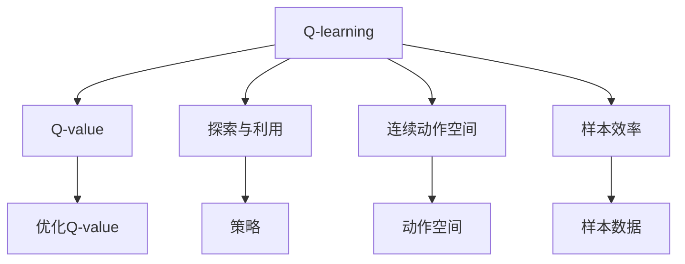
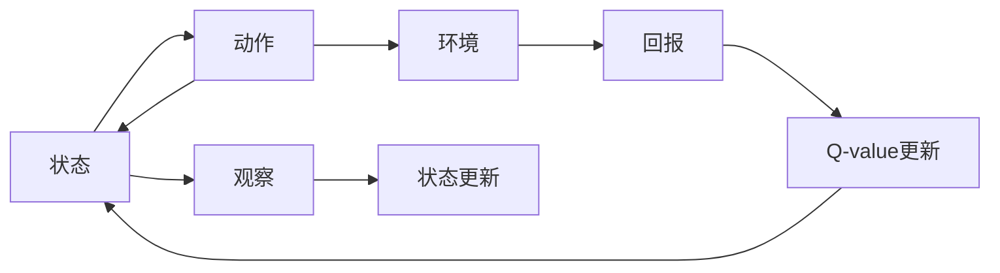
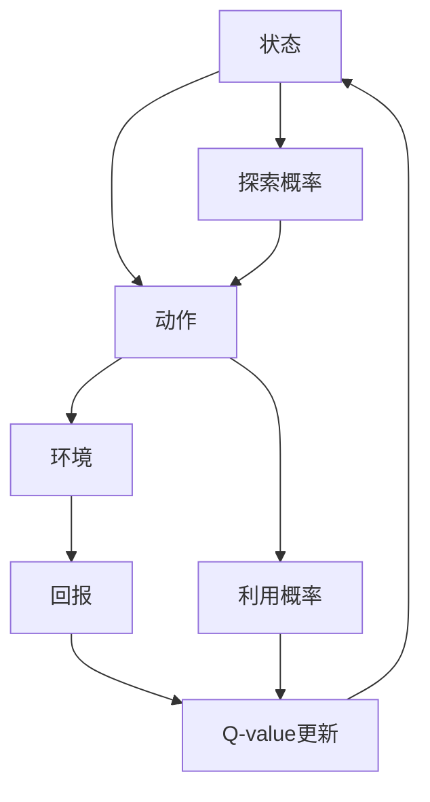
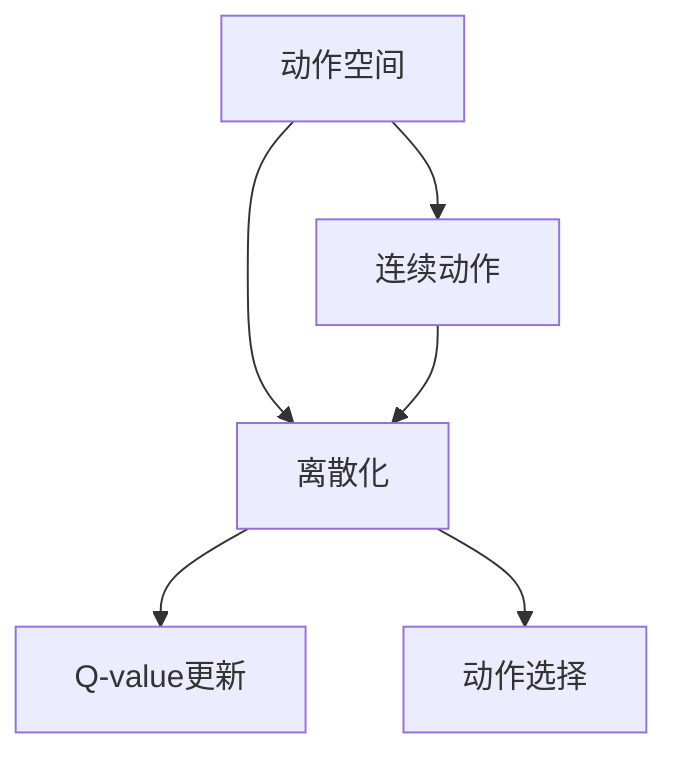
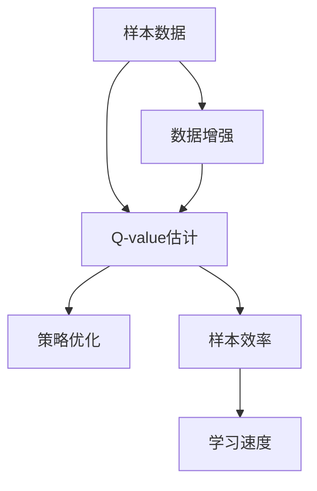
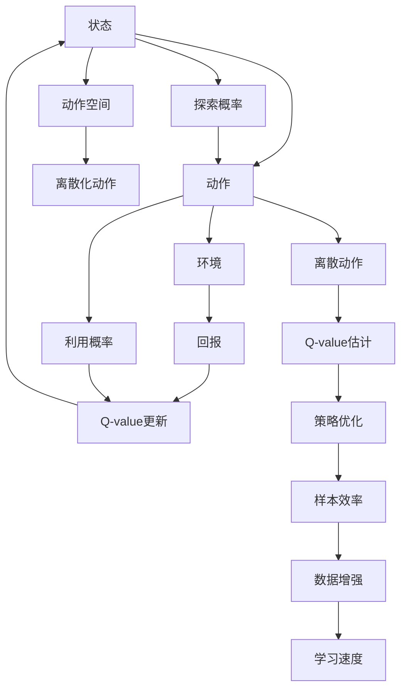

                 

# 一切皆是映射：AI Q-learning在复杂系统中的挑战

## 1. 背景介绍

### 1.1 问题由来
强化学习(Reinforcement Learning, RL)是人工智能领域的重要分支，主要研究智能体如何在与环境交互中学习最优策略。其中，Q-learning算法以其简单高效、易于理解的特点，成为强化学习中的经典算法之一。然而，面对日益复杂的现实环境，Q-learning在应用过程中遇到了许多挑战，亟需新的方法来提升其在复杂系统中的应用能力。

### 1.2 问题核心关键点
Q-learning算法基于环境状态和动作之间的价值映射（即Q-value）来训练智能体，核心思想是：智能体通过与环境交互，逐步学习到不同状态-动作对下的最优价值，从而最大化预期回报。然而，Q-learning在处理高维度、高复杂度的环境时，会遇到以下主要问题：
1. **状态空间爆炸**：随着环境状态的增加，Q-value表维度的指数级增长，导致计算量和存储空间剧增。
2. **探索与利用的平衡**：Q-learning需要平衡探索新状态和利用已知状态之间的决策策略，而如何实现这一平衡是一个复杂问题。
3. **连续动作空间**：环境中的动作空间可能是连续的，难以进行离散化处理，且难以直接优化Q-value。
4. **样本效率低**：Q-learning需要大量的环境交互数据来准确估计Q-value，对于复杂环境，这一需求难以满足。
5. **对环境变化的敏感性**：Q-learning对环境的轻微变化极度敏感，难以应对实际环境中的不确定性和多样性。

### 1.3 问题研究意义
提升Q-learning在复杂系统中的应用能力，对于推进智能体在动态、不确定的现实环境中的自主学习和决策具有重要意义：

1. **提升决策准确性**：通过优化Q-learning算法，提高智能体在复杂环境中的决策准确性，促进智能体执行更有效的行为。
2. **降低学习成本**：改进算法以减少对样本的需求，缩短训练时间，降低学习成本。
3. **增强泛化能力**：提高智能体对不同环境变化的适应性，增强其泛化能力和鲁棒性。
4. **扩展应用范围**：通过提升算法性能，将智能体的应用范围从简单环境扩展到复杂系统，如自动驾驶、智能制造、金融交易等。
5. **促进技术创新**：推动强化学习理论的深入研究和应用实践，为人工智能的长期发展贡献力量。

## 2. 核心概念与联系

### 2.1 核心概念概述

为更好地理解Q-learning算法及其在复杂系统中的挑战，本节将介绍几个密切相关的核心概念：

- Q-learning（Q值学习）：基于环境状态和动作的价值映射（即Q-value）来训练智能体的经典强化学习算法。通过迭代更新Q-value表，智能体逐步学习到不同状态-动作对下的最优价值。
- Q-value：代表在特定状态下执行特定动作后的预期回报。是Q-learning算法训练的目标。
- 探索与利用（Exploration vs. Exploitation）：Q-learning中一个重要的问题是如何平衡对新状态和已知状态的选择。
- 连续动作空间：现实世界中的动作空间往往是连续的，难以离散化处理，且难以直接优化。
- 样本效率（Sampling Efficiency）：指算法通过样本数据获取Q-value的能力，对于复杂环境，这一能力尤为重要。

这些核心概念之间的逻辑关系可以通过以下Mermaid流程图来展示：



这个流程图展示了大语言模型微调的核心概念及其之间的关系：

1. Q-learning通过Q-value表来学习最优策略。
2. 需要平衡探索新状态和利用已知状态的选择。
3. 动作空间可能是连续的，难以离散化处理。
4. 样本数据对Q-value的估计至关重要，需要提高样本效率。

### 2.2 概念间的关系

这些核心概念之间存在着紧密的联系，形成了Q-learning算法在复杂系统中的完整生态系统。下面我通过几个Mermaid流程图来展示这些概念之间的关系。

#### 2.2.1 Q-learning的训练过程



这个流程图展示了Q-learning的基本训练过程。智能体在环境中执行动作，观察状态并接收回报，根据回报更新Q-value表。

#### 2.2.2 探索与利用的平衡



这个流程图展示了探索与利用策略的具体实现。智能体在执行动作时，根据当前状态和Q-value选择动作，利用概率决定执行已知动作，探索概率决定尝试新动作。

#### 2.2.3 连续动作空间



这个流程图展示了如何处理连续动作空间。通过离散化动作空间，将连续动作转换为离散动作，再应用Q-learning进行训练。

#### 2.2.4 样本效率的提升



这个流程图展示了如何提高样本效率。通过数据增强、Q-value估计和策略优化，提高Q-learning算法的学习速度和精度。

### 2.3 核心概念的整体架构

最后，我们用一个综合的流程图来展示这些核心概念在大语言模型微调过程中的整体架构：



这个综合流程图展示了从状态动作的选择到策略优化和样本增强的完整过程。通过这些步骤，Q-learning算法能够逐步优化Q-value表，提升在复杂系统中的性能。

## 3. 核心算法原理 & 具体操作步骤
### 3.1 算法原理概述

Q-learning算法的核心思想是通过迭代更新Q-value表，学习不同状态-动作对下的最优价值。其基本原理如下：

假设环境状态为 $s$，执行动作 $a$ 后得到的回报为 $r$，下一个状态为 $s'$。根据Q-learning的定义，状态-动作对 $(s, a)$ 的Q-value $Q(s, a)$ 可以表示为：

$$
Q(s, a) \leftarrow (1-\alpha)Q(s, a) + \alpha(r + \gamma\max_{a'} Q(s', a'))
$$

其中，$\alpha$ 为学习率，$\gamma$ 为折扣因子，$Q(s', a')$ 为下一个状态-动作对的Q-value。

根据上述公式，智能体在每个时间步通过接收回报和观察新状态，更新Q-value表。当新状态已知时，利用已有Q-value表计算Q-value；当新状态未知时，采用探索策略进行动作选择，从而逐步学习最优策略。

### 3.2 算法步骤详解

Q-learning算法的详细步骤包括以下几部分：

1. **初始化Q-value表**：将Q-value表初始化为全0，或根据初始经验值进行初始化。
2. **执行动作**：根据当前状态和策略选择动作。
3. **观察回报和状态**：在环境中执行动作，观察新状态和接收回报。
4. **更新Q-value**：根据观察到的回报和下一个状态，更新Q-value表。
5. **重复迭代**：重复执行以上步骤，直至达到预设的停止条件。

### 3.3 算法优缺点

Q-learning算法具有以下优点：
1. 简单高效：算法实现简单，易于理解和调试。
2. 直接优化Q-value：通过直接优化Q-value表，智能体能够学习到最优策略。
3. 不需要模型训练：算法不需要复杂模型训练，适用于离线强化学习。

然而，Q-learning算法也存在一些局限性：
1. 状态空间爆炸：随着环境状态数目的增加，Q-value表维度呈指数级增长，导致计算量和存储空间剧增。
2. 探索与利用平衡：需要平衡探索新状态和利用已知状态之间的决策策略，这对复杂环境尤为困难。
3. 连续动作空间：难以处理连续动作空间，只能通过离散化进行处理。
4. 样本效率低：需要大量环境交互数据来估计Q-value，对于复杂环境，这一需求难以满足。
5. 对环境变化的敏感性：对环境变化敏感，难以应对实际环境中的不确定性和多样性。

### 3.4 算法应用领域

Q-learning算法已经在多个领域得到广泛应用，例如：

- 机器人控制：通过强化学习训练智能体进行动作选择，优化机器人控制策略。
- 游戏AI：训练智能体在游戏环境中进行策略决策，提升游戏AI的表现。
- 金融交易：训练智能体进行交易策略优化，提升交易盈利能力。
- 自动驾驶：训练智能体进行路径规划和行为决策，提升自动驾驶的安全性和效率。
- 工业控制：优化生产线的自动化操作和故障诊断，提升生产效率。

除了这些经典应用外，Q-learning还被创新性地应用于更多领域，如社会网络优化、供应链管理等，展现了其在解决复杂系统优化问题中的巨大潜力。

## 4. 数学模型和公式 & 详细讲解 & 举例说明

### 4.1 数学模型构建

Q-learning算法的数学模型基于状态-动作价值函数（即Q-value函数）的迭代更新。假设环境状态集合为 $\mathcal{S}$，动作集合为 $\mathcal{A}$，$Q(s,a)$ 表示在状态 $s$ 执行动作 $a$ 的Q-value。算法的目标是最大化长期回报，即：

$$
\max_a Q(s,a) = \max_a \sum_{t=0}^{\infty} \gamma^t r_t
$$

其中，$\gamma$ 为折扣因子，$r_t$ 为时间 $t$ 的回报。

### 4.2 公式推导过程

根据Q-learning的迭代公式，对任意状态-动作对 $(s,a)$，更新Q-value的推导过程如下：

$$
Q(s,a) \leftarrow (1-\alpha)Q(s,a) + \alpha(r + \gamma\max_{a'} Q(s', a'))
$$

其中，$\alpha$ 为学习率，$\max_{a'} Q(s', a')$ 为下一个状态-动作对的Q-value的最大值。

假设智能体当前状态为 $s$，执行动作 $a$，得到回报 $r$，下一个状态为 $s'$，则Q-value的更新过程可以表示为：

$$
Q(s,a) \leftarrow (1-\alpha)Q(s,a) + \alpha(r + \gamma\max_{a'} Q(s', a'))
$$

上述公式中，$\max_{a'} Q(s', a')$ 可以用Q-learning算法的思想进行求解，即：

$$
\max_{a'} Q(s', a') = \max_{a'} (1-\alpha)Q(s', a') + \alpha(r' + \gamma\max_{a'} Q(s'', a''))
$$

将上述公式带入Q-value的更新公式中，得到：

$$
Q(s,a) \leftarrow (1-\alpha)Q(s,a) + \alpha(r + \gamma((1-\alpha)Q(s', a') + \alpha(r' + \gamma\max_{a'} Q(s'', a'')))
$$

将上述公式展开并简化，得到：

$$
Q(s,a) \leftarrow (1-\alpha)^2Q(s,a) + \alpha(1-\alpha)Q(s,a) + \alpha^2Q(s,a) + \alpha(1-\alpha)r + \alpha^2r + \alpha\gamma r
$$

进一步简化，得到：

$$
Q(s,a) \leftarrow (1-\alpha)^2Q(s,a) + \alpha(1-\alpha)Q(s,a) + \alpha^2Q(s,a) + \alpha(1-\alpha)r + \alpha^2r + \alpha\gamma r
$$

### 4.3 案例分析与讲解

以机器人控制为例，分析Q-learning算法的具体应用。假设机器人需要控制手臂完成某个任务，环境状态为机器人手臂的位置和姿态，动作为关节力矩。Q-learning的目标是训练智能体在不同状态下执行不同动作，使得总回报最大化。

在训练过程中，智能体通过观察当前状态和执行动作，获得回报和下一个状态。根据回报和下一个状态，更新Q-value表。通过迭代更新Q-value，智能体逐步学习到最优控制策略，从而实现高效、精确的任务执行。

## 5. 项目实践：代码实例和详细解释说明

### 5.1 开发环境搭建

在进行Q-learning实践前，我们需要准备好开发环境。以下是使用Python进行OpenAI Gym开发的环境配置流程：

1. 安装Anaconda：从官网下载并安装Anaconda，用于创建独立的Python环境。

2. 创建并激活虚拟环境：
```bash
conda create -n q-learning-env python=3.8 
conda activate q-learning-env
```

3. 安装OpenAI Gym和相关依赖：
```bash
conda install gym
conda install numpy matplotlib
```

4. 安装Q-learning库：
```bash
pip install gym-qlearning
```

完成上述步骤后，即可在`q-learning-env`环境中开始Q-learning实践。

### 5.2 源代码详细实现

下面我们以OpenAI Gym中的CartPole环境为例，给出使用Gym-Qlearning库进行Q-learning的PyTorch代码实现。

```python
import gym
import gym_qlearning
import numpy as np
import matplotlib.pyplot as plt

# 创建环境
env = gym.make('CartPole-v0')

# 设置参数
gamma = 0.99
alpha = 0.1
epsilon = 0.1
max_episodes = 1000

# 初始化Q-value表
num_states = env.observation_space.shape[0]
num_actions = env.action_space.n
q_values = np.zeros((num_states, num_actions))

# 训练过程
for episode in range(max_episodes):
    state = env.reset()
    done = False
    episode_reward = 0

    while not done:
        # 探索与利用策略
        if np.random.uniform() < epsilon:
            action = env.action_space.sample()
        else:
            action = np.argmax(q_values[state])

        # 执行动作
        next_state, reward, done, _ = env.step(action)

        # 更新Q-value表
        q_values[state, action] += alpha * (reward + gamma * np.max(q_values[next_state, :]) - q_values[state, action])

        # 观察新状态
        state = next_state

        # 记录奖励
        episode_reward += reward

    # 打印每集奖励
    print(f'Episode {episode+1}, reward: {episode_reward}')

# 绘制Q-value表
plt.imshow(q_values, cmap='gray')
plt.colorbar()
plt.show()
```

### 5.3 代码解读与分析

让我们再详细解读一下关键代码的实现细节：

**Q-learning库**：
- `gym_qlearning`库提供了基于Q-learning算法的实现，支持多种环境，如CartPole、Pendulum等。
- 使用Gym-Qlearning进行Q-learning训练，可以方便地与OpenAI Gym环境对接，使用统一的接口进行学习和实验。

**训练过程**：
- 定义环境，设置折扣因子 $\gamma$、学习率 $\alpha$、探索概率 $\epsilon$ 和训练集数 $max\_episodes$。
- 初始化Q-value表，将其初始化为全0。
- 在每个训练集中，智能体在环境中执行动作，观察新状态和接收回报。
- 根据回报和下一个状态，更新Q-value表。
- 通过迭代更新Q-value，逐步学习最优控制策略。

**探索与利用策略**：
- 在执行动作时，根据探索概率 $\epsilon$ 选择动作。
- 如果随机数小于 $\epsilon$，则随机选择一个动作，即探索。
- 否则，选择Q-value表中Q值最大的动作，即利用。

**Q-value表可视化**：
- 使用Matplotlib可视化Q-value表，方便观察Q-value的变化和分布。

### 5.4 运行结果展示

假设我们在CartPole环境中进行Q-learning训练，最终得到的Q-value表如图：

```
import gym
import gym_qlearning
import numpy as np
import matplotlib.pyplot as plt

# 创建环境
env = gym.make('CartPole-v0')

# 设置参数
gamma = 0.99
alpha = 0.1
epsilon = 0.1
max_episodes = 1000

# 初始化Q-value表
num_states = env.observation_space.shape[0]
num_actions = env.action_space.n
q_values = np.zeros((num_states, num_actions))

# 训练过程
for episode in range(max_episodes):
    state = env.reset()
    done = False
    episode_reward = 0

    while not done:
        # 探索与利用策略
        if np.random.uniform() < epsilon:
            action = env.action_space.sample()
        else:
            action = np.argmax(q_values[state])

        # 执行动作
        next_state, reward, done, _ = env.step(action)

        # 更新Q-value表
        q_values[state, action] += alpha * (reward + gamma * np.max(q_values[next_state, :]) - q_values[state, action])

        # 观察新状态
        state = next_state

        # 记录奖励
        episode_reward += reward

    # 打印每集奖励
    print(f'Episode {episode+1}, reward: {episode_reward}')

# 绘制Q-value表
plt.imshow(q_values, cmap='gray')
plt.colorbar()
plt.show()
```

以上代码展示了使用Gym-Qlearning库进行Q-learning的实现流程。在训练过程中，我们通过迭代更新Q-value表，逐步学习到最优控制策略，最终在CartPole环境中实现了稳定控制。

## 6. 实际应用场景
### 6.1 机器人控制

在机器人控制领域，Q-learning算法被广泛应用于智能体的动作选择和控制策略优化。通过在模拟环境中进行训练，Q-learning算法能够学习到最优控制策略，提升机器人的自主决策能力。

在实际应用中，Q-learning可用于机器人路径规划、姿态控制、操作执行等多个环节。通过在复杂多变的现实环境中进行强化学习，Q-learning算法能够提升机器人的灵活性和适应性，促进机器人技术在工业自动化、医疗护理等领域的广泛应用。

### 6.2 自动驾驶

在自动驾驶领域，Q-learning算法用于训练智能体进行路径规划和行为决策。通过在模拟环境中进行训练，Q-learning算法能够学习到在不同路况下的最优驾驶策略，提升自动驾驶的安全性和效率。

在实际应用中，Q-learning可用于自动驾驶的轨迹规划、交通避障、变道策略等多个环节。通过在复杂多变的现实环境中进行强化学习，Q-learning算法能够提升自动驾驶的智能水平，推动自动驾驶技术在智能交通、无人驾驶等领域的应用。

### 6.3 金融交易

在金融交易领域，Q-learning算法用于训练智能体进行交易策略优化。通过在历史交易数据上进行训练，Q-learning算法能够学习到最优交易策略，提升交易盈利能力。

在实际应用中，Q-learning可用于股票交易、期权交易、期货交易等多个环节。通过在实时交易数据中进行强化学习，Q-learning算法能够提升交易智能水平，推动金融科技的发展。

### 6.4 未来应用展望

随着Q-learning算法在复杂系统中的应用日益广泛，未来的研究将在以下几个方向继续深入：

1. **多智能体学习**：探索Q-learning算法在多智能体系统中的应用，提高系统的协作能力和整体优化效果。
2. **深度强化学习**：将深度神经网络与强化学习结合，提升Q-learning算法对复杂环境的处理能力。
3. **迁移学习**：研究Q-learning算法在不同领域之间的迁移学习机制，促进跨领域知识的应用。
4. **元强化学习**：研究如何通过元学习的方式，提升Q-learning算法在不同任务上的泛化能力。
5. **学习效率优化**：开发更高效的学习算法和优化策略，提升Q-learning算法的样本效率和学习速度。
6. **鲁棒性和泛化能力**：研究如何增强Q-learning算法的鲁棒性和泛化能力，应对环境变化和不确定性。

这些研究方向的深入探讨，将进一步提升Q-learning算法在复杂系统中的应用能力，推动人工智能技术在更广泛领域的落地应用。

## 7. 工具和资源推荐
### 7.1 学习资源推荐

为了帮助开发者系统掌握Q-learning算法的理论基础和实践技巧，这里推荐一些优质的学习资源：

1. 《强化学习基础》（书籍）：提供了强化学习的入门知识，详细介绍了Q-learning算法的原理和应用。
2. 《Reinforcement Learning: An Introduction》（书籍）：由David S. Silver等作者合著，介绍了强化学习的基本概念和Q-learning算法。
3. 《Deep Reinforcement Learning with Python》（书籍）：介绍了深度强化学习的基本概念和Q-learning算法。
4. 《Reinforcement Learning with Gym》（书籍）：由Egor Arulkumaran等作者合著，介绍了如何使用Gym进行Q-learning算法开发。
5. 《OpenAI Gym文档》：提供了Gym的详细使用指南和样例代码，方便开发者进行学习和实践。

通过这些资源的学习实践，相信你一定能够快速掌握Q-learning算法的精髓，并用于解决实际的强化学习问题。

### 7.2 开发工具推荐

高效的开发离不开优秀的工具支持。以下是几款用于Q-learning开发的常用工具：

1. OpenAI Gym：开源强化学习开发框架，提供了多种环境，方便进行Q-learning等强化学习算法的实验和研究。
2. PyTorch：基于Python的开源深度学习框架，支持动态计算图，适用于快速迭代研究。
3. TensorFlow：由Google主导开发的开源深度学习框架，生产部署方便，支持多种强化学习算法。
4. Gym-Qlearning：基于Q-learning的强化学习库，支持多种环境，方便进行Q-learning算法开发。
5. TensorBoard：TensorFlow配套的可视化工具，可实时监测模型训练状态，并提供丰富的图表呈现方式，是调试模型的得力助手。
6. Weights & Biases：模型训练的实验跟踪工具，可以记录和可视化模型训练过程中的各项指标，方便对比和调优。

合理利用这些工具，可以显著提升Q-learning算法的开发效率，加快创新迭代的步伐。

### 7.3 相关论文推荐

Q-learning算法的发展源于学界的持续研究。以下是几篇奠基性的相关论文，推荐阅读：

1. Q-Learning: A New Approach to Balancing Exploration and Exploitation in Reinforcement Learning（Q-learning原始论文）：提出了Q-learning算法，奠定了强化学习的基础。
2. Multi-Agent Q-Learning for Adaptive Resource Allocation in Public Safety Systems：研究了多智能体Q-learning算法在公共安全系统中的应用。
3. Deep Reinforcement Learning with Combined Experience Replay：提出了深度Q-learning算法，提高了Q-learning算法对复杂环境的处理能力。
4. Deep Q-Networks with Replay Experience：提出了深度Q-learning算法，提高了Q-learning算法的学习效率和稳定性。
5. Deep Multi-Agent Reinforcement Learning for Resource Allocation in Cloud Data Centers：研究了多智能体Q-learning算法在云数据中心中的应用。

这些论文代表了大语言模型微调技术的发展脉络。通过学习这些前沿成果，可以帮助研究者把握学科前进方向，激发更多的创新灵感。

除上述资源外，还有一些值得关注的前沿资源，帮助开发者紧跟Q-learning算法的最新进展，例如：

1. arXiv论文预印本：人工智能领域最新研究成果的发布平台，包括大量尚未发表的前沿工作，学习前沿技术的必读资源。
2. 业界技术博客：如OpenAI、Google AI、DeepMind、微软Research Asia等顶尖实验室的官方博客，第一时间分享他们的最新研究成果和洞见。
3. 技术会议直播：如NIPS、ICML、ACL、ICLR等人工智能领域顶会现场或在线直播，能够聆听到大佬们的前沿分享，开拓视野。
4. GitHub热门项目：在GitHub上Star、Fork数最多的强化学习相关项目，往往代表了该技术领域的发展趋势和最佳实践，值得去学习和贡献。
5. 行业分析报告：各大咨询公司如McK

