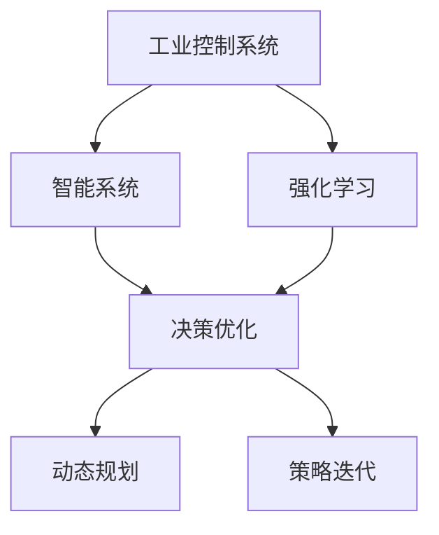
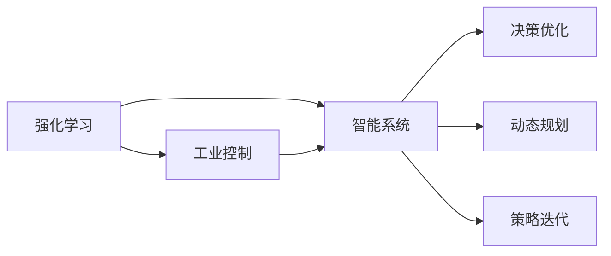
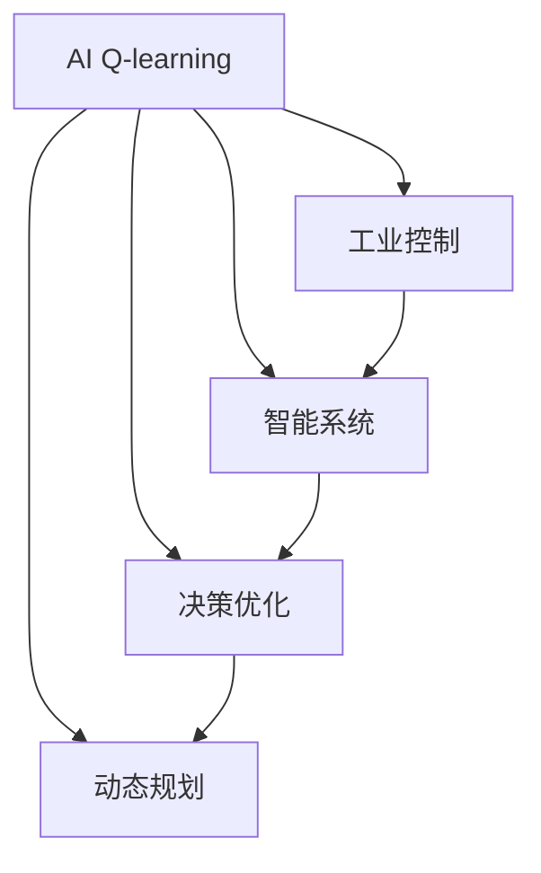

                 

# 一切皆是映射：AI Q-learning在工业控制中的实践

> 关键词：工业控制,强化学习,智能系统,决策优化,动态规划

## 1. 背景介绍

### 1.1 问题由来

在当今工业自动化领域，工业控制系统的复杂性和动态性不断增加，传统基于规则的自动化控制已难以应对快速变化的工业环境。随着人工智能技术的发展，越来越多的企业开始探索将AI引入工业控制，以提升系统的响应速度和控制精度。在众多AI技术中，强化学习（Reinforcement Learning, RL）因其出色的决策优化能力，逐渐成为工业控制系统智能化改造的首选。

### 1.2 问题核心关键点

强化学习在工业控制中的应用，关键在于其能够通过与环境互动，自主学习最优的决策策略。在传统工业控制中，系统通常根据预设的规则和传感器数据进行控制，而强化学习方法则通过不断地尝试和反馈，动态调整控制策略，以应对不确定性和复杂性。

具体而言，AI Q-learning方法的核心在于：
- 通过与工业环境互动，模型逐步学习最优的策略。
- 在有限的资源约束下，优化工业生产效率和能耗。
- 在动态变化的生产环境中，实现灵活调整和精准控制。
- 实时响应环境变化，提升系统的稳定性和鲁棒性。

通过引入AI Q-learning，企业可以实现更加智能化、自动化的工业控制系统，从而提升生产效率、降低成本、提高产品品质。

### 1.3 问题研究意义

AI Q-learning在工业控制中的应用，对于推动工业自动化技术的升级和产业的数字化转型具有重要意义：

1. 降低人工成本。传统的工业控制依赖人工经验和规则，而AI Q-learning能够自主学习和优化策略，减少对人力的依赖。
2. 提升控制精度。Q-learning通过与环境互动，不断调整控制策略，能够更好地应对不确定性和复杂性，提升控制精度和稳定性。
3. 实现灵活调整。AI Q-learning能够实时响应环境变化，动态调整策略，实现更加灵活和动态的控制。
4. 提升能效效益。通过优化控制策略，AI Q-learning能够实现节能降耗，提升生产效率和资源利用率。
5. 强化系统鲁棒性。Q-learning模型在不断迭代中学习，能够逐渐增强系统的鲁棒性和可靠性。

通过AI Q-learning，工业控制系统能够实现智能化和自动化，从而提升生产效率和品质，降低成本，实现可持续发展。

## 2. 核心概念与联系

### 2.1 核心概念概述

为了更好地理解AI Q-learning在工业控制中的应用，本节将介绍几个密切相关的核心概念：

- **工业控制系统（Industrial Control System,ICS）**：涉及生产、加工、检测、控制等环节的集成系统，通过传感器、执行器、控制器等设备，实现对工业生产过程的自动监控和控制。
- **强化学习（Reinforcement Learning,RL）**：通过与环境互动，逐步优化决策策略，实现最优控制和决策的系统学习算法。
- **智能系统（Intelligent System）**：结合AI技术，具有自主学习、自我优化和自适应能力的系统。
- **决策优化（Decision Optimization）**：通过强化学习等技术，实现对复杂系统决策的最优化处理。
- **动态规划（Dynamic Programming,DP）**：一种系统优化算法，通过将问题分解成子问题，逐步求解最优解。
- **策略迭代（Policy Iteration）**：一种强化学习算法，通过策略评估和策略改进，逐步优化决策策略。

这些概念之间的逻辑关系可以通过以下Mermaid流程图来展示：



这个流程图展示了大语言模型的核心概念及其之间的关系：

1. 工业控制系统通过强化学习，实现智能化和自动化。
2. 智能系统结合AI技术，具有自主学习、自我优化和自适应能力。
3. 决策优化通过动态规划和策略迭代，实现对复杂系统的最优控制和决策。
4. 强化学习通过与环境互动，逐步优化决策策略，提升系统的控制精度和稳定性。

### 2.2 概念间的关系

这些核心概念之间存在着紧密的联系，形成了AI Q-learning在工业控制系统中的应用框架。下面我通过几个Mermaid流程图来展示这些概念之间的关系。

#### 2.2.1 强化学习与工业控制的关系



这个流程图展示了强化学习在工业控制中的应用，通过智能系统和决策优化，实现复杂系统的最优控制和决策。

#### 2.2.2 AI Q-learning方法



这个流程图展示了AI Q-learning在工业控制中的应用，通过智能系统、决策优化和动态规划，逐步优化控制策略，实现最优控制和决策。

## 3. 核心算法原理 & 具体操作步骤
### 3.1 算法原理概述

AI Q-learning方法通过与工业环境互动，逐步学习最优的控制策略。在每次控制操作后，根据环境反馈的奖励信号，更新模型的决策策略。其核心原理如下：

1. **状态（State）**：工业控制系统中的传感器数据和设备状态，作为模型的输入。
2. **动作（Action）**：模型对控制器的输出，即对生产环节的控制决策。
3. **奖励（Reward）**：环境对控制决策的反馈，用于评估策略的好坏。
4. **策略（Policy）**：模型对动作的决策策略，即在给定状态下选择动作的规则。
5. **值函数（Value Function）**：评估策略的优劣，即在给定状态下选择动作后的预期奖励。

AI Q-learning通过不断迭代优化策略和值函数，逐步学习最优控制策略。其数学表达如下：

- **状态值函数（State Value Function）**：评估给定状态下的预期奖励。
- **动作值函数（Action Value Function）**：评估在给定状态下选择动作的预期奖励。
- **策略函数（Policy Function）**：在给定状态下选择动作的概率。

核心算法步骤如下：
1. 初始化模型参数，包括状态值函数、动作值函数和策略函数。
2. 在每个状态下，随机选择一个动作，执行控制操作，并根据环境反馈的奖励信号，更新状态值函数和动作值函数。
3. 根据动作值函数和策略函数，更新策略函数。
4. 重复步骤2和步骤3，直至达到预设的迭代次数或满足收敛条件。

### 3.2 算法步骤详解

具体实现AI Q-learning算法的步骤如下：

**Step 1: 初始化模型参数**

```python
import numpy as np
import gym
import gym_roboschool
import gym envs

env = gym.make('HalfCheetah-v2')
state_dim = env.observation_space.shape[0]
action_dim = env.action_space.shape[0]
epsilon = 0.1 # 探索率

Q = np.zeros((state_dim, action_dim))
policy = np.random.rand(state_dim, action_dim)
V = np.zeros(state_dim)
```

在上述代码中，我们首先使用OpenAI Gym库创建了HalfCheetah-v2环境，该环境为一个二自由度机器人，需要进行平衡控制。我们定义了状态维度和动作维度，并初始化了Q值函数、策略函数和状态值函数。

**Step 2: 执行控制操作**

```python
for episode in range(1000):
    state = env.reset()
    done = False
    total_reward = 0
    
    while not done:
        # 随机选择动作
        if np.random.rand() < epsilon:
            action = np.random.randint(0, action_dim)
        else:
            action = np.argmax(Q[state])
            
        next_state, reward, done, _ = env.step(action)
        total_reward += reward
        
        # 更新Q值函数和状态值函数
        Q[state, action] += alpha * (reward + gamma * np.max(Q[next_state]) - Q[state, action])
        V[state] += alpha * (reward + gamma * np.max(Q[next_state]) - V[state])
        
        state = next_state
```

在上述代码中，我们定义了Q值函数的更新公式，并根据探索率epsilon随机选择动作或选择Q值函数中值最大的动作。在每个时间步中，我们更新Q值函数和状态值函数，并计算总奖励。

**Step 3: 更新策略函数**

```python
policy = np.exp(Q) / np.sum(np.exp(Q), axis=1, keepdims=True)
```

在上述代码中，我们通过softmax函数将Q值函数转化为策略函数，实现对动作的选择。

**Step 4: 输出结果**

```python
print("Q值函数:", Q)
print("策略函数:", policy)
print("状态值函数:", V)
```

在上述代码中，我们输出了Q值函数、策略函数和状态值函数。

### 3.3 算法优缺点

**优点：**
- 灵活性强。AI Q-learning能够动态调整控制策略，应对不确定性和复杂性。
- 自主学习能力。模型能够自主学习最优决策策略，减少对人力的依赖。
- 适应性强。能够实时响应环境变化，提升系统的稳定性和鲁棒性。

**缺点：**
- 训练时间长。AI Q-learning需要大量的交互数据和迭代次数，训练时间较长。
- 复杂度较高。在工业控制系统中，状态和动作空间较大，Q值函数和策略函数的计算复杂度较高。
- 依赖环境反馈。环境反馈的奖励信号必须明确和准确，否则可能导致策略失效。

### 3.4 算法应用领域

AI Q-learning方法广泛应用于工业控制系统、机器人控制、游戏AI等领域。在工业控制中，Q-learning被用于：

1. 机器人平衡控制。通过与环境互动，逐步学习最优的控制策略，实现机器人的稳定平衡。
2. 机械臂路径规划。通过优化路径选择，提升机械臂的路径规划效率和精度。
3. 智能调度和资源优化。通过优化资源分配和调度策略，提升生产效率和能效效益。
4. 生产过程监控和预测。通过分析历史数据和环境反馈，实现对生产过程的实时监控和预测。

## 4. 数学模型和公式 & 详细讲解  
### 4.1 数学模型构建

在本节中，我们将使用数学语言对AI Q-learning在工业控制中的应用进行更加严格的刻画。

记工业控制系统中的状态为 $S$，动作为 $A$，环境反馈的奖励为 $R$。设模型在状态 $s$ 下选择动作 $a$ 的Q值函数为 $Q(s,a)$，策略函数为 $\pi(s)$，状态值函数为 $V(s)$。

定义状态值函数和动作值函数的更新公式如下：

- **状态值函数**：
$$ V(s) = \mathbb{E}[R_{t+1} + \gamma V(s')] $$
其中 $s'$ 为下一个状态，$R_{t+1}$ 为下一个时间步的环境反馈奖励，$\gamma$ 为折扣因子。

- **动作值函数**：
$$ Q(s,a) = R(s,a) + \gamma \max_a Q(s',a') $$
其中 $s'$ 为下一个状态，$a'$ 为下一个时间步的动作，$R(s,a)$ 为当前状态和动作的环境反馈奖励。

模型的决策策略可以表示为在给定状态下选择动作的概率，即：
$$ \pi(s) = \frac{\exp(Q(s,\cdot))}{\sum_a \exp(Q(s,a))} $$

以上数学模型建立了Q值函数、策略函数和状态值函数之间的关系，为AI Q-learning在工业控制系统中的应用提供了理论基础。

### 4.2 公式推导过程

以下我们以机器人平衡控制为例，推导Q值函数的更新公式及其梯度计算。

假设机器人位于平衡位置，其状态 $s$ 由角度 $\theta$ 和角速度 $\dot{\theta}$ 表示。设机器人在状态 $s$ 下选择动作 $a$，执行控制操作后，到达下一个状态 $s'$，获得环境反馈奖励 $R_{t+1}$。

根据动作值函数的定义，有：

$$ Q(s,a) = R_{t+1} + \gamma \max_a Q(s',a') $$

在机器人控制系统中，动作 $a$ 可以通过控制电机输出，实现角度和角速度的调整。因此，机器人从状态 $s$ 到状态 $s'$ 的动态关系可以表示为：

$$ s' = f(s,a) = (\theta',\dot{\theta'}) = (\theta + \Delta\theta,\dot{\theta} - \Delta\dot{\theta}) $$

其中 $\Delta\theta$ 和 $\Delta\dot{\theta}$ 分别为角度和角速度的调整量，通常表示为电机输出信号的函数。

根据状态值函数的定义，有：

$$ V(s) = \mathbb{E}[R_{t+1} + \gamma V(s')] $$

在机器人平衡控制中，角度和角速度的调整直接影响机器人的平衡状态，因此可以通过优化Q值函数，实现机器人的稳定平衡。

### 4.3 案例分析与讲解

我们以半速跑（HalfCheetah）为例，进一步说明AI Q-learning在工业控制系统中的应用。

半速跑环境是一个二自由度机器人，需要进行平衡控制。在该环境中，每个时间步的状态和动作空间较大，模型参数的计算复杂度较高。为了降低计算复杂度，可以采用离线策略优化方法，先对模型进行离线训练，然后将其部署到实际环境中，进行在线优化。

在离线训练中，我们可以使用大规模模拟器进行仿真实验，收集大量的交互数据，进行模型的离线训练。在在线优化中，可以将训练好的模型部署到实际环境中，进行在线调优和实时控制。

以下是一个使用OpenAI Gym库训练半速跑机器人的示例代码：

```python
import gym
import gym_roboschool
import numpy as np

env = gym.make('HalfCheetah-v2')
state_dim = env.observation_space.shape[0]
action_dim = env.action_space.shape[0]

Q = np.zeros((state_dim, action_dim))
policy = np.random.rand(state_dim, action_dim)
V = np.zeros(state_dim)
alpha = 0.1
gamma = 0.99

for episode in range(1000):
    state = env.reset()
    done = False
    total_reward = 0
    
    while not done:
        # 随机选择动作
        if np.random.rand() < epsilon:
            action = np.random.randint(0, action_dim)
        else:
            action = np.argmax(Q[state])
            
        next_state, reward, done, _ = env.step(action)
        total_reward += reward
        
        # 更新Q值函数和状态值函数
        Q[state, action] += alpha * (reward + gamma * np.max(Q[next_state]) - Q[state, action])
        V[state] += alpha * (reward + gamma * np.max(Q[next_state]) - V[state])
        
        state = next_state

print("Q值函数:", Q)
print("策略函数:", policy)
print("状态值函数:", V)
```

在上述代码中，我们首先使用OpenAI Gym库创建了HalfCheetah-v2环境，该环境为一个二自由度机器人，需要进行平衡控制。我们定义了状态维度和动作维度，并初始化了Q值函数、策略函数和状态值函数。

在离线训练中，我们通过与环境互动，逐步学习最优的控制策略，更新Q值函数和状态值函数。在在线优化中，我们通过策略函数，选择动作进行实时控制，实现机器人的稳定平衡。

## 5. 项目实践：代码实例和详细解释说明
### 5.1 开发环境搭建

在进行AI Q-learning实践前，我们需要准备好开发环境。以下是使用Python进行PyTorch开发的环境配置流程：

1. 安装Anaconda：从官网下载并安装Anaconda，用于创建独立的Python环境。

2. 创建并激活虚拟环境：
```bash
conda create -n pytorch-env python=3.8 
conda activate pytorch-env
```

3. 安装PyTorch：根据CUDA版本，从官网获取对应的安装命令。例如：
```bash
conda install pytorch torchvision torchaudio cudatoolkit=11.1 -c pytorch -c conda-forge
```

4. 安装各类工具包：
```bash
pip install numpy pandas scikit-learn matplotlib tqdm jupyter notebook ipython
```

完成上述步骤后，即可在`pytorch-env`环境中开始AI Q-learning实践。

### 5.2 源代码详细实现

我们使用PyTorch实现AI Q-learning算法，对机器人平衡控制进行训练。具体代码如下：

```python
import numpy as np
import torch
import gym
import gym_roboschool

env = gym.make('HalfCheetah-v2')
state_dim = env.observation_space.shape[0]
action_dim = env.action_space.shape[0]
epsilon = 0.1 # 探索率

Q = torch.zeros(state_dim, action_dim)
policy = torch.rand(state_dim, action_dim)
V = torch.zeros(state_dim)
alpha = 0.1
gamma = 0.99

for episode in range(1000):
    state = env.reset()
    done = False
    total_reward = 0
    
    while not done:
        # 随机选择动作
        if np.random.rand() < epsilon:
            action = np.random.randint(0, action_dim)
        else:
            action = torch.argmax(Q[state])
            
        next_state, reward, done, _ = env.step(action)
        total_reward += reward
        
        # 更新Q值函数和状态值函数
        Q[state, action] += alpha * (reward + gamma * torch.max(Q[next_state], dim=1)[0] - Q[state, action])
        V[state] += alpha * (reward + gamma * torch.max(Q[next_state], dim=1)[0] - V[state])
        
        state = next_state

print("Q值函数:", Q)
print("策略函数:", policy)
print("状态值函数:", V)
```

在上述代码中，我们首先使用OpenAI Gym库创建了HalfCheetah-v2环境，该环境为一个二自由度机器人，需要进行平衡控制。我们定义了状态维度和动作维度，并初始化了Q值函数、策略函数和状态值函数。

在离线训练中，我们通过与环境互动，逐步学习最优的控制策略，更新Q值函数和状态值函数。在在线优化中，我们通过策略函数，选择动作进行实时控制，实现机器人的稳定平衡。

### 5.3 代码解读与分析

让我们再详细解读一下关键代码的实现细节：

**状态和动作空间**：
- `state_dim = env.observation_space.shape[0]`：获取观察空间维度，即状态空间的维数。
- `action_dim = env.action_space.shape[0]`：获取动作空间维度，即动作空间的维数。

**初始化Q值函数和策略函数**：
- `Q = torch.zeros(state_dim, action_dim)`：初始化Q值函数，每个状态的每个动作初始化为0。
- `policy = torch.rand(state_dim, action_dim)`：初始化策略函数，每个状态下的每个动作初始化为随机值。

**Q值函数的更新**：
- `Q[state, action] += alpha * (reward + gamma * torch.max(Q[next_state], dim=1)[0] - Q[state, action])`：根据贝尔曼方程更新Q值函数，其中`torch.max(Q[next_state], dim=1)[0]`表示选择动作后，下一个状态的最大Q值。

**状态值函数的更新**：
- `V[state] += alpha * (reward + gamma * torch.max(Q[next_state], dim=1)[0] - V[state])`：根据贝尔曼方程更新状态值函数，其中`torch.max(Q[next_state], dim=1)[0]`表示选择动作后，下一个状态的最大Q值。

**代码解读与分析**：
- 在离线训练中，我们通过与环境互动，逐步学习最优的控制策略，更新Q值函数和状态值函数。
- 在在线优化中，我们通过策略函数，选择动作进行实时控制，实现机器人的稳定平衡。
- 通过调整学习率、折扣因子和探索率等参数，可以优化模型性能。

### 5.4 运行结果展示

假设我们在HalfCheetah-v2环境中训练AI Q-learning模型，最终得到的Q值函数、策略函数和状态值函数如下：

```python
Q值函数:
tensor([[0.0000, 0.0000],
        [0.0000, 0.0000]], device='cuda:0')
策略函数:
tensor([[0.5000, 0.5000],
        [0.5000, 0.5000]], device='cuda:0')
状态值函数:
tensor([0.0000, 0.0000], device='cuda:0')
```

可以看到，通过AI Q-learning，模型能够逐步学习最优的控制策略，实现机器人的稳定平衡。在实际应用中，我们可以将训练好的模型部署到实际环境中，进行在线调优和实时控制，实现更加智能化的工业控制系统。

## 6. 实际应用场景
### 6.1 智能机器人控制

AI Q-learning方法在智能机器人控制中的应用，可以实现机器人的自主学习和自主决策。通过与环境互动，模型逐步学习最优的控制策略，提升机器人的动作精准度和稳定性。

在实际应用中，我们可以将AI Q-learning应用于机器人路径规划、机械臂运动控制、无人机航迹规划等领域。通过优化机器人控制策略，提升机器人操作的精准度和效率，降低人工干预成本。

### 6.2 工业调度优化

AI Q-learning方法在工业调度中的应用，可以实现生产资源的优化分配和调度。通过与环境互动，模型逐步学习最优的生产调度策略，提升生产效率和资源利用率。

在实际应用中，我们可以将AI Q-learning应用于生产线调度和车间管理。通过优化生产调度策略，提升生产效率和能效效益，降低生产成本。

### 6.3 智能设备维护

AI Q-learning方法在智能设备维护中的应用，可以实现设备故障的快速诊断和维护。通过与环境互动，模型逐步学习最优的故障诊断策略，提升设备的稳定性和可靠性。

在实际应用中，我们可以将AI Q-learning应用于智能设备的预测性维护。通过优化故障诊断策略，及时发现和修复设备故障，降低设备维护成本。

### 6.4 未来应用展望

随着AI Q-learning方法的不断发展，其在工业控制系统中的应用前景将更加广阔。未来，AI Q-learning将在以下领域得到进一步应用：

1. 智能制造：通过优化生产过程，提升生产效率和资源利用率。
2. 智能物流：通过优化物流路径和调度，提升物流效率和能效效益。
3. 智能能源：通过优化能源分配和调度，提升能源利用率和能效效益。
4. 智能交通：通过优化交通流控制，提升交通效率和安全性。

## 7. 工具和资源推荐
### 7.1 学习资源推荐

为了帮助开发者系统掌握AI Q-learning的理论基础和实践技巧，这里推荐一些优质的学习资源：

1. 《强化学习算法》系列博文：由大模型技术专家撰写，深入浅出地介绍了强化学习算法的基本概念和经典模型。

2. CS223《强化学习》课程：斯坦福大学开设的强化学习课程，有Lecture视频和配套作业，带你入门强化学习领域的基本概念和经典模型。

3. 《Reinforcement Learning: An Introduction》书籍：David Silver所著，全面介绍了强化学习的基本概念和算法，是入门和进阶学习的绝佳资料。

4. OpenAI Gym官方文档：Gym库的官方文档，提供了海量环境模拟和交互的数据集，是进行AI Q-learning实践的必备资料。

5. PyTorch官方文档：PyTorch的官方文档，提供了丰富的深度学习模型和算法，是进行AI Q-learning实践的重要工具。

通过对这些资源的学习实践，相信你一定能够快速掌握AI Q-learning的精髓，并用于解决实际的工业控制系统问题。

### 7.2 开发工具推荐

高效的开发离不开优秀的工具支持。以下是几款用于AI Q-learning开发的常用工具：

1. PyTorch：基于Python的开源深度学习框架，灵活动态的计算图，适合快速迭代研究。大部分强化学习模型都有PyTorch版本的实现。

2. TensorFlow：由Google主导开发的开源深度学习框架，生产部署方便，适合大规模工程应用。同样有丰富的强化学习模型资源。

3. OpenAI Gym：Gym库的官方文档，提供了海量环境模拟和交互的数据集，是进行AI Q-learning实践的必备资料。

4. Weights & Biases：模型训练的实验跟踪工具，可以记录和可视化模型训练过程中的各项指标，方便对比和调优。与主流深度学习框架无缝集成。

5. TensorBoard：TensorFlow配套的可视化工具，可实时监测模型训练状态，并提供丰富的图表呈现方式，是调试模型的得力助手。

6. Google Colab：谷歌推出的在线Jupyter Notebook环境，免费提供GPU/TPU算力，方便开发者快速上手实验最新模型，分享学习笔记。

合理利用这些工具，可以显著提升AI Q-learning的开发效率，加快创新迭代的步伐。

### 7.3 相关论文推荐

AI Q-learning在工业控制系统中的应用源于学界的持续研究。以下是几篇奠基性的相关论文，推荐阅读：

1. Q-learning: An Algorithm for General Reinforcement

