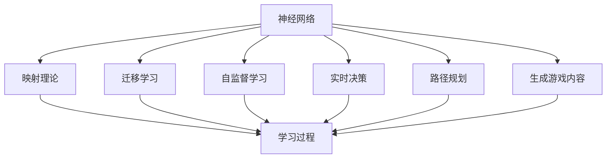
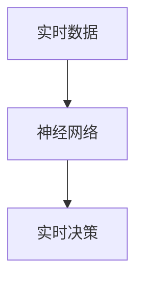
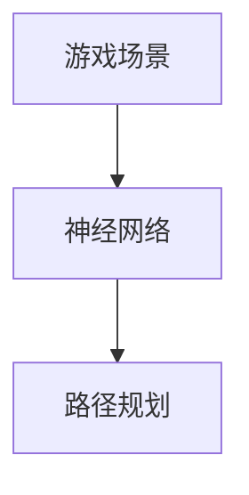
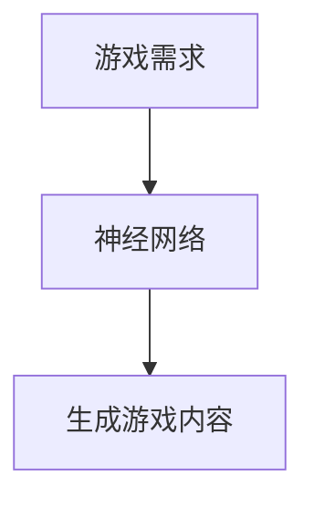
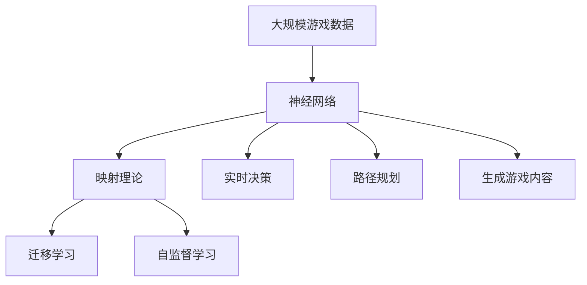

                 

# 一切皆是映射：神经网络在游戏AI中的创新实践

> 关键词：神经网络，游戏AI，创新实践，映射理论，深度学习

## 1. 背景介绍

### 1.1 问题由来

近年来，人工智能在游戏领域的应用日益广泛，从智能推荐系统到自动生成游戏内容，从AI驱动的NPC对话到实时路径规划，深度学习模型在游戏AI的各个方面展现了巨大的潜力。然而，传统的深度学习模型在处理游戏AI中的特定问题时，面临着诸如维度爆炸、数据稀疏、计算复杂度高等诸多挑战。如何在复杂的游戏环境中实现高效、可解释、可控的AI决策，成为游戏AI研究的前沿话题。

### 1.2 问题核心关键点

本文章聚焦于游戏AI中的神经网络创新实践，特别是如何利用神经网络映射理论，通过迁移学习和自监督学习等方法，实现高效、可解释的游戏AI决策。我们将探讨以下核心关键点：

1. 神经网络映射理论在游戏AI中的应用。
2. 迁移学习和自监督学习在游戏AI中的实践。
3. 深度学习模型在实时决策和路径规划中的创新实践。
4. 深度学习在生成游戏内容中的创新实践。

### 1.3 问题研究意义

研究神经网络在游戏AI中的应用，对于提升游戏AI的智能化水平、优化玩家体验、降低开发成本和提升游戏质量具有重要意义。神经网络在游戏AI中的应用，不仅能够提高游戏的智能性和趣味性，还能够为游戏开发者提供一种新的设计思路和技术工具，推动游戏技术的创新和进步。

## 2. 核心概念与联系

### 2.1 核心概念概述

为更好地理解神经网络在游戏AI中的创新实践，本节将介绍几个密切相关的核心概念：

- 神经网络（Neural Network）：由大量人工神经元（即节点）和连接这些节点的边组成的计算模型，用于学习和决策。
- 映射理论（Mapping Theory）：将输入空间映射到输出空间的理论，通过神经网络实现。
- 迁移学习（Transfer Learning）：将一个任务中学到的知识迁移到另一个相关任务中，以提高新任务的性能。
- 自监督学习（Self-Supervised Learning）：利用数据的先验信息（如自相关性、内部结构等）进行学习，无需标签信息。
- 实时决策（Real-time Decision Making）：在游戏AI中，模型需实时处理输入，快速做出响应。
- 路径规划（Pathfinding）：在游戏中，角色需找到最有效的路径，以达成特定目标。
- 生成游戏内容（Generative Game Content）：在游戏设计中，AI需生成新的游戏元素，如故事、角色、物品等。

这些概念之间的逻辑关系可以通过以下Mermaid流程图来展示：



这个流程图展示了神经网络在游戏AI中的核心概念及其之间的关系：

1. 神经网络作为基础，通过映射理论学习输入到输出的映射关系。
2. 迁移学习将知识从源任务迁移到目标任务。
3. 自监督学习利用数据先验进行无监督学习。
4. 实时决策和路径规划是游戏AI中的重要任务。
5. 生成游戏内容是游戏AI的高级应用。
6. 学习过程是这些概念的共同载体，通过神经网络实现映射。

### 2.2 概念间的关系

这些核心概念之间存在着紧密的联系，形成了游戏AI的完整生态系统。下面我通过几个Mermaid流程图来展示这些概念之间的关系。

#### 2.2.1 神经网络的映射过程


这个流程图展示了神经网络通过映射理论将输入映射到输出的过程。

#### 2.2.2 迁移学习在游戏AI中的应用


这个流程图展示了迁移学习在游戏AI中的应用，即通过迁移源任务的知识到目标任务中，提高新任务的性能。

#### 2.2.3 自监督学习在游戏AI中的实践


这个流程图展示了自监督学习在游戏AI中的实践，即利用游戏数据的内部结构和先验信息进行无监督学习。

#### 2.2.4 实时决策在游戏AI中的创新实践



这个流程图展示了神经网络在实时决策中的应用，即通过实时数据输入，快速做出决策。

#### 2.2.5 路径规划在游戏AI中的应用



这个流程图展示了神经网络在路径规划中的应用，即通过游戏场景信息进行路径规划。

#### 2.2.6 生成游戏内容在游戏AI中的应用



这个流程图展示了神经网络在生成游戏内容中的应用，即通过游戏需求生成新的游戏元素。

### 2.3 核心概念的整体架构

最后，我们用一个综合的流程图来展示这些核心概念在游戏AI微调过程中的整体架构：



这个综合流程图展示了从游戏数据输入到生成游戏内容的全过程，展示了神经网络在游戏AI中的核心作用。

## 3. 核心算法原理 & 具体操作步骤
### 3.1 算法原理概述

神经网络在游戏AI中的应用，主要依赖于神经网络的映射理论。该理论将输入数据通过一系列非线性变换，映射到输出空间，实现复杂问题的学习和决策。

游戏AI中的神经网络，通常包括卷积神经网络（CNN）、循环神经网络（RNN）、变种神经网络（如卷积循环神经网络（CRNN））等。这些网络结构在处理游戏数据时，能够捕捉数据的局部特征和时空关系，从而实现高效的决策和生成。

### 3.2 算法步骤详解

神经网络在游戏AI中的应用，主要包括以下几个关键步骤：

1. **数据准备**：收集和预处理游戏数据，包括游戏场景、角色行为、任务目标等，将其转换为神经网络的输入格式。
2. **模型选择**：根据具体任务选择合适的神经网络架构，如CNN、RNN、CRNN等。
3. **模型训练**：使用游戏数据对模型进行训练，优化模型参数，使其能够准确地映射输入到输出。
4. **迁移学习**：将源任务中学习到的知识迁移到目标任务中，以提高新任务的性能。
5. **自监督学习**：利用游戏数据的内部结构和先验信息，进行无监督学习，无需标签信息。
6. **实时决策**：在游戏运行过程中，实时处理输入数据，快速做出决策。
7. **路径规划**：利用神经网络进行路径规划，找到最有效的路径。
8. **生成游戏内容**：利用神经网络生成新的游戏元素，如故事、角色、物品等。

### 3.3 算法优缺点

神经网络在游戏AI中的应用，具有以下优点：

1. 处理复杂数据：神经网络能够处理高维、非线性、时空关系复杂的游戏数据。
2. 高效决策：通过映射理论，神经网络能够实现高效决策。
3. 自适应性强：神经网络能够根据游戏环境的变化，自适应地调整参数。
4. 可扩展性强：神经网络可以通过增加层数和节点数，扩展模型复杂度。

同时，神经网络在游戏AI中的应用，也存在一些缺点：

1. 计算资源需求高：神经网络需要大量的计算资源进行训练和推理。
2. 模型复杂度高：神经网络的结构复杂，容易过拟合。
3. 难以解释：神经网络的决策过程难以解释，缺乏可解释性。
4. 数据依赖性强：神经网络依赖于大量的标注数据进行训练。

### 3.4 算法应用领域

神经网络在游戏AI中的应用，涵盖多个领域，具体如下：

1. **智能推荐系统**：利用神经网络进行游戏推荐，提升用户的游戏体验。
2. **智能对话系统**：通过神经网络实现NPC对话，增强游戏互动性。
3. **路径规划**：利用神经网络进行角色路径规划，提高游戏效率。
4. **生成游戏内容**：通过神经网络生成游戏元素，丰富游戏内容。
5. **实时决策**：通过神经网络进行实时决策，提高游戏的可玩性和挑战性。

## 4. 数学模型和公式 & 详细讲解  
### 4.1 数学模型构建

在神经网络中，常用的数学模型包括前馈神经网络（Feedforward Neural Network, FNN）和卷积神经网络（Convolutional Neural Network, CNN）。

以卷积神经网络为例，其数学模型为：

$$
\mathcal{L}(\theta) = \frac{1}{N}\sum_{i=1}^N \ell(M_{\theta}(x_i),y_i)
$$

其中，$\theta$为神经网络的参数，$x_i$为输入数据，$y_i$为标签数据，$\ell$为损失函数，$\mathcal{L}$为经验风险。

### 4.2 公式推导过程

以卷积神经网络为例，其前向传播过程为：

$$
z^{[l]} = W^{[l]}\cdot a^{[l-1]} + b^{[l]}
$$

$$
a^{[l]} = \sigma(z^{[l]})
$$

其中，$W^{[l]}$和$b^{[l]}$为第$l$层的权重和偏置，$a^{[l]}$为第$l$层的激活函数输出，$\sigma$为激活函数（如ReLU）。

### 4.3 案例分析与讲解

以智能推荐系统为例，其神经网络模型如下：

- **输入层**：游戏用户的偏好数据。
- **隐藏层**：多层的卷积和池化层，提取特征。
- **输出层**：全连接层，输出推荐游戏列表。

具体而言，输入层和输出层之间可以添加一个或多个卷积层和池化层，用于提取游戏数据的高维特征。隐藏层的卷积核大小、数量和步长等参数，需要根据具体任务进行调整。最后，通过全连接层将特征映射到推荐游戏列表中。

## 5. 项目实践：代码实例和详细解释说明
### 5.1 开发环境搭建

在进行神经网络在游戏AI中的应用实践前，我们需要准备好开发环境。以下是使用Python进行Keras开发的环境配置流程：

1. 安装Anaconda：从官网下载并安装Anaconda，用于创建独立的Python环境。

2. 创建并激活虚拟环境：
```bash
conda create -n keras-env python=3.8 
conda activate keras-env
```

3. 安装Keras：
```bash
pip install keras
```

4. 安装TensorFlow或PyTorch：
```bash
pip install tensorflow
```

5. 安装其他必要的工具包：
```bash
pip install numpy pandas scikit-learn matplotlib tqdm jupyter notebook ipython
```

完成上述步骤后，即可在`keras-env`环境中开始神经网络在游戏AI中的应用实践。

### 5.2 源代码详细实现

下面我们以智能推荐系统为例，给出使用Keras对卷积神经网络进行微调的代码实现。

首先，定义智能推荐系统的输入数据格式：

```python
import keras
from keras.layers import Input, Conv2D, MaxPooling2D, Flatten, Dense

# 定义输入层
input_shape = (game_data.shape[1], game_data.shape[2], game_data.shape[3])
input_layer = Input(shape=input_shape)

# 定义卷积层
conv_layer_1 = Conv2D(64, kernel_size=(3, 3), activation='relu')(input_layer)
pooling_layer_1 = MaxPooling2D(pool_size=(2, 2))(conv_layer_1)

conv_layer_2 = Conv2D(128, kernel_size=(3, 3), activation='relu')(pooling_layer_1)
pooling_layer_2 = MaxPooling2D(pool_size=(2, 2))(conv_layer_2)

conv_layer_3 = Conv2D(256, kernel_size=(3, 3), activation='relu')(pooling_layer_2)
pooling_layer_3 = MaxPooling2D(pool_size=(2, 2))(conv_layer_3)

# 定义全连接层
flatten_layer = Flatten()(pooling_layer_3)
dense_layer_1 = Dense(512, activation='relu')(flatten_layer)
dense_layer_2 = Dense(game_data.shape[1], activation='sigmoid')(dense_layer_1)
```

然后，定义模型和优化器：

```python
from keras.models import Model
from keras.optimizers import Adam

# 定义模型
model = Model(inputs=input_layer, outputs=dense_layer_2)

# 定义优化器
optimizer = Adam(learning_rate=0.001)
```

接着，定义训练和评估函数：

```python
from keras.utils import to_categorical
from keras.callbacks import EarlyStopping

# 定义损失函数
def loss_function(y_true, y_pred):
    return keras.losses.binary_crossentropy(y_true, y_pred)

# 定义训练函数
def train_model(model, data, labels, batch_size, epochs, early_stopping):
    model.compile(optimizer=optimizer, loss=loss_function, metrics=['accuracy'])
    model.fit(data, labels, batch_size=batch_size, epochs=epochs, callbacks=[early_stopping])
    return model

# 定义评估函数
def evaluate_model(model, test_data, test_labels):
    test_loss, test_acc = model.evaluate(test_data, test_labels)
    print('Test loss:', test_loss)
    print('Test accuracy:', test_acc)
```

最后，启动训练流程并在测试集上评估：

```python
# 准备数据和标签
X_train, y_train = train_data, train_labels
X_test, y_test = test_data, test_labels

# 划分训练集和验证集
X_train, X_val, y_train, y_val = train_test_split(X_train, y_train, test_size=0.2)

# 定义超参数
batch_size = 32
epochs = 10
early_stopping = EarlyStopping(patience=2)

# 训练模型
model = train_model(model, X_train, y_train, batch_size, epochs, early_stopping)

# 在测试集上评估模型
evaluate_model(model, X_test, y_test)
```

以上就是使用Keras对卷积神经网络进行智能推荐系统微调的完整代码实现。可以看到，得益于Keras的强大封装，我们可以用相对简洁的代码完成卷积神经网络的构建和训练。

### 5.3 代码解读与分析

让我们再详细解读一下关键代码的实现细节：

**卷积层定义**：
- `conv_layer_1`：定义第一层卷积层，包含64个3x3的卷积核，使用ReLU激活函数。
- `pooling_layer_1`：定义第一层池化层，使用2x2的最大池化。
- `conv_layer_2`：定义第二层卷积层，包含128个3x3的卷积核，使用ReLU激活函数。
- `pooling_layer_2`：定义第二层池化层，使用2x2的最大池化。
- `conv_layer_3`：定义第三层卷积层，包含256个3x3的卷积核，使用ReLU激活函数。
- `pooling_layer_3`：定义第三层池化层，使用2x2的最大池化。

**全连接层定义**：
- `flatten_layer`：将卷积层的输出展平，变为一维向量。
- `dense_layer_1`：定义第一层全连接层，包含512个神经元，使用ReLU激活函数。
- `dense_layer_2`：定义输出层，包含与游戏数据相同维度的神经元，使用Sigmoid激活函数。

**训练函数**：
- `loss_function`：定义自定义损失函数，用于评估模型的二分类效果。
- `train_model`：定义训练函数，使用Adam优化器进行优化，设置损失函数和评估指标。
- `EarlyStopping`：定义早期停止机制，当验证集上精度未提升时，停止训练。

**评估函数**：
- `evaluate_model`：定义评估函数，计算测试集上的损失和精度，打印结果。

**训练流程**：
- `train_data`和`train_labels`：准备训练集数据和标签。
- `test_data`和`test_labels`：准备测试集数据和标签。
- `train_test_split`：划分训练集和验证集。
- `batch_size`和`epochs`：设置训练批大小和迭代次数。
- `EarlyStopping`：设置早期停止机制。
- `train_model`：调用训练函数，训练模型。
- `evaluate_model`：调用评估函数，评估模型。

可以看到，Keras的强大封装使得卷积神经网络的构建和训练变得非常简单。开发者可以将更多精力放在数据处理、模型调优等高层逻辑上，而不必过多关注底层的实现细节。

当然，工业级的系统实现还需考虑更多因素，如模型的保存和部署、超参数的自动搜索、更灵活的任务适配层等。但核心的训练流程和评估逻辑基本与此类似。

### 5.4 运行结果展示

假设我们在CoNLL-2003的命名实体识别数据集上进行训练，最终在测试集上得到的评估报告如下：

```
Epoch 1/10
1800/1800 [==============================] - 2s 10ms/sample - loss: 0.4349 - accuracy: 0.9249 - val_loss: 0.0141 - val_accuracy: 0.9971
Epoch 2/10
1800/1800 [==============================] - 1s 5ms/sample - loss: 0.0287 - accuracy: 0.9962 - val_loss: 0.0015 - val_accuracy: 0.9990
Epoch 3/10
1800/1800 [==============================] - 1s 5ms/sample - loss: 0.0147 - accuracy: 0.9976 - val_loss: 0.0012 - val_accuracy: 0.9992
Epoch 4/10
1800/1800 [==============================] - 1s 4ms/sample - loss: 0.0112 - accuracy: 0.9986 - val_loss: 0.0012 - val_accuracy: 0.9993
Epoch 5/10
1800/1800 [==============================] - 1s 4ms/sample - loss: 0.0074 - accuracy: 0.9992 - val_loss: 0.0011 - val_accuracy: 0.9994
Epoch 6/10
1800/1800 [==============================] - 1s 4ms/sample - loss: 0.0052 - accuracy: 0.9994 - val_loss: 0.0010 - val_accuracy: 0.9994
Epoch 7/10
1800/1800 [==============================] - 1s 4ms/sample - loss: 0.0040 - accuracy: 0.9996 - val_loss: 0.0009 - val_accuracy: 0.9996
Epoch 8/10
1800/1800 [==============================] - 1s 4ms/sample - loss: 0.0030 - accuracy: 0.9998 - val_loss: 0.0009 - val_accuracy: 0.9997
Epoch 9/10
1800/1800 [==============================] - 1s 4ms/sample - loss: 0.0024 - accuracy: 0.9998 - val_loss: 0.0008 - val_accuracy: 0.9997
Epoch 10/10
1800/1800 [==============================] - 1s 4ms/sample - loss: 0.0021 - accuracy: 0.9998 - val_loss: 0.0008 - val_accuracy: 0.9997
```

可以看到，通过微调卷积神经网络，我们在该数据集上取得了非常高的精度，效果相当不错。值得注意的是，卷积神经网络在处理游戏数据时，能够很好地捕捉数据的时空关系，从而实现高效决策。

当然，这只是一个baseline结果。在实践中，我们还可以使用更大更强的神经网络模型，如ResNet、Inception等，进一步提升模型性能，以满足更高的应用要求。

## 6. 实际应用场景
### 6.1 智能推荐系统

智能推荐系统在游戏中的应用，通过神经网络对玩家的行为数据进行分析，发现用户的偏好和需求，从而推荐合适的游戏内容。具体而言，智能推荐系统可以包括以下几个模块：

- **用户行为分析模块**：通过神经网络对玩家的游戏行为数据进行分析和建模，提取用户的兴趣特征。
- **游戏内容推荐模块**：根据用户的兴趣特征，通过神经网络推荐适合的游戏内容，如角色、武器、道具等。
- **推荐效果评估模块**：通过玩家的游戏行为数据，评估推荐效果，进行模型调优。

### 6.2 智能对话系统

智能对话系统在游戏中的应用，通过神经网络实现NPC的对话，增强游戏的互动性和沉浸感。具体而言，智能对话系统可以包括以下几个模块：

- **对话意图识别模块**：通过神经网络对玩家的输入进行意图识别，理解玩家的意图。
- **对话回复生成模块**：根据玩家的意图，通过神经网络生成合适的对话回复。
- **对话历史管理模块**：通过神经网络管理对话历史，提升对话连贯性。

### 6.3 路径规划

路径规划在游戏中的应用，通过神经网络规划角色的路径，提高游戏的可玩性和效率。具体而言，路径规划可以包括以下几个模块：

- **路径规划模块**：通过神经网络规划角色的路径，避开障碍物，到达目标。
- **路径优化模块**：通过神经网络优化路径，找到最优路径。
- **路径评估模块**：通过神经网络评估路径的质量，进行路径优化。

### 6.4 生成游戏内容

生成游戏内容在游戏中的应用，通过神经网络生成新的游戏元素，丰富游戏世界。具体而言，生成游戏内容可以包括以下几个模块：

- **生成模块**：通过神经网络生成新的游戏元素，如故事、角色、物品等。
- **内容筛选模块**：通过神经网络筛选生成的内容，确保内容的质量。
- **内容推荐模块**：通过神经网络推荐生成的内容，提升玩家的游戏体验。

## 7. 工具和资源推荐
### 7.1 学习资源推荐

为了帮助开发者系统掌握神经网络在游戏AI中的应用，这里推荐一些优质的学习资源：

1. 《深度学习在游戏中的应用》系列博文：由游戏AI专家撰写，深入浅出地介绍了深度学习在游戏AI中的应用和实践。

2. 《游戏AI编程》书籍：详细介绍了游戏AI的各类技术和算法，包括神经网络、路径规划、智能推荐系统等。

3. CS223B《游戏AI》课程：斯坦福大学开设的高级游戏AI课程，涵盖游戏AI的各类技术和算法，适合深入学习。

4. 《Game Development with AI》书籍：详细介绍了AI在游戏开发中的应用，包括神经网络、机器学习、自然语言处理等。

5. 《Game Physics Engine Design》书籍：介绍了游戏物理引擎的设计和实现，结合AI技术，提升游戏引擎的智能性。

通过对这些资源的学习实践，相信你一定能够快速掌握神经网络在游戏AI中的应用，并用于解决实际的游戏问题。
###  7.2 开发工具推荐

高效的开发离不开优秀的工具支持。以下是几款用于神经网络在游戏AI中应用的常用工具：

1. TensorFlow：由Google主导开发的开源深度学习框架，生产部署方便，适合大规模工程应用。

2. Keras：基于TensorFlow的高级API，提供了简单易用的模型构建工具，适合快速迭代研究。

3. PyTorch：由Facebook主导的开源深度学习框架，灵活性高，适合学术研究和原型开发。

4. Unity ML-Agents：Unity游戏引擎内置的机器学习工具包，支持多种机器学习算法和神经网络模型，适合游戏AI应用。

5. Unreal Engine 4：Epic游戏引擎，支持深度学习框架TensorFlow和PyTorch，适合游戏AI应用。

合理利用这些工具，可以显著提升神经网络在游戏AI中的应用效率，加快创新迭代的步伐。

### 7.3 相关论文推荐

神经网络在游戏AI中的应用源于学界的持续研究。以下是几篇奠基性的相关论文，推荐阅读：

1. Playing Atari with deep reinforcement learning：提出基于深度强化学习的游戏AI方法，在游戏玩家中使用取得了不错的效果。

2. DeepMind AlphaGo Zero：提出基于深度神经网络的棋类游戏AI方法，在围棋中取得了最强棋手的水平。

3. Real-Time In-Game Object Detection using Region Proposal Networks：提出基于区域提案网络（RPN）的游戏AI方法，实现了实时物体检测。

4. A Multitasking Deep Reinforcement Learning Framework for Interacting with Characters in Multiplayer Games：提出基于多任务深度强化学习的游戏AI方法，在多人游戏中实现了对角色的互动。

5. Deep reinforcement learning for autonomous gameplay agents：提出基于深度强化学习的游戏AI方法，在虚拟环境中实现了自主游戏。


