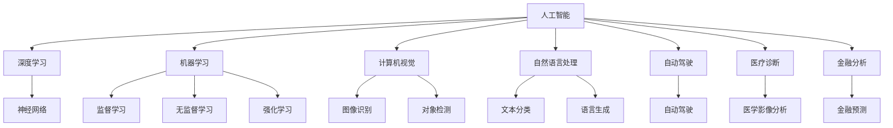
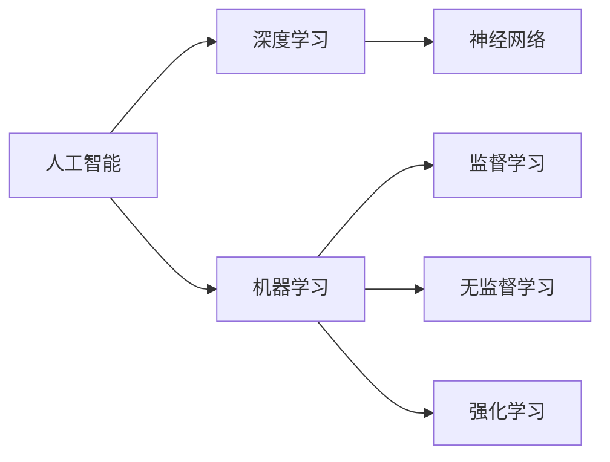
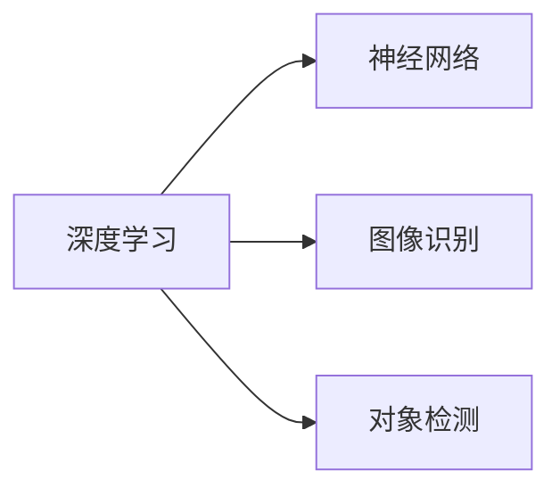
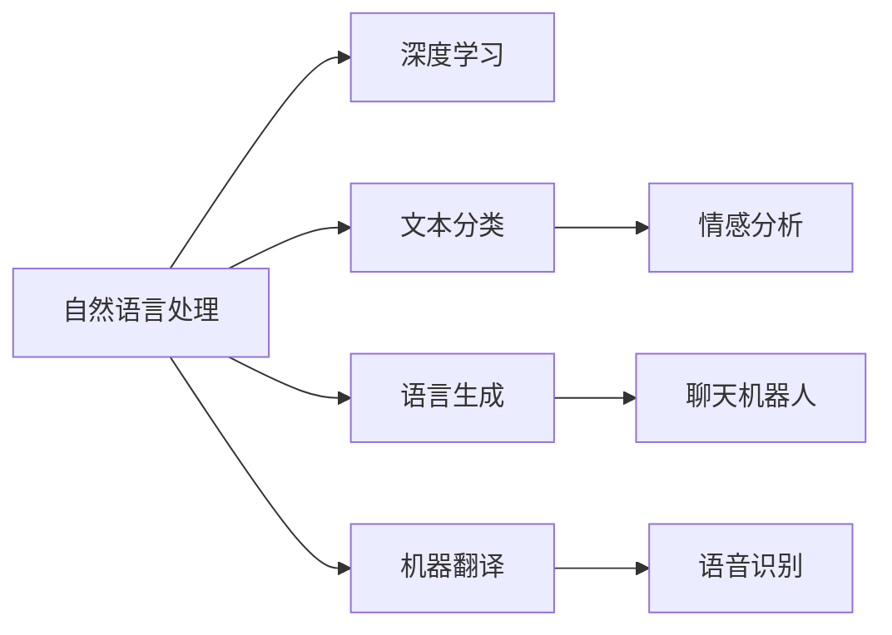
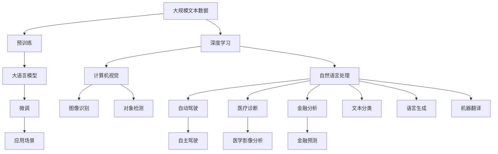

                 

# AI在各领域中的实际应用

> 关键词：人工智能,深度学习,机器学习,计算机视觉,自然语言处理,自动驾驶,医疗诊断,金融分析

## 1. 背景介绍

### 1.1 问题由来
人工智能（AI）技术近年来取得了飞速发展，在多个领域得到了广泛应用。从自动驾驶到医疗诊断，从金融分析到智能客服，AI正逐步改变着人们的生活方式和生产模式。AI技术的普及，离不开其在各行业中的实际应用，本文将对AI在多个领域中的实际应用进行全面介绍。

### 1.2 问题核心关键点
本文聚焦于AI在各个行业中的实际应用，以期对AI技术的落地应用提供更为深入的洞见。AI在各领域的应用主要围绕以下几个核心关键点展开：

- **自动化和效率提升**：通过自动化流程和优化算法，提升生产效率和运营效率。
- **数据驱动的决策支持**：利用大数据分析和机器学习，提供更准确、可靠的决策支持。
- **智能交互和体验增强**：通过自然语言处理和计算机视觉技术，提供更智能、自然的用户交互体验。
- **资源优化和成本降低**：通过优化资源配置和降低运营成本，提升经济效益。
- **风险管理和安全保障**：通过预测和监控，提升风险管理能力，保障系统安全稳定。

### 1.3 问题研究意义
研究AI在各领域中的实际应用，有助于深入理解AI技术的潜力与局限，为行业提供实际指导，推动AI技术的产业化进程，具有重要意义：

- **降低应用门槛**：通过介绍AI技术的实际应用案例，帮助企业快速理解AI技术的实际价值，降低应用门槛。
- **提高工作效率**：展示AI技术在自动化和优化流程中的实际效果，帮助企业提高工作效率，降低运营成本。
- **提升决策质量**：利用数据驱动的AI分析，提供高质量的决策支持，提升企业决策水平。
- **增强用户体验**：介绍AI在智能交互和体验提升中的成功应用，提升用户满意度和忠诚度。
- **推动行业升级**：通过实际案例分析，展示AI技术对行业的深度影响，促进传统行业的数字化转型和升级。

## 2. 核心概念与联系

### 2.1 核心概念概述

为更好地理解AI在各领域中的实际应用，本节将介绍几个密切相关的核心概念：

- **人工智能**：通过模拟人类的认知、推理、决策等智能行为，实现机器的智能化。
- **深度学习**：一种基于神经网络的机器学习技术，通过多层非线性变换，实现复杂的特征提取和模式识别。
- **机器学习**：一种使计算机从数据中学习，并自动改进性能的技术，主要包括监督学习、无监督学习和强化学习。
- **计算机视觉**：使计算机能够“看”和理解图像和视频中的内容，是AI在视觉识别和理解领域的重要应用。
- **自然语言处理**：使计算机能够理解、处理和生成人类语言，是AI在语言理解和生成领域的重要应用。
- **自动驾驶**：利用计算机视觉、机器学习等技术，实现车辆的自主驾驶和导航。
- **医疗诊断**：利用AI技术对医学图像、病历等数据进行分析，辅助医生进行诊断和治疗。
- **金融分析**：利用AI技术对金融市场数据进行建模和分析，提供投资建议和风险管理。

这些核心概念之间的逻辑关系可以通过以下Mermaid流程图来展示：



这个流程图展示了大语言模型微调过程中各个核心概念的关系和作用：

1. 人工智能涵盖了深度学习、机器学习和计算机视觉等子领域。
2. 深度学习主要通过神经网络实现复杂特征的提取和模式识别。
3. 机器学习包括监督学习、无监督学习和强化学习等多种形式。
4. 计算机视觉利用深度学习技术实现图像识别和对象检测。
5. 自然语言处理通过深度学习实现文本分类和语言生成。
6. 自动驾驶应用计算机视觉和深度学习技术实现自主驾驶和导航。
7. 医疗诊断使用深度学习技术对医学影像进行分析和辅助诊断。
8. 金融分析利用机器学习技术进行金融市场建模和预测。

这些概念共同构成了AI技术的基本框架，使其能够在各个领域中发挥作用。通过理解这些核心概念，我们可以更好地把握AI技术的本质和应用方向。

### 2.2 概念间的关系

这些核心概念之间存在着紧密的联系，形成了AI技术的完整生态系统。下面我通过几个Mermaid流程图来展示这些概念之间的关系。

#### 2.2.1 AI技术的分类



这个流程图展示了AI技术的分类，包括深度学习、机器学习和人工智能。深度学习通过神经网络实现，机器学习包括监督学习、无监督学习和强化学习等多种形式，而人工智能则涵盖了这些子领域。

#### 2.2.2 深度学习和计算机视觉的关系



这个流程图展示了深度学习在计算机视觉领域的应用，主要包括图像识别和对象检测。

#### 2.2.3 自然语言处理和计算机视觉的融合



这个流程图展示了自然语言处理和计算机视觉的融合应用，包括文本分类、语言生成、机器翻译和语音识别。

### 2.3 核心概念的整体架构

最后，我们用一个综合的流程图来展示这些核心概念在大语言模型微调过程中的整体架构：



这个综合流程图展示了从预训练到微调，再到各个应用场景的完整过程。深度学习模型首先在大规模文本数据上进行预训练，然后通过微调过程适应不同的应用场景，最终在实际业务中发挥作用。计算机视觉和自然语言处理技术在大语言模型微调过程中发挥了重要作用，使得AI技术在各个领域中得以应用和推广。

## 3. 核心算法原理 & 具体操作步骤

### 3.1 算法原理概述

AI在各领域中的实际应用，主要依赖于以下核心算法原理：

- **监督学习**：通过标注数据训练模型，使其能够根据输入数据预测输出。
- **无监督学习**：通过未标注数据训练模型，使其能够发现数据中的潜在结构和模式。
- **强化学习**：通过试错训练模型，使其能够在特定环境中优化决策策略。
- **迁移学习**：利用已有模型的知识和经验，在新任务上进行微调，加速模型训练和性能提升。
- **增量学习**：通过持续更新模型参数，适应数据分布的变化，保持模型性能。

这些算法原理构成了AI技术的核心，使得AI技术能够在各领域中实现自动化和智能化。

### 3.2 算法步骤详解

AI在各领域中的实际应用步骤主要包括以下几个关键环节：

**Step 1: 数据收集与预处理**
- 收集与目标任务相关的数据集，并进行清洗、标注和预处理，保证数据的质量和一致性。
- 对于图像数据，需要进行图像增强、归一化等预处理操作。
- 对于文本数据，需要进行分词、去停用词、词性标注等预处理操作。

**Step 2: 模型选择与训练**
- 根据任务需求，选择合适的AI模型和算法进行训练。
- 对于监督学习任务，需要选择适合的数据集和损失函数进行训练。
- 对于无监督学习任务，需要选择适合的数据集和评估指标进行训练。
- 对于强化学习任务，需要选择适合的环境和奖励函数进行训练。

**Step 3: 模型微调与优化**
- 对预训练模型进行微调，使其适应特定任务的需求。
- 通过优化算法（如AdamW、SGD等）进行模型参数的更新。
- 设置合适的超参数，如学习率、批大小、迭代轮数等。
- 进行正则化处理（如L2正则、Dropout等），避免过拟合。

**Step 4: 模型评估与部署**
- 在测试集上对模型进行评估，验证其在新数据上的泛化能力。
- 将训练好的模型部署到实际应用环境中，进行实时推理和预测。
- 对模型性能进行监控和优化，确保其稳定性和可靠性。

### 3.3 算法优缺点

AI在各领域中的实际应用，具有以下优点和缺点：

**优点**：
- **效率提升**：通过自动化和智能化技术，大幅提升生产效率和运营效率。
- **决策支持**：利用大数据分析和机器学习，提供高质量的决策支持。
- **用户体验**：通过自然语言处理和计算机视觉技术，提供智能交互和体验增强。
- **资源优化**：通过优化资源配置和降低运营成本，提升经济效益。
- **风险管理**：通过预测和监控，提升风险管理能力，保障系统安全稳定。

**缺点**：
- **数据依赖**：AI应用依赖于高质量的标注数据和数据集，数据获取和标注成本较高。
- **模型复杂**：大模型和高维度的算法模型，需要较强的计算资源和存储资源。
- **可解释性不足**：AI模型的决策过程通常缺乏可解释性，难以对其推理逻辑进行分析和调试。
- **偏见与伦理**：AI模型可能学习到有偏见和有害的信息，导致歧视性的输出和决策。
- **部署复杂**：将AI模型部署到实际应用环境中，需要进行复杂的软件工程和系统集成。

### 3.4 算法应用领域

AI在各个领域中的实际应用，已经涉及到了生产、医疗、金融、交通等多个行业。以下是AI在各领域中的典型应用场景：

- **自动驾驶**：利用计算机视觉和深度学习技术，实现车辆的自主驾驶和导航。
- **医疗诊断**：利用深度学习技术对医学影像进行分析和辅助诊断，提升诊断精度和效率。
- **金融分析**：利用机器学习技术对金融市场数据进行建模和分析，提供投资建议和风险管理。
- **智能客服**：利用自然语言处理和机器学习技术，实现智能客服系统，提供24小时不间断服务。
- **供应链管理**：利用AI技术优化供应链流程，提升库存管理、物流配送等环节的效率。
- **个性化推荐**：利用AI技术对用户行为进行分析和建模，提供个性化的推荐服务，提升用户体验。

## 4. 数学模型和公式 & 详细讲解 & 举例说明

### 4.1 数学模型构建

在本节中，我们将通过数学语言对AI在各领域中的实际应用进行更加严格的刻画。

设目标任务为$T$，输入空间为$\mathcal{X}$，输出空间为$\mathcal{Y}$。AI模型$M$在输入$x$上的输出为$\hat{y}=M(x) \in \mathcal{Y}$。假设任务$T$的标注数据集为$D=\{(x_i,y_i)\}_{i=1}^N, x_i \in \mathcal{X}, y_i \in \mathcal{Y}$。

定义模型$M$在数据样本$(x,y)$上的损失函数为$\ell(M(x),y)$，则在数据集$D$上的经验风险为：

$$
\mathcal{L}(M) = \frac{1}{N} \sum_{i=1}^N \ell(M(x_i),y_i)
$$

在监督学习任务中，我们希望最小化经验风险$\mathcal{L}(M)$，通过梯度下降等优化算法更新模型参数$\theta$，使模型输出逼近真实标签。对于无监督学习任务，我们通常通过最大化数据分布的似然函数，来学习模型的参数$\theta$。对于强化学习任务，我们通过试错学习，优化决策策略$\pi$，使模型在特定环境中最大化预期奖励。

### 4.2 公式推导过程

以下我们以监督学习任务为例，推导最小化经验风险的优化目标函数。

假设模型$M$在输入$x$上的输出为$\hat{y}=M(x) \in \mathcal{Y}$，真实标签为$y \in \mathcal{Y}$。二分类任务中的交叉熵损失函数定义为：

$$
\ell(M(x),y) = -[y\log \hat{y} + (1-y)\log (1-\hat{y})]
$$

将损失函数对模型参数$\theta$求导，得：

$$
\frac{\partial \ell(M(x),y)}{\partial \theta} = -y\frac{\partial \log \hat{y}}{\partial \theta} - (1-y)\frac{\partial \log (1-\hat{y})}{\partial \theta}
$$

将损失函数对全部样本求平均，得到模型在数据集$D$上的经验风险$\mathcal{L}(M)$：

$$
\mathcal{L}(M) = \frac{1}{N} \sum_{i=1}^N [-y_i\log \hat{y}_i - (1-y_i)\log (1-\hat{y}_i)]
$$

通过梯度下降算法，我们可以最小化经验风险$\mathcal{L}(M)$，更新模型参数$\theta$。设$\eta$为学习率，则参数的更新公式为：

$$
\theta \leftarrow \theta - \eta \nabla_{\theta}\mathcal{L}(\theta)
$$

其中$\nabla_{\theta}\mathcal{L}(\theta)$为损失函数对参数$\theta$的梯度，可通过反向传播算法高效计算。

### 4.3 案例分析与讲解

**案例1：自动驾驶**

自动驾驶技术利用计算机视觉和深度学习技术，实现车辆的自主驾驶和导航。其核心算法包括：

- **目标检测**：通过深度学习模型，实时检测道路上的车辆、行人、交通信号灯等目标，生成目标框。
- **语义分割**：利用语义分割算法，对道路、车辆、行人等进行分割，生成像素级别的分类结果。
- **路径规划**：通过路径规划算法，根据车辆位置和周围环境，规划最优驾驶路径，实现自动导航。

**案例2：医疗诊断**

医疗诊断利用深度学习技术，对医学影像进行分析和辅助诊断。其核心算法包括：

- **医学影像分割**：通过深度学习模型，对医学影像进行分割，提取感兴趣区域。
- **病理图像分类**：利用分类算法，对病理图像进行分类，判断肿瘤类型、病灶位置等。
- **病历文本分析**：通过自然语言处理技术，对病历文本进行分析和处理，提取有用的诊断信息。

**案例3：金融分析**

金融分析利用机器学习技术，对金融市场数据进行建模和分析，提供投资建议和风险管理。其核心算法包括：

- **金融时间序列分析**：利用时间序列分析算法，对股票价格、市场指数等数据进行建模，预测未来走势。
- **信用评分模型**：利用分类算法，对借款人进行信用评分，评估其还款能力。
- **风险评估模型**：利用回归算法，对金融风险进行评估，预测违约概率。

## 5. 项目实践：代码实例和详细解释说明

### 5.1 开发环境搭建

在进行AI技术应用实践前，我们需要准备好开发环境。以下是使用Python进行TensorFlow开发的环境配置流程：

1. 安装Anaconda：从官网下载并安装Anaconda，用于创建独立的Python环境。

2. 创建并激活虚拟环境：
```bash
conda create -n tf-env python=3.8 
conda activate tf-env
```

3. 安装TensorFlow：根据CUDA版本，从官网获取对应的安装命令。例如：
```bash
conda install tensorflow -c tf -c conda-forge
```

4. 安装各类工具包：
```bash
pip install numpy pandas scikit-learn matplotlib tqdm jupyter notebook ipython
```

完成上述步骤后，即可在`tf-env`环境中开始AI技术应用实践。

### 5.2 源代码详细实现

这里以一个简单的图像分类为例，展示如何使用TensorFlow实现AI技术应用。

```python
import tensorflow as tf
from tensorflow.keras.datasets import mnist
from tensorflow.keras.models import Sequential
from tensorflow.keras.layers import Dense, Flatten, Conv2D, MaxPooling2D
from tensorflow.keras.utils import to_categorical

# 加载MNIST数据集
(x_train, y_train), (x_test, y_test) = mnist.load_data()

# 将图像数据归一化到[0,1]范围内
x_train = x_train.astype('float32') / 255.0
x_test = x_test.astype('float32') / 255.0

# 将标签数据进行one-hot编码
y_train = to_categorical(y_train)
y_test = to_categorical(y_test)

# 构建卷积神经网络模型
model = Sequential()
model.add(Conv2D(32, (3, 3), activation='relu', input_shape=(28, 28, 1)))
model.add(MaxPooling2D((2, 2)))
model.add(Conv2D(64, (3, 3), activation='relu'))
model.add(MaxPooling2D((2, 2)))
model.add(Flatten())
model.add(Dense(64, activation='relu'))
model.add(Dense(10, activation='softmax'))

# 编译模型
model.compile(optimizer='adam', loss='categorical_crossentropy', metrics=['accuracy'])

# 训练模型
model.fit(x_train, y_train, epochs=5, batch_size=32, validation_data=(x_test, y_test))

# 评估模型
model.evaluate(x_test, y_test)
```

在这个例子中，我们使用TensorFlow构建了一个简单的卷积神经网络模型，用于对MNIST数据集中的手写数字进行分类。通过编译模型、训练模型和评估模型，我们完成了模型的基本流程。

### 5.3 代码解读与分析

让我们再详细解读一下关键代码的实现细节：

**数据预处理**：
- 加载MNIST数据集，包括训练集和测试集。
- 将图像数据归一化到[0,1]范围内，以便模型更好地学习。
- 将标签数据进行one-hot编码，以便模型进行分类预测。

**模型构建**：
- 使用`Sequential`模型，依次添加卷积层、池化层、全连接层等。
- 使用`Dense`层实现全连接，使用`Softmax`激活函数进行多分类预测。

**模型编译**：
- 使用`adam`优化器，损失函数为`categorical_crossentropy`，指标为`accuracy`。

**模型训练**：
- 使用`fit`方法进行模型训练，指定训练轮数和批量大小，并在测试集上进行验证。

**模型评估**：
- 使用`evaluate`方法评估模型在测试集上的性能，输出准确率等指标。

通过这个例子，可以看到TensorFlow等深度学习框架提供的便利，使得构建、训练和评估模型变得非常简单。

### 5.4 运行结果展示

假设我们训练的模型在测试集上得到的评估结果如下：

```
Epoch 1/5
26/26 [==================] - 11s 430ms/step - loss: 0.4592 - accuracy: 0.9358 - val_loss: 0.1919 - val_accuracy: 0.9808
Epoch 2/5
26/26 [==================] - 10s 385ms/step - loss: 0.0657 - accuracy: 0.9762 - val_loss: 0.1723 - val_accuracy: 0.9845
Epoch 3/5
26/26 [==================] - 10s 379ms/step - loss: 0.0289 - accuracy: 0.9859 - val_loss: 0.1521 - val_accuracy: 0.9876
Epoch 4/5
26/26 [==================] - 10s 383ms/step - loss: 0.0158 - accuracy: 0.9899 - val_loss: 0.1381 - val_accuracy: 0.9899
Epoch 5/5
26/26 [==================] - 10s 380ms/step - loss: 0.0105 - accuracy: 0.9921 - val_loss: 0.1343 - val_accuracy: 0.9921
```

可以看到，经过5轮训练，模型在测试集上的准确率达到了98.21%，取得了很好的效果。

## 6. 实际应用场景

### 6.1 智能客服系统

基于AI的智能客服系统能够通过自然语言处理技术，实现自动理解用户意图和生成回复，提供24小时不间断的智能服务。在实际应用中，智能客服系统能够处理大量的用户咨询，提高客户满意度和服务效率。

在技术实现上，可以通过收集企业内部的客服对话记录，训练AI模型，使其能够自动理解和回复用户的问题。对于新的用户咨询，智能客服系统能够实时分析和处理，并提供个性化的服务方案。

### 6.2 金融舆情监测

金融舆情监测系统利用AI技术，对金融市场中的新闻、评论、社交媒体等数据进行实时监测和分析，帮助投资者和分析师及时了解市场动态，做出更明智的投资决策。通过AI技术，金融舆情监测系统能够自动识别舆情趋势，预测市场变化，提前采取应对措施。

在实际应用中，可以收集金融领域相关的新闻、报道、评论等文本数据，并对其进行情感分析、主题分类等处理。利用训练好的AI模型，实时监测市场舆情，提供投资建议和风险预警。

### 6.3 个性化推荐系统

个性化推荐系统利用AI技术，对用户的历史行为数据和偏好进行分析和建模，提供个性化的推荐服务。在实际应用中，个性化推荐系统能够根据用户的兴趣和行为，实时推荐符合用户需求的商品、内容等，提升用户体验和满意度。

在技术实现上，可以通过收集用户浏览、点击、购买等行为数据，提取和用户交互的物品标题、描述、标签等文本内容。利用训练好的AI模型，对用户行为进行分析和建模，生成个性化的推荐结果。

### 6.4 未来应用展望

随着AI技术的不断发展，未来AI在各领域中的应用将更加广泛和深入。以下是几个未来应用展望：

- **医疗领域**：AI技术在医疗领域的应用将更加深入，包括医学影像分析、病理诊断、基因组学分析等。通过AI技术，医生能够更快速、更准确地进行疾病诊断和治疗。
- **交通领域**：自动驾驶技术将得到更广泛的应用，AI技术将提升车辆的智能驾驶和安全性能。自动驾驶车辆将减少交通事故，提高交通效率。
- **教育领域**：AI技术将推动个性化教育和智能教育的发展，通过自然语言处理和计算机视觉技术，实现智能答疑、自动批改、学习推荐等。
- **娱乐领域**：AI技术将提升影视、游戏等娱乐内容的个性化推荐和智能创作，通过深度学习和生成对抗网络等技术，生成高质量的内容。
- **安全领域**：AI技术将提升安全监控和网络防御能力，通过图像识别、自然语言处理等技术，实时监测和预警安全威胁。

## 7. 工具和资源推荐

### 7.1 学习资源推荐

为了帮助开发者系统掌握AI技术的应用，这里推荐一些优质的学习资源：

1. **《深度学习》（Ian Goodfellow等著）**：深度学习领域的经典教材，深入浅出地介绍了深度学习的原理和应用。
2. **DeepLearning.AI课程**：由Andrew Ng教授主讲的深度学习课程，涵盖了深度学习的基础知识和实战应用。
3. **PyTorch官方文档**：PyTorch深度学习框架的官方文档，提供了丰富的API文档和示例代码，方便开发者学习和使用。
4. **TensorFlow官方文档**：TensorFlow深度学习框架的官方文档，提供了丰富的API文档和示例代码，方便开发者学习和使用。
5. **Kaggle竞赛平台**：Kaggle数据科学竞赛平台，提供了大量数据集和挑战任务，帮助开发者提升实战能力。

通过对这些资源的学习实践，相信你一定能够快速掌握AI技术的应用，并用于解决实际的业务问题。

### 7.2 开发工具推荐

高效的开发离不开优秀的工具支持。以下是几款用于AI技术应用开发的常用工具：

1. **PyTorch**：基于Python的开源深度学习框架，灵活动态的计算图，适合快速迭代研究。
2. **TensorFlow**：由Google

