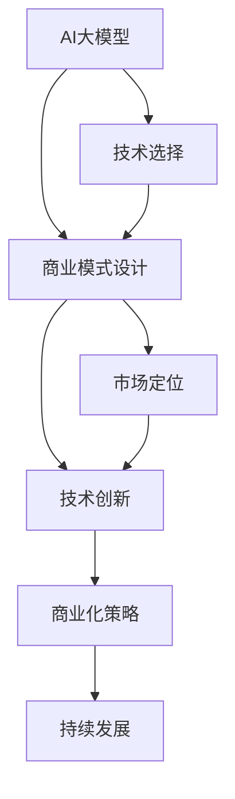

                 

# AI大模型创业：如何构建未来可持续的商业模式？

> 关键词：
- AI大模型
- 商业模式
- 可持续性
- 创业策略
- 技术创新

## 1. 背景介绍

### 1.1 问题由来

近年来，人工智能(AI)技术的飞速发展，特别是大模型如GPT-3、BERT等的突破，引发了业界对AI创业的浓厚兴趣。AI大模型以其强大的数据处理能力、深度学习和自然语言处理(NLP)等技术，为众多行业提供了崭新的业务解决方案，带来巨大的商业价值和市场潜力。然而，大模型创业亦面临诸多挑战，如模型训练成本高、数据隐私保护难、商业化落地难度大等。

### 1.2 问题核心关键点

本节将探讨构建AI大模型创业公司的关键因素，包括技术选择、商业模式设计、市场定位、技术创新和商业化策略等。

## 2. 核心概念与联系

### 2.1 核心概念概述

- AI大模型：基于大规模深度学习模型，具备超强数据处理和知识表达能力，可应用于自然语言处理、计算机视觉、语音识别等多个领域。
- 商业模式：企业通过产品或服务，实现收入、利润及市场份额的提升策略。
- 可持续性：企业在长期发展中，保持健康、稳定、有竞争力发展的能力。
- 创业策略：企业在初创阶段制定的一系列决策和行动计划。
- 技术创新：开发和应用新技术，提升产品竞争力。
- 商业化策略：将技术转化为市场认可的产品或服务，实现商业价值。

这些核心概念相互关联，共同构成了AI大模型创业的复杂生态系统。

### 2.2 概念间的关系

通过以下Mermaid流程图，我们可以更直观地理解这些核心概念的相互作用：



这个流程图展示了AI大模型创业的主要路径：从技术选择到商业模式设计，再到市场定位和技术创新，最终实现商业化和持续发展。每个环节环环相扣，共同构成了一个完整的创业生态。

## 3. 核心算法原理 & 具体操作步骤

### 3.1 算法原理概述

AI大模型创业的核心在于将大模型的技术优势转化为可行的商业模式。这需要深入理解大模型的工作原理，选择合适的应用场景，并设计有效的商业化路径。

大模型的核心算法原理包括：
- 自监督学习：通过无标签数据预训练，学习通用知识表示。
- 迁移学习：将通用知识应用于特定任务，通过微调提升性能。
- 深度学习：利用多层神经网络进行特征提取和知识表达。

### 3.2 算法步骤详解

构建AI大模型创业公司的主要步骤如下：

**Step 1: 技术评估与选择**

- 评估当前大模型的性能和适用性，选择适合自身业务需求的技术路径。
- 考虑使用预训练模型（如BERT、GPT），还是从头开始训练定制模型。

**Step 2: 商业模式设计**

- 根据市场调研，明确目标用户群体，设计针对性产品或服务。
- 制定盈利模式，包括SaaS、PaaS、API等。

**Step 3: 市场定位与推广**

- 分析竞争对手，确定差异化定位和竞争优势。
- 制定推广策略，通过营销、PR等手段提升品牌知名度和市场份额。

**Step 4: 技术创新与迭代**

- 不断改进模型性能，进行技术优化和创新。
- 利用开源社区，获取最新技术和工具支持。

**Step 5: 商业化实施**

- 开发产品原型，进行测试和反馈收集。
- 优化用户体验，完善功能和服务。
- 获取商业客户，进行商业部署。

**Step 6: 持续发展与优化**

- 定期收集用户反馈，进行产品迭代和优化。
- 跟踪技术趋势，及时调整商业策略。

### 3.3 算法优缺点

AI大模型创业的优势在于：
- 技术领先：通过大模型，可提供领先的解决方案和用户体验。
- 客户粘性高：大模型提供的深度学习和知识表达能力，可满足复杂需求。

然而，也存在一些挑战：
- 高成本投入：数据标注、模型训练和硬件设备要求高。
- 风险大：技术风险、市场风险、人才风险等。
- 商业化难：需要大量资源投入推广和销售。

### 3.4 算法应用领域

AI大模型在多个领域具有广泛的应用前景，如：

- 自然语言处理：文本生成、情感分析、机器翻译等。
- 计算机视觉：图像识别、目标检测、视频分析等。
- 语音识别：语音合成、语音识别、语音翻译等。
- 医疗健康：病历分析、疾病预测、医疗咨询等。

## 4. 数学模型和公式 & 详细讲解 & 举例说明

### 4.1 数学模型构建

AI大模型创业的数学模型构建，需要考虑以下几个关键环节：

1. **数据准备**：收集和清洗数据，构建训练集和验证集。
2. **模型选择**：选择合适的预训练模型（如BERT、GPT）。
3. **参数调整**：调整模型超参数，如学习率、批大小、训练轮数等。
4. **商业化模型**：基于预训练模型微调，构建商业化模型。

以自然语言处理(NLP)为例，构建模型的一般步骤如下：

- **数据准备**：收集标注数据，如情感分析的数据集。
- **模型选择**：选择预训练的BERT模型，进行微调。
- **参数调整**：设定学习率为2e-5，批大小为16。
- **商业化模型**：在微调后模型上进行预测，输出情感分析结果。

### 4.2 公式推导过程

下面以情感分析为例，推导商业化模型输出的情感倾向：

- **输入数据**：原始文本 $x$。
- **模型输入**：BERT模型对 $x$ 进行编码，得到向量表示 $z$。
- **输出**：将 $z$ 输入分类器，输出情感倾向 $y$。

$$
y = softmax(f(z))
$$

其中，$f$ 为分类器的激活函数，如Logistic函数。$softmax$ 将输出转化为概率分布。

### 4.3 案例分析与讲解

假设我们构建了一个情感分析的AI大模型创业公司，以下是具体的案例分析：

1. **技术选择**：选用GPT-3作为预训练模型。
2. **数据准备**：从开源平台获取情感分析数据集。
3. **模型微调**：在GPT-3基础上进行微调，构建情感分析模型。
4. **商业化模型**：通过API接口，为客户提供情感分析服务。

## 5. 项目实践：代码实例和详细解释说明

### 5.1 开发环境搭建

搭建AI大模型创业项目的开发环境，需要以下几个步骤：

1. **安装Python**：在服务器上安装Python 3.8。
2. **安装PyTorch**：使用pip安装PyTorch，并配置GPU环境。
3. **安装相关库**：安装TensorBoard、Pandas等。

### 5.2 源代码详细实现

以下是一个简单的情感分析模型的代码实现：

```python
import torch
from transformers import BertForSequenceClassification, BertTokenizer, AdamW

# 加载预训练模型和分词器
model = BertForSequenceClassification.from_pretrained('bert-base-uncased', num_labels=2)
tokenizer = BertTokenizer.from_pretrained('bert-base-uncased')

# 定义训练函数
def train_epoch(model, dataset, optimizer):
    model.train()
    loss = 0
    for batch in dataset:
        input_ids = batch['input_ids'].to(device)
        attention_mask = batch['attention_mask'].to(device)
        labels = batch['labels'].to(device)
        optimizer.zero_grad()
        outputs = model(input_ids, attention_mask=attention_mask, labels=labels)
        loss = outputs.loss
        loss.backward()
        optimizer.step()
        loss += loss.item()
    return loss / len(dataset)

# 训练模型
device = torch.device('cuda' if torch.cuda.is_available() else 'cpu')
model.to(device)
train_dataset = ...
train_loader = ...
optimizer = ...
epochs = ...

for epoch in range(epochs):
    train_loss = train_epoch(model, train_loader, optimizer)
    val_loss = ...

# 评估模型
val_dataset = ...
val_loader = ...
eval_loss = ...

print('Val Loss:', val_loss)
```

### 5.3 代码解读与分析

这段代码实现了一个基于BERT模型的情感分析模型，具体解释如下：

- **模型加载**：使用HuggingFace的Transformer库，加载预训练的BERT模型和分词器。
- **训练函数**：定义训练函数，处理输入数据，计算损失函数并更新模型参数。
- **训练循环**：在训练数据集上循环迭代，每个epoch结束后输出训练损失。
- **评估模型**：在验证数据集上评估模型性能，输出验证损失。

## 6. 实际应用场景

### 6.1 智能客服系统

智能客服系统是大模型在NLP领域的重要应用之一。通过AI大模型，可以构建高效的智能客服系统，为用户提供实时、准确的回答。

- **技术实现**：利用大模型进行意图识别和对话生成，构建智能客服系统。
- **商业价值**：降低客服成本，提高客户满意度，提升企业竞争力。

### 6.2 金融舆情监测

金融行业需要实时监测市场舆情，预测金融市场动向。AI大模型可以帮助金融机构更好地理解舆情信息。

- **技术实现**：利用大模型进行文本分类、情感分析等，监测金融舆情。
- **商业价值**：及时应对金融风险，提升投资决策的准确性。

### 6.3 医疗健康

医疗健康领域是大模型的重要应用场景。AI大模型可以用于病历分析、疾病预测、健康管理等。

- **技术实现**：利用大模型进行医学知识推理，构建医疗健康系统。
- **商业价值**：提升医疗服务质量，降低医疗成本，提高患者体验。

## 7. 工具和资源推荐

### 7.1 学习资源推荐

1. **Kaggle**：提供大量NLP和金融领域的公开数据集，用于学习和实践。
2. **TensorFlow官方文档**：详细介绍了TensorFlow的使用方法和最佳实践。
3. **HuggingFace官方文档**：提供了各种预训练模型和微调方法的使用说明。
4. **Deep Learning Book**：由深度学习大师Ian Goodfellow所著，深入讲解深度学习理论和实践。
5. **创业指南**：如《精益创业》、《独角兽公司是怎样炼成的》等书籍，提供创业实战经验。

### 7.2 开发工具推荐

1. **PyTorch**：流行的深度学习框架，支持动态计算图，适合快速迭代研究。
2. **TensorFlow**：由Google开发的深度学习框架，适合大规模工程应用。
3. **Jupyter Notebook**：交互式开发环境，支持Python和R语言，方便代码调试和分享。
4. **Visual Studio Code**：轻量级代码编辑器，支持多种语言和扩展。
5. **GitHub**：代码托管平台，方便团队协作和代码分享。

### 7.3 相关论文推荐

1. **Transformer论文**：介绍Transformer模型架构，开启大模型时代。
2. **BERT论文**：提出BERT模型，引入自监督学习任务。
3. **GPT-3论文**：展示GPT-3模型在零样本和少样本学习中的强大能力。
4. **AdaLoRA论文**：提出AdaLoRA方法，优化大模型微调过程。
5. **AdaLoRA论文**：介绍多任务学习，提升大模型在多个任务上的性能。

## 8. 总结：未来发展趋势与挑战

### 8.1 研究成果总结

AI大模型在NLP、计算机视觉、语音识别等多个领域取得了显著进展，广泛应用于智能客服、金融舆情监测、医疗健康等多个场景。通过大模型的微调，提高了企业的运营效率和用户体验，推动了AI技术的落地应用。

### 8.2 未来发展趋势

1. **技术进步**：大模型的参数量和计算能力将进一步提升，推动NLP、计算机视觉等领域的突破。
2. **应用扩展**：大模型将在更多领域得到应用，如医疗健康、金融、教育等。
3. **商业化加速**：随着技术成熟，大模型的商业化进程将加快，形成更多AI创业公司。
4. **伦理规范**：AI伦理问题将受到更多关注，制定相关规范和标准。

### 8.3 面临的挑战

1. **数据隐私**：大模型的训练和应用涉及大量敏感数据，如何保护用户隐私是一个重要挑战。
2. **模型鲁棒性**：大模型在应对异常数据和对抗样本时，需要更高的鲁棒性。
3. **计算资源**：大模型的训练和推理需要大量的计算资源，如何优化资源使用是一个关键问题。
4. **技术壁垒**：AI大模型创业需要高水平的技术团队，如何吸引和留住人才是一个难题。
5. **市场竞争**：AI大模型市场竞争激烈，如何保持竞争优势是一个重要挑战。

### 8.4 研究展望

未来，AI大模型创业将在以下几个方向进行突破：

1. **技术创新**：开发更多高效、通用的大模型，提升模型性能和应用范围。
2. **商业化策略**：制定合理的定价策略，降低用户使用门槛，扩大市场份额。
3. **伦理规范**：制定AI伦理规范，确保技术应用的透明性和可解释性。
4. **合作共赢**：与其他公司、机构合作，共同推动AI技术的发展和应用。

总之，AI大模型创业是未来AI技术发展的重要方向，具有广阔的应用前景和商业价值。通过技术创新、商业化策略、伦理规范等措施，可以构建可持续发展的商业模式，推动AI技术的规模化落地。

## 9. 附录：常见问题与解答

**Q1: 什么是AI大模型？**

A: AI大模型是指基于大规模深度学习模型，具备超强数据处理和知识表达能力，可应用于自然语言处理、计算机视觉、语音识别等多个领域。

**Q2: 如何选择合适的AI大模型？**

A: 需要考虑模型的性能、适用场景、训练成本等因素，选择合适的预训练模型或从头训练定制模型。

**Q3: 如何构建AI大模型创业公司？**

A: 需要明确目标用户、设计商业模式、进行市场定位、进行技术创新和商业化实施。

**Q4: 如何保护数据隐私？**

A: 可以使用数据匿名化、差分隐私等技术，确保数据的安全性和隐私保护。

**Q5: 如何应对AI技术的伦理问题？**

A: 制定AI伦理规范，确保技术应用的透明性和可解释性，建立用户信任。

---

作者：禅与计算机程序设计艺术 / Zen and the Art of Computer Programming

