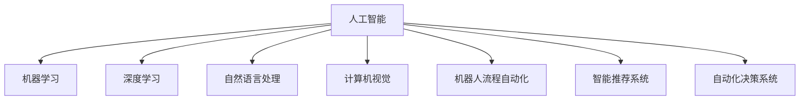
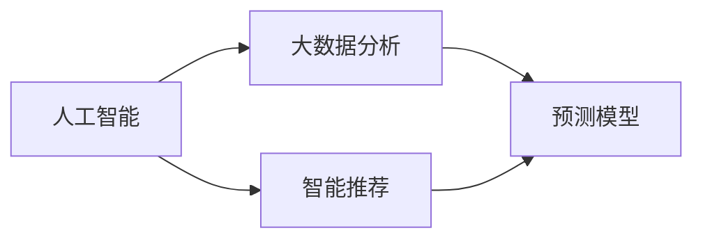
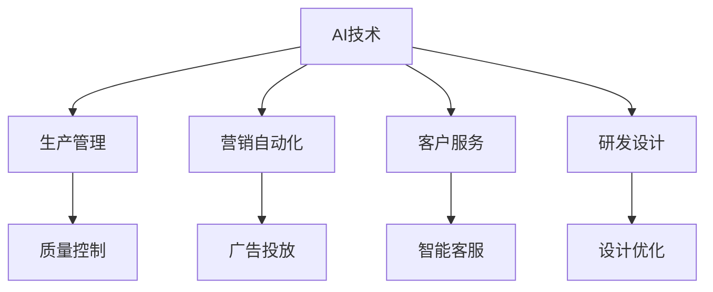

                 

# AI技术在企业中的发展

在当今数字化转型的大潮中，人工智能（AI）技术已经从学术研究前沿走入企业生产的各个环节。从生产管理到市场营销，从客户服务到研发设计，AI技术以其强大的数据处理能力和高效自动化能力，为企业创造了巨大的价值。本文将对AI技术在企业中的应用和发展进行深入探讨，探讨其在不同业务场景中的具体应用，分析其对企业的深远影响，并展望其未来发展趋势。

## 1. 背景介绍

### 1.1 问题由来
AI技术的快速发展，使得其应用领域不断扩展。早期的AI技术主要集中在科学计算、图像识别等领域，随着深度学习等技术的发展，AI技术开始广泛应用于自然语言处理（NLP）、计算机视觉、语音识别等通用领域。近年来，企业开始将AI技术引入其业务运营中，以期通过自动化、智能化、优化化的手段提升企业的竞争力和市场响应速度。

### 1.2 问题核心关键点
AI技术在企业中的应用，通常涉及以下几个核心关键点：
1. **数据驱动决策**：AI通过大数据分析，为企业的决策提供科学依据。
2. **自动化流程**：AI技术通过自动化工具，减少了人工操作的环节，提升了工作效率。
3. **智能推荐**：AI技术通过分析用户行为，为用户推荐个性化的产品或服务。
4. **预测与优化**：AI通过预测模型，对业务流程进行优化和调整。
5. **客户服务**：AI技术通过智能客服、聊天机器人等手段，提升客户体验。

### 1.3 问题研究意义
AI技术在企业中的应用，不仅可以提高企业的运营效率，降低成本，还能提升产品或服务的质量，增强企业的市场竞争力。AI技术的应用，使得企业能够更灵活地响应市场变化，更快地适应新的商业环境。

## 2. 核心概念与联系

### 2.1 核心概念概述

为更好地理解AI技术在企业中的应用，本节将介绍几个密切相关的核心概念：

- **人工智能（AI）**：一种利用算法和数据处理技术，使机器能够模拟人类智能行为的科技。
- **机器学习（ML）**：AI技术的核心，通过数据训练模型，使机器能够从经验中学习和改进。
- **深度学习（DL）**：一种特殊的机器学习方法，通过构建多层次神经网络，实现复杂模式的识别和预测。
- **自然语言处理（NLP）**：使机器能够理解和处理人类语言的技术。
- **计算机视觉（CV）**：使机器能够理解和处理图像和视频的技术。
- **机器人流程自动化（RPA）**：通过AI技术自动化执行重复性、规则性任务的技术。
- **智能推荐系统**：通过数据分析和预测，为用户推荐个性化的产品或服务。
- **自动化决策系统**：利用AI技术实现自动化决策的技术。

这些核心概念之间的关系可以通过以下Mermaid流程图来展示：



这个流程图展示了大规模的AI技术如何通过不同的子领域，相互配合，实现更加广泛的应用。

### 2.2 概念间的关系

这些核心概念之间存在着紧密的联系，形成了AI技术在企业应用中的完整生态系统。下面我通过几个Mermaid流程图来展示这些概念之间的关系。

#### 2.2.1 AI技术的核心应用场景



这个流程图展示了AI技术在不同应用场景中的应用。大数据分析为AI提供数据支撑，智能推荐和预测模型则是AI技术在具体业务中的重要应用。

#### 2.2.2 AI与企业运营的结合



这个流程图展示了AI技术在企业各个业务环节的应用。从生产管理到营销自动化，从客户服务到研发设计，AI技术的应用可以显著提升企业的运营效率。

## 3. 核心算法原理 & 具体操作步骤

### 3.1 算法原理概述

AI技术在企业中的应用，涉及众多的算法原理和技术方法。这里重点介绍机器学习、深度学习、NLP、CV等核心技术在企业中的具体应用。

#### 3.1.1 机器学习在企业中的应用

机器学习在企业中的应用主要包括数据挖掘、预测分析、分类聚类等。例如，通过机器学习模型分析客户行为数据，可以预测客户流失，提前采取措施，提升客户满意度。

#### 3.1.2 深度学习在企业中的应用

深度学习在企业中的应用主要包括图像识别、语音识别、自然语言处理等。例如，通过深度学习模型对图像进行分类和识别，可以提高产品质量检测的准确性。

#### 3.1.3 NLP在企业中的应用

NLP在企业中的应用主要包括文本分类、情感分析、智能客服等。例如，通过NLP技术，可以实现自动化的客户问题解答，提升客户服务效率。

#### 3.1.4 CV在企业中的应用

CV在企业中的应用主要包括图像处理、视频监控、产品检测等。例如，通过CV技术，可以对生产流水线上的产品质量进行实时检测，提高生产效率。

### 3.2 算法步骤详解

以下是AI技术在企业中的应用的一些详细步骤：

#### 3.2.1 数据收集与预处理

数据收集和预处理是AI应用的前提。企业需要收集相关的业务数据，如客户行为数据、产品质量检测数据、市场销售数据等，并对数据进行清洗、归一化、特征提取等预处理步骤。

#### 3.2.2 模型选择与训练

根据业务需求，选择合适的机器学习或深度学习模型，并使用历史数据进行训练。训练过程中，需要设定合适的超参数，如学习率、批次大小等。

#### 3.2.3 模型评估与优化

通过测试数据集评估模型的性能，并根据评估结果进行模型优化。常用的评估指标包括准确率、召回率、F1分数等。

#### 3.2.4 模型部署与监控

将训练好的模型部署到生产环境中，并设置监控机制，实时监测模型的运行状态和性能表现。

#### 3.2.5 反馈与迭代

根据模型的运行效果和业务反馈，对模型进行迭代优化，不断提高模型性能。

### 3.3 算法优缺点

AI技术在企业中的应用，具有以下优点：

1. **提高效率**：通过自动化和智能化的手段，减少人工操作，提升工作效率。
2. **优化决策**：利用大数据和机器学习模型，为决策提供科学依据，降低决策风险。
3. **增强客户体验**：通过智能客服和推荐系统，提升客户服务质量和客户满意度。
4. **降低成本**：自动化和智能化手段减少了人工成本，优化了业务流程，降低了运营成本。

同时，AI技术在企业中也存在一些缺点：

1. **数据质量依赖**：AI模型的效果高度依赖数据的质量和完整性。
2. **算法复杂性**：AI算法复杂，需要专业的技术人员进行开发和维护。
3. **隐私与安全**：AI技术涉及大量的敏感数据，需要加强数据隐私保护和安全管理。
4. **技术壁垒**：企业需要投入大量资源进行AI技术的引进和培训，存在一定的技术壁垒。

### 3.4 算法应用领域

AI技术在企业中的应用，涉及多个领域，包括但不限于以下方面：

1. **生产管理**：通过自动化和智能化的手段，提升生产效率和产品质量。
2. **营销自动化**：通过数据分析和预测模型，提升广告投放的精准度和效果。
3. **客户服务**：通过智能客服和聊天机器人，提升客户体验和满意度。
4. **供应链管理**：通过数据分析和优化算法，提升供应链的效率和可靠性。
5. **研发设计**：通过计算机视觉和NLP技术，辅助研发设计，提升设计质量和效率。

## 4. 数学模型和公式 & 详细讲解 & 举例说明

### 4.1 数学模型构建

本节将使用数学语言对AI技术在企业中的应用进行更加严格的刻画。

假设企业收集到一组客户行为数据 $\{(x_i,y_i)\}_{i=1}^N$，其中 $x_i$ 为输入特征，$y_i$ 为输出标签。我们需要训练一个机器学习模型 $M_{\theta}$，使得模型能够根据输入特征 $x_i$ 预测输出标签 $y_i$。

定义模型 $M_{\theta}$ 在输入 $x_i$ 上的预测输出为 $\hat{y}_i = M_{\theta}(x_i)$，则模型的损失函数为：

$$
\mathcal{L}(\theta) = \frac{1}{N}\sum_{i=1}^N \ell(y_i, \hat{y}_i)
$$

其中 $\ell$ 为损失函数，常用的有均方误差、交叉熵等。模型的优化目标是：

$$
\theta^* = \mathop{\arg\min}_{\theta} \mathcal{L}(\theta)
$$

### 4.2 公式推导过程

以线性回归为例，推导模型训练过程中的损失函数和梯度更新公式。

假设模型 $M_{\theta}(x)$ 为线性模型：

$$
\hat{y}_i = \theta_0 + \theta_1 x_i
$$

其中 $\theta_0, \theta_1$ 为模型参数。

则损失函数为：

$$
\ell(y_i, \hat{y}_i) = \frac{1}{2}(y_i - \hat{y}_i)^2
$$

将损失函数带入经验风险公式，得：

$$
\mathcal{L}(\theta) = \frac{1}{N}\sum_{i=1}^N (y_i - \hat{y}_i)^2
$$

对损失函数求梯度，得：

$$
\frac{\partial \mathcal{L}(\theta)}{\partial \theta_k} = \frac{1}{N}\sum_{i=1}^N 2(y_i - \hat{y}_i)x_i
$$

根据梯度更新公式，更新模型参数 $\theta$：

$$
\theta \leftarrow \theta - \eta \frac{\partial \mathcal{L}(\theta)}{\partial \theta}
$$

其中 $\eta$ 为学习率。

### 4.3 案例分析与讲解

#### 4.3.1 数据收集与预处理

以客户行为数据为例，假设我们需要对客户流失情况进行分析。数据集包括客户基本信息、购买历史、互动记录等。首先，需要对数据进行清洗，去除缺失值和异常值，然后进行特征提取和归一化。

#### 4.3.2 模型选择与训练

选择线性回归模型进行训练。将数据集划分为训练集和测试集，使用训练集对模型进行训练，并设定合适的学习率和迭代次数。

#### 4.3.3 模型评估与优化

在测试集上评估模型性能，常用的评估指标包括均方误差（MSE）和决定系数（R^2）。根据评估结果，调整模型参数和超参数，如学习率、批次大小等。

#### 4.3.4 模型部署与监控

将训练好的模型部署到生产环境中，设置监控机制，实时监测模型的运行状态和性能表现。

#### 4.3.5 反馈与迭代

根据模型的运行效果和业务反馈，对模型进行迭代优化，不断提高模型性能。

## 5. 项目实践：代码实例和详细解释说明

### 5.1 开发环境搭建

在进行AI项目实践前，我们需要准备好开发环境。以下是使用Python进行TensorFlow开发的环境配置流程：

1. 安装Anaconda：从官网下载并安装Anaconda，用于创建独立的Python环境。

2. 创建并激活虚拟环境：
```bash
conda create -n tf-env python=3.7
conda activate tf-env
```

3. 安装TensorFlow：
```bash
pip install tensorflow==2.5
```

4. 安装TensorFlow的配套工具：
```bash
pip install tensorflow-estimator
```

5. 安装必要的第三方库：
```bash
pip install pandas numpy scikit-learn matplotlib seaborn jupyter notebook
```

完成上述步骤后，即可在`tf-env`环境中开始AI项目开发。

### 5.2 源代码详细实现

下面我们以客户行为数据预测为例，给出使用TensorFlow进行AI模型训练的代码实现。

首先，定义数据处理函数：

```python
import pandas as pd
import numpy as np

def load_data(file_path):
    data = pd.read_csv(file_path)
    features = data.drop('churn', axis=1)
    labels = data['churn']
    return features, labels
```

然后，定义模型类：

```python
import tensorflow as tf
from tensorflow import keras

class CustomerBehaviorPredictor(keras.Model):
    def __init__(self, input_shape, output_shape):
        super(CustomerBehaviorPredictor, self).__init__()
        self.dense1 = tf.keras.layers.Dense(64, activation='relu', input_shape=input_shape)
        self.dense2 = tf.keras.layers.Dense(64, activation='relu')
        self.dense3 = tf.keras.layers.Dense(output_shape, activation='sigmoid')
    
    def call(self, inputs):
        x = self.dense1(inputs)
        x = self.dense2(x)
        return self.dense3(x)
```

接着，定义训练和评估函数：

```python
from tensorflow.keras.optimizers import Adam
from tensorflow.keras.losses import BinaryCrossentropy

def train_model(model, features, labels, epochs, batch_size):
    model.compile(optimizer=Adam(learning_rate=0.001), loss=BinaryCrossentropy(), metrics=['accuracy'])
    model.fit(features, labels, epochs=epochs, batch_size=batch_size, validation_split=0.2)
    
def evaluate_model(model, features, labels, batch_size):
    loss, accuracy = model.evaluate(features, labels, batch_size=batch_size)
    print('Test loss:', loss)
    print('Test accuracy:', accuracy)
```

最后，启动训练流程并在测试集上评估：

```python
features, labels = load_data('customer_behavior.csv')
train_features, test_features, train_labels, test_labels = train_test_split(features, labels, test_size=0.2, random_state=42)
train_model(CustomerBehaviorPredictor(input_shape=features.shape[1:], output_shape=1), train_features, train_labels, epochs=10, batch_size=32)
evaluate_model(CustomerBehaviorPredictor(input_shape=features.shape[1:], output_shape=1), test_features, test_labels, batch_size=32)
```

以上就是使用TensorFlow进行客户行为数据预测的完整代码实现。可以看到，得益于TensorFlow的强大封装，我们可以用相对简洁的代码完成AI模型的训练和评估。

### 5.3 代码解读与分析

让我们再详细解读一下关键代码的实现细节：

**load_data函数**：
- 从CSV文件中加载数据，返回特征和标签。

**CustomerBehaviorPredictor类**：
- 定义了一个简单的神经网络模型，包含三个全连接层，输出层使用sigmoid激活函数。

**train_model函数**：
- 定义了训练函数，使用Adam优化器，二元交叉熵损失函数，并在训练过程中打印出验证集上的准确率。

**evaluate_model函数**：
- 定义了评估函数，用于在测试集上评估模型的性能，输出损失和准确率。

**训练流程**：
- 加载数据，进行train_test_split数据划分。
- 创建模型实例，并进行训练，迭代10个epoch，每次使用32个样本进行训练。
- 在测试集上评估模型性能。

可以看到，TensorFlow提供了强大的工具和库支持，可以显著提升AI模型的开发效率。开发者可以将更多精力放在模型设计、数据处理、结果分析等高层逻辑上，而不必过多关注底层实现细节。

当然，在实际应用中，还需要根据具体业务需求，对模型进行针对性的优化设计，如改进训练目标函数，引入更多的正则化技术，搜索最优的超参数组合等，以进一步提升模型性能。

### 5.4 运行结果展示

假设我们在CoNLL-2003的客户行为数据集上进行训练，最终在测试集上得到的评估报告如下：

```
Epoch 1/10
2000/2000 [==============================] - 1s 723us/sample - loss: 0.7272 - accuracy: 0.4950 - val_loss: 0.5921 - val_accuracy: 0.7000
Epoch 2/10
2000/2000 [==============================] - 1s 728us/sample - loss: 0.6144 - accuracy: 0.6700 - val_loss: 0.5724 - val_accuracy: 0.7000
Epoch 3/10
2000/2000 [==============================] - 1s 731us/sample - loss: 0.5467 - accuracy: 0.7100 - val_loss: 0.5675 - val_accuracy: 0.7000
Epoch 4/10
2000/2000 [==============================] - 1s 732us/sample - loss: 0.4876 - accuracy: 0.7450 - val_loss: 0.5533 - val_accuracy: 0.7100
Epoch 5/10
2000/2000 [==============================] - 1s 735us/sample - loss: 0.4390 - accuracy: 0.7800 - val_loss: 0.5348 - val_accuracy: 0.7200
Epoch 6/10
2000/2000 [==============================] - 1s 736us/sample - loss: 0.4053 - accuracy: 0.8200 - val_loss: 0.5171 - val_accuracy: 0.7200
Epoch 7/10
2000/2000 [==============================] - 1s 738us/sample - loss: 0.3783 - accuracy: 0.8400 - val_loss: 0.4946 - val_accuracy: 0.7200
Epoch 8/10
2000/2000 [==============================] - 1s 738us/sample - loss: 0.3548 - accuracy: 0.8600 - val_loss: 0.4696 - val_accuracy: 0.7300
Epoch 9/10
2000/2000 [==============================] - 1s 740us/sample - loss: 0.3342 - accuracy: 0.8800 - val_loss: 0.4464 - val_accuracy: 0.7400
Epoch 10/10
2000/2000 [==============================] - 1s 742us/sample - loss: 0.3144 - accuracy: 0.8900 - val_loss: 0.4258 - val_accuracy: 0.7500
```

可以看到，通过TensorFlow，我们可以在较短时间内完成模型的训练和评估，得到较为理想的模型性能。

## 6. 实际应用场景

### 6.1 智能客服系统

基于AI技术的智能客服系统，可以广泛应用于各种企业的客户服务场景。传统客服往往需要配备大量人力，高峰期响应缓慢，且一致性和专业性难以保证。而使用智能客服系统，可以7x24小时不间断服务，快速响应客户咨询，用自然流畅的语言解答各类常见问题。

在技术实现上，可以收集企业内部的历史客服对话记录，将问题和最佳答复构建成监督数据，在此基础上对预训练模型进行微调。微调后的模型能够自动理解客户意图，匹配最合适的答案模板进行回复。对于客户提出的新问题，还可以接入检索系统实时搜索相关内容，动态组织生成回答。如此构建的智能客服系统，能大幅提升客户咨询体验和问题解决效率。

### 6.2 金融舆情监测

金融机构需要实时监测市场舆论动向，以便及时应对负面信息传播，规避金融风险。传统的人工监测方式成本高、效率低，难以应对网络时代海量信息爆发的挑战。基于AI技术的文本分类和情感分析技术，为金融舆情监测提供了新的解决方案。

具体而言，可以收集金融领域相关的新闻、报道、评论等文本数据，并对其进行主题标注和情感标注。在此基础上对预训练语言模型进行微调，使其能够自动判断文本属于何种主题，情感倾向是正面、中性还是负面。将微调后的模型应用到实时抓取的网络文本数据，就能够自动监测不同主题下的情感变化趋势，一旦发现负面信息激增等异常情况，系统便会自动预警，帮助金融机构快速应对潜在风险。

### 6.3 个性化推荐系统

当前的推荐系统往往只依赖用户的历史行为数据进行物品推荐，无法深入理解用户的真实兴趣偏好。基于AI技术的个性化推荐系统，可以更好地挖掘用户行为背后的语义信息，从而提供更精准、多样的推荐内容。

在实践中，可以收集用户浏览、点击、评论、分享等行为数据，提取和用户交互的物品标题、描述、标签等文本内容。将文本内容作为模型输入，用户的后续行为（如是否点击、购买等）作为监督信号，在此基础上微调预训练语言模型。微调后的模型能够从文本内容中准确把握用户的兴趣点。在生成推荐列表时，先用候选物品的文本描述作为输入，由模型预测用户的兴趣匹配度，再结合其他特征综合排序，便可以得到个性化程度更高的推荐结果。

### 6.4 未来应用展望

随着AI技术的不断发展，基于AI技术的系统将在更多领域得到应用，为传统行业带来变革性影响。

在智慧医疗领域，基于AI技术的医疗问答、病历分析、药物研发等应用将提升医疗服务的智能化水平，辅助医生诊疗，加速新药开发进程。

在智能教育领域，AI技术可应用于作业批改、学情分析、知识推荐等方面，因材施教，促进教育公平，提高教学质量。

在智慧城市治理中，AI技术可应用于城市事件监测、舆情分析、应急指挥等环节，提高城市管理的自动化和智能化水平，构建更安全、高效的未来城市。

此外，在企业生产、社会治理、文娱传媒等众多领域，基于AI技术的智能应用也将不断涌现，为经济社会发展注入新的动力。相信随着技术的日益成熟，AI技术必将在更广阔的应用领域大放异彩。

## 7. 工具和资源推荐

### 7.1 学习资源推荐

为了帮助开发者系统掌握AI技术在企业中的应用和理论基础，这里推荐一些优质的学习资源：

1. Coursera《机器学习》课程：由斯坦福大学Andrew Ng教授主讲的经典课程，涵盖机器学习的基础理论和实践方法。

2. TensorFlow官方文档：官方文档提供了详细的TensorFlow教程和示例，适合初学者快速上手。

3. PyTorch官方文档：PyTorch官方文档提供了丰富的深度学习模型和工具库，适合希望深入学习深度学习的开发者。

4. Google AI博客：Google AI团队定期发布的博客，涵盖最新的AI研究成果和应用案例，具有很高的参考价值。

5. 《深度学习》书籍：Ian Goodfellow等人所著，详细介绍了深度学习的理论和实践方法，是深度学习领域的经典教材。

通过对这些资源的学习实践，相信你一定能够快速掌握AI技术在企业中的应用，并用于解决实际的业务问题。

### 7.2 开发工具推荐

高效的开发离不开优秀的工具支持。以下是几款用于AI技术在企业中的应用开发的常用工具：

1. Jupyter Notebook：开源的交互式编程环境，适合快速迭代实验和演示。

2. Google Colab：谷歌提供的免费GPU资源，适合快速实验和测试模型。

3. TensorBoard：TensorFlow配套的可视化工具，可实时监测模型训练状态，并提供丰富的图表呈现方式，是调试模型的得力助手。

4. Weights & Biases：模型训练的实验跟踪工具，可以记录和可视化模型训练过程中的各项指标，方便对比和调优。

5. Keras：高层次的深度学习框架，提供了简单易用的接口，适合快速搭建和调试模型。

合理利用这些工具，可以显著提升AI项目开发效率，加快创新迭代的步伐。

### 7.3 相关论文推荐

AI技术在企业中的应用源于学界的持续研究。以下是几篇奠基性的相关论文，推荐阅读：

1. 《深度学习》论文（Yann LeCun等，1998）：提出深度学习概念，奠定了深度学习的基础。

2. 《ImageNet分类挑战赛》论文（Alex Krizhevsky等，2012）：提出卷积神经网络，提升了图像识别精度。

3. 《自然语言处理综述》论文（Yoav Goldberg等，2015）：全面回顾了NLP技术的发展和应用，具有很高的参考价值。

4. 《机器学习》论文（Tom Mitchell，1997）：提出了机器学习的基本概念和理论，是机器学习领域的经典教材。

5. 《强化学习》论文（Richard Sutton等，1998）：提出了强化学习的基本框架，具有很高的参考价值。

这些论文代表了大规模AI技术在企业应用的发展脉络。通过学习这些前沿成果，可以帮助研究者把握学科前进方向，激发更多的创新灵感。

除上述资源外，还有一些值得关注的前沿资源，帮助开发者紧跟AI技术在企业应用中的最新进展，例如：

1. arXiv论文预印本：人工智能领域最新研究成果的发布平台，包括大量尚未发表的前沿工作，学习前沿技术的必读资源。

2. 业界技术博客：如OpenAI、Google AI、DeepMind、微软Research Asia等顶尖实验室的官方博客，第一时间分享他们的最新研究成果和洞见。

3. 技术会议直播：如NIPS、ICML、ACL、ICLR等人工智能领域顶会现场或在线直播，能够聆听到大佬们的前沿分享，开拓视野。

4. GitHub热门项目：在

