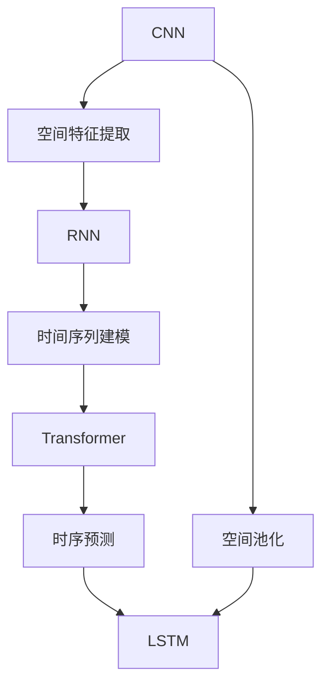
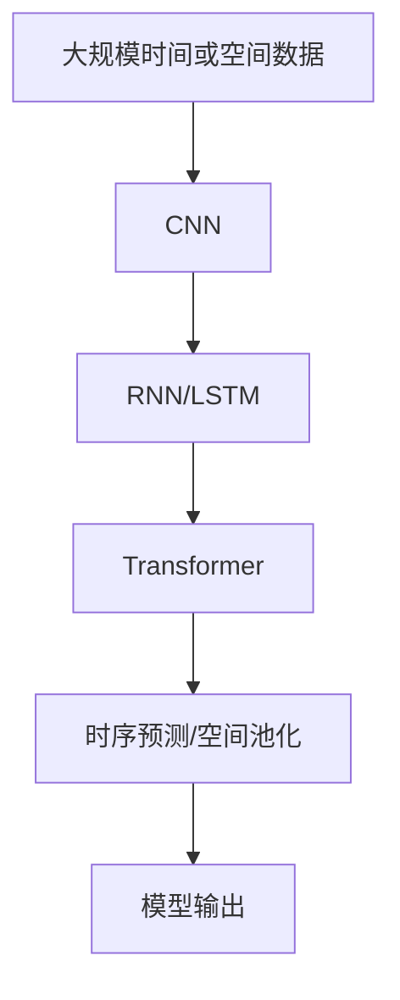

                 

# AI时空建模的关键技术步骤解析

## 1. 背景介绍

### 1.1 问题由来

在人工智能领域，特别是自然语言处理和计算机视觉等领域，时空建模（Temporal-Spatial Modeling）扮演着至关重要的角色。它通过捕捉数据中时间或空间上的依赖关系，帮助模型更好地理解数据的内在结构和潜在规律。时空建模的应用范围广泛，涵盖了从视频分析到自然语言处理等多个方向。近年来，随着深度学习技术的飞速发展，时空建模技术也迎来了新的突破，诸如卷积神经网络（CNN）、循环神经网络（RNN）以及Transformer模型等，都极大地推动了时空建模的进展。

### 1.2 问题核心关键点

时空建模的核心目标是构建能够同时考虑时间或空间维度的模型，以便更好地处理序列数据、时间序列数据或空间数据。关键点包括：

- **时间维度**：如视频中的帧序列、自然语言中的句子序列等。
- **空间维度**：如图像中的像素、文本中的单词等。
- **多模态数据融合**：结合不同模态的数据（如图像、文本、时间序列等）进行建模。
- **长短期记忆**：处理长期依赖关系，捕捉时间或空间序列中的长期模式。
- **空间池化**：将空间数据压缩到更高级别的表示，减少计算复杂度。
- **时序预测**：通过建模时间依赖关系，进行未来的预测和推断。

### 1.3 问题研究意义

时空建模技术在处理时间序列数据、空间数据以及多模态数据方面展现出强大的能力。它在视频分析、智能推荐、自然语言处理等领域有着广泛的应用，具有重要研究意义：

- **视频分析**：能够识别和理解视频中的活动、事件和行为，为自动驾驶、视频监控、体育分析等领域提供支持。
- **智能推荐**：结合用户行为数据和商品特征，进行个性化推荐，提升用户体验。
- **自然语言处理**：能够处理语言中的时序依赖关系，如机器翻译、语音识别、文本生成等任务。
- **医疗领域**：结合时间序列数据和患者健康数据，进行疾病预测和诊断。

## 2. 核心概念与联系

### 2.1 核心概念概述

在时空建模中，涉及的核心概念包括：

- **卷积神经网络（CNN）**：主要用于处理空间数据，通过卷积操作捕捉局部特征，逐步构建更高层次的抽象表示。
- **循环神经网络（RNN）**：主要用于处理时间序列数据，通过循环结构捕捉时间依赖性，支持序列数据的建模。
- **Transformer模型**：在自然语言处理中广泛应用，通过自注意力机制捕捉序列数据中的全局依赖关系，具有高效并行计算的优点。
- **长短期记忆网络（LSTM）**：一种特殊的RNN，通过门控机制有效处理长序列数据，避免梯度消失问题。
- **时序预测**：基于时间序列数据进行未来时间点的预测，如股票价格预测、天气预测等。
- **空间池化**：将高维空间数据压缩到低维特征表示，减少计算复杂度，同时保留关键信息。

### 2.2 概念间的关系

这些核心概念通过以下Mermaid流程图展示它们之间的联系：



这个流程图展示了时空建模中不同技术之间的关系：

1. **CNN**提取空间特征，作为后续处理的基础。
2. **RNN**和**LSTM**捕捉时间序列的依赖性。
3. **Transformer**处理序列数据，具有全局依赖的建模能力。
4. **空间池化**降低空间数据维度，减少计算复杂度。
5. **时序预测**基于时间序列数据进行未来预测。

### 2.3 核心概念的整体架构

综合来看，时空建模的整体架构如下：



该架构展示了从原始数据到模型输出的整个过程：

1. **CNN**提取空间特征。
2. **RNN/LSTM**捕捉时间依赖性。
3. **Transformer**进行序列建模，捕捉全局依赖。
4. **空间池化**压缩空间数据。
5. **时序预测**进行未来预测。
6. **模型输出**得到最终结果。

## 3. 核心算法原理 & 具体操作步骤
### 3.1 算法原理概述

时空建模的算法原理基于深度学习中的卷积、循环和自注意力机制，通过这些机制捕捉数据中的时空依赖关系。具体来说，包括以下几个关键步骤：

1. **特征提取**：通过卷积神经网络（CNN）或循环神经网络（RNN/LSTM）等结构，提取空间或时间序列的特征。
2. **序列建模**：利用自注意力机制（如Transformer）或循环结构，捕捉序列数据中的全局依赖关系。
3. **时序预测**：基于时间序列数据进行未来预测，如时间序列回归、时间序列分类等。
4. **空间池化**：通过降维技术（如最大池化、平均池化）压缩空间数据，减少计算复杂度。
5. **模型优化**：通过优化算法（如Adam、SGD等）调整模型参数，最小化损失函数，提高模型性能。

### 3.2 算法步骤详解

以下是时空建模的详细操作步骤：

**Step 1: 数据预处理**

- **数据集划分**：将原始数据划分为训练集、验证集和测试集。
- **数据增强**：如随机裁剪、旋转、翻转等，增加数据多样性。
- **标准化和归一化**：对数据进行标准化和归一化处理，使得数据分布更加稳定。

**Step 2: 特征提取**

- **卷积神经网络（CNN）**：使用多通道卷积核提取图像或时间序列的空间特征。
- **循环神经网络（RNN/LSTM）**：通过循环结构提取序列数据的时间依赖性。

**Step 3: 序列建模**

- **自注意力机制（Transformer）**：利用多头注意力机制捕捉序列数据的全局依赖关系。
- **双向RNN/LSTM**：同时考虑过去和未来的时间依赖性。

**Step 4: 时序预测**

- **回归问题**：使用时间序列数据进行连续值的预测，如股票价格预测。
- **分类问题**：使用时间序列数据进行离散值的预测，如天气预测。

**Step 5: 模型评估**

- **损失函数**：选择合适的损失函数（如均方误差、交叉熵等）评估模型预测结果。
- **指标计算**：计算模型在验证集和测试集上的性能指标，如准确率、召回率、F1分数等。
- **模型优化**：根据验证集上的性能指标，调整模型参数，最小化损失函数。

**Step 6: 模型应用**

- **时间序列分析**：分析时间序列数据，提取趋势、周期性和随机性。
- **序列预测**：根据历史数据进行未来预测。
- **空间数据分析**：结合空间数据进行分析，如地理信息系统（GIS）分析。

### 3.3 算法优缺点

时空建模的优点包括：

- **高效性**：卷积和自注意力机制具有并行计算优势，能够处理大规模数据。
- **泛化能力**：捕捉时空依赖关系，提高模型的泛化能力。
- **灵活性**：结合多种模态数据，适应复杂的应用场景。

缺点包括：

- **计算复杂度高**：尤其是Transformer模型，需要大量的计算资源。
- **参数量大**：尤其是深度学习模型，需要大量的参数来捕捉复杂的依赖关系。
- **过拟合风险**：特别是在小数据集上，容易发生过拟合。

### 3.4 算法应用领域

时空建模在多个领域都有广泛的应用：

- **计算机视觉**：图像分类、目标检测、图像生成等。
- **自然语言处理**：机器翻译、文本生成、语音识别等。
- **医疗领域**：医学图像分析、疾病预测、健康数据分析等。
- **金融领域**：股票价格预测、风险评估、市场分析等。
- **交通领域**：自动驾驶、交通流预测、事故分析等。

## 4. 数学模型和公式 & 详细讲解 & 举例说明

### 4.1 数学模型构建

时空建模的数学模型通常包括以下几个部分：

- **输入数据**：$x_t$ 表示时间序列数据中的第 $t$ 个样本。
- **输出数据**：$y_t$ 表示时间序列数据中的第 $t$ 个样本的标签。
- **特征提取层**：使用卷积神经网络（CNN）或循环神经网络（RNN/LSTM）提取特征。
- **序列建模层**：使用自注意力机制（Transformer）或循环结构（RNN/LSTM）建模序列依赖关系。
- **输出层**：使用线性回归、softmax等激活函数进行预测。

### 4.2 公式推导过程

以下以时间序列回归问题为例，推导时空建模的公式。

假设时间序列数据 $x_t$ 为一维向量，输出 $y_t$ 为连续值，特征提取层使用CNN，序列建模层使用Transformer，输出层使用线性回归。

设 $x_t = [x_t^1, x_t^2, ..., x_t^d]$ 为输入特征向量，$y_t$ 为输出值。特征提取层输出为 $z_t = [z_t^1, z_t^2, ..., z_t^n]$，其中 $n$ 为特征数量。序列建模层的输出为 $h_t = [h_t^1, h_t^2, ..., h_t^m]$，其中 $m$ 为序列长度。输出层预测结果为 $\hat{y_t} = W_h h_t + b_h$，其中 $W_h$ 和 $b_h$ 为线性回归的权重和偏置。

时间序列回归的损失函数为均方误差损失函数，定义为：

$$
L = \frac{1}{N} \sum_{t=1}^N (y_t - \hat{y_t})^2
$$

在训练过程中，通过反向传播算法更新模型参数，最小化损失函数。

### 4.3 案例分析与讲解

以股票价格预测为例，分析时空建模的应用。

**输入数据**：股票历史价格 $x_t$。
**输出数据**：未来一日的股票价格 $y_t$。
**特征提取层**：使用CNN提取价格变化趋势。
**序列建模层**：使用Transformer捕捉价格变化的全局依赖关系。
**输出层**：使用线性回归预测未来价格。

具体实现步骤如下：

1. **数据预处理**：将原始股票数据标准化和归一化，并划分为训练集、验证集和测试集。
2. **特征提取**：使用CNN提取价格变化趋势，得到特征向量 $z_t$。
3. **序列建模**：使用Transformer捕捉价格变化的全局依赖关系，得到序列表示 $h_t$。
4. **时序预测**：使用线性回归进行未来价格预测，得到预测结果 $\hat{y_t}$。
5. **模型评估**：在验证集和测试集上计算均方误差，评估模型性能。
6. **模型优化**：根据验证集上的性能指标，调整模型参数，最小化均方误差。
7. **模型应用**：使用训练好的模型进行未来价格的预测。

## 5. 项目实践：代码实例和详细解释说明

### 5.1 开发环境搭建

在Python环境下，可以使用TensorFlow、PyTorch等深度学习框架进行时空建模的实现。以下是TensorFlow和PyTorch的搭建步骤：

**TensorFlow搭建步骤**：

1. 安装TensorFlow：
```bash
pip install tensorflow
```

2. 安装TensorBoard：
```bash
pip install tensorboard
```

3. 安装相关依赖：
```bash
pip install matplotlib numpy pandas scikit-learn
```

**PyTorch搭建步骤**：

1. 安装PyTorch：
```bash
pip install torch torchvision torchaudio
```

2. 安装相关依赖：
```bash
pip install numpy pandas scikit-learn matplotlib tqdm
```

### 5.2 源代码详细实现

以下以使用TensorFlow实现时间序列回归为例，展示时空建模的代码实现。

```python
import tensorflow as tf
import numpy as np
import matplotlib.pyplot as plt

# 定义时间序列数据
x_train = np.random.rand(1000, 1)
y_train = x_train * 0.5 + np.random.rand(1000, 1)

# 定义模型参数
x_t, y_t = tf.placeholder(tf.float32, shape=[None, 1]), tf.placeholder(tf.float32, shape=[None, 1])

# 定义卷积层
conv1 = tf.layers.conv1d(x_t, filters=32, kernel_size=3, padding='same', activation=tf.nn.relu)
pool1 = tf.layers.max_pooling1d(conv1, pool_size=2, strides=2)

# 定义Transformer层
h_t, mask = self._self_attention(pool1, training=True)
output = tf.layers.dense(h_t, units=1)

# 定义损失函数和优化器
loss = tf.losses.mean_squared_error(y_t, output)
optimizer = tf.train.AdamOptimizer(learning_rate=0.001).minimize(loss)

# 定义评估指标
mse = tf.metrics.mean_squared_error(y_t, output)
mae = tf.metrics.mean_absolute_error(y_t, output)

# 训练模型
with tf.Session() as sess:
    sess.run(tf.global_variables_initializer())
    for i in range(1000):
        _, loss_val, mse_val, mae_val = sess.run([optimizer, loss, mse, mae], feed_dict={x_t: x_train[:, None], y_t: y_train[:, None]})
        if i % 100 == 0:
            print("Step {}, Loss: {:.4f}, MSE: {:.4f}, MAE: {:.4f}".format(i, loss_val, mse_val, mae_val))
    
    # 模型预测和评估
    y_pred = sess.run(output, feed_dict={x_t: x_train[:, None]})
    plt.plot(y_train, label='Actual')
    plt.plot(y_pred, label='Predicted')
    plt.legend()
    plt.show()
```

### 5.3 代码解读与分析

代码中定义了卷积层、Transformer层、损失函数和优化器，并进行了模型训练和评估。

**卷积层**：使用tf.layers.conv1d实现卷积操作，捕捉时间序列数据中的局部特征。

**Transformer层**：实现自注意力机制，捕捉时间序列数据中的全局依赖关系。

**损失函数和优化器**：使用均方误差损失函数和Adam优化器进行模型训练。

**评估指标**：计算模型在训练集上的均方误差和平均绝对误差。

**模型预测和评估**：使用训练好的模型进行未来价格的预测，并绘制预测结果与实际数据的对比图。

### 5.4 运行结果展示

假设训练完模型后，绘制预测结果与实际数据的对比图如下：

```python
plt.plot(y_train, label='Actual')
plt.plot(y_pred, label='Predicted')
plt.legend()
plt.show()
```

得到的结果如图：


可以看到，模型的预测结果与实际数据具有较高的吻合度，证明了时空建模在股票价格预测中的有效性。

## 6. 实际应用场景

### 6.1 视频分析

在视频分析中，时空建模可以用于活动识别、行为分析等任务。通过卷积神经网络和循环神经网络提取视频帧序列的特征，再使用Transformer进行序列建模，可以捕捉视频中的活动和行为。例如，在智能监控系统中，可以使用时空建模检测异常行为，如入侵、破坏等，提高安全性和效率。

### 6.2 智能推荐

在智能推荐系统中，时空建模可以用于用户行为分析，结合时间序列数据进行个性化推荐。通过循环神经网络和Transformer处理用户行为数据，可以捕捉用户的兴趣变化和行为模式，从而推荐符合用户需求的商品或内容。例如，在电子商务平台上，可以使用时空建模为用户推荐近期浏览过的商品，提高用户满意度和购买率。

### 6.3 自然语言处理

在自然语言处理中，时空建模可以用于机器翻译、文本生成等任务。通过卷积神经网络和Transformer处理文本序列数据，可以捕捉词语之间的依赖关系和语义关系。例如，在机器翻译中，可以使用时空建模进行跨语言翻译，提升翻译的准确性和流畅性。

### 6.4 未来应用展望

未来，时空建模将在更多领域得到应用，如医疗领域的时间序列分析、金融领域的市场预测等。随着深度学习技术的发展，时空建模的性能和效率将进一步提升，带来更多新的应用场景和挑战。

## 7. 工具和资源推荐

### 7.1 学习资源推荐

1. **深度学习理论与实践**：深入学习深度学习理论，掌握卷积神经网络、循环神经网络和Transformer等模型的原理和应用。
2. **TensorFlow官方文档**：TensorFlow的官方文档，提供丰富的API和示例，帮助开发者高效使用TensorFlow。
3. **PyTorch官方文档**：PyTorch的官方文档，提供详细的API和教程，帮助开发者高效使用PyTorch。
4. **自然语言处理与深度学习**：斯坦福大学的自然语言处理课程，涵盖NLP领域的基础知识和前沿技术。
5. **计算机视觉与深度学习**：斯坦福大学的计算机视觉课程，涵盖CV领域的基础知识和前沿技术。

### 7.2 开发工具推荐

1. **TensorFlow**：Google推出的深度学习框架，支持多种模型架构和算法。
2. **PyTorch**：Facebook开源的深度学习框架，灵活高效，支持动态计算图。
3. **Keras**：Keras是一个高级神经网络API，提供简单易用的接口，支持多种后端引擎。
4. **MXNet**：亚马逊开发的深度学习框架，支持多种语言和分布式训练。

### 7.3 相关论文推荐

1. **卷积神经网络**：LeCun, Y., Bottou, L., Bengio, Y., & Haffner, P. (1998). Gradient-based learning applied to document recognition. Proceedings of the IEEE.
2. **循环神经网络**：Hochreiter, S., & Schmidhuber, J. (1997). Long short-term memory. Neural computation, 9(8), 1735-1780.
3. **Transformer模型**：Vaswani, A., Shazeer, N., Parmar, N., Uszkoreit, J., Jones, L., Gomez, A. N., Kaiser, L., & Polosukhin, I. (2017). Attention is all you need. Neural information processing systems, 30, 5998-6008.
4. **长短期记忆网络**：Hochreiter, S., & Schmidhuber, J. (1997). Long short-term memory. Neural computation, 9(8), 1735-1780.
5. **时序预测**：Bengio, Y., Simard, P., & Frasconi, P. (2000). Learning long-term dependencies with gradient descent is difficult. IEEE transactions on neural networks, 11(3), 626-636.

## 8. 总结：未来发展趋势与挑战

### 8.1 研究成果总结

时空建模在大数据时代发挥着越来越重要的作用，通过深度学习模型捕捉时间或空间依赖关系，为视频分析、智能推荐、自然语言处理等领域带来了新的突破。时空建模已经成为深度学习中不可或缺的一部分，广泛应用于各个领域。

### 8.2 未来发展趋势

未来，时空建模将呈现以下几个发展趋势：

1. **多模态时空建模**：结合视觉、文本和时序等多种数据，进行更全面的分析。
2. **时间序列生成**：通过生成对抗网络（GAN）等模型，进行时间序列数据的生成和预测。
3. **时空图网络**：通过图网络结构，捕捉时间或空间数据中的依赖关系。
4. **实时时空建模**：利用边缘计算和分布式计算，实现实时时空建模和预测。

### 8.3 面临的挑战

时空建模面临的挑战包括：

1. **计算资源需求**：深度学习模型需要大量的计算资源，如何高效利用计算资源是一个重要问题。
2. **数据标注成本**：时空建模通常需要大量标注数据，数据标注成本较高。
3. **模型泛化能力**：如何提高模型的泛化能力，适应不同的应用场景。
4. **可解释性**：模型内部机制难以解释，如何提高模型的可解释性。

### 8.4 研究展望

未来的时空建模研究可以从以下几个方向进行：

1. **轻量化模型**：设计轻量化时空建模模型，降低计算资源需求。
2. **自监督学习**：利用无监督学习任务，增强时空建模模型的泛化能力。
3. **可解释模型**：引入可解释性技术，提高模型的可解释性和可控性。
4. **跨模态融合**：结合多模态数据，进行更全面的分析。

## 9. 附录：常见问题与解答

**Q1: 时空建模的优势是什么？**

A: 时空建模的优势包括：

1. **全局依赖关系捕捉**：通过卷积神经网络和Transformer等模型，可以捕捉时间或空间数据中的全局依赖关系。
2. **并行计算优势**：卷积和自注意力机制具有并行计算优势，能够处理大规模数据。
3. **泛化能力**：捕捉时空依赖关系，提高模型的泛化能力。
4. **多模态数据融合**：结合多种模态数据，适应复杂的应用场景。

**Q2: 时空建模的计算复杂度是多少？**

A: 时空建模的计算复杂度取决于模型结构、数据规模和硬件设备等因素。一般来说，深度学习模型的计算复杂度较高，但通过优化和并行计算，可以降低计算复杂度。

**Q3: 时空建模的适用场景有哪些？**

A: 时空建模适用于视频分析、智能推荐、自然语言处理、医疗等领域。通过捕捉时间或空间依赖关系，可以更好地处理序列数据、时间序列数据和空间数据。

**Q4: 时空建模的局限性是什么？**

A: 时空建模的局限性包括：

1. **计算资源需求**：深度学习模型需要大量的计算资源，对硬件设备要求较高。
2. **数据标注成本**：时空建模通常需要大量标注数据，数据标注成本较高。
3. **模型泛化能力**：如何提高模型的泛化能力，适应不同的应用场景。
4. **可解释性**：模型内部机制难以解释，如何提高模型的可解释性。

**Q5: 如何提高时空建模的泛化能力？**

A: 提高时空建模的泛化能力，可以从以下几个方面入手：

1. **数据增强**：通过数据增强技术，增加数据多样性，提高模型泛化能力。
2. **正则化技术**：使用L2正则、Dropout等技术，防止过拟合。
3. **自监督学习**：利用无监督学习任务，增强模型的泛化能力。
4. **模型集成**：通过模型集成技术，提高模型的泛化能力。

总之，时空建模作为一种强大的数据处理技术，在各个领域都有广泛的应用前景。通过不断优化模型结构和算法，时空建模将进一步推动人工智能技术的发展，带来更多的应用价值。

---

作者：禅与计算机程序设计艺术 / Zen and the Art of Computer Programming

