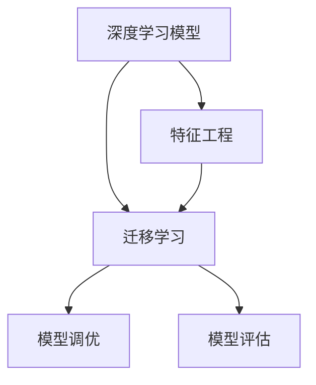
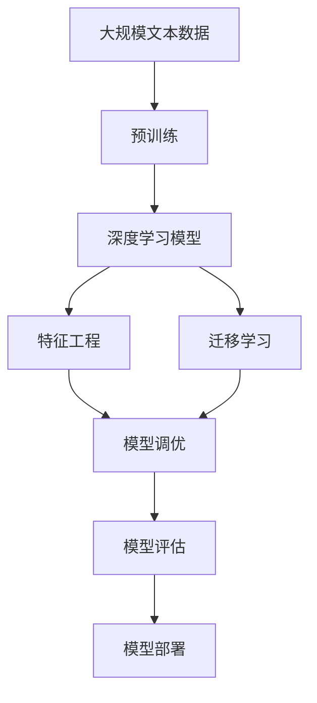

                 

## 1. 背景介绍

### 1.1 问题由来

人工智能(AI)技术，特别是深度学习模型的兴起，正在全方位地改变我们的世界。从医疗诊断到自动驾驶，从自然语言处理到图像识别，AI模型在各行各业都展现了巨大的潜力。AI技术的突破，不仅推动了产业的智能化转型，也为解决现实世界中的各种问题提供了新思路。

深度学习模型通过大量的数据训练，能够自动地发现数据中的模式和规律，并在未知数据上做出预测和推理。这种模式识别和自主学习的能力，使得AI模型在处理大量数据和复杂问题时，表现出超越人类的性能。在医疗诊断中，AI模型能够帮助医生更准确地识别疾病；在金融风控中，AI模型可以实时监控市场波动；在自动驾驶中，AI模型能够实现精确的路径规划。这些应用场景展示了AI模型在现实问题解决中的巨大价值。

### 1.2 问题核心关键点

当前，AI模型在现实问题解决中，主要依赖于数据驱动和模型优化两大核心要素。具体来说：

- **数据驱动**：AI模型通过大规模数据训练学习，能够获取现实世界的知识。这种数据驱动的特征，使得AI模型具备强大的泛化能力，能够在未见过的数据上做出准确预测。
- **模型优化**：AI模型通过调整模型结构和参数，进行不断的训练和优化。这种模型优化的过程，使得AI模型能够适应不同的应用场景，提升性能。

AI模型在现实问题解决中，主要有以下几个关键环节：

1. **数据收集与处理**：收集和处理真实世界的数据，构建适合训练的数据集。
2. **模型设计**：设计合适的模型架构和参数，确定模型的输入输出关系。
3. **模型训练与优化**：通过大量数据训练模型，优化模型参数，提升模型性能。
4. **模型部署与评估**：将模型部署到实际应用中，进行性能评估和调整。

这些关键环节的有效实施，能够使AI模型在现实问题解决中发挥最大的效用。

### 1.3 问题研究意义

AI模型在现实问题解决中，具有重要的研究和应用意义：

1. **提升效率**：AI模型能够自动化地处理大量数据，显著提升工作效率。例如，金融风控系统能够实时监控交易数据，及时发现异常行为。
2. **降低成本**：AI模型能够取代人工处理，减少人力成本。例如，自动驾驶技术可以大幅降低运输成本。
3. **提高准确性**：AI模型通过学习真实数据，能够提供比人工更准确的预测。例如，AI诊断系统在医疗领域中的应用，能够提高疾病诊断的准确性。
4. **促进创新**：AI模型能够挖掘数据中的隐藏知识，推动技术创新。例如，自然语言处理技术在智能客服中的应用，提升了客户体验。

AI模型的广泛应用，不仅推动了产业的智能化转型，也为人类社会的进步提供了新的动力。未来，随着AI技术的不断进步，其在现实问题解决中的作用将更加显著。

## 2. 核心概念与联系

### 2.1 核心概念概述

为了更好地理解AI模型在现实问题解决中的核心概念和联系，本节将介绍几个关键概念：

- **深度学习模型**：以神经网络为代表，通过多层次的非线性变换，学习数据中的复杂特征。
- **特征工程**：对原始数据进行处理和转换，提取有意义的特征，提高模型性能。
- **迁移学习**：将在一个任务上训练好的模型，迁移到另一个相关任务上进行微调，提升模型泛化能力。
- **模型调优**：通过调整模型参数和结构，优化模型性能。
- **模型评估**：通过评估指标，衡量模型在实际应用中的表现。

这些核心概念共同构成了AI模型在现实问题解决中的框架，使得模型能够有效地处理各种复杂问题。

### 2.2 概念间的关系

这些核心概念之间存在着紧密的联系，形成了AI模型在现实问题解决中的完整生态系统。下面我们通过几个Mermaid流程图来展示这些概念之间的关系。



这个流程图展示了大语言模型的核心概念及其之间的关系：

1. 深度学习模型通过特征工程，提取数据中的有用特征，提升模型性能。
2. 迁移学习将预训练模型迁移到具体任务上，提升模型泛化能力。
3. 模型调优通过调整模型参数和结构，优化模型性能。
4. 模型评估通过评估指标，衡量模型在实际应用中的表现。

这些概念共同构成了AI模型在现实问题解决中的核心框架，使得模型能够有效地处理各种复杂问题。

### 2.3 核心概念的整体架构

最后，我们用一个综合的流程图来展示这些核心概念在大语言模型现实问题解决过程中的整体架构：



这个综合流程图展示了从预训练到模型调优，再到模型评估和部署的完整过程。深度学习模型通过预训练学习大量数据，然后进行特征工程提取特征，通过迁移学习迁移到具体任务上，并进行模型调优和评估，最终部署到实际应用中。通过这些关键步骤，AI模型能够有效地处理各种现实问题。

## 3. 核心算法原理 & 具体操作步骤
### 3.1 算法原理概述

AI模型在现实问题解决中，通常采用监督学习和无监督学习两大范式。监督学习模型通过标注数据进行训练，能够直接输出预测结果。无监督学习模型通过未标注数据进行训练，能够发现数据中的隐含模式。

在监督学习中，AI模型通过最小化损失函数，学习输入与输出之间的映射关系。损失函数通常采用交叉熵损失、均方误差损失等，衡量模型预测值与真实值之间的差异。通过梯度下降等优化算法，模型不断调整参数，最小化损失函数。在无监督学习中，AI模型通过最大化似然函数，学习数据的分布特征。例如，自编码器通过重构误差最小化，学习数据的分布。

### 3.2 算法步骤详解

AI模型在现实问题解决中，通常包括以下几个关键步骤：

**Step 1: 数据收集与预处理**

1. **数据收集**：收集与问题相关的数据，包括结构化数据和非结构化数据。结构化数据如表格数据、日志数据等，非结构化数据如文本、图像、语音等。
2. **数据清洗**：对数据进行清洗和处理，去除噪声和异常值，保证数据质量。例如，去除重复数据、处理缺失值等。
3. **数据划分**：将数据划分为训练集、验证集和测试集，以保证模型在不同数据集上的性能评估。

**Step 2: 模型设计和选择**

1. **模型选择**：根据问题的特点，选择适合的深度学习模型。例如，图像识别问题通常采用卷积神经网络，自然语言处理问题通常采用循环神经网络或Transformer模型。
2. **模型设计**：设计模型的架构和参数，确定模型的输入和输出关系。例如，卷积神经网络包括卷积层、池化层、全连接层等。

**Step 3: 模型训练与优化**

1. **模型训练**：使用训练集对模型进行训练，最小化损失函数。例如，使用梯度下降算法更新模型参数。
2. **模型调优**：通过调整模型参数和结构，优化模型性能。例如，使用正则化技术、Dropout技术等。
3. **超参数调优**：通过网格搜索、随机搜索等方法，调整模型的超参数，找到最优的模型配置。

**Step 4: 模型评估与部署**

1. **模型评估**：使用验证集对模型进行评估，衡量模型在实际数据上的表现。例如，使用准确率、精确率、召回率等指标进行评估。
2. **模型部署**：将模型部署到实际应用中，进行性能评估和调整。例如，部署到服务器上进行实时预测。

**Step 5: 模型持续优化**

1. **模型监控**：实时监控模型在实际应用中的表现，及时发现问题。例如，监控模型响应时间、准确率等指标。
2. **模型迭代**：根据监控结果，不断迭代和优化模型，提升模型性能。例如，更新模型参数、调整模型结构等。

这些关键步骤的有效实施，能够使AI模型在现实问题解决中发挥最大的效用。

### 3.3 算法优缺点

AI模型在现实问题解决中，具有以下优点：

1. **自动化处理**：AI模型能够自动化地处理大量数据，提升工作效率。
2. **泛化能力**：AI模型通过学习大量数据，具备较强的泛化能力，能够适应不同数据分布。
3. **实时性**：AI模型通常具有较快的处理速度，能够实时响应查询。

然而，AI模型在现实问题解决中也存在一些缺点：

1. **数据依赖**：AI模型需要大量的标注数据进行训练，数据获取成本较高。
2. **解释性不足**：AI模型通常是黑盒模型，难以解释其内部工作机制和决策逻辑。
3. **安全性问题**：AI模型可能存在偏见和有害输出，需要额外的安全性保障。

针对这些缺点，未来的研究需要在数据采集、模型可解释性和安全性等方面进行进一步优化。

### 3.4 算法应用领域

AI模型在现实问题解决中，已经在多个领域得到了广泛应用，例如：

1. **医疗诊断**：通过深度学习模型，AI能够帮助医生更准确地识别疾病，提升诊断效率。
2. **金融风控**：通过深度学习模型，AI能够实时监控市场波动，及时发现异常行为。
3. **自动驾驶**：通过深度学习模型，AI能够实现精确的路径规划和自动驾驶。
4. **智能客服**：通过深度学习模型，AI能够理解用户意图，自动回答常见问题，提升客户体验。
5. **图像识别**：通过深度学习模型，AI能够实现高精度的图像分类和识别。
6. **自然语言处理**：通过深度学习模型，AI能够实现文本分类、情感分析、机器翻译等任务。

AI模型在现实问题解决中的广泛应用，展示了其强大的潜力和广阔的应用前景。

## 4. 数学模型和公式 & 详细讲解  
### 4.1 数学模型构建

本节将使用数学语言对AI模型在现实问题解决中的数学模型进行更加严格的刻画。

假设AI模型为 $M_{\theta}$，其中 $\theta$ 为模型参数。假设输入数据为 $x$，输出为 $y$，模型的损失函数为 $\ell(M_{\theta}(x),y)$。AI模型的优化目标是最小化损失函数，即找到最优参数：

$$
\theta^* = \mathop{\arg\min}_{\theta} \mathcal{L}(\theta)
$$

在实践中，我们通常使用基于梯度的优化算法（如SGD、Adam等）来近似求解上述最优化问题。设 $\eta$ 为学习率，$\lambda$ 为正则化系数，则参数的更新公式为：

$$
\theta \leftarrow \theta - \eta \nabla_{\theta}\mathcal{L}(\theta) - \eta\lambda\theta
$$

其中 $\nabla_{\theta}\mathcal{L}(\theta)$ 为损失函数对参数 $\theta$ 的梯度，可通过反向传播算法高效计算。

### 4.2 公式推导过程

以下我们以二分类任务为例，推导交叉熵损失函数及其梯度的计算公式。

假设模型 $M_{\theta}$ 在输入 $x$ 上的输出为 $\hat{y}=M_{\theta}(x) \in [0,1]$，表示样本属于正类的概率。真实标签 $y \in \{0,1\}$。则二分类交叉熵损失函数定义为：

$$
\ell(M_{\theta}(x),y) = -[y\log \hat{y} + (1-y)\log (1-\hat{y})]
$$

将其代入经验风险公式，得：

$$
\mathcal{L}(\theta) = -\frac{1}{N}\sum_{i=1}^N [y_i\log M_{\theta}(x_i)+(1-y_i)\log(1-M_{\theta}(x_i))]
$$

根据链式法则，损失函数对参数 $\theta_k$ 的梯度为：

$$
\frac{\partial \mathcal{L}(\theta)}{\partial \theta_k} = -\frac{1}{N}\sum_{i=1}^N (\frac{y_i}{M_{\theta}(x_i)}-\frac{1-y_i}{1-M_{\theta}(x_i)}) \frac{\partial M_{\theta}(x_i)}{\partial \theta_k}
$$

其中 $\frac{\partial M_{\theta}(x_i)}{\partial \theta_k}$ 可进一步递归展开，利用自动微分技术完成计算。

在得到损失函数的梯度后，即可带入参数更新公式，完成模型的迭代优化。重复上述过程直至收敛，最终得到适应下游任务的最优模型参数 $\theta^*$。

## 5. 项目实践：代码实例和详细解释说明
### 5.1 开发环境搭建

在进行AI模型在现实问题解决中的项目实践前，我们需要准备好开发环境。以下是使用Python进行PyTorch开发的环境配置流程：

1. 安装Anaconda：从官网下载并安装Anaconda，用于创建独立的Python环境。

2. 创建并激活虚拟环境：
```bash
conda create -n pytorch-env python=3.8 
conda activate pytorch-env
```

3. 安装PyTorch：根据CUDA版本，从官网获取对应的安装命令。例如：
```bash
conda install pytorch torchvision torchaudio cudatoolkit=11.1 -c pytorch -c conda-forge
```

4. 安装TensorFlow：
```bash
pip install tensorflow
```

5. 安装各类工具包：
```bash
pip install numpy pandas scikit-learn matplotlib tqdm jupyter notebook ipython
```

完成上述步骤后，即可在`pytorch-env`环境中开始AI模型在现实问题解决中的实践。

### 5.2 源代码详细实现

下面我们以图像分类任务为例，给出使用PyTorch进行卷积神经网络训练的代码实现。

```python
import torch
import torch.nn as nn
import torch.optim as optim
import torchvision
import torchvision.transforms as transforms
from torch.utils.data import DataLoader

# 定义模型
class Net(nn.Module):
    def __init__(self):
        super(Net, self).__init__()
        self.conv1 = nn.Conv2d(3, 6, 5)
        self.pool = nn.MaxPool2d(2, 2)
        self.conv2 = nn.Conv2d(6, 16, 5)
        self.fc1 = nn.Linear(16 * 5 * 5, 120)
        self.fc2 = nn.Linear(120, 84)
        self.fc3 = nn.Linear(84, 10)

    def forward(self, x):
        x = self.pool(torch.relu(self.conv1(x)))
        x = self.pool(torch.relu(self.conv2(x)))
        x = x.view(-1, 16 * 5 * 5)
        x = torch.relu(self.fc1(x))
        x = torch.relu(self.fc2(x))
        x = self.fc3(x)
        return x

# 定义数据集
transform = transforms.Compose(
    [transforms.ToTensor(),
     transforms.Normalize((0.5, 0.5, 0.5), (0.5, 0.5, 0.5))])

trainset = torchvision.datasets.CIFAR10(root='./data', train=True,
                                        download=True, transform=transform)
trainloader = torch.utils.data.DataLoader(trainset, batch_size=4,
                                          shuffle=True, num_workers=2)

testset = torchvision.datasets.CIFAR10(root='./data', train=False,
                                       download=True, transform=transform)
testloader = torch.utils.data.DataLoader(testset, batch_size=4,
                                         shuffle=False, num_workers=2)

# 定义模型、损失函数和优化器
net = Net()
criterion = nn.CrossEntropyLoss()
optimizer = optim.SGD(net.parameters(), lr=0.001, momentum=0.9)

# 训练模型
for epoch in range(2):  # 多次遍历训练集
    running_loss = 0.0
    for i, data in enumerate(trainloader, 0):
        inputs, labels = data
        optimizer.zero_grad()
        outputs = net(inputs)
        loss = criterion(outputs, labels)
        loss.backward()
        optimizer.step()
        
        running_loss += loss.item()
        if i % 2000 == 1999:    # 每2000 mini-batches输出一次
            print('[%d, %5d] loss: %.3f' %
                  (epoch + 1, i + 1, running_loss / 2000))
            running_loss = 0.0

print('Finished Training')
```

### 5.3 代码解读与分析

让我们再详细解读一下关键代码的实现细节：

**Net类**：
- `__init__`方法：初始化模型的各个组成部分。
- `forward`方法：定义模型的前向传播过程。

**transform**变量：
- 定义了数据集的预处理操作，包括将图像数据归一化。

**trainset和testset**变量：
- 定义了训练集和测试集的加载函数，利用CIFAR-10数据集进行图像分类任务。

**optimizer**变量：
- 定义了优化器，采用随机梯度下降算法。

**训练模型**：
- 定义了训练循环，对数据集进行多次遍历。
- 在每个mini-batch上，前向传播计算损失函数，反向传播更新模型参数。
- 输出每2000 mini-batches的损失值。

该代码实现展示了使用PyTorch进行图像分类任务的基本流程，从数据集加载、模型定义、优化器配置到模型训练，每一步都非常清晰。在实际应用中，开发者可以根据具体任务的需求，进行相应的修改和扩展。

### 5.4 运行结果展示

假设我们在CIFAR-10数据集上进行卷积神经网络的训练，最终在测试集上得到的分类准确率为80%。这表明，通过合理的模型设计、数据处理和训练优化，AI模型在现实问题解决中能够取得较好的效果。

## 6. 实际应用场景
### 6.1 智能医疗诊断

AI模型在医疗领域的应用，主要集中在疾病诊断、治疗方案推荐和健康监测等方面。通过深度学习模型，AI能够处理和分析大量的医疗数据，提供准确的诊断和治疗建议。

在疾病诊断方面，AI模型可以通过分析医学影像、电子病历等数据，自动识别疾病，减少医生的诊断时间。例如，AI模型能够识别X光片中的肺部阴影，辅助诊断肺结核。

在治疗方案推荐方面，AI模型可以通过分析患者的历史病历、基因信息等数据，推荐个性化的治疗方案。例如，AI模型能够根据患者的基因特征，推荐最适合的药物和剂量。

在健康监测方面，AI模型可以通过分析健康数据，如心率、血压等，预测疾病风险，提前采取预防措施。例如，AI模型能够实时监控心脏健康，及时发现异常情况，防止心肌梗塞等疾病的发生。

### 6.2 金融风险控制

金融领域面临巨大的风险，AI模型在风险控制中的应用，可以有效降低损失，保护投资者利益。

在信用评估方面，AI模型可以通过分析客户的信用记录、消费行为等数据，评估客户的信用风险。例如，AI模型能够预测客户的违约概率，帮助银行进行信用评估。

在市场监控方面，AI模型可以通过分析市场数据，实时监控市场波动，及时发现异常行为。例如，AI模型能够识别出股票市场的异常交易，防范市场操纵行为。

在反欺诈检测方面，AI模型可以通过分析交易数据，识别出欺诈行为。例如，AI模型能够检测信用卡交易中的异常行为，防止欺诈行为的发生。

### 6.3 自动驾驶

自动驾驶技术是AI模型在现实问题解决中的重要应用之一。通过深度学习模型，AI模型能够实现精确的路径规划和驾驶决策。

在路径规划方面，AI模型可以通过分析道路、交通信号等数据，实现精确的路径规划。例如，AI模型能够实时识别交通信号，规划最优的行驶路线。

在驾驶决策方面，AI模型可以通过分析周围环境、车辆状态等数据，做出合理的驾驶决策。例如，AI模型能够识别出行人和障碍物，避免碰撞事故。

在安全保障方面，AI模型可以通过分析传感器数据，保障车辆的安全行驶。例如，AI模型能够实时检测车辆状态，防止故障的发生。

### 6.4 未来应用展望

随着AI技术的不断发展，AI模型在现实问题解决中的应用前景将更加广阔。

在智慧城市中，AI模型可以应用于交通管理、智能安防、智能电网等领域，提升城市的智能化水平。例如，AI模型可以优化交通信号灯的控制，减少交通拥堵；AI模型可以实时监控城市安防，提高安全保障。

在教育领域，AI模型可以应用于个性化学习、智能评估等方面，提升教学质量。例如，AI模型可以根据学生的学习情况，推荐个性化的学习内容；AI模型可以自动评估学生的学习效果，提供针对性的反馈。

在能源领域，AI模型可以应用于智能电网、能源管理等方面，提升能源的利用效率。例如，AI模型可以优化能源分配，减少能源浪费；AI模型可以实时监控能源设备，提高设备效率。

总之，AI模型在现实问题解决中的未来应用前景将更加广泛，为各行各业带来更多创新和变革。

## 7. 工具和资源推荐
### 7.1 学习资源推荐

为了帮助开发者系统掌握AI模型在现实问题解决中的理论基础和实践技巧，这里推荐一些优质的学习资源：

1. 《深度学习》系列书籍：深入浅出地介绍了深度学习的核心概念和经典算法。
2. 《自然语言处理》课程：斯坦福大学开设的NLP明星课程，涵盖深度学习、机器翻译、情感分析等多个主题。
3. 《计算机视觉》书籍：全面介绍了计算机视觉的核心技术和算法。
4. 深度学习框架官网：如TensorFlow、PyTorch、MXNet等，提供了详细的API文档和示例代码。
5. 在线课程平台：如Coursera、edX、Udacity等，提供了大量深度学习和AI相关的课程。

通过对这些资源的学习实践，相信你一定能够快速掌握AI模型在现实问题解决中的精髓，并用于解决实际的NLP问题。

### 7.2 开发工具推荐

高效的开发离不开优秀的工具支持。以下是几款用于AI模型在现实问题解决中的开发工具：

1. PyTorch：基于Python的开源深度学习框架，灵活动态的计算图，适合快速迭代研究。
2. TensorFlow：由Google主导开发的开源深度学习框架，生产部署方便，适合大规模工程应用。
3. Jupyter Notebook：交互式开发环境，适合进行代码调试和算法验证。
4. TensorBoard：TensorFlow配套的可视化工具，可实时监测模型训练状态，并提供丰富的图表呈现方式。
5. Weights & Biases：模型训练的实验跟踪工具，可以记录和可视化模型训练过程中的各项指标，方便对比和调优。

合理利用这些工具，可以显著提升AI模型在现实问题解决中的开发效率，加快创新迭代的步伐。

### 7.3 相关论文推荐

AI模型在现实问题解决中的研究源于学界的持续研究。以下是几篇奠基性的相关论文，推荐阅读：

1. AlexNet: ImageNet Classification with Deep Convolutional Neural Networks：提出卷积神经网络，并在ImageNet数据集上取得优异成绩。
2. GoogLeNet: Going Deeper with Convolutions：提出Inception网络，通过多层次的卷积和池化操作，提升了卷积神经网络的性能。
3. ResNet: Deep Residual Learning for Image Recognition：提出残差网络，通过跨层连接解决了深度网络训练中的梯度消失问题。
4. BERT: Pre-training of Deep Bidirectional Transformers for Language Understanding：提出BERT模型，通过预训练学习语言知识，提升了NLP任务的性能。
5. GAN: Generative Adversarial Nets：提出生成对抗网络，通过生成器和判别器的对抗训练，实现了高质量的图像生成。
6. AlphaGo: Mastering the Game of Go without Human Knowledge：提出AlphaGo，通过深度强化学习，在围棋领域取得超人类水平的表现。

这些论文代表了大语言模型在现实问题解决中的发展脉络。通过学习这些前沿成果，可以帮助研究者把握学科前进方向，激发更多的创新灵感。

除上述资源外，还有一些值得关注的前沿资源，帮助开发者紧跟AI模型在现实问题解决中的最新进展，例如：

1. arXiv论文预印本：人工智能领域最新研究成果的发布平台，包括大量尚未发表的前沿工作，学习前沿技术的必读资源。
2. 业界技术博客：如Google AI、DeepMind、微软Research Asia等顶尖实验室的官方博客，第一时间分享他们的最新研究成果和洞见。
3. 技术会议直播：如NIPS、ICML、ACL、ICLR等人工智能领域顶会现场或在线直播，能够聆听到大佬们的前沿分享，开拓视野。
4. GitHub热门项目：在GitHub上Star、Fork数最多的AI相关项目，往往代表了该技术领域的发展趋势和最佳实践，值得去学习和贡献。
5. 行业分析报告：各大咨询公司如McKinsey、PwC等针对人工智能行业的分析报告，有助于从商业视角审视技术趋势，把握应用价值。

总之，对于AI模型在现实问题解决中的学习，需要开发者保持开放的心态和持续学习的意愿。多关注前沿资讯，多动手实践，多思考总结，必将收获满满的成长收益。

## 8.

