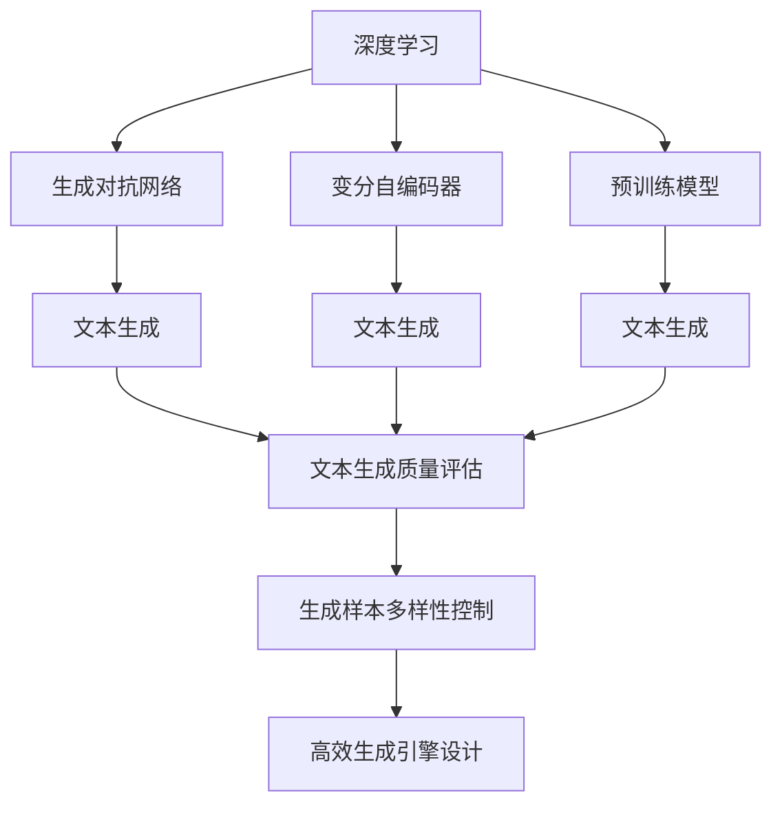
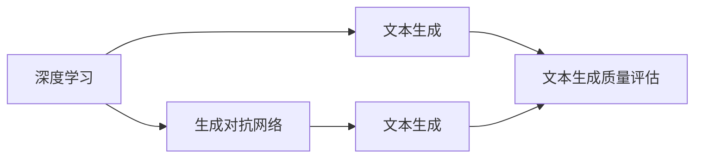
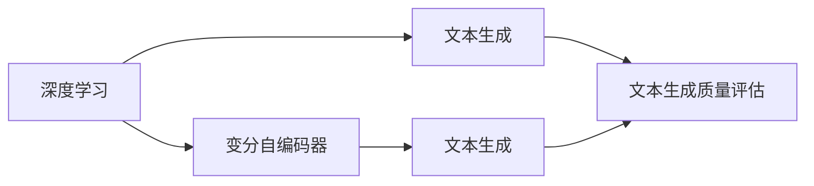
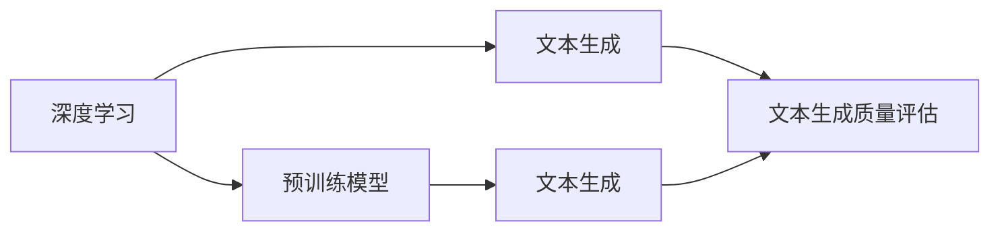
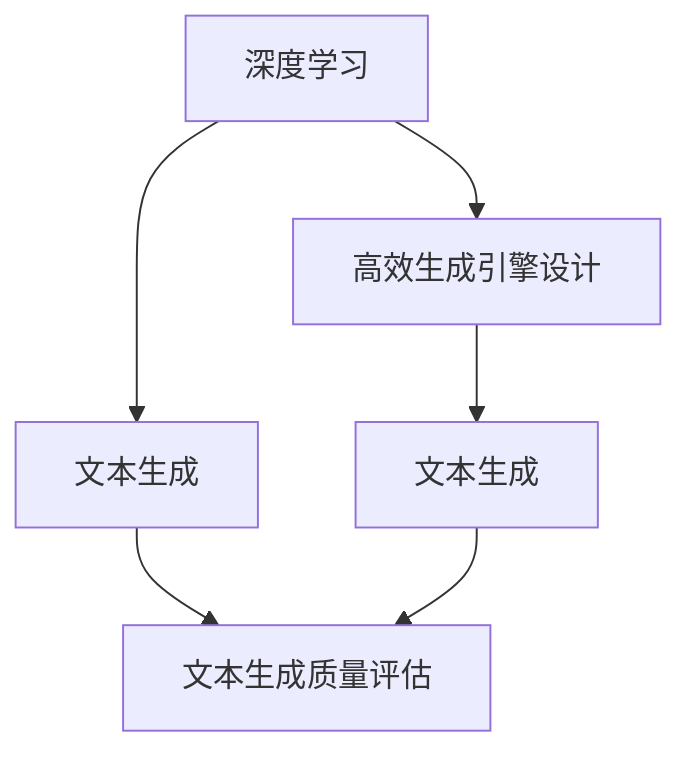
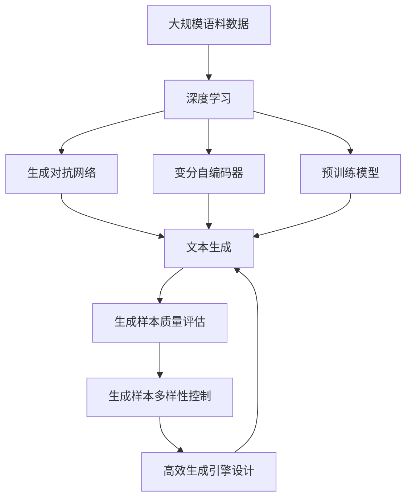

                 

# 深度学习在自然语言生成中的应用

> 关键词：深度学习,自然语言生成,生成对抗网络(GAN),变分自编码器(VAE),Transformer,预训练模型,文本生成,语音合成

## 1. 背景介绍

### 1.1 问题由来
近年来，深度学习技术在自然语言处理(NLP)领域取得了巨大突破。特别是自然语言生成(NLG)领域，从机器翻译、文本摘要、对话生成到自动作文等应用，深度学习模型正在重塑语言生成的方式。这些深度学习模型利用丰富的语言知识，实现了从词汇、句式到语义的自动生成，推动了智能技术的不断进步。

深度学习在自然语言生成中的应用，主要基于两大类模型：生成对抗网络(GAN)和变分自编码器(VAE)。生成对抗网络通过两个对抗性子网络(生成器和判别器)，生成高质量的文本或语音，广泛应用于机器翻译、对话生成等领域。变分自编码器则通过编码-解码机制，学习文本或语音的潜在分布，生成与训练数据分布接近的新样本，常用于文本补全、音频生成等任务。

同时，深度学习还通过预训练模型（如BERT、GPT系列）对大语言模型进行微调，增强其生成能力，进一步推动自然语言生成技术的发展。

### 1.2 问题核心关键点
自然语言生成技术的应用核心在于生成具有自然流畅、语法正确、语义合理性的文本或语音。这不仅要求模型具备强大的语言理解能力，还需要在生成过程中，合理运用先验知识，保证生成的文本或语音具有可理解性和可接受性。

深度学习在自然语言生成中的关键技术点包括：
1. 生成模型结构设计。选择合适的生成模型结构，如GAN、VAE、Transformer等，直接影响生成效果。
2. 生成样本质量评估。如何评估生成的文本或语音质量，通常依赖BLEU、ROUGE、MOS等指标。
3. 先验知识的融合。将外部知识库、逻辑规则等与生成模型进行融合，提高生成内容的真实性和合理性。
4. 生成样本的多样性。如何控制生成样本的多样性，避免过拟合，是保证生成效果的重要问题。
5. 高效生成引擎的设计。如何在满足性能要求的同时，提升生成速度，优化资源占用，是实际部署中的关键问题。

### 1.3 问题研究意义
深度学习在自然语言生成中的应用，对于推动自然语言技术的发展，具有重要意义：

1. 提升生成内容质量。深度学习模型通过学习大量的语料数据，能够生成更加自然流畅、语义合理的文本或语音，显著提高生成内容的质量。
2. 降低生成成本。相比于传统的人力写作，深度学习模型能够快速生成大量高质量的文本或语音，显著降低内容生成的成本。
3. 加速内容生产。深度学习模型能够高效自动化生成内容，支持自动作文、新闻生成、广告文案等多种内容生产任务，缩短生产周期。
4. 促进跨领域应用。自然语言生成技术可以应用于智能客服、情感分析、机器翻译等多个领域，为各行各业提供智能解决方案。
5. 创新内容表达。深度学习模型可以生成富有创意和情感的文本或语音，为内容创作提供新的灵感和路径。

## 2. 核心概念与联系

### 2.1 核心概念概述

为更好地理解深度学习在自然语言生成中的应用，本节将介绍几个密切相关的核心概念：

- 深度学习(Deep Learning)：通过多层神经网络学习数据的深层次特征，广泛应用于图像、语音、文本等领域的生成、分类、识别任务。

- 自然语言生成(Natural Language Generation, NLG)：通过深度学习模型自动生成具有自然流畅、语法正确、语义合理性的文本或语音。

- 生成对抗网络(Generative Adversarial Networks, GAN)：由生成器和判别器两个对抗性子网络组成，生成器尝试生成与训练数据分布接近的新样本，判别器则尝试区分生成样本和真实样本，两者博弈使得生成器不断提升生成能力。

- 变分自编码器(Variational Autoencoders, VAE)：通过编码器将输入样本映射到潜在空间，再通过解码器将潜在空间样本重构回原始样本，生成与训练数据分布接近的新样本。

- 预训练模型(Pre-trained Models)：如BERT、GPT系列，通过大规模无标签语料预训练，学习通用的语言表示，在大规模有标签语料上进行微调，以适应特定的生成任务。

- 神经网络结构设计(Neural Network Architecture)：包括卷积神经网络(CNN)、循环神经网络(RNN)、长短期记忆网络(LSTM)、变换器(Transformer)等。

- 损失函数(Loss Function)：评估模型预测与真实标签之间的差异，常用的损失函数有均方误差、交叉熵等。

- 生成样本质量评估指标(Evaluation Metrics)：如BLEU、ROUGE、MOS等，用于评估生成文本或语音的质量。

这些核心概念之间的逻辑关系可以通过以下Mermaid流程图来展示：



这个流程图展示了大语言生成中的关键概念及其之间的关系：

1. 深度学习通过神经网络结构设计，学习语料数据的深层次特征。
2. GAN和VAE作为生成模型，通过对抗性训练和潜在空间重构，生成高质量的文本或语音。
3. 预训练模型在无标签语料上进行预训练，学习通用的语言表示，然后在有标签语料上进行微调。
4. 通过文本生成任务，将深度学习、生成对抗网络、变分自编码器、预训练模型等技术手段有机结合起来，实现自然语言生成的目标。
5. 生成样本质量评估指标和生成样本多样性控制，用于指导模型训练和优化，提升生成效果。
6. 高效生成引擎设计，保证生成过程的高性能和低成本。

这些核心概念共同构成了自然语言生成技术的理论基础和应用框架，为其在多个领域的应用提供了有力支撑。

### 2.2 概念间的关系

这些核心概念之间存在着紧密的联系，形成了自然语言生成的完整生态系统。下面我通过几个Mermaid流程图来展示这些概念之间的关系。

#### 2.2.1 深度学习与生成对抗网络



这个流程图展示了深度学习在文本生成中的具体应用，生成对抗网络作为一种强大的生成模型，能够生成高质量的文本或语音，是文本生成任务中的重要工具。

#### 2.2.2 深度学习与变分自编码器



这个流程图展示了变分自编码器在文本生成中的应用。变分自编码器通过潜在空间重构，生成与训练数据分布接近的新样本，在文本生成任务中也具有重要作用。

#### 2.2.3 深度学习与预训练模型



这个流程图展示了预训练模型在文本生成中的应用。预训练模型通过大规模无标签语料的预训练，学习通用的语言表示，然后通过微调应用于特定的文本生成任务。

#### 2.2.4 生成样本质量评估与生成样本多样性控制


这个流程图展示了生成样本质量评估与生成样本多样性控制之间的相互影响。生成样本质量评估指标指导生成样本多样性控制，保证生成的文本或语音具有可理解性和可接受性。

#### 2.2.5 高效生成引擎设计



这个流程图展示了高效生成引擎设计在文本生成中的应用。高效生成引擎设计能够优化生成过程，提升生成速度，降低资源占用，保证生成内容的及时性和可用性。

### 2.3 核心概念的整体架构

最后，我们用一个综合的流程图来展示这些核心概念在大语言生成中的整体架构：



这个综合流程图展示了从大规模语料数据的获取，到深度学习模型的结构设计，再到生成对抗网络、变分自编码器、预训练模型的应用，以及生成样本质量评估、生成样本多样性控制和高效生成引擎设计的整个过程。通过这些核心概念的有机结合，可以高效地实现自然语言生成任务。

## 3. 核心算法原理 & 具体操作步骤
### 3.1 算法原理概述

深度学习在自然语言生成中的应用，主要基于生成对抗网络(GAN)和变分自编码器(VAE)。这些生成模型通过学习数据的深层次特征，生成高质量的文本或语音。

生成对抗网络由生成器和判别器两个对抗性子网络组成。生成器网络$G$接收随机噪声向量$\mathbf{z}$，生成与训练数据分布接近的新样本$\mathbf{x}$；判别器网络$D$接收样本$\mathbf{x}$，输出样本为真实样本的概率。两者博弈使得生成器不断提升生成能力，生成样本质量逐渐接近真实数据。

变分自编码器通过编码器$E$将输入样本$\mathbf{x}$映射到潜在空间$\mathbf{z}$，再通过解码器$D$将潜在空间样本重构回原始样本$\hat{\mathbf{x}}$。训练过程通过最大化潜在空间重构误差和潜在空间分布的正则化项，保证生成样本的质量和多样性。

### 3.2 算法步骤详解

生成对抗网络的训练步骤主要包括：

1. 初始化生成器和判别器网络。
2. 对于每个训练步骤：
    1. 随机生成噪声向量$\mathbf{z}$，通过生成器$G$生成样本$\mathbf{x} = G(\mathbf{z})$。
    2. 通过判别器$D$计算样本$\mathbf{x}$为真实样本的概率$p_D(\mathbf{x})$和生成样本的概率$p_G(\mathbf{x})$。
    3. 生成器$G$的损失函数$L_G$和判别器$D$的损失函数$L_D$分别为：
        $$
        L_G = E_{\mathbf{z}}[\log(1-D(G(\mathbf{z})))], \quad L_D = E_{\mathbf{x}}[\log D(\mathbf{x})] + E_{\mathbf{z}}[\log(1-D(G(\mathbf{z})))]
        $$
    4. 根据损失函数$L_G$和$L_D$更新生成器和判别器网络的参数。

变分自编码器的训练步骤主要包括：

1. 初始化编码器和解码器网络。
2. 对于每个训练步骤：
    1. 随机生成噪声向量$\mathbf{z}$，通过编码器$E$生成潜在空间样本$\mathbf{z} = E(\mathbf{x})$。
    2. 通过解码器$D$将潜在空间样本重构回原始样本$\hat{\mathbf{x}} = D(\mathbf{z})$。
    3. 生成器$E$的损失函数$L_E$和解码器$D$的损失函数$L_D$分别为：
        $$
        L_E = E_{\mathbf{x}}[\log p_{\mathbf{x}}(E(\mathbf{x}))], \quad L_D = E_{\mathbf{z}}[\log p_{\mathbf{z}}(\mathbf{z})]
        $$
    4. 根据损失函数$L_E$和$L_D$更新编码器和解码器网络的参数。

### 3.3 算法优缺点

生成对抗网络与变分自编码器在自然语言生成中的应用各有优缺点：

生成对抗网络的优势在于：
1. 生成样本的多样性较好。生成器通过学习大量真实样本，能够生成多种多样的文本或语音，具有较高的多样性。
2. 训练过程具有竞争性。生成器和判别器的竞争博弈，能够不断提升生成样本的质量，具有较高的生成效果。
3. 训练过程具有可解释性。生成器和判别器的决策过程可以逐步可视化，有助于理解生成过程的每个步骤。

生成对抗网络的缺点在于：
1. 生成样本质量不稳定。生成器和判别器之间可能存在不稳定竞争，导致生成样本质量波动较大。
2. 训练过程可能不稳定。生成器和判别器的博弈过程可能出现震荡，导致训练过程不稳定。
3. 生成样本的可解释性较差。生成样本的生成过程较为复杂，难以解释其生成逻辑和原因。

变分自编码器的优势在于：
1. 生成样本质量较好。通过潜在空间重构，能够生成与训练数据分布接近的新样本，具有较高的生成效果。
2. 训练过程具有稳定性。潜在空间重构过程具有稳定的收敛性，生成样本质量较为稳定。
3. 生成样本的可解释性较好。潜在空间重构过程具有可解释性，可以理解生成样本的生成逻辑。

变分自编码器的缺点在于：
1. 生成样本的多样性较差。潜在空间重构过程中，生成样本的多样性较低，生成过程较为单一。
2. 训练过程较为复杂。潜在空间重构过程需要优化编码器和解码器的参数，训练过程较为复杂。
3. 生成样本的质量受限。潜在空间重构过程可能存在编码和解码误差，导致生成样本质量较低。

在实际应用中，可以根据任务需求选择生成对抗网络或变分自编码器，或者将两者结合使用，取长补短，提升生成效果。

### 3.4 算法应用领域

深度学习在自然语言生成中的应用已经广泛应用于多个领域，包括但不限于：

- 机器翻译：将一种语言自动翻译成另一种语言。通过生成对抗网络、变分自编码器和预训练模型等技术手段，实现高质量的机器翻译。
- 文本生成：自动生成文章、报告、摘要等文本内容。利用生成对抗网络、变分自编码器和预训练模型，生成自然流畅、语义合理的文本。
- 对话生成：自动生成对话内容，用于智能客服、智能助手等应用。通过生成对抗网络、变分自编码器和预训练模型，生成符合语境的对话内容。
- 摘要生成：自动生成长文本的摘要内容。利用生成对抗网络、变分自编码器和预训练模型，生成具有较高可读性的摘要。
- 生成式文本问答：自动生成问题及其答案。通过生成对抗网络、变分自编码器和预训练模型，生成与用户输入相关的问题及其答案。
- 自动作文：自动生成文本内容，用于内容创作、写作辅助等应用。通过生成对抗网络、变分自编码器和预训练模型，生成富有创意和情感的文本。

除了上述这些经典应用外，深度学习在自然语言生成领域还有更多创新应用，如生成式对话、情感生成、声音合成等，为自然语言处理技术带来了新的突破。

## 4. 数学模型和公式 & 详细讲解 & 举例说明

### 4.1 数学模型构建

在自然语言生成中，我们通常使用生成对抗网络(GAN)和变分自编码器(VAE)来构建生成模型。这里以生成对抗网络为例，构建数学模型。

设输入样本$\mathbf{x} \in \mathbb{R}^d$，生成器$G$将噪声向量$\mathbf{z} \in \mathbb{R}^k$映射到生成样本$\mathbf{x} = G(\mathbf{z})$。判别器$D$接收样本$\mathbf{x}$，输出样本为真实样本的概率$p_D(\mathbf{x})$和生成样本的概率$p_G(\mathbf{x})$。

生成器$G$和判别器$D$的损失函数分别为：
$$
L_G = E_{\mathbf{z}}[\log(1-D(G(\mathbf{z})))], \quad L_D = E_{\mathbf{x}}[\log D(\mathbf{x})] + E_{\mathbf{z}}[\log(1-D(G(\mathbf{z})))]
$$

其中，$E_{\mathbf{x}}$表示对真实样本$\mathbf{x}$求期望，$E_{\mathbf{z}}$表示对噪声向量$\mathbf{z}$求期望。

### 4.2 公式推导过程

接下来，我们以生成对抗网络为例，推导损失函数的计算公式。

生成器$G$的损失函数$L_G$和判别器$D$的损失函数$L_D$的计算过程如下：

1. 生成器$G$的损失函数$L_G$：
$$
L_G = E_{\mathbf{z}}[\log(1-D(G(\mathbf{z})))]
$$
其中，$E_{\mathbf{z}}[\log(1-D(G(\mathbf{z}))]$表示对生成样本$G(\mathbf{z})$求期望，判别器$D$的输出概率$p_D(G(\mathbf{z}))$表示生成样本为真实样本的概率，$\log(1-p_D(G(\mathbf{z})))$表示生成样本的损失。

2. 判别器$D$的损失函数$L_D$：
$$
L_D = E_{\mathbf{x}}[\log D(\mathbf{x})] + E_{\mathbf{z}}[\log(1-D(G(\mathbf{z})))]
$$
其中，$E_{\mathbf{x}}[\log D(\mathbf{x})]$表示对真实样本$\mathbf{x}$求期望，判别器$D$的输出概率$p_D(\mathbf{x})$表示样本为真实样本的概率，$\log p_D(\mathbf{x})$表示真实样本的损失；$E_{\mathbf{z}}[\log(1-D(G(\mathbf{z}))]$表示对生成样本$G(\mathbf{z})$求期望，判别器$D$的输出概率$p_D(G(\mathbf{z}))$表示生成样本为真实样本的概率，$\log(1-p_D(G(\mathbf{z})))$表示生成样本的损失。

### 4.3 案例分析与讲解

假设我们希望使用生成对抗网络生成一段文本，其过程如下：

1. 假设我们有一个简单的文本生成任务，生成器$G$接受一个随机噪声向量$\mathbf{z}$，生成一段文本$x$。判别器$D$接收样本$x$，输出样本为真实样本的概率$p_D(x)$和生成样本的概率$p_G(x)$。

2. 生成器$G$的损失函数$L_G$为：
$$
L_G = \frac{1}{N}\sum_{i=1}^N \log(1-D(G(\mathbf{z}_i)))
$$
其中，$N$表示生成的文本数量，$\mathbf{z}_i$表示第$i$个噪声向量。

3. 判别器$D$的损失函数$L_D$为：
$$
L_D = \frac{1}{N}\sum_{i=1}^N \log D(\mathbf{x}_i) + \frac{1}{M}\sum_{j=1}^M \log(1-D(G(\mathbf{z}_j)))
$$
其中，$M$表示生成的文本数量，$\mathbf{z}_j$表示第$j$个噪声向量。

4. 通过优化损失函数$L_G$和$L_D$，不断调整生成器和判别器的参数，使得生成器能够生成高质量的文本，判别器能够准确区分生成文本和真实文本。

下面给出代码实现：

```python
import torch
import torch.nn as nn
import torch.optim as optim
from torch.utils.data import DataLoader, Dataset
from torchvision.utils import make_grid
from torchvision.transforms import ToTensor

class GANTextGenerator(nn.Module):
    def __init__(self):
        super(GANTextGenerator, self).__init__()
        # 生成器网络
        self.generator = nn.Sequential(
            nn.Linear(100, 128),
            nn.ReLU(),
            nn.Linear(128, 256),
            nn.ReLU(),
            nn.Linear(256, 512),
            nn.ReLU(),
            nn.Linear(512, 1000),
            nn.Sigmoid()
        )
        # 判别器网络
        self.discriminator = nn.Sequential(
            nn.Linear(1000, 512),
            nn.ReLU(),
            nn.Linear(512, 256),
            nn.ReLU(),
            nn.Linear(256, 1),
            nn.Sigmoid()
        )

    def forward(self, z):
        x = self.generator(z)
        return x

# 训练数据集
texts = ['Hello, world!', 'How are you?', 'I love Python.']
tokens = [word.lower() for text in texts for word in text.split()]
vocab_size = len(set(tokens))
token_to_idx = {token: i for i, token in enumerate(set(tokens))}
idx_to_token = {i: token for i, token in enumerate(set(tokens))}

# 数据预处理
class TextDataset(Dataset):
    def __init__(self, texts, tokenizer):
        self.texts = texts
        self.tokenizer = tokenizer

    def __len__(self):
        return len(self.texts)

    def __getitem__(self, idx):
        text = self.texts[idx]
        tokens = self.tokenizer(text)
        input_tokens = [token_to_idx[token] for token in tokens]
        return input_tokens

# 数据加载器
batch_size = 16
text_dataset = TextDataset(texts, tokenizer)
text_loader = DataLoader(text_dataset, batch_size=batch_size, shuffle=True)

# 初始化模型和优化器
device = torch.device('cuda' if torch.cuda.is_available() else 'cpu')
netG = GANTextGenerator().to(device)
netD = GANTextGenerator().to(device)

criterion = nn.BCELoss()
netG_optimizer = optim.Adam(netG.parameters(), lr=0.0002)
netD_optimizer = optim.Adam(netD.parameters(), lr=0.0002)

# 训练过程
netG.train()
netD.train()
for epoch in range(100):
    for i, text in enumerate(text_loader):
        netG_optimizer.zero_grad()
        netD_optimizer.zero_grad()
        z = torch.randn(batch_size, 100).to(device)
        z = z / np.sqrt(2)
        fake_text = netG(z)
        real_text = text.to(device)
        y_fake = torch.zeros(batch_size).to(device)
        y_real = torch.ones(batch_size).to(device)
        y_real = y_real.to(device)
        errD_real = criterion(netD(real_text), y_real)
        errD_fake = criterion(netD(fake_text), y_fake)
        errD = errD_real + errD_fake
        errG = criterion(netD(fake_text), y_fake)
        errD.backward()
        errG.backward()
        netG_optimizer.step()
        netD_optimizer.step()

    if (epoch + 1) % 10 == 0:
        print('Epoch [%d/%d], G err: %.4f, D err: %.4f' % (epoch + 1, 100, errG.item(), errD.item()))
```

以上就是使用PyTorch实现生成对抗网络文本生成的代码实现。可以看到，深度学习模型在文本生成中的应用已经非常成熟，其高效性和灵活性使得文本生成成为NLP领域的一个重要研究方向。

## 5. 项目实践：代码实例和详细解释说明
### 5.1 开发环境搭建

在进行深度学习自然语言生成实践前，我们需要准备好开发环境。以下是使用Python进行PyTorch开发的环境配置流程：

1. 安装Anaconda：从官网下载并安装Anaconda，用于创建独立的Python环境。

2. 创建并激活虚拟环境：
```bash
conda create -n pytorch-env python=3.8 
conda activate pytorch-env
```

3. 安装PyTorch：根据CUDA版本，从官网获取对应的安装命令。例如：
```bash
conda install pytorch torchvision torchaudio cudatoolkit=11.1 -c pytorch -c conda-forge
```

4. 安装TensorFlow：使用以下命令安装TensorFlow：
```bash
conda install tensorflow=2.8 -c pytorch
```

5. 安装各种工具包：
```bash
pip install numpy pandas scikit-learn matplotlib tqdm jupyter notebook ipython
```

完成上述步骤后，即可在`pytorch-env`环境中开始深度学习自然语言生成实践。

### 5.2 源

