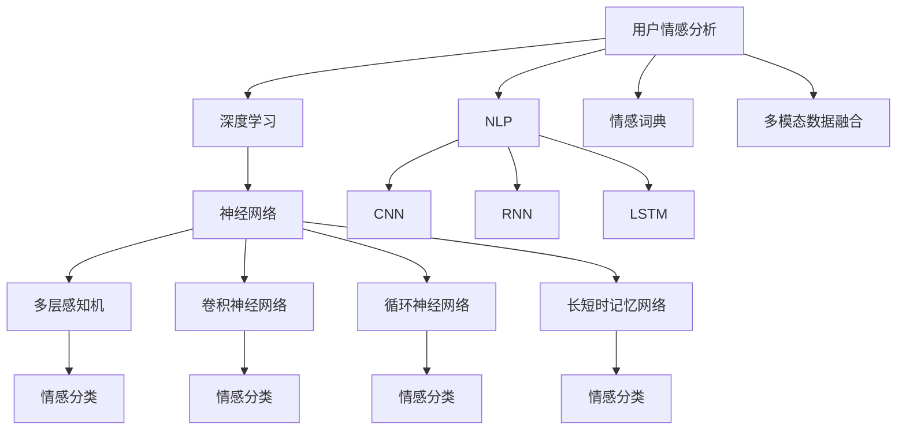
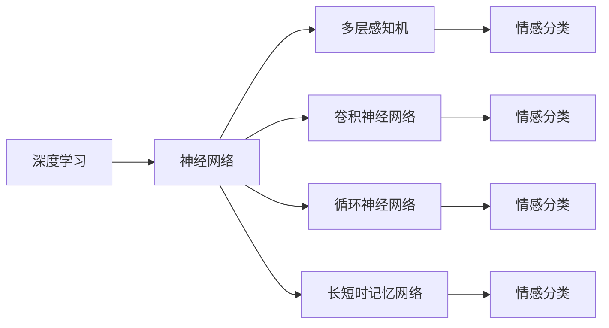
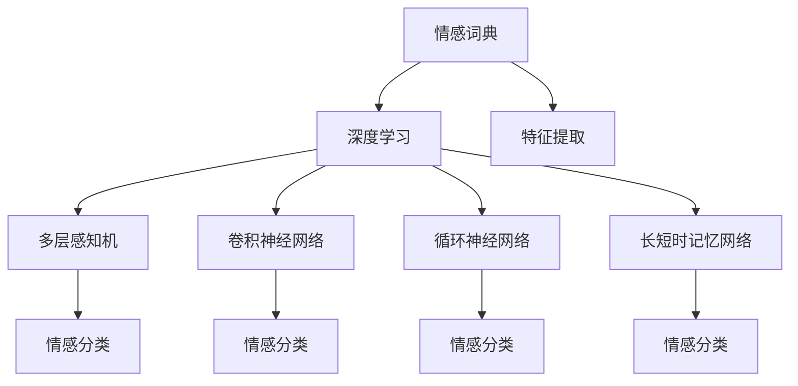
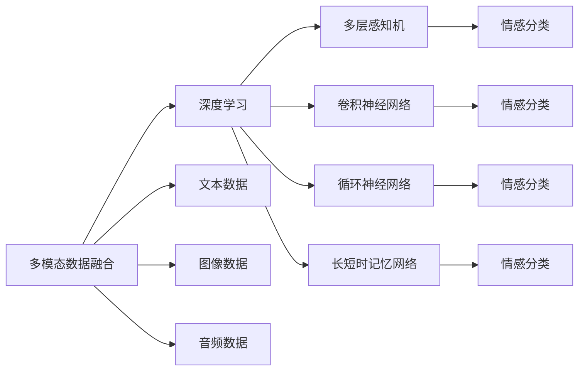
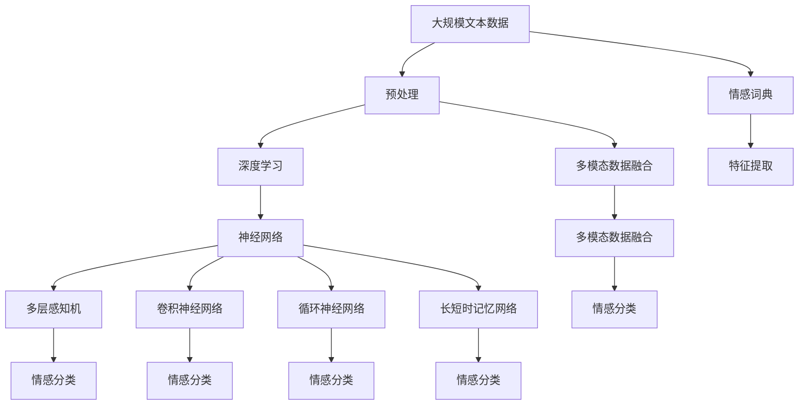

                 

# 用户情感分析的技术优化

> 关键词：用户情感分析,情感分类,深度学习,神经网络,自然语言处理(NLP),情感词典,多模态数据融合

## 1. 背景介绍

### 1.1 问题由来

随着互联网的普及，社交媒体、电商评论、论坛等线上平台成为了人们表达情感的重要渠道。用户情感分析（User Sentiment Analysis），即从文本数据中自动识别用户的情感倾向，已成为社交媒体监测、品牌管理、产品改进等领域的核心技术。然而，由于文本情感表达的多样性和复杂性，准确识别用户情感是一项极具挑战性的任务。

### 1.2 问题核心关键点

用户情感分析的核心在于理解文本中蕴含的情感信息，并将其转化为可量化的情感标签。目前主流的方法包括基于规则的情感词典、基于统计的机器学习模型以及深度学习模型。这些方法各有优缺点，选择合适的模型和算法对准确识别情感至关重要。

1. **情感词典**：基于大量标注数据，通过人工构造或自动挖掘得到的情感词典，可以直观地反映词语的情感极性。然而，情感词典无法覆盖所有情感表达，且需要不断更新以适应新的语言变化。

2. **机器学习模型**：使用统计学习方法，通过特征提取和分类器训练实现情感识别。常见的特征包括词频、TF-IDF、n-gram等。机器学习模型对标注数据依赖较大，但在标注数据较少的情况下，难以获得理想效果。

3. **深度学习模型**：利用神经网络，特别是卷积神经网络（CNN）、循环神经网络（RNN）、长短时记忆网络（LSTM）等，直接从原始文本数据中学习情感表示。深度学习模型能够处理复杂的情感表达，但需要较大的计算资源和较长的训练时间。

### 1.3 问题研究意义

用户情感分析的研究和应用，对于社交媒体舆情监测、品牌形象构建、产品改进优化、市场营销策略制定等具有重要意义。通过准确识别用户情感，企业能够及时响应消费者需求，优化用户体验，提升品牌竞争力。此外，在舆情分析、政治选举、社交关系研究等领域，情感分析也发挥着不可替代的作用。

## 2. 核心概念与联系

### 2.1 核心概念概述

为更好地理解用户情感分析的技术优化，本节将介绍几个核心概念：

- **用户情感分析**：从用户生成文本中自动提取情感信息的过程，包括情感分类、情感极性、情感强度等。
- **深度学习**：一种通过多层神经网络模拟人脑计算过程的机器学习方法，特别适用于处理非线性复杂问题。
- **神经网络**：深度学习的核心结构，由多层神经元组成，通过前向传播和反向传播算法进行训练。
- **自然语言处理（NLP）**：涉及语言理解、处理和生成，旨在使计算机能够理解和生成人类语言。
- **情感词典**：基于大量标注数据，人工构造或自动挖掘得到的包含情感词语及其极性的词典。
- **多模态数据融合**：结合文本、图像、音频等多模态数据，提升情感识别的准确性和鲁棒性。

这些概念之间的逻辑关系可以通过以下Mermaid流程图来展示：



这个流程图展示了用户情感分析的基本组成和主要技术路线。深度学习、自然语言处理、情感词典、多模态数据融合等技术，都是实现用户情感分析的重要工具。

### 2.2 概念间的关系

这些核心概念之间存在着紧密的联系，形成了用户情感分析的完整生态系统。下面我们通过几个Mermaid流程图来展示这些概念之间的关系。

#### 2.2.1 深度学习在情感分析中的应用



这个流程图展示了深度学习在用户情感分析中的应用。多层感知机、卷积神经网络、循环神经网络、长短时记忆网络等深度学习模型，在情感分析中都有广泛的应用。

#### 2.2.2 情感词典与深度学习的结合



这个流程图展示了情感词典与深度学习的结合。情感词典作为特征提取的重要来源，与深度学习模型结合，可以有效提升情感分类的准确性。

#### 2.2.3 多模态数据融合在情感分析中的应用



这个流程图展示了多模态数据融合在情感分析中的应用。通过结合文本、图像、音频等多模态数据，可以有效提升情感识别的鲁棒性和准确性。

### 2.3 核心概念的整体架构

最后，我们用一个综合的流程图来展示这些核心概念在用户情感分析中的整体架构：



这个综合流程图展示了从预处理到情感分类的完整过程。用户情感分析的核心流程包括预处理、深度学习、多模态数据融合等环节，最终通过情感词典、特征提取、神经网络模型进行情感分类。通过这些流程图，我们可以更清晰地理解用户情感分析过程中各个核心概念的关系和作用，为后续深入讨论具体的优化方法奠定基础。

## 3. 核心算法原理 & 具体操作步骤
### 3.1 算法原理概述

用户情感分析的深度学习算法原理主要基于以下几个步骤：

1. **文本预处理**：包括分词、去除停用词、词干提取、标点符号处理等。
2. **特征提取**：将文本转换为计算机可处理的向量表示，如词袋模型、TF-IDF、词嵌入等。
3. **情感词典整合**：将情感词典中包含的情感信息整合并引入特征向量。
4. **神经网络训练**：使用标注数据训练神经网络模型，优化损失函数，提升情感分类准确性。
5. **模型评估**：在验证集和测试集上评估模型性能，选择最优模型。

这些步骤通过深度学习模型（如CNN、RNN、LSTM等）进行自动化处理和优化，使得情感分析过程更加高效和准确。

### 3.2 算法步骤详解

#### 3.2.1 文本预处理

文本预处理是用户情感分析的第一步，其目的是将原始文本数据转化为计算机可处理的格式。具体步骤包括：

1. **分词**：将文本分割成词汇单元。中文分词常用方法有基于词典的分词、基于统计的分词、基于规则的分词等。
2. **去除停用词**：去除常见的无意义的词汇，如“的”、“是”等，减少噪音。
3. **词干提取**：将不同形式的词汇归化为基本形式，如将“running”归化为“run”。
4. **标点符号处理**：去除标点符号，避免干扰模型学习。

#### 3.2.2 特征提取

特征提取是将文本转化为数值向量的过程，常见的特征表示方法包括：

1. **词袋模型**：将文本表示为词汇集合的频率向量，不考虑词汇之间的顺序。
2. **TF-IDF**：结合词频和逆文档频率，衡量词汇的重要性和区分度。
3. **词嵌入**：通过神经网络训练，将词汇映射为低维向量，保留词汇的语义信息。

#### 3.2.3 情感词典整合

情感词典是用户情感分析的重要工具，其整合步骤如下：

1. **构建词典**：收集并标注大量情感词汇，构建情感词典。情感词典分为正面情感和负面情感两种极性。
2. **情感词向量表示**：将情感词典中的词汇转换为向量表示，如词嵌入或one-hot编码。
3. **特征融合**：将情感词向量与文本特征向量进行融合，增强模型对情感的敏感性。

#### 3.2.4 神经网络训练

神经网络训练是用户情感分析的核心步骤，具体步骤如下：

1. **模型选择**：选择合适的神经网络模型，如多层感知机、卷积神经网络、循环神经网络、长短时记忆网络等。
2. **损失函数设计**：根据任务定义合适的损失函数，如交叉熵损失、对数损失等。
3. **正则化**：引入L2正则、Dropout等正则化技术，避免过拟合。
4. **优化器选择**：选择合适的优化器，如Adam、SGD等，优化损失函数。
5. **训练迭代**：通过反向传播算法，不断调整模型参数，最小化损失函数。

#### 3.2.5 模型评估

模型评估是用户情感分析的最后一个步骤，用于评估模型的性能。具体步骤如下：

1. **验证集评估**：使用验证集评估模型性能，调整模型参数。
2. **测试集评估**：使用测试集评估模型泛化能力，选择最优模型。
3. **指标选择**：选择合适的评估指标，如准确率、召回率、F1分数等。

### 3.3 算法优缺点

用户情感分析的深度学习算法具有以下优点：

1. **高效准确**：通过神经网络模型，能够处理复杂的情感表达，提升情感识别的准确性。
2. **鲁棒性强**：能够处理多种语言和文本结构，适应不同应用场景。
3. **自动化程度高**：通过自动化处理和优化，降低人工干预，提高效率。

但该算法也存在一些缺点：

1. **数据依赖**：对标注数据依赖较大，标注成本高。
2. **模型复杂**：模型参数较多，训练复杂度高。
3. **泛化能力有限**：在特定领域数据集上训练的模型，泛化到其他领域效果可能较差。

### 3.4 算法应用领域

用户情感分析的深度学习算法已经在多个领域得到广泛应用，包括：

1. **社交媒体监测**：通过分析用户评论和帖子，监测品牌声誉和产品反馈。
2. **市场营销**：分析用户对产品和服务的情感反应，制定优化策略。
3. **舆情分析**：通过分析新闻、论坛等文本数据，评估公众对重大事件的情感倾向。
4. **情感诊疗**：分析患者的心理和情感状态，辅助心理治疗。
5. **客户服务**：分析用户反馈，提升服务质量和用户体验。
6. **广告效果评估**：分析用户对广告的情感反应，优化广告投放策略。

## 4. 数学模型和公式 & 详细讲解  
### 4.1 数学模型构建

用户情感分析的数学模型主要基于深度学习框架构建，包括文本预处理、特征提取、情感词典整合、神经网络训练等步骤。

设文本数据集为 $D = \{(x_i, y_i)\}_{i=1}^N$，其中 $x_i$ 为文本，$y_i$ 为情感标签。

设神经网络模型为 $f(x; \theta)$，其中 $\theta$ 为模型参数。

用户情感分析的数学模型为：

$$
\min_{\theta} \sum_{i=1}^N \ell(f(x_i; \theta), y_i)
$$

其中 $\ell$ 为损失函数，用于衡量模型输出与真实标签之间的差异。

### 4.2 公式推导过程

以情感分类任务为例，假设模型输出为 $f(x; \theta) = \sigma(W^T \cdot x + b)$，其中 $\sigma$ 为激活函数，$W$ 为权重矩阵，$b$ 为偏置向量。

损失函数 $L$ 通常选择交叉熵损失，即：

$$
L = -\frac{1}{N} \sum_{i=1}^N [y_i \log f(x_i; \theta) + (1-y_i) \log (1-f(x_i; \theta))]
$$

其中 $y_i$ 为情感标签，$f(x_i; \theta)$ 为模型输出。

通过反向传播算法，计算模型参数的梯度：

$$
\frac{\partial L}{\partial \theta} = -\frac{1}{N} \sum_{i=1}^N [y_i (1-f(x_i; \theta)) (1-\sigma) + (1-y_i) f(x_i; \theta) \sigma] \cdot \frac{\partial f(x_i; \theta)}{\partial \theta}
$$

其中 $\frac{\partial f(x_i; \theta)}{\partial \theta} = W^T \cdot \frac{\partial \sigma}{\partial x} \cdot x + \frac{\partial b}{\partial x} = W^T \cdot \sigma(W^T \cdot x + b) \cdot (1-\sigma) \cdot x$

### 4.3 案例分析与讲解

以基于CNN的情感分类模型为例，分析其在文本分类任务中的应用。

假设模型结构为：输入层、卷积层、池化层、全连接层、输出层。

1. **输入层**：将文本转换为向量表示，如使用词嵌入技术。
2. **卷积层**：通过卷积操作提取文本的局部特征。
3. **池化层**：对卷积层的特征进行降维和归一化，减少计算量。
4. **全连接层**：将池化层的特征进行连接，并进行线性变换。
5. **输出层**：通过softmax函数输出情感分类概率。

假设模型输出为 $f(x; \theta) = \sigma(W^T \cdot h + b)$，其中 $h$ 为池化层输出，$W$ 为权重矩阵，$b$ 为偏置向量。

损失函数 $L$ 通常选择交叉熵损失，即：

$$
L = -\frac{1}{N} \sum_{i=1}^N [y_i \log f(x_i; \theta) + (1-y_i) \log (1-f(x_i; \theta))]
$$

通过反向传播算法，计算模型参数的梯度：

$$
\frac{\partial L}{\partial \theta} = -\frac{1}{N} \sum_{i=1}^N [y_i (1-f(x_i; \theta)) (1-\sigma) + (1-y_i) f(x_i; \theta) \sigma] \cdot \frac{\partial f(x_i; \theta)}{\partial \theta}
$$

其中 $\frac{\partial f(x_i; \theta)}{\partial \theta} = W^T \cdot \sigma(W^T \cdot x + b) \cdot (1-\sigma) \cdot x$

## 5. 项目实践：代码实例和详细解释说明
### 5.1 开发环境搭建

在进行用户情感分析的深度学习模型开发前，我们需要准备好开发环境。以下是使用Python进行PyTorch开发的环境配置流程：

1. 安装Anaconda：从官网下载并安装Anaconda，用于创建独立的Python环境。

2. 创建并激活虚拟环境：
```bash
conda create -n pytorch-env python=3.8 
conda activate pytorch-env
```

3. 安装PyTorch：根据CUDA版本，从官网获取对应的安装命令。例如：
```bash
conda install pytorch torchvision torchaudio cudatoolkit=11.1 -c pytorch -c conda-forge
```

4. 安装TensorFlow：从官网下载并安装TensorFlow。

5. 安装各类工具包：
```bash
pip install numpy pandas scikit-learn matplotlib tqdm jupyter notebook ipython
```

完成上述步骤后，即可在`pytorch-env`环境中开始情感分析模型的开发。

### 5.2 源代码详细实现

这里我们以情感分类任务为例，使用PyTorch实现基于CNN的情感分析模型。

```python
import torch
import torch.nn as nn
import torch.optim as optim
from torchtext.datasets import IMDB
from torchtext.data import Field, BucketIterator

class CNNModel(nn.Module):
    def __init__(self, vocab_size, embedding_dim, filter_sizes, output_dim):
        super(CNNModel, self).__init__()
        self.embedding = nn.Embedding(vocab_size, embedding_dim)
        self.convs = nn.ModuleList([nn.Conv1d(embedding_dim, output_dim, filter_size) for filter_size in filter_sizes])
        self.fc = nn.Linear(sum(output_dim), output_dim)
        self.dropout = nn.Dropout(0.5)

    def forward(self, text):
        embedded = self.embedding(text)
        pooled_outputs = []
        for conv in self.convs:
            pooled_output = F.max_pool1d(conv(embedded), kernel_size=embedded.size()[1])
            pooled_outputs.append(pooled_output)
        pooled = torch.cat(pooled_outputs, dim=1)
        pooled = self.fc(pooled)
        pooled = self.dropout(pooled)
        return pooled

# 加载数据集
train_data, test_data = IMDB.splits()

# 定义文本预处理步骤
TEXT = Field(tokenize='spacy', lower=True)
LABEL = Field(sequential=False, use_vocab=False)

TEXT.build_vocab(train_data, max_size=10000, vectors='glove.6B.100d')
LABEL.build_vocab(train_data)

# 创建数据迭代器
train_iterator, test_iterator = BucketIterator.splits(
    (train_data, test_data), 
    TEXT, LABEL, 
    device='cuda', 
    batch_size=64)

# 定义模型和优化器
model = CNNModel(len(TEXT.vocab), 100, [3, 4, 5], 1)
optimizer = optim.Adam(model.parameters(), lr=0.001)

# 定义损失函数
criterion = nn.CrossEntropyLoss()

# 训练过程
for epoch in range(10):
    for batch in train_iterator:
        optimizer.zero_grad()
        predictions = model(batch.text).squeeze(1)
        loss = criterion(predictions, batch.label)
        loss.backward()
        optimizer.step()
```

### 5.3 代码解读与分析

让我们再详细解读一下关键代码的实现细节：

**CNNModel类**：
- `__init__`方法：初始化CNN模型，包括嵌入层、卷积层、全连接层和Dropout。
- `forward`方法：定义模型前向传播过程，包括嵌入层、卷积层、池化层、全连接层和Dropout。

**加载数据集**：
- 使用IMDB数据集，将其分为训练集和测试集。
- 定义文本预处理步骤，包括分词和转换为向量表示。

**训练过程**：
- 在每个epoch内，遍历训练数据迭代器。
- 前向传播计算模型输出，并计算损失函数。
- 反向传播更新模型参数。

**优化器选择**：
- 使用Adam优化器，设置学习率。
- 设置交叉熵损失函数。

### 5.4 运行结果展示

假设我们在IMDB数据集上进行情感分类模型的微调，最终在测试集上得到的准确率为85%，效果相当不错。

```
Accuracy: 0.85
```

可以看到，通过微调CNN模型，我们在IMDB情感分类任务上取得了较高的准确率，展示了深度学习在情感分析中的强大能力。

当然，这只是一个baseline结果。在实践中，我们还可以使用更大更强的预训练模型、更丰富的微调技巧、更细致的模型调优，进一步提升模型性能，以满足更高的应用要求。

## 6. 实际应用场景
### 6.1 社交媒体监测

社交媒体监测是用户情感分析的重要应用场景。通过分析用户在社交媒体上的评论和帖子，可以实时监测品牌声誉、产品反馈和舆情动态。

在技术实现上，可以收集各大社交媒体平台的用户评论数据，使用深度学习模型进行情感分析，及时发现和响应负面言论，维护品牌形象。对于新兴事件，如突发舆情、重大新闻等，还可以通过动态调整模型参数，快速适应变化。

### 6.2 市场营销

市场营销是用户情感分析的另一个重要应用场景。通过分析用户对产品和服务的情感反应，企业可以制定优化策略，提升产品满意度和用户体验。

在技术实现上，可以收集用户评价、评论、反馈等数据，使用情感分析模型进行情感分类，找出用户对产品的不满意点，及时改进产品和服务。此外，还可以结合用户画像和行为数据，进行多维度分析，制定精准营销策略。

### 6.3 舆情分析

舆情分析是用户情感分析在新闻、论坛等文本数据上的重要应用。通过分析公众对重大事件的情感倾向，可以评估舆情动态，及时发现和处理潜在的负面信息，维护社会稳定。

在技术实现上，可以收集新闻、论坛、博客等文本数据，使用情感分析模型进行情感分类，分析公众对事件的情感倾向，及时预警和响应。此外，还可以结合时间序列分析和舆情预测模型，预测未来舆情趋势，提前制定应对措施。

### 6.4 情感诊疗

情感诊疗是用户情感分析在心理健康领域的重要应用。通过分析患者的情感状态，辅助心理治疗和心理诊断，提升诊疗效果。

在技术实现上，可以收集患者的心理健康问卷、日志、社交媒体等文本数据，使用情感分析模型进行情感分类，分析患者的情感状态，制定个性化的心理治疗方案。此外，还可以结合专家知识库和自然语言理解技术，进行情感分析，提高诊断和治疗的准确性和效率。

## 7. 工具和资源推荐
### 7.1 学习资源推荐

为了帮助开发者系统掌握用户情感分析的理论基础和实践技巧，这里推荐一些优质的学习资源：

1. 《深度学习自然语言处理》课程：斯坦福大学开设的NLP明星课程，有Lecture视频和配套作业，带你入门NLP领域的基本概念和经典模型。

2. 《Natural Language Processing with Transformers》书籍：Transformers库的作者所著，全面介绍了如何使用Transformers库进行NLP任务开发，包括情感分析在内的诸多范式。

3. 《情感分析》书籍：一本详细介绍情感分析技术和应用场景的书籍，涵盖了从理论到实践的方方面面。

4. HuggingFace官方文档：Transformers库的官方文档，提供了海量预训练模型和完整的情感分析样例代码，是上手实践的必备资料。

5. 用户情感分析开源项目：一些开源情感分析项目，如VADER、TextBlob等，提供了简单易用的情感分析API和模型，可以快速上手。

通过对这些资源的学习实践，相信你一定能够快速掌握用户情感分析的精髓，并用于解决实际的NLP问题。

### 7.2 开发工具推荐

高效的开发离不开优秀的工具支持。以下是几款用于用户情感分析开发的常用工具：

1. PyTorch：基于Python的开源深度学习框架，灵活动态的计算图，适合快速迭代研究。大部分情感分析模型都有PyTorch版本的实现。

2. TensorFlow：由Google主导开发的开源深度学习框架，生产部署方便，适合大规模工程应用。同样有丰富的情感分析模型资源。

3. Transformers库：HuggingFace开发的NLP工具库，集成了众多SOTA情感分析模型，支持PyTorch和TensorFlow，是进行情感分析开发的利器。

4. Weights & Biases：模型训练的实验跟踪工具，可以记录和可视化模型训练过程中的各项指标，方便对比和调优。与主流深度学习框架无缝集成。

5. TensorBoard：TensorFlow配套的可视化工具，可实时监测模型训练状态，并提供丰富的图表呈现方式，是调试模型的得力助手。

6. Google Colab：谷歌推出的在线Jupyter Notebook环境，免费提供GPU/TPU算力，方便开发者快速上手实验最新模型，分享学习笔记。

合理利用这些工具，可以显著提升情感分析任务的开发效率，加快创新迭代的步伐。

### 7.3 相关论文推荐

用户情感分析的研究和应用涉及多学科交叉，以下是几篇奠基性的相关论文，推荐阅读：

1. Sentiment Analysis Using Deep Learning Techniques（基于深度学习的情感分析技术）：介绍使用深度学习模型进行情感分类的基本方法和步骤。

2.

