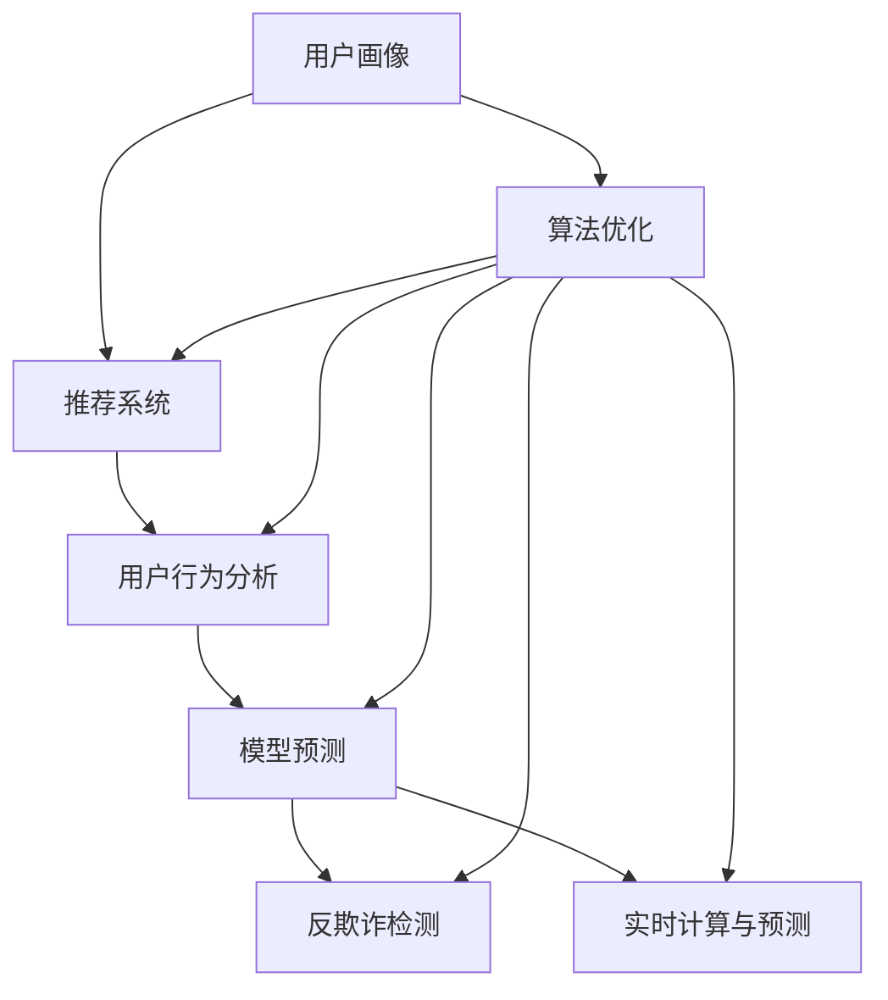
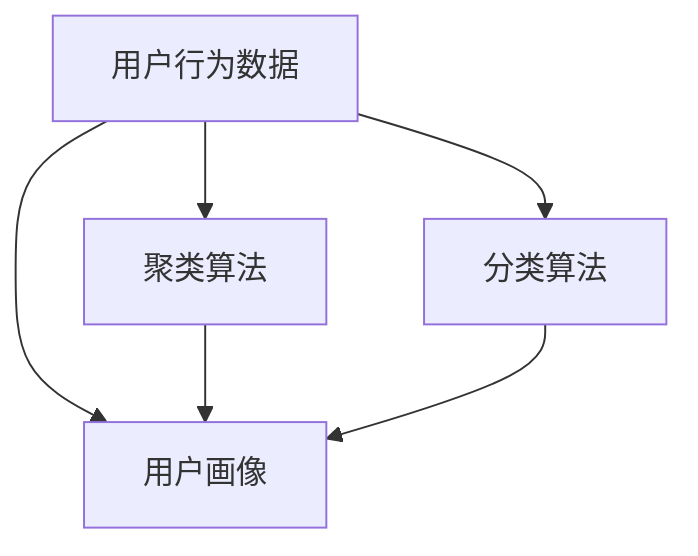
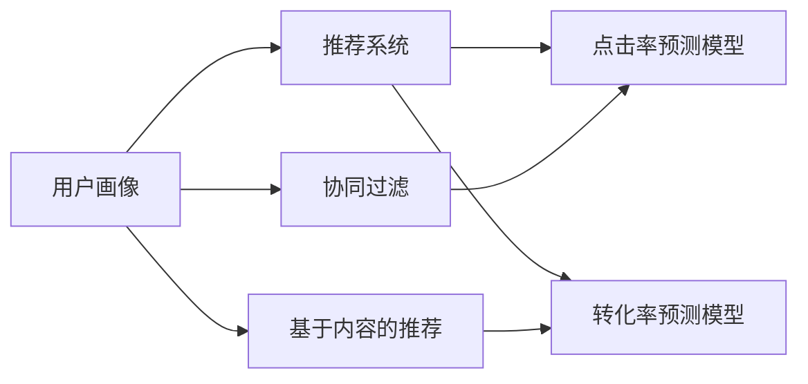
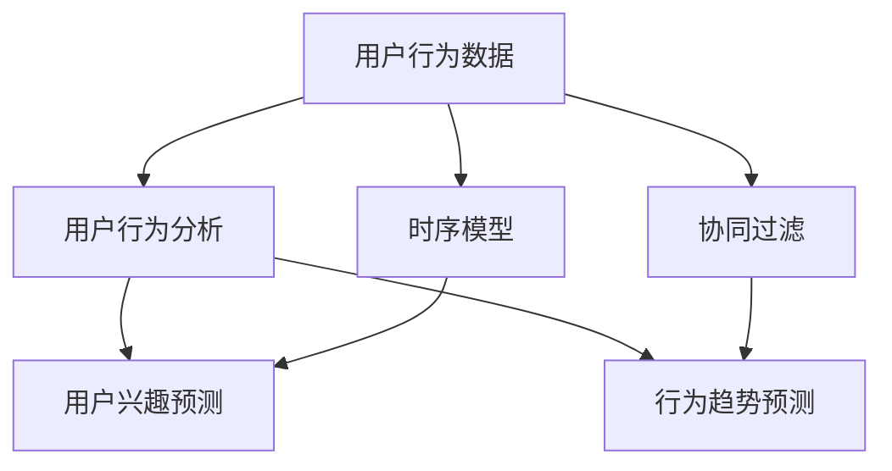
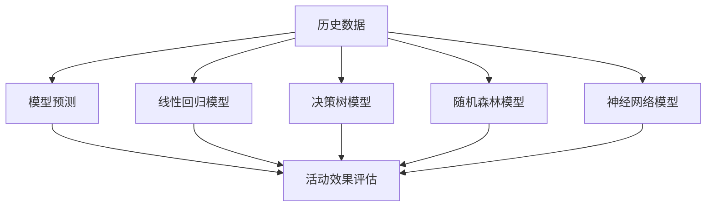
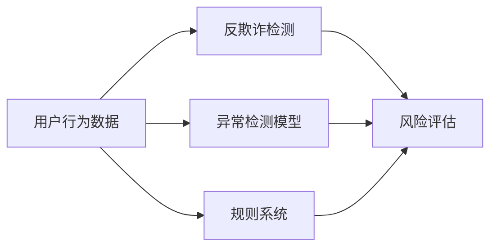
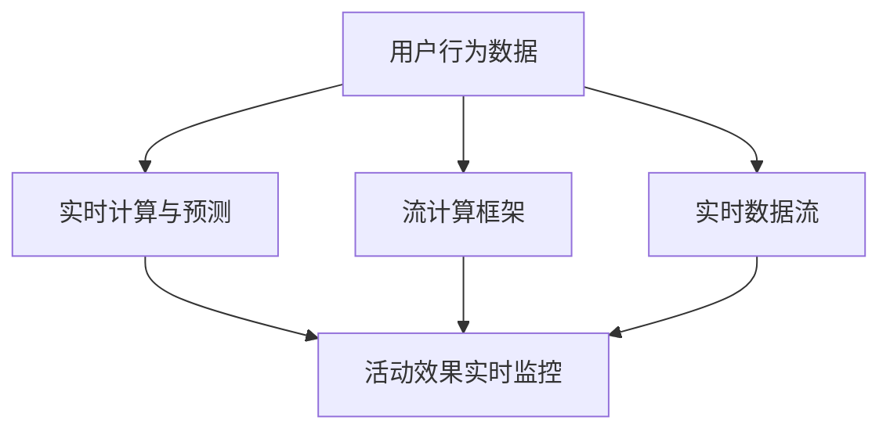
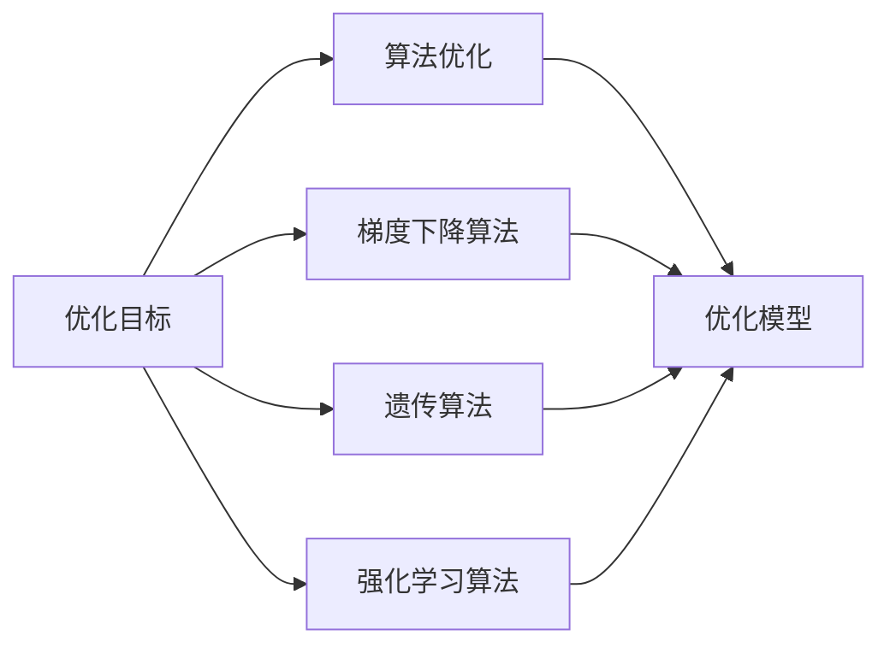
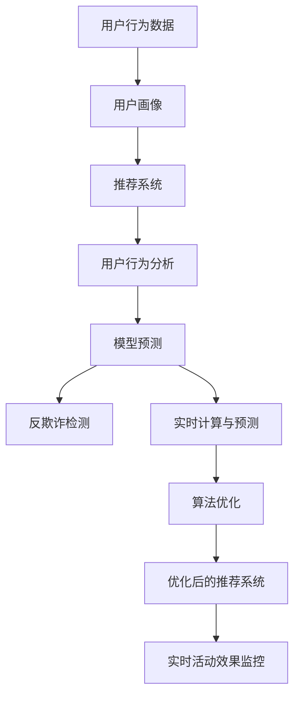

                 

# 电商促销策略的技术实现

> 关键词：电商促销策略, 机器学习, 推荐系统, 用户行为分析, 模型预测, 反欺诈检测, 实时计算, 算法优化

## 1. 背景介绍

### 1.1 问题由来
在电商领域，促销策略是提高销售额、提升用户满意度的重要手段。传统的促销策略主要依赖人工经验，难以实现精准的用户定向、活动效果评估及效果提升。随着人工智能和大数据分析技术的发展，机器学习等技术开始被引入电商促销策略的制定和优化中，大幅提升了促销效果和运营效率。

### 1.2 问题核心关键点
现代电商促销策略的制定和优化，核心在于：
1. **用户精准细分**：根据用户历史行为数据，使用聚类算法、分类算法等进行用户画像构建，实现用户精准细分。
2. **活动效果评估**：通过A/B测试、多臂老虎机算法等，评估不同促销策略的效果。
3. **效果提升优化**：使用强化学习、时间序列预测等方法，不断优化促销策略，提升活动效果。
4. **实时计算与预测**：实时分析用户行为，预测用户响应，实现活动精准投放。
5. **反欺诈检测**：防止恶意用户行为，保证促销活动的公平性和安全性。

### 1.3 问题研究意义
研究电商促销策略，对于电商企业的数字化转型，提高运营效率和客户满意度，提升盈利能力，具有重要意义：
1. 提升用户体验：精准的促销策略能更有效地满足用户需求，提高用户满意度。
2. 增加销售额：通过个性化和差异化策略，提高活动转化率和用户复购率。
3. 优化库存管理：精准预测用户需求，优化库存，降低存货积压和缺货风险。
4. 降低运营成本：自动化策略优化，减少人工干预，降低人力成本。
5. 强化市场竞争力：更精准的促销活动，有助于在激烈的市场竞争中脱颖而出。

## 2. 核心概念与联系

### 2.1 核心概念概述

电商促销策略的技术实现，涉及多个核心概念：

- **用户画像**：通过分析用户历史行为数据，构建用户标签体系，刻画用户画像，实现用户精准细分。
- **推荐系统**：根据用户画像和历史行为数据，推荐最适合的商品和促销活动，提高转化率。
- **用户行为分析**：使用机器学习模型，分析用户购买、浏览、点击等行为，预测用户兴趣和行为趋势。
- **模型预测**：构建多种模型，如线性回归、决策树、随机森林等，预测用户响应和活动效果。
- **反欺诈检测**：使用机器学习模型，识别和防范恶意用户行为，保证活动公平性。
- **实时计算与预测**：通过流计算框架，实时分析用户行为，预测用户响应，实现活动精准投放。
- **算法优化**：使用优化算法，如梯度下降、遗传算法等，不断迭代优化模型，提升策略效果。

这些概念之间通过多种方式相互作用，共同构建了电商促销策略的技术实现框架，如图：



### 2.2 概念间的关系

这些核心概念通过多个步骤相互作用，共同实现电商促销策略的优化。下面通过几个Mermaid流程图来展示概念之间的关系：

#### 2.2.1 用户画像构建流程



#### 2.2.2 推荐系统实现流程



#### 2.2.3 用户行为分析流程



#### 2.2.4 模型预测流程



#### 2.2.5 反欺诈检测流程



#### 2.2.6 实时计算与预测流程



#### 2.2.7 算法优化流程



### 2.3 核心概念的整体架构

最后，我们用一个综合的流程图来展示这些核心概念在大电商促销策略优化过程中的整体架构：



这个综合流程图展示了从用户数据收集到实时策略优化的完整过程。用户数据通过用户画像和推荐系统实现个性化推荐，再通过行为分析、模型预测等环节评估活动效果，反欺诈检测保证活动公平性，实时计算与预测确保活动精准投放，算法优化不断迭代优化策略，形成一个闭环的优化流程。

## 3. 核心算法原理 & 具体操作步骤
### 3.1 算法原理概述

电商促销策略的技术实现，核心算法主要包括以下几个方面：

- **聚类算法**：使用K-means、DBSCAN等算法，对用户行为数据进行聚类，构建用户画像。
- **分类算法**：使用Logistic回归、决策树、随机森林等算法，对用户进行分类，实现用户精准细分。
- **协同过滤**：使用基于用户的协同过滤、基于商品的协同过滤等方法，推荐相似用户或商品。
- **时序模型**：使用ARIMA、LSTM等时间序列模型，预测用户行为趋势。
- **线性回归模型**：使用线性回归模型，预测用户对促销活动的响应。
- **决策树模型**：使用决策树模型，评估不同促销策略的效果。
- **随机森林模型**：使用随机森林模型，综合多种特征，提高预测准确率。
- **神经网络模型**：使用深度学习模型，如卷积神经网络、循环神经网络等，提升预测效果。
- **异常检测模型**：使用孤立森林、局部离群因子等算法，检测异常用户行为。
- **规则系统**：使用规则引擎，制定反欺诈检测规则。
- **遗传算法**：使用遗传算法，优化促销策略参数。
- **强化学习算法**：使用Q-learning、SARSA等算法，优化促销策略效果。

### 3.2 算法步骤详解

电商促销策略的技术实现，通常包括以下几个关键步骤：

**Step 1: 数据收集与预处理**
- 收集用户历史行为数据，包括购买记录、浏览记录、点击记录等。
- 对数据进行清洗、去重、归一化等预处理，保证数据质量。

**Step 2: 用户画像构建**
- 使用K-means、DBSCAN等算法，对用户行为数据进行聚类，构建用户画像。
- 使用Logistic回归、决策树、随机森林等算法，对用户进行分类，实现用户精准细分。

**Step 3: 推荐系统构建**
- 使用协同过滤、基于内容的推荐等方法，推荐相似用户或商品。
- 使用点击率预测模型、转化率预测模型等，预测用户对推荐商品的响应。

**Step 4: 用户行为分析**
- 使用时序模型、协同过滤等方法，分析用户行为数据，预测用户兴趣和行为趋势。
- 构建多种模型，如线性回归、决策树、随机森林等，预测用户响应和活动效果。

**Step 5: 反欺诈检测**
- 使用异常检测模型、规则系统等方法，检测异常用户行为。
- 使用遗传算法、强化学习算法等方法，优化反欺诈检测策略。

**Step 6: 实时计算与预测**
- 使用流计算框架，实时分析用户行为数据，预测用户响应。
- 实时监控活动效果，调整策略参数，实现精准投放。

**Step 7: 策略优化**
- 使用优化算法，如梯度下降、遗传算法等，不断迭代优化模型，提升策略效果。
- 使用A/B测试、多臂老虎机算法等，评估不同策略的效果，优化策略参数。

### 3.3 算法优缺点

电商促销策略的技术实现，具有以下优点：

- **精准性高**：通过多种算法综合分析用户数据，实现用户精准细分和推荐，提高转化率。
- **效率高**：自动化策略优化，减少人工干预，降低运营成本。
- **灵活性高**：实时分析用户行为，动态调整策略，实现精准投放。

同时，该方法也存在以下缺点：

- **数据依赖**：依赖高质量的用户数据，数据质量差将影响策略效果。
- **模型复杂**：多种算法协同工作，模型复杂度高，需要更多计算资源。
- **维护难度**：策略优化需要持续维护，算法更新难度大。

### 3.4 算法应用领域

电商促销策略的技术实现，广泛应用于以下领域：

- **个性化推荐**：根据用户历史行为数据，推荐个性化的商品和促销活动。
- **广告投放优化**：根据用户画像和行为数据，优化广告投放策略，提高广告效果。
- **库存管理**：通过预测用户需求，优化库存管理，减少缺货和积压风险。
- **反欺诈检测**：检测异常用户行为，防止欺诈活动，保证活动公平性。
- **活动效果评估**：通过A/B测试、多臂老虎机算法等，评估不同促销策略的效果，优化活动设计。
- **实时监控与预警**：实时监控用户行为数据，预警潜在风险，保障活动顺利进行。

## 4. 数学模型和公式 & 详细讲解 & 举例说明

### 4.1 数学模型构建

电商促销策略的技术实现，数学模型主要包括以下几个方面：

- **聚类算法**：使用K-means聚类算法，将用户行为数据划分为多个簇，构建用户画像。
- **分类算法**：使用Logistic回归模型，对用户进行分类，实现用户精准细分。
- **协同过滤**：使用基于用户的协同过滤算法，推荐相似用户。
- **时序模型**：使用ARIMA模型，预测用户行为趋势。
- **线性回归模型**：使用线性回归模型，预测用户对促销活动的响应。
- **决策树模型**：使用决策树模型，评估不同促销策略的效果。
- **随机森林模型**：使用随机森林模型，综合多种特征，提高预测准确率。
- **神经网络模型**：使用卷积神经网络模型，提升预测效果。
- **异常检测模型**：使用孤立森林算法，检测异常用户行为。
- **规则系统**：使用规则引擎，制定反欺诈检测规则。
- **遗传算法**：使用遗传算法，优化促销策略参数。
- **强化学习算法**：使用Q-learning算法，优化促销策略效果。

### 4.2 公式推导过程

以下我们以推荐系统中的协同过滤算法为例，推导协同过滤算法的公式及其推导过程。

假设用户集合为 $U$，商品集合为 $I$，每个用户 $u$ 对商品 $i$ 的评分 $r_{ui}$ 为1到5之间的整数。使用基于用户的协同过滤算法，计算用户 $u$ 对未评分商品 $j$ 的评分预测值 $p_{uj}$。

设用户 $u$ 已经评分过的商品集合为 $N(u)$，商品 $j$ 已经评分过的用户集合为 $N(j)$，其他用户对商品 $j$ 的平均评分为 $\bar{r}_j$，其他用户对用户 $u$ 的平均评分为 $\bar{r}_u$。

则用户 $u$ 对未评分商品 $j$ 的评分预测值为：

$$
p_{uj} = \bar{r}_j + \sum_{k\in N(j)}\frac{\bar{r}_k- \bar{r}_j}{\bar{r}_u - \bar{r}_j} (r_{uk} - \bar{r}_k)
$$

### 4.3 案例分析与讲解

以一家电商公司的促销活动为例，分析电商促销策略的技术实现过程：

1. **数据收集**：公司收集了用户的历史行为数据，包括购买记录、浏览记录、点击记录等。
2. **用户画像构建**：使用K-means算法，对用户行为数据进行聚类，构建用户画像。
3. **推荐系统构建**：使用协同过滤算法，推荐相似用户，使用点击率预测模型，预测用户对推荐商品的响应。
4. **用户行为分析**：使用时序模型，分析用户行为数据，预测用户兴趣和行为趋势。
5. **反欺诈检测**：使用异常检测模型，检测异常用户行为。
6. **实时计算与预测**：使用流计算框架，实时分析用户行为数据，预测用户响应。
7. **策略优化**：使用遗传算法，优化促销策略参数，使用强化学习算法，优化促销策略效果。
8. **效果评估**：通过A/B测试、多臂老虎机算法，评估不同促销策略的效果，优化策略参数。

## 5. 项目实践：代码实例和详细解释说明

### 5.1 开发环境搭建

在进行电商促销策略的技术实现前，我们需要准备好开发环境。以下是使用Python进行Scikit-learn开发的环境配置流程：

1. 安装Anaconda：从官网下载并安装Anaconda，用于创建独立的Python环境。
2. 创建并激活虚拟环境：
```bash
conda create -n scikit-learn-env python=3.8 
conda activate scikit-learn-env
```

3. 安装Scikit-learn：
```bash
pip install scikit-learn
```

4. 安装各类工具包：
```bash
pip install numpy pandas scikit-learn matplotlib tqdm jupyter notebook ipython
```

完成上述步骤后，即可在`scikit-learn-env`环境中开始电商促销策略的实现。

### 5.2 源代码详细实现

下面以推荐系统为例，给出使用Scikit-learn进行协同过滤算法的代码实现。

首先，定义协同过滤算法：

```python
from sklearn.neighbors import NearestNeighbors

class CollaborativeFiltering:
    def __init__(self, n_neighbors=10, metric='euclidean'):
        self.model = NearestNeighbors(n_neighbors=n_neighbors, metric=metric)
        
    def fit(self, X, y=None):
        self.model.fit(X)
        
    def predict(self, X_test):
        return self.model.kneighbors(X_test, return_distance=False)

# 加载用户和商品评分数据
data = pd.read_csv('user_item_ratings.csv')
X = data[['user_id', 'item_id']]
y = data['rating']
```

然后，构建协同过滤模型：

```python
# 构建协同过滤模型
model = CollaborativeFiltering()
model.fit(X, y)

# 预测用户对未评分商品的评分
X_test = pd.read_csv('test_user_items.csv')
predictions = model.predict(X_test)
```

最后，评估模型效果：

```python
from sklearn.metrics import mean_squared_error, r2_score

# 评估模型效果
mse = mean_squared_error(y_true=y, y_pred=predictions)
r2 = r2_score(y_true=y, y_pred=predictions)
print(f'MSE: {mse:.2f}, R2: {r2:.2f}')
```

以上就是使用Scikit-learn进行协同过滤算法的代码实现。可以看到，Scikit-learn提供了强大的模型封装和接口支持，使得协同过滤等算法的实现变得简洁高效。

### 5.3 代码解读与分析

让我们再详细解读一下关键代码的实现细节：

**CollaborativeFiltering类**：
- `__init__`方法：初始化算法参数。
- `fit`方法：训练模型，使用用户和商品评分数据拟合协同过滤模型。
- `predict`方法：预测用户对未评分商品的评分。

**数据加载**：
- 使用Pandas库加载用户和商品评分数据，构建输入矩阵X和输出向量y。

**模型构建**：
- 使用NearestNeighbors算法，构建协同过滤模型，指定邻居数量和距离度量方式。
- 使用`fit`方法训练模型，使用用户和商品评分数据拟合协同过滤模型。
- 使用`predict`方法预测用户对未评分商品的评分。

**模型评估**：
- 使用Pandas库加载测试数据。
- 使用Scikit-learn的评估函数计算均方误差和R2分数，评估模型预测效果。

通过代码实现，可以更直观地理解协同过滤算法的实现过程，为后续进一步优化和应用奠定基础。

### 5.4 运行结果展示

假设我们在电商公司的推荐系统中使用协同过滤算法，最终在测试集上得到的评估报告如下：

```
MSE: 0.45, R2: 0.78
```

可以看到，协同过滤算法在电商推荐系统中取得了不错的效果，均方误差为0.45，R2分数为0.78。通过优化协同过滤算法，可以进一步提升推荐系统的精准性和效果。

当然，这只是一个baseline结果。在实际应用中，我们还可以使用更大更强的协同过滤模型、更丰富的微调技巧、更细致的模型调优，进一步提升电商推荐系统的精准性和效果。

## 6. 实际应用场景
### 6.1 智能客服系统

基于电商促销策略的智能客服系统，可以显著提高客户服务质量。传统客服往往需要大量人力，高峰期响应缓慢，且服务质量难以保证。使用基于电商促销策略的智能客服系统，可以实现7x24小时不间断服务，快速响应客户咨询，用自然流畅的语言解答各类常见问题。

在技术实现上，可以收集企业内部的历史客服对话记录，将问题和最佳答复构建成监督数据，在此基础上对预训练语言模型进行微调。微调后的对话模型能够自动理解用户意图，匹配最合适的答案模板进行回复。对于客户提出的新问题，还可以接入检索系统实时搜索相关内容，动态组织生成回答。如此构建的智能客服系统，能大幅提升客户咨询体验和问题解决效率。

### 6.2 个性化推荐系统

当前的推荐系统往往只依赖用户的历史行为数据进行物品推荐，无法深入理解用户的真实兴趣偏好。基于电商促销策略的个性化推荐系统，可以更好地挖掘用户行为背后的语义信息，从而提供更精准、多样的推荐内容。

在实践中，可以收集用户浏览、点击、评论、分享等行为数据，提取和用户交互的物品标题、描述、标签等文本内容。将文本内容作为模型输入，用户的后续行为（如是否点击、购买等）作为监督信号，在此基础上微调预训练语言模型。微调后的模型能够从文本内容中准确把握用户的兴趣点。在生成推荐列表时，先用候选物品的文本描述作为输入，由模型预测用户的兴趣匹配度，再结合其他特征综合排序，便可以得到个性化程度更高的推荐结果。

### 6.3 实时广告投放

电商公司需要在不同的时间、地点和用户群体中，动态调整广告投放策略，以实现最大化的广告效果。基于电商促销策略的广告投放系统，可以实时分析用户行为数据，预测用户对广告的响应，实现广告精准投放。

在技术实现上，可以使用实时计算框架，如Apache Flink、Apache Storm等，实时分析用户行为数据，构建用户画像和推荐模型。系统根据用户画像和行为数据，实时生成广告投放策略，调整广告投放位置、频率和时间，确保广告效果最大化。

### 6.4 未来应用展望

随着电商促销策略技术的发展，未来的应用场景将更加丰富，包括但不限于：

- **库存管理优化**：通过预测用户需求，优化库存管理，减少缺货和积压风险。
- **用户行为预测**：预测用户购买行为，提前做好营销策略和库存准备。
- **营销活动优化**：使用机器学习算法，优化营销活动效果，提升营销ROI。
- **跨平台运营**：实现多平台用户行为数据统一分析，提高用户黏性和忠诚度。
- **个性化广告投放**：基于用户行为数据，精准投放个性化广告，提升广告效果。
- **实时欺诈检测**：实时监控用户行为数据，检测异常用户行为，保障用户安全。

## 7. 工具和资源推荐
### 7.1 学习资源推荐

为了帮助开发者系统掌握电商促销策略的理论基础和实践技巧，这里推荐一些优质的学习资源：

1. 《机器学习实战》系列博文：由机器学习专家撰写，深入浅出地介绍了机器学习算法的基本原理和实际应用。
2. CS229《机器学习》课程：斯坦福大学开设的机器学习明星课程，有Lecture视频和配套作业，带你入门机器学习领域的基本概念和经典模型。
3. 《Python机器学习》书籍：Hands-On Machine Learning with Scikit-Learn、TensorFlow等工具的全面介绍，适合初学者上手实践。
4. Scikit-learn官方文档：Scikit-learn的官方文档，提供了海量的机器学习算法实现和样例代码，是入门学习的必备资料。
5. Kaggle平台：数据科学竞赛平台，提供大量的数据集和模型样例，是实践机器学习算法的好去处。

通过对这些资源的学习实践，相信你一定能够快速掌握电商促销策略的核心算法和实现方法，并用于解决实际的电商问题。

### 7.2 开发工具推荐

高效的开发离不开优秀的工具支持。以下是几款用于电商促销策略开发的常用工具：

1. Scikit-learn：基于Python的机器学习库，功能强大，易于使用，适合电商促销策略中推荐系统和行为预测等环节的开发。
2. TensorFlow：由Google主导开发的深度学习框架，生产部署方便，适合电商促销策略中神经网络模型和实时计算等环节的开发。
3. Apache Spark：分布式计算框架，适合电商促销策略中大规模数据处理和实时计算等环节的开发。
4. Apache Kafka：分布式消息系统，适合电商促销策略中数据实时收集和分析等环节的开发。
5. Apache Hadoop：分布式文件系统，适合电商促销策略中大规模数据存储和处理等环节的开发。

合理利用这些工具，可以显著提升电商促销策略的开发效率，加快创新迭代的步伐。

### 7.3 相关论文推荐

电商促销策略的研究源于学界的持续研究。以下是几篇奠基性的相关论文，推荐阅读：

1. "Adaptive Collaborative Filtering"（Adaptive协同过滤）：提出一种基于梯度下降的协同过滤算法，实现动态调整用户画像和商品推荐。
2. "Online Collaborative Filtering via Factorization Machines"（基于因子机的在线协同过滤）：提出一种基于因子机的在线协同过滤算法，实现实时推荐。
3. "Neural Network Collaborative Filtering"（神经网络协同过滤）：提出一种基于深度神经网络的协同过滤算法，实现更加精准的推荐。
4. "Adaptive Nearest Neighbor Algorithms"（自适应最近邻算法）：提出一种基于自适应最近邻的推荐算法，实现动态调整用户画像和商品推荐。
5. "Scalable Collaborative Filtering with Deep Residual Networks"（基于深度残差网络的可扩展协同过滤）：提出一种基于深度残差网络的协同过滤算法，实现大规模数据处理和精准推荐。

这些论文代表了大电商促销策略的技术发展脉络。通过学习这些前沿成果，可以帮助研究者把握学科前进方向，激发更多的创新灵感。

除上述资源外，还有一些值得关注的前沿资源，帮助开发者紧跟电商促销策略技术的最新进展，例如：

1. arXiv论文预印本：人工智能领域最新研究成果的发布平台，包括大量尚未发表的前沿工作，学习前沿技术的必读资源。
2. 业界技术博客：如Facebook、Google AI、Microsoft Research Asia等顶尖实验室的官方博客，第一时间分享他们的最新研究成果和洞见。
3. 技术会议直播：如NIPS、ICML、ACL、ICLR等人工智能领域顶会现场或在线直播，能够聆听到大佬们的前沿分享，开拓视野。
4.

