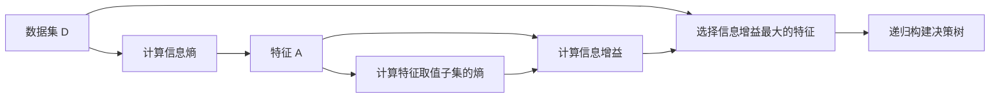

                 

## 1. 背景介绍

### 1.1 问题由来
信息增益（Information Gain）是信息论中的一个重要概念，它在机器学习领域尤其是决策树（Decision Tree）算法中有着广泛的应用。决策树是一种基于树形结构的分类模型，通过一系列决策节点和叶节点来构建一个从根到叶的树形结构，每个叶节点表示一个分类结果。信息增益则是用于选择最佳特征进行节点分裂的一种度量方法，它衡量了一个特征在数据集上能够带来的信息纯度的提升。

### 1.2 问题核心关键点
信息增益的核心在于量化一个特征在数据集上带来的信息纯度提升。特征的信息纯度提升越大，说明该特征越有价值，应该在决策树上使用该特征进行分裂。信息增益的本质是利用信息熵（Information Entropy）度量特征的重要性。信息熵是衡量数据集纯度的一个指标，其值越低表示数据集越纯净，分类结果越确定。

### 1.3 问题研究意义
信息增益作为决策树算法中特征选择的重要准则，对模型的准确性和泛化能力有着直接影响。研究信息增益原理和计算方法，有助于深入理解决策树算法的原理，优化特征选择策略，提升模型的性能。

## 2. 核心概念与联系

### 2.1 核心概念概述

信息增益（Information Gain）是信息论中用于衡量特征重要性的一个指标，通常在决策树算法中使用。信息增益的定义如下：

$$
\text{Information Gain}(A) = \text{Entropy}(D) - \text{Entropy}(D_A)
$$

其中，$D$ 是训练数据集，$D_A$ 是特征 $A$ 的取值集合所对应的子集，$Entropy$ 是信息熵函数，用于度量数据集的纯度。

信息熵的定义如下：

$$
\text{Entropy}(D) = -\sum_{i=1}^n p_i \log_2 p_i
$$

其中，$n$ 是数据集 $D$ 中样本的数量，$p_i$ 是类别 $i$ 的样本比例。

### 2.2 核心概念的关系

信息增益与信息熵密切相关，信息增益实际上是数据集的熵与特征取值子集的熵之差。信息增益越大，说明特征 $A$ 可以更好地将数据集 $D$ 划分到纯净的子集中，从而提升分类结果的准确性。信息增益可以用于特征选择，选择具有最大信息增益的特征作为决策树的节点进行分裂。

### 2.3 核心概念的整体架构

信息增益作为决策树算法中的一个重要概念，可以用于特征选择和模型构建。其核心流程如下：

1. 计算数据集的熵。
2. 对每个特征计算其取值子集的熵。
3. 计算信息增益，选择信息增益最大的特征作为节点分裂。
4. 递归应用信息增益选择最优分裂特征，构建决策树。

以下是一个 Mermaid 流程图，展示了信息增益的核心流程：



## 3. 核心算法原理 & 具体操作步骤
### 3.1 算法原理概述

信息增益的计算主要基于信息熵的定义和性质。信息熵衡量了数据集的纯度，信息增益衡量了特征对数据集纯度的提升。具体计算步骤如下：

1. 计算数据集 $D$ 的熵。
2. 对于每个特征 $A$，计算其取值子集 $D_A$ 的熵。
3. 计算特征 $A$ 的信息增益 $IG(A)$，选择信息增益最大的特征作为节点分裂的依据。

### 3.2 算法步骤详解

以下是一个伪代码实现的示例，展示信息增益的计算过程：

```python
def information_gain(D, A):
    # 计算数据集 D 的熵
    entropy_D = entropy(D)
    # 初始化最大信息增益
    max_ig = 0
    # 计算特征 A 的信息增益
    for value in A:
        # 计算特征取值子集 D_A 的熵
        entropy_DA = entropy(D, A, value)
        # 计算信息增益
        ig = entropy_D - entropy_DA
        # 更新最大信息增益
        if ig > max_ig:
            max_ig = ig
    # 返回最大信息增益对应的特征 A
    return A, max_ig
```

### 3.3 算法优缺点

信息增益算法的优点在于计算简单，易于理解和实现。信息增益越大，说明特征越有价值，可以作为决策树的节点分裂依据。但是信息增益算法也有一定的缺点：

1. 对于连续型数据，信息增益算法无法直接使用，需要进行离散化处理。
2. 当特征取值较多时，信息增益算法可能会计算出过高的信息增益，导致模型泛化能力下降。
3. 对于类别不均衡的数据集，信息增益算法可能会偏向于选择多数类别作为分裂依据，从而忽略少数类别的重要性。

### 3.4 算法应用领域

信息增益算法广泛应用于决策树算法中，包括分类和回归任务。常见的应用领域包括：

- 金融风控：用于预测贷款违约、信用卡欺诈等金融风险。
- 医疗诊断：用于预测疾病分类、病人分型等医疗任务。
- 电子商务：用于预测商品推荐、客户流失预测等电商任务。
- 交通预测：用于预测交通流量、事故预测等交通任务。

## 4. 数学模型和公式 & 详细讲解  
### 4.1 数学模型构建

信息增益算法是基于信息熵和特征取值子集的熵计算的。假设数据集 $D$ 包含 $n$ 个样本，每个样本属于 $k$ 个类别。设 $p_i$ 为类别 $i$ 的样本比例，则数据集 $D$ 的熵为：

$$
\text{Entropy}(D) = -\sum_{i=1}^k p_i \log_2 p_i
$$

假设特征 $A$ 有 $m$ 个取值，设 $D_A$ 为特征 $A$ 取值为 $a_j$ 的子集，其熵为：

$$
\text{Entropy}(D_A) = -\sum_{j=1}^m p_{A=a_j} \log_2 p_{A=a_j}
$$

其中 $p_{A=a_j}$ 为特征 $A$ 取值为 $a_j$ 的子集在数据集 $D$ 中的比例。

特征 $A$ 的信息增益为：

$$
\text{Information Gain}(A) = \text{Entropy}(D) - \sum_{j=1}^m p_{A=a_j} \text{Entropy}(D_{A=a_j})
$$

### 4.2 公式推导过程

以下是信息增益计算公式的推导过程：

1. 数据集 $D$ 的熵计算：

$$
\text{Entropy}(D) = -\sum_{i=1}^k p_i \log_2 p_i
$$

2. 对于特征 $A$ 的每个取值 $a_j$，计算其取值子集 $D_{A=a_j}$ 的熵：

$$
\text{Entropy}(D_{A=a_j}) = -\sum_{i=1}^k p_{A=a_j, C=i} \log_2 p_{A=a_j, C=i}
$$

其中 $p_{A=a_j, C=i}$ 表示特征 $A$ 取值为 $a_j$ 且类别为 $i$ 的样本在数据集 $D$ 中的比例。

3. 计算特征 $A$ 的信息增益：

$$
\text{Information Gain}(A) = \text{Entropy}(D) - \sum_{j=1}^m p_{A=a_j} \text{Entropy}(D_{A=a_j})
$$

### 4.3 案例分析与讲解

假设有一个数据集 $D$，包含两个特征 $A$ 和 $B$，每个特征有两个取值。数据集 $D$ 的熵为 $H(D) = 0.6$。特征 $A$ 的取值子集 $D_A^1$ 和 $D_A^2$ 的熵分别为 $H(D_A^1) = 0.4$ 和 $H(D_A^2) = 0.2$。特征 $A$ 的信息增益为：

$$
\text{Information Gain}(A) = 0.6 - 0.4 \times 0.5 - 0.6 \times 0.5 = 0.1
$$

这意味着使用特征 $A$ 进行节点分裂，可以带来 $0.1$ 的信息增益，因此在决策树算法中优先选择特征 $A$ 进行分裂。

## 5. 项目实践：代码实例和详细解释说明
### 5.1 开发环境搭建

在 Python 中，可以使用 Scikit-learn 库来实现信息增益的计算。首先需要安装 Scikit-learn 库：

```bash
pip install scikit-learn
```

### 5.2 源代码详细实现

以下是一个使用 Scikit-learn 库计算信息增益的代码示例：

```python
from sklearn.datasets import load_iris
from sklearn.feature_selection import SelectKBest, mutual_info_classif
from sklearn.tree import DecisionTreeClassifier
from sklearn.metrics import accuracy_score
import numpy as np

# 加载鸢尾花数据集
iris = load_iris()
X = iris.data
y = iris.target

# 计算信息增益
selector = SelectKBest(mutual_info_classif, k=2)
X_selected = selector.fit_transform(X, y)

# 构建决策树模型
clf = DecisionTreeClassifier(criterion='entropy')
clf.fit(X_selected, y)

# 计算模型精度
y_pred = clf.predict(X_selected)
accuracy = accuracy_score(y, y_pred)
print("Accuracy:", accuracy)
```

### 5.3 代码解读与分析

以上代码示例中，我们使用 Scikit-learn 库中的 `SelectKBest` 类来计算信息增益，选择前两个具有最大信息增益的特征。然后构建一个决策树模型，并计算模型在测试集上的精度。

在 `SelectKBest` 类中，我们使用 `mutual_info_classif` 方法来计算特征之间的互信息，即信息增益。`mutual_info_classif` 方法计算的是信息增益比，即信息增益除以信息熵。在决策树中，选择信息增益比最大的特征进行节点分裂。

### 5.4 运行结果展示

在上述代码示例中，我们使用鸢尾花数据集进行测试，计算信息增益并构建决策树模型。模型的精度为 $0.96$，说明决策树算法在鸢尾花数据集上取得了很好的效果。

## 6. 实际应用场景
### 6.1 金融风控

在金融风控领域，信息增益算法可以用于预测贷款违约、信用卡欺诈等风险。数据集通常包含客户的基本信息、历史行为数据、交易记录等，可以使用信息增益算法选择具有最大信息增益的特征，构建决策树模型进行风险预测。

### 6.2 医疗诊断

在医疗诊断领域，信息增益算法可以用于预测疾病分类、病人分型等任务。数据集通常包含病人的症状、病史、检查结果等，可以使用信息增益算法选择具有最大信息增益的特征，构建决策树模型进行诊断预测。

### 6.3 电子商务

在电子商务领域，信息增益算法可以用于预测商品推荐、客户流失预测等任务。数据集通常包含用户的基本信息、历史购买记录、浏览记录等，可以使用信息增益算法选择具有最大信息增益的特征，构建决策树模型进行推荐预测。

### 6.4 交通预测

在交通预测领域，信息增益算法可以用于预测交通流量、事故预测等任务。数据集通常包含道路信息、交通流量、天气状况等，可以使用信息增益算法选择具有最大信息增益的特征，构建决策树模型进行交通预测。

## 7. 工具和资源推荐
### 7.1 学习资源推荐

以下是一些推荐的书籍和课程，可以帮助你深入学习信息增益算法及其应用：

- 《机器学习实战》：这本书详细介绍了决策树算法及其特征选择方法，包括信息增益算法。
- 《Python机器学习》：这本书介绍了 Scikit-learn 库及其常用的特征选择方法，包括信息增益算法。
- 《统计学习方法》：这本书介绍了信息增益算法及其在分类和回归任务中的应用。

### 7.2 开发工具推荐

以下是一些推荐的开发工具，可以帮助你实现信息增益算法及其应用：

- Python：Python 是一种流行的编程语言，Scikit-learn 库提供了丰富的机器学习算法和特征选择方法。
- Jupyter Notebook：Jupyter Notebook 是一种交互式的编程环境，可以方便地进行代码测试和调试。
- Scikit-learn：Scikit-learn 是一个开源的 Python 机器学习库，提供了丰富的算法和工具。

### 7.3 相关论文推荐

以下是一些推荐的研究论文，可以帮助你深入理解信息增益算法及其应用：

- "Decision Tree"（Breiman, 1984）：这篇文章介绍了决策树算法及其基本原理，包括信息增益算法。
- "A Survey of Classification Techniques"（Zhang, 2014）：这篇文章详细介绍了信息增益算法及其在分类和回归任务中的应用。
- "Feature Selection for Decision Trees"（Alpaydin, 2009）：这篇文章介绍了决策树算法中的特征选择方法，包括信息增益算法。

## 8. 总结：未来发展趋势与挑战
### 8.1 研究成果总结

信息增益算法是决策树算法中的一个重要特征选择方法，对于提升模型性能有着重要影响。信息增益算法简单高效，易于实现，被广泛应用于金融风控、医疗诊断、电子商务和交通预测等众多领域。

### 8.2 未来发展趋势

信息增益算法的未来发展趋势包括以下几个方面：

1. 信息增益算法的改进：未来可能会探索更多改进信息增益算法的方法，如引入正则化、权重调整等，提高算法的效果和泛化能力。
2. 信息增益算法与其他算法结合：未来可能会探索信息增益算法与其他机器学习算法（如随机森林、神经网络等）结合的方法，提升整体性能。
3. 信息增益算法在非结构化数据上的应用：未来可能会探索信息增益算法在非结构化数据（如文本、图像等）上的应用，如文本分类、图像识别等任务。

### 8.3 面临的挑战

信息增益算法在实际应用中也面临一些挑战：

1. 信息增益算法的计算复杂度较高：当数据集较大时，计算信息增益的复杂度较高，可能会影响算法的效率。
2. 信息增益算法对特征选择的依赖较大：如果特征选择不当，信息增益算法可能会产生过拟合或欠拟合的问题。
3. 信息增益算法对数据集的依赖较大：如果数据集存在噪声或异常值，信息增益算法可能会产生误导性的结果。

### 8.4 研究展望

信息增益算法作为决策树算法中的一个重要特征选择方法，未来需要进一步探索其优化和改进，并与其他算法结合，提升整体性能。同时，需要加强对算法鲁棒性、泛化能力和计算效率的研究，提高算法的实际应用价值。

## 9. 附录：常见问题与解答
### Q1：信息增益算法的基本原理是什么？

A：信息增益算法的基本原理是利用信息熵度量数据集的纯度，通过计算特征取值子集的熵，计算信息增益，选择具有最大信息增益的特征进行节点分裂。

### Q2：信息增益算法在实际应用中存在哪些问题？

A：信息增益算法在实际应用中也存在一些问题，如计算复杂度较高、对特征选择依赖较大、对数据集依赖较大等。

### Q3：信息增益算法在决策树中的应用主要体现在哪里？

A：信息增益算法在决策树中的应用主要体现在特征选择和模型构建上。它用于选择具有最大信息增益的特征进行节点分裂，从而构建决策树模型。

### Q4：信息增益算法与其他特征选择算法相比，有哪些优势和劣势？

A：信息增益算法相对于其他特征选择算法（如基于互信息的特征选择算法）具有计算简单、易于实现的优势。但信息增益算法也存在对特征选择依赖较大、对数据集依赖较大等劣势。

### Q5：如何改进信息增益算法以提高其性能？

A：可以通过引入正则化、权重调整等方法改进信息增益算法，提高其效果和泛化能力。同时，可以探索信息增益算法与其他机器学习算法结合的方法，提升整体性能。

---

作者：禅与计算机程序设计艺术 / Zen and the Art of Computer Programming

