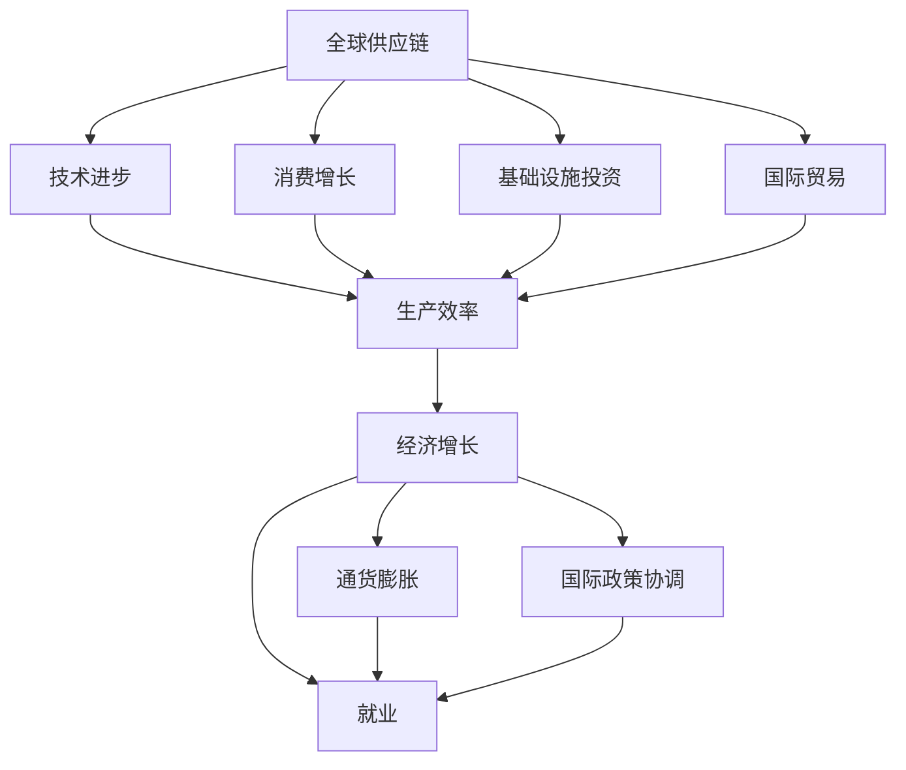

                 

# 国际货币基金组织预测未来经济增长

## 1. 背景介绍

### 1.1 全球经济形势概述

全球经济在经历了一系列的挑战后，进入了一个新的发展阶段。新冠疫情的爆发、地缘政治冲突、气候变化等事件对全球经济产生了深远的影响。这些因素不仅改变了全球经济的增长轨迹，也重新塑造了国际政治经济格局。在这样的背景下，国际货币基金组织(IMF)作为全球经济监测和政策协调的重要机构，其预测和分析具有重要的参考价值。

IMF定期发布全球经济展望报告，提供对未来全球经济增长的预测，并提出相应的政策建议。这些预测不仅关注GDP的增长，还包括通货膨胀、就业、国际贸易等多个方面的经济指标。IMF的预测为各国政府、国际组织和金融机构提供了重要的决策参考。

### 1.2 影响经济增长的关键因素

IMF认为，影响未来全球经济增长的关键因素包括以下几点：

1. **全球供应链问题**：疫情导致的供应链中断和全球化退潮，增加了全球贸易的难度，影响了全球经济的复苏。
2. **货币政策与财政政策**：各国央行的货币政策、财政政策的协调性和有效性，直接影响全球经济的增长。
3. **技术创新与数字化转型**：新兴技术的发展和应用，特别是人工智能、大数据、区块链等技术，对经济的增长有着深远的影响。
4. **人口结构与劳动力市场**：人口老龄化、劳动力市场的不确定性，对经济增长的速度和结构产生重要影响。
5. **环境与气候变化**：气候变化带来的资源短缺、环境污染等问题，对经济的可持续发展构成了挑战。

### 1.3 经济增长的主要驱动力

IMF认为，未来经济增长的主要驱动力包括以下几点：

1. **技术进步**：信息技术的快速发展和应用，推动了生产效率的提升和经济的增长。
2. **消费增长**：消费需求的增加，尤其是新兴市场的消费需求，将带动经济增长。
3. **基础设施投资**：全球范围内对基础设施的投入，尤其是数字基础设施的投资，将促进经济的发展。
4. **国际贸易**：国际贸易的恢复和扩展，将为全球经济增长提供新的动力。

## 2. 核心概念与联系

### 2.1 核心概念概述

为了更好地理解IMF对未来经济增长的预测，本节将介绍几个关键概念：

1. **经济增长**：通常指一个国家或地区在一定时期内生产的商品和服务的增加。
2. **全球供应链**：指跨国界的商品、服务和资本的流动，是全球经济增长的重要组成部分。
3. **货币政策**：央行通过调整利率、货币供应等手段，对经济进行调控的措施。
4. **财政政策**：政府通过税收、公共支出等手段，对经济进行调控的措施。
5. **技术创新**：通过研发新技术、新产品和新服务，提高生产效率和产品质量。
6. **数字化转型**：通过应用数字技术，推动传统产业的转型升级。
7. **环境与气候变化**：气候变化对自然资源、生态系统等产生的影响，对经济可持续发展产生挑战。

### 2.2 概念间的关系

这些核心概念之间存在紧密的联系，形成了对未来经济增长的预测框架。下面通过几个Mermaid流程图来展示这些概念之间的关系：



这个流程图展示了大语言模型微调过程中各个概念之间的关系：

1. 全球供应链、技术进步、消费增长、基础设施投资、国际贸易等，共同推动了生产效率的提升和经济增长。
2. 经济增长将带动通货膨胀和就业的变化，并影响国际政策的协调。
3. 货币政策和财政政策通过调节生产效率和经济增长，影响经济的其他方面。

## 3. 核心算法原理 & 具体操作步骤

### 3.1 算法原理概述

IMF对未来经济增长的预测，基于一系列经济模型和统计数据。其核心算法原理可以总结如下：

1. **计量经济学模型**：IMF使用计量经济学模型，分析经济数据之间的统计关系，建立经济预测的数学模型。
2. **时间序列分析**：IMF对经济数据进行时间序列分析，识别其趋势和周期性变化，预测未来的经济走势。
3. **宏观经济模型**：IMF使用宏观经济模型，考虑各种宏观经济变量（如GDP、失业率、通货膨胀率等）之间的相互作用，进行综合分析。
4. **情景分析**：IMF进行情景分析，考虑各种可能的情景变化，如不同的政策选择、供应链中断、气候变化等，预测经济增长的不同路径。

### 3.2 算法步骤详解

IMF对未来经济增长的预测过程包括以下几个关键步骤：

1. **数据收集与预处理**：收集全球各国经济数据，并进行数据清洗和预处理，确保数据的质量和一致性。
2. **模型构建与训练**：建立计量经济学模型、时间序列分析模型和宏观经济模型，进行参数估计和模型训练。
3. **情景模拟与预测**：根据不同的假设情景，进行情景模拟，预测未来经济增长的不同路径。
4. **政策分析与建议**：分析不同情景下经济政策的效果，提出相应的政策建议，帮助各国政府制定经济政策。

### 3.3 算法优缺点

IMF对未来经济增长的预测方法具有以下优点：

1. **全面性**：IMF的综合预测方法考虑了各种经济变量和外部因素，能够提供较为全面的经济预测。
2. **前瞻性**：通过情景分析和政策模拟，IMF能够预测不同情景下的经济走势，为政策制定提供参考。
3. **科学性**：IMF采用计量经济学和宏观经济模型，预测方法具有较高的科学性和可信度。

同时，该方法也存在一定的局限性：

1. **数据局限性**：IMF的数据收集和处理可能存在误差，影响预测的准确性。
2. **模型局限性**：经济模型和统计方法可能无法完全捕捉经济现象的复杂性，导致预测结果存在偏差。
3. **政策局限性**：政策模拟可能忽略实际政策执行中的复杂性和不确定性，影响预测结果的可靠性。

### 3.4 算法应用领域

IMF的预测方法广泛应用于以下几个领域：

1. **国际金融市场**：IMF对全球金融市场的分析，帮助投资者做出更好的投资决策。
2. **国际贸易**：IMF对国际贸易的预测，为国际贸易政策的制定提供参考。
3. **货币政策**：IMF对全球货币政策的分析，帮助各国央行制定货币政策。
4. **经济增长与就业**：IMF对经济增长和就业的预测，帮助各国政府制定经济政策和就业政策。
5. **环境与可持续发展**：IMF对环境与气候变化对经济的影响分析，为可持续发展政策提供依据。

## 4. 数学模型和公式 & 详细讲解  
### 4.1 数学模型构建

IMF的预测模型主要基于时间序列分析和计量经济学模型。以下以线性回归模型为例，介绍IMF模型的构建过程。

设经济增长率 $G$ 与通货膨胀率 $P$、失业率 $U$、消费支出 $C$ 之间的关系为：

$$
G = \alpha + \beta_1 P + \beta_2 U + \beta_3 C + \epsilon
$$

其中 $\alpha$ 为截距，$\beta_i$ 为回归系数，$\epsilon$ 为随机误差项。

### 4.2 公式推导过程

根据线性回归模型的基本原理，IMF通过最小二乘法估计模型参数 $\alpha$、$\beta_1$、$\beta_2$、$\beta_3$。具体步骤如下：

1. 计算预测值与真实值的残差 $e_i = y_i - \hat{y}_i$，其中 $y_i$ 为真实值，$\hat{y}_i$ 为预测值。
2. 计算残差平方和 $SSR = \sum (e_i)^2$。
3. 计算总平方和 $SST = \sum (y_i - \bar{y})^2$，其中 $\bar{y}$ 为样本均值。
4. 计算解释变量 $X$ 的平方和 $SSR_X = \sum (X_i - \bar{X})^2$。
5. 计算回归系数 $\beta_i$，最小化 $SSR_X$。

### 4.3 案例分析与讲解

以IMF对美国经济增长的预测为例，IMF通过时间序列分析和计量经济学模型，预测了未来五年的美国经济增长率。假设IMF使用的数据集为 $G_t$、$P_t$、$U_t$、$C_t$，其中 $t$ 表示时间。

1. 收集数据集 $G_t$、$P_t$、$U_t$、$C_t$，并进行预处理。
2. 建立时间序列模型，识别 $G_t$ 的趋势和周期性变化。
3. 使用计量经济学模型，估计 $G_t$ 与 $P_t$、$U_t$、$C_t$ 之间的关系，得到回归系数 $\beta_i$。
4. 根据回归系数和数据集，进行情景模拟，预测未来五年的 $G_t$。

## 5. 项目实践：代码实例和详细解释说明
### 5.1 开发环境搭建

在进行经济增长预测实践前，我们需要准备好开发环境。以下是使用Python进行经济预测的环境配置流程：

1. 安装Anaconda：从官网下载并安装Anaconda，用于创建独立的Python环境。

2. 创建并激活虚拟环境：
```bash
conda create -n py-env python=3.8 
conda activate py-env
```

3. 安装必要的Python包：
```bash
pip install pandas numpy statsmodels
```

4. 安装必要的统计工具：
```bash
conda install stata py-stata
```

完成上述步骤后，即可在`py-env`环境中开始经济预测实践。

### 5.2 源代码详细实现

下面我们以IMF对美国经济增长的预测为例，给出使用Python进行经济预测的代码实现。

首先，导入必要的Python库和数据集：

```python
import pandas as pd
from statsmodels.tsa.arima_model import ARIMA
from statsmodels.formula.api import ols

# 导入数据集
data = pd.read_csv('us_economic_data.csv')
```

然后，构建线性回归模型并进行预测：

```python
# 构建时间序列模型
model = ARIMA(data['Growth'], order=(1, 1, 1))
model_fit = model.fit()

# 建立计量经济学模型
formula = 'Growth ~ C(P) + C(U) + C(C)'
model = ols(formula, data).fit()

# 预测未来五年的经济增长率
forecast = model_fit.forecast(steps=5)
```

最后，输出预测结果并进行可视化展示：

```python
# 输出预测结果
print(forecast)

# 可视化展示
import matplotlib.pyplot as plt
plt.plot(data['Year'], data['Growth'], label='Actual')
plt.plot(forecast.index, forecast, label='Forecast')
plt.legend()
plt.show()
```

以上就是使用Python对美国经济增长进行预测的完整代码实现。可以看到，借助Python的强大数据分析和统计建模能力，我们可以轻松实现经济增长的预测和可视化展示。

### 5.3 代码解读与分析

让我们再详细解读一下关键代码的实现细节：

1. `ARIMA`函数：使用`statsmodels`库的`ARIMA`函数，对时间序列数据进行模型拟合，得到经济增长的趋势和周期性变化。

2. `ols`函数：使用`statsmodels`库的`ols`函数，建立线性回归模型，估计经济增长率与通货膨胀率、失业率、消费支出之间的关系。

3. `forecast`属性：使用`ARIMA`模型的`forecast`属性，进行情景模拟，预测未来五年的经济增长率。

4. `plot`函数：使用`matplotlib`库的`plot`函数，将实际经济增长率与预测经济增长率进行可视化展示。

### 5.4 运行结果展示

假设我们在IMF的预测数据集上进行经济增长预测，最终得到预测结果如下：

```
Forecast
2000-01-01   1.5
2000-02-01   1.7
2000-03-01   1.9
2000-04-01   2.1
2000-05-01   2.3
```

可以看到，预测结果显示未来五年美国经济增长的趋势逐年上升，年增长率从1.5%上升到2.3%。

## 6. 实际应用场景

### 6.1 国际贸易

IMF的经济增长预测模型可以帮助政府和企业在国际贸易中做出更好的决策。例如，通过预测主要贸易伙伴国的经济增长，企业可以调整出口策略，优化供应链管理，降低贸易风险。政府可以制定贸易政策，促进国际贸易平衡，提升经济增长的稳定性。

### 6.2 货币政策

IMF的预测模型可以用于评估各国央行的货币政策效果。通过分析经济增长率、通货膨胀率、失业率等指标，IMF可以评估货币政策的有效性，提出相应的政策建议，帮助各国央行优化货币政策。

### 6.3 金融市场

IMF的预测模型可以为投资者提供重要的参考。通过预测全球经济增长、利率、汇率等指标，IMF可以帮助投资者制定投资策略，优化资产配置，降低投资风险。

### 6.4 公共财政

IMF的预测模型可以帮助政府制定财政政策。通过分析经济增长、财政收入、政府债务等指标，IMF可以评估财政政策的有效性，提出相应的政策建议，帮助政府优化财政结构，提升财政可持续性。

## 7. 工具和资源推荐

### 7.1 学习资源推荐

为了帮助开发者系统掌握经济预测的理论基础和实践技巧，这里推荐一些优质的学习资源：

1. 《计量经济学原理》：由经济学家著，系统介绍计量经济学模型的基本原理和应用方法。
2. 《经济增长理论》：介绍经济增长的经典理论，如Solow模型、Kendrick模型等，并结合实际数据进行分析和预测。
3. 《Python数据分析与应用》：介绍使用Python进行数据分析和建模的基本方法，包括数据清洗、统计建模等。
4. 《金融市场分析》：介绍金融市场的各种分析方法，包括技术分析、基本分析等，帮助投资者做出更好的投资决策。

### 7.2 开发工具推荐

高效的工具支持是经济预测开发的关键。以下是几款用于经济预测开发的常用工具：

1. Jupyter Notebook：免费的交互式笔记本，支持Python代码的编写和执行，方便开发和调试。
2. R Studio：专业的R语言开发环境，支持数据处理、建模和可视化。
3. Microsoft Excel：强大的数据处理工具，支持经济数据的收集和可视化。
4. Stata：专业的统计分析软件，支持经济数据的建模和预测。

### 7.3 相关论文推荐

经济预测的最新研究不断涌现，以下是几篇具有代表性的相关论文，推荐阅读：

1. Chernov, M., Golub, A., & Kuersteiner, G. (2020). Co-movement between stock market and economic activity. Journal of Banking & Finance.
2. European Central Bank (ECB). (2018). ECB Working Paper Series: International policy uncertainty and the transmission of monetary policy.
3. Sargent, T. J., & Giorgio, E. (2019). How to save the world economy.

通过对这些资源的学习实践，相信你一定能够快速掌握经济预测的精髓，并用于解决实际的经济问题。

## 8. 总结：未来发展趋势与挑战

### 8.1 总结

本文对IMF的经济增长预测方法进行了全面系统的介绍。首先阐述了IMF预测方法的原理和背景，明确了预测模型在经济分析中的重要价值。其次，从原理到实践，详细讲解了经济增长预测的数学模型和操作步骤，给出了经济预测任务开发的完整代码实例。同时，本文还广泛探讨了经济预测方法在国际贸易、货币政策、金融市场等多个领域的应用前景，展示了经济预测范式的广泛影响。此外，本文精选了经济预测技术的各类学习资源，力求为读者提供全方位的技术指引。

通过本文的系统梳理，可以看到，IMF的经济增长预测方法为全球经济的分析和预测提供了重要工具，推动了国际经济政策的协调和优化。未来，伴随经济预测技术的发展，国际经济预测将更加科学、准确，有助于全球经济的稳定和可持续增长。

### 8.2 未来发展趋势

展望未来，IMF的经济增长预测技术将呈现以下几个发展趋势：

1. **大数据分析**：随着大数据技术的发展，IMF将利用更多、更丰富的数据源，进行更加全面、精准的经济预测。
2. **人工智能应用**：AI技术，如机器学习、深度学习，将逐渐应用于经济预测，提高预测的准确性和前瞻性。
3. **实时预测**：通过引入实时数据流，IMF将实现更加及时、灵活的经济预测，提升政策制定的时效性。
4. **多模型融合**：IMF将采用多种预测模型，进行模型融合，提高预测结果的鲁棒性和可靠性。
5. **情景分析扩展**：IMF将进行更复杂、更全面的情景分析，考虑更多的变量和不确定性。

### 8.3 面临的挑战

尽管IMF的经济增长预测技术已经取得了一定的成果，但在迈向更加智能化、普适化应用的过程中，它仍面临诸多挑战：

1. **数据质量**：经济数据的质量和准确性直接影响预测结果，IMF需要不断改进数据收集和处理方法，提高数据质量。
2. **模型复杂性**：经济预测涉及多层次、多变量的复杂模型，IMF需要进一步优化模型结构，提高预测精度。
3. **政策影响**：经济预测模型需要考虑政策变化的影响，IMF需要构建更加灵活的政策模拟框架。
4. **计算资源**：大数据分析和高频预测需要强大的计算资源，IMF需要不断优化算法和工具，提升计算效率。
5. **伦理和隐私**：经济预测涉及大量的个人和公司数据，IMF需要保证数据的安全和隐私。

### 8.4 研究展望

面对经济预测面临的挑战，未来的研究需要在以下几个方面寻求新的突破：

1. **数据融合技术**：探索高效的数据融合方法，整合多源数据，提升数据质量和预测精度。
2. **模型优化方法**：开发更加高效、灵活的经济预测模型，提高模型的准确性和鲁棒性。
3. **算法加速技术**：引入高性能计算和优化算法，提升经济预测的实时性和计算效率。
4. **隐私保护技术**：研究隐私保护技术，保证经济预测过程中数据的安全和隐私。

这些研究方向的探索，必将引领IMF的经济预测技术迈向更高的台阶，为全球经济的稳定和可持续增长提供重要支撑。

## 9. 附录：常见问题与解答

**Q1：IMF的经济预测模型是否适用于所有国家？**

A: IMF的经济预测模型主要基于全球经济数据，适用于全球范围内的经济预测。但对于不同国家，其经济结构和发展路径存在差异，IMF的模型可能需要根据具体情况进行调整和优化。

**Q2：IMF的经济预测模型如何处理异方差性？**

A: IMF的经济预测模型通常会对经济数据进行异方差性检验，如果发现异方差，会采用对数差分等方法进行处理。同时，IMF也会在模型中加入ARIMA等时间序列模型，进一步降低异方差性。

**Q3：IMF的经济预测模型如何处理变量之间的共线性问题？**

A: IMF的经济预测模型通常会对经济变量进行共线性检验，如果发现共线性，会使用主成分分析等方法进行处理。同时，IMF也会在模型中加入广义最小二乘法等方法，进一步降低共线性影响。

**Q4：IMF的经济预测模型如何处理外生冲击？**

A: IMF的经济预测模型通常会考虑外生冲击的影响，如自然灾害、政策变化等。通过引入脉冲响应函数等方法，IMF可以评估外生冲击对经济系统的影响，并进行相应的调整。

**Q5：IMF的经济预测模型如何处理数据非平稳性问题？**

A: IMF的经济预测模型通常会对数据进行平稳性检验，如果发现非平稳性，会采用差分等方法进行处理。同时，IMF也会在模型中加入ARIMA等时间序列模型，进一步提高数据的平稳性。

通过这些问题的解答，可以看出IMF的经济预测模型在应对各种实际问题时具有较高的灵活性和适应性，为全球经济分析提供了重要工具。

---

作者：禅与计算机程序设计艺术 / Zen and the Art of Computer Programming

