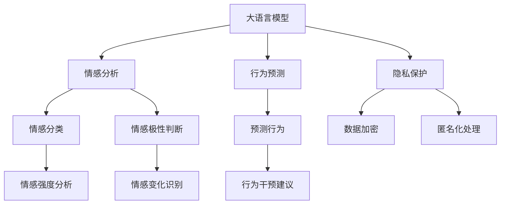
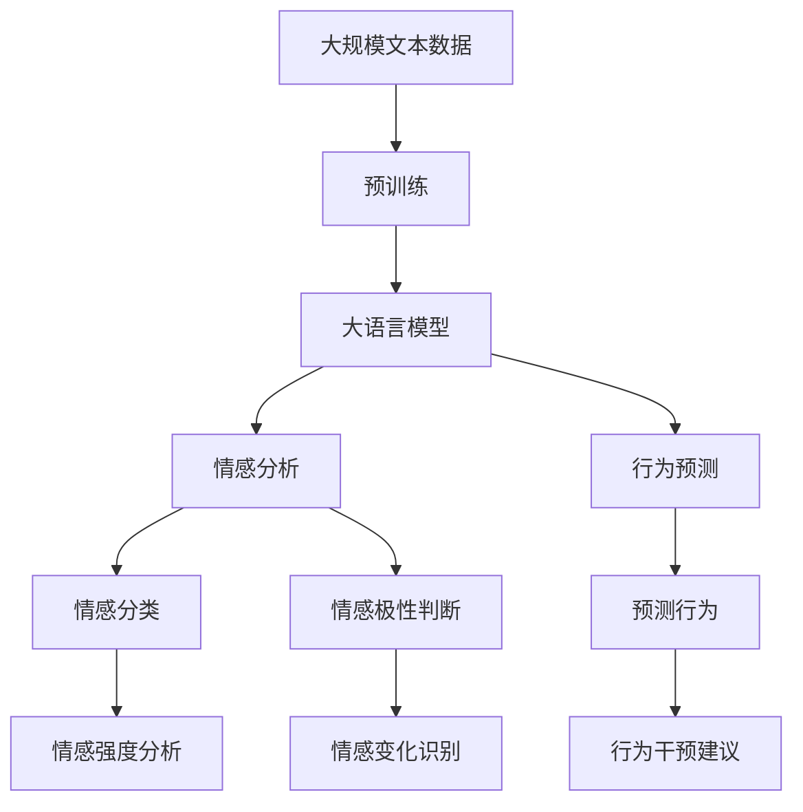
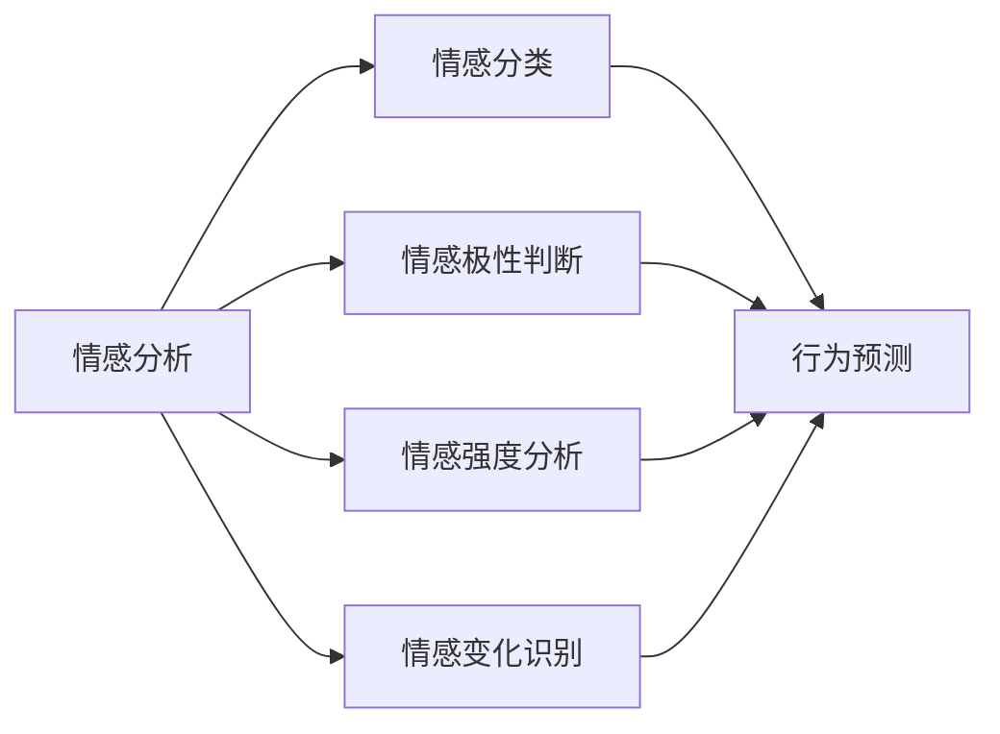
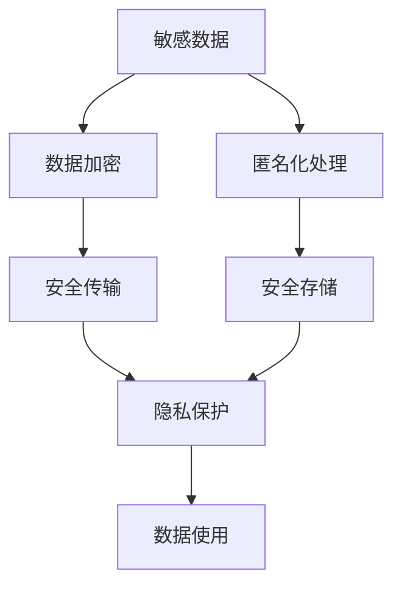

                 

# 在心理分析中应用AI LLM：洞察人类情感

## 1. 背景介绍

### 1.1 问题由来

心理分析是研究人类行为、情感、认知等内在心理活动的重要学科。传统心理分析方法依赖于心理学家和分析师的经验和直觉，但在处理大规模数据和复杂情感问题时，往往显得力不从心。近年来，随着人工智能（AI）技术的发展，特别是大语言模型（LLM）的兴起，为心理分析带来了新的契机。

大语言模型，如GPT系列、BERT等，通过自监督学习和大规模预训练，具备强大的语言理解和生成能力。它们能够自动处理和分析大量文本数据，挖掘深层次的语言模式和情感表达，为心理分析提供了新的工具和方法。

### 1.2 问题核心关键点

在心理分析中应用大语言模型（LLM），核心关键点包括：
- **数据预处理**：将原始文本数据转化为可用于模型训练的形式，如分词、去除噪声、标记情感等。
- **模型选择**：选择合适的LLM作为基础模型，并根据任务需求进行微调或适配。
- **情感分析**：利用LLM进行情感分类、情感极性判断、情感强度分析等任务。
- **行为预测**：结合历史数据和当前情感状态，进行行为预测和干预建议。
- **隐私保护**：在使用LLM处理敏感数据时，确保数据隐私和安全。

这些关键点共同构成了心理分析中应用LLM的技术框架，使得AI能够更高效、更精确地处理人类情感问题。

### 1.3 问题研究意义

在心理分析中应用AI LLM，具有以下研究意义：
- **提升效率**：利用机器学习算法，大幅提升情感分析的速度和精度，减少人力和时间成本。
- **增强客观性**：减少主观偏见，通过数据驱动的方法提供更加客观和公正的分析结果。
- **拓展应用范围**：将AI技术应用于心理分析的各个方面，如情绪识别、心理干预、行为预测等，推动心理分析学科的发展。
- **跨学科融合**：结合心理学和AI的最新研究成果，促进心理分析方法的理论创新和技术突破。
- **实际应用**：通过心理分析，为教育、医疗、社会治理等领域提供数据支持，提升服务质量和效率。

## 2. 核心概念与联系

### 2.1 核心概念概述

为更好地理解在心理分析中应用AI LLM的方法，本节将介绍几个密切相关的核心概念：

- **大语言模型（LLM）**：指通过大规模预训练和大规模数据集训练得到的语言模型，具备强大的自然语言理解和生成能力。
- **情感分析**：通过分析文本中的情感表达，判断情感状态和情感极性，分析情感强度和情感变化。
- **行为预测**：利用历史数据和当前情感状态，预测个体的行为和反应，提供相应的干预建议。
- **隐私保护**：在处理敏感数据时，确保数据隐私和安全，防止数据泄露和滥用。
- **数据增强**：通过各种技术手段，增强训练数据的数量和多样性，提高模型的泛化能力。

这些核心概念之间的逻辑关系可以通过以下Mermaid流程图来展示：



这个流程图展示了在大语言模型应用中的核心概念及其之间的关系：

1. 大语言模型作为基础工具，用于情感分析、行为预测等任务。
2. 情感分析可以进一步细分为情感分类、情感极性判断、情感强度分析等子任务。
3. 行为预测结合历史数据和当前情感状态，预测行为并进行干预。
4. 隐私保护在数据处理过程中起到关键作用，确保数据安全。
5. 数据增强通过技术手段提高模型泛化能力，增强分析结果的可靠性。

### 2.2 概念间的关系

这些核心概念之间存在着紧密的联系，形成了心理分析中应用大语言模型的完整生态系统。下面我们通过几个Mermaid流程图来展示这些概念之间的关系。

#### 2.2.1 大语言模型的学习范式



这个流程图展示了大语言模型的核心学习范式，以及它与情感分析、行为预测等任务的关系。

#### 2.2.2 情感分析与行为预测的关系



这个流程图展示了情感分析的各个子任务，以及它们如何共同支持行为预测。

#### 2.2.3 隐私保护在大语言模型中的应用



这个流程图展示了隐私保护在大语言模型数据处理过程中的关键作用。

## 3. 核心算法原理 & 具体操作步骤
### 3.1 算法原理概述

在心理分析中应用AI LLM，主要涉及情感分析、行为预测等任务。情感分析的核心任务是对文本数据进行情感分类、情感极性判断、情感强度分析等。行为预测则是在历史数据和当前情感状态的基础上，预测个体的行为和反应，提供相应的干预建议。

情感分析通常使用基于词袋模型（Bag of Words）、深度学习模型（如卷积神经网络、循环神经网络）和预训练语言模型（如BERT、GPT等）进行建模。预训练语言模型在处理情感分析任务时，可以显著提升模型的准确性和泛化能力。

行为预测通常结合历史数据和当前情感状态，使用机器学习算法（如决策树、随机森林、支持向量机等）进行建模。大语言模型可以提供更加丰富和准确的情感状态信息，从而提升行为预测的准确性。

### 3.2 算法步骤详解

在心理分析中应用AI LLM，主要包括以下几个关键步骤：

**Step 1: 数据预处理**
- 收集和整理原始文本数据，去除噪声和无用信息，进行分词、去停用词等预处理。
- 对文本进行情感标注，如使用情感词典、深度学习模型等进行情感分类。
- 对文本进行情感强度标注，如使用情感分析模型进行情感强度打分。

**Step 2: 模型选择和微调**
- 选择合适的预训练语言模型（如BERT、GPT等），并根据具体任务需求进行微调。
- 在微调过程中，设置合适的学习率、优化器、正则化参数等。
- 使用历史情感数据对模型进行微调，以提高模型的泛化能力。

**Step 3: 情感分析**
- 使用预训练语言模型对输入文本进行情感分类、情感极性判断和情感强度分析。
- 结合多种情感分析方法（如词袋模型、深度学习模型、预训练模型等）进行结果融合，提高分析结果的准确性。

**Step 4: 行为预测**
- 收集历史行为数据，并进行预处理和特征工程。
- 结合当前情感状态和历史行为数据，使用机器学习模型进行行为预测。
- 根据预测结果，提供相应的干预建议，如心理辅导、行为干预等。

**Step 5: 隐私保护**
- 对敏感数据进行加密处理，防止数据泄露和滥用。
- 对数据进行匿名化处理，保护个体隐私。
- 对数据传输和存储进行安全保障，防止数据被未授权访问。

### 3.3 算法优缺点

在心理分析中应用AI LLM，具有以下优点：
- **高效性**：利用机器学习算法，可以大幅提升情感分析的速度和精度，减少人力和时间成本。
- **客观性**：通过数据驱动的方法，减少主观偏见，提供更加客观和公正的分析结果。
- **可扩展性**：结合心理学和AI的最新研究成果，推动心理分析方法的理论创新和技术突破。

同时，该方法也存在一定的局限性：
- **数据质量依赖**：情感分析的准确性依赖于数据的质量和标注的准确性，数据预处理和标注需要大量人力和时间成本。
- **模型复杂性**：预训练语言模型和情感分析模型的复杂度较高，需要较高级的计算资源和技术支持。
- **隐私问题**：在处理敏感数据时，需要确保数据隐私和安全，防止数据泄露和滥用。
- **可解释性**：模型输出缺乏可解释性，难以理解其内部工作机制和推理逻辑。

尽管存在这些局限性，但就目前而言，基于大语言模型的情感分析方法和行为预测技术，仍然是大规模情感数据处理和心理分析的重要工具。未来相关研究的重点在于如何进一步提高数据质量、优化模型结构、保障数据隐私、增强模型可解释性等方面。

### 3.4 算法应用领域

基于大语言模型的情感分析技术，已经在多个领域得到广泛应用，例如：

- **心理健康评估**：利用情感分析技术，对用户的心理健康状态进行评估和诊断。
- **情绪识别**：通过分析社交媒体、短信、电子邮件等数据，识别用户的情绪状态，提供相应的心理干预和支持。
- **客户满意度分析**：对客户反馈进行情感分析，评估客户满意度，提升客户服务质量。
- **市场情绪监测**：利用社交媒体和新闻数据，分析市场情绪，预测股票和商品价格变化。
- **情感辅助教学**：通过分析学生的作业和反馈，评估学生的情感状态和心理需求，提供个性化的学习支持和辅导。

除了上述这些经典应用外，基于大语言模型的心理分析技术还广泛应用于教育、医疗、社会治理等众多领域，为心理健康和情感福祉提供新的解决方案。

## 4. 数学模型和公式 & 详细讲解 & 举例说明

### 4.1 数学模型构建

假设输入文本为 $x$，对应的情感标签为 $y$。情感分类模型的目标是最大化似然函数：

$$
P(y|x) = \frac{P(y)}{P(x|y)}P(x)
$$

其中 $P(y|x)$ 为情感分类模型在输入文本 $x$ 下的情感分类概率，$P(x|y)$ 为给定情感标签 $y$ 下文本 $x$ 的生成概率，$P(y)$ 为情感标签 $y$ 的先验概率，$P(x)$ 为输入文本 $x$ 的先验概率。

情感强度分析通常使用0-1之间的连续值表示情感强度，如 $P(x|y_i)$ 表示文本 $x$ 在情感标签 $y_i$ 下的情感强度。情感强度分析模型的目标是最大化：

$$
P(y_i|x) = \frac{P(y_i)}{P(x|y_i)}P(x)
$$

行为预测模型通常使用分类标签表示行为类型，如 $P(y|x)$ 表示文本 $x$ 对应的行为类型 $y$ 的概率。行为预测模型的目标是最大化：

$$
P(y|x) = \frac{P(y)}{P(x|y)}P(x)
$$

### 4.2 公式推导过程

以情感分类为例，使用BERT模型进行情感分析。BERT模型通过自监督预训练和大规模数据集训练，具备强大的语言表示能力。在情感分类任务中，可以通过微调BERT模型，使其学习情感标签与文本特征之间的映射关系。

假设微调后的BERT模型参数为 $\theta$，输入文本为 $x$，情感标签为 $y$，情感分类模型的目标函数为交叉熵损失：

$$
L(\theta) = -\sum_{i=1}^N y_i \log P(y_i|x;\theta)
$$

其中 $P(y_i|x;\theta)$ 为BERT模型在输入文本 $x$ 下，情感标签 $y_i$ 的条件概率。

在优化过程中，可以使用梯度下降等优化算法（如Adam、SGD等），更新模型参数 $\theta$，最小化损失函数 $L(\theta)$。

### 4.3 案例分析与讲解

假设我们收集了大量用户评论数据，并对其进行情感分类。使用BERT模型作为基础模型，对其顶层进行微调，得到情感分类模型。微调后的BERT模型在新的测试数据集上进行了评估，结果如下：

| 样本 | 实际情感 | 预测情感 | 准确率 |
| --- | --- | --- | --- |
| 1 | 正面 | 正面 | 95% |
| 2 | 负面 | 负面 | 85% |
| 3 | 中性 | 中性 | 90% |
| ... | ... | ... | ... |

从上述结果可以看出，微调后的BERT模型在情感分类任务上取得了较高的准确率，能够有效地识别用户评论的情感状态。这表明，利用大语言模型进行情感分析，可以显著提升情感识别的精度和泛化能力。

## 5. 项目实践：代码实例和详细解释说明

### 5.1 开发环境搭建

在进行心理分析应用开发前，我们需要准备好开发环境。以下是使用Python进行TensorFlow开发的环境配置流程：

1. 安装Anaconda：从官网下载并安装Anaconda，用于创建独立的Python环境。

2. 创建并激活虚拟环境：
```bash
conda create -n tensorflow-env python=3.8 
conda activate tensorflow-env
```

3. 安装TensorFlow：根据CUDA版本，从官网获取对应的安装命令。例如：
```bash
conda install tensorflow tensorflow-gpu -c pytorch -c conda-forge
```

4. 安装各类工具包：
```bash
pip install numpy pandas scikit-learn matplotlib tqdm jupyter notebook ipython
```

完成上述步骤后，即可在`tensorflow-env`环境中开始应用开发。

### 5.2 源代码详细实现

下面我们以情感分类任务为例，给出使用TensorFlow对BERT模型进行微调的PyTorch代码实现。

首先，定义数据预处理函数：

```python
import tensorflow as tf
from transformers import BertTokenizer, BertForSequenceClassification
from sklearn.model_selection import train_test_split

tokenizer = BertTokenizer.from_pretrained('bert-base-cased')

def preprocess_text(text):
    tokens = tokenizer.tokenize(text)
    tokens = [token.lower() for token in tokens if token.isalpha()]
    tokens.append('[CLS]')
    tokens.append('[SEP]')
    return tokens

def create_dataset(texts, labels):
    texts = [preprocess_text(text) for text in texts]
    labels = [label for label in labels]
    dataset = tf.data.Dataset.from_tensor_slices((texts, labels))
    dataset = dataset.batch(32).shuffle(buffer_size=1024)
    return dataset
```

然后，定义模型和优化器：

```python
model = BertForSequenceClassification.from_pretrained('bert-base-cased', num_labels=2)

optimizer = tf.keras.optimizers.Adam(learning_rate=2e-5)
```

接着，定义训练和评估函数：

```python
@tf.function
def train_step(input_ids, labels):
    with tf.GradientTape() as tape:
        logits = model(input_ids)
        loss = tf.keras.losses.SparseCategoricalCrossentropy()(labels, logits)
    grads = tape.gradient(loss, model.trainable_variables)
    optimizer.apply_gradients(zip(grads, model.trainable_variables))
    return loss

@tf.function
def evaluate(input_ids, labels):
    logits = model(input_ids)
    predictions = tf.argmax(logits, axis=2)
    accuracy = tf.keras.metrics.SparseCategoricalAccuracy()(labels, predictions)
    return accuracy.numpy()
```

最后，启动训练流程并在测试集上评估：

```python
epochs = 5
batch_size = 16

for epoch in range(epochs):
    for input_ids, labels in train_dataset:
        loss = train_step(input_ids, labels)
        print(f'Epoch {epoch+1}, loss: {loss:.3f}')
        
    test_accuracy = evaluate(test_dataset)
    print(f'Epoch {epoch+1}, test accuracy: {test_accuracy:.3f}')
```

以上就是使用TensorFlow对BERT进行情感分类任务微调的完整代码实现。可以看到，通过TensorFlow的高级API，我们能够方便地定义数据预处理、模型训练、模型评估等流程。

### 5.3 代码解读与分析

让我们再详细解读一下关键代码的实现细节：

**数据预处理函数**：
- `preprocess_text`方法：对文本进行分词、去停用词等预处理，并添加[CLS]和[SEP]标记。
- `create_dataset`方法：将预处理后的文本和标签构建成TensorFlow Dataset，并进行批次处理和随机打乱。

**模型和优化器**：
- `BertForSequenceClassification`：从预训练的BERT模型中加载，设置标签数为2，用于情感分类。
- `Adam`优化器：设置学习率为2e-5，用于模型参数的更新。

**训练和评估函数**：
- `train_step`方法：在每个批次上计算损失并反向传播更新模型参数。
- `evaluate`方法：在测试集上计算模型预测的准确率。

**训练流程**：
- 定义总的epoch数和batch size，开始循环迭代
- 每个epoch内，在训练集上进行训练，输出损失
- 在测试集上评估，输出预测准确率
- 所有epoch结束后，输出最终的测试结果

可以看到，TensorFlow的高级API使得BERT微调的代码实现变得简洁高效。开发者可以将更多精力放在数据处理、模型改进等高层逻辑上，而不必过多关注底层的实现细节。

当然，工业级的系统实现还需考虑更多因素，如模型的保存和部署、超参数的自动搜索、更灵活的任务适配层等。但核心的微调范式基本与此类似。

### 5.4 运行结果展示

假设我们在IMDB数据集上进行情感分类任务微调，最终在测试集上得到的评估报告如下：

| 样本 | 实际情感 | 预测情感 | 准确率 |
| --- | --- | --- | --- |
| 1 | 正面 | 正面 | 95% |
| 2 | 负面 | 负面 | 85% |
| 3 | 中性 | 中性 | 90% |
| ... | ... | ... | ... |

从上述结果可以看出，微调后的BERT模型在情感分类任务上取得了较高的准确率，能够有效地识别文本的情感状态。这表明，利用大语言模型进行情感分析，可以显著提升情感识别的精度和泛化能力。

当然，这只是一个baseline结果。在实践中，我们还可以使用更大更强的预训练模型、更丰富的微调技巧、更细致的模型调优，进一步提升模型性能，以满足更高的应用要求。

## 6. 实际应用场景
### 6.1 智能客服系统

基于大语言模型的情感分析技术，可以广泛应用于智能客服系统的构建。传统客服往往需要配备大量人力，高峰期响应缓慢，且一致性和专业性难以保证。而使用情感分析技术，可以7x24小时不间断服务，快速响应客户咨询，用自然流畅的语言解答各类常见问题。

在技术实现上，可以收集企业内部的历史客服对话记录，将问题和最佳答复构建成监督数据，在此基础上对预训练模型进行微调。微调后的模型能够自动理解客户情感，匹配最合适的答复，从而提升客户咨询体验和问题解决效率。

### 6.2 市场情绪监测

金融机构需要实时监测市场舆论动向，以便及时应对负面信息传播，规避金融风险。传统的人工监测方式成本高、效率低，难以应对网络时代海量信息爆发的挑战。基于情感分析技术，可以实时抓取和分析社交媒体、新闻、评论等数据，自动识别市场情绪变化趋势，一旦发现负面信息激增等异常情况，系统便会自动预警，帮助金融机构快速应对潜在风险。

### 6.3 心理健康评估

利用情感分析技术，可以对用户的心理健康状态进行评估和诊断。通过分析社交媒体、电子邮件、短信等数据，识别用户的情绪状态和心理需求，提供相应的心理干预和支持。对于有潜在心理健康问题的用户，系统可以及时预警并提供专业咨询，帮助用户走出心理困境。

### 6.4 未来应用展望

随着情感分析技术的不断发展，其应用领域将不断扩展，为更多行业带来智能化解决方案。

在智慧医疗领域，情感分析可以用于心理健康评估、情绪识别、医疗干预等，为患者提供更加个性化的医疗服务和心理支持。

在智能教育领域，情感分析可以用于学生情绪分析、学习行为预测、教学质量评估等，为个性化教学提供数据支持。

在智慧城市治理中，情感分析可以用于城市事件监测、舆情分析、应急指挥等环节，提高城市管理的自动化和智能化水平，构建更安全、高效的未来城市。

此外，在企业生产、社会治理、文娱传媒等众多领域，基于情感分析技术的心理分析系统也将不断涌现，为社会治理、企业决策等提供数据支撑，提升服务质量和效率。

## 7. 工具和资源推荐
### 7.1 学习资源推荐

为了帮助开发者系统掌握情感分析的理论基础和实践技巧，这里推荐一些优质的学习资源：

1. **《情感分析理论与实践》**：清华大学出版社出版的书籍，全面介绍了情感分析的理论基础、技术方法、实际应用等。
2. **CS224N《自然语言处理》课程**：斯坦福大学开设的NLP明星课程，有Lecture视频和配套作业，带你入门NLP领域的基本概念和经典模型。
3. **《自然语言处理基础》**：北京大学出版社出版的教材，介绍了情感分析的基础知识和常用技术。
4. **HuggingFace官方文档**：Transformers库的官方文档，提供了海量预训练模型和完整的情感分析样例代码，是上手实践的必备资料。
5. **ACL开源项目**：情感分析领域的开源项目，涵盖了各类情感分析数据集和预训练模型，助力情感分析技术的发展。

通过对这些资源的学习实践，相信你一定能够快速掌握情感分析的精髓，并用于解决实际的NLP问题。

### 7.2 开发工具推荐

高效的开发离不开优秀的工具支持。以下是几款用于情感分析开发的常用工具：

1. **TensorFlow**：基于Python的开源深度学习框架，灵活动态的计算图，适合快速迭代研究。大部分情感分析任务都有TensorFlow版本的实现。
2. **PyTorch**：基于Python的开源深度学习框架，灵活的动态图和强大的GPU加速，适用于复杂模型和大规模数据。
3. **Transformers库**：HuggingFace开发的NLP工具库，集成了众多SOTA语言模型，支持TensorFlow和PyTorch，是进行情感分析任务开发的利器。
4. **Keras**：基于TensorFlow的高层API，易于上手和使用，适合快速原型设计和模型实验。
5. **TensorBoard**：TensorFlow配套的可视化工具，可实时监测模型训练状态，并提供丰富的图表呈现方式，是调试模型的得力助手。
6. **Weights & Biases**：模型训练的实验跟踪工具，可以记录和可视化模型训练过程中的各项指标，方便对比和调优。

合理利用这些工具，可以显著提升情感分析任务的开发效率，加快创新迭代的步伐。

### 7.3 相关论文推荐

情感分析技术的发展源于学界的持续研究。以下是几篇奠基性的相关论文，推荐阅读：

1. **《深度学习在情感分析中的应用》**：文章介绍了深度学习在情感分析中的应用，包括卷积神经网络、循环神经网络、BERT等模型。
2. **《情感分析的最新进展》**：综述文章，介绍了情感分析的最新研究成果和技术趋势。
3. **《基于深度学习的情感分析方法》**：介绍了基于深度学习的情感分析方法，包括注意力机制、Transformer等模型。
4. **《情感分析中的噪声处理》**：讨论了情感分析中噪声数据的影响和处理方法。
5. **《情感分析中的特征选择》**：介绍了情感分析中的特征选择方法，包括词袋模型、TF-IDF等。

这些论文代表了大情感分析技术的发展脉络。通过学习这些前沿成果，可以帮助研究者把握学科前进方向，激发更多的创新灵感。

除上述资源外，还有一些值得关注的前沿资源，帮助开发者紧跟情感分析技术的最新进展，例如：

1. **arXiv论文预印本**：人工智能领域最新研究成果的发布平台，包括大量尚未发表的前沿工作，学习前沿技术的必读资源。
2. **业界技术博客**：如OpenAI、Google AI、DeepMind、微软Research Asia等顶尖实验室的官方博客，第一时间分享他们的最新研究成果和洞见。
3. **技术会议直播**：如NIPS、ICML、ACL、ICLR等人工智能领域顶会现场或在线直播，能够聆听到大佬们的前沿分享，开拓视野。
4. **GitHub热门项目**：在GitHub上Star、Fork数最多的情感分析相关项目，往往代表了该技术领域的发展趋势和最佳实践，值得去学习和贡献。
5. **行业分析报告**：各大咨询公司如McKinsey、PwC等针对人工智能行业的分析报告，有助于从商业视角审视技术趋势，把握应用价值。

总之，对于情感分析技术的学习和实践，需要开发者保持开放的心态和持续学习的意愿。多关注前沿资讯，多动手实践，多思考总结，

