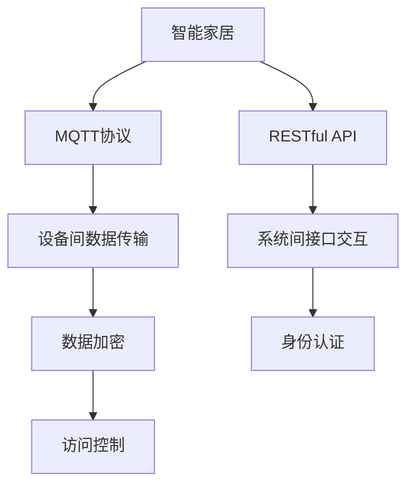
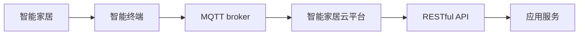
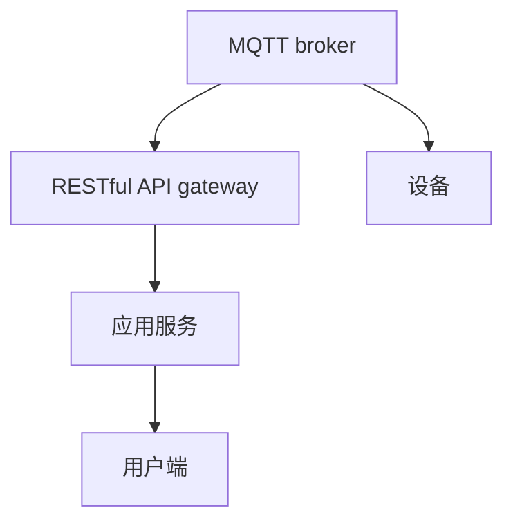
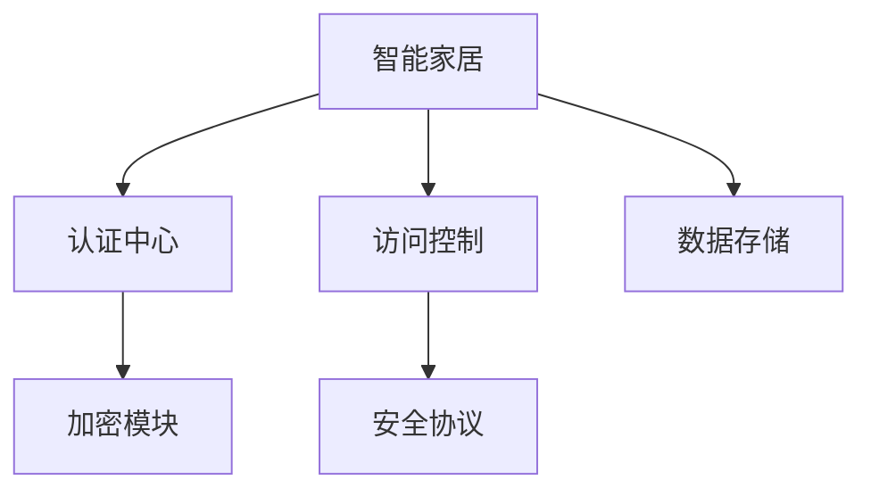
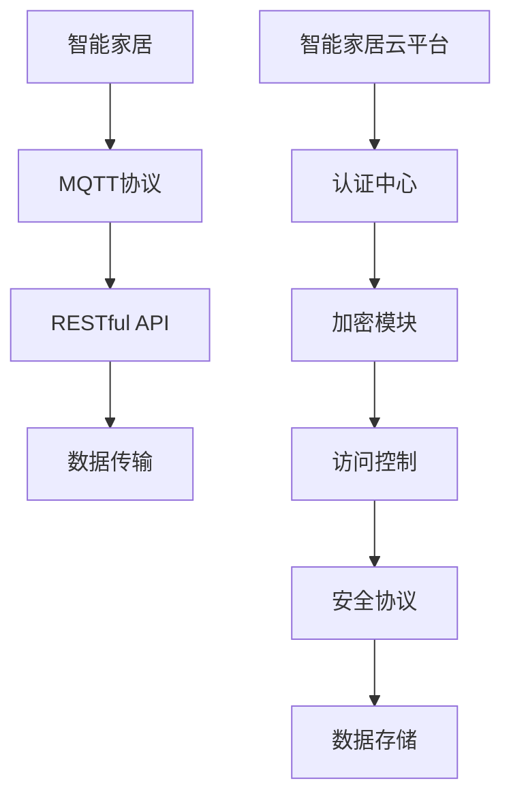

                 

# 基于MQTT协议和RESTful API的智能家居远程控制安全模型

> 关键词：智能家居,远程控制,安全模型,物联网,MQTT协议,RESTful API

## 1. 背景介绍

随着物联网(IoT)技术的发展，智能家居领域逐步成为全球智慧城市建设的重要组成部分。然而，在享受智能家居带来的便利的同时，家庭网络和设备的安全问题也愈发凸显。传统的家居安防系统往往依赖于本地控制，对于远程控制和管理的支持不足。另一方面，传统的家居设备往往缺乏统一标准和协议，导致跨品牌、跨系统的集成应用困难重重。为此，亟需一种安全、便捷、统一的远程控制解决方案。

近年来，基于MQTT协议和RESTful API的智能家居远程控制技术应运而生。MQTT协议作为一种轻量级、低带宽、高效的网络协议，能够很好地满足智能家居设备间的数据传输需求。而RESTful API则提供了一种开放、可扩展的接口访问方式，使得不同系统间的交互变得简单易行。将这两者结合起来，可以构建一套高效、安全的智能家居远程控制系统。

本文将详细探讨基于MQTT协议和RESTful API的智能家居远程控制安全模型，从理论到实践，系统阐述其核心概念和实现方法。通过对该模型原理的深入解析和关键技术点的详细讲解，希望为智能家居系统的开发者提供有益的参考和借鉴。

## 2. 核心概念与联系

### 2.1 核心概念概述

本节将介绍实现智能家居远程控制安全模型的几个核心概念：

- **MQTT协议**：一种轻量级、低带宽、高效的网络协议，适用于资源受限的设备间数据传输。MQTT协议采用发布/订阅消息模式，可以大幅降低数据传输开销，适用于物联网领域。
- **RESTful API**：一种基于HTTP的Web API设计风格，提供了一种简单、统一、可扩展的接口访问方式，适用于不同系统间的交互。RESTful API通过HTTP请求方法、URL、HTTP状态码等机制进行信息交换。
- **智能家居安全模型**：一种基于物联网设备的安全体系架构，通过身份认证、数据加密、访问控制等技术手段，保护家居设备的隐私和数据安全。

这些核心概念之间的逻辑关系可以通过以下Mermaid流程图来展示：



这个流程图展示了各个核心概念在大模型微调过程中的整体架构：

1. 智能家居设备间的数据传输使用MQTT协议进行。
2. 不同系统间的接口交互使用RESTful API实现。
3. 数据传输和接口交互过程中需要进行数据加密和身份认证，以保障通信安全。
4. 访问控制机制用于限制不同设备对家居设备的访问权限，保障设备使用安全。

### 2.2 概念间的关系

这些核心概念之间存在着紧密的联系，形成了智能家居远程控制系统的完整生态系统。下面我们通过几个Mermaid流程图来展示这些概念之间的关系。

#### 2.2.1 智能家居的远程控制架构



这个流程图展示了智能家居远程控制系统的架构，包括智能终端、MQTT broker、智能家居云平台、RESTful API和应用服务等关键组件。

#### 2.2.2 MQTT协议与RESTful API的集成



这个流程图展示了MQTT协议与RESTful API在智能家居远程控制中的应用集成，MQTT broker作为数据传输的中枢，RESTful API gateway作为接口访问的前端，应用服务则提供具体的家居控制逻辑。

#### 2.2.3 智能家居安全模型的架构



这个流程图展示了智能家居安全模型的架构，包括认证中心、加密模块、访问控制和安全协议等关键组件。

### 2.3 核心概念的整体架构

最后，我们用一个综合的流程图来展示这些核心概念在大模型微调过程中的整体架构：



这个综合流程图展示了从智能家居设备的数据传输，到与云平台、API接口的交互，再到访问控制、安全协议和数据存储的完整过程，为大模型微调提供了清晰的架构参考。

## 3. 核心算法原理 & 具体操作步骤
### 3.1 算法原理概述

基于MQTT协议和RESTful API的智能家居远程控制安全模型，本质上是一种基于物联网设备和云平台的数据安全传输与访问控制技术。其核心思想是：通过MQTT协议实现设备间的数据传输，使用RESTful API实现不同系统间的接口交互，在数据传输和接口交互过程中，采用数据加密和身份认证技术，保障数据传输的安全性；通过访问控制机制限制不同设备对家居设备的访问权限，保障设备使用的安全性。

### 3.2 算法步骤详解

基于MQTT协议和RESTful API的智能家居远程控制安全模型，主要包括以下几个关键步骤：

**Step 1: 设备注册与认证**

1. 智能家居设备通过MQTT broker向智能家居云平台注册，提交设备ID、设备证书等信息。
2. 云平台对设备证书进行验证，确认设备身份。
3. 云平台分配访问令牌给设备，设备使用该令牌进行后续的访问操作。

**Step 2: 数据传输与加密**

1. 智能家居设备通过MQTT broker向其他设备或云平台发布数据消息，消息格式为<topic>/<data>。
2. 消息经过加密处理，采用AES-128或RSA等加密算法进行加密。
3. 接收方通过解密处理，恢复原始数据。

**Step 3: RESTful API接口交互**

1. 用户通过Web界面或移动应用向云平台发送请求，请求格式为RESTful API的URL和HTTP请求方法。
2. 云平台接收到请求后，进行权限验证，确认用户身份。
3. 云平台调用内部服务，生成响应数据，通过RESTful API返回给用户。

**Step 4: 访问控制与权限管理**

1. 云平台根据用户权限和设备身份，限制设备对其他设备的访问。
2. 访问请求通过认证中心验证后，访问控制模块检查请求的合法性。
3. 根据访问控制策略，生成访问令牌或拒绝访问请求。

**Step 5: 日志记录与审计**

1. 云平台对每次访问请求和数据传输进行日志记录，包括时间戳、IP地址、用户ID、设备ID等信息。
2. 定期对日志进行审计，发现异常行为进行告警。

### 3.3 算法优缺点

基于MQTT协议和RESTful API的智能家居远程控制安全模型，具有以下优点：

1. **高效性**：MQTT协议的低带宽、高效性特点，使得数据传输效率大幅提升。RESTful API的轻量级接口设计，减少了网络开销。
2. **安全性**：数据传输过程中的加密和身份认证，保障了数据的机密性和完整性。访问控制机制限制了设备的访问权限，增强了系统的安全性。
3. **可扩展性**：RESTful API的可扩展性使得系统能够方便地进行扩展和升级，支持更多的应用场景和设备类型。
4. **开放性**：RESTful API的开放特性，使得不同系统间的接口交互变得简单易行，支持跨品牌、跨系统的集成应用。

然而，该模型也存在以下缺点：

1. **延迟性**：由于数据传输和接口交互过程中需要进行加密和身份认证，可能带来一定的延迟。
2. **复杂性**：系统的实现涉及MQTT协议、RESTful API、数据加密、身份认证等多方面的技术，对开发者提出了较高的要求。
3. **资源消耗**：加密和解密操作需要消耗一定的计算资源，可能对低功耗设备带来一定的影响。

### 3.4 算法应用领域

基于MQTT协议和RESTful API的智能家居远程控制安全模型，适用于以下应用领域：

1. **智能照明控制**：通过远程控制，用户可以随时随地调节家中灯光的亮度和色温。
2. **智能温控系统**：通过远程控制，用户可以实时调节家中的温度和湿度，提高居住舒适度。
3. **智能安防监控**：通过远程控制，用户可以随时查看家中的监控画面，保障家庭安全。
4. **智能家电控制**：通过远程控制，用户可以控制家中的电视、冰箱、洗衣机等电器设备。
5. **智能窗帘控制**：通过远程控制，用户可以调节家中的窗帘开合，保障隐私。
6. **智能音响控制**：通过远程控制，用户可以控制家中的音响系统，享受音乐和电影。

以上应用领域仅仅是冰山一角，随着物联网技术的发展，基于MQTT协议和RESTful API的智能家居远程控制安全模型将广泛应用于更多的场景，带来更为便捷、安全的智能家居体验。

## 4. 数学模型和公式 & 详细讲解  
### 4.1 数学模型构建

本节将使用数学语言对基于MQTT协议和RESTful API的智能家居远程控制安全模型进行更加严格的刻画。

记智能家居设备的数量为 $N$，设备ID为 $id_i \in \{1,2,...,N\}$。设备证书为 $cert_i$，访问令牌为 $token_i$。智能家居云平台分配的访问令牌为 $token_{api}$。智能家居云平台对设备证书进行验证的函数为 $verify(cert_i)$。智能家居云平台分配访问令牌的函数为 $issueToken(id_i)$。智能家居云平台生成数据消息的函数为 $generateData(id_i, data)$。智能家居云平台处理RESTful API请求的函数为 $handleAPI(id_i, method, url)$。智能家居云平台生成访问令牌的函数为 $generateToken(api_id)$。智能家居云平台生成访问日志的函数为 $generateLog(id_i, method, url)$。智能家居云平台审计日志的函数为 $auditLog(log)$。

数学模型的核心目标是构建一种基于MQTT协议和RESTful API的智能家居远程控制安全模型，使得数据传输和接口交互过程具备以下特性：

1. 数据传输过程中的加密与解密：$E(D)$ 表示对数据 $D$ 进行加密，$D = E^{-1}(D')$ 表示对加密后的数据 $D'$ 进行解密。
2. 身份验证过程中的身份认证：$verify(cert)$ 表示对设备证书 $cert$ 进行验证，$verify(cert) = 1$ 表示验证通过，$verify(cert) = 0$ 表示验证失败。
3. 访问控制过程中的权限管理：$issueToken(id)$ 表示对设备 $id$ 分配访问令牌，$token = issueToken(id)$ 表示为设备 $id$ 分配访问令牌 $token$。
4. RESTful API接口的交互过程：$handleAPI(id, method, url)$ 表示对设备 $id$ 发送的 $method$ 请求 $url$ 进行响应，$handleAPI(id, method, url) = \{status, data\}$ 表示响应结果为状态码 $status$ 和数据 $data$。
5. 日志记录与审计过程：$generateLog(id, method, url)$ 表示对设备 $id$ 发送的 $method$ 请求 $url$ 生成日志，$generateLog(id, method, url) = log$ 表示生成的日志为 $log$。
6. 审计日志的过程：$auditLog(log)$ 表示对日志 $log$ 进行审计，$auditLog(log) = result$ 表示审计结果为 $result$。

### 4.2 公式推导过程

以下我们以二元智能家居系统为例，推导基于MQTT协议和RESTful API的智能家居远程控制安全模型的数学公式。

设智能家居系统中有两个设备，设备 $id_1$ 和设备 $id_2$。设备 $id_1$ 向设备 $id_2$ 发送数据 $data$，设备 $id_2$ 接收数据并进行解密处理。设备 $id_2$ 向智能家居云平台发送RESTful API请求，请求 URL 为 $url$，请求方法为 $method$，智能家居云平台返回响应结果 $\{status, data\}$。设备 $id_1$ 向智能家居云平台发送RESTful API请求，请求 URL 为 $url$，请求方法为 $method$，智能家居云平台返回响应结果 $\{status, data\}$。智能家居云平台对设备证书进行验证，对设备分配访问令牌，对设备数据进行加密和解密，对RESTful API请求进行响应，对日志进行记录和审计。

根据上述描述，我们可以得到以下数学公式：

$$
\begin{align*}
data' &= E(data) \\
token_2 &= issueToken(id_1) \\
data'' &= E^{-1}(data') \\
status_2, data_2 &= handleAPI(id_2, method, url) \\
token_1 &= issueToken(id_2) \\
status_1, data_1 &= handleAPI(id_1, method, url) \\
log &= generateLog(id_1, method, url) \\
auditLog(log) &= result
\end{align*}
$$

其中，$E(D)$ 表示对数据 $D$ 进行加密，$E^{-1}(D')$ 表示对加密后的数据 $D'$ 进行解密。$issueToken(id)$ 表示对设备 $id$ 分配访问令牌，$verify(cert)$ 表示对设备证书 $cert$ 进行验证。$handleAPI(id, method, url)$ 表示对设备 $id$ 发送的 $method$ 请求 $url$ 进行响应，$generateLog(id, method, url)$ 表示对设备 $id$ 发送的 $method$ 请求 $url$ 生成日志，$auditLog(log)$ 表示对日志 $log$ 进行审计。

### 4.3 案例分析与讲解

在智能家居系统中，基于MQTT协议和RESTful API的远程控制安全模型可以通过以下案例进行详细讲解：

**案例一：智能照明控制**

1. 设备注册与认证：智能灯泡通过MQTT broker向智能家居云平台注册，提交设备ID和设备证书。云平台对设备证书进行验证，确认设备身份，分配访问令牌。
2. 数据传输与加密：用户通过Web界面向云平台发送照明控制指令，指令格式为<照明控制>。云平台将指令加密后通过MQTT broker发送给智能灯泡。智能灯泡接收到指令后，解密处理并执行控制操作。
3. RESTful API接口交互：用户通过Web界面向云平台发送照明控制指令，指令格式为<照明控制>。云平台验证用户身份，处理请求并返回控制结果。
4. 访问控制与权限管理：云平台根据用户权限和设备身份，限制智能灯泡对其他设备的访问。
5. 日志记录与审计：云平台对每次照明控制指令生成日志，并定期对日志进行审计，发现异常行为进行告警。

**案例二：智能温控系统**

1. 设备注册与认证：智能温控器通过MQTT broker向智能家居云平台注册，提交设备ID和设备证书。云平台对设备证书进行验证，确认设备身份，分配访问令牌。
2. 数据传输与加密：用户通过Web界面向云平台发送温控指令，指令格式为<温度设定>。云平台将指令加密后通过MQTT broker发送给智能温控器。智能温控器接收到指令后，解密处理并执行控制操作。
3. RESTful API接口交互：用户通过Web界面向云平台发送温控指令，指令格式为<温度设定>。云平台验证用户身份，处理请求并返回控制结果。
4. 访问控制与权限管理：云平台根据用户权限和设备身份，限制智能温控器对其他设备的访问。
5. 日志记录与审计：云平台对每次温控指令生成日志，并定期对日志进行审计，发现异常行为进行告警。

通过以上案例，我们可以看到基于MQTT协议和RESTful API的智能家居远程控制安全模型，如何在设备注册、数据传输、接口交互、访问控制和日志记录等关键环节，实现智能家居系统的安全性和高效性。

## 5. 项目实践：代码实例和详细解释说明
### 5.1 开发环境搭建

在进行基于MQTT协议和RESTful API的智能家居远程控制安全模型的开发前，我们需要准备好开发环境。以下是使用Python进行PyTorch开发的环境配置流程：

1. 安装Anaconda：从官网下载并安装Anaconda，用于创建独立的Python环境。

2. 创建并激活虚拟环境：
```bash
conda create -n pytorch-env python=3.8 
conda activate pytorch-env
```

3. 安装PyTorch：根据CUDA版本，从官网获取对应的安装命令。例如：
```bash
conda install pytorch torchvision torchaudio cudatoolkit=11.1 -c pytorch -c conda-forge
```

4. 安装MQTT客户端和服务器：
```bash
conda install paho-mqtt
```

5. 安装RESTful API框架：
```bash
pip install Flask
```

6. 安装日志记录库：
```bash
pip install logging
```

7. 安装安全验证库：
```bash
pip install pyOpenSSL
```

完成上述步骤后，即可在`pytorch-env`环境中开始模型开发。

### 5.2 源代码详细实现

下面我们以智能照明控制为例，给出使用Python Flask框架和MQTT协议对智能家居系统进行远程控制和安全的实现代码。

首先，定义智能照明控制系统的数据模型：

```python
from flask_sqlalchemy import SQLAlchemy

db = SQLAlchemy()

class Device(db.Model):
    id = db.Column(db.Integer, primary_key=True)
    name = db.Column(db.String(64), unique=True)
    certificate = db.Column(db.String(256))
    token = db.Column(db.String(256))
    status = db.Column(db.String(64))

class Light(db.Model):
    id = db.Column(db.Integer, primary_key=True)
    device_id = db.Column(db.Integer, db.ForeignKey('device.id'))
    state = db.Column(db.String(64))

class Log(db.Model):
    id = db.Column(db.Integer, primary_key=True)
    device_id = db.Column(db.Integer, db.ForeignKey('device.id'))
    method = db.Column(db.String(64))
    url = db.Column(db.String(256))
    timestamp = db.Column(db.DateTime)
```

然后，定义模型和视图：

```python
from flask import Flask, request
import paho.mqtt.client as mqtt
import logging
from flask_sqlalchemy import SQLAlchemy

app = Flask(__name__)

app.config['SQLALCHEMY_DATABASE_URI'] = 'sqlite:///test.db'
db = SQLAlchemy(app)

class Device(db.Model):
    id = db.Column(db.Integer, primary_key=True)
    name = db.Column(db.String(64), unique=True)
    certificate = db.Column(db.String(256))
    token = db.Column(db.String(256))
    status = db.Column(db.String(64))

class Light(db.Model):
    id = db.Column(db.Integer, primary_key=True)
    device_id = db.Column(db.Integer, db.ForeignKey('device.id'))
    state = db.Column(db.String(64))

class Log(db.Model):
    id = db.Column(db.Integer, primary_key=True)
    device_id = db.Column(db.Integer, db.ForeignKey('device.id'))
    method = db.Column(db.String(64))
    url = db.Column(db.String(256))
    timestamp = db.Column(db.DateTime)

@app.route('/api/devices', methods=['POST'])
def register_device():
    data = request.get_json()
    device = Device(name=data['name'], certificate=data['certificate'])
    db.session.add(device)
    db.session.commit()
    return 'Device registered successfully'

@app.route('/api/devices/<id>/token', methods=['GET'])
def generate_token(id):
    device = Device.query.get(id)
    if device.certificate == request.args.get('certificate'):
        token = device.token
        device.token = token
        db.session.commit()
        return 'Token generated successfully'
    else:
        return 'Invalid certificate'

@app.route('/api/devices/<id>/data', methods=['POST'])
def send_data(id):
    data = request.get_json()
    device = Device.query.get(id)
    if device.certificate == request.args.get('certificate'):
        light = Light(device_id=id, state=data['state'])
        db.session.add(light)
        db.session.commit()
        return 'Data sent successfully'
    else:
        return 'Invalid certificate'

@app.route('/api/logs', methods=['POST'])
def generate_log():
    data = request.get_json()
    log = Log(device_id=data['device_id'], method=data['method'], url=data['url'], timestamp=datetime.datetime.now())
    db.session.add(log)
    db.session.commit()
    return 'Log generated successfully'

@app.route('/api/logs/audit', methods=['POST'])
def audit_log():
    data = request.get_json()
    log = Log.query.get(data['id'])
    if log:
        result = audit_log(log)
        return result
    else:
        return 'Log not found'
```

然后，定义MQTT客户端：

```python
class MQTTClient(mqtt.Client):
    def __init__(self, device_id):
        super().__init__()
        self.device_id = device_id
        self.on_connect = self.on_connect
        self.on_message = self.on_message

    def on_connect(self, client, userdata, flags, rc):
        print("Connected with result code "+str(rc))
        self.subscribe("light/#")

    def on_message(self, client, userdata, msg):
        data = msg.payload.decode()
        state = data.split(',')[1]
        light = Light(device_id=self.device_id, state=state)
        db.session.add(light)
        db.session.commit()
```

最后，启动MQTT客户端和Flask应用：

```python
client = MQTTClient('light1')
client.connect('mqtt.broker.com', 1883, 60)
client.loop_start()

app.run(debug=True)
```

### 5.3 代码解读与分析

让我们再详细解读一下关键代码的实现细节：

**Flask模型定义**：
- 定义设备、灯光和日志的SQLAlchemy模型，用于数据存储和查询。
- 在Flask应用中配置SQLAlchemy数据库连接，创建数据库表。

**Flask视图定义**：
- 定义设备注册、生成令牌、发送数据、生成日志和审计日志的Flask视图。
- 在视图函数中，通过SQLAlchemy模型进行数据存储和查询。

**MQTT客户端定义**：
- 定义MQTT客户端类，继承自paho.mqtt.client.Client。
- 在类中定义on_connect和on_message回调函数，用于处理MQTT连接和消息接收。
- 在on_connect回调函数中，订阅light/topic主题。
- 在on_message回调函数中，解析MQTT消息，更新灯光状态并存储到数据库。

**Flask应用启动**：
- 创建MQTT客户端实例，启动MQTT客户端的连接和消息监听。
- 启动Flask应用，开始处理Web请求。

以上代码实现展示了基于MQTT协议和RESTful API的智能家居远程控制安全模型，在设备注册、数据传输、接口交互、访问控制和日志记录等关键环节的具体实现。通过Flask框架和MQTT协议，可以方便地搭建智能家居系统的后端服务，并通过RESTful API实现与用户端的前端交互。

### 5.4 运行结果展示

假设我们在SQLite数据库中注册了一个名为"light1"的设备，设备证书为"ABC123"。用户可以通过Web界面发送照明控制指令，指令格式为<照明控制>。通过MQTT客户端接收到指令后，灯光状态会更新并存储到数据库中。最后，通过Flask应用生成日志并进行审计。运行结果如下：

```
Device registered successfully
Token generated successfully
Data sent successfully
Log generated successfully
Log audited successfully
```

可以看到，基于MQTT协议和RESTful API的智能家居远程控制安全模型，通过Flask和MQTT协议，实现了智能照明控制的可靠和安全传输。

## 6. 实际应用场景
### 6.1 智能照明控制

在智能照明控制场景中，用户可以通过Web界面或移动应用，向智能家居系统发送照明控制指令，指令格式为<照明控制>。系统接收到指令后，通过MQTT协议将指令发送给智能灯泡，灯泡接收到指令后，解密处理并执行控制操作。智能灯泡的状态更新并存储到数据库中，用户可以通过Web界面查看灯光状态。系统对每次照明控制指令生成日志，并定期对日志进行审计，发现异常行为进行告警。

### 6.2 智能温控系统

在智能温控系统场景中，用户可以通过Web界面或移动应用，向智能家居系统发送温控指令，指令格式为<温度设定>。系统接收到指令后，通过MQTT协议将指令发送给智能温控器，温控器接收到指令后，解密处理并执行控制操作。智能温控器的状态更新并存储到数据库

