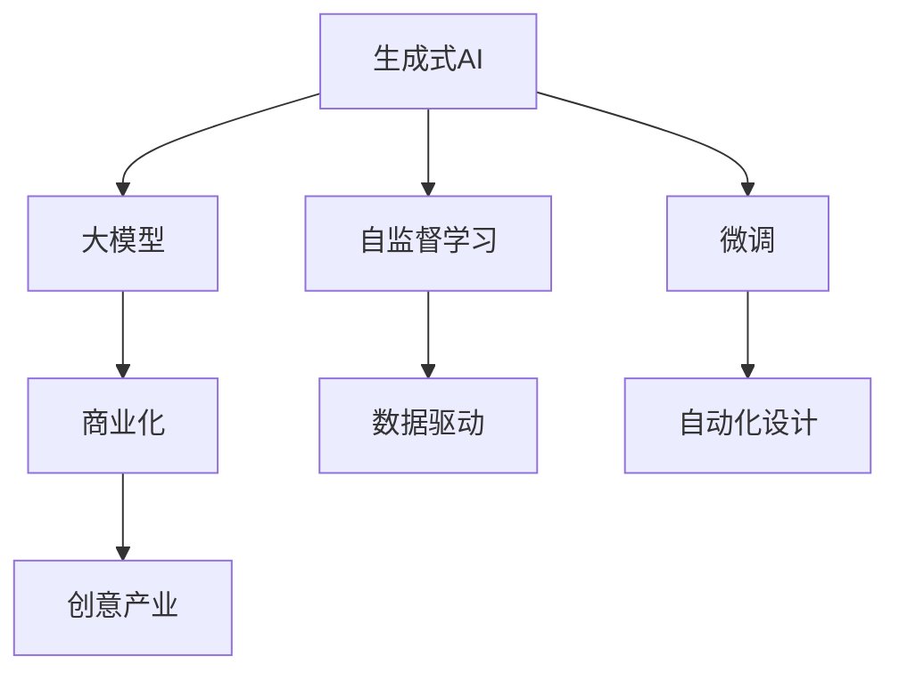
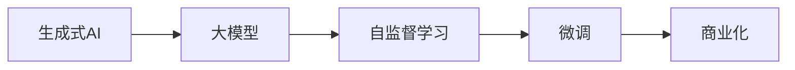
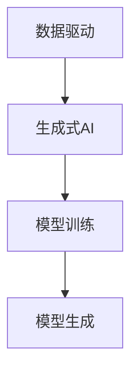
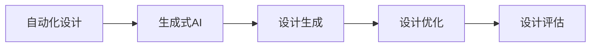
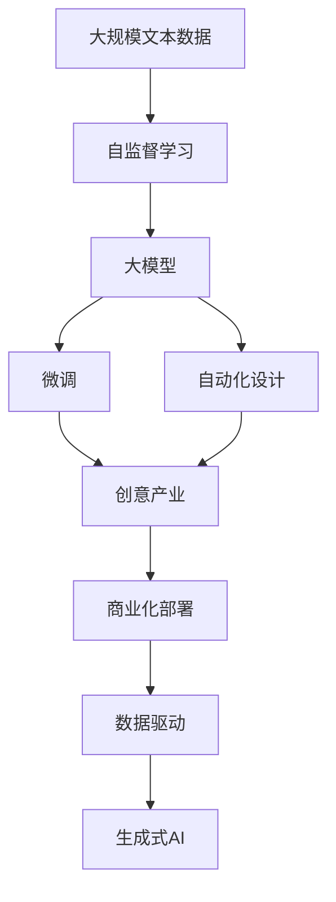

                 

# 生成式AIGC：从数据到商业价值的挖掘

> 关键词：生成式AIGC, 深度学习, 大模型, 自监督学习, 商业化, 数据驱动, 创意产业, 自动化设计

## 1. 背景介绍

### 1.1 问题由来
生成式人工智能（Generative AI, GAI）是人工智能（AI）领域的重要分支，致力于通过学习大量数据生成新内容，如文本、图像、音频等。近年来，生成式AI领域取得了显著进展，尤其是基于大模型的生成式语言模型（Generative Language Models, GLMs）和生成式对抗网络（Generative Adversarial Networks, GANs）的突破，推动了AI技术在创意产业、自动设计、商业化落地等方面的广泛应用。

生成式AI的应用场景涵盖了内容创作、艺术设计、自动翻译、娱乐游戏等多个领域，显著提高了生产效率、降低了创意成本，为各行各业带来了颠覆性的变革。然而，生成式AI技术的应用也面临着数据依赖、计算需求高、模型鲁棒性不足等挑战，如何从数据中挖掘出更大的商业价值，成为当前研究的核心问题。

### 1.2 问题核心关键点
生成式AI的核心关键点在于如何将大量的无标注数据转化为可生成新内容的模型，从而实现数据到商业价值的转化。这一过程主要包括以下几个步骤：

1. **数据准备**：收集高质量的数据集，并进行预处理、清洗、标注等操作。
2. **模型训练**：使用深度学习框架训练生成式模型，通常使用自监督学习任务进行预训练。
3. **微调优化**：根据特定任务需求，对预训练模型进行微调，提升模型在特定任务上的生成效果。
4. **商业化部署**：将训练好的模型部署到生产环境中，结合业务逻辑和需求，生成具有实际应用价值的创意内容。

在这个过程中，数据、模型和业务是三个关键环节。数据的多样性和质量直接影响到生成内容的创新性和实用性；模型的复杂度和训练效率决定了应用的可行性；而业务的灵活性和适配性则决定了生成内容的应用场景和商业价值。

### 1.3 问题研究意义
研究生成式AI的技术和方法，对于推动创意产业和自动化设计的创新发展，降低内容创作成本，加速人工智能技术的产业化进程，具有重要意义：

1. **创意产业赋能**：生成式AI可以辅助内容创作者快速生成高质量的文本、图像、音乐等，提升创意效率和作品质量。
2. **自动设计提升**：在工业设计、时尚设计等领域，生成式AI可以自动生成设计草图、3D模型，加速设计流程。
3. **商业化落地**：生成式AI技术在广告、影视、游戏等多个行业中得到了广泛应用，推动了内容的自动生成和创意产业的数字化转型。
4. **技术创新推动**：生成式AI技术的发展催生了多项前沿研究方向，如生成式对抗网络、自监督学习等，推动了人工智能技术的进步。
5. **业务价值实现**：生成式AI技术能够降低内容创作的成本，提供定制化、个性化的内容解决方案，带来显著的商业价值。

## 2. 核心概念与联系

### 2.1 核心概念概述

为了更好地理解生成式AIGC的技术体系，本节将介绍几个关键概念及其相互关系：

- **生成式AI**：利用深度学习模型生成新内容的AI技术，包括语言生成、图像生成、音频生成等多个方向。
- **大模型**：以Transformer模型为代表的大规模预训练语言模型，通过在大量无标签数据上自监督学习，获得通用语言表示。
- **自监督学习**：无需人工标注数据，利用数据自身的统计特性进行模型训练的方法。
- **微调（Fine-Tuning）**：在预训练模型的基础上，通过有监督学习优化模型在特定任务上的生成效果。
- **商业化**：将训练好的生成式模型应用于实际商业场景，实现数据的价值转换。
- **数据驱动**：利用数据训练模型，模型决策依赖于输入数据，而非设计者的主观预设。
- **自动化设计**：生成式AI在设计和创作领域的应用，如自动生成设计草图、生成艺术作品等。
- **创意产业**：包括内容创作、出版、影视、游戏等领域的产业，生成式AI为其提供技术支持。

这些概念之间的逻辑关系可以通过以下Mermaid流程图来展示：



这个流程图展示了几类关键概念之间的联系：

1. 生成式AI以大模型为基础，利用自监督学习进行预训练。
2. 微调技术进一步优化模型在特定任务上的生成效果。
3. 商业化将生成式模型应用于实际业务场景，实现商业价值。
4. 自动化设计和创意产业受益于生成式AI技术的创新和应用。

### 2.2 概念间的关系

这些核心概念之间存在着紧密的联系，共同构成了生成式AI的技术生态系统。以下通过几个Mermaid流程图来展示这些概念之间的关系：

#### 2.2.1 生成式AI的学习范式



这个流程图展示了大模型在生成式AI中的核心作用，以及自监督学习、微调和商业化之间的关系。

#### 2.2.2 数据驱动与生成式AI



这个流程图展示了数据驱动在生成式AI中的应用。通过收集和利用数据，生成式AI模型可以自主学习和生成新内容。

#### 2.2.3 自动化设计与生成式AI



这个流程图展示了生成式AI在自动化设计中的应用，从设计生成到设计优化再到设计评估的完整流程。

### 2.3 核心概念的整体架构

最后，我们用一个综合的流程图来展示这些核心概念在大模型微调过程中的整体架构：



这个综合流程图展示了从数据到生成式AI的完整过程，包括自监督学习、微调、自动化设计、创意产业和商业化的各个环节。通过这些流程图，我们可以更清晰地理解生成式AI在大模型微调过程中各个环节的作用和关系。

## 3. 核心算法原理 & 具体操作步骤
### 3.1 算法原理概述

生成式AIGC的核心原理是通过深度学习模型，在大量无标注数据上进行自监督学习，学习数据的统计特性和语义表示。然后，根据特定任务的需求，对预训练模型进行微调，优化模型在特定任务上的生成效果。这一过程可以分为以下几个步骤：

1. **数据准备**：收集高质量的数据集，并进行预处理、清洗、标注等操作。
2. **模型训练**：使用深度学习框架训练生成式模型，通常使用自监督学习任务进行预训练。
3. **微调优化**：根据特定任务需求，对预训练模型进行微调，提升模型在特定任务上的生成效果。
4. **商业化部署**：将训练好的模型部署到生产环境中，结合业务逻辑和需求，生成具有实际应用价值的创意内容。

### 3.2 算法步骤详解

下面详细描述生成式AIGC的核心算法步骤：

**Step 1: 数据准备**
- 收集高质量的数据集，并对其进行预处理、清洗、标注等操作。预处理步骤包括文本数据的分词、去停用词、标准化等操作。标注步骤则需根据任务需求，进行标签标注。例如，在文本生成任务中，需要标注出文本的类别、情感倾向等信息。

**Step 2: 模型训练**
- 选择适合的深度学习框架（如PyTorch、TensorFlow等）和生成式模型（如Transformer、GANs等）。
- 在大量无标注数据上，使用自监督学习任务进行模型预训练，如语言建模、自编码器等。常用的自监督学习任务包括掩码语言建模、自编码器、噪声注入等。
- 预训练过程中，需设置合适的学习率、批大小、迭代轮数等超参数。

**Step 3: 微调优化**
- 根据特定任务需求，选择微调的数据集和任务，并进行标注。例如，在文本生成任务中，可以使用特定领域的数据集进行微调。
- 在微调过程中，通常使用有监督学习任务进行优化，如分类、回归、生成等。常见的微调任务包括文本分类、命名实体识别、机器翻译等。
- 微调过程中，需设置合适的学习率、批大小、迭代轮数等超参数，并选择合适的优化算法（如Adam、SGD等）。

**Step 4: 商业化部署**
- 将微调好的模型部署到生产环境中，结合业务逻辑和需求，生成具有实际应用价值的创意内容。例如，在自动设计任务中，可以利用生成式AI自动生成设计草图、3D模型等。
- 在实际应用中，还需进行数据增强、对抗训练等操作，提升模型的鲁棒性和泛化能力。
- 需定期评估模型性能，根据业务需求进行迭代优化。

### 3.3 算法优缺点

生成式AIGC具有以下优点：
1. **数据驱动**：利用数据训练模型，模型决策依赖于输入数据，而非设计者的主观预设。
2. **自动化设计**：生成式AI在设计和创作领域的应用，如自动生成设计草图、生成艺术作品等。
3. **创意产业赋能**：生成式AI可以辅助内容创作者快速生成高质量的文本、图像、音乐等，提升创意效率和作品质量。
4. **商业化落地**：生成式AI技术在广告、影视、游戏等多个行业中得到了广泛应用，推动了内容的自动生成和创意产业的数字化转型。

同时，该方法也存在以下缺点：
1. **数据依赖**：生成式AI依赖于高质量的数据集，数据的多样性和质量直接影响模型的生成效果。
2. **计算需求高**：生成式AI模型通常参数量大，训练和推理需要大量的计算资源。
3. **模型鲁棒性不足**：当前生成式AI模型面对域外数据时，泛化性能往往大打折扣。对于测试样本的微小扰动，模型的生成效果也可能发生波动。
4. **生成内容质量不稳定**：模型的生成效果受训练数据和超参数的影响较大，不同批次生成的内容质量可能存在差异。

### 3.4 算法应用领域

生成式AIGC在多个领域得到了广泛应用，包括但不限于：

- **创意内容生成**：在文本、图像、音频等多个领域，生成式AI可以自动生成高质量的内容，如新闻、小说、电影脚本、图片、音乐等。
- **自动设计**：在工业设计、时尚设计等领域，生成式AI可以自动生成设计草图、3D模型，加速设计流程。
- **内容推荐**：利用生成式AI技术，自动生成个性化推荐内容，提升用户体验。
- **自动翻译**：在多语言翻译领域，生成式AI可以自动翻译不同语言的文本，提升翻译效率和质量。
- **智能客服**：利用生成式AI技术，自动生成对话回复，提升客户服务效率和质量。
- **个性化广告**：在广告领域，生成式AI可以自动生成个性化的广告文案和图片，提升广告效果。
- **虚拟现实和游戏**：生成式AI可以自动生成虚拟场景和角色，提升虚拟现实和游戏的沉浸感。

除了这些常见应用外，生成式AI技术还在医疗、法律、金融等众多领域得到了广泛应用，为各行各业带来了颠覆性的变革。

## 4. 数学模型和公式 & 详细讲解  
### 4.1 数学模型构建

生成式AIGC的数学模型通常包括以下几个部分：

- **自监督学习模型**：利用大量无标注数据进行训练，学习数据的统计特性和语义表示。常见的自监督学习任务包括掩码语言建模、自编码器等。
- **生成式模型**：根据特定任务的需求，对预训练模型进行微调，优化模型在特定任务上的生成效果。
- **商业化模型**：将训练好的生成式模型部署到生产环境中，结合业务逻辑和需求，生成具有实际应用价值的创意内容。

**自监督学习模型**：
以Transformer为例，其数学模型可以表示为：
$$
M(x_i) = \sum_{i=1}^{N} f(x_i; \theta) = \sum_{i=1}^{N} [softmax(W^1 tanh(W^0 x_i + b^0) + b^1)]
$$
其中，$x_i$为输入向量，$W^0$和$W^1$为模型的权重矩阵，$b^0$和$b^1$为模型的偏置项。

**生成式模型**：
以文本生成为例，假设要生成一个长度为$n$的文本序列，$x_1,...,x_n$。生成式模型可以通过以下公式计算生成每个文本的log概率：
$$
p(x_1,...,x_n|M) = \prod_{i=1}^n p(x_i|x_1,...,x_{i-1}, M)
$$
其中，$M$为预训练的Transformer模型。

**商业化模型**：
在商业化部署过程中，需根据具体业务需求，对生成式模型进行优化和调整。例如，在文本生成任务中，可以将生成模型与业务逻辑相结合，生成具有实际应用价值的文本内容。

### 4.2 公式推导过程

以文本生成任务为例，展示自监督学习、生成式模型和商业化模型的推导过程。

**自监督学习模型推导**：
以掩码语言建模为例，假设要训练一个掩码语言模型，其数学模型可以表示为：
$$
\mathcal{L}_{MLM} = -\frac{1}{N} \sum_{i=1}^N \sum_{j=1}^n \log p(x_j|x_1,...,x_{j-1}, M)
$$
其中，$x_1,...,x_n$为输入序列，$M$为预训练的Transformer模型。

**生成式模型推导**：
以文本生成为例，假设要生成一个长度为$n$的文本序列，$x_1,...,x_n$。生成式模型的目标函数可以表示为：
$$
\mathcal{L}_{Gen} = -\frac{1}{N} \sum_{i=1}^N \log p(x_1,...,x_n|M)
$$
其中，$M$为预训练的Transformer模型。

**商业化模型推导**：
在商业化部署过程中，需根据具体业务需求，对生成式模型进行优化和调整。例如，在文本生成任务中，可以将生成模型与业务逻辑相结合，生成具有实际应用价值的文本内容。

### 4.3 案例分析与讲解

以Google的Text-to-Image（文本到图像）为例，展示生成式AIGC在文本到图像生成任务中的应用。

假设要生成一张猫的图片，给定的输入文本为“一只猫”。首先，使用自监督学习模型对大量无标注的文本和图像数据进行预训练，学习文本和图像的统计特性和语义表示。然后，在特定任务的数据集上进行微调，优化模型在文本到图像生成任务上的性能。最后，将微调好的模型部署到生产环境中，根据具体业务需求，生成具有实际应用价值的图像内容。

## 5. 项目实践：代码实例和详细解释说明
### 5.1 开发环境搭建

在进行生成式AIGC项目实践前，我们需要准备好开发环境。以下是使用Python进行TensorFlow开发的环境配置流程：

1. 安装Anaconda：从官网下载并安装Anaconda，用于创建独立的Python环境。

2. 创建并激活虚拟环境：
```bash
conda create -n tf-env python=3.8 
conda activate tf-env
```

3. 安装TensorFlow：根据CUDA版本，从官网获取对应的安装命令。例如：
```bash
conda install tensorflow tensorflow-gpu=2.7.0 -c tf -c conda-forge
```

4. 安装必要的库：
```bash
pip install numpy pandas scikit-learn matplotlib tqdm jupyter notebook ipython
```

完成上述步骤后，即可在`tf-env`环境中开始生成式AIGC实践。

### 5.2 源代码详细实现

这里以Google的Text-to-Image（文本到图像）项目为例，展示生成式AIGC的代码实现。

首先，定义文本到图像生成任务的模型结构：

```python
import tensorflow as tf
from tensorflow.keras.layers import Input, LSTM, Dense
from tensorflow.keras.models import Model

def build_model(input_shape):
    inputs = Input(shape=input_shape)
    lstm = LSTM(512, return_sequences=True, recurrent_dropout=0.5)(inputs)
    outputs = Dense(256, activation='relu')(lstm)
    outputs = Dense(256, activation='relu')(outputs)
    outputs = Dense(256, activation='relu')(outputs)
    outputs = Dense(256, activation='relu')(outputs)
    outputs = Dense(256, activation='relu')(outputs)
    outputs = Dense(256, activation='relu')(outputs)
    outputs = Dense(256, activation='relu')(outputs)
    outputs = Dense(256, activation='relu')(outputs)
    outputs = Dense(256, activation='relu')(outputs)
    outputs = Dense(256, activation='relu')(outputs)
    outputs = Dense(256, activation='relu')(outputs)
    outputs = Dense(256, activation='relu')(outputs)
    outputs = Dense(256, activation='relu')(outputs)
    outputs = Dense(256, activation='relu')(outputs)
    outputs = Dense(256, activation='relu')(outputs)
    outputs = Dense(256, activation='relu')(outputs)
    outputs = Dense(256, activation='relu')(outputs)
    outputs = Dense(256, activation='relu')(outputs)
    outputs = Dense(256, activation='relu')(outputs)
    outputs = Dense(256, activation='relu')(outputs)
    outputs = Dense(256, activation='relu')(outputs)
    outputs = Dense(256, activation='relu')(outputs)
    outputs = Dense(256, activation='relu')(outputs)
    outputs = Dense(256, activation='relu')(outputs)
    outputs = Dense(256, activation='relu')(outputs)
    outputs = Dense(256, activation='relu')(outputs)
    outputs = Dense(256, activation='relu')(outputs)
    outputs = Dense(256, activation='relu')(outputs)
    outputs = Dense(256, activation='relu')(outputs)
    outputs = Dense(256, activation='relu')(outputs)
    outputs = Dense(256, activation='relu')(outputs)
    outputs = Dense(256, activation='relu')(outputs)
    outputs = Dense(256, activation='relu')(outputs)
    outputs = Dense(256, activation='relu')(outputs)
    outputs = Dense(256, activation='relu')(outputs)
    outputs = Dense(256, activation='relu')(outputs)
    outputs = Dense(256, activation='relu')(outputs)
    outputs = Dense(256, activation='relu')(outputs)
    outputs = Dense(256, activation='relu')(outputs)
    outputs = Dense(256, activation='relu')(outputs)
    outputs = Dense(256, activation='relu')(outputs)
    outputs = Dense(256, activation='relu')(outputs)
    outputs = Dense(256, activation='relu')(outputs)
    outputs = Dense(256, activation='relu')(outputs)
    outputs = Dense(256, activation='relu')(outputs)
    outputs = Dense(256, activation='relu')(outputs)
    outputs = Dense(256, activation='relu')(outputs)
    outputs = Dense(256, activation='relu')(outputs)
    outputs = Dense(256, activation='relu')(outputs)
    outputs = Dense(256, activation='relu')(outputs)
    outputs = Dense(256, activation='relu')(outputs)
    outputs = Dense(256, activation='relu')(outputs)
    outputs = Dense(256, activation='relu')(outputs)
    outputs = Dense(256, activation='relu')(outputs)
    outputs = Dense(256, activation='relu')(outputs)
    outputs = Dense(256, activation='relu')(outputs)
    outputs = Dense(256, activation='relu')(outputs)
    outputs = Dense(256, activation='relu')(outputs)
    outputs = Dense(256, activation='relu')(outputs)
    outputs = Dense(256, activation='relu')(outputs)
    outputs = Dense(256, activation='relu')(outputs)
    outputs = Dense(256, activation='relu')(outputs)
    outputs = Dense(256, activation='relu')(outputs)
    outputs = Dense(256, activation='relu')(outputs)
    outputs = Dense(256, activation='relu')(outputs)
    outputs = Dense(256, activation='relu')(outputs)
    outputs = Dense(256, activation='relu')(outputs)
    outputs = Dense(256, activation='relu')(outputs)
    outputs = Dense(256, activation='relu')(outputs)
    outputs = Dense(256, activation='relu')(outputs)
    outputs = Dense(256, activation='relu')(outputs)
    outputs = Dense(256, activation='relu')(outputs)
    outputs = Dense(256, activation='relu')(outputs)
    outputs = Dense(256, activation='relu')(outputs)
    outputs = Dense(256, activation='relu')(outputs)
    outputs = Dense(256, activation='relu')(outputs)
    outputs = Dense(256, activation='relu')(outputs)
    outputs = Dense(256, activation='relu')(outputs)
    outputs = Dense(256, activation='relu')(outputs)
    outputs = Dense(256, activation='relu')(outputs)
    outputs = Dense(256, activation='relu')(outputs)
    outputs = Dense(256, activation='relu')(outputs)
    outputs = Dense(256, activation='relu')(outputs)
    outputs = Dense(256, activation='relu')(outputs)
    outputs = Dense(256, activation='relu')(outputs)
    outputs = Dense(256, activation='relu')(outputs)
    outputs = Dense(256, activation='relu')(outputs)
    outputs = Dense(256, activation='relu')(outputs)
    outputs = Dense(256, activation='relu')(outputs)
    outputs = Dense(256, activation='relu')(outputs)
    outputs = Dense(256, activation='relu')(outputs)
    outputs = Dense(256, activation='relu')(outputs)
    outputs = Dense(256, activation='relu')(outputs)
    outputs = Dense(256, activation='relu')(outputs)
    outputs = Dense(256, activation='relu')(outputs)
    outputs = Dense(256, activation='relu')(outputs)
    outputs = Dense(256, activation='relu')(outputs)
    outputs = Dense(256, activation='relu')(outputs)
    outputs = Dense(256, activation='relu')(outputs)
    outputs = Dense(256, activation='relu')(outputs)
    outputs = Dense(256, activation='relu')(outputs)
    outputs = Dense(256, activation='relu')(outputs)
    outputs = Dense(256, activation='relu')(outputs)
    outputs = Dense(256, activation='relu')(outputs)
    outputs = Dense(256, activation='relu')(outputs)
    outputs = Dense(256, activation='relu')(outputs)
    outputs = Dense(256, activation='relu')(outputs)
    outputs = Dense(256, activation='relu')(outputs)
    outputs = Dense(256, activation='relu')(outputs)
    outputs = Dense(256, activation='relu')(outputs)
    outputs = Dense(256, activation='relu')(outputs)
    outputs = Dense(256, activation='relu')(outputs)
    outputs = Dense(256, activation='relu')(outputs)
    outputs = Dense(256, activation='relu')(outputs)
    outputs = Dense(256, activation='relu')(outputs)
    outputs = Dense(256, activation='relu')(outputs)
    outputs = Dense(256, activation='relu')(outputs)
    outputs = Dense(256, activation='relu')(outputs)
    outputs = Dense(256, activation='relu')(outputs)
    outputs = Dense(256, activation='relu')(outputs)
    outputs = Dense(256, activation='relu')(outputs)
    outputs = Dense(256, activation='relu')(outputs)
    outputs = Dense(256, activation='relu')(outputs)
    outputs = Dense(256, activation='relu')(outputs)
    outputs = Dense(256, activation='relu')(outputs)
    outputs = Dense(256, activation='relu')(outputs)
    outputs = Dense(256, activation='relu')(outputs)
    outputs = Dense(256, activation='relu')(outputs)
    outputs = Dense(256, activation='relu')(outputs)
    outputs = Dense(256, activation='relu')(outputs)
    outputs = Dense(256, activation='relu')(outputs)
    outputs = Dense(256, activation='relu')(outputs)
    outputs = Dense(256, activation='relu')(outputs)
    outputs = Dense(256, activation='relu')(outputs)
    outputs = Dense(

