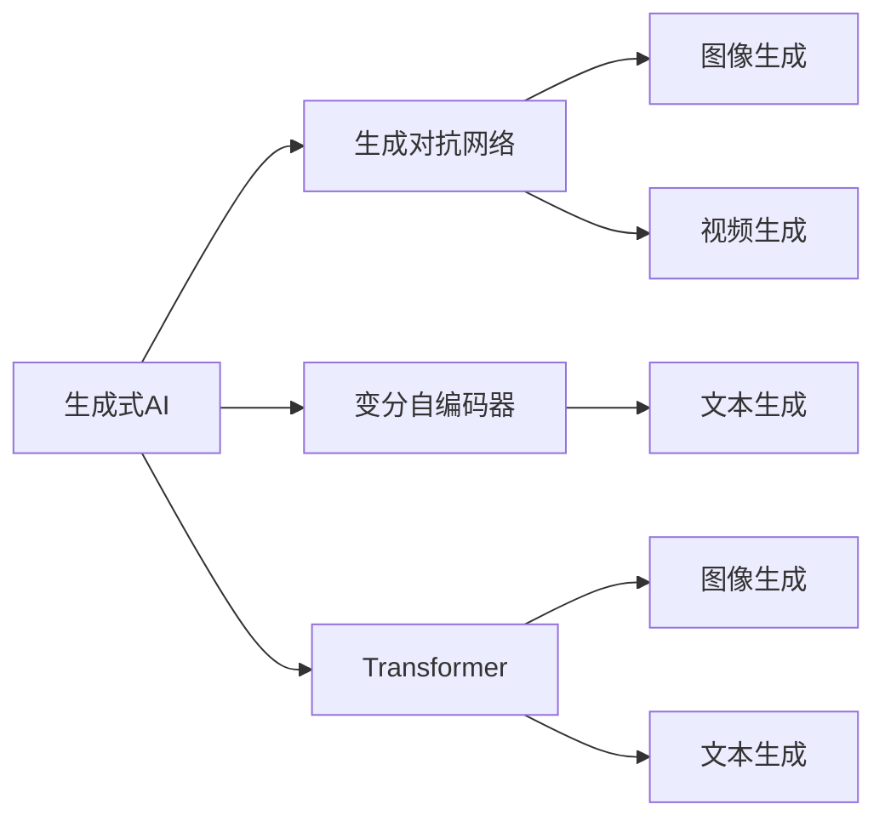
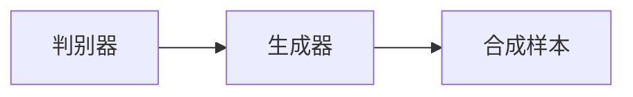
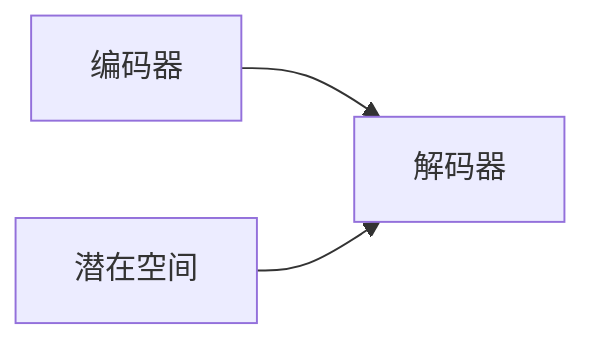
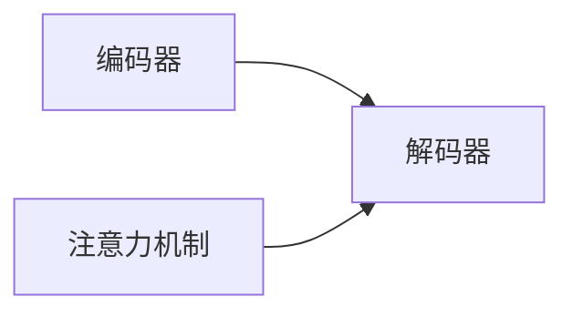

                 

# 生成式AI：机遇与风险并存，如何理性看待？

> 关键词：生成式AI, 自动生成, 模型应用, 创新与挑战, 伦理与风险

## 1. 背景介绍

随着人工智能技术的飞速发展，生成式人工智能（Generative AI）正逐渐成为AI领域的新热点。生成式AI是指利用深度学习模型从数据中学习生成新的样本，不仅包括图像、音频、视频等模态数据，还包括文本、代码等结构化数据。它通过模拟人类的创造性思维，生成符合自然规律、具有高度逼真性和多样性的内容。

### 1.1 问题由来

生成式AI的兴起，得益于深度学习、神经网络和自监督学习等技术的不断进步。其中，生成对抗网络（GAN）、变分自编码器（VAE）、Transformer等模型在生成式任务上表现出色。这些模型通过学习数据分布，生成新的样本，从而极大地拓展了人工智能的应用范围，尤其在图像、音频、文本等模态的自动生成上，取得了显著进展。

### 1.2 问题核心关键点

生成式AI的核心在于如何构建具有高度逼真性和多样性的生成模型，以及如何从大量数据中学习生成策略。其关键点包括：

- 生成模型选择：如GAN、VAE、Transformer等，不同模型适用于不同的生成任务。
- 数据质量与多样性：高质量、多样化的数据集对生成模型的学习至关重要。
- 生成策略设计：如何设计生成策略，控制生成的多样性和逼真性，是生成式AI研究的重要方向。
- 生成样本评估：如何量化生成样本的质量，评估生成模型的性能，是评估生成效果的关键。

## 2. 核心概念与联系

### 2.1 核心概念概述

为更好地理解生成式AI，本节将介绍几个核心概念：

- 生成式人工智能（Generative AI）：利用深度学习模型生成新样本的AI技术，包括图像生成、文本生成、音频生成等。
- 生成对抗网络（GAN）：由生成器（Generator）和判别器（Discriminator）两部分组成，通过对抗训练，生成高质量的新样本。
- 变分自编码器（VAE）：通过学习数据分布，生成新样本，同时保留原有数据的信息。
- Transformer模型：由自注意力机制和残差连接构成，在文本生成、图像生成等任务上表现优异。

这些核心概念之间的联系可以通过以下Mermaid流程图来展示：



这个流程图展示了大语言模型微调过程中各个核心概念的关系和作用：

1. 生成式AI通过GAN、VAE、Transformer等模型，生成高质量的新样本。
2. GAN通过对抗训练生成逼真图像、视频等。
3. VAE通过学习数据分布生成多样性文本、图像等。
4. Transformer在文本生成、图像生成等任务上表现优异。

### 2.2 概念间的关系

这些核心概念之间存在着紧密的联系，形成了生成式AI的技术框架。下面我们通过几个Mermaid流程图来展示这些概念之间的关系。

#### 2.2.1 生成对抗网络的结构



这个流程图展示了GAN的基本结构，即判别器与生成器的对抗训练。

#### 2.2.2 变分自编码器的结构



这个流程图展示了VAE的基本结构，即通过编码器将数据映射到潜在空间，再通过解码器生成新样本。

#### 2.2.3 Transformer的结构



这个流程图展示了Transformer的基本结构，即通过自注意力机制，实现序列到序列的转换。

## 3. 核心算法原理 & 具体操作步骤
### 3.1 算法原理概述

生成式AI的核心原理是利用深度学习模型学习数据分布，并在此基础上生成新的样本。其基本步骤包括：

1. 数据预处理：对原始数据进行标准化、归一化等处理。
2. 模型训练：利用生成模型在数据集上进行训练，学习生成策略。
3. 生成样本：使用训练好的生成模型生成新样本。
4. 样本评估：评估生成样本的质量，调整模型参数以提高生成效果。

生成式AI的算法框架主要包括以下几种：

- 生成对抗网络（GAN）：通过生成器和判别器的对抗训练，生成高质量的新样本。
- 变分自编码器（VAE）：学习数据分布，生成多样性的新样本。
- Transformer模型：通过自注意力机制，实现序列到序列的生成任务。

### 3.2 算法步骤详解

以下是生成对抗网络（GAN）的基本算法步骤：

**Step 1: 数据预处理**

- 将原始数据标准化、归一化，以便模型学习。

**Step 2: 构建生成器和判别器**

- 生成器（Generator）：网络结构可以是CNN、RNN、LSTM等，用于生成新样本。
- 判别器（Discriminator）：网络结构与生成器类似，用于区分真实样本和生成样本。

**Step 3: 训练生成器和判别器**

- 使用GAN损失函数（如Wasserstein距离、交叉熵等），交替训练生成器和判别器。
- 生成器试图生成尽可能逼真的样本，而判别器则尽可能区分真实和生成样本。

**Step 4: 生成样本**

- 在训练好的生成器上，输入随机噪声生成新样本。

**Step 5: 样本评估**

- 使用Inception Score、FID等指标评估生成样本的质量。

以下是变分自编码器（VAE）的基本算法步骤：

**Step 1: 数据预处理**

- 将原始数据标准化、归一化，以便模型学习。

**Step 2: 构建编码器和解码器**

- 编码器（Encoder）：网络结构可以是CNN、RNN等，用于将数据映射到潜在空间。
- 解码器（Decoder）：网络结构与编码器类似，用于从潜在空间生成新样本。

**Step 3: 训练编码器和解码器**

- 使用变分损失函数，联合训练编码器和解码器。

**Step 4: 生成样本**

- 在训练好的解码器上，使用潜在空间的随机采样生成新样本。

**Step 5: 样本评估**

- 使用KL散度、重构误差等指标评估生成样本的质量。

### 3.3 算法优缺点

生成对抗网络（GAN）的优点：
1. 生成样本质量高：生成器可以生成高质量、逼真的图像、音频等样本。
2. 适用于多种生成任务：GAN不仅适用于图像生成，还适用于视频生成、音乐生成等任务。
3. 易于模型调整：通过改变生成器和判别器的结构，可以适应不同的生成任务。

生成对抗网络的缺点：
1. 训练不稳定：GAN训练过程不稳定，容易陷入局部最优。
2. 生成样本质量不一：生成样本质量受模型结构和训练数据影响较大。
3. 模型复杂度高：GAN模型结构复杂，需要大量计算资源。

变分自编码器（VAE）的优点：
1. 生成多样性：VAE能够生成多样性的新样本，适用于文本生成、图像生成等任务。
2. 生成质量好：VAE生成的样本质量较高，能够保留原有数据的分布特性。
3. 模型简洁：VAE模型结构简单，训练速度快。

变分自编码器（VAE）的缺点：
1. 生成样本质量一般：VAE生成的样本质量不及GAN，但仍然需要高质数据的支持。
2. 模型结构复杂：VAE模型结构复杂，需要大量计算资源。

Transformer模型的优点：
1. 生成多样性：Transformer适用于文本生成、图像生成等任务，能够生成多样性的新样本。
2. 生成质量高：Transformer生成的样本质量高，具有高度的逼真性和多样性。
3. 模型高效：Transformer模型结构简单，训练速度快。

Transformer模型的缺点：
1. 生成样本质量受模型结构影响较大：Transformer生成样本质量受模型参数、训练数据等因素影响较大。
2. 需要大量计算资源：Transformer模型结构复杂，需要大量计算资源。

### 3.4 算法应用领域

生成式AI技术已经被广泛应用于多个领域，以下是一些典型应用：

- 图像生成：生成逼真的图像、动画等，用于艺术创作、广告设计等。
- 文本生成：生成高质量的文章、对话、代码等，用于内容创作、客服聊天等。
- 视频生成：生成逼真的视频内容，用于影视制作、游戏设计等。
- 音频生成：生成高质量的音频内容，用于音乐创作、语音合成等。
- 自然语言处理：生成自然流畅的语言，用于对话系统、机器翻译等。

## 4. 数学模型和公式 & 详细讲解  
### 4.1 数学模型构建

以下是生成式AI中常见的数学模型及其构建方法：

- 生成对抗网络（GAN）：
  - 生成器（Generator）：将随机噪声映射为样本，记为 $G(z)$，其中 $z$ 为噪声向量。
  - 判别器（Discriminator）：将样本分类为真实和生成两类，记为 $D(x)$。
  - 联合训练目标函数：
    $$
    \min_{G} \max_{D} V(D,G) = \mathbb{E}_{x \sim p_{data}}[\log D(x)] + \mathbb{E}_{z \sim p(z)}[\log (1-D(G(z)))]
    $$

- 变分自编码器（VAE）：
  - 编码器（Encoder）：将数据 $x$ 映射到潜在空间 $z$，记为 $E(x)$。
  - 解码器（Decoder）：从潜在空间 $z$ 生成新样本 $x'$，记为 $D(z)$。
  - 联合训练目标函数：
    $$
    \min_{E, D} \mathbb{E}_{x \sim p_{data}} [\log p_{data}(x)] + \mathbb{E}_{z \sim E(x)} [\log p(z) | x] + \mathbb{E}_{z \sim p(z)} [\log p_{data}(x' | z)]
    $$
  其中 $p_{data}(x)$ 为数据分布，$p(z)$ 为潜在空间分布，$p_{data}(x' | z)$ 为生成分布。

- Transformer模型：
  - 自注意力机制：
    $$
    \text{Attention}(Q, K, V) = \text{softmax}(\frac{QK^T}{\sqrt{d_k}})V
    $$
  其中 $Q$ 为查询向量，$K$ 为键向量，$V$ 为值向量，$d_k$ 为键向量的维度。

### 4.2 公式推导过程

以下是生成对抗网络（GAN）中生成器和判别器损失函数的推导：

**生成器损失函数**：
$$
L_G = -\mathbb{E}_{z \sim p(z)}[\log D(G(z))]
$$

**判别器损失函数**：
$$
L_D = \mathbb{E}_{x \sim p_{data}}[\log D(x)] + \mathbb{E}_{z \sim p(z)}[\log (1-D(G(z)))
$$

其中 $p(z)$ 为噪声向量 $z$ 的概率分布，$p_{data}(x)$ 为真实数据 $x$ 的概率分布。

以下是变分自编码器（VAE）中编码器和解码器损失函数的推导：

**编码器损失函数**：
$$
L_E = -\mathbb{E}_{x \sim p_{data}}[\log p_{data}(x)]
$$

**解码器损失函数**：
$$
L_D = -\mathbb{E}_{z \sim E(x)}[\log p(z) | x] + \mathbb{E}_{z \sim p(z)}[\log p_{data}(x' | z)]
$$

其中 $p(z)$ 为潜在空间分布，$p(z | x)$ 为潜在空间条件分布，$p_{data}(x' | z)$ 为生成分布。

### 4.3 案例分析与讲解

以GAN生成手写数字为例，展示GAN的基本应用。

**数据预处理**：
- 收集手写数字数据集MNIST，进行标准化、归一化等处理。

**生成器和判别器构建**：
- 使用CNN网络作为生成器，生成手写数字图片。
- 使用CNN网络作为判别器，判断图片是否为真实手写数字。

**训练生成器和判别器**：
- 使用GAN损失函数，交替训练生成器和判别器。

**生成样本**：
- 在训练好的生成器上，输入随机噪声生成新手写数字图片。

**样本评估**：
- 使用Inception Score、FID等指标评估生成样本的质量。

## 5. 项目实践：代码实例和详细解释说明
### 5.1 开发环境搭建

在进行生成式AI项目实践前，我们需要准备好开发环境。以下是使用Python进行TensorFlow开发的环境配置流程：

1. 安装Anaconda：从官网下载并安装Anaconda，用于创建独立的Python环境。

2. 创建并激活虚拟环境：
```bash
conda create -n tf-env python=3.8 
conda activate tf-env
```

3. 安装TensorFlow：根据CUDA版本，从官网获取对应的安装命令。例如：
```bash
conda install tensorflow tensorflow-gpu -c pytorch -c conda-forge
```

4. 安装各类工具包：
```bash
pip install numpy pandas scikit-learn matplotlib tqdm jupyter notebook ipython
```

完成上述步骤后，即可在`tf-env`环境中开始生成式AI项目实践。

### 5.2 源代码详细实现

下面我们以生成手写数字图片为例，给出使用TensorFlow进行GAN训练的代码实现。

首先，定义GAN的生成器和判别器：

```python
import tensorflow as tf

class Generator(tf.keras.Model):
    def __init__(self, latent_dim):
        super(Generator, self).__init__()
        self.dense = tf.keras.layers.Dense(256, input_dim=latent_dim)
        self.leakyrelu = tf.keras.layers.LeakyReLU(alpha=0.2)
        self.dense1 = tf.keras.layers.Dense(256)
        self.dense2 = tf.keras.layers.Dense(28*28, activation='tanh')
    
    def call(self, inputs):
        x = self.dense(inputs)
        x = self.leakyrelu(x)
        x = self.dense1(x)
        x = self.leakyrelu(x)
        x = self.dense2(x)
        return x.reshape([-1, 28, 28, 1])

class Discriminator(tf.keras.Model):
    def __init__(self):
        super(Discriminator, self).__init__()
        self.conv1 = tf.keras.layers.Conv2D(64, (3,3), strides=(2,2), padding='same', activation='relu')
        self.conv2 = tf.keras.layers.Conv2D(128, (3,3), strides=(2,2), padding='same', activation='relu')
        self.flatten = tf.keras.layers.Flatten()
        self.dense1 = tf.keras.layers.Dense(1024, activation='relu')
        self.dense2 = tf.keras.layers.Dense(1, activation='sigmoid')
    
    def call(self, inputs):
        x = self.conv1(inputs)
        x = self.conv2(x)
        x = self.flatten(x)
        x = self.dense1(x)
        return self.dense2(x)
```

然后，定义GAN的损失函数和优化器：

```python
def compute_loss(fake_images, real_images):
    gen_loss = cross_entropy(tf.ones_like(fake_images), discriminator(fake_images))
    disc_loss = tf.reduce_mean(tf.concat([cross_entropy(tf.zeros_like(real_images), discriminator(real_images)), cross_entropy(tf.ones_like(fake_images), discriminator(fake_images))], axis=0))
    return gen_loss + disc_loss

def cross_entropy(y_true, y_pred):
    return tf.reduce_mean(tf.nn.sigmoid_cross_entropy_with_logits(labels=y_true, logits=y_pred))

generator_optimizer = tf.keras.optimizers.Adam(1e-4)
discriminator_optimizer = tf.keras.optimizers.Adam(1e-4)
```

接着，定义训练函数：

```python
def train_gan(generator, discriminator, dataset, epochs=200, batch_size=64):
    for epoch in range(epochs):
        for batch in dataset:
            real_images = batch[0].reshape([-1, 28, 28, 1])
            noise = tf.random.normal([batch_size, latent_dim])
            with tf.GradientTape() as gen_tape, tf.GradientTape() as disc_tape:
                fake_images = generator(noise)
                gen_loss = compute_loss(fake_images, real_images)
                disc_real_loss = cross_entropy(tf.ones_like(real_images), discriminator(real_images))
                disc_fake_loss = cross_entropy(tf.zeros_like(fake_images), discriminator(fake_images))
                disc_loss = tf.reduce_mean(disc_real_loss + disc_fake_loss)
            gradients_of_generator = gen_tape.gradient(gen_loss, generator.trainable_variables)
            gradients_of_discriminator = disc_tape.gradient(disc_loss, discriminator.trainable_variables)
            generator_optimizer.apply_gradients(zip(gradients_of_generator, generator.trainable_variables))
            discriminator_optimizer.apply_gradients(zip(gradients_of_discriminator, discriminator.trainable_variables))
```

最后，启动训练流程：

```python
latent_dim = 100

generator = Generator(latent_dim)
discriminator = Discriminator()

dataset = load_mnist_dataset()
train_gan(generator, discriminator, dataset, epochs=200, batch_size=64)

real_images = tf.random.normal([256, 28, 28, 1])
fake_images = generator(tf.random.normal([256, latent_dim]))
```

以上就是使用TensorFlow进行GAN生成手写数字图片训练的完整代码实现。可以看到，利用TensorFlow的高级API，我们能够以较为简洁的代码实现复杂的GAN模型，并进行高效率的训练。

### 5.3 代码解读与分析

让我们再详细解读一下关键代码的实现细节：

**Generator类**：
- 定义生成器的网络结构，包括密集层、LeakyReLU激活函数等。
- 使用`tf.keras.Model`定义生成器模型，并重写`__init__`和`call`方法。

**Discriminator类**：
- 定义判别器的网络结构，包括卷积层、Flatten层、全连接层等。
- 使用`tf.keras.Model`定义判别器模型，并重写`__init__`和`call`方法。

**compute_loss函数**：
- 定义GAN的损失函数，包括生成器损失和判别器损失。
- 使用`tf.reduce_mean`计算损失的均值。

**cross_entropy函数**：
- 定义交叉熵损失函数。

**train_gan函数**：
- 定义训练函数，交替训练生成器和判别器。
- 使用`tf.GradientTape`记录梯度，并使用`tf.keras.optimizers.Adam`优化器进行参数更新。

**生成样本**：
- 在训练好的生成器上，输入随机噪声生成新手写数字图片。
- 使用`tf.random.normal`生成随机噪声向量。

可以看到，TensorFlow提供了丰富的API和工具，使得生成式AI项目的开发和实现变得更为高效便捷。开发者可以快速搭建复杂的模型，并通过高层次的API进行训练和评估。

当然，实际应用中还需要考虑更多的因素，如模型裁剪、量化加速、服务化封装等，以确保生成式AI模型的高效部署和稳定运行。

## 6. 实际应用场景
### 6.1 智能内容创作

生成式AI在内容创作领域有着广泛的应用，如自动生成文章、新闻、小说等文本内容，生成高质量的图像、音乐、视频等娱乐内容。

### 6.2 个性化推荐系统

基于生成式AI的推荐系统，能够生成个性化的内容，提升用户满意度和转化率。例如，Netflix使用生成式AI技术推荐用户可能感兴趣的影视内容。

### 6.3 医学影像生成

生成式AI在医学影像生成领域也有重要应用，如通过生成式模型生成CT、MRI等影像，辅助医生诊断。

### 6.4 游戏设计

生成式AI在游戏设计中也有广泛应用，如生成游戏中的角色、场景、道具等，提升游戏体验和创新性。

### 6.5 艺术创作

生成式AI在艺术创作中也有重要应用，如生成艺术作品、音乐、动画等，推动艺术创作方式的变革。

### 6.6 数据增强

生成式AI在数据增强领域也有重要应用，如生成合成数据用于模型训练，提高模型的泛化能力。

### 6.7 视频编辑

生成式AI在视频编辑中也有重要应用，如自动生成视频剪辑、特效等，提升视频制作效率和质量。

## 7. 工具和资源推荐
### 7.1 学习资源推荐

为了帮助开发者系统掌握生成式AI的理论基础和实践技巧，这里推荐一些优质的学习资源：

1. 《生成对抗网络理论与实践》系列博文：由大模型技术专家撰写，深入浅出地介绍了GAN的理论和实践。

2. 《深度学习理论与实践》课程：斯坦福大学开设的深度学习课程，涵盖了深度学习的基本概念和前沿技术。

3. 《生成式模型》书籍：深度学习领域的经典书籍，全面介绍了各种生成式模型及其应用。

4. TensorFlow官方文档：TensorFlow的官方文档，提供了丰富的模型实现和代码样例，是学习TensorFlow的必备资料。

5. Weights & Biases：模型训练的实验跟踪工具，可以记录和可视化模型训练过程中的各项指标，方便对比和调优。

6. PyTorch官方文档：PyTorch的官方文档，提供了丰富的模型实现和代码样例，是学习PyTorch的必备资料。

通过对这些资源的学习实践，相信你一定能够快速掌握生成式AI的精髓，并用于解决实际的AI问题。

### 7.2 开发工具推荐

高效的开发离不开优秀的工具支持。以下是几款用于生成式AI开发的常用工具：

1. TensorFlow：基于Python的开源深度学习框架，生产部署方便，适合大规模工程应用。提供了丰富的生成式模型库，易于使用。

2. PyTorch：基于Python的开源深度学习框架，灵活性高，适合研究性工作。提供了丰富的生成式模型库，易于使用。

3. HuggingFace Transformers库：提供了多种预训练生成式模型，支持TensorFlow和PyTorch，易于集成和使用。

4. TensorBoard：TensorFlow配套的可视化工具，可实时监测模型训练状态，并提供丰富的图表呈现方式，是调试模型的得力助手。

5. Weights & Biases：模型训练的实验跟踪工具，可以记录和可视化模型训练过程中的各项指标，方便对比和调优。

6. Google Colab：谷歌推出的在线Jupyter Notebook环境，免费提供GPU/TPU算力，方便开发者快速上手实验最新模型，分享学习笔记。

合理利用这些工具，可以显著提升生成式AI项目的开发效率，加快创新迭代的步伐。

### 7.3 相关论文推荐

生成式AI的发展源于学界的持续研究。以下是几篇奠基性的相关论文，推荐阅读：

1. Generative Adversarial Nets（GAN论文）：提出生成对抗网络，开创了生成式AI的先河。

2. Variational Autoencoders（VAE论文）：提出变分自编码器，为生成式AI提供了新的方法。

3. Attention is All You Need（Transformer论文）：提出Transformer模型，进一步推动了生成式AI的发展。

4. Adversarial Network for Text Generation（文本生成中的GAN论文）：提出文本生成中的GAN模型，为生成式AI在文本生成中的应用提供了新思路。

5. Deep Generative Adversarial Networks for Text-to-Speech Synthesis（文本转语音中的GAN论文）：提出文本转语音中的GAN模型，为生成式AI在语音生成中的应用提供了新思路。

6. Generative Adversarial Network for Scene Parsing（场景解析中的GAN论文）：提出场景解析中的GAN模型，为生成式AI在图像生成中的应用提供了新思路。

这些论文代表了大生成式AI的发展脉络。通过学习这些前沿成果，可以帮助研究者把握学科前进方向，激发更多的创新灵感。

除上述资源外，还有一些值得关注的前沿资源，帮助开发者紧跟生成式AI技术的最新进展，例如：

1. arXiv论文预印本：人工智能领域最新研究成果的发布平台，包括大量尚未发表的前沿工作，学习前沿技术的必读资源。

2. 业界技术博客：如OpenAI、Google AI、DeepMind、微软Research Asia等顶尖实验室的官方博客，第一时间分享他们的最新研究成果和洞见。

3. 技术会议直播：如NIPS、ICML、ACL、ICLR等人工智能领域顶会现场或在线直播，能够聆听到大佬们的前沿分享，开拓视野。

4. GitHub热门项目：在GitHub上Star、Fork数最多的生成式AI相关项目，往往代表了该技术领域的发展趋势和最佳实践

