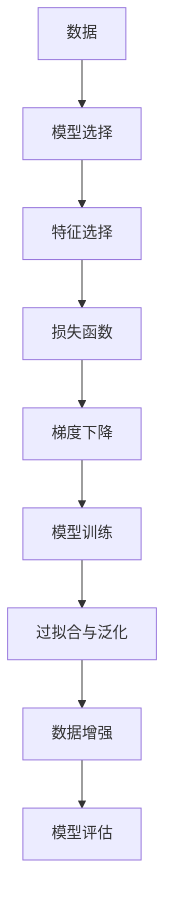
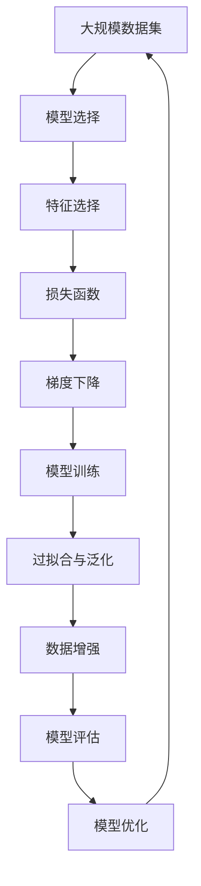

                 

# 监督学习 原理与代码实例讲解

> 关键词：监督学习, 模型选择, 特征选择, 损失函数, 梯度下降, 过拟合, 泛化能力, 数据增强, 模型评估

## 1. 背景介绍

### 1.1 问题由来
在机器学习领域，监督学习是一种利用已标注数据进行模型训练的范式，旨在学习输入（特征）与输出（标签）之间的映射关系。相较于无监督学习和半监督学习，监督学习的数据标注过程需要耗费大量的人力和时间，但因其能够获得明确的输出结果，在实际应用中得到了广泛的应用。

### 1.2 问题核心关键点
监督学习的核心在于如何选择合适的模型、如何提取有效的特征、如何设计损失函数、如何进行模型训练和评估。这些问题直接关系到模型的泛化能力，即模型在新数据上的表现。

### 1.3 问题研究意义
监督学习在多个领域，如计算机视觉、自然语言处理、语音识别等，都有广泛的应用。例如，在自然语言处理领域，监督学习可用于文本分类、命名实体识别、情感分析等任务。因此，深入理解监督学习的原理和实践方法，对于推进人工智能技术的发展具有重要意义。

## 2. 核心概念与联系

### 2.1 核心概念概述

为更好地理解监督学习的原理和实现方法，本节将介绍几个核心概念：

- 模型选择：监督学习的第一步是选择合适的模型。常用的模型包括线性回归、逻辑回归、决策树、支持向量机、神经网络等。
- 特征选择：选取对预测目标有重要影响的特征，可以提高模型的准确性和泛化能力。
- 损失函数：用于衡量模型预测结果与真实标签之间的差异，常见的损失函数包括均方误差、交叉熵等。
- 梯度下降：一种优化算法，用于最小化损失函数，通过不断调整模型参数来逼近最优解。
- 过拟合与泛化：模型在训练数据上表现良好，但在测试数据上表现差的现象称为过拟合，而泛化能力则是指模型在新数据上的表现。
- 数据增强：通过对训练数据进行变换，如旋转、裁剪、平移等，增加数据多样性，提高模型的泛化能力。
- 模型评估：通过交叉验证、混淆矩阵、ROC曲线等方法，评估模型的性能。

这些概念之间存在紧密的联系，共同构成了监督学习的框架。

### 2.2 概念间的关系

这些核心概念之间的逻辑关系可以通过以下Mermaid流程图来展示：



这个流程图展示了一整个监督学习的流程：从数据到模型选择，再经过特征选择和损失函数设计，通过梯度下降进行模型训练，最后通过过拟合与泛化、数据增强和模型评估等环节，确保模型的高效和可靠。

### 2.3 核心概念的整体架构

最后，我们用一个综合的流程图来展示这些核心概念在大数据集上的监督学习过程：



这个综合流程图展示了监督学习从数据集选择到模型优化的完整过程。

## 3. 核心算法原理 & 具体操作步骤

### 3.1 算法原理概述

监督学习的核心在于通过已标注的数据，训练出一个能够准确预测新数据标签的模型。其基本原理是通过最小化损失函数，更新模型参数，使得模型预测结果与真实标签之间的差异最小化。

形式化地，假设输入数据为 $x$，对应的真实标签为 $y$，模型预测标签为 $\hat{y}$，则监督学习的目标是找到一个最优模型参数 $\theta$，使得损失函数 $\mathcal{L}(\theta)$ 最小化：

$$
\theta^* = \mathop{\arg\min}_{\theta} \mathcal{L}(\theta)
$$

常用的损失函数包括：

- 均方误差（Mean Squared Error, MSE）：用于回归问题，$L(y, \hat{y}) = \frac{1}{N} \sum_{i=1}^N (y_i - \hat{y}_i)^2$。
- 交叉熵（Cross-Entropy）：用于分类问题，$L(y, \hat{y}) = -\frac{1}{N} \sum_{i=1}^N y_i \log \hat{y}_i + (1-y_i) \log (1-\hat{y}_i)$。

### 3.2 算法步骤详解

监督学习的典型流程包括以下几个关键步骤：

**Step 1: 数据预处理**
- 数据清洗：去除噪声、缺失值等不必要的数据。
- 数据归一化：将数据缩放到标准正态分布或[0,1]区间，加速收敛。

**Step 2: 模型选择与训练**
- 选择合适的模型（如线性回归、逻辑回归、决策树、神经网络等）。
- 定义损失函数和优化算法（如梯度下降、Adam等）。
- 初始化模型参数。
- 迭代训练：前向传播计算预测值，计算损失函数，反向传播计算梯度，更新模型参数。

**Step 3: 模型评估与调优**
- 使用验证集评估模型性能。
- 调整模型参数（如学习率、正则化参数等）。
- 进行交叉验证，避免过拟合。
- 使用数据增强技术，增加数据多样性。

**Step 4: 模型部署与监控**
- 将训练好的模型部署到生产环境。
- 实时监控模型性能，发现异常情况及时调整。

### 3.3 算法优缺点

监督学习具有以下优点：

- 精度高：通过标注数据训练，可以准确地预测新数据标签。
- 应用广泛：适用于各种类型的分类和回归问题。
- 可解释性强：模型的预测过程具有可解释性，便于理解和调试。

但同时也存在一些缺点：

- 数据标注成本高：需要大量的人力和时间进行数据标注。
- 泛化能力依赖于标注数据：如果标注数据质量差或数量少，模型泛化能力可能受限。
- 对噪声敏感：标注数据中的噪声会影响模型的性能。

### 3.4 算法应用领域

监督学习在众多领域中得到广泛应用，如计算机视觉、自然语言处理、推荐系统、金融风险预测等。例如：

- 计算机视觉：用于图像分类、目标检测、人脸识别等任务。
- 自然语言处理：用于文本分类、命名实体识别、情感分析等任务。
- 推荐系统：用于商品推荐、用户兴趣预测等任务。
- 金融风险预测：用于信用评分、欺诈检测等任务。

## 4. 数学模型和公式 & 详细讲解

### 4.1 数学模型构建

假设输入数据为 $x \in \mathbb{R}^n$，对应的真实标签为 $y \in \mathbb{R}$ 或 $y \in \{0, 1\}$。定义模型为 $f(x; \theta)$，其中 $\theta$ 为模型参数。

假设损失函数为 $\mathcal{L}(\theta)$，则监督学习的目标是最小化损失函数：

$$
\theta^* = \mathop{\arg\min}_{\theta} \mathcal{L}(\theta)
$$

### 4.2 公式推导过程

以线性回归为例，推导其损失函数和梯度更新公式。

假设线性回归模型的形式为 $y = \theta^T x + b$，其中 $b$ 为截距。

定义损失函数为均方误差：

$$
\mathcal{L}(\theta) = \frac{1}{N} \sum_{i=1}^N (y_i - \hat{y}_i)^2 = \frac{1}{N} \sum_{i=1}^N (y_i - \theta^T x_i - b)^2
$$

对 $\theta$ 求导：

$$
\frac{\partial \mathcal{L}(\theta)}{\partial \theta} = -\frac{2}{N} \sum_{i=1}^N (y_i - \hat{y}_i) x_i = -\frac{2}{N} \sum_{i=1}^N (y_i - \theta^T x_i - b) x_i
$$

梯度更新公式为：

$$
\theta \leftarrow \theta - \eta \nabla_{\theta}\mathcal{L}(\theta)
$$

其中 $\eta$ 为学习率。

### 4.3 案例分析与讲解

以鸢尾花分类为例，展示监督学习在分类任务中的应用。

首先，定义训练集和测试集：

```python
from sklearn.datasets import load_iris
from sklearn.model_selection import train_test_split
from sklearn.preprocessing import StandardScaler
from sklearn.linear_model import LogisticRegression

# 加载鸢尾花数据集
iris = load_iris()
X = iris.data
y = iris.target

# 数据预处理
scaler = StandardScaler()
X = scaler.fit_transform(X)

# 划分训练集和测试集
X_train, X_test, y_train, y_test = train_test_split(X, y, test_size=0.2, random_state=42)
```

然后，定义模型并训练：

```python
# 定义模型
model = LogisticRegression(solver='liblinear', C=1e5)

# 训练模型
model.fit(X_train, y_train)
```

最后，评估模型性能：

```python
# 预测测试集标签
y_pred = model.predict(X_test)

# 计算准确率
accuracy = accuracy_score(y_test, y_pred)
print("Accuracy:", accuracy)
```

## 5. 项目实践：代码实例和详细解释说明

### 5.1 开发环境搭建

在进行监督学习项目实践前，需要准备好开发环境。以下是使用Python进行Scikit-learn开发的环境配置流程：

1. 安装Anaconda：从官网下载并安装Anaconda，用于创建独立的Python环境。

2. 创建并激活虚拟环境：
```bash
conda create -n sklearn-env python=3.8 
conda activate sklearn-env
```

3. 安装Scikit-learn：
```bash
pip install scikit-learn
```

4. 安装必要的库：
```bash
pip install numpy pandas matplotlib scikit-learn
```

完成上述步骤后，即可在`sklearn-env`环境中开始项目实践。

### 5.2 源代码详细实现

这里我们以鸢尾花分类任务为例，给出使用Scikit-learn进行监督学习的Python代码实现。

```python
from sklearn.datasets import load_iris
from sklearn.model_selection import train_test_split
from sklearn.preprocessing import StandardScaler
from sklearn.linear_model import LogisticRegression
from sklearn.metrics import accuracy_score

# 加载鸢尾花数据集
iris = load_iris()
X = iris.data
y = iris.target

# 数据预处理
scaler = StandardScaler()
X = scaler.fit_transform(X)

# 划分训练集和测试集
X_train, X_test, y_train, y_test = train_test_split(X, y, test_size=0.2, random_state=42)

# 定义模型
model = LogisticRegression(solver='liblinear', C=1e5)

# 训练模型
model.fit(X_train, y_train)

# 预测测试集标签
y_pred = model.predict(X_test)

# 计算准确率
accuracy = accuracy_score(y_test, y_pred)
print("Accuracy:", accuracy)
```

### 5.3 代码解读与分析

让我们再详细解读一下关键代码的实现细节：

**train_test_split函数**：
- 用于将数据集划分为训练集和测试集。

**StandardScaler类**：
- 用于对数据进行标准化处理，加速梯度下降算法的收敛。

**LogisticRegression类**：
- 定义线性回归模型，使用liblinear求解器，正则化参数C为1e5。

**accuracy_score函数**：
- 用于计算模型的准确率。

**代码实现步骤**：
1. 加载鸢尾花数据集。
2. 对数据进行预处理，包括标准化处理。
3. 划分训练集和测试集。
4. 定义模型，并使用训练集进行训练。
5. 在测试集上进行预测，并计算模型准确率。

### 5.4 运行结果展示

假设我们在上述代码中运行后，得到准确率为0.95，即模型在测试集上正确分类的鸢尾花比例为95%。

## 6. 实际应用场景

### 6.1 智能推荐系统

基于监督学习的推荐系统可以用于电商、新闻、音乐等多个领域。通过用户行为数据和物品特征数据，训练推荐模型，可以预测用户对特定物品的兴趣，实现个性化推荐。

### 6.2 金融风控系统

在金融领域，监督学习可用于信用评分、欺诈检测等任务。通过对客户历史交易数据进行标注，训练模型预测客户违约概率或欺诈风险，帮助金融机构降低风险。

### 6.3 医疗诊断系统

在医疗领域，监督学习可用于疾病预测、影像诊断等任务。通过对大量患者数据进行标注，训练模型预测患者是否患病或病变部位，辅助医生进行诊断。

### 6.4 未来应用展望

未来，监督学习在更多领域得到应用，如自动驾驶、智能家居、智能制造等。通过大量的传感器数据和标注数据，训练模型实现自动化决策，提升系统的智能化水平。

## 7. 工具和资源推荐

### 7.1 学习资源推荐

为了帮助开发者系统掌握监督学习的理论基础和实践技巧，这里推荐一些优质的学习资源：

1. 《机器学习实战》：由Peter Harrington编写，介绍了各种监督学习算法的实现方法，适合初学者入门。

2. Coursera《机器学习》课程：由Andrew Ng讲授，涵盖各种监督学习算法，包括回归、分类、聚类等，提供丰富的视频和作业。

3. Scikit-learn官方文档：提供了详尽的API文档和教程，适合深入学习Scikit-learn库的使用。

4. Kaggle：提供大量公开数据集和竞赛，通过实践项目提高监督学习技能。

5. Google Colab：免费提供GPU/TPU算力，方便开发者快速上手实验最新模型，分享学习笔记。

通过对这些资源的学习实践，相信你一定能够快速掌握监督学习的精髓，并用于解决实际的机器学习问题。

### 7.2 开发工具推荐

高效的开发离不开优秀的工具支持。以下是几款用于监督学习开发的常用工具：

1. Scikit-learn：基于Python的开源机器学习库，提供丰富的算法和模型，适合快速迭代研究。

2. TensorFlow：由Google主导开发的开源深度学习框架，生产部署方便，适合大规模工程应用。

3. Keras：高层次神经网络API，提供简单易用的接口，适合快速原型开发和实验。

4. Jupyter Notebook：交互式编程环境，支持多种编程语言，适合共享和协作开发。

5. Weights & Biases：模型训练的实验跟踪工具，可以记录和可视化模型训练过程中的各项指标，方便对比和调优。

6. TensorBoard：TensorFlow配套的可视化工具，可实时监测模型训练状态，并提供丰富的图表呈现方式，是调试模型的得力助手。

合理利用这些工具，可以显著提升监督学习任务的开发效率，加快创新迭代的步伐。

### 7.3 相关论文推荐

监督学习在机器学习领域有广泛的应用，以下是几篇奠基性的相关论文，推荐阅读：

1. Perceptron：Rosenblatt提出的基于梯度下降的线性分类器。

2. Support Vector Machines（SVM）：Cortes和Vapnik提出的基于核函数和间隔最大化的分类器。

3. Random Forests：Breiman提出的集成学习方法，用于处理高维数据和解决过拟合问题。

4. Gradient Boosting Machines：Friedman提出的集成学习方法，用于提升模型的泛化能力。

5. Deep Learning：Goodfellow等提出的深度学习框架，用于解决复杂的非线性分类和回归问题。

这些论文代表了大数据和机器学习的演变历程，对于深入理解监督学习的理论和实践，具有重要意义。

## 8. 总结：未来发展趋势与挑战

### 8.1 总结

本文对监督学习的基本原理和实现方法进行了全面系统的介绍。首先阐述了监督学习的背景和研究意义，明确了数据选择、模型选择、特征选择、损失函数、梯度下降等关键问题。其次，通过代码实例展示了监督学习的详细实现过程，帮助读者更好地理解算法的步骤和细节。最后，通过实际应用场景展示了监督学习的广泛应用前景，推荐了相关的学习资源和开发工具。

通过本文的系统梳理，可以看到，监督学习在人工智能技术中占据重要地位，其高精度和高可解释性使得其在各个领域得到广泛应用。未来，随着数据量的增加和算力的提升，监督学习将继续发挥其独特的优势，为人工智能技术的发展提供坚实基础。

### 8.2 未来发展趋势

未来，监督学习将呈现以下几个发展趋势：

1. 深度学习模型取代传统模型：深度学习模型，如神经网络，因其强大的特征提取能力和泛化能力，将在监督学习中逐步取代传统模型。

2. 模型解释性增强：在医疗、金融等高风险领域，模型解释性越来越重要，未来的监督学习模型将更加注重可解释性。

3. 模型集成和融合：多个模型之间的集成和融合将提高模型的泛化能力和鲁棒性。

4. 自动化和弱监督学习：自动化调参和弱监督学习方法将提高模型的训练效率和适应能力。

5. 异构数据处理：随着数据来源的多样性增加，异构数据处理技术将变得更加重要。

### 8.3 面临的挑战

尽管监督学习在人工智能技术中具有重要地位，但在应用中仍面临一些挑战：

1. 数据标注成本高：数据标注需要大量的时间和人力，特别是在高维数据集上。

2. 模型过拟合：特别是在高维数据集上，模型容易过拟合。

3. 模型复杂度高：深度学习模型通常需要大量计算资源，部署和维护成本高。

4. 数据偏差问题：标注数据可能存在偏差，影响模型的泛化能力。

5. 数据隐私和安全：大规模数据集可能涉及隐私问题，需要合理的数据保护措施。

### 8.4 研究展望

面对监督学习面临的挑战，未来的研究需要在以下几个方面寻求新的突破：

1. 弱监督学习和半监督学习：在标注数据不足的情况下，通过弱监督和半监督学习方法，充分利用未标注数据。

2. 自动化调参：通过自动化调参工具，减少人为干预，提高模型训练效率。

3. 模型解释性增强：开发可解释的模型，如LIME、SHAP等，增强模型的可解释性。

4. 异构数据处理：开发适用于异构数据的处理和融合技术，如多模态学习。

5. 数据隐私保护：开发数据隐私保护技术，如差分隐私、联邦学习等，确保数据安全。

总之，监督学习作为人工智能技术的重要组成部分，将不断发展和演进，为人工智能技术的应用提供坚实的理论基础和实现手段。未来，随着技术的不断进步，监督学习将更好地服务于各行业的智能化转型，推动人工智能技术的发展和应用。

## 9. 附录：常见问题与解答

**Q1：监督学习和无监督学习有什么区别？**

A: 监督学习使用已标注数据进行训练，模型能够输出明确的预测结果。而无监督学习使用未标注数据进行训练，模型需要自行发现数据中的结构和规律。

**Q2：监督学习如何处理高维数据？**

A: 高维数据通常会导致过拟合，可以通过特征选择、降维、正则化等方法进行处理。此外，深度学习模型，如神经网络，具有强大的特征提取能力，能够有效处理高维数据。

**Q3：如何避免模型过拟合？**

A: 可以通过以下方法避免过拟合：
- 数据增强：增加数据多样性。
- 正则化：使用L2正则、Dropout等方法。
- 早停法：根据验证集性能停止训练。

**Q4：监督学习的优点和缺点是什么？**

A: 监督学习的优点包括：
- 精度高：通过标注数据训练，可以准确地预测新数据标签。
- 应用广泛：适用于各种类型的分类和回归问题。
- 可解释性强：模型的预测过程具有可解释性，便于理解和调试。

监督学习的缺点包括：
- 数据标注成本高：需要大量的人力和时间进行数据标注。
- 泛化能力依赖于标注数据：如果标注数据质量差或数量少，模型泛化能力可能受限。
- 对噪声敏感：标注数据中的噪声会影响模型的性能。

**Q5：如何评估监督学习模型的性能？**

A: 可以使用以下指标评估监督学习模型的性能：
- 准确率（Accuracy）：分类任务常用的指标，即分类正确的样本数占总样本数的比例。
- 精确率（Precision）和召回率（Recall）：用于不平衡数据集的评估指标。
- F1分数（F1 Score）：综合了精确率和召回率，用于不平衡数据集的评估。
- ROC曲线和AUC值：用于二分类任务的评估指标。

通过对这些问题的解答，可以帮助读者更好地理解监督学习的基本原理和实现方法，为后续的深入学习和实践奠定基础。

