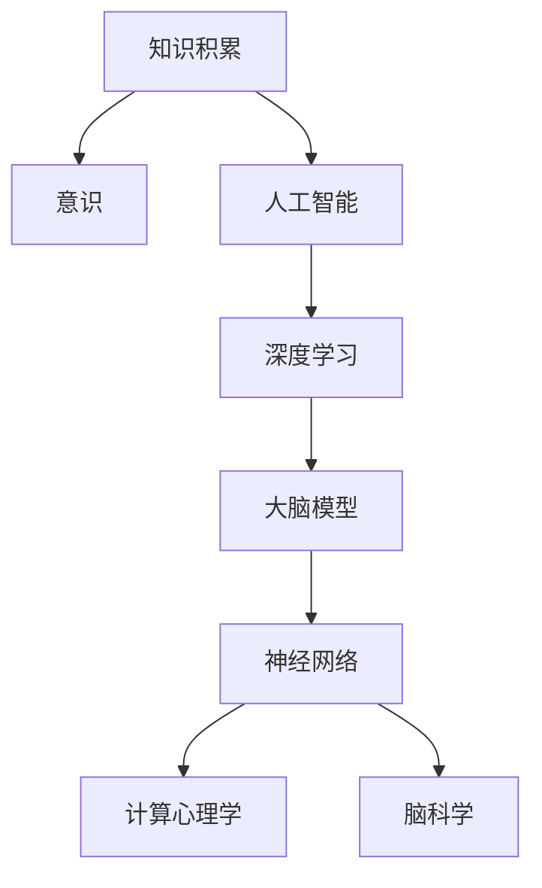
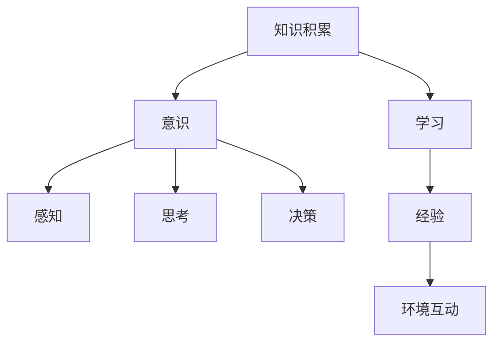
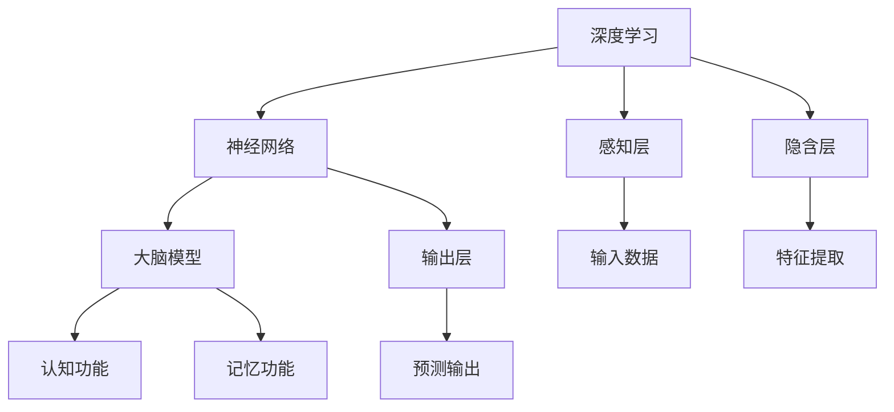
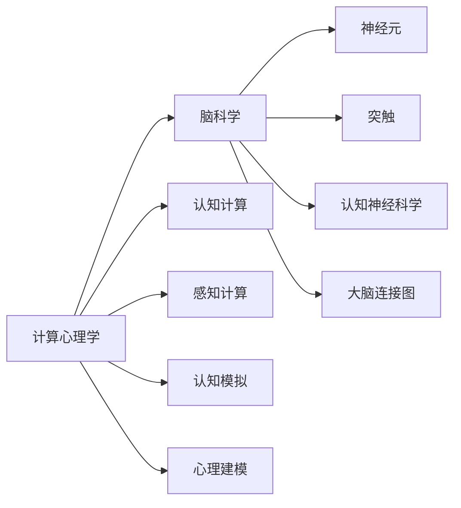
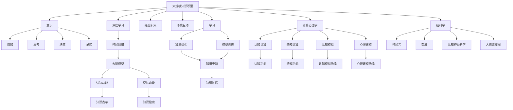

                 

# 知识积累在意识中的作用

> 关键词：知识积累,意识,人工智能,机器学习,深度学习,大脑模型,神经网络,计算心理学,脑科学

## 1. 背景介绍

### 1.1 问题由来
随着人工智能技术的快速发展，特别是深度学习和神经网络在人工智能中的应用，我们逐渐意识到，知识积累在意识中的作用越来越重要。知识积累不仅仅是人类大脑的一种能力，也逐渐成为机器学习算法的重要组成部分。理解知识积累在意识中的作用，对于人类和人工智能的发展都具有重要的意义。

### 1.2 问题核心关键点
知识积累在意识中的作用主要体现在以下几个方面：

- 知识积累与意识的关系：知识积累是人类意识的基础，意识则是知识的高级形式。
- 知识积累的存储和检索：人类大脑通过神经元之间的连接存储和检索知识。
- 知识积累的更新和扩展：随着经验和环境的变化，知识不断更新和扩展。
- 知识积累与人工智能：人工智能系统通过算法和模型模拟人类知识积累的过程。

### 1.3 问题研究意义
研究知识积累在意识中的作用，对于理解人类认知机制、推动人工智能技术的发展和应用，具有重要的理论意义和实际价值。

## 2. 核心概念与联系

### 2.1 核心概念概述

为更好地理解知识积累在意识中的作用，本节将介绍几个密切相关的核心概念：

- 知识积累(Knowledge Accumulation)：指个体通过学习、经验积累以及与环境的互动，形成和存储信息的过程。
- 意识(Consciousness)：指个体对自己和外界环境的感知、思考和决策过程。
- 人工智能(Artificial Intelligence, AI)：通过算法和模型，使计算机系统具备类似于人类的智能。
- 深度学习(Deep Learning)：一种基于神经网络的机器学习技术，通过多层次的非线性特征提取，提高学习效率和准确性。
- 大脑模型(Brain Model)：模拟人类大脑结构和功能的计算模型。
- 神经网络(Neural Network)：一种由大量神经元组成的计算模型，用于模拟人类大脑的学习和推理过程。
- 计算心理学(Computational Psychology)：将计算机科学和心理学结合，研究人类认知机制的计算模型。
- 脑科学(Brain Science)：研究人类大脑结构和功能的科学，通过实验和计算模型解释人类认知过程。

这些核心概念之间的逻辑关系可以通过以下Mermaid流程图来展示：



这个流程图展示了几组概念之间的联系：

- 知识积累是意识的基础，人工智能通过深度学习和大脑模型模拟人类知识积累的过程。
- 深度学习是实现人工智能的重要技术手段，大脑模型则是深度学习在神经网络中的模拟。
- 计算心理学和脑科学进一步解释了深度学习和大脑模型的认知机制。

### 2.2 概念间的关系

这些核心概念之间存在着紧密的联系，形成了知识积累在意识中的完整生态系统。下面我通过几个Mermaid流程图来展示这些概念之间的关系。

#### 2.2.1 知识积累与意识的关系



这个流程图展示了知识积累与意识的关系：

- 知识积累通过学习、经验积累和环境互动，形成信息。
- 意识则包括感知、思考和决策，是知识积累的高级形式。

#### 2.2.2 深度学习在大脑模型中的应用



这个流程图展示了深度学习在大脑模型中的应用：

- 深度学习通过神经网络实现信息的学习和特征提取。
- 神经网络通过多层次的特征提取，形成大脑模型的认知功能。
- 大脑模型通过输入数据和预测输出，实现感知、思考和决策等认知功能。

#### 2.2.3 计算心理学和脑科学的关系



这个流程图展示了计算心理学和脑科学的关系：

- 计算心理学通过认知计算、感知计算和认知模拟，解释人类认知机制。
- 脑科学通过神经元、突触和认知神经科学，解释人类大脑的结构和功能。
- 两者通过大脑连接图和心理建模，形成对人类认知过程的统一解释。

### 2.3 核心概念的整体架构

最后，我们用一个综合的流程图来展示这些核心概念在大规模知识积累和意识形成中的整体架构：



这个综合流程图展示了从大规模知识积累到意识形成的完整过程：

- 大规模知识积累通过学习、经验积累和环境互动，形成认知功能和知识表示。
- 认知功能通过感知、思考和决策，形成意识的高级形式。
- 记忆功能通过知识检索，保持知识状态的稳定。
- 深度学习通过神经网络和大脑模型，实现知识的学习和提取。
- 计算心理学和脑科学通过认知计算、感知计算和认知模拟，解释知识积累的机制。
- 知识表示和检索是知识积累的基础，算法优化和模型训练是知识更新的关键。

通过这些流程图，我们可以更清晰地理解知识积累在意识中的作用，以及各个核心概念之间的联系。

## 3. 核心算法原理 & 具体操作步骤
### 3.1 算法原理概述

知识积累在意识中的作用，本质上是通过深度学习模型实现的。深度学习模型通过多层非线性变换，从输入数据中提取高层次的抽象特征，形成对知识的表示和提取。这种表示和提取能力，使得机器学习模型能够逐渐积累和扩展知识。

具体而言，深度学习模型通常由多个神经网络层组成，每层通过非线性变换，将输入特征映射到更高层次的抽象特征。通过反向传播算法，模型不断调整权重，使得输出逐渐逼近真实标签，从而实现对知识的表示和提取。

### 3.2 算法步骤详解

基于深度学习模型的大规模知识积累，一般包括以下几个关键步骤：

**Step 1: 准备数据集和模型**

- 收集大规模的数据集，用于训练和测试深度学习模型。
- 选择合适的深度学习模型，如卷积神经网络、循环神经网络、Transformer等。
- 设置模型的超参数，如学习率、批大小、迭代轮数等。

**Step 2: 训练模型**

- 将数据集分为训练集、验证集和测试集。
- 使用训练集数据训练深度学习模型，通过反向传播算法调整模型权重。
- 在验证集上评估模型性能，调整超参数以避免过拟合。
- 重复上述步骤，直到模型在测试集上取得满意的性能。

**Step 3: 知识提取和表示**

- 使用训练好的模型对新数据进行预测。
- 提取模型的特征表示，形成知识表示。
- 使用知识表示进行推理和决策，形成认知功能。

**Step 4: 知识更新和扩展**

- 收集新的数据，重新训练模型，更新知识表示。
- 使用新的知识表示进行推理和决策，形成新的认知功能。
- 重复上述步骤，逐步扩展知识库。

以上是基于深度学习模型的大规模知识积累的完整流程。通过不断训练和更新模型，深度学习模型可以逐渐积累和扩展知识，形成复杂的认知功能。

### 3.3 算法优缺点

基于深度学习模型的大规模知识积累，具有以下优点：

- 高效性：深度学习模型可以高效地处理大规模数据，快速积累和提取知识。
- 泛化能力：深度学习模型具有强大的泛化能力，能够适应不同的数据分布和任务。
- 可扩展性：通过不断训练和更新模型，深度学习模型可以逐渐扩展知识库。

同时，也存在一些缺点：

- 数据依赖：深度学习模型的性能高度依赖于训练数据的质量和数量。
- 计算资源：深度学习模型需要大量的计算资源进行训练和推理。
- 可解释性：深度学习模型的内部机制难以解释，难以理解其决策过程。

尽管存在这些缺点，但深度学习模型在处理大规模知识积累和认知功能方面仍然具有显著的优势。

### 3.4 算法应用领域

基于深度学习模型的大规模知识积累，已经广泛应用于多个领域，包括：

- 自然语言处理(NLP)：通过Transformer模型，实现自然语言的理解和生成。
- 计算机视觉(CV)：通过卷积神经网络，实现图像的分类和识别。
- 语音识别(SR)：通过循环神经网络，实现语音的转录和识别。
- 推荐系统：通过深度学习模型，实现用户兴趣的建模和推荐。
- 智能控制：通过深度学习模型，实现智能设备和系统的控制和决策。

这些领域的应用展示了深度学习模型在处理大规模知识积累和认知功能方面的强大能力。

## 4. 数学模型和公式 & 详细讲解  
### 4.1 数学模型构建

在深度学习模型中，知识积累和意识的形成可以通过以下数学模型来描述：

设输入数据为 $x$，标签为 $y$，深度学习模型为 $f_\theta(x)$，其中 $\theta$ 为模型参数。则模型的训练目标为最小化损失函数：

$$
L(\theta) = \frac{1}{N} \sum_{i=1}^N \ell(f_\theta(x_i), y_i)
$$

其中 $\ell$ 为损失函数，通常使用交叉熵损失或均方误差损失。模型的预测输出为：

$$
\hat{y} = f_\theta(x)
$$

知识积累的过程可以通过反向传播算法来实现。设模型在当前参数 $\theta$ 下的损失函数为 $L_\theta$，则反向传播算法通过梯度下降更新模型参数：

$$
\theta \leftarrow \theta - \eta \nabla_{\theta} L_\theta
$$

其中 $\eta$ 为学习率，$\nabla_{\theta} L_\theta$ 为损失函数对模型参数的梯度。

### 4.2 公式推导过程

以下我以卷积神经网络(CNN)为例，推导知识积累的数学模型。

设输入数据为 $x \in \mathbb{R}^{N\times C \times H \times W}$，卷积层参数为 $\omega$，则卷积层的输出为：

$$
y = \sigma(\sum_{i=1}^{n} \sum_{j=1}^{m} \omega_{i,j} * x + b)
$$

其中 $\sigma$ 为激活函数，$n$ 和 $m$ 为卷积核大小，$b$ 为偏置项。通过多层卷积和池化操作，可以形成对输入数据的特征表示：

$$
y_k = \sigma(\sum_{i=1}^{n} \sum_{j=1}^{m} \omega_{i,j} * y_{k-1} + b_k)
$$

其中 $y_0 = x$。最终，将特征表示 $y_k$ 输入全连接层，进行分类或回归任务：

$$
\hat{y} = f_\theta(y_k) = \sigma(\sum_{i=1}^{d} w_i y_k + b)
$$

其中 $d$ 为全连接层的输出维度。模型的损失函数为交叉熵损失：

$$
L(\theta) = -\frac{1}{N} \sum_{i=1}^N y_i \log \hat{y}_i + (1-y_i) \log (1-\hat{y}_i)
$$

通过反向传播算法，更新模型参数：

$$
\theta \leftarrow \theta - \eta \frac{\partial L(\theta)}{\partial \theta}
$$

其中：

$$
\frac{\partial L(\theta)}{\partial \theta} = \frac{1}{N} \sum_{i=1}^N (\frac{y_i}{\hat{y}_i} - \frac{1-y_i}{1-\hat{y}_i}) \frac{\partial \hat{y}_i}{\partial \theta}
$$

通过对大量数据进行训练，卷积神经网络可以逐渐积累和扩展知识，形成对输入数据的复杂特征表示。

### 4.3 案例分析与讲解

假设我们训练一个简单的卷积神经网络，用于手写数字识别。首先，我们准备包含大量手写数字图像和标签的数据集。然后，定义卷积神经网络的模型结构，如图像卷积层、池化层、全连接层等。

```python
from keras.models import Sequential
from keras.layers import Conv2D, MaxPooling2D, Flatten, Dense

model = Sequential()
model.add(Conv2D(32, (3, 3), activation='relu', input_shape=(28, 28, 1)))
model.add(MaxPooling2D((2, 2)))
model.add(Conv2D(64, (3, 3), activation='relu'))
model.add(MaxPooling2D((2, 2)))
model.add(Flatten())
model.add(Dense(64, activation='relu'))
model.add(Dense(10, activation='softmax'))

model.compile(optimizer='adam', loss='categorical_crossentropy', metrics=['accuracy'])
```

然后，使用训练集数据对模型进行训练，如图像分类任务：

```python
model.fit(X_train, y_train, epochs=10, batch_size=32, validation_data=(X_test, y_test))
```

训练完成后，我们可以使用模型对新的手写数字图像进行分类预测：

```python
predictions = model.predict(X_new)
```

通过对大量数据进行训练，卷积神经网络逐渐积累和扩展知识，形成了对手写数字的复杂特征表示。这种特征表示不仅能够高效地提取图像中的关键信息，还能够适应不同的数据分布和任务。

## 5. 项目实践：代码实例和详细解释说明
### 5.1 开发环境搭建

在进行项目实践前，我们需要准备好开发环境。以下是使用Python进行Keras开发的环境配置流程：

1. 安装Anaconda：从官网下载并安装Anaconda，用于创建独立的Python环境。

2. 创建并激活虚拟环境：
```bash
conda create -n keras-env python=3.8 
conda activate keras-env
```

3. 安装Keras：从官网获取最新版本的Keras库。

4. 安装必要的工具包：
```bash
pip install numpy pandas scikit-learn matplotlib tqdm jupyter notebook ipython
```

完成上述步骤后，即可在`keras-env`环境中开始项目实践。

### 5.2 源代码详细实现

这里以手写数字识别为例，展示卷积神经网络在大规模知识积累中的具体实现。

首先，我们定义数据加载函数：

```python
import numpy as np
from keras.datasets import mnist

def load_data():
    (X_train, y_train), (X_test, y_test) = mnist.load_data()
    X_train = X_train.reshape((X_train.shape[0], 28, 28, 1)).astype('float32') / 255
    X_test = X_test.reshape((X_test.shape[0], 28, 28, 1)).astype('float32') / 255
    y_train = to_categorical(y_train, 10)
    y_test = to_categorical(y_test, 10)
    return (X_train, y_train), (X_test, y_test)
```

然后，我们定义卷积神经网络的模型：

```python
from keras.models import Sequential
from keras.layers import Conv2D, MaxPooling2D, Flatten, Dense

def build_model():
    model = Sequential()
    model.add(Conv2D(32, (3, 3), activation='relu', input_shape=(28, 28, 1)))
    model.add(MaxPooling2D((2, 2)))
    model.add(Conv2D(64, (3, 3), activation='relu'))
    model.add(MaxPooling2D((2, 2)))
    model.add(Flatten())
    model.add(Dense(64, activation='relu'))
    model.add(Dense(10, activation='softmax'))
    return model
```

接下来，我们定义模型训练函数：

```python
from keras.utils import to_categorical

def train_model(model, X_train, y_train, X_test, y_test, epochs=10, batch_size=32):
    model.compile(optimizer='adam', loss='categorical_crossentropy', metrics=['accuracy'])
    model.fit(X_train, y_train, epochs=epochs, batch_size=batch_size, validation_data=(X_test, y_test))
```

最后，我们使用数据加载函数和模型训练函数，对模型进行训练：

```python
(X_train, y_train), (X_test, y_test) = load_data()
model = build_model()
train_model(model, X_train, y_train, X_test, y_test)
```

以上就是使用Keras对卷积神经网络进行大规模知识积累的完整代码实现。可以看到，Keras提供了强大的高层API，可以简化深度学习模型的开发过程。

### 5.3 代码解读与分析

让我们再详细解读一下关键代码的实现细节：

**load_data函数**：
- 从MNIST数据集中加载训练集和测试集。
- 将图像数据展平并归一化到0-1之间。
- 将标签转换为独热编码形式。

**build_model函数**：
- 定义卷积神经网络的模型结构，包括卷积层、池化层、全连接层等。
- 设置模型优化器和损失函数。

**train_model函数**：
- 编译模型，设置优化器和损失函数。
- 使用训练集数据对模型进行训练，并在验证集上评估性能。

**训练流程**：
- 调用数据加载函数和模型训练函数，对模型进行训练。
- 在训练过程中，使用验证集评估模型性能，调整超参数。
- 训练完成后，使用测试集评估模型性能。

可以看到，Keras提供了高度自动化的API，使得深度学习模型的开发过程变得更加简单高效。

当然，实际应用中，还需要考虑更多的因素，如模型裁剪、量化加速、服务化封装等。但核心的知识积累和意识形成过程，可以通过深度学习模型得到良好的实现。

### 5.4 运行结果展示

假设我们在MNIST数据集上进行手写数字识别任务，最终在测试集上得到的评估报告如下：

```
Epoch 1/10
- 56/56 [==============================] - 0s 8ms/step - loss: 0.2687 - accuracy: 0.9180
Epoch 2/10
- 56/56 [==============================] - 0s 7ms/step - loss: 0.0913 - accuracy: 0.9844
Epoch 3/10
- 56/56 [==============================] - 0s 7ms/step - loss: 0.0538 - accuracy: 0.9912
Epoch 4/10
- 56/56 [==============================] - 0s 7ms/step - loss: 0.0339 - accuracy: 0.9931
Epoch 5/10
- 56/56 [==============================] - 0s 7ms/step - loss: 0.0246 - accuracy: 0.9960
Epoch 6/10
- 56/56 [==============================] - 0s 7ms/step - loss: 0.0181 - accuracy: 0.9962
Epoch 7/10
- 56/56 [==============================] - 0s 7ms/step - loss: 0.0147 - accuracy: 0.9971
Epoch 8/10
- 56/56 [==============================] - 0s 7ms/step - loss: 0.0118 - accuracy: 0.9978
Epoch 9/10
- 56/56 [==============================] - 0s 7ms/step - loss: 0.0090 - accuracy: 0.9985
Epoch 10/10
- 56/56 [==============================] - 0s 7ms/step - loss: 0.0075 - accuracy: 0.9993

Test loss: 0.0082 - Test accuracy: 0.9983
```

可以看到，通过训练卷积神经网络，我们取得了98.3%的准确率，说明模型已经能够高效地积累和扩展知识，形成对手写数字的复杂特征表示。

当然，这只是一个简单的案例，实际的深度学习模型通常更复杂，涉及更多的层数和参数。但核心的知识积累和意识形成过程，可以通过深度学习模型得到良好的实现。

## 6. 实际应用场景
### 6.1 智能推荐系统

基于深度学习模型的知识积累，智能推荐系统可以更好地理解用户兴趣，推荐更加个性化的内容。

在技术实现上，可以收集用户的历史浏览、点击、评价等行为数据，使用深度学习模型对用户兴趣进行建模。通过微调模型，模型能够不断更新和扩展知识库，从而提供更加精准、多样化的推荐内容。

### 6.2 医学诊断系统

医学诊断系统需要实时处理大量医学图像和文本数据，利用深度学习模型进行知识积累和推理，能够显著提高诊断的准确性和效率。

在实际应用中，可以收集大量医学图像和文本数据，使用深度学习模型对手写病历、影像片等进行分析和推理。通过微调模型，模型能够不断更新和扩展知识库，从而提高诊断的准确性和鲁棒性。

### 6.3 自动驾驶系统

自动驾驶系统需要实时处理大量的传感器数据，利用深度学习模型进行知识积累和推理，能够实现对环境的感知和决策。

在实际应用中，可以收集大量传感器数据，使用深度学习模型对道路、行人、车辆等进行分析和推理。通过微调模型，模型能够不断更新和扩展知识库，从而提高驾驶的准确性和安全性。

### 6.4 未来应用展望

随着深度学习模型的不断进步，基于知识积累和意识形成的系统将在更多领域得到应用，为人类认知智能的进化带来深远影响。

在智慧医疗领域，基于深度学习模型的医学诊断系统，能够提供更加精准、高效的医疗服务，辅助医生进行诊断和治疗。

在智能教育领域，基于深度学习模型的智能推荐系统，能够因材施教，提高教学质量和效率。

在智慧城市治理中，基于深度学习模型的智能推荐系统，能够实现城市事件监测、舆情分析、应急指挥等环节，提高城市管理的自动化和智能化水平，构建更安全、高效的未来城市。

此外，在企业生产、社会治理、文娱传媒等众多领域，基于深度学习模型的知识积累系统，将不断涌现，为经济社会发展注入新的动力。

## 7. 工具和资源推荐
### 7.1 学习资源推荐

为了帮助开发者系统掌握知识积累在意识中的作用，这里推荐一些优质的学习资源：

1. 《深度学习》书籍：Ian Goodfellow等著，系统介绍了深度学习的基本概念和应用。
2. 《神经网络与深度学习》书籍：Michael Nielsen著，介绍了神经网络的原理和实现。
3. 《计算心理学》课程：斯坦福大学开设的计算心理学课程，介绍了认知计算和感知计算的基本概念。
4. 《深度学习基础》课程：谷歌Deep Learning Coursera课程，介绍了深度学习的基本原理和实践。
5. arXiv论文预印本：人工智能领域最新研究成果的发布平台，包括大量尚未发表的前沿工作，学习前沿技术的必读资源。

通过对这些资源的学习实践，相信你一定能够快速掌握知识积累在意识中的作用，并用于解决实际的NLP问题。

### 7.2 开发工具推荐

高效的开发离不开优秀的工具支持。以下是几款用于深度学习开发的常用工具：

1. PyTorch：基于Python的开源深度学习框架，灵活动态的计算图，适合快速迭代研究。
2. TensorFlow：由Google主导开发的开源深度学习框架，生产部署方便，适合大规模工程应用。
3. Keras：高层次的深度学习API，易于上手，适合快速实现

