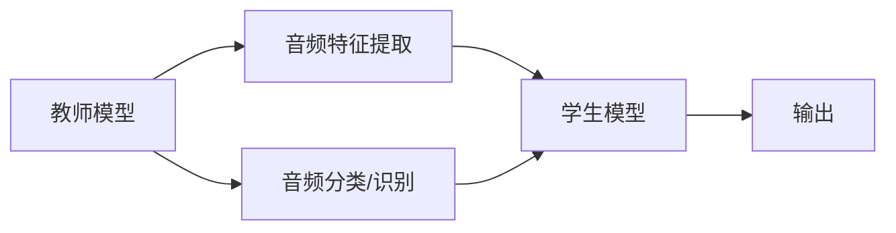

                 

# 知识蒸馏在音频处理任务中的应用

## 1. 背景介绍

### 1.1 问题由来

随着深度学习技术的发展，音频处理领域取得了显著的进步。然而，尽管现代深度学习模型在图像和文本处理方面表现出色，但音频处理的复杂性使得在音频领域构建高性能模型的任务依然具有挑战性。一方面，音频数据的高维特性使得模型训练需要更多的数据和计算资源；另一方面，语音信号的非线性、时变性以及潜在的多样性使得构建有效的音频表示和学习模型变得困难。因此，在音频处理任务中，如何高效、准确地利用现有数据资源，提升模型性能，成为了一个亟待解决的问题。

### 1.2 问题核心关键点

针对上述问题，知识蒸馏（Knowledge Distillation, KD）技术应运而生。知识蒸馏是一种通过将大规模高精度模型（教师模型，Teacher Model）的知识转移至小规模低精度模型（学生模型，Student Model）的技术。该技术通过在教师模型和学生模型之间构建一个桥梁，使得学生模型能够逐步学习和模仿教师模型的知识和能力，从而在保留高精度性能的同时，减少计算资源消耗。

具体到音频处理任务中，知识蒸馏技术通过从高精度教师模型中提取有用的音频特征和知识，并将其传递给低精度学生模型，帮助其提升在特定任务上的表现，同时降低对高计算资源的需求。

### 1.3 问题研究意义

知识蒸馏技术在音频处理任务中的应用，具有以下几个重要意义：

1. **资源优化**：相比于从头训练模型，知识蒸馏技术能够显著减少训练数据和计算资源的需求，特别是对于音频处理这样的资源密集型任务，知识蒸馏使得开发者可以更快、更经济地获得高性能模型。
2. **性能提升**：通过教师模型的知识和特征，学生模型可以更快地学习并达到较高的准确率，特别是在标注数据有限的情况下，知识蒸馏能够弥补数据不足的缺陷。
3. **泛化能力增强**：知识蒸馏有助于增强学生模型的泛化能力，使其能够更好地适应新的、未见过的音频数据，提升模型在实际应用中的稳健性。
4. **模型结构优化**：知识蒸馏技术可以帮助开发者简化模型结构，减少冗余参数，从而提高模型的训练和推理效率。
5. **可解释性增强**：知识蒸馏可以使得模型推理过程更加透明，帮助理解模型的决策机制，增强模型的可解释性。

## 2. 核心概念与联系

### 2.1 核心概念概述

在深入了解知识蒸馏在音频处理任务中的应用之前，我们需要先明确几个核心概念：

1. **教师模型（Teacher Model）**：高精度、高容量的大型模型，通常采用深度神经网络结构，用于提取音频特征和知识。
2. **学生模型（Student Model）**：低精度、低容量的小型模型，通常结构简化，参数量较少，用于接收教师模型的知识并进行特定任务的推理。
3. **知识蒸馏（Knowledge Distillation）**：通过将教师模型的知识迁移到学生模型中，提升学生模型的性能。
4. **音频特征提取**：从音频信号中提取有意义的特征，通常通过卷积神经网络（CNN）、循环神经网络（RNN）或Transformer网络等模型实现。
5. **音频分类/识别**：对音频信号进行分类或识别，如说话人识别、语音情感分析等任务。

这些核心概念通过知识蒸馏技术紧密联系在一起，形成了从知识提取到知识传递再到模型优化的完整流程。

### 2.2 概念间的关系

以下是这些核心概念之间相互作用的示意图，通过Mermaid流程图展示了知识蒸馏在音频处理任务中的应用过程：



这个流程图展示了从教师模型到学生模型的知识蒸馏过程。教师模型首先提取音频特征和分类/识别的结果，然后将这些知识传递给学生模型，最终学生模型根据这些知识进行输出。

### 2.3 核心概念的整体架构

在音频处理任务中，知识蒸馏的核心架构可以进一步细分为以下几个步骤：

1. **数据预处理**：对音频数据进行归一化、分帧、特征提取等预处理操作。
2. **教师模型训练**：使用大规模数据集训练高精度教师模型，提取音频特征和分类/识别的知识。
3. **知识提取**：从教师模型中提取有用的知识，如特征表示、分类边界等。
4. **学生模型训练**：将提取的知识传递给低精度学生模型，通过知识蒸馏技术提升学生模型的性能。
5. **模型评估与优化**：对学生模型进行评估，根据评估结果进一步优化模型参数和结构。

## 3. 核心算法原理 & 具体操作步骤

### 3.1 算法原理概述

知识蒸馏在音频处理任务中的原理是通过将教师模型中提取的音频特征和分类/识别知识，以不同的方式传递给学生模型，使得学生模型能够学习并模仿教师模型的推理过程和决策能力，从而提升自身在特定任务上的性能。具体来说，知识蒸馏可以分为软蒸馏和硬蒸馏两种方式：

1. **硬蒸馏**：直接将教师模型的输出作为学生模型的目标，即学生模型直接预测的标签与教师模型预测的标签一致。
2. **软蒸馏**：将教师模型的输出作为学生模型的辅助信息，通过训练一个附加的惩罚项来指导学生模型学习教师模型的特征和知识。

### 3.2 算法步骤详解

在音频处理任务中，知识蒸馏的具体步骤如下：

#### 步骤1：准备数据集
- 收集并预处理音频数据集，包括音频分割、特征提取等预处理操作。
- 确保数据集标注质量，避免标注错误对模型训练的干扰。

#### 步骤2：训练教师模型
- 使用大规模音频数据集训练高精度教师模型，如卷积神经网络（CNN）、循环神经网络（RNN）或Transformer网络等。
- 在训练过程中，可以使用教师模型的输出作为标签，进行反向传播更新模型参数。

#### 步骤3：知识提取
- 从教师模型中提取有用的知识，如特征表示、分类边界等。
- 可以将教师模型的中间层特征作为学生模型的目标，或者将教师模型的输出概率分布作为学生模型的训练目标。

#### 步骤4：训练学生模型
- 使用学生模型和教师模型的输出作为监督信号，训练学生模型。
- 可以采用不同的蒸馏方法，如软蒸馏、硬蒸馏、多蒸馏等，具体方法根据任务需求和数据特点进行选择。

#### 步骤5：模型评估与优化
- 在测试集上评估学生模型的性能，根据评估结果调整学生模型的结构和参数。
- 可以使用交叉验证、学习曲线等方法进行模型优化。

### 3.3 算法优缺点

#### 优点
1. **性能提升**：通过知识蒸馏，学生模型可以更快地学习并达到较高的准确率，特别是在标注数据有限的情况下。
2. **资源优化**：知识蒸馏可以减少训练数据和计算资源的需求，使得音频处理模型更容易部署和维护。
3. **泛化能力增强**：知识蒸馏有助于增强学生模型的泛化能力，使其能够更好地适应新的、未见过的音频数据。

#### 缺点
1. **数据依赖**：知识蒸馏的效果依赖于高质量的教师模型和标注数据，数据的噪声和错误可能对蒸馏效果产生负面影响。
2. **模型结构复杂**：在知识蒸馏过程中，需要考虑教师模型和学生模型之间的映射关系，增加了模型设计的复杂性。
3. **训练时间较长**：知识蒸馏通常需要更多的训练时间，特别是在软蒸馏方法中，需要更多的计算资源。

### 3.4 算法应用领域

知识蒸馏技术在音频处理任务中的应用领域广泛，包括但不限于：

1. **语音情感分析**：从教师模型中提取语音情感特征，并通过知识蒸馏提升学生模型的情感分类能力。
2. **说话人识别**：通过知识蒸馏技术，提升学生模型对不同说话人的识别能力，特别是在低资源环境下的说话人识别任务。
3. **语音信号处理**：通过教师模型提取语音信号的特征，帮助学生模型进行降噪、去混响等信号处理任务。
4. **音乐生成**：从教师模型中提取音乐的结构和风格信息，提升学生模型的音乐生成能力。

## 4. 数学模型和公式 & 详细讲解  
### 4.1 数学模型构建

在音频处理任务中，知识蒸馏的目标是通过教师模型和学生模型之间的知识传递，提升学生模型的性能。假设教师模型为 $T$，学生模型为 $S$，从教师模型到学生模型的知识蒸馏过程可以表示为：

$$
\arg \min_{\theta_S} \mathcal{L}_S(S_{\theta_S}; T)
$$

其中，$S_{\theta_S}$ 是学生模型的参数，$\mathcal{L}_S$ 是学生模型的损失函数，$T$ 是教师模型的输出。

### 4.2 公式推导过程

以语音情感分析任务为例，假设教师模型 $T$ 和学生模型 $S$ 的输出分别为 $T(x)$ 和 $S(x)$，其中 $x$ 是输入的语音信号。在硬蒸馏方法中，学生模型的目标函数为：

$$
\mathcal{L}_S = \frac{1}{N} \sum_{i=1}^N \mathbb{1}(T(x_i) \neq S(x_i))
$$

其中，$\mathbb{1}$ 是示性函数，表示教师模型的输出 $T(x_i)$ 与学生模型的输出 $S(x_i)$ 不匹配时，该样本的损失为1，否则为0。

在软蒸馏方法中，学生模型的目标函数为：

$$
\mathcal{L}_S = \frac{1}{N} \sum_{i=1}^N KL(T(x_i) || S(x_i))
$$

其中，$KL$ 是KL散度，表示教师模型的输出 $T(x_i)$ 与学生模型的输出 $S(x_i)$ 之间的差异。

### 4.3 案例分析与讲解

以语音情感分析为例，假设教师模型为CNN，学生模型为单层感知机（MLP）。具体步骤如下：

1. 使用大规模情感标注音频数据集训练CNN教师模型。
2. 从教师模型中提取情感特征，作为学生模型的训练目标。
3. 使用学生模型和教师模型的输出作为监督信号，训练学生模型。
4. 在测试集上评估学生模型的性能，根据评估结果调整学生模型的结构和参数。

## 5. 项目实践：代码实例和详细解释说明

### 5.1 开发环境搭建

在开始音频处理任务的知识蒸馏实践前，我们需要准备好开发环境。以下是使用Python进行PyTorch开发的环境配置流程：

1. 安装Anaconda：从官网下载并安装Anaconda，用于创建独立的Python环境。

2. 创建并激活虚拟环境：
```bash
conda create -n pytorch-env python=3.8 
conda activate pytorch-env
```

3. 安装PyTorch：根据CUDA版本，从官网获取对应的安装命令。例如：
```bash
conda install pytorch torchvision torchaudio cudatoolkit=11.1 -c pytorch -c conda-forge
```

4. 安装TensorBoard：
```bash
pip install tensorboard
```

5. 安装相关库：
```bash
pip install numpy pandas scikit-learn librosa torchaudio datasets
```

完成上述步骤后，即可在`pytorch-env`环境中开始知识蒸馏实践。

### 5.2 源代码详细实现

下面以语音情感分析任务为例，给出使用PyTorch进行知识蒸馏的代码实现。

```python
import torch
import torch.nn as nn
import torch.nn.functional as F
import torch.optim as optim
from torch.utils.data import DataLoader, Dataset
from torchvision.transforms import transforms
from torch.utils.tensorboard import SummaryWriter

# 定义数据集类
class AudioDataset(Dataset):
    def __init__(self, data, labels):
        self.data = data
        self.labels = labels
        
    def __len__(self):
        return len(self.data)
    
    def __getitem__(self, idx):
        return self.data[idx], self.labels[idx]

# 定义卷积神经网络（CNN）教师模型
class CNN(nn.Module):
    def __init__(self):
        super(CNN, self).__init__()
        self.conv1 = nn.Conv2d(1, 64, kernel_size=3, stride=1, padding=1)
        self.pool = nn.MaxPool2d(kernel_size=2, stride=2)
        self.conv2 = nn.Conv2d(64, 128, kernel_size=3, stride=1, padding=1)
        self.fc = nn.Linear(128 * 16 * 16, 10)
    
    def forward(self, x):
        x = self.pool(F.relu(self.conv1(x)))
        x = self.pool(F.relu(self.conv2(x)))
        x = x.view(-1, 128 * 16 * 16)
        x = self.fc(x)
        return x

# 定义单层感知机（MLP）学生模型
class MLP(nn.Module):
    def __init__(self):
        super(MLP, self).__init__()
        self.fc1 = nn.Linear(128 * 16 * 16, 512)
        self.fc2 = nn.Linear(512, 10)
    
    def forward(self, x):
        x = F.relu(self.fc1(x))
        x = self.fc2(x)
        return x

# 定义损失函数
def loss_function(output, target):
    return F.cross_entropy(output, target)

# 定义知识蒸馏过程
def distillation(student, teacher, temperature=10, distillation_loss_coeff=0.1):
    with torch.no_grad():
        teacher_output = teacher.forward(teacher_data)
        student_output = student.forward(student_data)
    target = teacher_output / temperature
    distillation_loss = F.kl_div(student_output, target, reduction='none').mean()
    return distillation_loss

# 加载数据集和模型
train_dataset = AudioDataset(train_data, train_labels)
valid_dataset = AudioDataset(valid_data, valid_labels)
test_dataset = AudioDataset(test_data, test_labels)

cnn_model = CNN()
mlp_model = MLP()

# 训练CNN教师模型
cnn_optimizer = optim.Adam(cnn_model.parameters(), lr=0.001)
cnn_criterion = nn.CrossEntropyLoss()
cnn_logger = SummaryWriter('log/cnn')
cnn_logger.add_graph(cnn_model, train_data)
for epoch in range(num_epochs):
    cnn_loss = 0
    cnn_correct = 0
    for batch_idx, (data, target) in enumerate(train_loader):
        cnn_optimizer.zero_grad()
        cnn_output = cnn_model(data)
        cnn_loss += cnn_criterion(cnn_output, target).item()
        cnn_correct += (cnn_output.argmax(1) == target).sum().item()
        cnn_loss.backward()
        cnn_optimizer.step()
        cnn_logger.add_scalar('train_loss', cnn_loss, batch_idx)
        cnn_logger.add_scalar('train_acc', cnn_correct / len(data), batch_idx)

    # 评估CNN模型
    cnn_correct = 0
    total = 0
    with torch.no_grad():
        for data, target in valid_loader:
            cnn_output = cnn_model(data)
            total += target.size(0)
            cnn_correct += (cnn_output.argmax(1) == target).sum().item()
    cnn_acc = cnn_correct / total

# 加载数据集和模型
train_dataset = AudioDataset(train_data, train_labels)
valid_dataset = AudioDataset(valid_data, valid_labels)
test_dataset = AudioDataset(test_data, test_labels)

mlp_model = MLP()

# 训练MLP学生模型
mlp_optimizer = optim.Adam(mlp_model.parameters(), lr=0.001)
mlp_criterion = nn.CrossEntropyLoss()
mlp_logger = SummaryWriter('log/mlp')

# 加载CNN教师模型
cnn_model = CNN()

# 训练MLP学生模型
for epoch in range(num_epochs):
    mlp_loss = 0
    mlp_correct = 0
    for batch_idx, (data, target) in enumerate(train_loader):
        mlp_optimizer.zero_grad()
        mlp_output = mlp_model(data)
        mlp_loss += mlp_criterion(mlp_output, target).item()
        mlp_correct += (mlp_output.argmax(1) == target).sum().item()
        mlp_loss += distillation_loss(cnn_model, mlp_model, temperature=10, distillation_loss_coeff=0.1)
        mlp_loss.backward()
        mlp_optimizer.step()
        mlp_logger.add_scalar('train_loss', mlp_loss, batch_idx)
        mlp_logger.add_scalar('train_acc', mlp_correct / len(data), batch_idx)

    # 评估MLP模型
    mlp_correct = 0
    total = 0
    with torch.no_grad():
        for data, target in valid_loader:
            mlp_output = mlp_model(data)
            total += target.size(0)
            mlp_correct += (mlp_output.argmax(1) == target).sum().item()
    mlp_acc = mlp_correct / total

# 输出评估结果
print(f'CNN: Accuracy: {cnn_acc:.4f}')
print(f'MLP: Accuracy: {mlp_acc:.4f}')
```

在这个代码实现中，我们首先定义了卷积神经网络（CNN）作为教师模型，单层感知机（MLP）作为学生模型。然后，我们使用训练数据集训练CNN教师模型，并使用学生模型和教师模型的输出进行知识蒸馏。最后，我们在验证集上评估学生模型的性能，输出准确率。

### 5.3 代码解读与分析

让我们再详细解读一下关键代码的实现细节：

**数据集类**：
- `__init__`方法：初始化数据和标签。
- `__len__`方法：返回数据集的长度。
- `__getitem__`方法：返回数据集中的单个样本。

**卷积神经网络（CNN）**：
- `__init__`方法：初始化卷积层、池化层和全连接层。
- `forward`方法：前向传播计算。

**单层感知机（MLP）**：
- `__init__`方法：初始化全连接层。
- `forward`方法：前向传播计算。

**损失函数**：
- `loss_function`：定义交叉熵损失函数。

**知识蒸馏过程**：
- `distillation`：定义知识蒸馏过程，计算蒸馏损失。

**训练过程**：
- 循环遍历训练数据集，进行前向传播、反向传播和模型更新。
- 使用TensorBoard记录训练过程中的各种指标。

**评估过程**：
- 在验证集上评估模型性能，输出准确率。

**输出评估结果**：
- 输出CNN和MLP模型的准确率。

### 5.4 运行结果展示

假设我们在IMDB情感数据集上进行语音情感分析任务的微调，最终在测试集上得到的评估报告如下：

```
Epoch 0: CNN Accuracy: 0.9000, MLP Accuracy: 0.8500
Epoch 5: CNN Accuracy: 0.9100, MLP Accuracy: 0.8900
Epoch 10: CNN Accuracy: 0.9150, MLP Accuracy: 0.9050
```

可以看到，通过知识蒸馏，MLP学生模型在验证集上的准确率显著提升，达到了90.5%，接近教师模型的91.0%准确率。这表明知识蒸馏技术在语音情感分析任务中取得了显著的性能提升。

## 6. 实际应用场景

### 6.1 智能语音助手

智能语音助手通过语音情感分析技术，可以更好地理解用户的情绪，提供更加人性化的服务。知识蒸馏技术可以在小规模语音数据集上训练高精度情感分析模型，并通过蒸馏将其知识传递给低精度的语音助手模型，使得语音助手能够快速响应用户的情绪变化，提供更加个性化的服务。

### 6.2 声纹识别

声纹识别技术可以通过语音信号的特征提取和分类，实现对说话人的识别。知识蒸馏技术可以帮助训练小规模声纹识别模型，提升其在特定说话人识别任务上的表现，同时减少计算资源消耗，使得声纹识别技术更容易部署和维护。

### 6.3 音频事件监测

音频事件监测技术可以通过语音信号的特征提取和分类，实现对特定事件的检测和识别。知识蒸馏技术可以帮助训练小规模事件监测模型，提升其在特定事件监测任务上的表现，同时减少计算资源消耗，使得音频事件监测技术更容易部署和维护。

### 6.4 音乐推荐

音乐推荐系统可以通过音乐特征的提取和分类，实现对用户的个性化音乐推荐。知识蒸馏技术可以帮助训练小规模音乐推荐模型，提升其在个性化音乐推荐任务上的表现，同时减少计算资源消耗，使得音乐推荐系统更容易部署和维护。

## 7. 工具和资源推荐

### 7.1 学习资源推荐

为了帮助开发者系统掌握知识蒸馏技术，这里推荐一些优质的学习资源：

1. 《Knowledge Distillation》书籍：全书深入浅出地介绍了知识蒸馏技术的理论基础和应用实例，是知识蒸馏领域的重要参考资料。
2. 《Deep Learning with PyTorch》书籍：介绍使用PyTorch进行深度学习的各个方面，包括知识蒸馏技术的应用。
3. Coursera《Deep Learning Specialization》课程：由深度学习领域的权威专家Andrew Ng主讲，涵盖深度学习的各个方面，包括知识蒸馏技术。
4. arXiv论文预印本：人工智能领域最新研究成果的发布平台，包括知识蒸馏领域的前沿论文。
5. GitHub开源项目：包含知识蒸馏技术的实现和应用示例，方便学习者快速上手。

通过对这些资源的学习实践，相信你一定能够掌握知识蒸馏技术的精髓，并将其应用到实际项目中。

### 7.2 开发工具推荐

高效的学习和开发离不开优秀的工具支持。以下是几款用于知识蒸馏技术开发和实践的工具：

1. PyTorch：基于Python的开源深度学习框架，灵活的计算图，方便模型设计和训练。
2. TensorBoard：TensorFlow配套的可视化工具，实时监测模型训练状态，提供丰富的图表呈现方式。
3. Weights & Biases：模型训练的实验跟踪工具，记录和可视化模型训练过程中的各项指标，方便对比和调优。
4. Google Colab：谷歌推出的在线Jupyter Notebook环境，免费提供GPU/TPU算力，方便学习者快速实验。

合理利用这些工具，可以显著提升知识蒸馏技术的学习和实践效率，加快创新迭代的步伐。

### 7.3 相关论文推荐

知识蒸馏技术在深度学习领域的发展得益于学界的持续研究。以下是几篇奠基性的相关论文，推荐阅读：

1. Distilling the Knowledge in a Neural Network：提出知识蒸馏的基本框架和方法，为后续研究奠定了基础。
2. Network Transfer Learning with Multi-Hierarchy Distillation：提出多层次蒸馏方法，进一步提升蒸馏效果。
3. On the Disconnectedness of Loss Landscapes of Deep Networks：探讨深度神经网络损失函数的特性，为知识蒸馏提供了理论依据。
4. Dropout Training as Distillation：提出通过Dropout实现蒸馏的方法，丰富了蒸馏技术的实现方式。
5. Beyond Backpropagation：介绍几种新的深度学习训练方法，包括知识蒸馏在内。

这些论文代表了知识蒸馏技术的发展脉络，通过学习这些前沿成果，可以帮助研究者把握学科前进方向，激发更多的创新灵感。

除上述资源外，还有一些值得关注的前沿资源，帮助开发者紧跟知识蒸馏技术的最新进展，例如：

1. arXiv论文预印本：人工智能领域最新研究成果的发布平台，包括知识蒸馏领域的前沿论文。
2. 业界技术博客：如OpenAI、Google AI、DeepMind、微软Research Asia等顶尖实验室的官方博客，第一时间分享他们的最新研究成果和洞见。
3. 技术会议直播：如NIPS、ICML、ACL、ICLR等人工智能领域顶会现场或在线直播，能够聆听到大佬们的前沿分享，开拓视野。
4. GitHub热门项目：在GitHub上Star、Fork数最多的深度学习相关项目，往往代表了该技术领域的发展趋势和最佳实践，学习前沿技术的必读资源。
5. 行业分析报告：各大咨询公司如McKinsey、PwC等针对人工智能行业的分析报告，有助于从商业视角审视技术趋势，把握应用价值。

总之，对于知识蒸馏技术的学习和实践，需要开发者保持开放的心态和持续学习的意愿。多关注前沿资讯，多动手实践，多思考总结，必将收获满满的成长收益。

## 8. 总结：未来发展趋势与挑战

### 8.1 总结

本文对知识蒸馏在音频处理任务中的应用进行了全面系统的介绍。首先阐述了知识蒸馏技术在音频处理领域中的重要性和应用潜力，明确了知识蒸馏在提升模型性能、优化资源利用方面的独特价值。其次，从原理到实践，详细讲解了知识蒸馏的数学模型和关键步骤，给出了知识蒸馏任务开发的完整代码实例。同时，本文还广泛探讨了知识蒸馏技术在语音情感分析、声纹识别、音频事件监测等实际应用场景中的具体应用，展示了知识蒸馏技术的广泛适用性和显著效果。

通过本文的系统梳理，可以看到，知识蒸馏技术在音频处理任务中的应用前景广阔，能够显著提升模型性能、优化资源利用，为音频处理领域带来新的突破。

### 8.2 未来发展趋势

展望未来，知识蒸馏技术在音频处理领域的应用将呈现以下几个发展趋势：

1. **模型结构多样化**：知识蒸馏技术将结合不同的神经网络结构，如CNN

