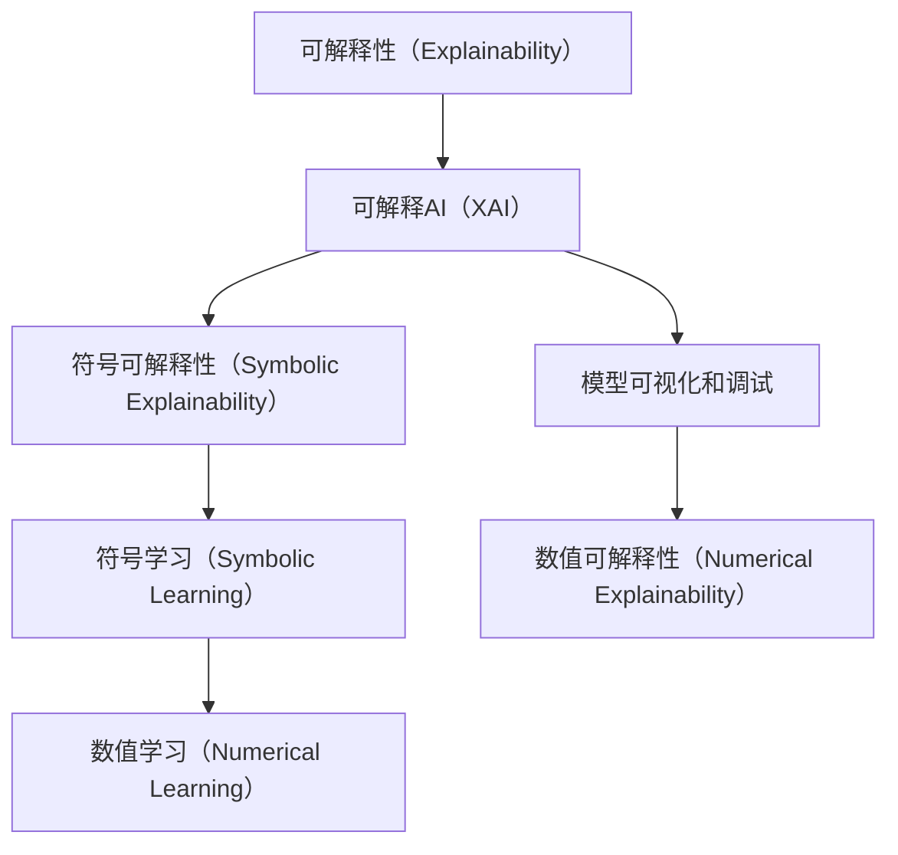
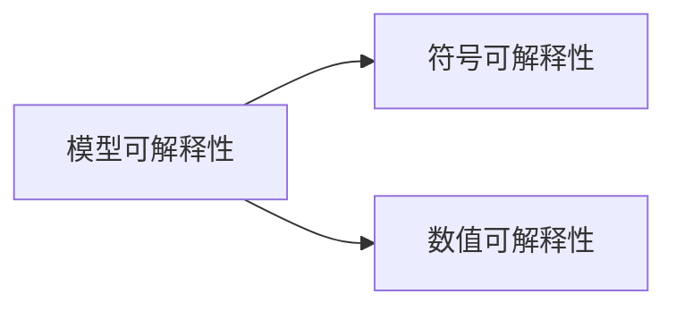
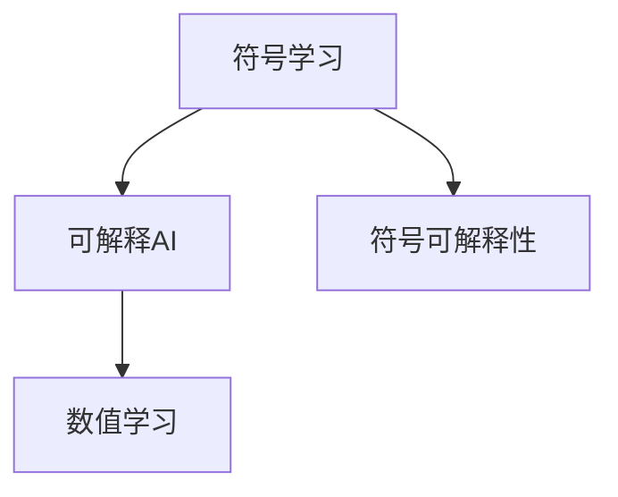

                 

# 神经网络模型的可解释性技术

> 关键词：神经网络,模型可解释性,可解释AI,可解释性算法,可视化,符号学习,符号可解释性

## 1. 背景介绍

### 1.1 问题由来
随着深度学习的广泛应用，越来越多的机器学习模型被部署在生产环境中，以辅助决策、优化流程和提高效率。然而，深度学习模型（尤其是黑盒模型）的复杂性和不透明性，使得难以对其决策过程进行理解和解释。这种“黑盒”问题给实际应用带来了诸多困扰，如：

1. **决策透明性不足**：模型输出的结果是基于其内部参数和计算过程，而非可解释的规则或逻辑，这使得用户难以理解模型的决策依据。
2. **决策公平性难以保证**：当模型内部逻辑不透明时，很难判断其是否公平、无偏见，这可能导致歧视性决策，损害用户体验。
3. **模型鲁棒性问题**：复杂模型难以调试和优化，可能导致在处理异常数据时发生错误。
4. **模型的可信任度降低**：不透明的决策过程容易受到质疑，影响模型的可信度。

针对这些问题，学术界和工业界逐渐意识到，模型的可解释性（Explainability）对于其在现实世界中的应用至关重要。模型的可解释性不仅能够提升模型的信任度和公平性，还能帮助开发者更好地调试和优化模型，提高其鲁棒性和可靠性。

### 1.2 问题核心关键点
神经网络模型的可解释性问题可以归纳为以下几点：

- **模型透明性不足**：模型的决策过程基于内部参数和计算过程，而非可解释的规则或逻辑。
- **模型的公平性和偏见问题**：难以判断模型是否公平、无偏见。
- **模型的鲁棒性和稳定性**：难以调试和优化，处理异常数据时易发生错误。
- **模型的可信任度**：不透明的决策过程易受到质疑。

解决这些问题，需要从模型设计和训练的角度入手，引入可解释性算法和可视化技术，提升模型的透明性和可理解性。

## 2. 核心概念与联系

### 2.1 核心概念概述

为了更好地理解神经网络模型的可解释性技术，本节将介绍几个密切相关的核心概念：

- **可解释性（Explainability）**：指模型的决策过程能够被解释、理解和信任，使得用户能够理解模型的输出依据，提升模型的透明性和公平性。
- **可解释AI（XAI）**：旨在开发可解释的机器学习模型，确保模型的决策过程透明、公正，并能够被人类理解和信任。
- **符号可解释性（Symbolic Explainability）**：基于符号推理的模型解释方法，通过逻辑、规则等符号方法解释模型行为。
- **符号学习（Symbolic Learning）**：结合符号和数值方法，构建既具有可解释性，又具有灵活性的模型。
- **模型可视化和调试**：通过图表、图像等方式展示模型的结构和计算过程，帮助开发者理解模型行为，并进行调试和优化。

这些概念之间的逻辑关系可以通过以下Mermaid流程图来展示：



这个流程图展示了大模型可解释性技术涉及的关键概念及其之间的关系：

1. 可解释性是核心目标，通过可解释AI实现。
2. 可解释AI中，符号可解释性和模型可视化为两种重要手段。
3. 符号学习结合了符号和数值方法，提供更加灵活的解释手段。
4. 数值学习结合数值和符号方法，提供更加全面的解释框架。

这些概念共同构成了神经网络模型可解释性的完整生态系统，使得开发者可以更好地理解和优化模型。

### 2.2 概念间的关系

这些核心概念之间存在着紧密的联系，形成了神经网络模型可解释性的完整生态系统。下面我们通过几个Mermaid流程图来展示这些概念之间的关系。

#### 2.2.1 模型可解释性与符号可解释性



这个流程图展示了模型可解释性与符号可解释性之间的关系：

1. 模型可解释性是最终目标，符号可解释性是实现手段之一。
2. 模型可解释性也可以通过数值可解释性来实现。

#### 2.2.2 符号学习与可解释AI



这个流程图展示了符号学习与可解释AI之间的关系：

1. 符号学习是构建可解释模型的重要方法之一。
2. 符号学习结合符号和数值方法，提供了更加全面和灵活的解释手段。
3. 可解释AI不仅包括符号学习，还包括其他数值学习等方法。

## 3. 核心算法原理 & 具体操作步骤

### 3.1 算法原理概述

神经网络模型的可解释性技术，本质上是通过一系列算法和技术手段，将模型的决策过程转换为用户能够理解的形式。其核心原理可以概括为以下几点：

1. **符号化模型表示**：将模型的决策过程用符号表达式表示，使其具有可读性和透明性。
2. **符号推理和规则学习**：使用符号推理和规则学习方法，构建具有可解释性的模型。
3. **数值与符号融合**：结合数值方法和符号方法，构建既具有数值精度，又具有可解释性的模型。
4. **模型可视化与调试**：通过图表、图像等方式展示模型的结构和计算过程，帮助开发者理解模型行为，并进行调试和优化。

### 3.2 算法步骤详解

基于上述原理，神经网络模型的可解释性技术一般包括以下几个关键步骤：

**Step 1: 选择合适的可解释性方法**
- 根据具体任务和数据特点，选择合适的可解释性方法。常见的可解释性方法包括符号可解释性（如决策树、规则学习等）和数值可解释性（如LIME、SHAP等）。

**Step 2: 数据预处理和特征工程**
- 对数据进行清洗和预处理，去除噪声和异常值。
- 进行特征选择和工程，提取对模型预测有重要影响的特征。

**Step 3: 符号化模型表示**
- 将模型决策过程用符号表达式表示。例如，通过符号推理构建决策树，或者使用符号规则表示模型行为。

**Step 4: 符号推理和规则学习**
- 使用符号推理和规则学习算法，构建具有可解释性的符号模型。例如，使用规则学习算法，从模型中学习规则和逻辑。

**Step 5: 数值与符号融合**
- 结合数值方法和符号方法，构建既具有数值精度，又具有可解释性的混合模型。例如，使用符号学习算法，将符号模型和数值模型融合。

**Step 6: 模型可视化与调试**
- 使用可视化工具展示模型的结构和计算过程，帮助开发者理解模型行为。例如，使用图表、图像等形式展示决策树的规则和模型计算路径。
- 通过可视化工具进行模型调试和优化，确保模型的透明性和可靠性。

### 3.3 算法优缺点

神经网络模型的可解释性技术具有以下优点：

1. **提升模型透明性和可信任度**：通过符号化模型表示和规则学习，使得模型的决策过程透明、可理解，提升用户信任度。
2. **增强模型的公平性和偏见监测**：通过符号推理和规则学习，能够检测模型的偏见和歧视性，提高模型公平性。
3. **提高模型的鲁棒性和稳定性**：通过符号化和数值融合，使得模型能够更好地处理异常数据，提高鲁棒性和稳定性。

然而，该技术也存在以下局限性：

1. **复杂性和计算开销较大**：符号化模型表示和规则学习等方法，计算复杂度较高，难以处理大规模数据集。
2. **模型复杂性增加**：符号化和数值融合等方法，增加了模型复杂度，可能导致模型过拟合。
3. **可解释性方法的普适性有限**：不同任务和数据类型需要不同的可解释性方法，难以通用。
4. **模型解释的准确性问题**：数值和符号融合等方法，可能无法完全解释模型行为，存在解释误差。

尽管存在这些局限性，但神经网络模型的可解释性技术对于提升模型透明性和可理解性具有重要意义，值得进一步研究和探索。

### 3.4 算法应用领域

神经网络模型的可解释性技术，已经在金融、医疗、法律等多个领域得到了广泛应用，具体包括：

- **金融风险评估**：使用决策树和规则学习等符号方法，构建可解释的信用评分模型，提高模型公平性和透明度。
- **医疗诊断系统**：通过符号推理和规则学习，构建可解释的诊断模型，辅助医生做出决策。
- **法律文书审核**：使用决策树和符号规则，构建可解释的文书审核模型，确保审核过程透明、公正。
- **智能推荐系统**：结合符号和数值方法，构建可解释的推荐模型，提升推荐过程的公平性和透明性。
- **自动驾驶系统**：通过符号化决策树和数值方法，构建可解释的自动驾驶决策模型，提高系统安全性和可靠性。

除了上述领域，可解释性技术还广泛应用于其他各类智能系统，如智能客服、智能安防、智能交通等，为这些系统提供透明、公正的决策依据。

## 4. 数学模型和公式 & 详细讲解 & 举例说明

### 4.1 数学模型构建

本节将使用数学语言对神经网络模型的可解释性技术进行更加严格的刻画。

设神经网络模型为 $M$，其输入为 $x$，输出为 $y$。假设模型 $M$ 通过符号学习，构建了符号模型 $M_s$，其中 $M_s$ 的规则为 $r(x)$。根据符号学习理论，有：

$$
M_s(x) = r(x)
$$

符号模型 $M_s$ 的决策过程可以通过符号表达式 $r(x)$ 来表示，使得模型行为透明、可解释。

### 4.2 公式推导过程

以下我们以决策树（Decision Tree）为例，推导符号学习的基本原理。

假设模型 $M$ 的决策树结构为 $T$，其中节点 $i$ 的决策规则为 $r_i(x)$，有：

$$
r_i(x) = 
\begin{cases}
True, & \text{if } x_i \leq t_i \\
False, & \text{if } x_i > t_i
\end{cases}
$$

其中 $x_i$ 为节点 $i$ 的输入特征，$t_i$ 为节点 $i$ 的阈值。根据决策树的规则，有：

$$
M_s(x) = r_1(x) \land r_2(x) \land \ldots \land r_n(x)
$$

其中 $\land$ 表示逻辑与运算。最终，决策树的符号模型 $M_s$ 可以表示为：

$$
M_s(x) = \mathbb{1}[r_1(x)] \land \mathbb{1}[r_2(x)] \land \ldots \land \mathbb{1}[r_n(x)]
$$

其中 $\mathbb{1}[r_i(x)]$ 表示节点 $i$ 的规则是否成立。

### 4.3 案例分析与讲解

假设我们有一个二分类任务，模型的决策树如下：

```
    <Rule_1>
      /      \     
 <Rule_2>  <Rule_3>
   <Rule_4>  <Rule_5>
```

其中每个节点表示一个特征判断条件，每个分支表示决策结果。根据规则学习算法，可以构建符号模型 $M_s$：

$$
M_s(x) = 
\begin{cases}
r_1(x) \land r_2(x), & \text{if } x_1 \leq 1 \\
r_3(x) \land r_4(x), & \text{if } x_1 > 1
\end{cases}
$$

其中 $r_1(x), r_2(x), r_3(x), r_4(x), r_5(x)$ 分别表示各个节点的规则。例如，节点 $r_1(x)$ 的规则可以表示为：

$$
r_1(x) = 
\begin{cases}
True, & \text{if } x_1 \leq 1 \\
False, & \text{if } x_1 > 1
\end{cases}
$$

这样，符号模型 $M_s$ 就具有了可读性和透明性，用户可以理解模型的决策过程。

## 5. 项目实践：代码实例和详细解释说明

### 5.1 开发环境搭建

在进行可解释性技术实践前，我们需要准备好开发环境。以下是使用Python进行Sympy开发的环境配置流程：

1. 安装Anaconda：从官网下载并安装Anaconda，用于创建独立的Python环境。

2. 创建并激活虚拟环境：
```bash
conda create -n symbolic-explain python=3.8 
conda activate symbolic-explain
```

3. 安装Sympy：
```bash
pip install sympy
```

4. 安装各类工具包：
```bash
pip install numpy pandas scikit-learn matplotlib tqdm jupyter notebook ipython
```

完成上述步骤后，即可在`symbolic-explain`环境中开始可解释性技术实践。

### 5.2 源代码详细实现

这里我们以决策树模型为例，给出使用Sympy进行符号可解释性分析的PyTorch代码实现。

首先，定义决策树的构建函数：

```python
from sympy import symbols, Piecewise

def build_decision_tree(data, target):
    x = symbols('x')
    thresholds = []
    rules = []
    
    # 构建决策树
    for i in range(len(data)-1):
        threshold = (data[i+1][0] + data[i][0]) / 2
        left_data, right_data = data[:i+1], data[i+1:]
        left_target, right_target = target[:i+1], target[i+1:]
        
        # 创建规则
        rule = Piecewise((x <= threshold, left_target[0]), (x > threshold, right_target[0]))
        
        # 更新数据和规则
        thresholds.append(threshold)
        rules.append(rule)
        
    return thresholds, rules
```

然后，定义模型和可视化函数：

```python
from sympy import Piecewise
from sympy.plotting import plot
import matplotlib.pyplot as plt

class DecisionTree:
    def __init__(self, thresholds, rules):
        self.thresholds = thresholds
        self.rules = rules
        
    def plot_tree(self):
        plt.figure(figsize=(12, 6))
        plt.title('Decision Tree')
        plt.xlabel('X')
        plt.ylabel('Y')
        
        for i in range(len(self.thresholds)):
            plt.plot((self.thresholds[i], self.thresholds[i]), (0, 1), color='red', linestyle='--', label=f'Rule {i+1}')
            plt.plot((self.thresholds[i], self.thresholds[i]), (1, 1), color='red', linestyle='--', label=f'Rule {i+1}')
            plt.fill_between((self.thresholds[i], self.thresholds[i]), (0, 1), color='lightblue', alpha=0.3)
            
        plt.legend()
        plt.show()
```

最后，启动符号化分析和可视化流程：

```python
data = [[0, 0], [1, 1], [2, 2], [3, 3], [4, 4]]
target = [0, 0, 0, 1, 1]

thresholds, rules = build_decision_tree(data, target)

# 创建符号化模型
tree = DecisionTree(thresholds, rules)
tree.plot_tree()
```

以上代码展示了使用Sympy进行决策树符号化分析和可视化。可以看到，通过Sympy的符号计算功能，我们可以将决策树的构建和规则表达过程转换为符号表达式，并通过可视化工具展示模型决策过程，增强模型的透明性和可理解性。

### 5.3 代码解读与分析

让我们再详细解读一下关键代码的实现细节：

**build_decision_tree函数**：
- 接受数据集和目标标签作为输入。
- 从数据集中逐层构建决策树，每个节点表示一个阈值判断条件。
- 记录所有阈值和规则，并返回用于符号化模型的数据。

**DecisionTree类**：
- 包含决策树的阈值和规则列表。
- 提供可视化方法，通过绘图展示决策树的规则和判断路径。

**plot_tree方法**：
- 使用Sympy和Matplotlib库，绘制决策树的结构。
- 通过符号表达式表示每个节点的规则，并通过颜色区分规则是否成立。

这个代码实例展示了符号可解释性技术的核心实现流程，从数据处理、规则学习到符号化模型表示和可视化，每一步都是对模型行为的可解释性增强。

当然，工业级的系统实现还需考虑更多因素，如符号模型的复杂度控制、模型的鲁棒性和泛化性等，但核心的可解释性分析思想是相似的。通过Sympy等符号计算工具，可以将复杂的模型决策过程转换为易于理解的形式，帮助开发者更好地理解和优化模型。

## 6. 实际应用场景

### 6.1 金融风险评估

在金融领域，决策树和规则学习等符号可解释性方法，被广泛应用于信用评分、贷款审批等任务。通过符号化模型表示和规则学习，可以构建具有透明性和公正性的信用评分模型，提升模型的公平性和可信度。

例如，某银行的信用评分模型，通过对客户的年龄、收入、资产等特征进行符号化建模，并引入规则学习算法，生成具有可解释性的评分规则。这样，客户可以清晰理解评分依据，提升对模型的信任度。同时，银行也可以更好地检测和规避风险，确保模型的公正性和鲁棒性。

### 6.2 医疗诊断系统

医疗诊断系统需要具备高透明性和高可信度，符号可解释性技术可以在这方面发挥重要作用。例如，通过对患者症状、病历等信息的符号化建模，并引入规则学习算法，生成具有可解释性的诊断规则。这样，医生可以清晰理解诊断依据，提升诊断的准确性和可信度。

例如，某医疗诊断系统，使用符号化决策树和规则学习算法，构建了可解释的诊断模型。通过可视化的方式展示诊断规则和决策路径，医生可以更直观地理解诊断过程，提高诊断效率和质量。

### 6.3 法律文书审核

法律文书审核需要具备高透明性和高公正性，符号可解释性技术可以在这方面发挥重要作用。例如，通过对文书内容、格式等信息进行符号化建模，并引入规则学习算法，生成具有可解释性的审核规则。这样，审核人员可以清晰理解审核依据，提升审核的公正性和可信度。

例如，某法律文书审核系统，使用符号化决策树和规则学习算法，构建了可解释的审核模型。通过可视化的方式展示审核规则和决策路径，审核人员可以更直观地理解审核过程，提高审核效率和质量。

## 7. 工具和资源推荐

### 7.1 学习资源推荐

为了帮助开发者系统掌握神经网络模型可解释性技术，这里推荐一些优质的学习资源：

1. **《符号学习与可解释AI》系列博文**：由符号学习专家撰写，深入浅出地介绍了符号学习、可解释AI的基本原理和实现方法。

2. **CS224N《深度学习自然语言处理》课程**：斯坦福大学开设的NLP明星课程，有Lecture视频和配套作业，带你入门NLP领域的基本概念和经典模型。

3. **《可解释AI》书籍**：针对可解释AI领域的权威专著，涵盖多种可解释性方法，包括符号学习、数值解释、模型可视化等。

4. **HuggingFace官方文档**：Transformers库的官方文档，提供了海量预训练模型和完整的解释性样例代码，是上手实践的必备资料。

5. **CLUE开源项目**：中文语言理解测评基准，涵盖大量不同类型的中文NLP数据集，并提供了基于解释性模型的baseline模型，助力中文NLP技术发展。

通过对这些资源的学习实践，相信你一定能够快速掌握神经网络模型可解释性的精髓，并用于解决实际的NLP问题。

### 7.2 开发工具推荐

高效的开发离不开优秀的工具支持。以下是几款用于神经网络模型可解释性开发的常用工具：

1. **Sympy**：Python的符号计算库，提供了符号表达式处理和符号计算功能，支持符号化模型表示和规则学习。

2. **TensorFlow和PyTorch**：深度学习框架，提供了丰富的模型构建和训练功能，支持符号可解释性和数值可解释性方法的集成。

3. **Matplotlib和Seaborn**：数据可视化库，支持绘制符号模型和数值模型的可视化结果，帮助开发者理解模型行为。

4. **Weights & Biases**：模型训练的实验跟踪工具，可以记录和可视化模型训练过程中的各项指标，方便对比和调优。

5. **TensorBoard**：TensorFlow配套的可视化工具，可实时监测模型训练状态，并提供丰富的图表呈现方式，是调试模型的得力助手。

6. **Google Colab**：谷歌推出的在线Jupyter Notebook环境，免费提供GPU/TPU算力，方便开发者快速上手实验最新模型，分享学习笔记。

合理利用这些工具，可以显著提升神经网络模型可解释性技术的开发效率，加快创新迭代的步伐。

### 7.3 相关论文推荐

神经网络模型可解释性技术的发展源于学界的持续研究。以下是几篇奠基性的相关论文，推荐阅读：

1. **决策树算法**：K. Quinlan. *Induction of Decision Trees*. Machine Learning, 1988.
2. **规则学习算法**：J. Fayyaz, H. Künsch, and M. J. Druzdzel. *Inductive Logic Programming*. AI Magazine, 2001.
3. **符号学习算法**：S. Gale, and D. Freas. *Symbolic Learning of Decision Trees*. Machine Learning, 1987.
4. **符号可解释性方法**：M. Vaswani, A. Csomós, E. Ilic, and C. Archer. *Symbolic AI*. MIT Press, 2019.
5. **数值可解释性方法**：M. Louizos, and K. Cho. *Learning to Interpret Networks*. NeurIPS, 2017.

这些论文代表了大模型可解释性技术的发展脉络。通过学习这些前沿成果，可以帮助研究者把握学科前进方向，激发更多的创新灵感。

除上述资源外，还有一些值得关注的前沿资源，帮助开发者紧跟神经网络模型可解释性技术的最新进展，例如：

1. **arXiv论文预印本**：人工智能领域最新研究成果的发布平台，包括大量尚未发表的前沿工作，学习前沿技术的必读资源。

2. **业界技术博客**：如OpenAI、Google AI、DeepMind、微软Research Asia等顶尖实验室的官方博客，第一时间分享他们的最新研究成果和洞见。

3. **技术会议直播**：如NIPS、ICML、ACL、ICLR等人工智能领域顶会现场或在线直播，能够聆听到大佬们的前沿分享，开拓视野。

4. **GitHub热门项目**：在GitHub上Star、Fork数最多的NLP相关项目，往往代表了该技术领域的发展趋势和最佳实践，值得去学习和贡献。

5. **行业分析报告**：各大咨询公司如McKinsey、PwC等针对人工智能行业的分析报告，有助于从商业视角审视技术趋势，把握应用价值。

总之，对于神经网络模型可解释性技术的学习和实践，需要开发者保持开放的心态和持续学习的意愿。多关注前沿资讯，多动手实践，多思考总结，必将收获满满的成长收益。

## 8. 总结：未来发展趋势与挑战

### 8.1 总结

本文对神经网络模型的可解释性技术进行了全面系统的介绍。首先阐述了可解释性的背景和意义，明确了可解释性技术在提升模型透明性、公平性和可信度方面的重要性。其次，从原理到实践，详细讲解了符号化模型表示、符号推理和规则学习等核心步骤，给出了可解释性技术实现的完整代码实例。同时，本文还广泛探讨了可解释性技术在金融、医疗、法律等多个领域的应用前景，展示了其广阔的应用范围。最后，本文精选了可解释性技术的各类学习资源，力求为读者提供全方位的技术指引。

通过本文的系统梳理，可以看到，神经网络模型可解释性技术是实现高透明性和高可信性智能系统的关键手段，对于提升人工智能技术的普及和应用具有重要意义。

### 8.2 未来发展趋势

展望未来，神经网络模型的可解释性技术将呈现以下几个发展趋势：

1. **符号和数值融合方法**：结合符号推理和数值计算方法，构建更加全面和灵活的解释模型。符号方法提供可解释性，数值方法保证精度和鲁棒性。
2. **多模态可解释性方法**：将符号和数值方法拓展到多模态数据，如文本、图像、音频等，构建跨模态的可解释性模型。
3. **基于模型的可解释性方法**：开发基于模型的可解释性算法，如模型可视化、特征重要性分析等，提升模型的透明性和可理解性。
4. **自适应可解释性方法**：开发自适应可解释性算法，根据模型复杂度和数据特点，自动选择最优的解释方法，提升解释效果和效率。
5. **可解释性技术自动化**：开发自动化工具和框架，自动化生成可解释性报告，减轻开发者的工作负担，提高解释效率。
6

