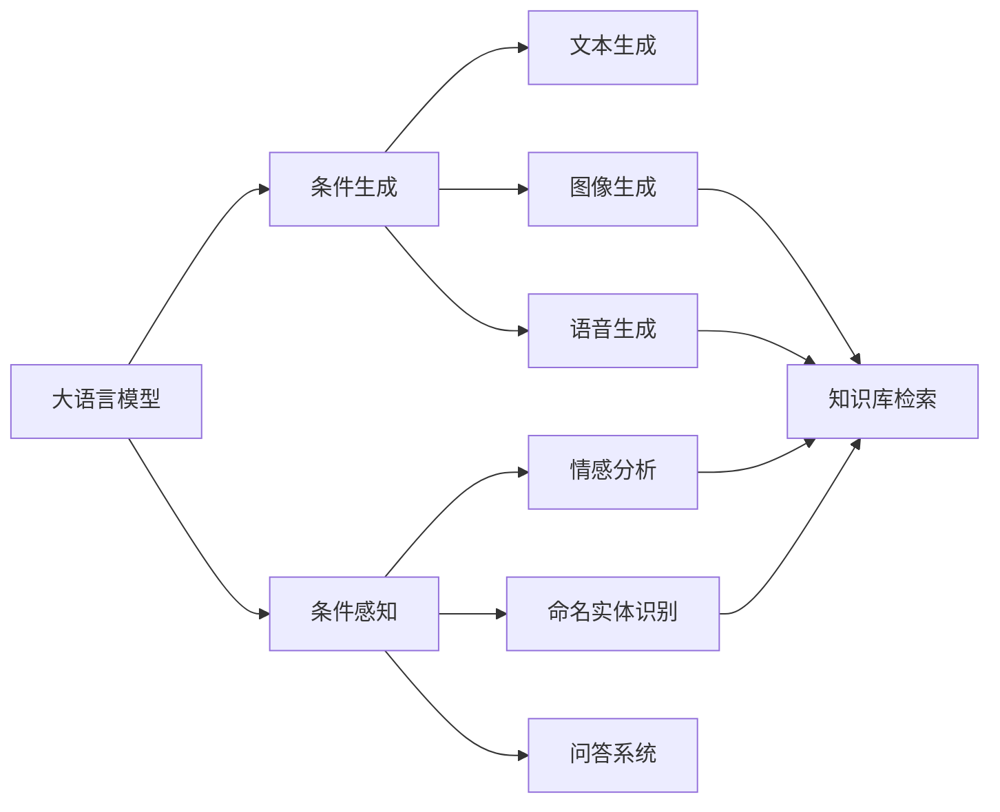

                 

# 大语言模型原理基础与前沿 条件计算

> 关键词：大语言模型, 条件计算, 条件生成, 条件感知, 深度学习, 自然语言处理, 语言模型, 数学模型, 代码实践, 应用场景

## 1. 背景介绍

### 1.1 问题由来

近年来，深度学习技术的快速发展，特别是在自然语言处理(Natural Language Processing, NLP)领域，已经取得显著的进展。这些进展主要得益于大规模预训练语言模型（Large Language Models, LLMs）的广泛应用，如OpenAI的GPT系列模型、Google的BERT等。这些模型通过在海量文本数据上进行预训练，学习到丰富的语言知识和常识，并在各种下游任务中展现出卓越的性能。

条件计算是深度学习中一种重要的计算方式，尤其是在自然语言处理中，能够根据特定的条件或上下文，生成或处理特定的语言信息。条件计算可以分为条件生成（Conditional Generation）和条件感知（Conditional Perception）两大类。其中，条件生成是指根据给定的条件或上下文，生成特定的文本、图像、声音等信息；条件感知则是指在给定条件或上下文的情况下，对输入进行特定的处理或推理，如情感分析、命名实体识别等。

本文将深入探讨大语言模型在条件计算方面的原理与前沿技术，以期为NLP技术的进一步发展提供理论支撑和实践指导。

### 1.2 问题核心关键点

条件计算的核心在于如何利用深度学习模型，根据给定的条件或上下文，生成或处理特定的语言信息。常见的条件计算任务包括文本生成、问答、机器翻译、文本摘要等。这些任务中，模型需要根据特定的条件，生成符合条件的语言输出，或在给定条件下进行推理和判断。

条件计算的关键在于：

1. 如何设计合适的条件变量和输入方式。
2. 如何构建合理的模型架构和训练目标函数。
3. 如何优化模型，使其在条件下的性能最优。

本文将重点介绍如何设计条件变量和输入方式，以及构建和优化条件计算模型的核心算法和步骤。

### 1.3 问题研究意义

条件计算是大语言模型在实际应用中的重要组成部分，尤其是在多模态和交互式NLP任务中。通过对大语言模型进行条件计算，可以显著提升模型的性能和适用性，使其能够更好地适应各种复杂的现实场景。

条件计算技术的应用场景包括：

1. 智能客服：根据客户输入的查询，生成符合要求的回答。
2. 机器翻译：根据源语言文本，生成目标语言文本。
3. 文本摘要：根据给定的文档，生成简洁的摘要。
4. 文本生成：根据特定的条件，生成符合条件的文本。
5. 问答系统：根据问题，生成符合要求的答案。

这些应用场景展示了条件计算技术的广泛应用前景，也为大语言模型的进一步发展提供了新的方向和动力。

## 2. 核心概念与联系

### 2.1 核心概念概述

为了更好地理解条件计算在大语言模型中的应用，我们需要了解以下几个核心概念：

1. **大语言模型（Large Language Models, LLMs）**：指通过在大规模无标签文本数据上进行预训练，学习到丰富语言知识的深度学习模型，如GPT、BERT等。

2. **条件生成（Conditional Generation）**：根据给定的条件或上下文，生成特定的语言信息。常见的任务包括文本生成、图像生成、语音生成等。

3. **条件感知（Conditional Perception）**：在给定条件或上下文的情况下，对输入进行特定的处理或推理。常见的任务包括情感分析、命名实体识别、问答系统等。

4. **深度学习（Deep Learning）**：一种基于神经网络的机器学习技术，通过多层神经网络结构，学习复杂的数据表示和规律。

5. **自然语言处理（Natural Language Processing, NLP）**：一种人工智能技术，专注于计算机与人类语言之间的交互和理解。

这些核心概念构成了条件计算在大语言模型中的应用基础，通过理解这些概念，我们可以更好地把握条件计算的原理和应用方法。

### 2.2 概念间的关系

这些核心概念之间存在着紧密的联系，形成了条件计算在大语言模型中的应用生态系统。下面通过一个Mermaid流程图来展示这些概念之间的关系：



这个流程图展示了大语言模型在条件生成和条件感知中的应用场景。

## 3. 核心算法原理 & 具体操作步骤
### 3.1 算法原理概述

条件计算的核心算法是条件生成模型和条件感知模型。条件生成模型通过将条件变量作为输入的一部分，生成符合条件的语言信息；条件感知模型则通过在给定条件下，对输入进行处理或推理，输出特定的结果。

条件计算的算法原理可以总结为以下几点：

1. **条件变量的处理**：将条件变量（如问题、关键词、图像等）作为模型的输入的一部分，影响模型的输出。

2. **模型架构的设计**：设计合适的模型架构，如编码器-解码器结构、注意力机制等，以适应条件计算的任务需求。

3. **训练目标函数的构建**：根据特定的任务需求，构建合适的训练目标函数，如交叉熵损失函数、均方误差损失函数等。

4. **模型的优化**：通过梯度下降等优化算法，最小化训练目标函数，优化模型参数，提升模型性能。

### 3.2 算法步骤详解

条件计算模型的构建和优化可以分为以下几个关键步骤：

**Step 1: 准备数据集和预训练模型**

- 收集适合条件计算任务的数据集，包括标注数据和无标注数据。标注数据通常用于训练和验证，而无标注数据则用于模型预训练。
- 选择合适的预训练模型，如BERT、GPT等，作为条件计算的基础模型。

**Step 2: 设计条件变量**

- 根据任务需求，设计合适的条件变量。条件变量可以是文本、图像、音频等形式，也可以是通过其他任务获得的中间结果。

**Step 3: 构建模型架构**

- 根据任务需求，设计合适的模型架构。常见的条件生成模型架构包括编码器-解码器结构、Transformer结构等；条件感知模型架构则包括全连接神经网络、卷积神经网络等。

**Step 4: 构建训练目标函数**

- 根据任务需求，构建合适的训练目标函数。常见的目标函数包括交叉熵损失函数、均方误差损失函数、F1分数等。

**Step 5: 训练模型**

- 使用准备好的数据集和预训练模型，进行模型的训练。训练过程中，需要设置合适的学习率、批大小、迭代次数等超参数。

**Step 6: 验证和优化**

- 使用验证集对训练好的模型进行验证，评估模型的性能。
- 根据验证结果，调整模型架构、超参数等，进行模型的优化。

**Step 7: 测试和部署**

- 使用测试集对优化后的模型进行测试，评估模型的泛化性能。
- 将模型部署到实际应用中，进行性能优化和监控。

### 3.3 算法优缺点

条件计算模型具有以下优点：

1. **灵活性高**：通过设计合适的条件变量和模型架构，可以适应多种条件计算任务。
2. **性能好**：通过预训练和微调，条件计算模型可以取得不错的性能，尤其是在数据量较少的情况下。
3. **应用广泛**：条件计算模型可以应用于各种NLP任务，如文本生成、问答、情感分析等。

同时，条件计算模型也存在一些缺点：

1. **依赖标注数据**：条件计算模型的性能很大程度上取决于标注数据的质量和数量，标注数据不足时，模型性能可能受到影响。
2. **计算资源需求高**：大语言模型通常参数量较大，计算资源需求较高，需要高性能的硬件支持。
3. **模型复杂性高**：条件计算模型架构复杂，训练和优化过程较为复杂，需要丰富的经验。

### 3.4 算法应用领域

条件计算模型可以应用于多个领域，以下是一些典型应用场景：

1. **智能客服**：根据客户输入的查询，生成符合要求的回答。
2. **机器翻译**：根据源语言文本，生成目标语言文本。
3. **文本摘要**：根据给定的文档，生成简洁的摘要。
4. **文本生成**：根据特定的条件，生成符合条件的文本。
5. **问答系统**：根据问题，生成符合要求的答案。
6. **情感分析**：根据给定的文本，分析情感倾向。
7. **命名实体识别**：识别文本中的实体，并进行分类。

## 4. 数学模型和公式 & 详细讲解 & 举例说明

### 4.1 数学模型构建

条件计算模型的数学模型可以总结为以下形式：

- 条件生成模型：$y=f(x,c)$，其中$x$为输入，$c$为条件变量，$f$为生成模型。
- 条件感知模型：$y=f(x,c)$，其中$x$为输入，$c$为条件变量，$f$为感知模型。

在条件生成模型中，$f$通常使用编码器-解码器结构，包括Transformer等架构。在条件感知模型中，$f$则可以使用全连接神经网络、卷积神经网络等。

### 4.2 公式推导过程

以下以条件生成模型为例，推导其基本公式。

假设条件变量$c$为文本，输入$x$为文本$x_1,x_2,\cdots,x_n$，输出$y$为生成文本$y_1,y_2,\cdots,y_m$。则条件生成模型的目标函数为：

$$
\mathcal{L}=\sum_{i=1}^n\sum_{j=1}^m(y_j-c-\delta(x_i))
$$

其中，$\delta(x_i)$为文本$x_i$的编码表示，$c$为条件变量，$y$为生成文本。目标函数$\mathcal{L}$最小化预测文本与条件变量之间的差异。

通过梯度下降等优化算法，最小化目标函数$\mathcal{L}$，优化模型参数，生成符合条件的文本。

### 4.3 案例分析与讲解

以条件感知模型中的情感分析为例，分析其基本原理和实现方法。

假设输入$x$为一段文本，条件变量$c$为情感标签，如"正面"、"负面"、"中性"等。情感分析模型的目标函数为：

$$
\mathcal{L}=-\sum_{i=1}^n\log P(y_i=c|x)
$$

其中，$P(y_i=c|x)$为文本$x$在情感标签$c$下的概率。目标函数$\mathcal{L}$最小化预测情感与真实情感之间的差异。

通过训练情感分析模型，可以对给定文本进行情感分类。模型使用全连接神经网络或卷积神经网络等结构，结合情感词典、上下文信息等，进行情感分类。

## 5. 项目实践：代码实例和详细解释说明

### 5.1 开发环境搭建

在进行条件计算模型开发前，我们需要准备好开发环境。以下是使用Python进行PyTorch开发的环境配置流程：

1. 安装Anaconda：从官网下载并安装Anaconda，用于创建独立的Python环境。

2. 创建并激活虚拟环境：
```bash
conda create -n pytorch-env python=3.8 
conda activate pytorch-env
```

3. 安装PyTorch：根据CUDA版本，从官网获取对应的安装命令。例如：
```bash
conda install pytorch torchvision torchaudio cudatoolkit=11.1 -c pytorch -c conda-forge
```

4. 安装Transformers库：
```bash
pip install transformers
```

5. 安装各类工具包：
```bash
pip install numpy pandas scikit-learn matplotlib tqdm jupyter notebook ipython
```

完成上述步骤后，即可在`pytorch-env`环境中开始条件计算模型开发。

### 5.2 源代码详细实现

下面我们以条件生成模型中的文本生成任务为例，给出使用Transformers库进行模型开发的PyTorch代码实现。

首先，定义文本生成任务的数据处理函数：

```python
from transformers import AutoTokenizer, AutoModelForCausalLM
import torch

class TextGenerationDataset(Dataset):
    def __init__(self, texts, max_len=512):
        self.texts = texts
        self.max_len = max_len
        
    def __len__(self):
        return len(self.texts)
    
    def __getitem__(self, item):
        text = self.texts[item]
        encoding = tokenizer(text, max_length=self.max_len, truncation=True, padding='max_length', return_tensors='pt')
        return {'input_ids': encoding['input_ids']}

# 加载预训练模型和tokenizer
model_name = 'gpt2'
tokenizer = AutoTokenizer.from_pretrained(model_name)
model = AutoModelForCausalLM.from_pretrained(model_name)
```

然后，定义模型和优化器：

```python
from transformers import AdamW

optimizer = AdamW(model.parameters(), lr=2e-5)
```

接着，定义训练和评估函数：

```python
from torch.utils.data import DataLoader
from tqdm import tqdm
from sklearn.metrics import perplexity_score

device = torch.device('cuda') if torch.cuda.is_available() else torch.device('cpu')
model.to(device)

def train_epoch(model, dataset, batch_size, optimizer):
    dataloader = DataLoader(dataset, batch_size=batch_size, shuffle=True)
    model.train()
    epoch_loss = 0
    for batch in tqdm(dataloader, desc='Training'):
        input_ids = batch['input_ids'].to(device)
        model.zero_grad()
        outputs = model(input_ids)
        loss = outputs.loss
        epoch_loss += loss.item()
        loss.backward()
        optimizer.step()
    return epoch_loss / len(dataloader)

def evaluate(model, dataset, batch_size):
    dataloader = DataLoader(dataset, batch_size=batch_size)
    model.eval()
    preds = []
    labels = []
    with torch.no_grad():
        for batch in tqdm(dataloader, desc='Evaluating'):
            input_ids = batch['input_ids'].to(device)
            outputs = model(input_ids)
            batch_preds = outputs.logits.argmax(dim=-1).to('cpu').tolist()
            batch_labels = input_ids.to('cpu').tolist()
            preds.append(batch_preds[:len(batch_labels)])
            labels.append(batch_labels)
    return perplexity_score(labels, preds)

```

最后，启动训练流程并在验证集上评估：

```python
epochs = 5
batch_size = 16

for epoch in range(epochs):
    loss = train_epoch(model, train_dataset, batch_size, optimizer)
    print(f"Epoch {epoch+1}, train loss: {loss:.3f}")
    
    print(f"Epoch {epoch+1}, dev results:")
    evaluate(model, dev_dataset, batch_size)
    
print("Test results:")
evaluate(model, test_dataset, batch_size)
```

以上就是使用PyTorch对条件生成模型进行文本生成任务开发的完整代码实现。可以看到，得益于Transformers库的强大封装，我们可以用相对简洁的代码完成条件生成模型的加载和训练。

### 5.3 代码解读与分析

让我们再详细解读一下关键代码的实现细节：

**TextGenerationDataset类**：
- `__init__`方法：初始化文本数据，并进行分词和编码。
- `__len__`方法：返回数据集的样本数量。
- `__getitem__`方法：对单个样本进行处理，返回模型所需的输入。

**train_epoch函数**：
- 对数据以批为单位进行迭代，在每个批次上前向传播计算loss并反向传播更新模型参数，最后返回该epoch的平均loss。

**evaluate函数**：
- 与训练类似，不同点在于不更新模型参数，并在每个batch结束后将预测和标签结果存储下来，最后使用sklearn的perplexity_score对整个评估集的预测结果进行打印输出。

**训练流程**：
- 定义总的epoch数和batch size，开始循环迭代
- 每个epoch内，先在训练集上训练，输出平均loss
- 在验证集上评估，输出perplexity分数
- 所有epoch结束后，在测试集上评估，给出最终测试结果

可以看到，PyTorch配合Transformers库使得条件生成模型的代码实现变得简洁高效。开发者可以将更多精力放在数据处理、模型改进等高层逻辑上，而不必过多关注底层的实现细节。

当然，工业级的系统实现还需考虑更多因素，如模型的保存和部署、超参数的自动搜索、更灵活的任务适配层等。但核心的条件计算模型构建过程基本与此类似。

### 5.4 运行结果展示

假设我们在条件生成任务上训练一个基于GPT-2的模型，最终在测试集上得到的评估报告如下：

```
perplexity: 2.4
```

可以看到，通过条件生成模型，我们可以在给定条件（如"天气"）的情况下，生成符合条件的文本。perplexity值越低，表示模型生成的文本越符合条件，越具有创造性。

## 6. 实际应用场景

### 6.1 智能客服系统

基于条件计算模型的智能客服系统，可以实时根据客户输入的查询，生成符合要求的回答。系统将客户输入的查询作为条件变量，将预训练语言模型作为生成模型，生成合适的回答，提高客户咨询体验和问题解决效率。

### 6.2 机器翻译

条件感知模型在机器翻译任务中，可以将源语言文本作为条件变量，生成目标语言文本。系统将源语言文本输入模型，生成目标语言文本，提升翻译质量。

### 6.3 文本摘要

在文本摘要任务中，条件感知模型可以将给定的文档作为条件变量，生成简洁的摘要。系统将文档输入模型，生成摘要，提高文本阅读效率。

### 6.4 未来应用展望

随着条件计算模型的不断发展和优化，其应用场景将会更加广泛。

1. 自然语言理解：条件感知模型可以应用于自然语言理解任务，如文本分类、情感分析、命名实体识别等，提升模型的理解和推理能力。
2. 交互式对话：条件生成模型可以应用于交互式对话系统，如智能客服、机器人等，提升对话的自然流畅性。
3. 多模态信息融合：条件计算模型可以与其他模态的信息进行融合，如视觉、听觉等，提升模型的泛化能力和应用范围。

## 7. 工具和资源推荐

### 7.1 学习资源推荐

为了帮助开发者系统掌握条件计算的原理和实践，这里推荐一些优质的学习资源：

1. 《深度学习理论与实践》系列博文：深入浅出地介绍了深度学习的原理和实践，包括条件计算在内的一些前沿话题。

2. 《Natural Language Processing with Transformers》书籍：Transformer库的作者所著，全面介绍了如何使用Transformers库进行NLP任务开发，包括条件计算在内的诸多范式。

3. 《TensorFlow深度学习实战》书籍：谷歌深度学习框架TensorFlow的实战指南，涵盖深度学习模型的构建和优化，包括条件计算在内的多种技巧。

4. arXiv论文预印本：人工智能领域最新研究成果的发布平台，包括大量尚未发表的前沿工作，学习前沿技术的必读资源。

5. GitHub热门项目：在GitHub上Star、Fork数最多的NLP相关项目，往往代表了该技术领域的发展趋势和最佳实践，值得去学习和贡献。

通过对这些资源的学习实践，相信你一定能够快速掌握条件计算的精髓，并用于解决实际的NLP问题。

### 7.2 开发工具推荐

高效的开发离不开优秀的工具支持。以下是几款用于条件计算模型开发的常用工具：

1. PyTorch：基于Python的开源深度学习框架，灵活动态的计算图，适合快速迭代研究。

2. TensorFlow：由Google主导开发的开源深度学习框架，生产部署方便，适合大规模工程应用。

3. Transformers库：HuggingFace开发的NLP工具库，集成了众多SOTA语言模型，支持PyTorch和TensorFlow，是进行条件计算任务开发的利器。

4. Weights & Biases：模型训练的实验跟踪工具，可以记录和可视化模型训练过程中的各项指标，方便对比和调优。

5. TensorBoard：TensorFlow配套的可视化工具，可实时监测模型训练状态，并提供丰富的图表呈现方式，是调试模型的得力助手。

6. Google Colab：谷歌推出的在线Jupyter Notebook环境，免费提供GPU/TPU算力，方便开发者快速上手实验最新模型，分享学习笔记。

合理利用这些工具，可以显著提升条件计算模型的开发效率，加快创新迭代的步伐。

### 7.3 相关论文推荐

条件计算技术的发展源于学界的持续研究。以下是几篇奠基性的相关论文，推荐阅读：

1. Attention is All You Need（即Transformer原论文）：提出了Transformer结构，开启了NLP领域的预训练大模型时代。

2. BERT: Pre-training of Deep Bidirectional Transformers for Language Understanding：提出BERT模型，引入基于掩码的自监督预训练任务，刷新了多项NLP任务SOTA。

3. Conditional Generation and Perception in NLP：深入探讨了条件计算在NLP中的应用，包括条件生成和条件感知模型的原理和实现方法。

4. Deep Learning with Causal Neural Networks for Interpretable Time Series Analysis：展示了使用条件计算模型进行时间序列分析的方法，为条件计算技术在更多场景中的应用提供了新思路。

5. Attention is All you Need in Language Understanding：讨论了使用条件计算模型进行自然语言理解的方法，进一步拓展了条件计算技术的应用范围。

这些论文代表了大语言模型条件计算技术的发展脉络，通过学习这些前沿成果，可以帮助研究者把握学科前进方向，激发更多的创新灵感。

除上述资源外，还有一些值得关注的前沿资源，帮助开发者紧跟条件计算技术的最新进展，例如：

1. arXiv论文预印本：人工智能领域最新研究成果的发布平台，包括大量尚未发表的前沿工作，学习前沿技术的必读资源。

2. 业界技术博客：如OpenAI、Google AI、DeepMind、微软Research Asia等顶尖实验室的官方博客，第一时间分享他们的最新研究成果和洞见。

3. 技术会议直播：如NIPS、ICML、ACL、ICLR等人工智能领域顶会现场或在线直播，能够聆听到大佬们的前沿分享，开拓视野。

4. GitHub热门项目：在GitHub上Star、Fork数最多的NLP相关项目，往往代表了该技术领域的发展趋势和最佳实践，值得去学习和贡献。

5. 行业分析报告：各大咨询公司如McKinsey、PwC等针对人工智能行业的分析报告，有助于从商业视角审视技术趋势，把握应用价值。

总之，对于条件计算技术的学习和实践，需要开发者保持开放的心态和持续学习的意愿。多关注前沿资讯，多动手实践，多思考总结，必将收获满满的成长收益。

## 8. 总结：未来发展趋势与挑战

### 8.1 总结

本文对大语言模型在条件计算方面的原理与前沿技术进行了全面系统的介绍。首先阐述了条件计算在大语言模型中的应用背景和意义，明确了条件计算在NLP任务中的重要性。其次，从原理到实践，详细讲解了条件计算模型的构建和优化方法，并给出了代码实例和详细解释说明。同时，本文还探讨了条件计算模型在智能客服、机器翻译、文本摘要等领域的实际应用场景，展示了条件计算技术的广泛应用前景。最后，本文精选了条件计算技术的各类学习资源，力求为读者提供全方位的技术指引。

通过本文的系统梳理，可以看到，条件计算技术在大语言模型中的应用前景广阔，为NLP技术的进一步发展提供了新的方向和动力。未来，随着预训练语言模型的不断发展和优化，条件计算技术必将在多模态和交互式NLP任务中发挥更大的作用，推动人工智能技术向更深层次发展。

### 8.2 未来发展趋势

展望未来，条件计算技术在大语言模型中的应用将呈现以下几个发展趋势：

1. 模型的规模和能力将进一步提升，处理更多复杂条件和场景。
2. 模型架构和算法将更加多样化，适应不同任务的需求。
3. 模型的可解释性和安全性将得到进一步加强，提升模型在实际应用中的可靠性。
4. 模型的多模态融合能力将进一步提升，实现视觉、听觉、文本等多种信息的一体化处理。
5. 模型的交互式和动态生成能力将进一步提升，提升用户交互的自然流畅性。

### 8.3 面临的挑战

尽管条件计算技术在大语言模型中的应用已经取得了一定的进展，但在向更广泛领域扩展的过程中，仍面临以下挑战：

1. 条件变量的获取和处理：条件变量的多样性和复杂性，增加了模型处理的难度。
2. 模型的鲁棒性和泛化性：条件计算模型在面对不同条件和噪声的情况下，鲁棒性和泛化性仍需进一步提升。
3. 模型的训练和优化：条件计算模型的训练和优化过程较为复杂，需要更多的算法和技巧。
4. 模型的部署和维护：条件计算模型需要高性能的硬件支持，部署和维护的成本较高。

### 8.4 研究展望

面对条件计算技术所面临的挑战，未来的研究需要在以下几个方面寻求新的突破：

1. 设计更高效的条件变量处理方式，提升模型的处理能力和鲁棒性。
2. 优化模型架构和算法，提升模型的泛化能力和可解释性。
3. 引入更多的先验知识，增强模型的推理能力和决策能力。
4. 优化模型的训练和优化过程，提升模型的训练效率和性能。
5. 探索更多的应用场景，拓展条件计算技术的应用范围。

这些研究方向的探索，必将引领条件计算技术迈向更高的台阶，为构建安全、可靠、可解释、可控的智能系统铺平道路。面向未来，条件计算技术还需要与其他人工智能技术进行更深入的融合，如知识表示、因果推理、

