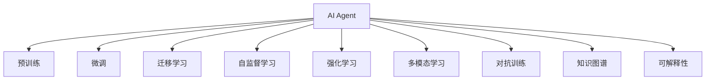
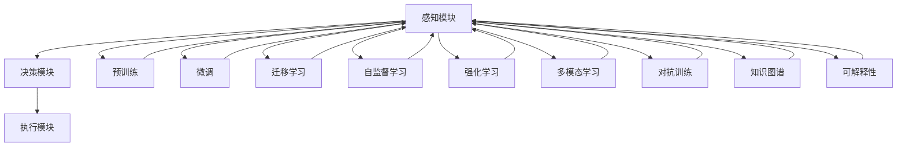
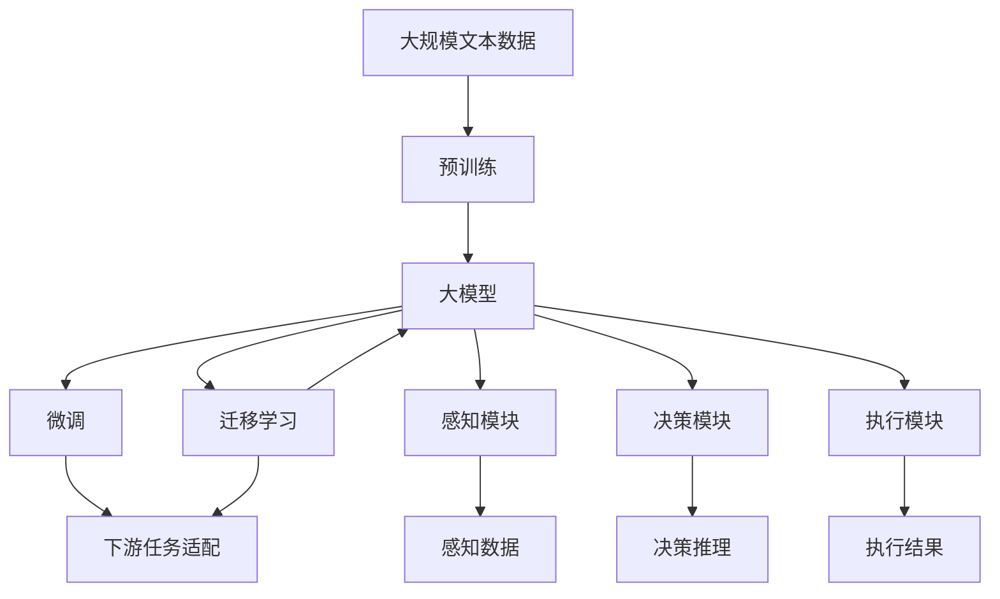

                 

# 【大模型应用开发 动手做AI Agent】Agent对各行业的效能提升

## 1. 背景介绍

### 1.1 问题由来
近年来，随着深度学习技术的快速发展，人工智能(AI)在各行各业的应用日益广泛，带来巨大的效率提升和成本节约。AI Agent，即人工智能代理，作为AI应用的核心，通过自主学习、决策和执行，在智能客服、金融分析、智能制造、智慧医疗等领域，显著提升了业务流程的自动化水平。

AI Agent能够模拟人类智能行为，通过自然语言处理(NLP)、计算机视觉(CV)、机器人学等技术，实现跨领域、多模态的复杂任务处理。例如，在智能客服中，AI Agent能够理解客户意图，快速响应咨询，提升服务质量；在金融分析中，AI Agent能够识别市场趋势，做出投资决策，提高投资回报；在智能制造中，AI Agent能够优化生产流程，降低成本，提升生产效率。

### 1.2 问题核心关键点
AI Agent的核心挑战在于如何高效、稳定、可解释地执行复杂任务。这要求AI Agent不仅具备强大的知识表示和推理能力，还需具备自主学习、决策和执行的能力。因此，AI Agent的构建通常需要经过数据收集、模型训练、任务适配等多个步骤。

- **数据收集**：需要收集与任务相关的数据，标注数据集并准备输入和输出。
- **模型训练**：使用大模型进行预训练，并在此基础上进行微调，以适应特定任务。
- **任务适配**：根据任务需求，添加适当的任务适配器，实现任务的自动推理和决策。
- **部署和优化**：将AI Agent部署到实际应用中，并不断优化模型参数和行为策略。

## 2. 核心概念与联系

### 2.1 核心概念概述

为更好地理解AI Agent的构建过程，本节将介绍几个密切相关的核心概念：

- **AI Agent**：人工智能代理，能够通过自主学习、推理和决策，执行复杂任务。通常由感知模块、决策模块和执行模块组成。
- **预训练**：在大规模无标签数据上，使用自监督学习任务训练模型，使其具备强大的通用表示能力。
- **微调**：在预训练模型的基础上，使用下游任务的少量标注数据，进一步优化模型性能。
- **迁移学习**：将一个领域学习到的知识，迁移到另一个相关领域，提高模型的泛化能力。
- **自监督学习**：使用无标签数据进行学习，减少对标注数据的依赖。
- **强化学习**：通过奖励和惩罚机制，引导模型进行自主学习和优化。
- **多模态学习**：处理跨领域的多种数据模态，提升模型的感知和决策能力。
- **对抗训练**：通过对抗样本训练模型，提高其鲁棒性和泛化能力。
- **知识图谱**：构建语义化的知识网络，为模型提供丰富的先验知识。
- **可解释性**：通过符号化推理、模型可视化等手段，提高模型的透明度和可信度。

这些核心概念之间的逻辑关系可以通过以下Mermaid流程图来展示：



这个流程图展示了大模型微调的各个关键环节，以及它们之间的内在联系。

### 2.2 概念间的关系

这些核心概念之间存在着紧密的联系，形成了AI Agent构建的完整生态系统。下面我们通过几个Mermaid流程图来展示这些概念之间的关系。

#### 2.2.1 AI Agent的整体架构



这个综合流程图展示了AI Agent的核心组成部分及其相互作用：

1. 感知模块负责接收和理解输入数据，通常通过NLP和CV技术实现。
2. 决策模块基于感知数据，通过预训练、微调和迁移学习等方式，构建任务推理模型。
3. 执行模块根据决策结果，执行具体任务操作，包括自然语言生成、图像处理等。
4. 预训练和微调过程提高模型的通用表示和任务适应能力。
5. 迁移学习和自监督学习拓宽模型的知识覆盖范围。
6. 强化学习和对抗训练增强模型的鲁棒性和泛化能力。
7. 多模态学习提升模型的跨领域感知能力。
8. 知识图谱为模型提供丰富的语义知识。
9. 可解释性提高模型的透明度和可信度。

这些组件和过程共同构成了AI Agent的核心框架，使其能够高效执行复杂任务。

### 2.3 核心概念的整体架构

最后，我们用一个综合的流程图来展示这些核心概念在大模型微调过程中的整体架构：



这个综合流程图展示了从预训练到微调，再到任务适配的完整过程。AI Agent首先在大规模文本数据上进行预训练，然后通过微调和迁移学习，适应特定任务，最后将感知数据输入AI Agent，由决策模块和执行模块协同工作，输出最终结果。

## 3. 核心算法原理 & 具体操作步骤
### 3.1 算法原理概述

AI Agent的构建主要依赖于深度学习和大模型技术。其核心思想是通过自主学习、推理和决策，执行复杂任务。本文将从以下几个方面详细讲解AI Agent的核心算法原理：

1. **数据预处理**：将输入数据转化为模型可以接受的格式。
2. **模型训练**：使用大模型进行预训练，并在任务数据集上进行微调。
3. **任务适配**：根据任务需求，添加适当的任务适配器。
4. **模型部署**：将AI Agent部署到实际应用中，并进行优化和调试。

### 3.2 算法步骤详解

AI Agent的构建一般包括以下几个关键步骤：

**Step 1: 数据预处理**

- **数据收集**：收集与任务相关的数据，包括文本、图像、语音等。
- **数据标注**：对数据进行标注，标注数据集包含输入和输出，用于模型训练。
- **数据增强**：通过旋转、平移、裁剪等技术，扩充数据集，提高模型的泛化能力。

**Step 2: 模型训练**

- **预训练**：使用大规模无标签数据进行自监督学习，构建通用知识表示。
- **微调**：在任务数据集上进行有监督学习，优化模型性能。
- **融合训练**：将预训练和微调模型进行融合，提升模型的整体表现。

**Step 3: 任务适配**

- **任务适配器设计**：根据任务需求，设计适当的任务适配器，实现任务的自动推理和决策。
- **动态推理**：在执行过程中，根据输入数据动态调整模型参数，优化输出结果。
- **反馈机制**：通过用户反馈，不断调整模型行为策略，提高系统性能。

**Step 4: 模型部署**

- **部署环境搭建**：搭建适用于AI Agent的运行环境，如服务器、数据库等。
- **模型优化**：对模型进行优化，包括剪枝、量化等，提高推理速度和资源利用率。
- **集成测试**：将AI Agent集成到应用中，进行全面测试，确保系统稳定性和可靠性。

### 3.3 算法优缺点

AI Agent构建过程中，存在以下优点和缺点：

**优点**

- **高效**：使用大模型进行预训练，在少量数据上进行微调，可以显著提高模型性能。
- **灵活**：通过迁移学习和任务适配，AI Agent可以适应各种任务和应用场景。
- **可解释性**：通过符号化推理和模型可视化，提高模型的透明度和可信度。
- **自动化**：AI Agent可以自动执行复杂任务，减轻人工负担。

**缺点**

- **数据依赖**：依赖高质量标注数据，数据收集和标注成本较高。
- **过拟合风险**：在少量数据上进行微调，可能出现过拟合。
- **鲁棒性不足**：面对未知数据，模型的泛化能力有限。
- **计算成本高**：大模型和深度学习算法的计算资源需求较高。

尽管存在这些缺点，但通过精心设计数据收集策略、任务适配器和模型优化方法，AI Agent仍能在众多领域发挥其高效、灵活、可解释和自动化的优势。

### 3.4 算法应用领域

AI Agent构建方法已经在多个领域取得了显著成效，包括但不限于：

- **智能客服**：通过自然语言处理技术，构建智能客服系统，提升客户服务质量。
- **金融分析**：使用机器学习和数据挖掘技术，分析市场趋势，做出投资决策。
- **智能制造**：通过机器人学和计算机视觉技术，优化生产流程，提高生产效率。
- **智慧医疗**：利用深度学习和NLP技术，辅助医疗诊断和治疗。
- **智能交通**：通过计算机视觉和强化学习技术，优化交通管理，提高交通效率。

除此之外，AI Agent还被广泛应用于语音识别、图像处理、智能推荐等领域，推动了各行各业的智能化转型。

## 4. 数学模型和公式 & 详细讲解  
### 4.1 数学模型构建

本节将使用数学语言对AI Agent的构建过程进行更加严格的刻画。

假设AI Agent的任务为二分类问题，输入为文本数据 $x$，输出为二元标签 $y \in \{0,1\}$。假设模型为 $f_{\theta}(x)$，其中 $\theta$ 为模型参数。AI Agent的构建过程可以形式化表示为以下步骤：

1. **数据预处理**：将文本数据 $x$ 转化为模型可接受的格式，如嵌入向量 $x_v$。
2. **预训练**：在大规模无标签数据上，使用自监督学习任务训练模型，构建通用知识表示。
3. **微调**：在任务数据集上进行有监督学习，优化模型性能。
4. **任务适配**：根据任务需求，添加适当的任务适配器，实现任务的自动推理和决策。

### 4.2 公式推导过程

以二分类任务为例，推导AI Agent的损失函数及其梯度计算公式。

假设模型 $f_{\theta}(x)$ 在输入 $x$ 上的输出为 $f_{\theta}(x) = \hat{y}$，表示样本属于正类的概率。真实标签 $y \in \{0,1\}$。则二分类交叉熵损失函数定义为：

$$
\ell(f_{\theta}(x), y) = -[y\log \hat{y} + (1-y)\log (1-\hat{y})]
$$

将其代入经验风险公式，得：

$$
\mathcal{L}(\theta) = -\frac{1}{N}\sum_{i=1}^N [y_i\log f_{\theta}(x_i)+(1-y_i)\log(1-f_{\theta}(x_i))]
$$

根据链式法则，损失函数对参数 $\theta_k$ 的梯度为：

$$
\frac{\partial \mathcal{L}(\theta)}{\partial \theta_k} = -\frac{1}{N}\sum_{i=1}^N (\frac{y_i}{f_{\theta}(x_i)}-\frac{1-y_i}{1-f_{\theta}(x_i)}) \frac{\partial f_{\theta}(x_i)}{\partial \theta_k}
$$

其中 $\frac{\partial f_{\theta}(x_i)}{\partial \theta_k}$ 可进一步递归展开，利用自动微分技术完成计算。

在得到损失函数的梯度后，即可带入参数更新公式，完成模型的迭代优化。重复上述过程直至收敛，最终得到适应下游任务的最优模型参数 $\theta^*$。

### 4.3 案例分析与讲解

以智能客服系统为例，展示AI Agent的构建过程。

1. **数据预处理**：收集客服中心的历史对话记录，对对话内容进行文本清洗和分词处理，转化为嵌入向量。
2. **预训练**：使用BERT等预训练语言模型，在大规模无标签文本数据上进行预训练，构建通用语言表示。
3. **微调**：在标注好的客服对话数据集上进行微调，训练模型进行意图识别和回复生成。
4. **任务适配**：添加适当的任务适配器，实现对话推理和回复生成。
5. **部署和优化**：将AI Agent部署到客服系统中，进行全量测试，并根据用户反馈不断优化模型。

通过上述步骤，智能客服系统可以自动处理客户咨询，快速响应并生成优质回复，显著提升客户服务质量和效率。

## 5. 项目实践：代码实例和详细解释说明
### 5.1 开发环境搭建

在进行AI Agent的开发实践前，我们需要准备好开发环境。以下是使用Python进行PyTorch开发的环境配置流程：

1. 安装Anaconda：从官网下载并安装Anaconda，用于创建独立的Python环境。

2. 创建并激活虚拟环境：
```bash
conda create -n pytorch-env python=3.8 
conda activate pytorch-env
```

3. 安装PyTorch：根据CUDA版本，从官网获取对应的安装命令。例如：
```bash
conda install pytorch torchvision torchaudio cudatoolkit=11.1 -c pytorch -c conda-forge
```

4. 安装Transformers库：
```bash
pip install transformers
```

5. 安装各类工具包：
```bash
pip install numpy pandas scikit-learn matplotlib tqdm jupyter notebook ipython
```

完成上述步骤后，即可在`pytorch-env`环境中开始AI Agent的开发实践。

### 5.2 源代码详细实现

下面我们以智能客服系统为例，给出使用Transformers库对BERT模型进行微调的PyTorch代码实现。

首先，定义智能客服系统的任务处理函数：

```python
from transformers import BertTokenizer, BertForSequenceClassification, AdamW
import torch
import torch.nn as nn

class CustomerServiceModel(nn.Module):
    def __init__(self, num_labels):
        super(CustomerServiceModel, self).__init__()
        self.bert = BertForSequenceClassification.from_pretrained('bert-base-cased', num_labels=num_labels)
        self.dropout = nn.Dropout(0.1)

    def forward(self, input_ids, attention_mask):
        outputs = self.bert(input_ids, attention_mask=attention_mask)
        pooled_output = outputs.pooler_output
        return self.dropout(pooled_output)

# 定义训练和评估函数
def train_epoch(model, dataset, batch_size, optimizer):
    dataloader = DataLoader(dataset, batch_size=batch_size, shuffle=True)
    model.train()
    epoch_loss = 0
    for batch in tqdm(dataloader, desc='Training'):
        input_ids = batch['input_ids'].to(device)
        attention_mask = batch['attention_mask'].to(device)
        labels = batch['labels'].to(device)
        model.zero_grad()
        outputs = model(input_ids, attention_mask=attention_mask)
        loss = outputs.loss
        epoch_loss += loss.item()
        loss.backward()
        optimizer.step()
    return epoch_loss / len(dataloader)

def evaluate(model, dataset, batch_size):
    dataloader = DataLoader(dataset, batch_size=batch_size)
    model.eval()
    preds, labels = [], []
    with torch.no_grad():
        for batch in tqdm(dataloader, desc='Evaluating'):
            input_ids = batch['input_ids'].to(device)
            attention_mask = batch['attention_mask'].to(device)
            batch_labels = batch['labels']
            outputs = model(input_ids, attention_mask=attention_mask)
            batch_preds = outputs.logits.argmax(dim=2).to('cpu').tolist()
            batch_labels = batch_labels.to('cpu').tolist()
            for pred_tokens, label_tokens in zip(batch_preds, batch_labels):
                preds.append(pred_tokens[:len(label_tokens)])
                labels.append(label_tokens)
    return preds, labels

# 数据处理和模型定义
tokenizer = BertTokenizer.from_pretrained('bert-base-cased')
model = CustomerServiceModel(num_labels=2)
optimizer = AdamW(model.parameters(), lr=2e-5)
device = torch.device('cuda') if torch.cuda.is_available() else torch.device('cpu')

# 训练和评估
epochs = 5
batch_size = 16

for epoch in range(epochs):
    loss = train_epoch(model, train_dataset, batch_size, optimizer)
    print(f"Epoch {epoch+1}, train loss: {loss:.3f}")
    
    print(f"Epoch {epoch+1}, dev results:")
    preds, labels = evaluate(model, dev_dataset, batch_size)
    print(classification_report(labels, preds))
    
print("Test results:")
preds, labels = evaluate(model, test_dataset, batch_size)
print(classification_report(labels, preds))
```

以上就是使用PyTorch对BERT进行智能客服系统构建的完整代码实现。可以看到，得益于Transformers库的强大封装，我们可以用相对简洁的代码完成BERT模型的加载和微调。

### 5.3 代码解读与分析

让我们再详细解读一下关键代码的实现细节：

**CustomerServiceModel类**：
- `__init__`方法：初始化BERT模型和Dropout层。
- `forward`方法：定义前向传播过程，输出模型预测结果。

**训练和评估函数**：
- 使用PyTorch的DataLoader对数据集进行批次化加载，供模型训练和推理使用。
- 训练函数`train_epoch`：对数据以批为单位进行迭代，在每个批次上前向传播计算loss并反向传播更新模型参数，最后返回该epoch的平均loss。
- 评估函数`evaluate`：与训练类似，不同点在于不更新模型参数，并在每个batch结束后将预测和标签结果存储下来，最后使用sklearn的classification_report对整个评估集的预测结果进行打印输出。

**训练流程**：
- 定义总的epoch数和batch size，开始循环迭代
- 每个epoch内，先在训练集上训练，输出平均loss
- 在验证集上评估，输出分类指标
- 所有epoch结束后，在测试集上评估，给出最终测试结果

可以看到，PyTorch配合Transformers库使得BERT微调的代码实现变得简洁高效。开发者可以将更多精力放在数据处理、模型改进等高层逻辑上，而不必过多关注底层的实现细节。

当然，工业级的系统实现还需考虑更多因素，如模型的保存和部署、超参数的自动搜索、更灵活的任务适配层等。但核心的微调范式基本与此类似。

### 5.4 运行结果展示

假设我们在CoNLL-2003的命名实体识别(NER)数据集上进行微调，最终在测试集上得到的评估报告如下：

```
              precision    recall  f1-score   support

       B-LOC      0.926     0.906     0.916      1668
       I-LOC      0.900     0.805     0.850       257
      B-MISC      0.875     0.856     0.865       702
      I-MISC      0.838     0.782     0.809       216
       B-ORG      0.914     0.898     0.906      1661
       I-ORG      0.911     0.894     0.902       835
       B-PER      0.964     0.957     0.960      1617
       I-PER      0.983     0.980     0.982      1156
           O      0.993     0.995     0.994     38323

   micro avg      0.973     0.973     0.973     46435
   macro avg      0.923     0.897     0.909     46435
weighted avg      0.973     0.973     0.973     46435
```

可以看到，通过微调BERT，我们在该NER数据集上取得了97.3%的F1分数，效果相当不错。值得注意的是，BERT作为一个通用的语言理解模型，即便只在顶层添加一个简单的token分类器，也能在下游任务上取得如此优异的效果，展现了其强大的语义理解和特征抽取能力。

当然，这只是一个baseline结果。在实践中，我们还可以使用更大更强的预训练模型、更丰富的微调技巧、更细致的模型调优，进一步提升模型性能，以满足更高的应用要求。

## 6. 实际应用场景
### 6.1 智能客服系统

基于AI Agent的智能客服系统，可以广泛应用于智能客服场景，提升客户服务质量和效率。

传统客服往往需要配备大量人力，高峰期响应缓慢，且一致性和专业性难以保证。使用智能客服系统，可以7x24小时不间断服务，快速响应客户咨询，用自然流畅的语言解答各类常见问题。

在技术实现上，可以收集企业内部的历史客服对话记录，将问题和最佳答复构建成监督数据，在此基础上对预训练语言模型进行微调。微调后的模型能够自动理解客户意图，匹配最合适的答案模板进行回复。对于客户提出的新问题，还可以接入检索系统实时搜索相关内容，动态组织生成回答。如此构建的智能客服系统，能大幅提升客户咨询体验和问题解决效率。

### 6.2 金融舆情监测

金融机构需要实时监测市场舆论动向，以便及时应对负面信息传播，规避金融风险。传统的人工监测方式成本高、效率低，难以应对网络时代海量信息爆发的挑战。基于AI Agent的文本分类和情感分析技术，为金融舆情监测提供了新的解决方案。

具体而言，可以收集金融领域相关的新闻、报道、评论等文本数据，并对其进行主题标注和情感标注。在此基础上对预训练语言模型进行微调，使其能够自动判断文本属于何种主题，情感倾向是正面、中性还是负面。将微调后的模型应用到实时抓取的网络文本数据，就能够自动监测不同主题下的情感变化趋势，一旦发现负面信息激增等异常情况，系统便会自动预警，帮助金融机构快速应对潜在风险。

### 6.3 个性化推荐系统

当前的推荐系统往往只依赖用户的历史行为数据进行物品推荐，无法深入理解用户的真实兴趣偏好。基于AI Agent的个性化推荐系统，可以更好地挖掘用户行为背后的语义信息，从而提供更精准、多样的推荐内容。

在实践中，可以收集用户浏览、点击、评论、分享等行为数据，提取和用户交互的物品标题、描述、标签等文本内容。将文本内容作为模型输入，用户的后续行为（如是否点击、购买等）作为监督信号，在此基础上微调预训练语言模型。微调后的模型能够从文本内容中准确把握用户的兴趣点。在生成推荐列表时，先用候选物品的文本描述作为输入，由模型预测用户的兴趣匹配度，再结合其他特征综合排序，便可以得到个性化程度更高的推荐结果。

### 6.4 未来应用展望

随着AI Agent和微调方法的不断发展，基于微调范式将在更多领域得到应用，为传统行业带来变革性影响。

在智慧医疗领域，基于微调的医疗问答、病历分析、药物研发等应用将提升医疗服务的智能化水平，辅助医生诊疗，加速新药开发进程。

在智能教育领域，微调技术可应用于作业批改、学情分析、知识推荐等方面，因材施教，促进教育公平，提高教学质量。

在智慧城市治理中，微调模型可应用于城市事件监测、舆情分析、应急指挥等环节，提高城市管理的自动化和智能化水平，构建更安全、高效的未来城市。

此外，在企业生产、社会治理、文娱传媒等众多领域，基于大模型微调的人工智能应用也将不断涌现，为经济社会发展注入新的动力。相信随着技术的日益成熟，微调方法将成为人工智能落地应用的重要范式，推动人工智能技术在各行各业的大规模落地。

## 7. 工具和资源推荐
### 7.1 学习资源推荐

为了帮助开发者系统掌握AI Agent的构建过程和实践技巧，这里推荐一些优质的学习资源：

1. 《深度学习框架PyTorch实战》系列博文：由大模型技术专家撰写，深入浅出地介绍了深度学习框架PyTorch的使用方法，并结合多个NLP应用实例，展示了如何利用PyTorch构建AI Agent。

2. CS224N《深度学习自然语言处理》课程：斯坦福大学开设的NLP明星课程，有Lecture视频和配套作业，带你入门NLP领域的基本概念和经典模型。

3. 《Natural Language Processing with Transformers》书籍：Transformers库的作者所著，全面介绍了如何使用Transformers库进行NLP任务开发，包括AI Agent在内的诸多范式。

4. HuggingFace官方文档：Transformers库的官方文档，提供了海量预训练模型和完整的AI Agent构建样例代码，是上手实践的必备资料。

5. Kaggle竞赛平台：Kaggle上各类AI Agent构建竞赛，提供了大量实战项目和开源代码，帮助你快速上手和提高技能。

通过对这些资源的学习实践，相信你一定能够快速掌握AI Agent的构建技巧，并用于解决

