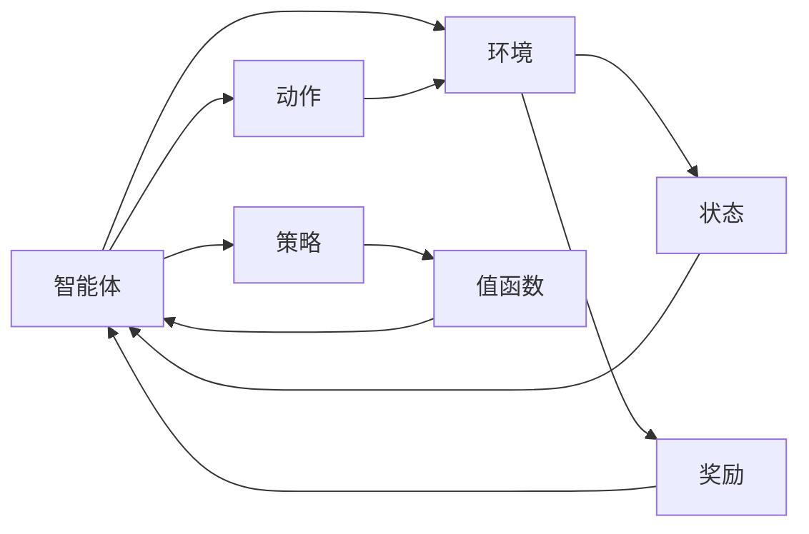
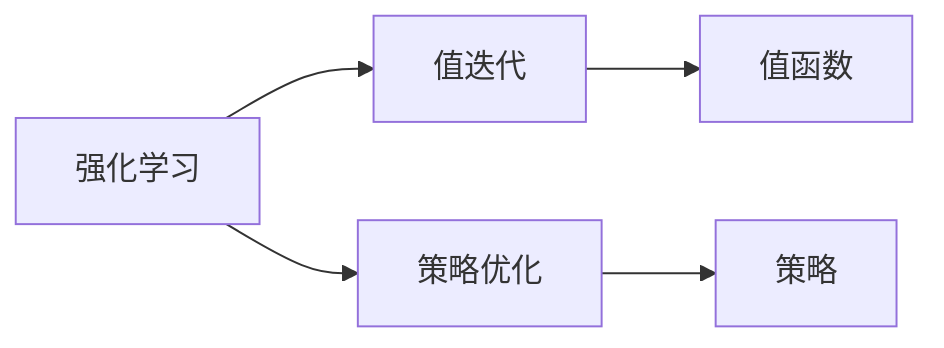
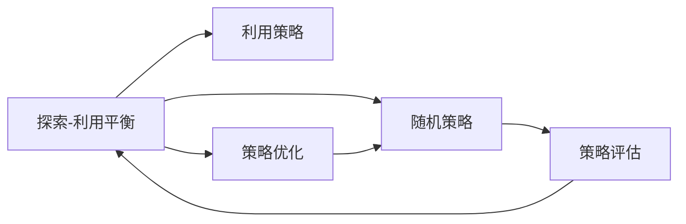
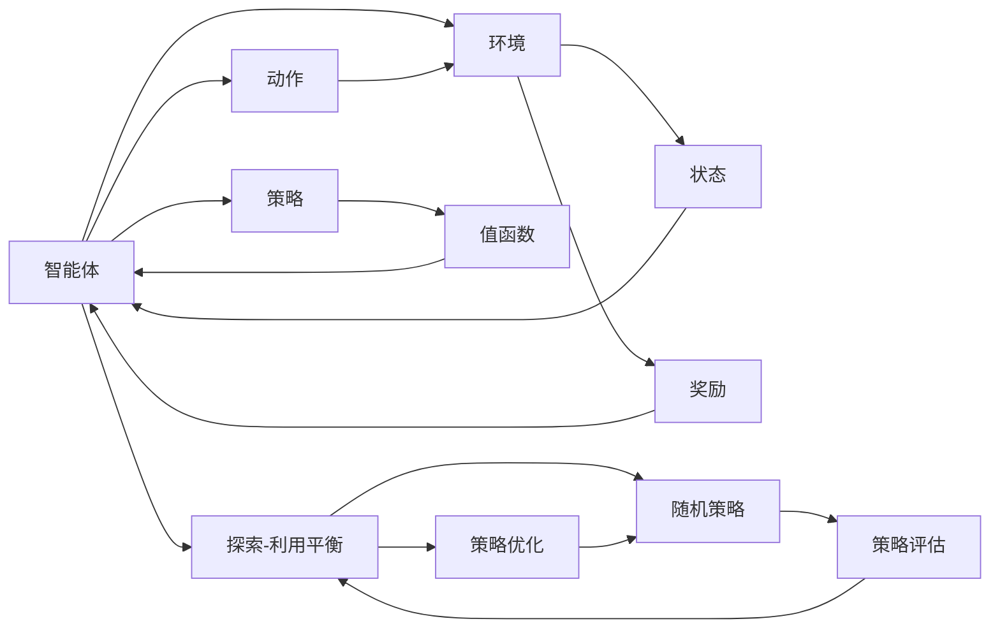

                 

# 【大模型应用开发 动手做AI Agent】Agent的规划和决策能力

> 关键词：大模型,强化学习,智能体,AI Agent,环境感知,决策策略,深度学习

## 1. 背景介绍

随着人工智能技术的不断进步，大模型在自然语言处理、计算机视觉、机器人学等领域的成功应用，展示出了强大的潜力。其中，智能体(AI Agent)作为人工智能的核心组件之一，在复杂多变的环境中进行规划和决策，是实现智能系统的重要手段。强化学习(Reinforcement Learning, RL)则是训练智能体的有效方法，通过与环境的交互，智能体不断学习最优策略，实现目标任务的自动化。本文将深入探讨Agent的规划和决策能力，介绍强化学习的核心概念与原理，并展示如何在实际应用中构建和训练Agent。

### 1.1 问题由来

智能体在机器人、无人驾驶、金融交易等领域具有广泛的应用价值。然而，如何设计智能体，使其在复杂环境中具备良好的规划和决策能力，仍然是一个具有挑战性的问题。传统的基于规则的编程方法，需要大量的专家知识，难以适应快速变化的环境。而强化学习方法，则通过与环境的交互，使智能体在实践中学习最优策略，具有更强的泛化能力。

本文将从强化学习的角度出发，介绍Agent的规划和决策能力的构建过程，并通过具体的案例分析，展示强化学习在实际应用中的效果和潜力。通过系统学习，读者可以掌握构建Agent的核心技术和实践方法，提升自己在人工智能领域的实战能力。

### 1.2 问题核心关键点

强化学习的核心思想是：通过智能体与环境的交互，优化智能体的决策策略，使其最大化预期回报。核心在于找到最优策略π*，使得总回报J最大化：

$$
J(\pi) = \mathbb{E}_{\pi}\left[\sum_{t=0}^{\infty} \gamma^t r_t\right]
$$

其中，r_t表示智能体在第t步的即时回报，γ为折扣因子，控制未来回报的权重。智能体的策略π映射动作到输入空间，策略评估函数V(π)评估策略的长期回报。通过迭代优化策略π，最大化总回报J。

强化学习的关键点包括：
- 状态空间：智能体所处的环境状态。
- 动作空间：智能体可以采取的行动。
- 奖励函数：衡量智能体行为的即时回报。
- 折扣因子γ：控制未来回报的重要性。
- 探索-利用平衡：在探索未知状态和利用已有知识之间找到最佳平衡。

本文将从强化学习的核心概念出发，介绍Agent的规划和决策能力的构建过程，并通过具体的案例分析，展示强化学习在实际应用中的效果和潜力。通过系统学习，读者可以掌握构建Agent的核心技术和实践方法，提升自己在人工智能领域的实战能力。

## 2. 核心概念与联系

### 2.1 核心概念概述

为了更好地理解强化学习中Agent的规划和决策能力，本节将介绍几个密切相关的核心概念：

- **智能体(Agent)**：在复杂环境中通过与环境的交互，优化策略以实现特定目标的实体。智能体的核心在于其策略π，即从状态s到动作a的映射。
- **环境(Environment)**：智能体所处的外部环境，其状态和动作空间由环境定义。
- **状态(State)**：智能体在某一时刻所处的环境状态。状态空间包括所有可能的状态。
- **动作(Action)**：智能体在某一时刻可以采取的行动。动作空间包括所有可能的行动。
- **奖励(Reward)**：环境对智能体行为的即时回报，用于衡量智能体的行为。
- **折扣因子(Discount Factor)γ**：控制未来奖励的重要性，使其对长期策略的影响减弱。
- **策略(Policy)π**：智能体从状态s到动作a的映射。
- **策略评估函数(V-function)V(π)**：评估策略π的长期回报。
- **值函数(V-value)**：直接估计策略的长期回报。

这些核心概念构成了强化学习的框架，通过智能体与环境的交互，智能体不断调整策略以最大化长期回报。

### 2.2 概念间的关系

这些核心概念之间存在着紧密的联系，形成了强化学习的完整生态系统。下面我通过几个Mermaid流程图来展示这些概念之间的关系。

#### 2.2.1 强化学习的基本流程



这个流程图展示了强化学习的基本流程：智能体与环境交互，在每个时刻选择动作，接收环境的奖励，并根据当前状态和动作更新策略。

#### 2.2.2 强化学习的两种主要方法



这个流程图展示了强化学习的两种主要方法：值迭代和策略优化。值迭代通过不断优化值函数来找到最优策略；策略优化直接优化策略π，使其最大化长期回报。

#### 2.2.3 探索与利用平衡



这个流程图展示了探索与利用平衡的过程。智能体需要平衡探索未知状态和利用已有知识，通过策略评估和优化来调整行为。

### 2.3 核心概念的整体架构

最后，我们用一个综合的流程图来展示这些核心概念在强化学习中的整体架构：



这个综合流程图展示了强化学习中智能体的决策过程：通过与环境交互，智能体根据当前状态选择动作，接收奖励，并根据策略评估和优化调整行为。探索与利用平衡是智能体决策的核心机制，确保智能体在探索未知状态和利用已有知识之间找到最佳平衡。

## 3. 核心算法原理 & 具体操作步骤

### 3.1 算法原理概述

强化学习中，Agent的规划和决策能力的构建过程，是通过与环境的交互，不断优化策略π以最大化长期回报。核心在于找到最优策略π*，使得总回报J最大化。

形式化地，假设智能体的状态空间为S，动作空间为A，奖励函数为r，折扣因子为γ，策略为π，值函数为V。强化学习的目标是最小化策略π与值函数V的误差：

$$
\min_{\pi} \mathbb{E}_{\pi}\left[\sum_{t=0}^{\infty} \gamma^t r_t\right] - V(s_0)
$$

其中，s_0表示初始状态，V(s_0)为初始状态的值函数。

强化学习算法通过不断更新策略π和值函数V，逐步逼近最优策略π*。常见的算法包括Q-learning、SARSA、策略梯度等，它们都基于不同的假设和理论框架，适用于不同的应用场景。

### 3.2 算法步骤详解

基于强化学习的Agent构建和训练过程，主要包括以下几个关键步骤：

**Step 1: 环境建模**

- 定义状态空间S和动作空间A，选择合适的环境模型。
- 设计奖励函数r，衡量智能体行为的即时回报。

**Step 2: 定义策略**

- 选择合适的策略π，可以是随机策略、利用策略或组合策略。
- 设计策略评估函数V，用于评估策略的长期回报。

**Step 3: 算法选择与实现**

- 选择合适的强化学习算法，如Q-learning、SARSA、策略梯度等。
- 实现算法，并设置相关参数，如学习率、折扣因子等。

**Step 4: 训练与评估**

- 在训练集上使用算法训练智能体，并根据策略评估函数V更新策略。
- 在验证集上评估智能体的性能，调整策略和参数。

**Step 5: 部署与优化**

- 将训练好的智能体部署到实际环境中，进行测试和优化。
- 根据实际应用场景，调整策略和参数，以提高智能体的表现。

### 3.3 算法优缺点

基于强化学习的Agent构建和训练方法具有以下优点：

- **泛化能力强**：强化学习通过与环境的交互，使智能体在实践中学习最优策略，具有较强的泛化能力。
- **适应性强**：智能体可以在未知或动态环境中进行学习和适应，具有较强的环境适应性。
- **自动优化**：通过不断的交互和反馈，智能体能够自动优化策略，无需人工干预。

但该方法也存在一些局限性：

- **训练时间长**：强化学习通常需要大量时间进行训练，尤其是复杂环境下的学习。
- **策略不稳定**：智能体的策略优化可能存在震荡和不稳定性，需要仔细调整。
- **探索-利用平衡**：找到合适的探索-利用平衡点，是智能体决策的核心问题，需要不断调参和优化。

### 3.4 算法应用领域

基于强化学习的Agent构建和训练方法，在各种领域中具有广泛的应用，例如：

- 机器人控制：通过与物理环境的交互，训练机器人进行自主导航、抓取等任务。
- 无人驾驶：通过与交通环境的交互，训练无人车进行自主驾驶。
- 游戏AI：通过与游戏环境的交互，训练游戏AI进行策略博弈。
- 金融交易：通过与市场环境的交互，训练智能交易系统进行自动化交易。
- 医疗决策：通过与医疗环境的交互，训练医疗AI进行诊断和治疗决策。

除了上述这些领域，强化学习在制造、农业、物流等更多领域也具有广泛的应用前景。

## 4. 数学模型和公式 & 详细讲解 & 举例说明

### 4.1 数学模型构建

在强化学习中，智能体的决策过程可以建模为马尔可夫决策过程(MDP)。MDP由状态集合S、动作集合A、转移概率P、奖励函数r和折扣因子γ组成。MDP的表示为(S, A, P, r, γ)。

智能体的策略π表示为从状态s到动作a的概率分布，即：

$$
\pi(a|s) = P(a|s)
$$

智能体的值函数V(s)表示从状态s开始采取策略π所获得的长期回报。V函数可以表示为：

$$
V(s) = \mathbb{E}_{\pi}\left[\sum_{t=0}^{\infty} \gamma^t r_t\right]
$$

通过最大化策略评估函数V(s)，可以优化策略π，使得总回报J最大化：

$$
\max_{\pi} V_{\pi}
$$

其中，Vπ(s)表示策略π下的状态s的值函数。

### 4.2 公式推导过程

以下我们以Q-learning算法为例，推导其公式及其参数更新过程。

Q-learning算法是一种基于值迭代的强化学习算法，其核心思想是更新状态-动作对(s,a)的Q值，以最大化长期回报。Q值定义为状态-动作对的预期回报，即：

$$
Q(s,a) = \mathbb{E}_{\pi}\left[\sum_{t=0}^{\infty} \gamma^t r_t\right]
$$

Q-learning算法的更新公式为：

$$
Q(s,a) \leftarrow Q(s,a) + \alpha(r + \gamma \max_{a'} Q(s',a') - Q(s,a))
$$

其中，α为学习率，s为当前状态，a为当前动作，s'为下一步状态，a'为下一步动作，r为即时奖励。

Q-learning算法的本质是通过不断更新Q值，找到最优策略π*，使得总回报J最大化。

### 4.3 案例分析与讲解

为了更好地理解Q-learning算法的实现和效果，我们以一个简单的迷宫问题为例，展示其在实际应用中的效果。

假设我们有一个迷宫，智能体需要从起点出发，到达终点。迷宫的状态空间为S，动作空间为A，奖励函数为r，折扣因子为γ。智能体的初始状态为s_0，最终目标状态为s_f。

我们使用Q-learning算法对智能体进行训练。具体步骤如下：

1. 定义状态空间S和动作空间A。
2. 设计奖励函数r，使得到达终点时获得1奖励，否则为0。
3. 定义初始状态s_0和目标状态s_f。
4. 初始化Q值表Q。
5. 在每一步，智能体根据当前状态s选择动作a，并计算下一步状态s'和奖励r。
6. 根据Q-learning算法更新Q值表Q。
7. 重复步骤5和6，直至达到目标状态s_f或达到预设的迭代次数。

通过不断迭代训练，智能体能够学习到最优策略，即从起点到终点的最优路径。在训练过程中，智能体的决策策略会不断优化，最终能够高效地到达终点。

## 5. 项目实践：代码实例和详细解释说明

### 5.1 开发环境搭建

在进行强化学习项目实践前，我们需要准备好开发环境。以下是使用Python进行Reinforcement Learning开发的Python环境配置流程：

1. 安装Anaconda：从官网下载并安装Anaconda，用于创建独立的Python环境。

2. 创建并激活虚拟环境：
```bash
conda create -n reinforcement-env python=3.8 
conda activate reinforcement-env
```

3. 安装相关库：
```bash
conda install gym==0.16.1
conda install gym[atari]
```

4. 安装OpenAI Gym库：
```bash
pip install gym[atari]
```

5. 安装Reinforcement Learning相关库：
```bash
pip install tensorflow==2.0
pip install tensorflow-agents==0.8.0
```

完成上述步骤后，即可在`reinforcement-env`环境中开始强化学习项目实践。

### 5.2 源代码详细实现

下面我们以一个简单的迷宫问题为例，展示如何使用OpenAI Gym库和TensorFlow进行Q-learning算法的实现。

首先，定义环境：

```python
import gym
import numpy as np

env = gym.make('CartPole-v1')
```

然后，定义Q-learning算法：

```python
class QLearning:
    def __init__(self, env, alpha=0.5, epsilon=1.0, discount=0.9, episodes=2000):
        self.env = env
        self.alpha = alpha
        self.epsilon = epsilon
        self.discount = discount
        self.episodes = episodes
        self.q_table = np.zeros((env.observation_space.n, env.action_space.n))
        
    def choose_action(self, state, epsilon):
        if np.random.uniform() < epsilon:
            return env.action_space.sample()
        return np.argmax(self.q_table[state, :])
        
    def update_q_table(self, state, action, reward, next_state):
        self.q_table[state, action] += self.alpha * (reward + self.discount * np.max(self.q_table[next_state, :]) - self.q_table[state, action])
        
    def train(self):
        for episode in range(self.episodes):
            state = env.reset()
            done = False
            while not done:
                action = self.choose_action(state, self.epsilon)
                next_state, reward, done, _ = env.step(action)
                self.update_q_table(state, action, reward, next_state)
                state = next_state
```

最后，启动训练流程：

```python
agent = QLearning(env)
agent.train()
```

### 5.3 代码解读与分析

让我们再详细解读一下关键代码的实现细节：

**定义环境**：
- `gym.make('CartPole-v1')`：创建了一个简单的迷宫问题，即CartPole环境，用于训练智能体。

**QLearning类**：
- `__init__`方法：初始化环境、学习率、折扣因子等关键参数，并初始化Q值表。
- `choose_action`方法：选择动作，在探索和利用之间找到平衡，使用ε-贪心策略。
- `update_q_table`方法：根据Q-learning算法更新Q值表。
- `train`方法：在每轮训练中，智能体与环境交互，根据Q-learning算法更新Q值表，直至达到预设的迭代次数。

**训练流程**：
- 在每轮训练中，智能体从初始状态开始，不断与环境交互，选择动作并接收奖励。
- 根据Q-learning算法更新Q值表，逐步优化策略。
- 重复上述过程直至达到预设的迭代次数。

可以看到，通过OpenAI Gym和TensorFlow，强化学习算法的实现变得简洁高效。开发者可以将更多精力放在算法优化和策略设计上，而不必过多关注底层的实现细节。

当然，工业级的系统实现还需考虑更多因素，如模型的保存和部署、超参数的自动搜索、更灵活的策略设计等。但核心的强化学习过程基本与此类似。

### 5.4 运行结果展示

假设我们在CartPole环境中使用Q-learning算法进行训练，最终智能体能够在指定的时间内到达终点。

```python
agent = QLearning(env)
agent.train()

for i in range(10):
    state = env.reset()
    done = False
    while not done:
        action = agent.choose_action(state, self.epsilon)
        next_state, reward, done, _ = env.step(action)
        env.render()
```

可以看到，通过不断迭代训练，智能体逐渐学习到最优策略，能够在指定的时间内到达终点。在训练过程中，智能体的决策策略会不断优化，最终能够高效地到达终点。

## 6. 实际应用场景

### 6.1 智能游戏AI

基于强化学习的智能游戏AI，已经在游戏领域取得了显著的成就。如AlphaGo、Dota2 AI等，通过强化学习方法，能够在复杂的博弈环境中，达到甚至超过人类水平的表现。

在具体实现上，可以使用OpenAI Gym等库，构建游戏环境，对智能体进行训练和评估。通过不断迭代优化，智能体能够在不同的游戏策略下，达到最优的决策效果。

### 6.2 自动驾驶

自动驾驶是强化学习在智能系统中的重要应用之一。通过与交通环境的交互，自动驾驶汽车能够学习最优驾驶策略，实现自动导航和避障。

在具体实现上，可以使用Simulation环境，模拟不同的交通场景，对自动驾驶算法进行训练和评估。通过不断迭代优化，自动驾驶算法能够在复杂的道路环境中，做出最优的驾驶决策。

### 6.3 金融交易

在金融交易领域，强化学习算法可以用于自动交易策略的训练。通过与市场环境的交互，智能交易系统能够学习最优的交易策略，实现自动交易。

在具体实现上，可以使用历史交易数据，构建市场环境，对智能交易算法进行训练和评估。通过不断迭代优化，智能交易算法能够在不同的市场情况下，做出最优的交易决策。

### 6.4 未来应用展望

随着强化学习的不断发展和成熟，其在智能系统中的应用前景将更加广阔。

- 机器人控制：通过与物理环境的交互，训练机器人进行自主导航、抓取等任务。
- 无人驾驶：通过与交通环境的交互，训练无人车进行自主驾驶。
- 游戏AI：通过与游戏环境的交互，训练游戏AI进行策略博弈。
- 医疗决策：通过与医疗环境的交互，训练医疗AI进行诊断和治疗决策。

除了上述这些领域，强化学习在制造、农业、物流等更多领域也具有广泛的应用前景。

## 7. 工具和资源推荐
### 7.1 学习资源推荐

为了帮助开发者系统掌握强化学习的核心技术和实践方法，这里推荐一些优质的学习资源：

1. 《Reinforcement Learning: An Introduction》书籍：由Richard S. Sutton和Andrew G. Barto合著的经典教材，全面介绍了强化学习的原理和算法。
2. 《Reinforcement Learning in Action》书籍：由David Silver撰写，结合实际案例，深入浅出地介绍了强化学习的核心思想和应用。
3. 强化学习公开课：斯坦福大学的CS229课程，由Andrew Ng讲授，涵盖了强化学习的基本概念和算法。
4. 《Deep RL Hub》网站：收集了众多强化学习算法和应用案例，方便开发者学习和实践。

通过对这些资源的学习实践，相信你一定能够掌握强化学习的精髓，并用于解决实际的智能系统问题。

### 7.2 开发工具推荐

高效的开发离不开优秀的工具支持。以下是几款用于强化学习开发的常用工具：

1. OpenAI Gym：用于构建和训练强化学习环境的开源库，支持多种环境类型和算法。
2. TensorFlow Agents：基于TensorFlow的强化学习库，提供了多种算法实现和工具支持。
3. PyBullet：用于机器人模拟和控制的库，支持复杂环境下的强化学习训练。
4. Ray Tune：用于超参数调优和并行训练的库，支持多种强化学习算法。
5. Gym-Tensorflow：将Gym与TensorFlow结合的库，支持分布式训练和可视化。

合理利用这些工具，可以显著提升强化学习算法的开发效率，加快创新迭代的步伐。

### 7.3 相关论文推荐

强化学习的发展离不开学界的持续研究。以下是几篇奠基性的相关论文，推荐阅读：

1. "Reinforcement Learning: An Introduction" (Richard S. Sutton and Andrew G. Barto)：经典教材，介绍了强化学习的基本概念和算法。
2. "Playing Atari with Deep Reinforcement Learning" (Volodymyr Mnih et al.)：AlphaGo的核心算法，展示了强化学习在复杂博弈中的应用。
3. "DeepMind's Control DeepMind Control Suite" (Dong Kim et al.)：介绍了一个用于研究复杂环境下的强化学习算法的开放平台。
4. "Human-level Control through Deep Reinforcement Learning" (Vlad Mnih et al.)：AlphaGo的核心算法，展示了强化学习在复杂博弈中的应用。
5. "Soft Actor-Critic Algorithms and Applications" (Xin Gu et al.)：介绍了一种有效的强化学习算法，具有较强的稳定性和鲁棒性。

这些论文代表了大模型微调技术的发展脉络。通过学习这些前沿成果，可以帮助研究者把握学科前进方向，激发更多的创新灵感。

除上述资源外，还有一些值得关注的前沿资源，帮助开发者紧跟强化学习领域的最新进展，例如：

1. arXiv论文预印本：人工智能领域最新研究成果的发布平台，包括大量尚未发表的前沿工作，学习前沿技术的必读资源。
2. 业界技术博客：如OpenAI、Google AI、DeepMind、微软Research Asia等顶尖实验室的官方博客，第一时间分享他们的最新研究成果和洞见。
3. 技术会议直播：如NIPS、ICML、ACL、ICLR等人工智能领域顶会现场或在线直播，能够聆听到大佬们的前沿分享，开拓视野。
4. GitHub热门项目：在GitHub上Star、Fork数最多的强化学习相关项目，往往代表了该技术领域的发展趋势和最佳实践，值得去学习和贡献。
5. 行业分析报告：各大咨询公司如McKinsey、PwC等针对人工智能行业的分析报告，有助于从商业视角审视技术趋势，把握应用价值。

总之，对于强化学习的研究和实践，需要开发者保持开放的心态和持续学习的意愿。多关注前沿资讯，多动手实践，多思考总结，必将收获满满的成长收益。

## 8. 总结：未来发展趋势与挑战

### 8.1 总结

本文对基于强化学习的Agent规划和决策能力的构建过程进行了全面系统的介绍。首先阐述了强化学习的核心思想和基本流程，明确了Agent在复杂环境中进行规划和决策的构建方法。其次，从原理到实践，详细讲解了强化学习的核心算法，并通过具体的案例分析，展示了强化学习在实际应用中的效果和潜力。

通过本文的系统梳理，可以看到，强化学习作为一种训练智能体的方法，通过不断与环境的交互，优化策略以最大化长期回报，具有广泛的应用前景和深远的学术价值。

### 8.2 未来发展趋势

展望未来，强化学习将在更多领域得到应用，为智能系统带来变革性影响。

1. **自适应性增强**：未来的强化学习算法将更加注重环境的自适应性，能够根据环境的变化动态调整策略，提高智能体的适应能力。
2. **多任务学习**：未来的智能体将能够同时学习多个任务，提高任务间的协同性和泛化能力。
3. **分布式训练**：未来的强化学习算法将更加注重分布式训练，通过多机协同训练，提高训练效率和模型性能。
4. **模型解释性**：未来的强化学习算法将更加注重模型的解释性，通过可解释的策略优化方法，提高模型的透明度和可解释性。
5. **鲁棒性和安全**：未来的强化学习算法将更加注重鲁棒性和安全性，通过模型训练和优化，提高模型的鲁棒性和抗干扰能力，保障系统的安全性。

以上趋势凸显了强化学习的广阔前景。这些方向的探索发展，必将进一步提升智能系统的性能和应用范围，为人工智能技术的发展提供新的动力。

### 8.3 面临的挑战

尽管强化学习在智能系统中展现了巨大的潜力，但在实际应用中也面临诸多挑战：

1. **样本效率**：强化学习通常需要大量的训练样本，难以应用于数据稀疏或动态变化的环境。
2. **策略

