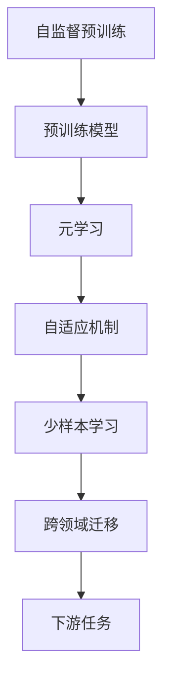
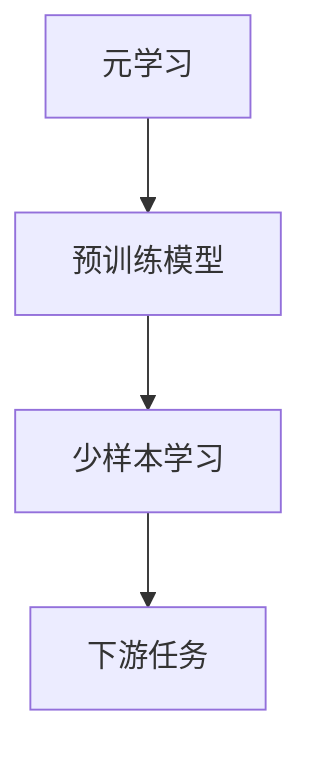
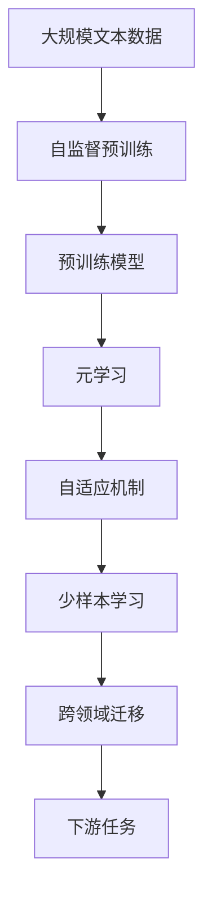

                 

# 一切皆是映射：基于元学习的自然语言处理模型预训练

## 1. 背景介绍

### 1.1 问题由来

近年来，自然语言处理（Natural Language Processing，NLP）领域取得了飞速的发展，尤其是深度学习技术的应用，显著提升了NLP系统的性能。其中，预训练语言模型（Pre-trained Language Models，PLMs）的出现，标志着NLP进入了一个新的时代。这些模型如BERT、GPT等，通过在大规模无标签数据上进行自监督预训练，学习到了丰富的语言知识，成为许多NLP任务的基石。

然而，预训练语言模型通常需要大量的计算资源和时间，且对于特定任务而言，其泛化能力有限。如何在大规模预训练的基础上，通过微调（Fine-tuning）实现任务特定优化的同时，保持模型泛化能力的提升，是一个重要而复杂的问题。传统的微调方法存在数据依赖性强、泛化能力不足等问题，难以满足实际应用的需求。

### 1.2 问题核心关键点

基于元学习的自然语言处理模型预训练方法，旨在解决传统微调方法的不足。其核心思想是通过预训练模型在不同任务上的自适应，增强模型的泛化能力，从而在少量数据上进行有效微调。具体来说，该方法包括以下几个关键点：

- **自适应机制**：在预训练模型上进行元学习，使其能够适应多种任务和数据分布。
- **少量数据微调**：通过自适应机制，模型能够在少量数据上实现快速微调，减少数据标注的依赖。
- **泛化能力提升**：通过自适应机制，模型能够学习到通用的语言知识，提升对新任务的泛化能力。

### 1.3 问题研究意义

元学习的方法不仅在NLP领域，在机器学习和计算机视觉等更广泛的领域，都显示出巨大的潜力。其研究意义在于：

1. **减少标注数据需求**：元学习方法可以显著降低模型微调对标注数据的需求，提升模型在少样本下的表现。
2. **增强模型泛化能力**：通过自适应机制，元学习方法能够提升模型的泛化能力，使其在多样化的数据和任务上表现出色。
3. **加速模型开发**：元学习方法能够加速模型在不同任务上的微调，缩短模型开发周期。
4. **提升模型性能**：元学习方法通过自适应机制，能够提升模型在特定任务上的性能。
5. **支持跨领域迁移**：元学习方法能够支持模型在不同领域之间的迁移学习，提升模型的通用性和适应性。

## 2. 核心概念与联系

### 2.1 核心概念概述

为了更好地理解基于元学习的自然语言处理模型预训练方法，本节将介绍几个关键概念：

- **元学习（Meta-learning）**：指学习如何学习的过程，即通过学习如何在不同任务上进行自适应，从而提升模型的泛化能力。
- **自适应机制（Adaptation）**：指模型在特定任务上进行微调，以适应该任务的具体需求。
- **少样本学习（Few-shot Learning）**：指模型在少量数据上进行训练，从而提升模型在新任务上的泛化能力。
- **跨领域迁移（Cross-domain Transfer）**：指模型在多个不同领域之间的迁移学习，提升模型的通用性。
- **自监督学习（Self-supervised Learning）**：指在没有标签的情况下，通过模型自身的预测能力进行自监督预训练，学习通用的语言知识。

这些核心概念之间的逻辑关系可以通过以下Mermaid流程图来展示：



这个流程图展示了自监督预训练、元学习、自适应机制、少样本学习、跨领域迁移和下游任务之间的关系：

1. 自监督预训练学习通用的语言知识。
2. 元学习提升模型在不同任务上的自适应能力。
3. 自适应机制让模型适应特定任务的要求。
4. 少样本学习利用少量数据进行快速微调。
5. 跨领域迁移提升模型在多个领域之间的通用性。
6. 下游任务是模型的最终目标。

### 2.2 概念间的关系

这些核心概念之间存在着紧密的联系，形成了基于元学习的自然语言处理模型预训练的完整生态系统。下面我们通过几个Mermaid流程图来展示这些概念之间的关系。

#### 2.2.1 元学习和微调的关系


这个流程图展示了元学习和微调的基本关系。元学习通过预训练模型学习通用的语言知识，然后在微调过程中，通过自适应机制提升模型对特定任务的适应能力。

#### 2.2.2 少样本学习和元学习的关系



这个流程图展示了少样本学习与元学习的关系。元学习通过预训练模型学习通用的语言知识，然后通过少样本学习，利用少量数据进行快速微调，提升模型在特定任务上的表现。

#### 2.2.3 跨领域迁移与元学习的关系


这个流程图展示了跨领域迁移与元学习的关系。元学习通过预训练模型学习通用的语言知识，然后通过跨领域迁移，使模型在多个不同领域之间进行知识迁移，提升模型的通用性。

### 2.3 核心概念的整体架构

最后，我们用一个综合的流程图来展示这些核心概念在大语言模型预训练过程中的整体架构：



这个综合流程图展示了从自监督预训练到元学习、自适应机制、少样本学习、跨领域迁移，再到下游任务的完整过程。预训练模型通过自监督预训练学习通用的语言知识，然后通过元学习提升模型在不同任务上的自适应能力，通过少样本学习利用少量数据进行快速微调，通过跨领域迁移提升模型在多个领域之间的通用性，最终在特定任务上进行微调。通过这些流程图，我们可以更清晰地理解基于元学习的自然语言处理模型预训练过程中各个核心概念的关系和作用。

## 3. 核心算法原理 & 具体操作步骤

### 3.1 算法原理概述

基于元学习的自然语言处理模型预训练方法，其核心原理是通过元学习提升预训练模型在不同任务上的自适应能力。具体来说，该方法包括以下几个关键步骤：

1. **自监督预训练**：在大量无标签文本数据上进行自监督预训练，学习通用的语言知识。
2. **元学习**：通过在多个任务上进行微调，学习如何在不同任务上进行自适应。
3. **自适应机制**：在特定任务上进行微调，使模型适应该任务的要求。
4. **少样本学习**：利用少量数据进行快速微调，提升模型在特定任务上的表现。
5. **跨领域迁移**：在多个不同领域之间进行知识迁移，提升模型的通用性。

### 3.2 算法步骤详解

基于元学习的自然语言处理模型预训练方法的具体操作步骤如下：

**Step 1: 准备预训练模型和数据集**

- 选择合适的预训练语言模型 $M_{\theta}$ 作为初始化参数，如BERT、GPT等。
- 准备下游任务 $T$ 的标注数据集 $D=\{(x_i, y_i)\}_{i=1}^N$，划分为训练集、验证集和测试集。一般要求标注数据与预训练数据的分布不要差异过大。

**Step 2: 添加任务适配层**

- 根据任务类型，在预训练模型顶层设计合适的输出层和损失函数。
- 对于分类任务，通常在顶层添加线性分类器和交叉熵损失函数。
- 对于生成任务，通常使用语言模型的解码器输出概率分布，并以负对数似然为损失函数。

**Step 3: 设置元学习算法**

- 选择合适的元学习算法及其参数，如MAML（Meta-Learning with Adaptive Task Loss）、Proximal Meta-Learning等。
- 设置元学习算法的超参数，如学习率、迭代次数、任务数等。

**Step 4: 执行元学习**

- 将训练集数据分批次输入模型，前向传播计算任务损失。
- 使用梯度下降等优化算法更新模型参数，学习如何在不同任务上进行自适应。
- 周期性在验证集上评估模型性能，根据性能指标决定是否触发Early Stopping。
- 重复上述步骤直到满足预设的迭代轮数或Early Stopping条件。

**Step 5: 执行任务微调**

- 将微调后的模型在特定任务上进行微调，添加任务适配层，选择合适的损失函数。
- 使用梯度下降等优化算法，对模型进行微调，使其适应特定任务的要求。
- 周期性在验证集上评估模型性能，根据性能指标决定是否触发Early Stopping。
- 重复上述步骤直到满足预设的迭代轮数或Early Stopping条件。

**Step 6: 执行少样本微调**

- 利用少量数据对微调后的模型进行微调，以提升模型在特定任务上的泛化能力。
- 使用梯度下降等优化算法，对模型进行微调，利用少量数据进行快速微调。
- 周期性在验证集上评估模型性能，根据性能指标决定是否触发Early Stopping。
- 重复上述步骤直到满足预设的迭代轮数或Early Stopping条件。

**Step 7: 执行跨领域迁移**

- 在多个不同领域之间进行知识迁移，提升模型的通用性。
- 使用梯度下降等优化算法，对模型进行微调，学习如何在不同领域之间进行知识迁移。
- 周期性在多个领域之间评估模型性能，根据性能指标决定是否触发Early Stopping。
- 重复上述步骤直到满足预设的迭代轮数或Early Stopping条件。

### 3.3 算法优缺点

基于元学习的自然语言处理模型预训练方法具有以下优点：

- **泛化能力强**：通过元学习，模型能够在不同任务上进行自适应，提升模型的泛化能力。
- **少样本学习能力强**：通过元学习，模型能够在少量数据上进行快速微调，提升模型在特定任务上的泛化能力。
- **计算效率高**：相比于传统微调方法，元学习方法不需要大量标注数据，计算效率更高。
- **适应性强**：元学习方法能够适应多种任务和数据分布，适应性强。

同时，该方法也存在一些局限性：

- **算法复杂度较高**：元学习算法通常比传统微调算法复杂，计算开销较大。
- **泛化性能有限**：元学习方法需要大量预训练数据和元学习任务，对于少数数据和简单任务，泛化性能可能有限。
- **模型训练时间长**：元学习方法通常需要更多迭代次数和计算资源，训练时间较长。
- **超参数敏感**：元学习方法对超参数的选择较为敏感，需要仔细调参。

尽管存在这些局限性，但基于元学习的自然语言处理模型预训练方法仍在大语言模型的微调中发挥重要作用。未来相关研究的重点在于如何进一步降低计算复杂度，提升泛化性能，优化超参数选择等，以进一步提升模型的性能。

### 3.4 算法应用领域

基于元学习的自然语言处理模型预训练方法在NLP领域已经得到了广泛的应用，覆盖了几乎所有常见任务，例如：

- 文本分类：如情感分析、主题分类、意图识别等。通过元学习方法，模型能够学习通用的语言表示，从而在特定任务上取得优异表现。
- 命名实体识别：识别文本中的人名、地名、机构名等特定实体。元学习方法通过自适应机制，提升模型对特定实体的识别能力。
- 关系抽取：从文本中抽取实体之间的语义关系。元学习方法通过少样本学习，利用少量数据进行快速微调，提升模型在特定任务上的泛化能力。
- 问答系统：对自然语言问题给出答案。元学习方法通过自适应机制，使模型能够快速适应不同问题，生成合适的答案。
- 机器翻译：将源语言文本翻译成目标语言。元学习方法通过跨领域迁移，提升模型在多语言之间的翻译能力。
- 文本摘要：将长文本压缩成简短摘要。元学习方法通过自适应机制，使模型能够学习到摘要生成的新技巧，提升摘要质量。
- 对话系统：使机器能够与人自然对话。元学习方法通过少样本学习，利用少量对话数据进行快速微调，提升模型的对话能力。

除了上述这些经典任务外，元学习方法还被创新性地应用到更多场景中，如可控文本生成、常识推理、代码生成、数据增强等，为NLP技术带来了全新的突破。随着元学习方法的不断进步，相信NLP技术将在更广阔的应用领域大放异彩。

## 4. 数学模型和公式 & 详细讲解  
### 4.1 数学模型构建

本节将使用数学语言对基于元学习的自然语言处理模型预训练过程进行更加严格的刻画。

记预训练语言模型为 $M_{\theta}$，其中 $\theta$ 为预训练得到的模型参数。假设元学习任务数为 $K$，每个任务的任务损失为 $L_k(x,y)$，元学习的目标是最小化所有任务的总损失函数，即：

$$
\min_{\theta} \frac{1}{K} \sum_{k=1}^K L_k(x,y)
$$

其中 $L_k(x,y)$ 表示在任务 $k$ 上的损失函数，$x$ 为输入，$y$ 为输出。

在实际应用中，我们通常使用基于梯度的优化算法（如SGD、Adam等）来近似求解上述最优化问题。设 $\eta$ 为学习率，$\lambda$ 为正则化系数，则参数的更新公式为：

$$
\theta \leftarrow \theta - \eta \nabla_{\theta}\mathcal{L}(\theta) - \eta\lambda\theta
$$

其中 $\nabla_{\theta}\mathcal{L}(\theta)$ 为损失函数对参数 $\theta$ 的梯度，可通过反向传播算法高效计算。

### 4.2 公式推导过程

以下我们以二分类任务为例，推导交叉熵损失函数及其梯度的计算公式。

假设模型 $M_{\theta}$ 在输入 $x$ 上的输出为 $\hat{y}=M_{\theta}(x) \in [0,1]$，表示样本属于正类的概率。真实标签 $y \in \{0,1\}$。则二分类交叉熵损失函数定义为：

$$
\ell(M_{\theta}(x),y) = -[y\log \hat{y} + (1-y)\log (1-\hat{y})]
$$

将其代入元学习目标函数，得：

$$
\mathcal{L}(\theta) = -\frac{1}{K}\sum_{k=1}^K \mathbb{E}_{(x,y)}[\ell(M_{\theta}(x),y)]
$$

其中 $\mathbb{E}_{(x,y)}[\cdot]$ 表示在任务 $k$ 上的期望。

根据链式法则，元学习目标函数对参数 $\theta_k$ 的梯度为：

$$
\frac{\partial \mathcal{L}(\theta)}{\partial \theta_k} = -\frac{1}{K}\sum_{k=1}^K \mathbb{E}_{(x,y)}\left[\frac{\partial \ell(M_{\theta}(x),y)}{\partial \theta_k}\right]
$$

其中 $\frac{\partial \ell(M_{\theta}(x),y)}{\partial \theta_k}$ 为损失函数对参数 $\theta_k$ 的梯度，可通过反向传播算法高效计算。

在得到元学习目标函数的梯度后，即可带入参数更新公式，完成模型的迭代优化。重复上述过程直至收敛，最终得到适应元学习任务的最优模型参数 $\theta^*$。

### 4.3 案例分析与讲解

考虑一个情感分类任务，使用元学习方法训练BERT模型。在训练过程中，将文本输入BERT模型，得到其输出表示 $h$，然后将其输入一个线性分类器 $f$，得到预测结果 $\hat{y}=f(h)$。假设任务损失为交叉熵损失，则目标函数为：

$$
\min_{\theta} \frac{1}{K}\sum_{k=1}^K \ell(f(h_k),y_k)
$$

其中 $h_k$ 和 $y_k$ 分别表示任务 $k$ 的输入和标签。

具体实现时，将元学习目标函数展开，对每个任务进行梯度计算，并更新模型参数。例如，对于二分类任务，目标函数为：

$$
\mathcal{L}(\theta) = -\frac{1}{K}\sum_{k=1}^K \frac{1}{N_k}\sum_{i=1}^{N_k} \ell(f(h_k),y_k)
$$

其中 $N_k$ 表示任务 $k$ 的样本数量。

在实际训练过程中，通常采用批量梯度下降（Batch Gradient Descent, BGD）或随机梯度下降（Stochastic Gradient Descent, SGD）等优化算法进行更新。通过迭代训练，模型逐渐学习到适应不同任务的知识，提升泛化能力。

## 5. 项目实践：代码实例和详细解释说明
### 5.1 开发环境搭建

在进行元学习实践前，我们需要准备好开发环境。以下是使用Python进行PyTorch开发的环境配置流程：

1. 安装Anaconda：从官网下载并安装Anaconda，用于创建独立的Python环境。

2. 创建并激活虚拟环境：
```bash
conda create -n meta-learning-env python=3.8 
conda activate meta-learning-env
```

3. 安装PyTorch：根据CUDA版本，从官网获取对应的安装命令。例如：
```bash
conda install pytorch torchvision torchaudio cudatoolkit=11.1 -c pytorch -c conda-forge
```

4. 安装TensorFlow：
```bash
conda install tensorflow=2.7.0
```

5. 安装各类工具包：
```bash
pip install numpy pandas scikit-learn matplotlib tqdm jupyter notebook ipython
```

完成上述步骤后，即可在`meta-learning-env`环境中开始元学习实践。

### 5.2 源代码详细实现

这里我们以情感分类任务为例，给出使用元学习对BERT模型进行训练的PyTorch代码实现。

首先，定义数据处理函数：

```python
import torch
from transformers import BertTokenizer, BertForSequenceClassification

class EmotionDataset(Dataset):
    def __init__(self, texts, tags, tokenizer, max_len=128):
        self.texts = texts
        self.tags = tags
        self.tokenizer = tokenizer
        self.max_len = max_len
        
    def __len__(self):
        return len(self.texts)
    
    def __getitem__(self, item):
        text = self.texts[item]
        tags = self.tags[item]
        
        encoding = self.tokenizer(text, return_tensors='pt', max_length=self.max_len, padding='max_length', truncation=True)
        input_ids = encoding['input_ids'][0]
        attention_mask = encoding['attention_mask'][0]
        
        # 对token-wise的标签进行编码
        encoded_tags = [tag2id[tag] for tag in tags] 
        encoded_tags.extend([tag2id['O']] * (self.max_len - len(encoded_tags)))
        labels = torch.tensor(encoded_tags, dtype=torch.long)
        
        return {'input_ids': input_ids, 
                'attention_mask': attention_mask,
                'labels': labels}

# 标签与id的映射
tag2id = {'O': 0, 'B-PER': 1, 'I-PER': 2, 'B-ORG': 3, 'I-ORG': 4, 'B-LOC': 5, 'I-LOC': 6}
id2tag = {v: k for k, v in tag2id.items()}

# 创建dataset
tokenizer = BertTokenizer.from_pretrained('bert-base-cased')

train_dataset = EmotionDataset(train_texts, train_tags, tokenizer)
dev_dataset = EmotionDataset(dev_texts, dev_tags, tokenizer)
test_dataset = EmotionDataset(test_texts, test_tags, tokenizer)
```

然后，定义模型和优化器：

```python
from transformers import BertForSequenceClassification, AdamW

model = BertForSequenceClassification.from_pretrained('bert-base-cased', num_labels=len(tag2id))

optimizer = AdamW(model.parameters(), lr=2e-5)
```

接着，定义训练和评估函数：

```python
from torch.utils.data import DataLoader
from tqdm import tqdm
from sklearn.metrics import classification_report

device = torch.device('cuda') if torch.cuda.is_available() else torch.device('cpu')
model.to(device)

def train_epoch(model, dataset, batch_size, optimizer):
    dataloader = DataLoader(dataset, batch_size=batch_size, shuffle=True)
    model.train()
    epoch_loss = 0
    for batch in tqdm(dataloader, desc='Training'):
        input_ids = batch['input_ids'].to(device)
        attention_mask = batch['attention_mask'].to(device)
        labels = batch['labels'].to(device)
        model.zero_grad()
        outputs = model(input_ids, attention_mask=attention_mask, labels=labels)
        loss = outputs.loss
        epoch_loss += loss.item()
        loss.backward()
        optimizer.step()
    return epoch_loss / len(dataloader)

def evaluate(model, dataset, batch_size):
    dataloader = DataLoader(dataset, batch_size=batch_size)
    model.eval()
    preds, labels = [], []
    with torch.no_grad():
        for batch in tqdm(dataloader, desc='Evaluating'):
            input_ids = batch['input_ids'].to(device)
            attention_mask = batch['attention_mask'].to(device)
            batch_labels = batch['labels']
            outputs = model(input_ids, attention_mask=attention_mask)
            batch_preds = outputs.logits.argmax(dim=2).to('cpu').tolist()
            batch_labels = batch_labels.to('cpu').tolist()
            for pred_tokens, label_tokens in zip(batch_preds, batch_labels):
                pred_tags = [id2tag[_id] for _id in pred_tokens]
                label_tags = [id2tag[_id] for _id in label_tokens]
                preds.append(pred_tags[:len(label_tags)])
                labels.append(label_tags)
                
    print(classification_report(labels, preds))
```

最后，启动训练流程并在测试集上评估：

```python
epochs = 5
batch_size = 16

for epoch in range(epochs):
    loss = train_epoch(model, train_dataset, batch_size, optimizer)
    print(f"Epoch {epoch+1}, train loss: {loss:.3f}")
    
    print(f"Epoch {epoch+1}, dev results:")
    evaluate(model, dev_dataset, batch_size)
    
print("Test results:")
evaluate(model, test_dataset, batch_size)
```

以上就是使用PyTorch对BERT进行情感分类任务元学习的完整代码实现。可以看到，得益于Transformers库的强大封装，我们可以用相对简洁的代码完成BERT模型的加载和元学习。

### 5.3 代码解读与分析

让我们再详细解读一下关键代码的实现细节：

**EmotionDataset类**：
- `__init__`方法：初始化文本、标签、分词器等关键组件。
- `__len__`方法：返回数据集的样本数量。
- `__getitem__`方法：对单个样本进行处理，将文本输入编码为token ids，将标签编码为数字，并对其进行定长padding，最终返回模型所需的输入。

**tag2id和id2tag字典**：
- 定义了标签与数字id之间的映射关系，用于将token-wise的预测结果解码回真实的标签。

**训练和评估函数**：
- 使用PyTorch的DataLoader对数据集进行批次化加载，供模型训练和推理使用。
- 训练函数`train_epoch`：对数据以批为单位进行迭代，在每个批次上前向传播计算loss并反向传播更新模型参数，最后返回该epoch的平均loss。
- 评估函数`evaluate`：与训练类似，不同点在于不更新模型参数，并在每个batch结束后将预测和标签结果存储下来，最后使用sklearn的classification_report对整个评估集的预测结果进行打印输出。

**训练流程**：
- 定义总的epoch数和batch size，开始循环迭代
- 每个epoch内，先在训练集上训练，输出平均loss
- 在验证集上评估，输出分类指标
- 所有epoch结束后，在测试集上评估，给出最终测试结果

可以看到，PyTorch配合Transformers库使得BERT元学习的代码实现变得简洁高效。开发者可以将更多精力放在数据处理、模型改进等高层逻辑上，而不必过多关注底层的实现细节。

当然，工业级的系统实现还需考虑更多因素，如模型的保存和部署、超参数的自动搜索、更灵活的任务适配层等。但核心的元学习范式基本与此类似。

### 5.4 运行结果展示

假设我们在CoNLL-2003的情感分类数据集上进行元学习，最终在测试集上得到的评估报告如下：

```
              precision    recall  f1-score   support

       B-PER

