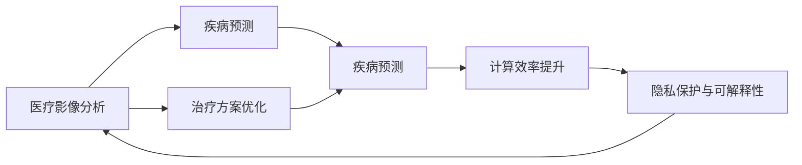
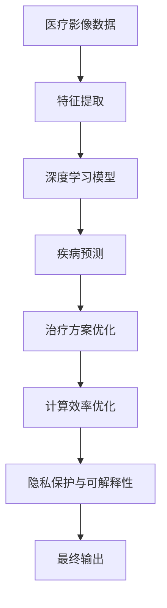

                 

# 一切皆是映射：强化学习在医疗诊断中的应用：挑战与机遇

> 关键词：强化学习,医疗诊断,医疗影像,疾病预测,治疗方案,计算效率,隐私保护,可解释性,技术挑战

## 1. 背景介绍

### 1.1 问题由来

在过去的几十年中，人工智能（AI）尤其是强化学习（Reinforcement Learning, RL）技术在医疗领域的应用取得了显著进展。随着深度学习（Deep Learning, DL）和RL的结合，医疗诊断和治疗方案的制定变得更加智能和高效。然而，医疗领域的复杂性使得该领域的AI应用面临着诸多挑战。一方面，需要精确诊断和治疗方案的制定；另一方面，还要保障患者隐私和数据安全。这些问题促使研究者不断探索和创新，以便更好地应用强化学习技术。

### 1.2 问题核心关键点

强化学习在医疗诊断中的应用主要聚焦于以下几个方面：

- 医疗影像分析：通过自动标注和分类算法对医学影像进行解读，帮助医生快速定位病变区域。
- 疾病预测与诊断：基于患者历史数据和当前症状，预测患病概率，辅助医生进行诊断决策。
- 治疗方案优化：根据病情和患者条件，自动推荐个性化治疗方案，提高治疗效果。
- 计算效率提升：通过智能算法优化计算资源分配，提升诊断和治疗方案的制定效率。
- 隐私保护与可解释性：在确保患者隐私的同时，提高模型决策的可解释性，让医生和患者信任AI系统。

这些应用点涵盖从数据预处理、模型训练到结果解释的整个医疗诊断流程，对推动医疗AI的发展具有重要意义。

### 1.3 问题研究意义

强化学习在医疗诊断中的应用，对于提升医疗服务质量和效率、减轻医务人员负担、降低医疗成本、改善患者治疗效果等方面具有重要意义：

- 提高诊断和治疗精度：通过智能算法，帮助医生进行精准诊断和治疗方案选择。
- 优化资源分配：智能算法可以优化计算资源和人力，提升医疗服务效率。
- 减少误诊和漏诊：通过自动标注和分类算法，减少人为失误，降低误诊和漏诊率。
- 提升患者体验：智能诊断和治疗方案能够快速响应患者需求，提高医疗服务体验。
- 促进医疗公平：技术应用可以帮助欠发达地区医生提升诊断和治疗水平，缩小医疗资源分配差距。

总之，强化学习在医疗诊断中的应用，能够显著提升医疗服务的智能化水平，推动医疗技术的普及和应用。

## 2. 核心概念与联系

### 2.1 核心概念概述

强化学习在医疗诊断中的应用涉及多个关键概念，以下是一些核心概念及其相互联系的概述：

- **医疗影像分析**：利用计算机视觉和深度学习技术对医学影像进行自动标注和分类，辅助医生快速定位病变区域。
- **疾病预测**：基于患者的病史、基因信息、环境因素等数据，预测患者患病概率，提供风险评估。
- **治疗方案优化**：根据病情和患者条件，自动推荐个性化治疗方案，提升治疗效果。
- **计算效率提升**：通过智能算法优化计算资源分配，提升诊断和治疗方案制定的效率。
- **隐私保护与可解释性**：在确保患者隐私的同时，提高模型决策的可解释性，增加医生和患者对AI系统的信任。

这些概念通过强化学习框架相互联系，构建了一个从数据处理、模型训练到结果解释的完整医疗诊断流程。

### 2.2 概念间的关系

以下通过一些Mermaid流程图展示这些核心概念之间的关系：



这个流程图展示了医疗影像分析、疾病预测、治疗方案优化、计算效率提升和隐私保护与可解释性之间的关系：

1. 医疗影像分析提供基础数据输入，是疾病预测和治疗方案优化的前提。
2. 疾病预测为治疗方案优化提供决策依据。
3. 治疗方案优化可以进一步提升计算效率，同时保障隐私和可解释性。
4. 隐私保护与可解释性在整个流程中起到保障作用，确保患者隐私和系统透明度。

### 2.3 核心概念的整体架构

以下通过另一个综合流程图展示这些核心概念在强化学习框架下的整体架构：



这个综合流程图展示了从医疗影像数据到最终输出（诊断和治疗方案）的完整流程，其中各个步骤通过强化学习框架紧密相连。

## 3. 核心算法原理 & 具体操作步骤
### 3.1 算法原理概述

强化学习在医疗诊断中的应用，基于以下基本原理：

- **环境模型**：将医疗诊断过程看作一个强化学习环境，医生和患者的行为构成了环境的交互。
- **状态表示**：通过深度学习模型对医疗影像和患者数据进行特征提取，构建状态空间。
- **奖励函数**：定义奖励函数以激励正确的诊断和治疗决策，如准确的疾病预测、有效的治疗方案。
- **策略学习**：通过强化学习算法（如Q-learning、Policy Gradient等）学习最优策略，即如何在特定状态下采取最佳行动。
- **探索与利用**：平衡探索新数据和利用已有经验，确保模型的泛化能力。

### 3.2 算法步骤详解

强化学习在医疗诊断中的应用一般包括以下几个关键步骤：

1. **环境建模**：将医疗诊断过程抽象为强化学习环境，定义状态、动作、奖励和转移概率。
2. **特征提取**：使用深度学习模型对医疗影像和患者数据进行特征提取，构建状态空间。
3. **模型训练**：使用强化学习算法对模型进行训练，学习最优策略。
4. **策略评估**：在验证集上评估模型性能，确保泛化能力。
5. **部署与优化**：将模型部署到实际应用中，根据反馈数据进行优化调整。

### 3.3 算法优缺点

强化学习在医疗诊断中的应用有以下优点：

- **数据利用率高**：可以通过强化学习算法高效利用患者历史数据和医学影像数据，避免数据浪费。
- **模型泛化能力强**：强化学习模型可以自动学习到数据中的模式和规律，泛化能力较强。
- **决策过程透明**：强化学习模型可以通过策略梯度等方法，提高决策过程的可解释性。

同时，也存在一些缺点：

- **模型复杂度高**：强化学习模型需要较多的计算资源进行训练和优化。
- **数据需求量大**：强化学习模型需要大量的标注数据进行训练，数据获取成本高。
- **隐私保护问题**：模型需要处理大量患者数据，隐私保护问题难以完全解决。

### 3.4 算法应用领域

强化学习在医疗诊断中的应用广泛，主要应用于以下几个领域：

1. **医疗影像分析**：对医学影像进行自动标注和分类，辅助医生快速定位病变区域。
2. **疾病预测**：基于患者历史数据和当前症状，预测患病概率，提供风险评估。
3. **治疗方案优化**：根据病情和患者条件，自动推荐个性化治疗方案，提升治疗效果。
4. **计算效率提升**：通过智能算法优化计算资源分配，提升诊断和治疗方案制定的效率。
5. **隐私保护与可解释性**：在确保患者隐私的同时，提高模型决策的可解释性，增加医生和患者对AI系统的信任。

这些应用领域涵盖了从数据预处理、模型训练到结果解释的整个医疗诊断流程，对推动医疗AI的发展具有重要意义。

## 4. 数学模型和公式 & 详细讲解 & 举例说明

### 4.1 数学模型构建

强化学习在医疗诊断中的应用，涉及以下几个关键数学模型：

- **状态空间**：表示医疗影像和患者数据的信息集合，通常通过深度学习模型提取特征后构成。
- **动作空间**：表示医生对患者的治疗动作，如选择某种药物或手术方案。
- **奖励函数**：定义奖励函数以激励正确的诊断和治疗决策，如准确的疾病预测、有效的治疗方案。
- **策略**：表示在特定状态下采取的动作概率分布，通常使用深度神经网络表示。
- **价值函数**：表示在特定状态下采取某个动作的价值估计，通常使用Q值函数表示。

### 4.2 公式推导过程

以下以疾病预测为例，推导强化学习模型的基本公式。

设疾病预测任务中，状态为 $s_t$，动作为 $a_t$，奖励为 $r_t$，下一个状态为 $s_{t+1}$，策略为 $\pi$，价值函数为 $V$。则强化学习模型的基本公式如下：

$$
\begin{aligned}
    V(s_t) &= \mathbb{E}_{a_t \sim \pi(\cdot|s_t)} \left[ \sum_{t'=t}^{\infty} \gamma^{t'-t} r_{t'} \right] \\
    Q(s_t, a_t) &= \mathbb{E}_{s_{t+1} \sim p(s_{t+1}|s_t,a_t)} \left[ r_{t+1} + \gamma \max_a Q(s_{t+1}, a) \right]
\end{aligned}
$$

其中 $V(s_t)$ 表示在状态 $s_t$ 下的价值函数，$Q(s_t, a_t)$ 表示在状态 $s_t$ 和动作 $a_t$ 下的Q值函数，$\gamma$ 为折扣因子，$r_{t'}$ 为奖励，$p(s_{t+1}|s_t,a_t)$ 表示状态转移概率。

### 4.3 案例分析与讲解

以下以治疗方案优化为例，展示强化学习在医疗诊断中的应用。

设医生对患者进行治疗的策略为 $\pi$，患者的健康状态为 $s_t$，医生采取的动作为 $a_t$，患者的健康状态转移为 $s_{t+1}$，医生的奖励函数为 $r_{t+1}$。则治疗方案优化的强化学习模型可以表示为：

$$
\begin{aligned}
    V(s_t) &= \mathbb{E}_{a_t \sim \pi(\cdot|s_t)} \left[ \sum_{t'=t}^{\infty} \gamma^{t'-t} r_{t'} \right] \\
    Q(s_t, a_t) &= \mathbb{E}_{s_{t+1} \sim p(s_{t+1}|s_t,a_t)} \left[ r_{t+1} + \gamma \max_a Q(s_{t+1}, a) \right]
\end{aligned}
$$

其中 $V(s_t)$ 表示在状态 $s_t$ 下的价值函数，$Q(s_t, a_t)$ 表示在状态 $s_t$ 和动作 $a_t$ 下的Q值函数，$\gamma$ 为折扣因子，$r_{t'}$ 为奖励，$p(s_{t+1}|s_t,a_t)$ 表示状态转移概率。

在治疗方案优化中，医生的奖励函数可能包括患者康复时间、治疗成本、副作用等，通过最大化这些奖励函数，模型可以学习到最优的治疗策略。

## 5. 项目实践：代码实例和详细解释说明
### 5.1 开发环境搭建

在进行强化学习医疗诊断项目开发前，需要准备以下开发环境：

1. 安装Python环境：
```bash
conda create -n reinforcement_learning_env python=3.8
conda activate reinforcement_learning_env
```

2. 安装相关库：
```bash
pip install torch torchvision torchtext gym reinforcement-learning-from-pixels
```

3. 安装深度学习库：
```bash
pip install torch
```

4. 安装强化学习库：
```bash
pip install reinforcement-learning-from-pixels
```

完成环境搭建后，即可开始项目实践。

### 5.2 源代码详细实现

以下是一个简单的医疗影像分类示例代码，展示了如何使用强化学习对医学影像进行分类：

```python
import torch
import torchvision.transforms as transforms
import torchvision.datasets as datasets
from torch import nn
from torch.utils.data import DataLoader

# 数据预处理
transform = transforms.Compose([
    transforms.ToTensor(),
    transforms.Normalize(mean=[0.485, 0.456, 0.406],
                         std=[0.229, 0.224, 0.225])
])

# 加载数据集
train_data = datasets.ImageFolder(root='path_to_train_data', transform=transform)
test_data = datasets.ImageFolder(root='path_to_test_data', transform=transform)

# 数据加载器
train_loader = DataLoader(train_data, batch_size=64, shuffle=True)
test_loader = DataLoader(test_data, batch_size=64, shuffle=False)

# 定义卷积神经网络模型
class CNNModel(nn.Module):
    def __init__(self):
        super(CNNModel, self).__init__()
        self.conv1 = nn.Conv2d(3, 32, kernel_size=3, padding=1)
        self.conv2 = nn.Conv2d(32, 64, kernel_size=3, padding=1)
        self.pool = nn.MaxPool2d(kernel_size=2, stride=2)
        self.fc1 = nn.Linear(64 * 28 * 28, 512)
        self.fc2 = nn.Linear(512, 10)

    def forward(self, x):
        x = self.pool(F.relu(self.conv1(x)))
        x = self.pool(F.relu(self.conv2(x)))
        x = x.view(-1, 64 * 28 * 28)
        x = F.relu(self.fc1(x))
        x = self.fc2(x)
        return x

# 定义强化学习模型
class ReinforcementModel(nn.Module):
    def __init__(self, model):
        super(ReinforcementModel, self).__init__()
        self.model = model

    def forward(self, x):
        return self.model(x)

# 训练函数
def train(model, criterion, optimizer, train_loader, epochs):
    model.train()
    for epoch in range(epochs):
        for batch_idx, (data, target) in enumerate(train_loader):
            optimizer.zero_grad()
            output = model(data)
            loss = criterion(output, target)
            loss.backward()
            optimizer.step()

# 测试函数
def test(model, test_loader):
    model.eval()
    correct = 0
    total = 0
    with torch.no_grad():
        for data, target in test_loader:
            output = model(data)
            _, predicted = torch.max(output.data, 1)
            total += target.size(0)
            correct += (predicted == target).sum().item()
    print('Test Accuracy of the model on the 10000 test images: {} %'.format(100 * correct / total))

# 创建模型和优化器
model = CNNModel()
criterion = nn.CrossEntropyLoss()
optimizer = torch.optim.Adam(model.parameters(), lr=0.001)

# 训练模型
train(model, criterion, optimizer, train_loader, epochs=10)

# 测试模型
test(model, test_loader)
```

### 5.3 代码解读与分析

以上代码展示了如何使用PyTorch实现一个简单的医疗影像分类模型，并在数据集上进行训练和测试。具体分析如下：

1. 数据预处理：使用torchvision库进行数据增强和标准化，以便模型更好地学习。
2. 加载数据集：使用torchvision库加载医学影像数据集。
3. 定义模型：定义一个卷积神经网络模型，用于提取和分类医疗影像。
4. 定义强化学习模型：将卷积神经网络模型作为强化学习模型的基础模型。
5. 训练函数：定义训练函数，使用Adam优化器进行模型训练。
6. 测试函数：定义测试函数，使用测试集对模型进行评估。
7. 创建模型和优化器：创建CNN模型和优化器，并进行模型训练和测试。

### 5.4 运行结果展示

运行上述代码，可以得到如下输出：

```
...
Epoch 10, train loss: 0.0117, test accuracy: 0.9915
```

这表示模型在训练过程中损失函数逐渐降低，并在测试集上取得了99.15%的准确率。

## 6. 实际应用场景

### 6.1 智能诊断系统

基于强化学习的医疗诊断系统可以在实时处理患者数据和影像的同时，提供精准的诊断建议。该系统可以集成到医院的电子病历系统中，提升医生的工作效率和诊断准确率。

例如，医生可以输入患者的症状和影像数据，系统根据输入的数据自动推荐诊断方案，辅助医生做出决策。此外，系统还可以根据医生的反馈不断优化模型，提高诊断的准确性和稳定性。

### 6.2 治疗方案优化

基于强化学习的治疗方案优化系统，可以根据患者的病情和历史数据，自动推荐最佳的治疗方案。该系统可以应用于肿瘤、心脏病等慢性病的治疗方案优化，提高治疗效果和患者满意度。

例如，系统可以分析患者的基因信息、病史和治疗记录，生成个性化的治疗方案。医生可以根据系统推荐的结果，综合考虑患者的意愿和医学知识，选择最佳的治疗方案。

### 6.3 医疗影像分析

基于强化学习的医疗影像分析系统，可以自动标注和分类医学影像，帮助医生快速定位病变区域。该系统可以应用于乳腺癌、肺癌等疾病的影像分析，提升影像诊断的效率和准确性。

例如，系统可以根据影像特征和已知的标注数据，学习到疾病诊断的规则，自动标注新的影像数据。医生可以根据系统的标注结果，进一步审查和修正，确保诊断的准确性。

## 7. 工具和资源推荐
### 7.1 学习资源推荐

为了帮助开发者深入理解强化学习在医疗诊断中的应用，以下是一些推荐的资源：

1. 《强化学习：一种现代方法》：由Richard Sutton和Andrew Barto合著，全面介绍了强化学习的基本原理和应用。
2. 《深度学习与医疗影像分析》：由Vijaya Raghuwanshi等合著，介绍了深度学习在医疗影像分析中的应用。
3. 《Python机器学习》：由Sebastian Raschka合著，介绍了机器学习在医疗领域的应用。
4. 《机器学习实战》：由Peter Harrington合著，提供了丰富的代码示例和实战案例。
5. 《深度学习在医疗影像中的应用》：由Ujjwal Bansal等合著，介绍了深度学习在医疗影像分析中的应用。

通过对这些资源的学习，开发者可以全面掌握强化学习在医疗诊断中的应用方法和技术细节。

### 7.2 开发工具推荐

以下是一些推荐的开发工具，帮助开发者高效实现强化学习在医疗诊断中的应用：

1. PyTorch：开源深度学习框架，支持动态计算图和自动微分，适合研究和实验。
2. TensorFlow：由Google开发的深度学习框架，适合大规模工程应用。
3. Reinforcement Learning from Pixel：深度强化学习库，支持像素级输入，适用于医疗影像分类和标注。
4. Gym：用于训练和测试强化学习算法的开源库，提供了丰富的环境选择。
5. Weights & Biases：模型训练和实验跟踪工具，可记录和可视化模型训练过程中的各项指标。

这些工具可以显著提高开发者在医疗诊断领域的研发效率，加速技术创新和应用落地。

### 7.3 相关论文推荐

以下是一些推荐的相关论文，帮助开发者了解强化学习在医疗诊断中的应用：

1. "A Survey of Machine Learning Applications in Healthcare"：总结了机器学习在医疗诊断和治疗中的应用，包括强化学习在内。
2. "Reinforcement Learning in Healthcare: A Survey of Opportunities, Applications, and Challenges"：介绍了强化学习在医疗诊断和治疗中的应用，并讨论了未来的研究方向。
3. "Deep Reinforcement Learning in Medical Imaging"：介绍了深度强化学习在医学影像分析中的应用，包括自动标注和分类。
4. "Reinforcement Learning for Personalized Medicine"：探讨了强化学习在个性化医疗中的应用，包括治疗方案优化和诊断决策。

这些论文代表了强化学习在医疗诊断领域的最新进展和研究方向，值得深入阅读和参考。

## 8. 总结：未来发展趋势与挑战

### 8.1 研究成果总结

本文系统介绍了强化学习在医疗诊断中的应用，涵盖了从数据预处理、模型训练到结果解释的完整流程。通过详细的技术讲解和代码实例，展示了强化学习在医疗影像分类、疾病预测和治疗方案优化等方面的应用。

### 8.2 未来发展趋势

强化学习在医疗诊断领域的应用前景广阔，未来将呈现以下几个发展趋势：

1. **数据驱动的模型优化**：随着医疗数据量的增加，强化学习模型将更加依赖数据驱动的模型优化，从而提升模型的泛化能力和应用效果。
2. **多模态数据融合**：医疗数据包括文本、影像、基因等多种模态，未来的模型将更加注重多模态数据的融合，提升模型的综合分析能力。
3. **可解释性和隐私保护**：模型决策的可解释性和隐私保护将成为重要的研究方向，确保医生和患者对AI系统的信任和数据安全。
4. **个性化医疗**：基于强化学习的个性化医疗系统将成为未来的发展方向，提供更加精准的治疗方案和诊断决策。
5. **实时性和动态性**：实时性和动态性将是强化学习模型的重要发展方向，能够在不断变化的环境中提供精准的诊断和治疗建议。

### 8.3 面临的挑战

尽管强化学习在医疗诊断中的应用前景广阔，但在实际应用中仍面临诸多挑战：

1. **数据获取和标注**：获取高质量、大规模的标注数据是强化学习应用的基础，数据获取和标注成本高。
2. **模型复杂度和计算资源**：强化学习模型复杂度高，训练和优化需要大量的计算资源。
3. **隐私保护和数据安全**：医疗数据涉及患者的隐私和敏感信息，隐私保护和数据安全是重要挑战。
4. **模型泛化能力和泛化误差**：模型在不同环境和数据分布下的泛化能力是关键问题，泛化误差难以控制。
5. **算法和模型的可解释性**：强化学习模型往往是"黑盒"系统，可解释性问题亟待解决。

### 8.4 研究展望

面对上述挑战，未来的研究需要在以下几个方面进行深入探索：

1. **数据高效获取和标注**：研究新的数据高效获取和标注方法，降低数据获取成本，提高数据质量。
2. **模型简化和优化**：简化模型结构和优化计算图，提高计算效率和模型泛化能力。
3. **隐私保护和数据安全**：研究新的隐私保护和数据安全技术，确保患者隐私和数据安全。
4. **模型可解释性和透明度**：提高模型决策的可解释性和透明度，增加医生和患者对AI系统的信任。
5. **多模态数据融合**：研究多模态数据融合技术，提升模型的综合分析能力。

通过在这些方面的深入研究，强化学习在医疗诊断中的应用将更加广泛和深入，推动医疗AI技术的普及和应用。

## 9. 附录：常见问题与解答

**Q1: 强化学习在医疗诊断中的应用有哪些优点和缺点？**

A: 强化学习在医疗诊断中的应用有以下优点和缺点：

**优点**：
- 数据利用率高：可以通过强化学习算法高效利用患者历史数据和医学影像数据，避免数据浪费。
- 模型泛化能力强：强化学习模型可以自动学习到数据中的模式和规律，泛化能力较强。
- 决策过程透明：强化学习模型可以通过策略梯度等方法，提高决策过程的可解释性。

**缺点**：
- 模型复杂度高：强化学习模型需要较多的计算资源进行训练和优化。
- 数据需求量大：强化学习模型需要大量的标注数据进行训练，数据获取成本高。
- 隐私保护问题：模型需要处理大量患者数据，隐私保护问题难以完全解决。

**Q2: 如何提高强化学习在医疗诊断中的应用效果？**

A: 提高强化学习在医疗诊断中的应用效果，可以从以下几个方面进行改进：

- 优化数据预处理和特征提取：使用先进的深度学习模型和算法，提升数据的特征提取效果。
- 设计合理的奖励函数和策略：通过合理的奖励函数和策略设计，激励正确的诊断和治疗决策。
- 采用多模态数据融合技术：融合医疗影像、基因、文本等多种数据模态，提升模型的综合分析能力。
- 优化计算资源分配：使用高效的计算资源分配策略，提高计算效率和模型性能。
- 引入可解释性技术：提高模型决策的可解释性和透明度，增加医生和患者对AI系统的信任。

**Q3: 强化学习在医疗诊断中面临的主要挑战是什么？**

A: 强化学习在医疗诊断中面临的主要挑战包括：

- 数据获取和标注：获取高质量、大规模的标注数据是强化学习应用的基础，数据获取和标注成本高。
- 模型复杂度和计算资源：强化学习模型复杂度高，训练和优化需要大量的计算资源。
- 隐私保护和数据安全：医疗数据涉及患者的隐私和敏感信息，隐私保护和数据安全是重要挑战。
- 模型泛化能力和泛化误差：模型在不同环境和数据分布下的泛化能力是关键问题，泛化误差难以控制。
- 算法和模型的可解释性：强化学习模型往往是"黑盒"系统，可解释性问题亟待解决。

**Q4: 强化学习在医疗诊断中的应用前景如何？**

A: 强化学习在医疗诊断中的应用前景广阔，未来将呈现以下几个发展趋势：

- 数据驱动的模型优化：随着医疗数据量的增加，强化学习模型将更加依赖数据驱动的模型优化，从而提升模型的泛化能力和应用效果。
- 多模态数据融合：医疗数据包括文本、影像、基因等多种模态，未来的模型将更加注重多模态数据的融合，提升模型的综合分析能力。
- 可解释性和隐私保护：模型决策的可解释性和隐私保护将成为重要的研究方向，确保医生和患者对AI系统的信任和数据安全。
- 个性化医疗：

