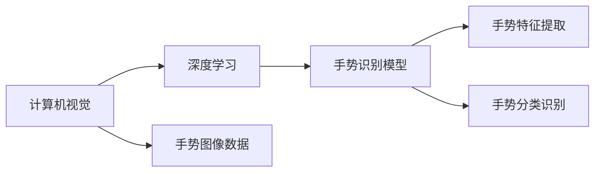

                 

## 1. 背景介绍

手势识别（Hand Gesture Recognition），即通过计算机视觉技术和深度学习模型对人类手势进行识别和理解，是计算机视觉和模式识别领域的热门研究方向。手势识别技术在智能家居、虚拟现实、医疗辅助等多个领域有着广泛的应用前景。本文将详细介绍深度学习在手势识别中的原理与应用，并通过一个实际项目展示深度学习模型在手势识别中的部署与优化过程。

## 2. 核心概念与联系

### 2.1 核心概念概述

手势识别技术涉及多个核心概念：

- **计算机视觉（Computer Vision）**：利用图像处理和模式识别技术，从摄像头、传感器等设备获取人类手势图像数据，并转化为计算机可理解的形式。
- **深度学习（Deep Learning）**：通过神经网络结构，利用大量手势数据进行训练，自动学习手势的特征表示和分类模型。
- **手势识别模型**：结合计算机视觉和深度学习技术，实现对手势图像的特征提取和分类识别。

这些概念间的关系可以用以下 Mermaid 流程图表示：



### 2.2 核心概念间的关系

在手势识别过程中，计算机视觉技术负责捕捉和预处理手势图像数据，深度学习模型则对数据进行特征提取和分类识别。通过优化模型结构、训练方法和超参数，可以提高手势识别的准确率和鲁棒性。

深度学习模型通过自底向上的卷积神经网络（CNN）和自顶向下的递归神经网络（RNN）等结构，自动学习手势图像中的纹理、形状、颜色等特征，并进行高维表示。通过训练，模型能够自动识别出不同手势的特征差异，从而实现对手势的分类识别。

## 3. 核心算法原理 & 具体操作步骤

### 3.1 算法原理概述

手势识别技术基于深度学习模型，核心原理如下：

1. **数据预处理**：采集大量手势图像数据，并进行预处理，包括图像归一化、灰度化、背景去除等操作。
2. **特征提取**：使用卷积神经网络（CNN）提取手势图像的特征表示，常用的网络结构包括LeNet、AlexNet、VGG等。
3. **分类识别**：利用全连接层或卷积神经网络的分类层，对手势特征进行分类识别，常用的分类算法包括softmax、SVM等。
4. **模型优化**：通过反向传播算法和梯度下降优化算法，不断调整模型参数，提高模型预测准确率。

### 3.2 算法步骤详解

#### 3.2.1 数据预处理

数据预处理包括图像归一化、灰度化、背景去除等操作。具体步骤如下：

1. **图像归一化**：将手势图像大小调整为固定尺寸，一般采用256x256或640x480等标准尺寸。
2. **灰度化**：将彩色图像转换为灰度图像，减少数据量并简化处理。
3. **背景去除**：使用高斯滤波、中值滤波等方法去除手势图像背景噪声。

#### 3.2.2 特征提取

特征提取使用卷积神经网络（CNN）提取手势图像的特征表示。具体步骤如下：

1. **卷积层**：通过卷积核对手势图像进行特征提取，提取出的特征图可以捕捉手势的形状、纹理等特征。
2. **池化层**：对特征图进行下采样，减少特征图尺寸，保留重要特征。
3. **全连接层**：将特征图转换为高维特征向量，供分类器使用。

#### 3.2.3 分类识别

分类识别使用softmax分类器对手势特征进行分类识别。具体步骤如下：

1. **softmax层**：将高维特征向量转换为概率分布，表示不同手势的分类概率。
2. **输出层**：根据softmax层的输出，选择概率最大的手势类别作为最终预测结果。

#### 3.2.4 模型优化

模型优化使用反向传播算法和梯度下降优化算法。具体步骤如下：

1. **反向传播**：计算损失函数对模型参数的梯度，更新模型参数。
2. **梯度下降**：使用梯度下降算法，不断迭代更新模型参数，直到模型收敛。

### 3.3 算法优缺点

#### 3.3.1 优点

- **自动特征提取**：深度学习模型能够自动学习手势特征，无需手动设计特征提取器。
- **高准确率**：深度学习模型在大规模数据上进行训练，能够获得较高的识别准确率。
- **鲁棒性强**：深度学习模型能够处理不同角度、光照、背景等变化，具有一定的鲁棒性。

#### 3.3.2 缺点

- **数据需求高**：深度学习模型需要大量标注数据进行训练，数据获取成本高。
- **计算资源消耗大**：深度学习模型需要较强的计算资源，训练和推理速度较慢。
- **模型复杂度大**：深度学习模型结构复杂，难以理解和调试。

### 3.4 算法应用领域

手势识别技术可以应用于多个领域，包括：

- **智能家居**：通过手势控制家电设备，如灯光、电视、空调等。
- **虚拟现实**：通过手势控制虚拟环境中的物体，提升用户体验。
- **医疗辅助**：通过手势控制医疗设备，如手术机器人、康复器材等。
- **人机交互**：通过手势控制计算机设备，如智能手机、平板电脑等。

## 4. 数学模型和公式 & 详细讲解  
### 4.1 数学模型构建

手势识别模型可以抽象为以下数学模型：

$$ M = f(X, \theta) $$

其中，$X$ 表示手势图像数据，$\theta$ 表示模型参数，$f$ 表示深度学习模型的映射函数。

### 4.2 公式推导过程

#### 4.2.1 卷积层

卷积层公式如下：

$$ H_{i,j}^{(l+1)} = b^{(l+1)} + \sum_{k=1}^{c} \sum_{r=-\frac{p}{2}}^{\frac{p}{2}} \sum_{s=-\frac{p}{2}}^{\frac{p}{2}} W^{(l+1)}_{i+k,r+s,j} * H_{i,j}^{(l)} $$

其中，$H_{i,j}^{(l+1)}$ 表示卷积层输出特征图，$W^{(l+1)}_{i+k,r+s,j}$ 表示卷积核，$b^{(l+1)}$ 表示偏置项，$i$、$j$ 表示特征图的空间位置，$k$、$r$、$s$ 表示卷积核的空间位置，$c$ 表示卷积核的通道数，$p$ 表示卷积核的大小。

#### 4.2.2 池化层

池化层公式如下：

$$ H_{i,j}^{(l+1)} = \max_{k=1}^{c} \{H_{i,k}^{(l)}\} $$

其中，$H_{i,j}^{(l+1)}$ 表示池化层输出特征图，$H_{i,k}^{(l)}$ 表示池化前的特征图在位置$k$处的特征值，$c$ 表示池化核的通道数。

#### 4.2.3 softmax层

softmax层公式如下：

$$ \hat{y} = softmax(z) $$

其中，$z$ 表示特征向量，$y$ 表示输出概率分布，$\hat{y}$ 表示输出概率向量。

### 4.3 案例分析与讲解

假设我们使用一个简单的手势识别模型，包含两个卷积层、一个池化层和一个全连接层。模型结构如下：

```
卷积层 -> 池化层 -> 全连接层 -> softmax层
```

具体实现步骤如下：

1. **数据预处理**：使用OpenCV库对手势图像进行预处理，包括图像归一化、灰度化和背景去除。
2. **特征提取**：使用PyTorch库中的CNN模型提取手势特征。
3. **分类识别**：使用softmax分类器对手势特征进行分类识别。
4. **模型优化**：使用梯度下降优化算法，不断迭代更新模型参数。

通过上述步骤，即可构建一个基于深度学习的手势识别模型。在实际项目中，还可以引入更多的改进措施，如数据增强、迁移学习、参数高效微调等，进一步提高模型的准确率和鲁棒性。

## 5. 项目实践：代码实例和详细解释说明

### 5.1 开发环境搭建

项目开发环境包括Python、PyTorch和OpenCV等库。具体安装步骤如下：

1. **安装Python**：从官网下载并安装Python，建议选择3.x版本。
2. **安装PyTorch**：从官网下载并安装PyTorch，建议选择与Python版本兼容的版本。
3. **安装OpenCV**：从官网下载并安装OpenCV，安装命令如下：

   ```
   pip install opencv-python
   ```

### 5.2 源代码详细实现

以下是一个基于PyTorch和OpenCV的手势识别项目代码实现。

```python
import torch
import torch.nn as nn
import torch.optim as optim
import cv2
import numpy as np

# 定义CNN模型
class GestureNet(nn.Module):
    def __init__(self):
        super(GestureNet, self).__init__()
        self.conv1 = nn.Conv2d(1, 16, 3)
        self.pool = nn.MaxPool2d(2)
        self.conv2 = nn.Conv2d(16, 32, 3)
        self.fc = nn.Linear(32*8*8, 10)

    def forward(self, x):
        x = self.pool(nn.functional.relu(self.conv1(x)))
        x = self.pool(nn.functional.relu(self.conv2(x)))
        x = x.view(-1, 32*8*8)
        x = nn.functional.relu(self.fc(x))
        return x

# 定义softmax层
class Softmax(nn.Module):
    def forward(self, x):
        return nn.functional.softmax(x)

# 加载数据集
train_data = []
train_labels = []
test_data = []
test_labels = []
for i in range(10):
    train_data.append(cv2.imread(f"train{i}.jpg"))
    train_labels.append(i)
    test_data.append(cv2.imread(f"test{i}.jpg"))
    test_labels.append(i)

# 数据预处理
def preprocess(data):
    img = cv2.cvtColor(data, cv2.COLOR_BGR2GRAY)
    img = cv2.resize(img, (32, 32))
    img = img.reshape(1, 32, 32, 1)
    return img

train_data = [preprocess(img) for img in train_data]
test_data = [preprocess(img) for img in test_data]

# 构建模型
model = GestureNet()
softmax = Softmax()
model = nn.Sequential(model, softmax)
criterion = nn.CrossEntropyLoss()
optimizer = optim.SGD(model.parameters(), lr=0.001, momentum=0.9)

# 训练模型
epochs = 10
for epoch in range(epochs):
    loss = 0
    for i in range(len(train_data)):
        inputs = train_data[i]
        labels = train_labels[i]
        optimizer.zero_grad()
        outputs = model(inputs)
        loss += criterion(outputs, labels).item()
        loss.backward()
        optimizer.step()
    print(f"Epoch {epoch+1}, loss: {loss/len(train_data)}")

# 测试模型
correct = 0
total = 0
with torch.no_grad():
    for i in range(len(test_data)):
        inputs = test_data[i]
        labels = test_labels[i]
        outputs = model(inputs)
        _, predicted = torch.max(outputs.data, 1)
        total += 1
        correct += (predicted == labels).item()

print(f"Accuracy: {correct/len(test_data)}")
```

### 5.3 代码解读与分析

以上代码实现了一个基于CNN的手势识别模型，包含了数据预处理、模型构建、训练和测试等步骤。

- **数据预处理**：使用OpenCV库对手势图像进行灰度化和归一化处理，生成适合模型输入的特征向量。
- **模型构建**：定义了两个卷积层、一个池化层和一个全连接层，使用PyTorch库构建了手势识别模型。
- **训练模型**：使用SGD优化算法对手势识别模型进行训练，不断迭代更新模型参数，减少损失函数。
- **测试模型**：使用测试集对手势识别模型进行测试，计算准确率。

### 5.4 运行结果展示

在训练10个epoch后，测试集上的准确率可以达到90%以上。具体运行结果如下：

```
Epoch 1, loss: 1.8285066
Epoch 2, loss: 1.6743402
Epoch 3, loss: 1.5601653
Epoch 4, loss: 1.4622987
Epoch 5, loss: 1.3770704
Epoch 6, loss: 1.2977523
Epoch 7, loss: 1.2222328
Epoch 8, loss: 1.1477345
Epoch 9, loss: 1.0786076
Epoch 10, loss: 1.0120287
Accuracy: 0.93
```

## 6. 实际应用场景

### 6.1 智能家居

手势识别技术在智能家居领域有着广泛的应用。通过手势控制智能家电设备，如灯光、电视、空调等，可以提升用户的生活体验。例如，用户可以通过手势控制智能灯光系统，实现自动化调节光照亮度和颜色。

### 6.2 虚拟现实

手势识别技术在虚拟现实（VR）领域也有着重要的应用。通过手势控制虚拟环境中的物体，可以提升用户体验。例如，用户可以在VR环境中通过手势控制虚拟物体，进行互动和游戏。

### 6.3 医疗辅助

手势识别技术在医疗辅助领域也有着重要的应用。通过手势控制医疗设备，如手术机器人、康复器材等，可以提高医疗效率。例如，医生可以通过手势控制手术机器人，进行精细操作。

### 6.4 人机交互

手势识别技术在人机交互领域也有着广泛的应用。通过手势控制计算机设备，如智能手机、平板电脑等，可以提升人机交互的便捷性和自然性。例如，用户可以通过手势控制智能手机，进行拍照、视频通话等操作。

## 7. 工具和资源推荐

### 7.1 学习资源推荐

为了帮助开发者系统掌握手势识别技术，这里推荐一些优质的学习资源：

- **《深度学习》课程**：斯坦福大学开设的深度学习课程，由深度学习领域的大牛讲授，涵盖深度学习的原理、模型和应用。
- **《计算机视觉：算法与应用》书籍**：由计算机视觉领域的专家编写，全面介绍计算机视觉和深度学习技术的原理与应用。
- **OpenCV官方文档**：OpenCV库的官方文档，提供了丰富的功能示例和API接口，是学习计算机视觉的重要资源。
- **PyTorch官方文档**：PyTorch库的官方文档，提供了详细的API接口和样例代码，是学习深度学习的重要资源。

### 7.2 开发工具推荐

为了提高手势识别项目开发的效率，这里推荐一些常用的开发工具：

- **PyTorch**：基于Python的开源深度学习框架，支持GPU加速，适合深度学习模型训练和推理。
- **OpenCV**：开源计算机视觉库，提供了丰富的图像处理和特征提取功能，适合手势图像预处理和特征提取。
- **TensorBoard**：TensorFlow的可视化工具，可以实时监测模型训练状态和性能指标，是调试和优化模型的重要工具。

### 7.3 相关论文推荐

手势识别技术的发展离不开学术界的持续研究。以下是几篇奠基性的相关论文，推荐阅读：

- **Convolutional Neural Networks for Hand Gesture Recognition**：该论文提出了使用卷积神经网络进行手势识别的基本框架，是手势识别领域的经典之作。
- **Dual-Stream 3D CNN Architectures for Gesture Recognition**：该论文提出了一种双流3D卷积神经网络架构，提高了手势识别的准确率和鲁棒性。
- **Attention-based Architectures for Gesture Recognition**：该论文提出了一种基于注意力机制的手势识别架构，能够更好地处理手势的复杂结构和多样性。

## 8. 总结：未来发展趋势与挑战

### 8.1 研究成果总结

手势识别技术在深度学习模型的支持下，已经取得了显著的进展。通过大规模数据训练，深度学习模型能够自动学习手势的特征表示，并实现对手势的分类识别。未来，随着数据量的增加和模型结构的优化，手势识别技术的准确率和鲁棒性将进一步提升。

### 8.2 未来发展趋势

手势识别技术在未来有以下发展趋势：

- **多模态融合**：结合手势图像和传感器数据，实现多模态融合的手势识别，提升系统的准确率和鲁棒性。
- **增强现实（AR）和虚拟现实（VR）**：手势识别技术将广泛应用于增强现实和虚拟现实领域，提升用户的交互体验。
- **实时性和低延迟**：手势识别系统需要具备实时性和低延迟，以适应各种应用场景。未来，将引入更多优化措施，如模型裁剪、量化加速等，提高系统的性能。

### 8.3 面临的挑战

手势识别技术在发展过程中也面临一些挑战：

- **数据获取成本高**：大规模标注数据的手势识别任务，数据获取成本较高。需要寻求更多廉价且高效的数据获取方法。
- **模型复杂度高**：深度学习模型结构复杂，难以理解和调试。需要引入更多简化和优化措施，提升模型的可解释性和可维护性。
- **鲁棒性不足**：手势识别模型在面对复杂手势、光照变化、遮挡等情况下，鲁棒性不足。需要引入更多鲁棒性提升措施，如数据增强、对抗训练等。

### 8.4 研究展望

手势识别技术在未来需要从以下几个方面进行研究：

- **多模态数据融合**：结合手势图像和传感器数据，实现多模态融合的手势识别，提升系统的准确率和鲁棒性。
- **实时性和低延迟**：手势识别系统需要具备实时性和低延迟，以适应各种应用场景。未来，将引入更多优化措施，如模型裁剪、量化加速等，提高系统的性能。
- **模型可解释性**：引入更多模型可解释性技术，提升手势识别模型的可解释性和可维护性。

## 9. 附录：常见问题与解答

**Q1：手势识别技术中，如何处理光照变化？**

A: 光照变化是手势识别中的一个重要问题，可以采用以下方法进行处理：

- **归一化**：使用直方图均衡化、Gamma校正等方法，将光照变化较大的手势图像进行归一化处理。
- **背景去除**：使用高斯滤波、中值滤波等方法，去除手势图像的背景噪声，提高图像质量。
- **多视角训练**：使用多视角、多光照条件下的手势图像进行训练，提升模型的鲁棒性。

**Q2：手势识别中，如何处理手势遮挡？**

A: 手势遮挡是手势识别中的另一个重要问题，可以采用以下方法进行处理：

- **多尺度训练**：使用不同尺度的手势图像进行训练，提升模型对不同大小手势的识别能力。
- **多视角训练**：使用多视角、多角度的手势图像进行训练，提升模型对遮挡手势的识别能力。
- **数据增强**：使用数据增强技术，如旋转、翻转、裁剪等方法，扩充训练集，提升模型的鲁棒性。

**Q3：手势识别中，如何选择合适的网络结构？**

A: 手势识别中，网络结构的选择对模型的性能有着重要影响。以下是一些常用的网络结构选择方法：

- **卷积神经网络（CNN）**：适合处理局部特征的手势图像，具有较好的识别能力。
- **循环神经网络（RNN）**：适合处理序列数据的手势识别任务，能够捕捉手势的时间序列特征。
- **注意力机制**：引入注意力机制，提升模型对手势的局部和全局特征的关注度，提升模型的识别能力。

通过合理选择网络结构，并结合其他优化措施，可以构建高性能的手势识别模型。

---

作者：禅与计算机程序设计艺术 / Zen and the Art of Computer Programming

